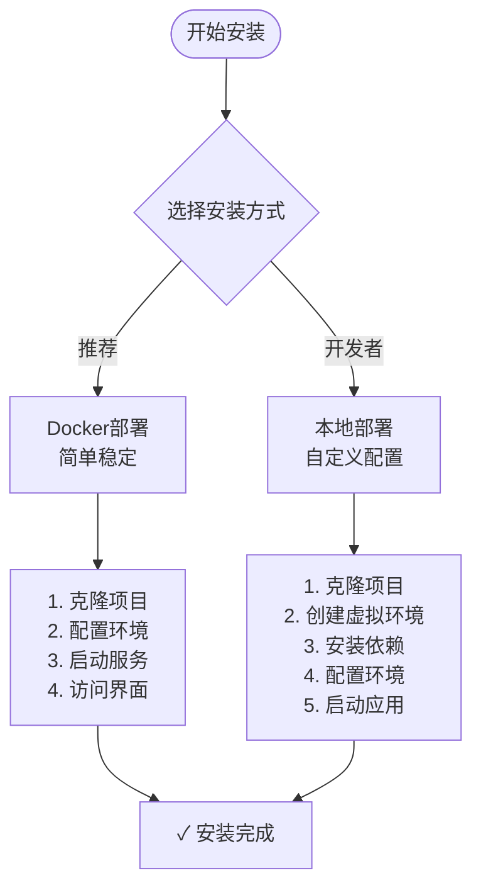
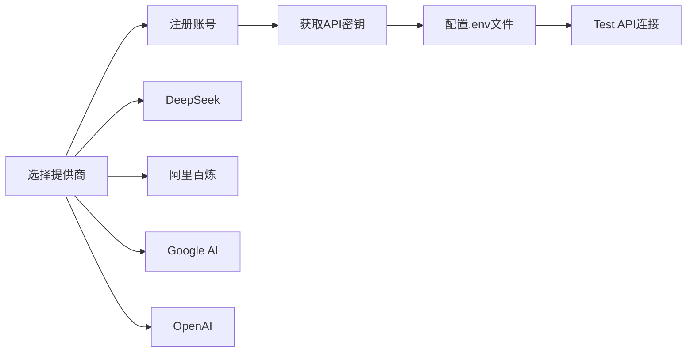
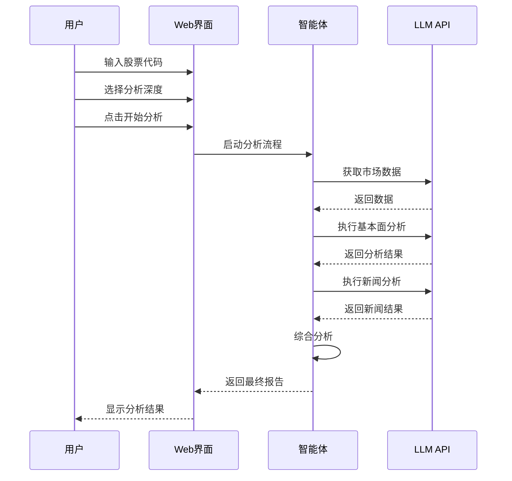

# 快速入门指南

<cite>
**本文档中引用的文件**
- [README.md](file://README.md)
- [QUICKSTART.md](file://QUICKSTART.md)
- [requirements.txt](file://requirements.txt)
- [pyproject.toml](file://pyproject.toml)
- [examples/test_installation.py](file://examples/test_installation.py)
- [scripts/setup/quick_install.py](file://scripts/setup/quick_install.py)
- [start_web.py](file://start_web.py)
- [docker-compose.yml](file://docker-compose.yml)
- [scripts/setup/install_packages.bat](file://scripts/setup/install_packages.bat)
- [scripts/setup/install_packages_venv.bat](file://scripts/setup/install_packages_venv.bat)
- [scripts/validation/check_dependencies.py](file://scripts/validation/check_dependencies.py)
</cite>

## 目录
1. [简介](#简介)
2. [系统要求](#系统要求)
3. [安装方式选择](#安装方式选择)
4. [Docker部署（推荐）](#docker部署推荐)
5. [本地部署](#本地部署)
6. [配置API密钥](#配置api密钥)
7. [验证安装](#验证安装)
8. [运行第一个分析任务](#运行第一个分析任务)
9. [常见问题解决](#常见问题解决)
10. [下一步](#下一步)

## 简介

TradingAgents-CN是一个基于多智能体大语言模型的中文金融交易决策框架，专为中文用户优化，提供完整的A股/港股/美股分析能力。本指南将帮助您在10分钟内完成环境搭建并运行第一个分析任务。

### 核心特性
- **多市场支持**: A股、港股、美股一站式分析
- **多智能体协作**: 市场分析、基本面分析、新闻分析、研究员辩论
- **实时进度跟踪**: 可视化分析过程，智能时间预估
- **专业报告导出**: 支持Markdown/Word/PDF格式
- **Docker容器化**: 一键部署，环境隔离

## 系统要求

### 基础要求
- **Python**: 3.10+ (推荐3.11+)
- **内存**: 4GB+ RAM (推荐8GB+)
- **网络**: 稳定的互联网连接
- **磁盘空间**: 2GB+ 可用空间

### 推荐配置
- **CPU**: 多核处理器
- **内存**: 8GB+ RAM
- **操作系统**: Windows 10+/Linux/macOS

## 安装方式选择

TradingAgents-CN提供两种主要安装方式：



**图表来源**
- [scripts/setup/quick_install.py](file://scripts/setup/quick_install.py#L1-L50)

## Docker部署（推荐）

Docker部署是最简单的方式，适合快速体验和生产环境使用。

### 第一步：克隆项目

```bash
# 克隆项目到本地
git clone https://github.com/hsliuping/TradingAgents-CN.git
cd TradingAgents-CN
```

### 第二步：配置环境变量

```bash
# 复制配置模板
cp .env.example .env

# 编辑.env文件，填入API密钥
# 使用文本编辑器打开 .env 文件
# 示例配置：
DASHSCOPE_API_KEY=sk-your_dashscope_api_key_here
FINNHUB_API_KEY=your_finnhub_api_key_here
TUSHARE_TOKEN=your_tushare_token_here
```

### 第三步：启动服务

```bash
# 方式1：一键启动（推荐）
docker-compose up -d

# 方式2：分步启动
docker-compose up -d --build  # 首次运行需要构建镜像
docker-compose up -d         # 后续启动
```

### 第四步：验证安装

```bash
# 检查服务状态
docker-compose ps

# 查看应用日志
docker logs TradingAgents-web
```

### 访问应用

- **Web界面**: http://localhost:8501
- **数据库管理**: http://localhost:8081 (可选)
- **缓存管理**: http://localhost:8082 (可选)

**章节来源**
- [QUICKSTART.md](file://QUICKSTART.md#L1-L50)
- [docker-compose.yml](file://docker-compose.yml#L1-L50)

## 本地部署

本地部署适合开发者和需要自定义配置的用户。

### 第一步：克隆项目

```bash
git clone https://github.com/hsliuping/TradingAgents-CN.git
cd TradingAgents-CN
```

### 第二步：创建虚拟环境

```bash
# 创建虚拟环境
python -m venv env

# 激活虚拟环境
# Windows
env\Scripts\activate
# Linux/macOS
source env/bin/activate
```

### 第三步：升级pip

```bash
# 重要！升级pip避免安装错误
python -m pip install --upgrade pip
```

### 第四步：安装依赖

```bash
# 安装项目依赖
pip install -e .

# 或者使用预设脚本
# Windows
scripts\setup\install_packages.bat
# Linux/macOS
chmod +x scripts/setup/install_packages.sh && ./scripts/setup/install_packages.sh
```

### 第五步：配置环境变量

```bash
# 复制配置模板
cp .env.example .env

# 编辑.env文件，填入API密钥
# 使用文本编辑器打开 .env 文件
```

### 第六步：启动应用

```bash
# 方法1：使用简化启动脚本（推荐）
python start_web.py

# 方法2：直接使用Streamlit
python -m streamlit run web/app.py

# 方法3：使用项目启动脚本
python web/run_web.py
```

**章节来源**
- [scripts/setup/install_packages.bat](file://scripts/setup/install_packages.bat#L1-L44)
- [start_web.py](file://start_web.py#L1-L90)

## 配置API密钥

### 必需的API密钥

TradingAgents-CN支持多个AI模型提供商，每个都需要相应的API密钥：

| 提供商 | 获取地址 | 特色 | 成本 |
|--------|----------|------|------|
| **DeepSeek** | [platform.deepseek.com](https://platform.deepseek.com/) | 工具调用，中文优化 | 💰 极低 |
| **阿里百炼** | [dashscope.aliyun.com](https://dashscope.aliyun.com/) | 中文理解，响应快 | 💰 低 |
| **Google AI** | [aistudio.google.com](https://aistudio.google.com/) | 推理能力，多模态 | 💰💰 中等 |
| **OpenAI** | [platform.openai.com](https://platform.openai.com/) | 通用能力强 | 💰💰💰 高 |

### 配置步骤

1. **复制配置文件**：
```bash
cp .env.example .env
```

2. **编辑.env文件**：
```bash
# === LLM模型配置 (至少选择一个) ===
DASHSCOPE_API_KEY=sk-your_dashscope_api_key_here
FINNHUB_API_KEY=your_finnhub_api_key_here
TUSHARE_TOKEN=your_tushare_token_here
```

3. **可选配置**：
```bash
# 数据源配置
TUSHARE_TOKEN=your_tushare_token
FINNHUB_API_KEY=your_finnhub_key

# 数据库配置（Docker自动配置）
MONGODB_URL=mongodb://mongodb:27017/tradingagents
REDIS_URL=redis://redis:6379

# 导出功能配置
EXPORT_ENABLED=true
EXPORT_DEFAULT_FORMAT=word,pdf
```

### API密钥获取指南



**图表来源**
- [scripts/setup/quick_install.py](file://scripts/setup/quick_install.py#L100-L150)

**章节来源**
- [QUICKSTART.md](file://QUICKSTART.md#L50-L100)

## 验证安装

### 使用安装验证脚本

项目提供了专门的安装验证脚本，可以全面检查系统状态：

```bash
# 运行安装验证
python examples/test_installation.py
```

### 验证内容

安装验证脚本会检查以下项目：

1. **Python版本**：确保版本 >= 3.10
2. **虚拟环境**：检查是否在虚拟环境中运行
3. **核心模块**：验证主要模块能否正常导入
4. **依赖包**：检查所有必要依赖是否安装
5. **配置文件**：验证配置文件是否存在
6. **环境变量**：检查API密钥配置状态
7. **Web应用**：验证Web界面文件完整性
8. **数据目录**：检查必要的数据目录

### 预期输出

```bash
🚀 开始安装验证测试...
============================================================
✅ Python版本: 3.11.5
✅ 虚拟环境: 已激活
✅ 核心模块: tradingagents
✅ 核心模块: tradingagents.config
✅ 依赖包: streamlit (Web框架)
✅ 依赖包: pandas (数据处理)
✅ 配置文件: VERSION (版本文件)
✅ 环境变量文件: .env 存在
✅ Web文件: web/app.py (Streamlit主应用)
✅ 数据目录: data (已存在)

📊 测试总结
============================================================
✅ 成功项目:
  ✅ Python版本: 3.11.5
  ✅ 虚拟环境: 已激活
  ✅ 核心模块: tradingagents
  ✅ 依赖包: streamlit (Web框架)
  ✅ 配置文件: VERSION (版本文件)
  ✅ 环境变量文件: .env 存在
  ✅ Web文件: web/app.py (Streamlit主应用)
  ✅ 数据目录: data (已存在)

📈 测试统计:
  总测试数: 8
  通过测试: 8
  失败测试: 0
  成功率: 100.0%

🎉 恭喜！安装验证全部通过！
   你可以开始使用TradingAgents-CN了！
   运行: python start_web.py
```

### 手动验证

如果验证脚本无法运行，可以手动检查：

```bash
# 检查Python版本
python --version

# 检查核心模块
python -c "import tradingagents; print('✓ 核心模块导入成功')"

# 检查依赖包
python -c "import streamlit, pandas; print('✓ 依赖包导入成功')"

# 检查环境变量
python -c "import os; print('API密钥配置:', bool(os.getenv('DASHSCOPE_API_KEY')))"
```

**章节来源**
- [examples/test_installation.py](file://examples/test_installation.py#L1-L50)

## 运行第一个分析任务

### 启动Web界面

```bash
# 启动Web应用
python start_web.py
```

### 访问界面

打开浏览器访问：http://localhost:8501

### 分析配置

1. **选择LLM模型**：DeepSeek V3 / 通义千问 / Gemini
2. **输入股票代码**：`000001` (A股) / `AAPL` (美股) / `0700.HK` (港股)
3. **选择分析深度**：快速 / 标准 / 深度
4. **开始分析**：点击"🚀 开始分析"按钮

### 实时进度跟踪



**图表来源**
- [start_web.py](file://start_web.py#L30-L80)

### 分析结果

分析完成后，您可以看到：

1. **实时进度**：可视化分析过程
2. **投资建议**：明确的买入/持有/卖出建议
3. **多维分析**：技术面、基本面、新闻面综合评估
4. **量化指标**：置信度、风险评分、目标价位
5. **专业报告**：支持多种格式导出

### 导出报告

```bash
# 支持的导出格式
- Markdown：在线查看，版本控制
- Word：商业报告，编辑修改
- PDF：正式发布，打印存档
```

**章节来源**
- [QUICKSTART.md](file://QUICKSTART.md#L150-L250)

## 常见问题解决

### 安装问题

#### 1. 依赖安装失败

**问题症状**：
```bash
ERROR: Could not find a version that satisfies the requirement xxx
```

**解决方案**：
```bash
# 使用国内镜像源
pip install -r requirements.txt -i https://pypi.tuna.tsinghua.edu.cn/simple/

# 或使用预设脚本
# Windows
scripts\setup\install_packages.bat

# Linux/macOS
chmod +x scripts/setup/install_packages.sh && ./scripts/setup/install_packages.sh
```

#### 2. Python版本不兼容

**问题症状**：
```bash
RuntimeError: TradingAgents requires Python 3.10+
```

**解决方案**：
```bash
# 升级Python到3.10+
# 下载地址：https://www.python.org/downloads/

# 或使用版本管理工具
pyenv install 3.11.5
pyenv local 3.11.5
```

#### 3. 虚拟环境问题

**问题症状**：
```bash
ModuleNotFoundError: No module named 'xxx'
```

**解决方案**：
```bash
# 重新创建虚拟环境
rm -rf env
python -m venv env
source env/bin/activate  # Linux/macOS
# 或
env\Scripts\activate.bat  # Windows
```

### 运行时问题

#### 1. API密钥配置错误

**问题症状**：
```bash
Error: API key not found
```

**解决方案**：
```bash
# 检查.env文件
cat .env

# 确保API密钥格式正确
DASHSCOPE_API_KEY=sk-your_actual_key_here
```

#### 2. 网络连接问题

**问题症状**：
```bash
ConnectionError: Failed to connect to API
```

**解决方案**：
```bash
# 检查网络连接
ping api.deepseek.com

# 检查防火墙设置
# Windows:
netsh advfirewall firewall add rule name="TradingAgents" dir=in action=allow program="%USERPROFILE%\env\python.exe"

# Linux/macOS:
sudo ufw allow out to any port 443
```

#### 3. 数据库连接问题

**问题症状**：
```bash
MongoDB connection failed
Redis connection failed
```

**解决方案**：
```bash
# 检查数据库服务状态
# Docker环境
docker-compose ps

# 本地环境
# MongoDB
mongo --host localhost --port 27017

# Redis
redis-cli ping
```

### 性能优化

#### 1. 分析速度慢

**优化方案**：
```bash
# 选择更快的模型
DASHSCOPE_API_KEY=sk-your_fast_model_key_here

# 启用缓存
REDIS_ENABLED=true

# 选择快速分析深度
# 在Web界面选择"快速分析" (2-4分钟)
```

#### 2. 内存不足

**问题症状**：
```bash
MemoryError: Unable to allocate array
```

**解决方案**：
```bash
# 禁用内存密集功能
MEMORY_ENABLED=false

# 减少并发分析
MAX_CONCURRENT_ANALYSES=1
```

### 故障排除工具

#### 系统状态检查

```bash
# 检查系统依赖
python scripts/validation/check_dependencies.py

# 检查环境配置
python scripts/validation/check_system_status.py
```

#### 日志分析

```bash
# 查看应用日志
tail -f logs/tradingagents.log

# 查看Docker日志
docker logs TradingAgents-web
```

**章节来源**
- [scripts/validation/check_dependencies.py](file://scripts/validation/check_dependencies.py#L1-L100)

## 下一步

恭喜！您已经成功完成了TradingAgents-CN的安装和第一次分析任务。

### 推荐学习路径

1. **深入使用**
   - 阅读完整文档：[docs/](./docs/)
   - 学习Web界面详细使用指南
   - 探索CLI工具使用方法

2. **开发环境**
   - 设置开发环境：[开发指南](./docs/DEVELOPMENT_SETUP.md)
   - 了解项目架构：[技术架构](./docs/architecture/)
   - 学习配置管理：[配置指南](./docs/configuration/)

3. **故障排除**
   - 查看常见问题解答：[故障排除](./docs/troubleshooting/)
   - 学习调试技巧：[调试指南](./docs/debugging/)

4. **参与贡献**
   - 报告问题：[GitHub Issues](https://github.com/hsliuping/TradingAgents-CN/issues)
   - 功能建议：[讨论区](https://github.com/hsliuping/TradingAgents-CN/discussions)
   - 提交代码：[Pull Requests](https://github.com/hsliuping/TradingAgents-CN/pulls)
   - 完善文档：[文档贡献](https://github.com/hsliuping/TradingAgents-CN/tree/develop/docs)

### 快速参考

```bash
# 常用命令
python start_web.py                    # 启动Web应用
python examples/cli_demo.py           # CLI演示
python examples/simple_analysis_demo.py # 简单分析演示

# Docker命令
docker-compose up -d                  # 启动所有服务
docker-compose down                   # 停止所有服务
docker-compose logs web               # 查看应用日志

# 验证命令
python examples/test_installation.py  # 安装验证
python scripts/validation/check_system_status.py # 系统检查
```

### 技术支持

- **GitHub Issues**: [报告问题](https://github.com/hsliuping/TradingAgents-CN/issues)
- **文档中心**: [完整文档](./docs/)
- **社区论坛**: [讨论交流](https://github.com/hsliuping/TradingAgents-CN/discussions)

祝您在TradingAgents-CN的使用过程中获得丰富的投资洞察和愉快的体验！