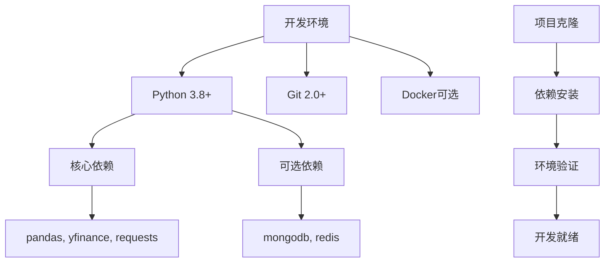
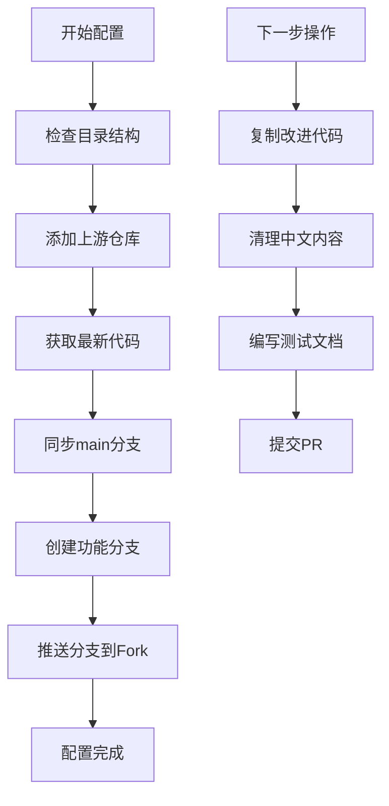
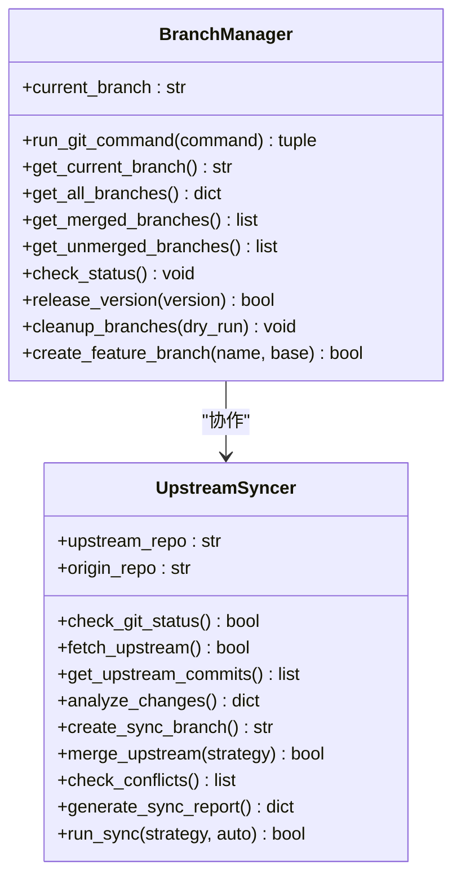
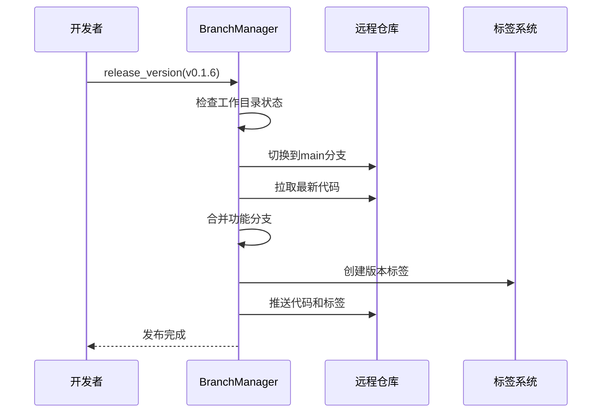
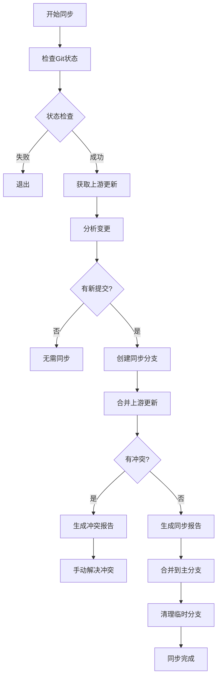
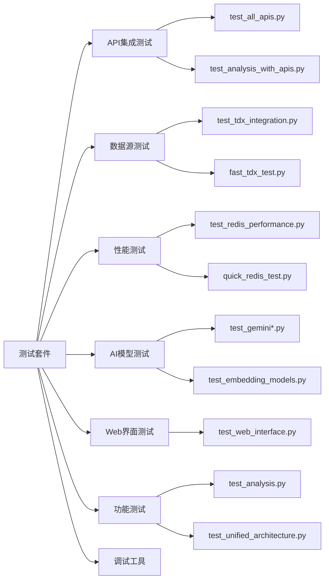
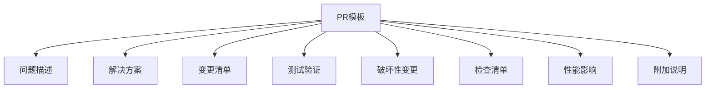
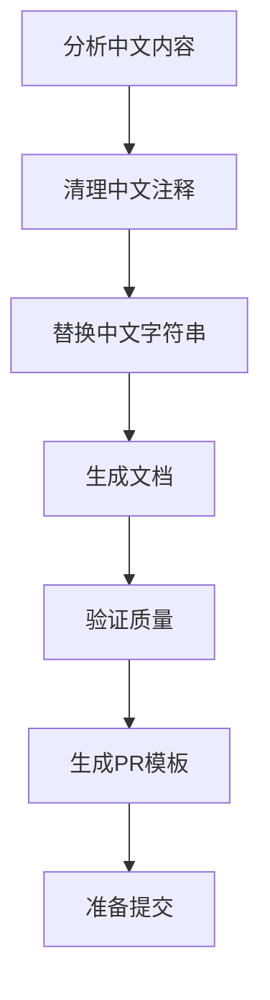
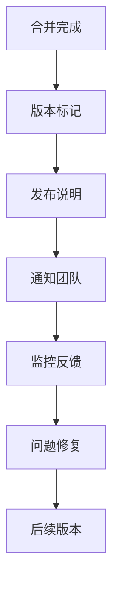

# 代码贡献流程

<cite>
**本文档引用的文件**
- [scripts/git/branch_manager.py](file://scripts/git/branch_manager.py)
- [scripts/maintenance/sync_upstream.py](file://scripts/maintenance/sync_upstream.py)
- [scripts/development/prepare_upstream_contribution.py](file://scripts/development/prepare_upstream_contribution.py)
- [scripts/git/upstream_git_workflow.sh](file://scripts/git/upstream_git_workflow.sh)
- [scripts/setup/setup_fork_environment.ps1](file://scripts/setup/setup_fork_environment.ps1)
- [scripts/validation/check_dependencies.py](file://scripts/validation/check_dependencies.py)
- [tests/README.md](file://tests/README.md)
- [tests/FILE_ORGANIZATION_SUMMARY.md](file://tests/FILE_ORGANIZATION_SUMMARY.md)
- [tests/test_cache_optimization.py](file://tests/test_cache_optimization.py)
- [tests/test_unified_architecture.py](file://tests/test_unified_architecture.py)
- [upstream_contribution/batch1_caching/README.md](file://upstream_contribution/batch1_caching/README.md)
- [upstream_contribution/batch2_error_handling/README.md](file://upstream_contribution/batch2_error_handling/README.md)
- [upstream_contribution/batch1_caching/PR_TEMPLATE.md](file://upstream_contribution/batch1_caching/PR_TEMPLATE.md)
- [upstream_contribution/batch2_error_handling/PR_TEMPLATE.md](file://upstream_contribution/batch2_error_handling/PR_TEMPLATE.md)
</cite>

## 目录
1. [项目概述](#项目概述)
2. [开发环境设置](#开发环境设置)
3. [Git分支管理策略](#git分支管理策略)
4. [上游同步机制](#上游同步机制)
5. [测试要求与质量标准](#测试要求与质量标准)
6. [PR提交规范](#pr提交规范)
7. [贡献案例分析](#贡献案例分析)
8. [代码审查要点](#代码审查要点)
9. [合并后维护指导](#合并后维护指导)
10. [故障排除指南](#故障排除指南)

## 项目概述

TradingAgents-CN是一个基于人工智能的量化交易分析平台，支持多市场股票分析、实时新闻监控和智能投资决策。项目采用模块化架构，包含多个核心组件：

- **agents/**: 代理分析器模块
- **dataflows/**: 数据流处理模块  
- **llm_adapters/**: 大语言模型适配器
- **web/**: Web界面模块
- **tests/**: 测试套件
- **upstream_contribution/**: 上游贡献案例

## 开发环境设置

### 环境配置要求

**图表来源**
- [scripts/validation/check_dependencies.py](file://scripts/validation/check_dependencies.py#L1-L50)

### 依赖检查与配置

系统提供自动化的依赖检查功能，支持多种运行模式：

1. **基本模式**：仅使用文件缓存，无需数据库
2. **完整模式**：包含MongoDB和Redis，提供高性能缓存
3. **混合模式**：根据可用性自动选择最佳配置

**章节来源**
- [scripts/validation/check_dependencies.py](file://scripts/validation/check_dependencies.py#L1-L293)

### Fork环境配置

使用PowerShell脚本自动配置Fork环境：

**图表来源**
- [scripts/setup/setup_fork_environment.ps1](file://scripts/setup/setup_fork_environment.ps1#L1-L89)

**章节来源**
- [scripts/setup/setup_fork_environment.ps1](file://scripts/setup/setup_fork_environment.ps1#L1-L89)

## Git分支管理策略

### 分支管理工具

项目提供了专门的分支管理工具，支持完整的Git工作流程：

**图表来源**
- [scripts/git/branch_manager.py](file://scripts/git/branch_manager.py#L15-L100)
- [scripts/maintenance/sync_upstream.py](file://scripts/maintenance/sync_upstream.py#L20-L80)

### 特性分支创建流程

1. **检查当前状态**：确保工作目录干净
2. **切换到基础分支**：通常为main分支
3. **拉取最新代码**：确保基础代码是最新的
4. **创建新分支**：使用约定的命名规范
5. **推送到远程**：建立跟踪关系

### 版本发布流程

**图表来源**
- [scripts/git/branch_manager.py](file://scripts/git/branch_manager.py#L120-L180)

**章节来源**
- [scripts/git/branch_manager.py](file://scripts/git/branch_manager.py#L1-L294)

## 上游同步机制

### 同步策略

项目实现了自动化的上游同步机制，支持两种合并策略：

1. **Merge策略**：创建合并提交，保留历史记录
2. **Rebase策略**：线性历史，更简洁的提交记录

### 同步流程

**图表来源**
- [scripts/maintenance/sync_upstream.py](file://scripts/maintenance/sync_upstream.py#L150-L250)

### 变更分析

同步器能够自动分析上游提交的类型：

- **Features**: 功能添加（feat, feature, add）
- **Fixes**: 错误修复（fix, bug, patch）
- **Docs**: 文档更新（doc, readme, comment）
- **Others**: 其他变更

**章节来源**
- [scripts/maintenance/sync_upstream.py](file://scripts/maintenance/sync_upstream.py#L1-L279)

## 测试要求与质量标准

### 测试分类体系

项目测试分为多个类别，确保全面覆盖：

**图表来源**
- [tests/README.md](file://tests/README.md#L10-L50)

### 测试文件命名规范

1. **测试文件**：`test_功能名称.py`
2. **调试工具**：`debug_问题描述.py`
3. **诊断工具**：`diagnose_问题描述.py`

### 缓存优化测试示例

测试涵盖了缓存系统的各个方面：

- **缓存管理器基础功能**
- **美股数据缓存性能**
- **A股数据缓存性能**
- **缓存TTL功能验证**
- **缓存清理机制**

**章节来源**
- [tests/test_cache_optimization.py](file://tests/test_cache_optimization.py#L1-L270)

### 代码质量标准

1. **文档完整性**：每个测试函数必须包含清晰的文档字符串
2. **错误处理**：测试应该能够处理各种错误情况
3. **测试隔离**：每个测试应该是独立运行的
4. **性能基准**：关键功能需要性能测试
5. **兼容性验证**：确保向后兼容性

**章节来源**
- [tests/README.md](file://tests/README.md#L1-L247)

## PR提交规范

### PR模板结构

每个贡献批次都有标准化的PR模板：

**图表来源**
- [upstream_contribution/batch1_caching/PR_TEMPLATE.md](file://upstream_contribution/batch1_caching/PR_TEMPLATE.md#L1-L37)

### 贡献文档要求

每个贡献批次都需要包含：

1. **README.md**：详细描述变更内容和影响
2. **PR_TEMPLATE.md**：标准化的PR模板
3. **测试用例**：验证变更功能的测试
4. **性能基准**：性能改进的量化指标

### 代码清理流程

**图表来源**
- [scripts/development/prepare_upstream_contribution.py](file://scripts/development/prepare_upstream_contribution.py#L50-L150)

**章节来源**
- [scripts/development/prepare_upstream_contribution.py](file://scripts/development/prepare_upstream_contribution.py#L1-L332)

## 贡献案例分析

### 案例1：智能缓存系统

**背景**：原始系统缓存性能不足，导致重复API调用

**解决方案**：
- 实现多层缓存架构
- 支持文件缓存和数据库缓存
- 优化缓存TTL策略
- 添加缓存清理机制

**性能改进**：
- 美股数据缓存性能提升99%+
- A股数据缓存性能显著改善
- 支持多种缓存后端

**章节来源**
- [upstream_contribution/batch1_caching/README.md](file://upstream_contribution/batch1_caching/README.md#L1-L34)

### 案例2：错误处理改进

**背景**：系统错误处理不够完善，用户体验差

**解决方案**：
- 改进异常捕获机制
- 添加用户友好的错误消息
- 优化错误恢复流程
- 增强日志记录能力

**章节来源**
- [upstream_contribution/batch2_error_handling/README.md](file://upstream_contribution/batch2_error_handling/README.md#L1-L34)

### 案例3：数据源优化

**背景**：Yahoo Finance数据源不稳定

**解决方案**：
- 集成FINNHUB作为备用数据源
- 实现智能数据源切换
- 优化数据获取策略
- 增强数据可靠性

## 代码审查要点

### 技术审查清单

1. **功能正确性**
   - [ ] 测试覆盖率达标
   - [ ] 边界条件处理正确
   - [ ] 错误处理完善

2. **性能影响**
   - [ ] 性能测试通过
   - [ ] 内存使用合理
   - [ ] 并发安全

3. **代码质量**
   - [ ] 代码风格一致
   - [ ] 文档完整
   - [ ] 注释清晰

4. **兼容性**
   - [ ] 向后兼容
   - [ ] 配置兼容
   - [ ] 依赖兼容

### 安全审查要点

1. **输入验证**：所有外部输入都要验证
2. **权限控制**：确保适当的访问控制
3. **敏感信息**：避免硬编码API密钥
4. **日志安全**：防止敏感信息泄露

### 文档审查要点

1. **API文档**：接口文档完整准确
2. **用户指南**：使用说明清晰易懂
3. **开发者文档**：技术细节充分
4. **变更日志**：变更记录完整

## 合并后维护指导

### 版本管理

### 监控指标

1. **性能指标**：响应时间、吞吐量、错误率
2. **业务指标**：用户活跃度、功能使用率
3. **技术指标**：资源使用率、稳定性

### 回滚策略

当发现问题时，应立即执行回滚：

1. **快速评估**：确定问题严重程度
2. **回滚计划**：准备回滚步骤
3. **执行回滚**：按照计划执行
4. **问题调查**：分析根本原因
5. **修复发布**：修复后重新发布

## 故障排除指南

### 常见问题及解决方案

1. **依赖问题**
   - 检查Python版本兼容性
   - 验证依赖包安装
   - 清理损坏的缓存

2. **Git冲突**
   - 使用同步工具自动解决
   - 手动解决复杂冲突
   - 验证合并结果

3. **测试失败**
   - 检查环境配置
   - 验证API密钥
   - 更新测试数据

4. **性能问题**
   - 分析性能瓶颈
   - 优化算法实现
   - 调整资源配置

### 调试工具

项目提供了丰富的调试和诊断工具：

- **导入问题诊断**：`tests/debug_imports.py`
- **Gemini模型诊断**：`tests/diagnose_gemini_25.py`
- **依赖检查**：`scripts/validation/check_dependencies.py`
- **Git状态检查**：`scripts/validation/verify_gitignore.py`

### 社区支持

1. **GitHub Issues**：报告bug和功能请求
2. **讨论区**：技术交流和经验分享
3. **文档Wiki**：常见问题解答
4. **邮件列表**：重要公告和更新

通过遵循这些详细的贡献流程和规范，开发者可以有效地参与TradingAgents-CN项目的开发，确保代码质量和项目稳定性。每个贡献都应该经过充分的测试和审查，以维护项目的高标准和可靠性。