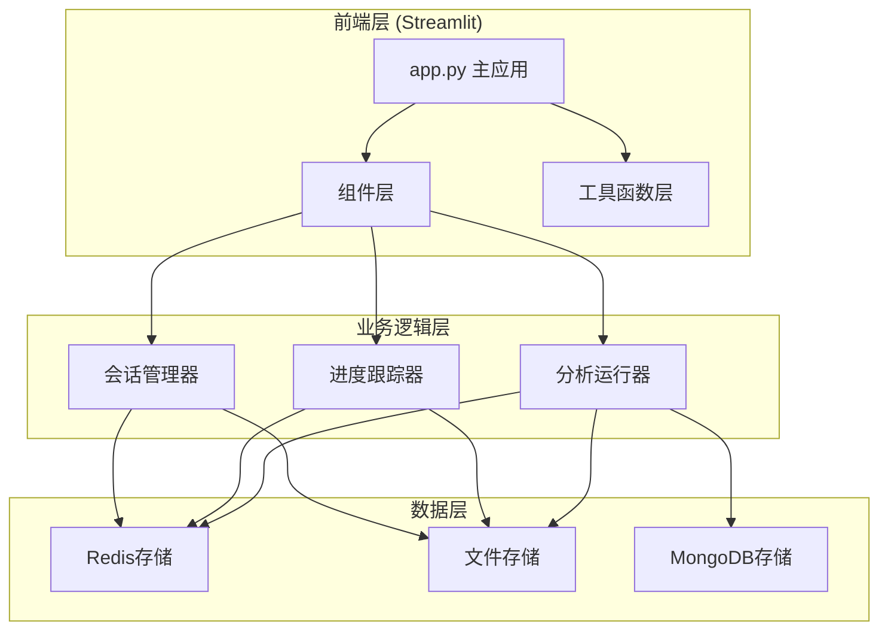
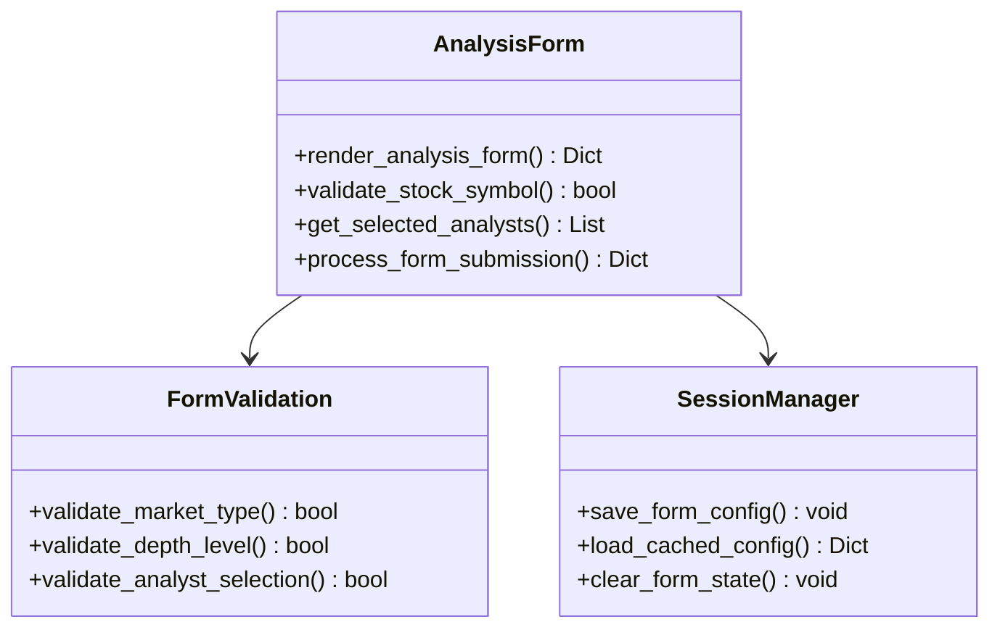
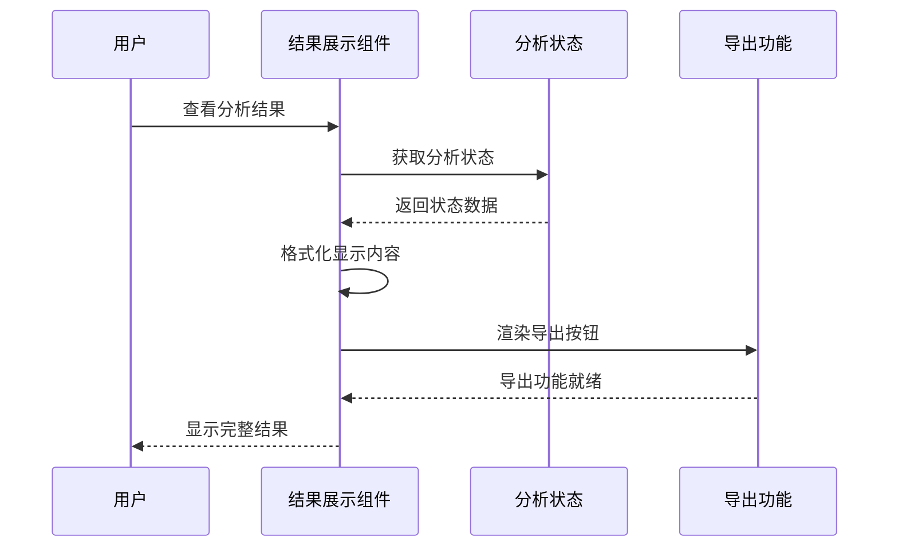
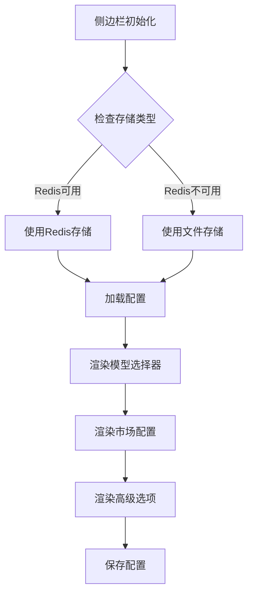
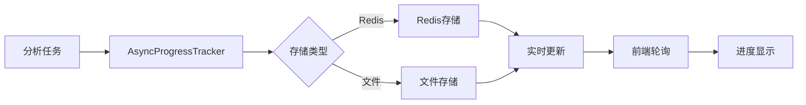
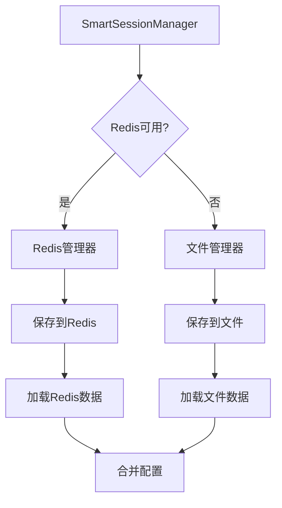

# 定制Web界面

<cite>
**本文档引用的文件**
- [web/app.py](file://web/app.py)
- [web/components/analysis_form.py](file://web/components/analysis_form.py)
- [web/components/results_display.py](file://web/components/results_display.py)
- [web/components/sidebar.py](file://web/components/sidebar.py)
- [web/components/async_progress_display.py](file://web/components/async_progress_display.py)
- [web/components/header.py](file://web/components/header.py)
- [web/utils/async_progress_tracker.py](file://web/utils/async_progress_tracker.py)
- [web/utils/smart_session_manager.py](file://web/utils/smart_session_manager.py)
- [web/utils/report_exporter.py](file://web/utils/report_exporter.py)
- [web/utils/analysis_runner.py](file://web/utils/analysis_runner.py)
- [web/utils/ui_utils.py](file://web/utils/ui_utils.py)
- [web/utils/persistence.py](file://web/utils/persistence.py)
</cite>

## 目录
1. [简介](#简介)
2. [项目架构概览](#项目架构概览)
3. [核心组件分析](#核心组件分析)
4. [异步进度跟踪机制](#异步进度跟踪机制)
5. [会话管理架构](#会话管理架构)
6. [开发新UI组件](#开发新ui组件)
7. [响应式设计与用户体验](#响应式设计与用户体验)
8. [安全验证最佳实践](#安全验证最佳实践)
9. [集成指南](#集成指南)
10. [故障排除](#故障排除)

## 简介

TradingAgents-CN的Web界面是一个基于Streamlit构建的现代化股票分析平台，采用模块化架构设计，支持多智能体协作分析。本文档旨在指导开发者如何定制和增强Web前端功能，包括组件扩展、UI优化和后端集成。

该平台的核心特色包括：
- **多智能体协作分析**：市场、基本面、新闻、社交媒体等多个分析师协同工作
- **异步进度跟踪**：实时显示分析进度，支持长时间运行的分析任务
- **灵活的会话管理**：支持Redis和文件双重存储方案
- **丰富的导出功能**：支持Markdown、Word和PDF格式报告导出
- **响应式设计**：适配不同屏幕尺寸的现代化UI

## 项目架构概览

Web界面采用分层架构设计，主要分为以下几个层次：



**架构图来源**
- [web/app.py](file://web/app.py#L1-L50)
- [web/utils/async_progress_tracker.py](file://web/utils/async_progress_tracker.py#L1-L50)
- [web/utils/smart_session_manager.py](file://web/utils/smart_session_manager.py#L1-L50)

### 核心架构特点

1. **模块化设计**：每个功能模块独立封装，便于维护和扩展
2. **异步处理**：分析任务异步执行，避免阻塞用户界面
3. **多存储后端**：支持Redis、文件和MongoDB等多种存储方案
4. **组件化开发**：采用Streamlit组件模式，提高代码复用性

**章节来源**
- [web/app.py](file://web/app.py#L1-L100)

## 核心组件分析

### 分析表单组件 (analysis_form.py)

分析表单是用户与系统交互的主要入口，提供了完整的股票分析配置界面。



**类图来源**
- [web/components/analysis_form.py](file://web/components/analysis_form.py#L15-L100)

#### 主要功能特性

1. **多市场支持**：支持美股、A股、港股三种市场的股票代码格式
2. **智能分析师选择**：根据市场类型自动调整可用的分析师选项
3. **配置缓存**：自动保存和恢复表单配置，提升用户体验
4. **实时验证**：输入时实时验证股票代码格式和有效性

#### 可扩展点

- **新增市场支持**：可在`market_options`数组中添加新的市场类型
- **自定义分析师**：通过`selected_analysts`配置添加新的分析师类型
- **高级选项扩展**：在`高级选项`部分添加新的分析参数

**章节来源**
- [web/components/analysis_form.py](file://web/components/analysis_form.py#L1-L200)

### 结果展示组件 (results_display.py)

结果展示组件负责将复杂的分析结果以清晰、易懂的方式呈现给用户。



**序列图来源**
- [web/components/results_display.py](file://web/components/results_display.py#L15-L100)

#### 核心展示模块

1. **投资决策摘要**：以卡片形式展示关键投资建议
2. **详细分析报告**：使用标签页组织不同类型的分析报告
3. **团队决策展示**：可视化多智能体辩论和最终决策过程
4. **风险评估**：提供详细的风险分析和提示

#### 自定义扩展

- **新增分析模块**：在`analysis_modules`列表中添加新的分析模块
- **自定义图表**：集成Plotly或其他图表库创建交互式图表
- **报告模板**：开发自定义的报告模板格式

**章节来源**
- [web/components/results_display.py](file://web/components/results_display.py#L1-L300)

### 侧边栏组件 (sidebar.py)

侧边栏提供全局配置和导航功能，是用户管理分析设置的主要区域。



**流程图来源**
- [web/components/sidebar.py](file://web/components/sidebar.py#L50-L150)

#### 配置管理特性

1. **多提供商支持**：支持阿里百炼、DeepSeek、Google AI等多种LLM提供商
2. **动态模型选择**：根据提供商自动显示相应的模型选项
3. **持久化存储**：配置自动保存到Redis或文件系统
4. **快速配置**：提供常用配置的快速选择按钮

**章节来源**
- [web/components/sidebar.py](file://web/components/sidebar.py#L1-L400)

## 异步进度跟踪机制

异步进度跟踪是Web界面的核心功能之一，确保长时间分析任务不会阻塞用户界面。

### 进度跟踪架构



**架构图来源**
- [web/utils/async_progress_tracker.py](file://web/utils/async_progress_tracker.py#L50-L150)

### 关键特性

1. **多存储后端**：优先使用Redis，失败时自动降级到文件存储
2. **智能步骤检测**：根据日志内容自动识别当前分析步骤
3. **进度计算**：基于步骤权重计算准确的进度百分比
4. **时间估算**：动态估算剩余时间和总耗时

### 扩展开发

开发者可以通过以下方式扩展进度跟踪功能：

- **自定义步骤**：在`_generate_dynamic_steps`方法中添加新的分析步骤
- **进度回调**：实现自定义的进度回调函数
- **状态监控**：开发实时状态监控面板

**章节来源**
- [web/utils/async_progress_tracker.py](file://web/utils/async_progress_tracker.py#L1-L400)

## 会话管理架构

会话管理采用智能存储选择机制，确保配置和状态数据的可靠保存。

### 存储策略



**架构图来源**
- [web/utils/smart_session_manager.py](file://web/utils/smart_session_manager.py#L15-L80)

### 核心功能

1. **自动降级**：Redis失败时自动切换到文件存储
2. **配置同步**：确保前后端配置的一致性
3. **状态恢复**：分析中断后能够恢复之前的配置状态
4. **调试支持**：提供详细的存储状态调试信息

**章节来源**
- [web/utils/smart_session_manager.py](file://web/utils/smart_session_manager.py#L1-L150)

## 开发新UI组件

### 组件开发规范

开发新UI组件时应遵循以下规范：

#### 1. 组件结构模板

```python
import streamlit as st
from typing import Dict, Any

def render_custom_component(data: Dict[Any, Any]) -> None:
    """渲染自定义组件"""
    
    # CSS样式定义
    st.markdown("""
    <style>
    /* 自定义样式 */
    .custom-component {
        background: linear-gradient(135deg, #f5f7fa 0%, #c3cfe2 100%);
        padding: 1rem;
        border-radius: 10px;
        margin: 1rem 0;
    }
    </style>
    """, unsafe_allow_html=True)
    
    # 组件内容
    with st.container():
        st.markdown("<div class='custom-component'>", unsafe_allow_html=True)
        # 组件具体内容
        st.markdown("</div>", unsafe_allow_html=True)
```

#### 2. 集成到主应用

```python
# 在app.py中集成新组件
from components.custom_components import render_custom_component

def main():
    # ... 现有代码 ...
    
    # 在适当位置添加新组件
    if st.session_state.get('show_custom_feature', False):
        render_custom_component(st.session_state.get('custom_data', {}))
```

### 自定义图表组件示例

#### 交互式价格图表

```python
import plotly.graph_objects as go
import pandas as pd

def create_interactive_price_chart(price_data: pd.DataFrame) -> go.Figure:
    """创建交互式价格图表"""
    
    fig = go.Figure()
    
    # 添加价格线
    fig.add_trace(go.Scatter(
        x=price_data['date'],
        y=price_data['close'],
        mode='lines',
        name='收盘价',
        line=dict(color='#1f77b4', width=2)
    ))
    
    # 添加技术指标
    if 'ma20' in price_data.columns:
        fig.add_trace(go.Scatter(
            x=price_data['date'],
            y=price_data['ma20'],
            mode='lines',
            name='20日均线',
            line=dict(color='#ff7f0e', width=1.5, dash='dash')
        ))
    
    # 设置图表布局
    fig.update_layout(
        title="股票价格走势",
        xaxis_title="日期",
        yaxis_title="价格",
        hovermode='x unified',
        template="plotly_white"
    )
    
    return fig
```

#### 自定义交互式控件

```python
def render_advanced_filter_panel() -> Dict[str, Any]:
    """渲染高级过滤面板"""
    
    with st.expander("高级过滤选项"):
        col1, col2, col3 = st.columns(3)
        
        with col1:
            # 时间范围选择
            start_date = st.date_input("开始日期", value=pd.Timestamp.now() - pd.Timedelta(days=30))
            end_date = st.date_input("结束日期", value=pd.Timestamp.now())
        
        with col2:
            # 指标阈值
            min_volume = st.number_input("最低成交量", value=0)
            max_change = st.number_input("最大涨幅%", value=50)
        
        with col3:
            # 条件组合
            condition_type = st.selectbox(
                "条件类型",
                options=["AND", "OR"],
                help="选择多个条件的组合方式"
            )
            
            # 应用过滤
            if st.button("应用过滤", type="primary"):
                return {
                    'start_date': start_date,
                    'end_date': end_date,
                    'min_volume': min_volume,
                    'max_change': max_change,
                    'condition_type': condition_type
                }
    
    return {}
```

### 报告导出功能扩展

#### 自定义报告格式

```python
def generate_custom_report(results: Dict[str, Any], format_type: str) -> bytes:
    """生成自定义格式的报告"""
    
    if format_type == 'excel':
        return create_excel_report(results)
    elif format_type == 'html':
        return create_html_report(results)
    elif format_type == 'json':
        return create_json_report(results)
    else:
        raise ValueError(f"不支持的格式: {format_type}")

def create_excel_report(results: Dict[str, Any]) -> bytes:
    """生成Excel格式报告"""
    
    import pandas as pd
    from io import BytesIO
    
    # 创建数据字典
    data = {
        '指标': [],
        '数值': [],
        '说明': []
    }
    
    # 添加投资决策数据
    decision = results.get('decision', {})
    data['指标'].extend(['投资建议', '置信度', '风险评分', '目标价位'])
    data['数值'].extend([
        decision.get('action', 'N/A'),
        f"{decision.get('confidence', 0):.1%}",
        f"{decision.get('risk_score', 0):.1%}",
        str(decision.get('target_price', 'N/A'))
    ])
    data['说明'].extend([
        '基于AI分析的投资建议',
        'AI对分析结果的置信度',
        '投资风险评估分数',
        'AI预测的目标价位'
    ])
    
    # 转换为DataFrame
    df = pd.DataFrame(data)
    
    # 创建Excel文件
    output = BytesIO()
    with pd.ExcelWriter(output, engine='openpyxl') as writer:
        df.to_excel(writer, sheet_name='投资决策', index=False)
        
        # 添加分析详情
        for module_name, module_content in results.get('state', {}).items():
            if isinstance(module_content, str):
                # 简单文本内容
                module_df = pd.DataFrame({'内容': [module_content]})
                module_df.to_excel(writer, sheet_name=module_name[:31], index=False)
    
    return output.getvalue()
```

**章节来源**
- [web/utils/report_exporter.py](file://web/utils/report_exporter.py#L1-L300)

## 响应式设计与用户体验

### 响应式布局设计

Web界面采用流式布局设计，确保在不同设备上的良好体验：

```python
# 响应式布局示例
def apply_responsive_styles():
    """应用响应式样式"""
    st.markdown("""
    <style>
    /* 移动设备优化 */
    @media (max-width: 768px) {
        .main .block-container {
            padding: 1rem;
        }
        
        .stColumns {
            flex-direction: column !important;
        }
        
        .metric-card {
            margin-bottom: 1rem;
        }
    }
    
    /* 平板设备优化 */
    @media (min-width: 768px) and (max-width: 1024px) {
        .main .block-container {
            padding: 1.5rem;
        }
        
        .stColumns {
            gap: 1rem;
        }
    }
    
    /* 桌面设备优化 */
    @media (min-width: 1024px) {
        .main .block-container {
            padding: 2rem;
        }
        
        .stColumns {
            gap: 2rem;
        }
    }
    </style>
    """, unsafe_allow_html=True)
```

### 用户体验优化

#### 1. 加载状态指示

```python
def show_loading_state(message: str = "正在处理...") -> None:
    """显示加载状态"""
    with st.spinner(message):
        # 模拟处理时间
        import time
        time.sleep(1)
```

#### 2. 错误处理和用户提示

```python
def render_error_handling(func):
    """错误处理装饰器"""
    def wrapper(*args, **kwargs):
        try:
            return func(*args, **kwargs)
        except Exception as e:
            st.error(f"发生错误: {str(e)}")
            st.info("请检查您的输入或联系技术支持")
            return None
    return wrapper
```

#### 3. 交互式帮助系统

```python
def render_help_system(component_name: str) -> None:
    """渲染帮助系统"""
    with st.expander("❓ 帮助指南"):
        help_content = {
            "分析配置": "在这里配置您的股票分析参数。",
            "市场选择": "选择您要分析的股票市场类型。",
            "分析师选择": "选择参与分析的智能体类型。",
            "高级选项": "配置高级分析参数和自定义选项。"
        }
        
        st.markdown(help_content.get(component_name, "获取更多信息，请查看文档。"))
```

**章节来源**
- [web/utils/ui_utils.py](file://web/utils/ui_utils.py#L1-L140)

## 安全验证最佳实践

### 输入验证

```python
import re
from typing import Optional

def validate_stock_code(code: str, market_type: str) -> Optional[str]:
    """验证股票代码格式"""
    
    if not code or not code.strip():
        return "股票代码不能为空"
    
    code = code.strip().upper()
    
    validators = {
        "美股": r'^[A-Z]{1,5}$',
        "A股": r'^\d{6}$',
        "港股": r'^\d{4,5}(\.HK)?$'
    }
    
    pattern = validators.get(market_type)
    if not pattern:
        return f"不支持的市场类型: {market_type}"
    
    if not re.match(pattern, code):
        return f"{market_type}代码格式错误"
    
    return None

def sanitize_input(input_data: str) -> str:
    """清理用户输入，防止XSS攻击"""
    import html
    return html.escape(input_data)
```

### 权限控制

```python
def require_admin_access(func):
    """管理员权限装饰器"""
    def wrapper(*args, **kwargs):
        if not st.session_state.get('is_admin', False):
            st.error("您没有访问此功能的权限")
            return
        return func(*args, **kwargs)
    return wrapper

def check_user_permissions(required_role: str = "user") -> bool:
    """检查用户权限"""
    user_role = st.session_state.get('user_role', 'guest')
    
    role_hierarchy = {
        'admin': 3,
        'moderator': 2,
        'user': 1,
        'guest': 0
    }
    
    return role_hierarchy.get(user_role, 0) >= role_hierarchy.get(required_role, 0)
```

### 数据加密

```python
import base64
from cryptography.fernet import Fernet

class SecureDataManager:
    """安全数据管理器"""
    
    def __init__(self):
        # 从环境变量获取密钥
        import os
        key = os.getenv('SECURITY_KEY')
        if not key:
            # 生成随机密钥（仅用于开发环境）
            key = Fernet.generate_key().decode()
            os.environ['SECURITY_KEY'] = key
        
        self.cipher = Fernet(key.encode())
    
    def encrypt_data(self, data: str) -> str:
        """加密数据"""
        return self.cipher.encrypt(data.encode()).decode()
    
    def decrypt_data(self, encrypted_data: str) -> str:
        """解密数据"""
        return self.cipher.decrypt(encrypted_data.encode()).decode()
```

**章节来源**
- [web/utils/analysis_runner.py](file://web/utils/analysis_runner.py#L1000-L1216)

## 集成指南

### 与TradingAgents模块集成

#### 1. 基本集成步骤

```python
# 在app.py中导入必要的模块
from tradingagents.graph.trading_graph import TradingAgentsGraph
from tradingagents.default_config import DEFAULT_CONFIG

def integrate_trading_agents(stock_symbol: str, market_type: str, analysts: List[str]):
    """集成TradingAgents模块"""
    
    # 创建配置
    config = DEFAULT_CONFIG.copy()
    config.update({
        'llm_provider': st.session_state.llm_provider,
        'llm_model': st.session_state.llm_model,
        'research_depth': st.session_state.research_depth
    })
    
    # 初始化分析图
    graph = TradingAgentsGraph(analysts, config=config)
    
    # 执行分析
    state, decision = graph.propagate(stock_symbol, market_type)
    
    return state, decision
```

#### 2. 进度回调集成

```python
def create_progress_callback(analysis_id: str):
    """创建进度回调函数"""
    from web.utils.async_progress_tracker import AsyncProgressTracker
    
    tracker = AsyncProgressTracker(analysis_id, [], 3, "dashscope")
    
    def callback(message: str, step: int = None):
        tracker.update_progress(message, step)
    
    return callback

# 在分析函数中使用
progress_callback = create_progress_callback(analysis_id)
state, decision = run_stock_analysis(
    stock_symbol, 
    analysis_date, 
    analysts, 
    research_depth, 
    llm_provider, 
    llm_model, 
    progress_callback=progress_callback
)
```

#### 3. 结果格式化

```python
def format_analysis_results(results: Dict[str, Any]) -> Dict[str, Any]:
    """格式化分析结果"""
    
    if not results.get('success'):
        return {
            'error': results.get('error'),
            'success': False
        }
    
    # 格式化决策
    decision = results.get('decision', {})
    formatted_decision = {
        'action': translate_action(decision.get('action', 'HOLD')),
        'confidence': decision.get('confidence', 0.5),
        'risk_score': decision.get('risk_score', 0.3),
        'target_price': format_price(decision.get('target_price')),
        'reasoning': decision.get('reasoning', '暂无分析推理')
    }
    
    return {
        'stock_symbol': results['stock_symbol'],
        'decision': formatted_decision,
        'state': results['state'],
        'success': True
    }
```

### 部署集成

#### 1. Docker部署配置

```dockerfile
# Dockerfile示例
FROM python:3.11-slim

WORKDIR /app

# 安装依赖
COPY requirements.txt .
RUN pip install -r requirements.txt

# 复制应用文件
COPY . .

# 设置环境变量
ENV STREAMLIT_SERVER_ENABLE_STATIC_SERVING=true
ENV STREAMLIT_SERVER_PORT=8501

# 暴露端口
EXPOSE 8501

# 启动命令
CMD ["streamlit", "run", "web/app.py", "--server.port=8501", "--server.address=0.0.0.0"]
```

#### 2. 生产环境配置

```python
# 生产环境配置
import os

def configure_production_environment():
    """配置生产环境"""
    
    # 设置环境变量
    os.environ.setdefault('STREAMLIT_SERVER_ENABLE_STATIC_SERVING', 'true')
    os.environ.setdefault('STREAMLIT_SERVER_PORT', '8501')
    os.environ.setdefault('REDIS_ENABLED', 'true')
    
    # 配置日志
    import logging
    logging.basicConfig(
        level=logging.INFO,
        format='%(asctime)s - %(name)s - %(levelname)s - %(message)s'
    )
    
    # 配置缓存
    import redis
    redis_client = redis.Redis(
        host=os.getenv('REDIS_HOST', 'localhost'),
        port=int(os.getenv('REDIS_PORT', 6379)),
        db=int(os.getenv('REDIS_DB', 0))
    )
    
    return redis_client
```

**章节来源**
- [web/app.py](file://web/app.py#L100-L300)
- [web/utils/analysis_runner.py](file://web/utils/analysis_runner.py#L1-L200)

## 故障排除

### 常见问题及解决方案

#### 1. 进度跟踪问题

**问题**：分析进度不更新或显示错误
**解决方案**：
```python
# 检查Redis连接
import redis
try:
    redis_client = redis.Redis(host='localhost', port=6379)
    redis_client.ping()
    print("Redis连接正常")
except Exception as e:
    print(f"Redis连接失败: {e}")
    # 切换到文件存储
    os.environ['REDIS_ENABLED'] = 'false'
```

#### 2. 会话管理问题

**问题**：配置丢失或无法恢复
**解决方案**：
```python
# 检查存储状态
from web.utils.smart_session_manager import get_session_debug_info
debug_info = get_session_debug_info()
print(f"存储类型: {debug_info['storage_type']}")
print(f"Redis可用: {debug_info['redis_available']}")
print(f"文件管理器可用: {debug_info['file_manager_available']}")
```

#### 3. 性能优化

**问题**：页面加载缓慢
**解决方案**：
```python
# 启用缓存
import streamlit as st

@st.cache_data(ttl=3600)  # 缓存1小时
def get_cached_data(symbol: str):
    # 获取数据的函数
    pass

# 限制并发
import asyncio
semaphore = asyncio.Semaphore(5)  # 最多5个并发任务
```

#### 4. 错误监控

```python
import traceback
from tradingagents.utils.logging_manager import get_logger

def handle_component_error(func):
    """错误处理装饰器"""
    def wrapper(*args, **kwargs):
        try:
            return func(*args, **kwargs)
        except Exception as e:
            logger = get_logger('web')
            logger.error(f"组件错误: {str(e)}")
            logger.error(traceback.format_exc())
            
            st.error("发生内部错误，请联系技术支持")
            st.exception(e)
            return None
    return wrapper
```

### 调试工具

#### 1. 调试信息收集

```python
def collect_debug_info() -> Dict[str, Any]:
    """收集调试信息"""
    import platform
    import sys
    
    debug_info = {
        'platform': platform.platform(),
        'python_version': sys.version,
        'streamlit_version': st.__version__,
        'os_env': dict(os.environ),
        'session_state': dict(st.session_state),
        'storage_info': get_session_debug_info()
    }
    
    return debug_info
```

#### 2. 性能监控

```python
import time
from functools import wraps

def monitor_performance(func):
    """性能监控装饰器"""
    @wraps(func)
    def wrapper(*args, **kwargs):
        start_time = time.time()
        result = func(*args, **kwargs)
        end_time = time.time()
        
        print(f"函数 {func.__name__} 执行时间: {end_time - start_time:.2f}秒")
        return result
    return wrapper
```

通过遵循本文档的指导原则和最佳实践，开发者可以有效地扩展和定制TradingAgents-CN的Web界面，创建更加丰富和用户友好的股票分析平台。