# LLM适配器开发指南

<cite>
**本文档引用的文件**
- [openai_compatible_base.py](file://tradingagents/llm_adapters/openai_compatible_base.py)
- [deepseek_adapter.py](file://tradingagents/llm_adapters/deepseek_adapter.py)
- [dashscope_adapter.py](file://tradingagents/llm_adapters/dashscope_adapter.py)
- [deepseek_direct_adapter.py](file://tradingagents/llm_adapters/deepseek_direct_adapter.py)
- [google_openai_adapter.py](file://tradingagents/llm_adapters/google_openai_adapter.py)
- [config_manager.py](file://tradingagents/config/config_manager.py)
- [token_tracking_demo.py](file://examples/token_tracking_demo.py)
- [demo_deepseek_simple.py](file://examples/demo_deepseek_simple.py)
- [demo_dashscope_simple.py](file://examples/dashscope_examples/demo_dashscope_simple.py)
</cite>

## 目录
1. [简介](#简介)
2. [项目架构概览](#项目架构概览)
3. [适配器模式设计](#适配器模式设计)
4. [OpenAI兼容基类详解](#openai兼容基类详解)
5. [具体适配器实现](#具体适配器实现)
6. [请求/响应格式转换](#请求响应格式转换)
7. [认证机制](#认证机制)
8. [流式输出处理](#流式输出处理)
9. [Token计费跟踪](#token计费跟踪)
10. [配置管理](#配置管理)
11. [性能测试与优化](#性能测试与优化)
12. [错误恢复机制](#错误恢复机制)
13. [版本兼容性处理](#版本兼容性处理)
14. [开发新适配器指南](#开发新适配器指南)
15. [最佳实践](#最佳实践)

## 简介

TradingAgents项目采用统一的LLM适配器架构，支持多种大语言模型提供商。该架构通过适配器模式实现了对不同API风格的统一抽象，提供了标准化的接口、Token计费跟踪、配置管理和错误处理机制。

## 项目架构概览

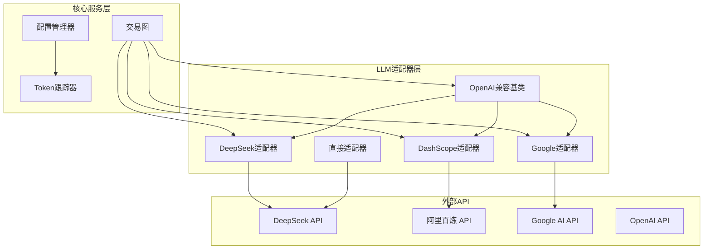

**图表来源**
- [openai_compatible_base.py](file://tradingagents/llm_adapters/openai_compatible_base.py#L1-L50)
- [config_manager.py](file://tradingagents/config/config_manager.py#L1-L100)

## 适配器模式设计

### 设计原则

1. **统一接口**: 所有适配器都遵循相同的接口规范
2. **开闭原则**: 对扩展开放，对修改关闭
3. **依赖倒置**: 依赖抽象而非具体实现
4. **单一职责**: 每个适配器专注于特定提供商

### 核心组件

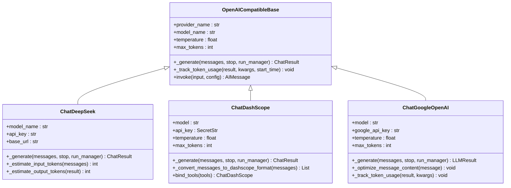

**图表来源**
- [openai_compatible_base.py](file://tradingagents/llm_adapters/openai_compatible_base.py#L25-L100)
- [deepseek_adapter.py](file://tradingagents/llm_adapters/deepseek_adapter.py#L25-L80)
- [dashscope_adapter.py](file://tradingagents/llm_adapters/dashscope_adapter.py#L25-L80)
- [google_openai_adapter.py](file://tradingagents/llm_adapters/google_openai_adapter.py#L25-L80)

**章节来源**
- [openai_compatible_base.py](file://tradingagents/llm_adapters/openai_compatible_base.py#L1-L436)
- [deepseek_adapter.py](file://tradingagents/llm_adapters/deepseek_adapter.py#L1-L263)

## OpenAI兼容基类详解

### 基类架构

OpenAI兼容基类是整个适配器体系的核心，它继承自`ChatOpenAI`，为所有支持OpenAI接口的提供商提供统一的基础实现。

### 核心特性

1. **统一初始化流程**
2. **Token使用跟踪**
3. **错误处理机制**
4. **配置管理集成**

### 初始化过程

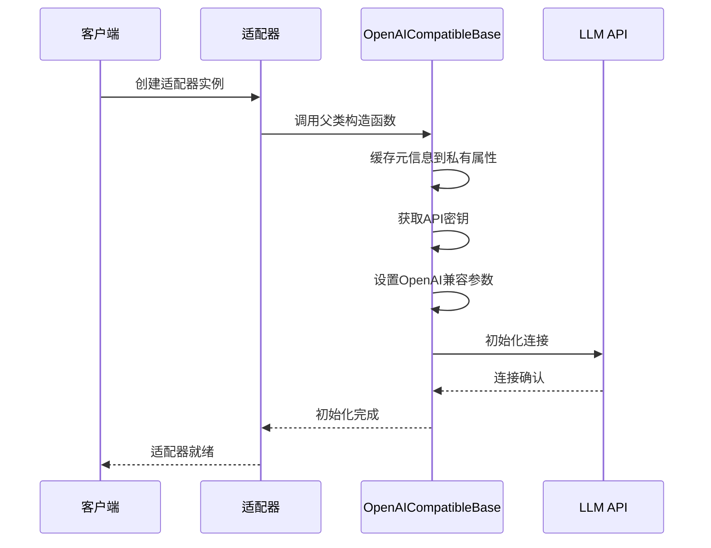

**图表来源**
- [openai_compatible_base.py](file://tradingagents/llm_adapters/openai_compatible_base.py#L45-L120)

### 属性管理

基类通过特殊的属性管理机制确保元信息的持久性：

- 使用`object.__setattr__()`绕过Pydantic字段限制
- 在父类初始化前后两次设置元信息
- 支持动态属性访问

**章节来源**
- [openai_compatible_base.py](file://tradingagents/llm_adapters/openai_compatible_base.py#L45-L150)

## 具体适配器实现

### DeepSeek适配器

#### 实现特点

1. **Token估算机制**: 当API不提供精确token信息时进行估算
2. **成本跟踪**: 集成完整的Token使用统计
3. **消息格式处理**: 支持复杂的输入消息格式

#### Token估算算法

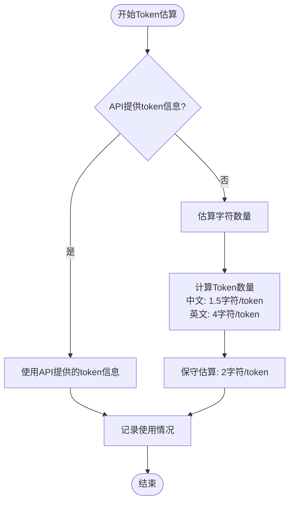

**图表来源**
- [deepseek_adapter.py](file://tradingagents/llm_adapters/deepseek_adapter.py#L120-L180)

### DashScope适配器

#### 消息格式转换

DashScope适配器需要将LangChain的消息格式转换为DashScope的格式：

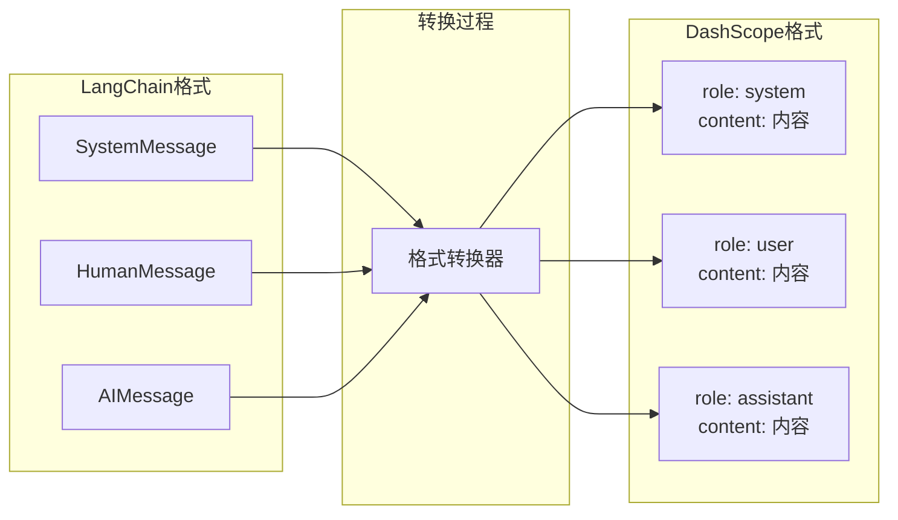

**图表来源**
- [dashscope_adapter.py](file://tradingagents/llm_adapters/dashscope_adapter.py#L70-L120)

### Google适配器

#### 工具调用优化

Google适配器特别针对工具调用进行了优化：

1. **内容格式化**: 确保新闻内容包含必要的关键词
2. **响应优化**: 格式化AI消息内容
3. **错误处理**: 提供友好的错误响应

**章节来源**
- [deepseek_adapter.py](file://tradingagents/llm_adapters/deepseek_adapter.py#L25-L263)
- [dashscope_adapter.py](file://tradingagents/llm_adapters/dashscope_adapter.py#L25-L294)
- [google_openai_adapter.py](file://tradingagents/llm_adapters/google_openai_adapter.py#L25-L351)

## 请求/响应格式转换

### 消息格式映射

不同LLM提供商有不同的消息格式要求，适配器负责进行格式转换：

| 源格式 | DeepSeek | DashScope | Google |
|--------|----------|-----------|---------|
| SystemMessage | role: system | role: system | role: system |
| HumanMessage | role: user | role: user | role: user |
| AIMessage | role: assistant | role: assistant | role: assistant |
| 多模态内容 | 提取文本 | 处理列表 | 格式化处理 |

### 工具调用处理

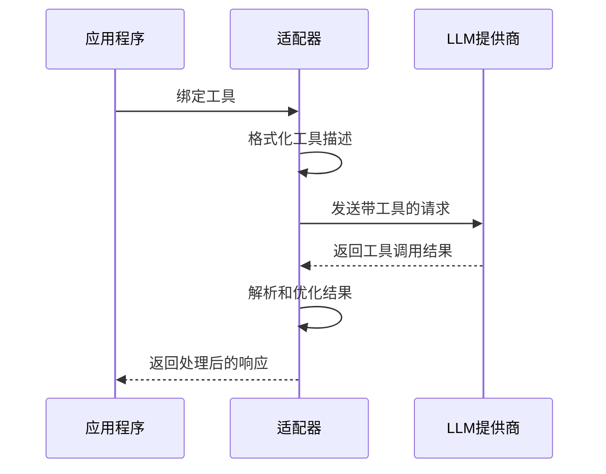

**图表来源**
- [dashscope_adapter.py](file://tradingagents/llm_adapters/dashscope_adapter.py#L180-L220)
- [google_openai_adapter.py](file://tradingagents/llm_adapters/google_openai_adapter.py#L150-L200)

**章节来源**
- [dashscope_adapter.py](file://tradingagents/llm_adapters/dashscope_adapter.py#L70-L150)

## 认证机制

### API密钥管理

系统支持多种API密钥管理方式：

1. **环境变量**: 通过环境变量传递API密钥
2. **参数传递**: 直接在初始化时传入API密钥
3. **配置文件**: 通过配置管理系统管理

### 密钥验证

OpenAI API密钥具有严格的格式要求：

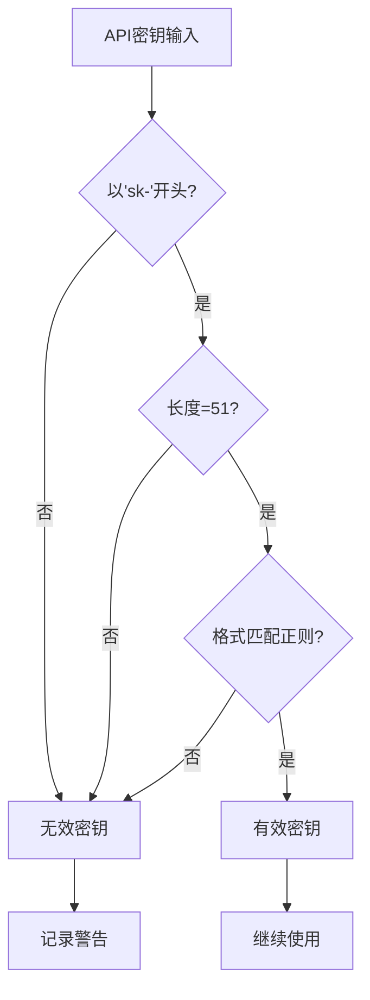

**图表来源**
- [config_manager.py](file://tradingagents/config/config_manager.py#L150-L180)

### 千帆API密钥特殊处理

千帆平台使用特殊的API密钥格式：`bce-v3/ALTAK-xxx/xxx`

**章节来源**
- [openai_compatible_base.py](file://tradingagents/llm_adapters/openai_compatible_base.py#L80-L120)
- [config_manager.py](file://tradingagents/config/config_manager.py#L150-L200)

## 流式输出处理

### 同步与异步调用

系统支持同步和异步两种调用方式：

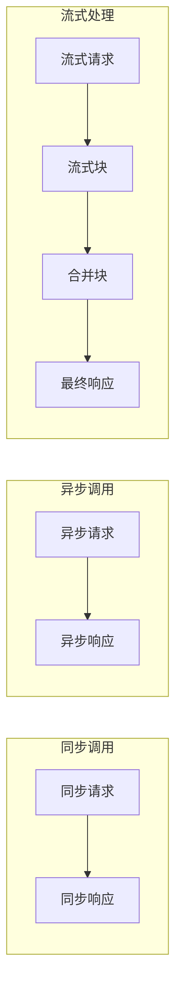

### 流式输出优化

对于某些提供商，系统实现了流式输出的优化处理：

1. **重复检测**: 避免显示重复的进度信息
2. **内容合并**: 将多个流式块合并为完整响应
3. **错误恢复**: 在流式过程中处理错误

**章节来源**
- [dashscope_adapter.py](file://tradingagents/llm_adapters/dashscope_adapter.py#L150-L180)
- [google_openai_adapter.py](file://tradingagents/llm_adapters/google_openai_adapter.py#L50-L100)

## Token计费跟踪

### 跟踪机制

Token计费跟踪是系统的重要功能，提供详细的使用统计和成本分析。

### 跟踪流程

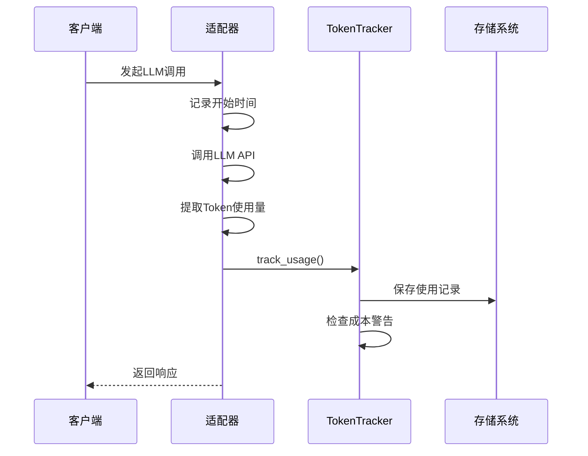

**图表来源**
- [openai_compatible_base.py](file://tradingagents/llm_adapters/openai_compatible_base.py#L150-L200)
- [token_tracking_demo.py](file://examples/token_tracking_demo.py#L50-L100)

### 成本计算

系统支持多种成本计算方式：

1. **实际使用**: 基于API提供的token使用量
2. **估算计算**: 当API不提供精确信息时的估算
3. **批量计算**: 支持批量操作的成本估算

### 配置选项

| 配置项 | 类型 | 默认值 | 描述 |
|--------|------|--------|------|
| enable_cost_tracking | bool | true | 是否启用成本跟踪 |
| cost_alert_threshold | float | 100.0 | 成本警告阈值(人民币) |
| currency_preference | str | CNY | 货币偏好(CNY/USD) |
| auto_save_usage | bool | true | 是否自动保存使用记录 |

**章节来源**
- [token_tracking_demo.py](file://examples/token_tracking_demo.py#L1-L284)
- [config_manager.py](file://tradingagents/config/config_manager.py#L650-L727)

## 配置管理

### 配置层次

系统采用分层配置管理：

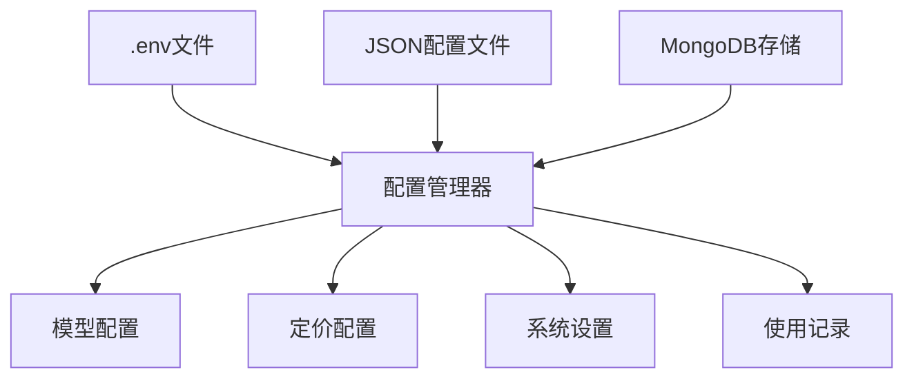

**图表来源**
- [config_manager.py](file://tradingagents/config/config_manager.py#L50-L100)

### 模型配置

每个模型都有详细的配置信息：

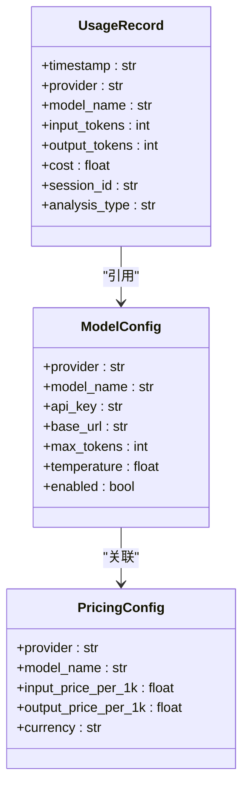

**图表来源**
- [config_manager.py](file://tradingagents/config/config_manager.py#L30-L80)

### 动态配置更新

系统支持运行时配置更新：

1. **热重载**: 不重启服务即可更新配置
2. **验证机制**: 确保配置的有效性
3. **回滚支持**: 配置错误时自动回滚

**章节来源**
- [config_manager.py](file://tradingagents/config/config_manager.py#L1-L727)

## 性能测试与优化

### 性能基准测试

系统提供了完整的性能测试框架：

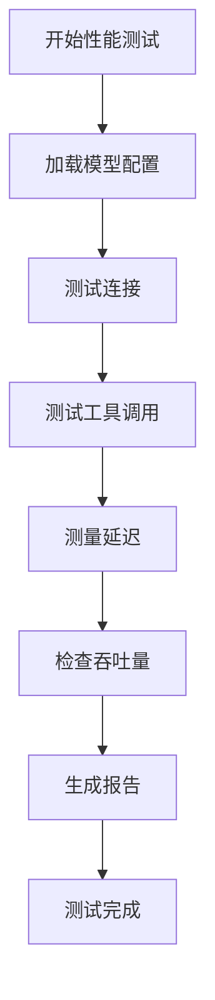

### 性能优化策略

1. **连接池管理**: 复用HTTP连接减少建立开销
2. **缓存机制**: 缓存频繁使用的配置和模型信息
3. **并发处理**: 支持并发调用提高效率
4. **资源监控**: 监控内存和CPU使用情况

### 测试用例

系统包含丰富的测试用例：

- **连接测试**: 验证API连接的稳定性
- **功能测试**: 测试各种功能特性
- **性能测试**: 测量响应时间和吞吐量
- **兼容性测试**: 确保跨平台兼容性

**章节来源**
- [google_openai_adapter.py](file://tradingagents/llm_adapters/google_openai_adapter.py#L300-L351)

## 错误恢复机制

### 错误分类

系统将错误分为几个类别：

1. **网络错误**: 连接超时、DNS解析失败
2. **API错误**: 认证失败、配额超限
3. **格式错误**: 请求格式不正确
4. **业务错误**: 语义错误、内容违规

### 恢复策略

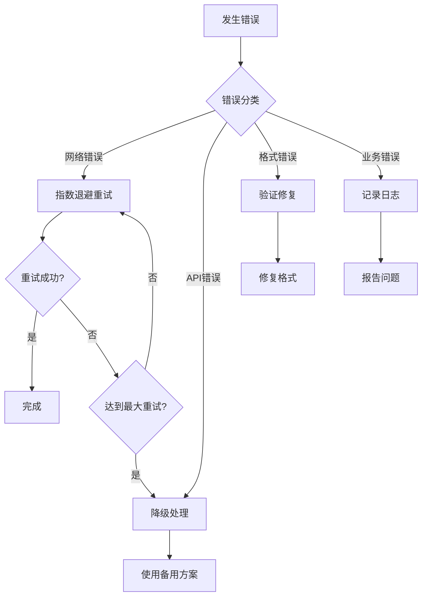

### 降级处理

当主要提供商不可用时，系统支持降级处理：

1. **备用提供商**: 自动切换到备用LLM提供商
2. **本地缓存**: 使用本地缓存的响应
3. **简化模式**: 使用更简单的模型或功能

**章节来源**
- [google_openai_adapter.py](file://tradingagents/llm_adapters/google_openai_adapter.py#L80-L120)

## 版本兼容性处理

### LangChain版本适配

系统需要兼容不同版本的LangChain库：

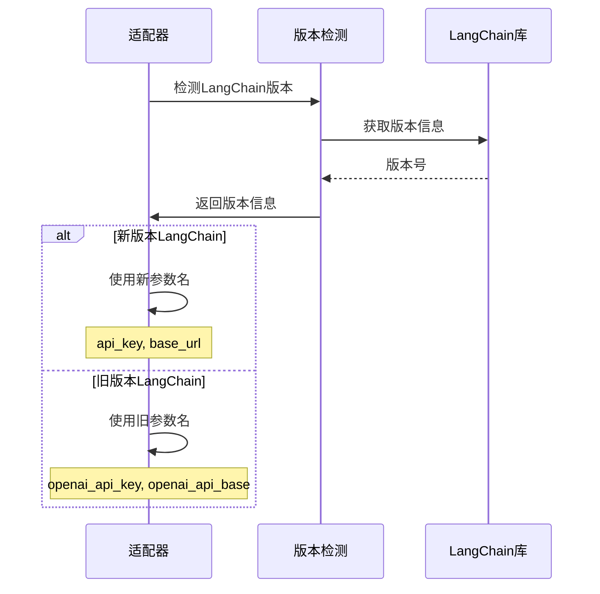

**图表来源**
- [openai_compatible_base.py](file://tradingagents/llm_adapters/openai_compatible_base.py#L90-L110)

### API版本管理

不同提供商的API版本可能存在差异：

1. **向后兼容**: 支持旧版本API
2. **版本检测**: 自动检测API版本
3. **优雅降级**: 不支持的功能自动降级

**章节来源**
- [openai_compatible_base.py](file://tradingagents/llm_adapters/openai_compatible_base.py#L90-L120)

## 开发新适配器指南

### 开发步骤

1. **需求分析**: 确定适配器的功能需求
2. **接口设计**: 设计适配器接口
3. **实现适配器**: 编写适配器代码
4. **集成测试**: 进行集成测试
5. **文档编写**: 编写使用文档

### 示例：创建新的适配器

以下是创建新适配器的基本模板：

```python
# 基础适配器模板
class ChatNewProvider(OpenAICompatibleBase):
    def __init__(self, model: str = "default-model", **kwargs):
        super().__init__(
            provider_name="new_provider",
            model=model,
            api_key_env_var="NEW_PROVIDER_API_KEY",
            base_url="https://api.newprovider.com/v1",
            **kwargs
        )
    
    def _generate(self, messages, **kwargs):
        # 实现生成逻辑
        pass
```

### 必需组件

每个适配器必须实现以下组件：

1. **初始化方法**: 设置基本参数和认证
2. **生成方法**: 处理请求和响应
3. **错误处理**: 处理各种错误情况
4. **配置支持**: 支持配置管理
5. **测试用例**: 提供完整的测试

### 最佳实践

1. **遵循现有模式**: 使用现有的适配器作为模板
2. **完整测试**: 提供全面的测试用例
3. **文档齐全**: 编写清晰的使用文档
4. **错误处理**: 实现健壮的错误处理机制
5. **性能考虑**: 优化性能和资源使用

**章节来源**
- [openai_compatible_base.py](file://tradingagents/llm_adapters/openai_compatible_base.py#L200-L436)

## 最佳实践

### 代码组织

1. **模块化设计**: 将功能分解为独立模块
2. **清晰命名**: 使用有意义的变量和函数名
3. **注释文档**: 为复杂逻辑添加详细注释
4. **错误处理**: 实现完善的错误处理机制

### 性能优化

1. **连接复用**: 复用HTTP连接减少开销
2. **缓存策略**: 缓存频繁访问的数据
3. **异步处理**: 使用异步编程提高并发性能
4. **资源监控**: 监控系统资源使用情况

### 安全考虑

1. **密钥保护**: 安全存储和传输API密钥
2. **输入验证**: 验证所有用户输入
3. **权限控制**: 实现适当的访问控制
4. **审计日志**: 记录重要操作的审计日志

### 可维护性

1. **代码规范**: 遵循一致的编码规范
2. **单元测试**: 编写全面的单元测试
3. **持续集成**: 实现自动化测试和部署
4. **文档更新**: 保持文档与代码同步

### 扩展性设计

1. **插件架构**: 支持动态加载新适配器
2. **配置驱动**: 使用配置文件控制行为
3. **接口抽象**: 定义清晰的接口边界
4. **版本管理**: 实现向后兼容的版本管理

通过遵循这些最佳实践，可以确保LLM适配器的高质量、高性能和高可靠性，为TradingAgents项目提供稳定的LLM服务支持。