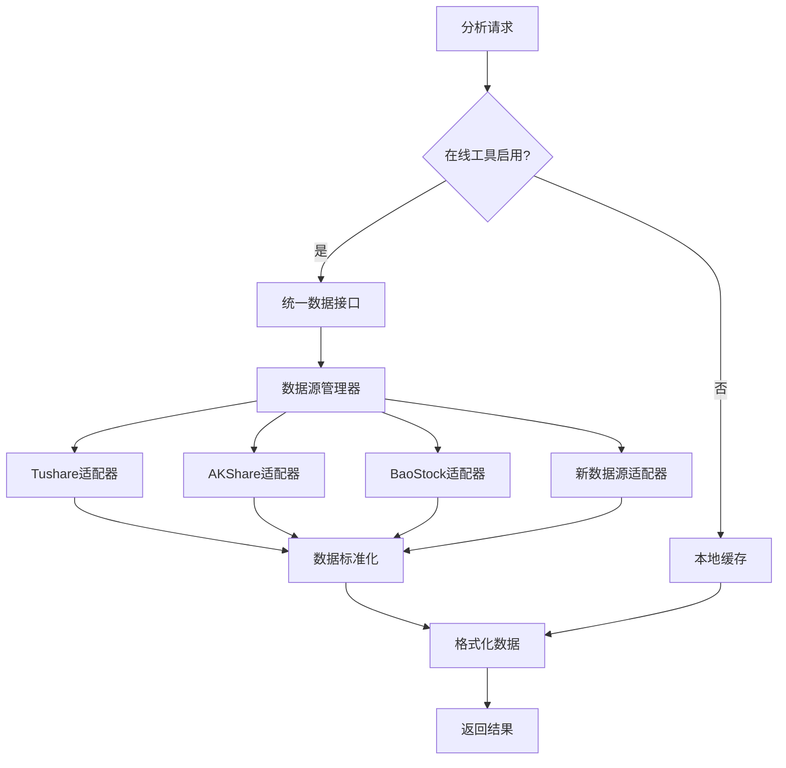
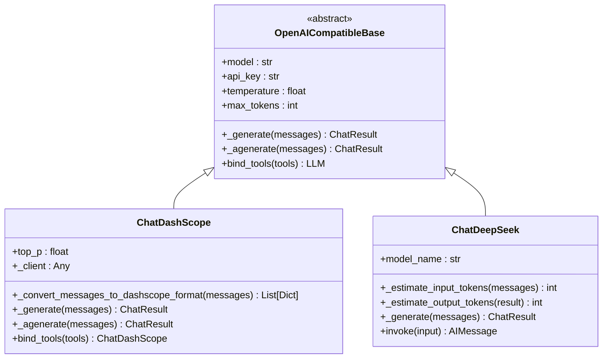

# 扩展开发

<cite>
**本文档引用文件**   
- [fundamentals_analyst.py](file://tradingagents/agents/analysts/fundamentals_analyst.py)
- [data_source_manager.py](file://tradingagents/dataflows/data_source_manager.py)
- [dashscope_adapter.py](file://tradingagents/llm_adapters/dashscope_adapter.py)
- [deepseek_adapter.py](file://tradingagents/llm_adapters/deepseek_adapter.py)
- [openai_compatible_base.py](file://tradingagents/llm_adapters/openai_compatible_base.py)
- [app.py](file://web/app.py)
- [CONTRIBUTORS.md](file://CONTRIBUTORS.md)
- [upstream_git_workflow.sh](file://scripts/git/upstream_git_workflow.sh)
</cite>

## 目录
1. [添加专业分析师智能体](#添加专业分析师智能体)
2. [集成新数据源](#集成新数据源)
3. [开发LLM适配器](#开发llm适配器)
4. [Web界面定制](#web界面定制)
5. [代码贡献流程](#代码贡献流程)
6. [代码贡献示例](#代码贡献示例)

## 添加专业分析师智能体

在TradingAgents-CN系统中，专业分析师智能体是多智能体架构的核心组件。每个分析师负责特定领域的分析任务，如基本面、技术面、新闻和社交媒体分析。要添加新的专业分析师智能体，需要遵循以下接口规范和注册方法。

首先，新的分析师智能体必须实现一个标准的节点函数，该函数接收状态（state）作为输入并返回更新后的状态。状态对象包含分析过程中的所有相关信息，如公司代码、交易日期、消息历史等。分析师智能体通过调用工具获取数据，并将分析结果写入状态对象的相应字段。

注册新分析师智能体需要在`tradingagents/graph/setup.py`文件中进行。系统通过`create_analyst_node`函数工厂模式创建不同类型的分析师节点。新分析师需要在`analyst_nodes`字典中注册，并在工作流中添加相应的节点和边。例如，市场分析师通过`create_market_analyst`函数创建，并在工作流中连接到研究主管节点。

分析师智能体的设计遵循模块化原则，每个分析师专注于单一任务。系统通过`Toolkit`类管理所有可用工具，并根据配置动态选择在线或离线工具。新分析师在初始化时接收LLM实例和工具包，通过绑定工具实现功能扩展。错误处理机制确保在工具调用失败时能够降级到备用数据源。

**Section sources**
- [fundamentals_analyst.py](file://tradingagents/agents/analysts/fundamentals_analyst.py#L1-L401)
- [setup.py](file://tradingagents/graph/setup.py#L55-L79)

## 集成新数据源

系统通过`DataSourceManager`类实现多数据源的统一管理和智能降级。要集成新的数据源，需要遵循API适配和数据格式转换的规范。首先，为新数据源创建适配器类，实现标准的数据获取接口，如`get_stock_data`、`get_stock_info`和`get_fundamentals`。

数据格式转换是集成过程中的关键环节。系统定义了统一的数据格式规范，包括标准的列名（如`open`、`high`、`low`、`close`、`volume`）和数据类型。适配器必须将原始数据转换为这种标准格式，确保上层分析模块的兼容性。例如，Tushare数据源使用`vol`表示成交量，而系统标准使用`volume`，适配器需要进行列名映射。

系统支持多种中国股票数据源，包括Tushare、AKShare和BaoStock。`DataSourceManager`类负责管理这些数据源的优先级和可用性检查。新数据源需要在`ChinaDataSource`枚举中注册，并在`_check_available_sources`方法中添加可用性检测逻辑。系统在运行时根据配置和可用性自动选择最佳数据源。

智能降级机制确保数据获取的可靠性。当首选数据源失败时，系统会自动尝试备用数据源。这种机制通过`_try_fallback_sources`方法实现，按照预定义的优先级顺序尝试不同数据源。开发者需要确保新数据源的错误处理与降级机制兼容，返回标准化的错误信息。



**Diagram sources **
- [data_source_manager.py](file://tradingagents/dataflows/data_source_manager.py#L1-L856)

**Section sources**
- [data_source_manager.py](file://tradingagents/dataflows/data_source_manager.py#L1-L856)

## 开发LLM适配器

系统采用统一的适配器模式实现对多种LLM提供商的支持。要开发新的LLM适配器，需要继承`OpenAICompatibleBase`基类或实现类似的接口规范。适配器的主要职责是将统一的调用接口转换为特定LLM提供商的API格式，并处理认证、错误和性能监控。

适配器开发的关键是实现`_generate`和`_agenerate`方法，分别处理同步和异步调用。这些方法需要将LangChain的消息格式转换为目标LLM的请求格式，调用API，并将响应转换回标准格式。例如，`ChatDashScope`适配器将`SystemMessage`、`HumanMessage`和`AIMessage`转换为DashScope API所需的格式。

系统通过工厂函数`create_openai_compatible_llm`统一管理适配器的创建。新适配器需要在`OPENAI_COMPATIBLE_PROVIDERS`配置中注册，提供适配器类、支持的模型列表和默认API端点。这使得系统能够动态加载和配置不同的LLM提供商，而无需修改核心逻辑。

性能监控和成本跟踪是适配器的重要功能。适配器需要实现token使用量的统计，包括输入和输出token数。系统通过`token_tracker`组件记录这些信息，用于成本分析和性能优化。例如，`ChatDeepSeek`适配器在`_generate`方法中提取token使用量，并调用`track_usage`方法记录。



**Diagram sources **
- [openai_compatible_base.py](file://tradingagents/llm_adapters/openai_compatible_base.py#L381-L434)
- [dashscope_adapter.py](file://tradingagents/llm_adapters/dashscope_adapter.py#L1-L293)
- [deepseek_adapter.py](file://tradingagents/llm_adapters/deepseek_adapter.py#L1-L262)

**Section sources**
- [openai_compatible_base.py](file://tradingagents/llm_adapters/openai_compatible_base.py#L381-L434)
- [dashscope_adapter.py](file://tradingagents/llm_adapters/dashscope_adapter.py#L1-L293)
- [deepseek_adapter.py](file://tradingagents/llm_adapters/deepseek_adapter.py#L1-L262)

## Web界面定制

Web界面基于Streamlit构建，采用模块化设计，便于定制和扩展。主应用文件`app.py`负责初始化会话状态、设置页面配置和渲染主要组件。界面组件分布在`web/components`目录中，包括侧边栏、表单、进度显示和结果展示等。

新UI组件的开发遵循React式的函数组件模式。每个组件是一个独立的Python函数，接收必要的参数并返回渲染结果。组件通过`st`对象访问Streamlit的UI元素，如按钮、输入框和图表。例如，`render_analysis_form`函数渲染分析配置表单，`render_results`函数展示分析报告。

会话状态管理是Web界面的关键特性。系统使用`st.session_state`持久化分析状态，确保页面刷新后不丢失进度。`SmartStreamlitProgressDisplay`类封装了进度跟踪逻辑，与后端的异步分析过程同步。开发者可以通过`get_persistent_analysis_id`和`set_persistent_analysis_id`函数管理分析ID。

界面样式通过自定义CSS实现，确保一致的视觉体验。主应用文件中的`<style>`标签定义了全局样式，包括颜色主题、字体和布局。组件可以定义局部样式，但应遵循整体设计规范。响应式设计确保界面在不同设备上正常显示，支持桌面和移动设备。

**Section sources**
- [app.py](file://web/app.py#L1-L1581)

## 代码贡献流程

代码贡献遵循标准的Git工作流，确保代码质量和协作效率。贡献者首先Fork主仓库，然后创建特性分支进行开发。系统提供`upstream_git_workflow.sh`脚本自动化常见的Git操作，简化贡献流程。

分支管理遵循`feature/`前缀的命名规范。每个功能或修复应在独立的分支中开发，便于代码审查和管理。提交信息应遵循约定式提交（Conventional Commits）规范，清晰描述更改的类型和目的。例如，`feat: add new data source adapter`表示新增功能，`fix: resolve volume mapping issue`表示修复bug。

测试是贡献流程的重要环节。系统提供全面的测试套件，覆盖核心功能和边界情况。贡献者应确保新增代码有足够的测试覆盖，并运行相关测试用例。`test_data_sources_comprehensive.py`等测试文件验证数据源集成的正确性，`test_tool_removal.py`测试工具选择逻辑。

Pull Request（PR）提交前应检查代码风格和文档。系统使用标准的代码格式化工具，确保代码一致性。PR模板在`upstream_contribution`目录中提供，指导贡献者填写必要的信息，如更改描述、测试结果和相关问题。维护者会进行代码审查，提出改进建议，直到满足合并条件。

**Section sources**
- [upstream_git_workflow.sh](file://scripts/git/upstream_git_workflow.sh#L1-L306)
- [CONTRIBUTORS.md](file://CONTRIBUTORS.md#L1-L146)

## 代码贡献示例

以下是一个完整的代码贡献示例，展示如何为系统添加新的数据源适配器。假设我们要集成一个新的数据源"NewDataSource"，提供中国股票数据。

首先，创建适配器类`NewDataSourceAdapter`，实现标准的数据获取方法：
```python
class NewDataSourceAdapter:
    def __init__(self, api_key=None):
        self.api_key = api_key or os.getenv("NEWDATASOURCE_API_KEY")
        if not self.api_key:
            raise ValueError("NewDataSource API key not found")
    
    def get_stock_data(self, symbol, start_date, end_date):
        # 调用API获取数据
        data = self._call_api(symbol, start_date, end_date)
        # 转换为标准格式
        return self._standardize_data(data)
    
    def _standardize_data(self, raw_data):
        # 列名映射和数据类型转换
        mapping = {
            'open_price': 'open',
            'high_price': 'high',
            'low_price': 'low',
            'close_price': 'close',
            'volume_traded': 'volume'
        }
        standardized = raw_data.rename(columns=mapping)
        return standardized
```

然后，在`DataSourceManager`中注册新数据源：
```python
class ChinaDataSource(Enum):
    TUSHARE = "tushare"
    AKSHARE = "akshare"
    BAOSTOCK = "baostock"
    NEWDATASOURCE = "newdatasource"  # 新增数据源

def _check_available_sources(self):
    available = []
    # ... 其他数据源检查
    try:
        import newdatasource
        available.append(ChinaDataSource.NEWDATASOURCE)
    except ImportError:
        pass
    return available
```

最后，添加相应的测试用例，验证新适配器的功能：
```python
def test_newdatasource_adapter():
    adapter = NewDataSourceAdapter()
    data = adapter.get_stock_data("000001", "2025-01-01", "2025-01-31")
    assert "open" in data.columns
    assert "close" in data.columns
    assert "volume" in data.columns
    assert len(data) > 0
```

这个示例展示了从适配器开发、系统集成到测试验证的完整贡献流程，确保新功能的正确性和稳定性。

**Section sources**
- [CONTRIBUTORS.md](file://CONTRIBUTORS.md#L1-L146)