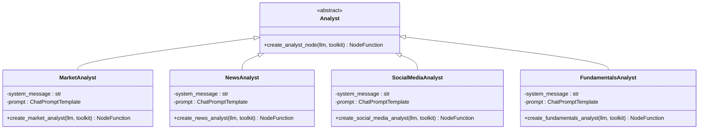
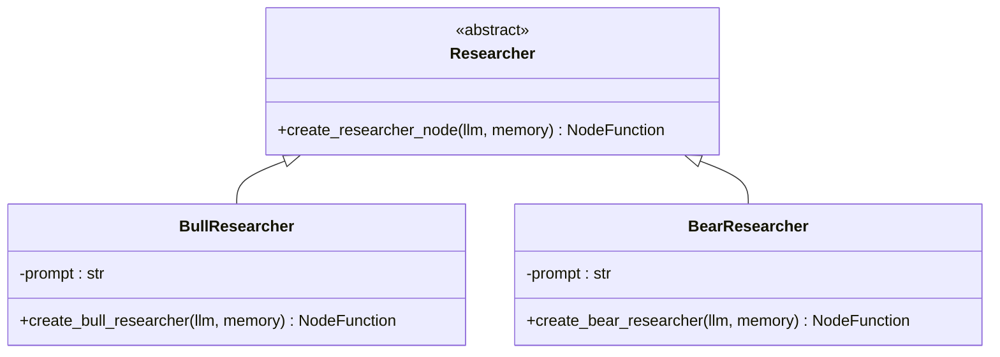
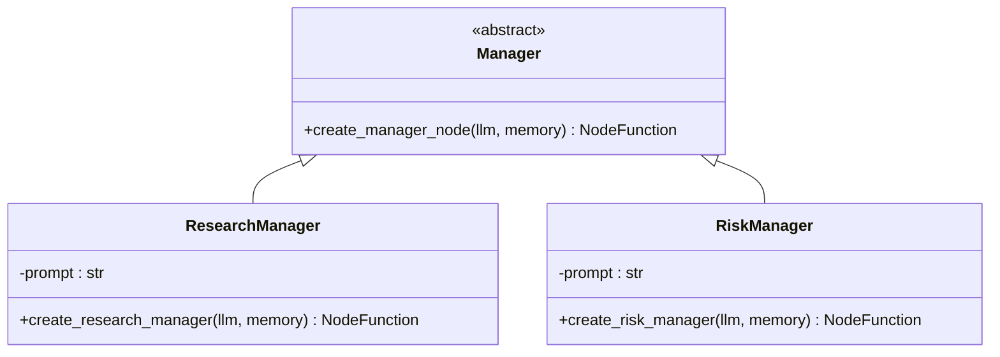
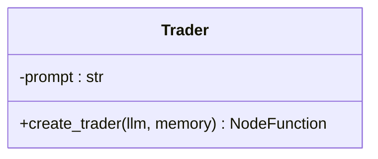
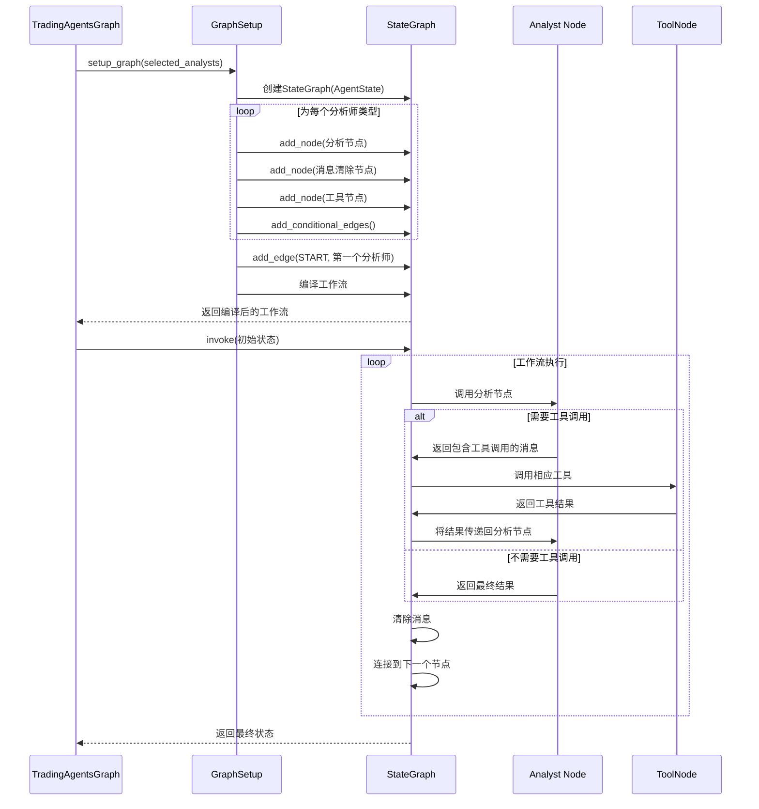
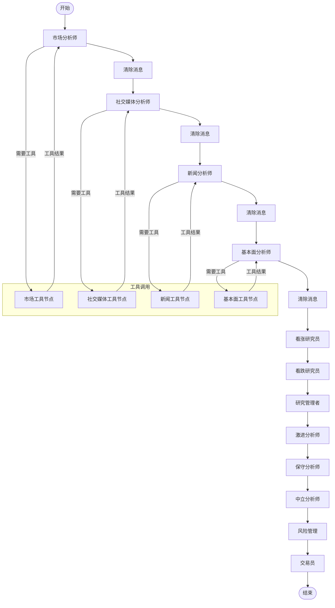
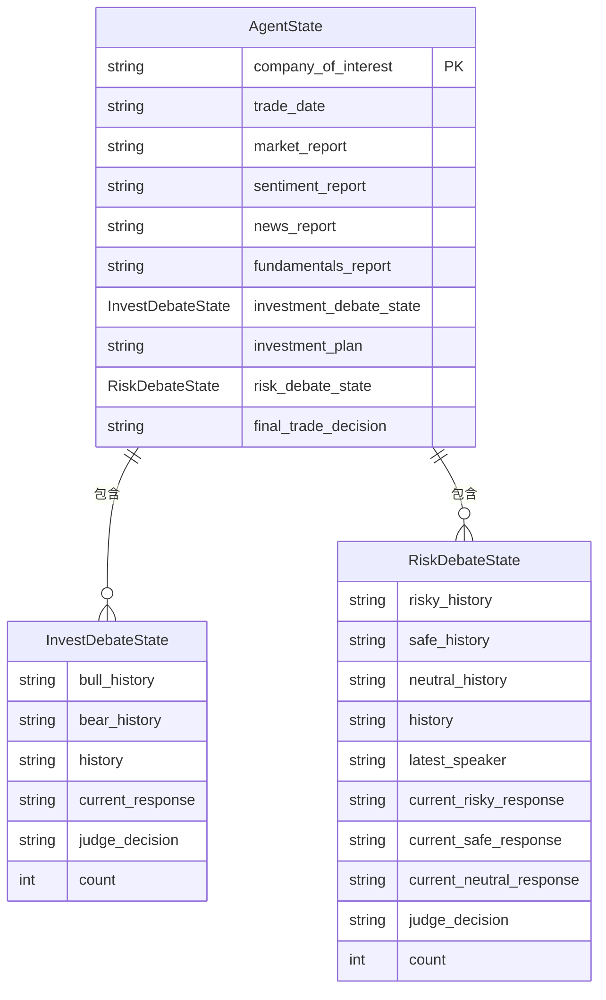
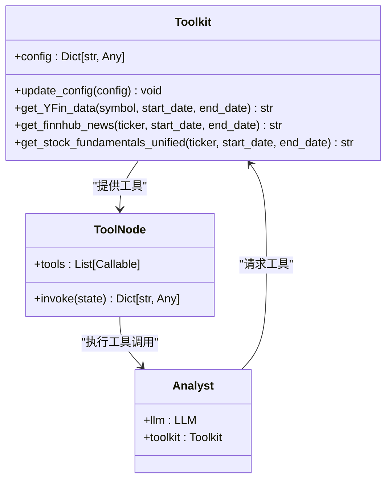
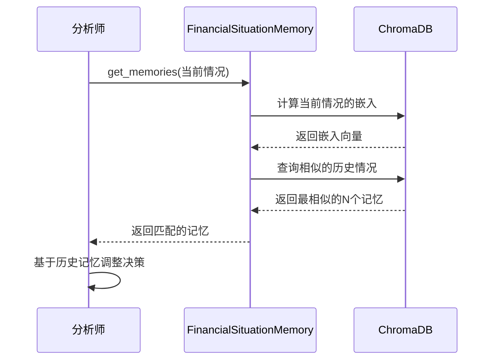
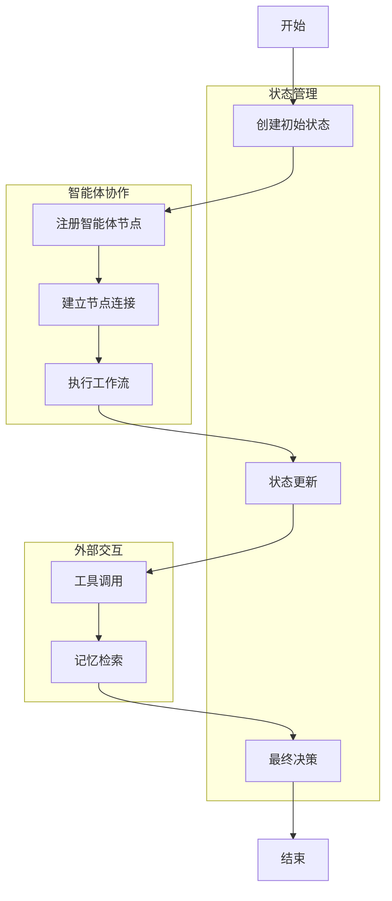

# 添加新的智能体

<cite>
**本文档中引用的文件**   
- [fundamentals_analyst.py](file://tradingagents/agents/analysts/fundamentals_analyst.py)
- [market_analyst.py](file://tradingagents/agents/analysts/market_analyst.py)
- [news_analyst.py](file://tradingagents/agents/analysts/news_analyst.py)
- [social_media_analyst.py](file://tradingagents/agents/analysts/social_media_analyst.py)
- [research_manager.py](file://tradingagents/agents/managers/research_manager.py)
- [risk_manager.py](file://tradingagents/agents/managers/risk_manager.py)
- [bull_researcher.py](file://tradingagents/agents/researchers/bull_researcher.py)
- [bear_researcher.py](file://tradingagents/agents/researchers/bear_researcher.py)
- [trader.py](file://tradingagents/agents/trader/trader.py)
- [agent_states.py](file://tradingagents/agents/utils/agent_states.py)
- [memory.py](file://tradingagents/agents/utils/memory.py)
- [tool_logging.py](file://tradingagents/utils/tool_logging.py)
- [agent_utils.py](file://tradingagents/agents/utils/agent_utils.py)
- [trading_graph.py](file://tradingagents/graph/trading_graph.py)
- [setup.py](file://tradingagents/graph/setup.py)
</cite>

## 目录
1. [智能体接口规范与继承结构](#智能体接口规范与继承结构)
2. [智能体在LangGraph工作流中的注册与调用](#智能体在langgraph工作流中的注册与调用)
3. [状态管理、工具调用与记忆机制](#状态管理工具调用与记忆机制)
4. [创建新的分析师智能体示例](#创建新的分析师智能体示例)
5. [智能体与交易图的集成](#智能体与交易图的集成)
6. [错误处理、日志记录与性能优化](#错误处理日志记录与性能优化)

## 智能体接口规范与继承结构

TradingAgents-CN系统中的智能体遵循统一的接口规范和继承结构，主要分为四类：分析师、研究员、管理者和交易员。每类智能体都通过工厂函数创建，返回一个符合特定签名的节点函数。

### 分析师智能体

分析师智能体负责从不同角度分析股票，包括市场、新闻、社交媒体和基本面。所有分析师智能体都遵循相同的接口规范：

```python
@log_analyst_module("analyst_type")
def analyst_node(state):
    # 分析逻辑
    return {"report_key": analysis_result}
```

- **接口规范**：
  - 使用`@log_analyst_module`装饰器进行日志记录
  - 接收`state`参数，包含当前分析状态
  - 返回包含报告键值对的字典
  - 报告键如`market_report`、`news_report`等在`agent_states.py`中定义

- **继承结构**：
  - 所有分析师继承自`ChatPromptTemplate`和LLM模型
  - 通过`bind_tools`方法绑定相关工具
  - 使用统一的系统提示模板

**分析师类型**：
- **市场分析师**：分析技术指标和市场趋势
- **新闻分析师**：分析宏观经济和公司新闻
- **社交媒体分析师**：分析社交媒体情绪
- **基本面分析师**：分析财务数据和公司基本面



**图表来源**
- [market_analyst.py](file://tradingagents/agents/analysts/market_analyst.py)
- [news_analyst.py](file://tradingagents/agents/analysts/news_analyst.py)
- [social_media_analyst.py](file://tradingagents/agents/analysts/social_media_analyst.py)
- [fundamentals_analyst.py](file://tradingagents/agents/analysts/fundamentals_analyst.py)

### 研究员智能体

研究员智能体分为看涨研究员和看跌研究员，它们基于分析师的报告进行辩论，形成投资观点。

```python
def create_researcher(llm, memory):
    def researcher_node(state):
        # 辩论逻辑
        return {"investment_debate_state": debate_state}
    return researcher_node
```

- **接口规范**：
  - 接收`llm`和`memory`参数
  - 返回更新后的`investment_debate_state`
  - 使用历史记忆进行决策



**图表来源**
- [bull_researcher.py](file://tradingagents/agents/researchers/bull_researcher.py)
- [bear_researcher.py](file://tradingagents/agents/researchers/bear_researcher.py)

### 管理者智能体

管理者智能体负责协调和决策，包括研究管理者和风险管理。

```python
def create_manager(llm, memory):
    def manager_node(state):
        # 决策逻辑
        return {"investment_plan": plan, "final_trade_decision": decision}
    return manager_node
```

- **接口规范**：
  - 接收`llm`和`memory`参数
  - 返回投资计划和最终决策
  - 综合多方信息做出决策



**图表来源**
- [research_manager.py](file://tradingagents/agents/managers/research_manager.py)
- [risk_manager.py](file://tradingagents/agents/managers/risk_manager.py)

### 交易员智能体

交易员智能体负责最终的交易决策和执行。

```python
def create_trader(llm, memory):
    def trader_node(state, name):
        # 交易决策逻辑
        return {"trader_investment_plan": plan, "sender": name}
    return functools.partial(trader_node, name="Trader")
```

- **接口规范**：
  - 使用`functools.partial`预设名称
  - 返回交易计划和发送者信息
  - 基于所有分析结果做出具体交易建议



**图表来源**
- [trader.py](file://tradingagents/agents/trader/trader.py)

## 智能体在LangGraph工作流中的注册与调用

智能体在LangGraph工作流中的注册和调用是通过`GraphSetup`类完成的，该类负责构建整个智能体协作的工作流。

### 工作流注册机制

`GraphSetup.setup_graph()`方法负责注册所有智能体节点并建立它们之间的连接。

```python
def setup_graph(self, selected_analysts=["market", "social", "news", "fundamentals"]):
    # 创建分析节点
    analyst_nodes = {}
    delete_nodes = {}
    tool_nodes = {}
    
    # 根据选择的分析师类型注册节点
    if "market" in selected_analysts:
        analyst_nodes["market"] = create_market_analyst(self.quick_thinking_llm, self.toolkit)
        delete_nodes["market"] = create_msg_delete()
        tool_nodes["market"] = self.tool_nodes["market"]
    
    # ... 其他分析师类型
```

- **注册流程**：
  1. 根据`selected_analysts`参数确定需要注册的分析师类型
  2. 为每种分析师类型创建三个节点：分析节点、消息清除节点和工具节点
  3. 将节点添加到`StateGraph`中
  4. 建立节点间的连接

### 调用流程

智能体的调用流程遵循预定义的工作流，通过条件边（conditional edges）控制执行顺序。



**图表来源**
- [setup.py](file://tradingagents/graph/setup.py)
- [trading_graph.py](file://tradingagents/graph/trading_graph.py)

### 执行顺序

智能体的执行顺序是线性的，按照注册时的顺序依次执行：

1. **分析师阶段**：按顺序执行市场、社交媒体、新闻、基本面分析
2. **研究员阶段**：看涨和看跌研究员进行辩论
3. **管理阶段**：研究管理者做出投资决策
4. **风险评估阶段**：风险分析师评估投资风险
5. **交易阶段**：交易员做出最终交易决策



**图表来源**
- [setup.py](file://tradingagents/graph/setup.py)

## 状态管理、工具调用与记忆机制

### 状态管理（agent_states.py）

状态管理是智能体协作的核心，通过`AgentState`类定义了所有智能体共享的状态结构。

```python
class AgentState(MessagesState):
    company_of_interest: Annotated[str, "感兴趣的公司"]
    trade_date: Annotated[str, "交易日期"]
    
    # 分析阶段
    market_report: Annotated[str, "市场分析师报告"]
    sentiment_report: Annotated[str, "社交媒体分析师报告"]
    news_report: Annotated[str, "新闻分析师报告"]
    fundamentals_report: Annotated[str, "基本面分析师报告"]
    
    # 研究员辩论阶段
    investment_debate_state: Annotated[InvestDebateState, "投资辩论状态"]
    investment_plan: Annotated[str, "投资计划"]
    
    # 风险管理阶段
    risk_debate_state: Annotated[RiskDebateState, "风险辩论状态"]
    final_trade_decision: Annotated[str, "最终交易决策"]
```

- **状态流转**：
  - 初始状态由`Propagator.create_initial_state()`创建
  - 每个智能体节点更新相应的状态字段
  - 状态在智能体间传递，形成完整的分析链



**图表来源**
- [agent_states.py](file://tradingagents/agents/utils/agent_states.py)

### 工具调用（tool_logging.py）

工具调用机制通过`Toolkit`类实现，为智能体提供访问外部数据源的能力。

```python
class Toolkit:
    def __init__(self, config=None):
        if config:
            self.update_config(config)
    
    @staticmethod
    @tool
    def get_YFin_data(symbol, start_date, end_date) -> str:
        """从Yahoo Finance获取股票数据"""
        result_data = interface.get_YFin_data(symbol, start_date, end_date)
        return result_data
    
    @staticmethod
    @tool
    def get_finnhub_news(ticker, start_date, end_date) -> str:
        """从Finnhub获取新闻"""
        finnhub_news_result = interface.get_finnhub_news(ticker, end_date_str, look_back_days)
        return finnhub_news_result
```

- **工具注册**：
  - 使用`@tool`装饰器标记工具方法
  - 工具通过`ToolNode`包装，集成到LangGraph工作流
  - 在`trading_graph.py`中通过`_create_tool_nodes()`方法创建工具节点



**图表来源**
- [agent_utils.py](file://tradingagents/agents/utils/agent_utils.py)
- [tool_logging.py](file://tradingagents/utils/tool_logging.py)

### 记忆机制（memory.py）

记忆机制通过`FinancialSituationMemory`类实现，使用ChromaDB作为向量数据库存储历史决策和经验。

```python
class FinancialSituationMemory:
    def __init__(self, name, config):
        self.config = config
        self.llm_provider = config.get("llm_provider", "openai").lower()
        self.chroma_manager = ChromaDBManager()
        self.situation_collection = self.chroma_manager.get_or_create_collection(name)
    
    def add_situations(self, situations_and_advice):
        """添加财务情况和相应建议"""
        # ... 实现细节
        pass
    
    def get_memories(self, current_situation, n_matches=1):
        """根据当前情况查找匹配的建议"""
        # ... 实现细节
        pass
```

- **记忆流程**：
  1. 初始化时创建ChromaDB集合
  2. 通过`add_situations()`方法添加历史决策
  3. 通过`get_memories()`方法检索相似历史情况
  4. 在智能体决策时参考历史经验



**图表来源**
- [memory.py](file://tradingagents/agents/utils/memory.py)

## 创建新的分析师智能体示例

本节将演示如何为TradingAgents-CN系统创建一个新的分析师智能体——技术分析智能体。

### 步骤1：创建新的分析师文件

在`tradingagents/agents/analysts/`目录下创建`technical_analyst.py`文件：

```python
"""
技术分析智能体
使用技术指标进行股票分析
"""

from langchain_core.prompts import ChatPromptTemplate, MessagesPlaceholder
from langchain_core.messages import AIMessage

# 导入分析模块日志装饰器
from tradingagents.utils.tool_logging import log_analyst_module

# 导入统一日志系统
from tradingagents.utils.logging_init import get_logger
logger = get_logger("default")


def create_technical_analyst(llm, toolkit):
    @log_analyst_module("technical")
    def technical_analyst_node(state):
        logger.debug(f"📊 [DEBUG] ===== 技术分析智能体节点开始 =====")
        
        current_date = state["trade_date"]
        ticker = state["company_of_interest"]
        
        logger.debug(f"📊 [DEBUG] 输入参数: ticker={ticker}, date={current_date}")
        
        # 获取股票市场信息
        from tradingagents.utils.stock_utils import StockUtils
        market_info = StockUtils.get_market_info(ticker)
        
        # 选择技术分析工具
        tools = [
            toolkit.get_stockstats_indicators_report,
            toolkit.get_YFin_data
        ]
        
        # 技术分析系统提示
        system_message = (
            f"你是一位专业的技术分析师。"
            f"任务：分析{ticker}的技术指标和价格走势"
            "📊 分析要求："
            "- 基于真实数据进行技术分析"
            "- 分析主要技术指标（如MACD、RSI、布林带等）"
            "- 识别关键支撑位和阻力位"
            "- 判断当前趋势（上升、下降、盘整）"
            "- 提供基于技术分析的交易建议"
            "🌍 语言要求："
            "- 所有分析内容必须使用中文"
            "- 投资建议必须使用中文：买入、持有、卖出"
            "现在立即开始分析！"
        )
        
        # 创建提示模板
        prompt = ChatPromptTemplate.from_messages([
            ("system", system_message),
            MessagesPlaceholder(variable_name="messages"),
        ])
        
        # 绑定工具
        chain = prompt | llm.bind_tools(tools)
        
        # 调用LLM
        result = chain.invoke(state["messages"])
        
        # 处理结果
        return {
            "technical_report": result.content if hasattr(result, 'content') else str(result)
        }
    
    return technical_analyst_node
```

### 步骤2：更新`__init__.py`文件

在`tradingagents/agents/analysts/__init__.py`中添加新智能体的导入：

```python
from .technical_analyst import create_technical_analyst

__all__ = [
    "create_fundamentals_analyst",
    "create_market_analyst",
    "create_news_analyst",
    "create_social_media_analyst",
    "create_technical_analyst"
]
```

### 步骤3：更新主`__init__.py`文件

在`tradingagents/agents/__init__.py`中添加新智能体的导入：

```python
from .analysts.technical_analyst import create_technical_analyst

__all__ = [
    # ... 其他导出
    "create_technical_analyst",
]
```

### 步骤4：在`setup.py`中注册新智能体

在`tradingagents/graph/setup.py`的`setup_graph`方法中添加新智能体的支持：

```python
def setup_graph(self, selected_analysts=["market", "social", "news", "fundamentals", "technical"]):
    # ... 现有代码
    
    if "technical" in selected_analysts:
        analyst_nodes["technical"] = create_technical_analyst(
            self.quick_thinking_llm, self.toolkit
        )
        delete_nodes["technical"] = create_msg_delete()
        tool_nodes["technical"] = ToolNode([
            self.toolkit.get_stockstats_indicators_report,
            self.toolkit.get_YFin_data,
        ])
    
    # ... 现有代码
```

### 步骤5：更新`agent_states.py`

在`tradingagents/agents/utils/agent_states.py`中添加新的报告字段：

```python
class AgentState(MessagesState):
    # ... 现有字段
    
    # 新增技术分析报告
    technical_report: Annotated[str, "Report from the Technical Analyst"]
    
    # ... 其他字段
```

### 完整的技术分析智能体实现

```python
"""
技术分析智能体 - 完整实现
"""

from langchain_core.prompts import ChatPromptTemplate, MessagesPlaceholder
from langchain_core.messages import AIMessage

# 导入分析模块日志装饰器
from tradingagents.utils.tool_logging import log_analyst_module

# 导入统一日志系统
from tradingagents.utils.logging_init import get_logger
logger = get_logger("default")


def create_technical_analyst(llm, toolkit):
    @log_analyst_module("technical")
    def technical_analyst_node(state):
        logger.debug(f"📊 [DEBUG] ===== 技术分析智能体节点开始 =====")
        
        current_date = state["trade_date"]
        ticker = state["company_of_interest"]
        start_date = '2025-05-28'
        
        logger.debug(f"📊 [DEBUG] 输入参数: ticker={ticker}, date={current_date}")
        logger.debug(f"📊 [DEBUG] 当前状态中的消息数量: {len(state.get('messages', []))}")
        
        # 获取股票市场信息
        from tradingagents.utils.stock_utils import StockUtils
        market_info = StockUtils.get_market_info(ticker)
        
        logger.debug(f"📊 [DEBUG] 股票类型检查: {ticker} -> {market_info['market_name']}")
        
        # 选择工具
        tools = [
            toolkit.get_stockstats_indicators_report,
            toolkit.get_YFin_data,
            toolkit.get_stockstats_indicators_report_online,
            toolkit.get_YFin_data_online,
        ]
        
        # 统一的系统提示
        system_message = (
            f"你是一位专业的技术分析师。"
            f"⚠️ 绝对强制要求：你必须调用工具获取真实数据！不允许任何假设或编造！"
            f"任务：分析{ticker}（{market_info['market_name']}）的技术指标和价格走势"
            f"🔴 立即调用 get_stockstats_indicators_report 工具"
            f"参数：symbol='{ticker}', indicator='all', curr_date='{current_date}'"
            "📊 分析要求："
            "- 基于真实数据进行深度技术分析"
            "- 分析主要技术指标（MACD、RSI、布林带、KDJ等）"
            "- 识别关键支撑位和阻力位"
            "- 判断当前趋势（上升、下降、盘整）"
            "- 提供基于技术分析的交易建议"
            "🌍 语言要求："
            "- 所有分析内容必须使用中文"
            "- 投资建议必须使用中文：买入、持有、卖出"
            "- 绝对不允许使用英文：buy、hold、sell"
            "🚫 严格禁止："
            "- 不允许说'我将调用工具'"
            "- 不允许假设任何数据"
            "- 不允许编造技术指标"
            "- 不允许直接回答而不调用工具"
            "- 不允许回复'无法确定'或'需要更多信息'"
            "- 不允许使用英文投资建议（buy/hold/sell）"
            "✅ 你必须："
            "- 立即调用技术分析工具"
            "- 等待工具返回真实数据"
            "- 基于真实数据进行分析"
            "- 提供具体的交易建议"
            "- 使用中文投资建议（买入/持有/卖出）"
            "现在立即开始调用工具！不要说任何其他话！"
        )
        
        # 系统提示模板
        system_prompt = (
            "🔴 强制要求：你必须调用工具获取真实数据！"
            "🚫 绝对禁止：不允许假设、编造或直接回答任何问题！"
            "✅ 你必须：立即调用提供的工具获取真实数据，然后基于真实数据进行分析。"
            "可用工具：{tool_names}。\n{system_message}"
            "当前日期：{current_date}。"
            "分析目标：{ticker}。"
        )
        
        # 创建提示模板
        prompt = ChatPromptTemplate.from_messages([
            ("system", system_prompt),
            MessagesPlaceholder(variable_name="messages"),
        ])
        
        prompt = prompt.partial(system_message=system_message)
        
        # 安全地获取工具名称
        tool_names = []
        for tool in tools:
            if hasattr(tool, 'name'):
                tool_names.append(tool.name)
            elif hasattr(tool, '__name__'):
                tool_names.append(tool.__name__)
            else:
                tool_names.append(str(tool))
        
        prompt = prompt.partial(tool_names=", ".join(tool_names))
        prompt = prompt.partial(current_date=current_date)
        prompt = prompt.partial(ticker=ticker)
        
        # 绑定工具
        try:
            chain = prompt | llm.bind_tools(tools)
            logger.debug(f"📊 [DEBUG] ✅ 工具绑定成功，绑定了 {len(tools)} 个工具")
        except Exception as e:
            logger.error(f"📊 [DEBUG] ❌ 工具绑定失败: {e}")
            raise e
        
        logger.debug(f"📊 [DEBUG] 调用LLM链...")
        
        result = chain.invoke(state["messages"])
        logger.debug(f"📊 [DEBUG] LLM调用完成")
        
        # 检查工具调用情况
        tool_call_count = len(result.tool_calls) if hasattr(result, 'tool_calls') else 0
        logger.debug(f"📊 [DEBUG] 工具调用数量: {tool_call_count}")
        
        if tool_call_count > 0:
            # 有工具调用，返回状态让工具执行
            tool_calls_info = []
            for tc in result.tool_calls:
                tool_calls_info.append(tc['name'])
                logger.debug(f"📊 [DEBUG] 工具调用 {len(tool_calls_info)}: {tc}")
            
            logger.info(f"📊 [技术分析] 工具调用: {tool_calls_info}")
            return {
                "messages": [result],
                "technical_report": result.content if hasattr(result, 'content') else str(result)
            }
        else:
            # 没有工具调用，返回错误信息
            logger.debug(f"📊 [DEBUG] 检测到模型未调用工具")
            return {
                "technical_report": "技术分析失败：模型未调用工具获取数据"
            }
    
    return technical_analyst_node
```

**代码来源**
- [fundamentals_analyst.py](file://tradingagents/agents/analysts/fundamentals_analyst.py)
- [market_analyst.py](file://tradingagents/agents/analysts/market_analyst.py)

## 智能体与交易图的集成

### 输入/输出模式定义

智能体与交易图的集成通过明确定义的输入/输出模式实现，确保数据在智能体间正确传递。

#### 输入模式

每个智能体接收`AgentState`作为输入，包含以下关键字段：

- `company_of_interest`：感兴趣的公司代码
- `trade_date`：交易日期
- `messages`：当前对话消息
- 各类报告字段（如`market_report`、`news_report`等）

#### 输出模式

每个智能体返回一个字典，包含更新后的状态字段：

- 分析师返回相应的报告字段
- 研究员返回更新的辩论状态
- 管理者返回投资计划和最终决策
- 交易员返回交易计划

### 集成流程



**图表来源**
- [trading_graph.py](file://tradingagents/graph/trading_graph.py)
- [setup.py](file://tradingagents/graph/setup.py)

### 配置示例

在使用新智能体时，需要在配置中启用它：

```python
# 创建交易图实例时包含新智能体
graph = TradingAgentsGraph(
    selected_analysts=["market", "news", "fundamentals", "technical"],
    config=my_config
)
```

## 错误处理、日志记录与性能优化

### 错误处理最佳实践

1. **异常捕获**：在关键操作周围使用try-catch块
2. **降级策略**：当主要数据源失败时，尝试备用数据源
3. **空值处理**：对可能为空的返回值进行检查
4. **超时处理**：为外部API调用设置超时

```python
try:
    result = some_api_call()
    if result is None:
        logger.warning("API返回空值，使用默认值")
        result = default_value
except TimeoutError:
    logger.error("API调用超时，尝试备用数据源")
    result = fallback_api_call()
except Exception as e:
    logger.error(f"未知错误: {e}")
    result = error_default_value
```

### 日志记录最佳实践

1. **分层日志**：使用不同日志级别（debug、info、warning、error）
2. **上下文信息**：在日志中包含相关上下文
3. **性能监控**：记录关键操作的执行时间
4. **追踪ID**：为相关操作使用相同的追踪ID

```python
import time

logger.debug(f"📊 [DEBUG] 开始技术分析: ticker={ticker}")
start_time = time.time()

try:
    # 执行分析
    result = perform_analysis(ticker)
    execution_time = time.time() - start_time
    logger.info(f"✅ [INFO] 技术分析完成: ticker={ticker}, time={execution_time:.2f}s")
    return result
except Exception as e:
    execution_time = time.time() - start_time
    logger.error(f"❌ [ERROR] 技术分析失败: ticker={ticker}, error={e}, time={execution_time:.2f}s")
    raise
```

### 性能优化最佳实践

1. **缓存机制**：对频繁访问的数据使用缓存
2. **批量处理**：将多个小请求合并为批量请求
3. **异步调用**：对独立操作使用异步调用
4. **资源复用**：复用已创建的对象和连接

```python
# 使用缓存
from functools import lru_cache

@lru_cache(maxsize=128)
def get_stock_data_cached(symbol, start_date, end_date):
    return get_stock_data(symbol, start_date, end_date)

# 异步处理多个股票
import asyncio

async def analyze_multiple_stocks(symbols):
    tasks = [analyze_single_stock(symbol) for symbol in symbols]
    results = await asyncio.gather(*tasks)
    return results
```

**代码来源**
- [tool_logging.py](file://tradingagents/utils/tool_logging.py)
- [memory.py](file://tradingagents/agents/utils/memory.py)