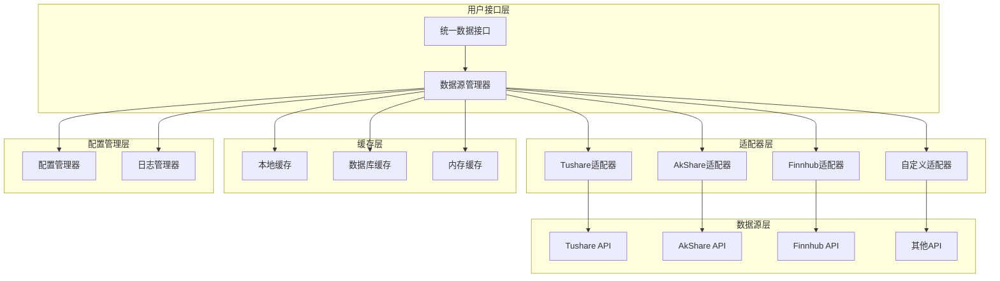
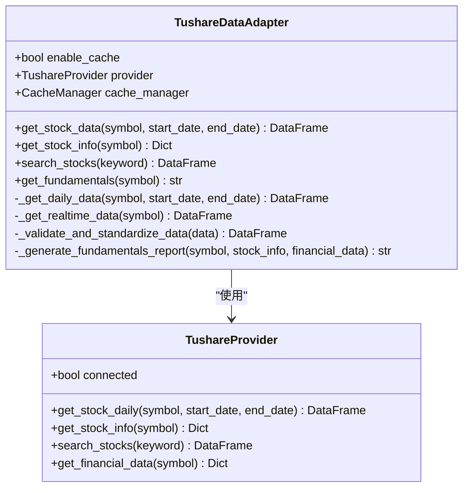
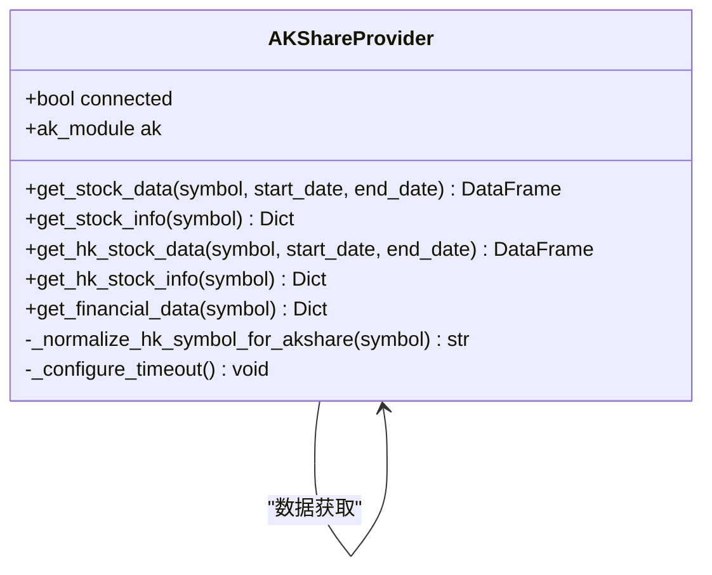
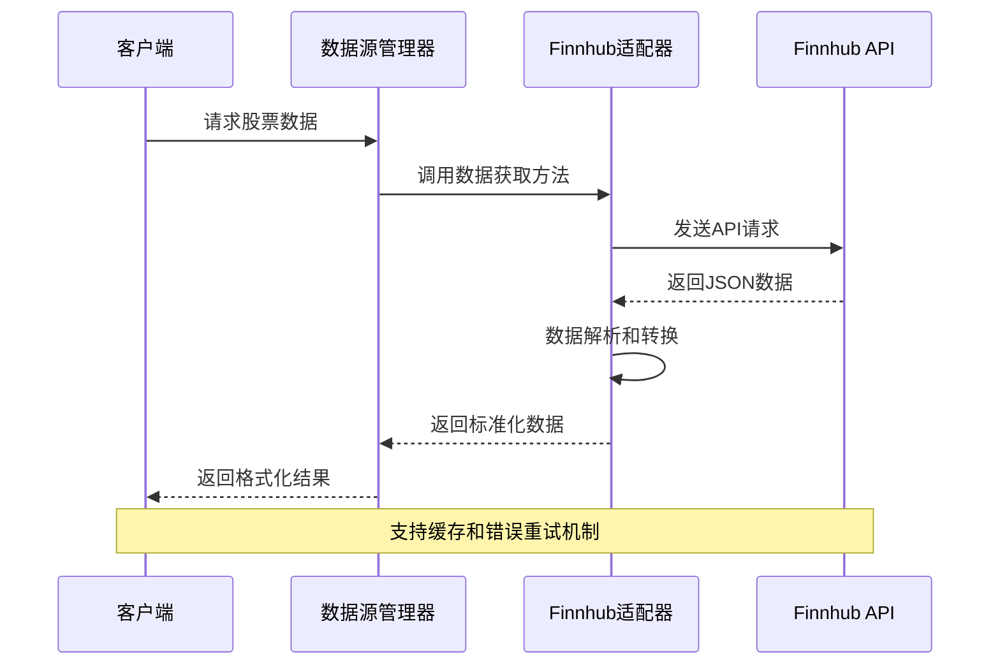
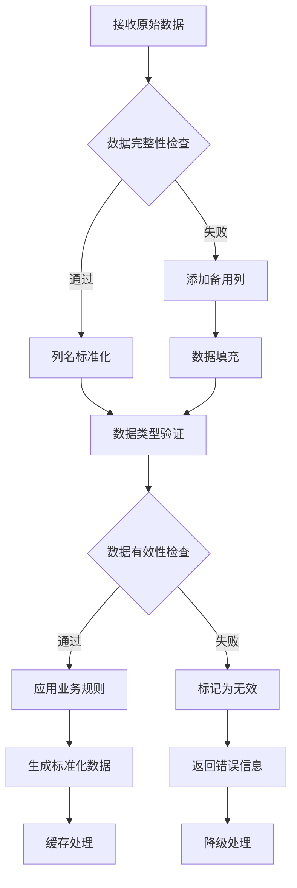
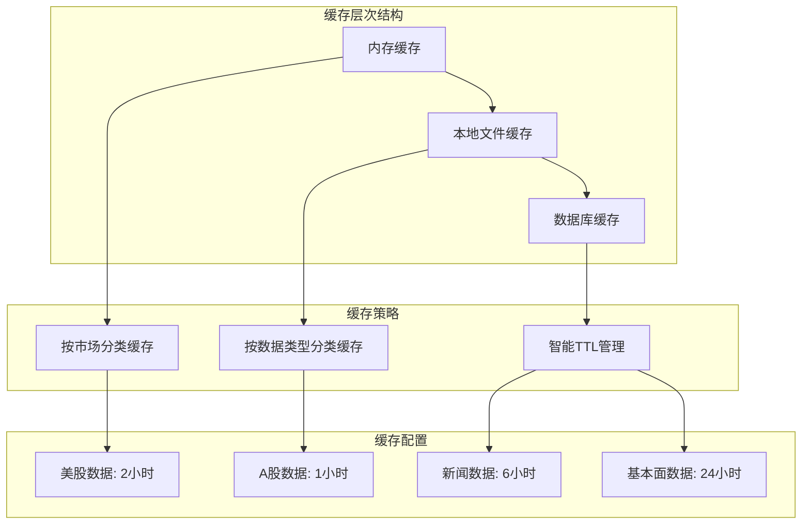
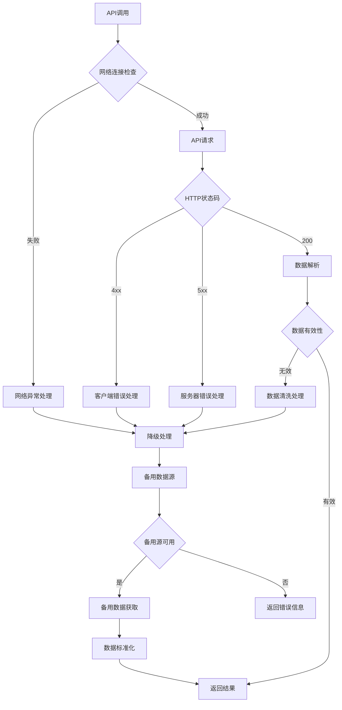

# 集成新的数据源

<cite>
**本文档引用的文件**
- [interface.py](file://tradingagents/dataflows/interface.py)
- [data_source_manager.py](file://tradingagents/dataflows/data_source_manager.py)
- [cache_manager.py](file://tradingagents/dataflows/cache_manager.py)
- [optimized_us_data.py](file://tradingagents/dataflows/optimized_us_data.py)
- [tushare_adapter.py](file://tradingagents/dataflows/tushare_adapter.py)
- [akshare_utils.py](file://tradingagents/dataflows/akshare_utils.py)
- [finnhub_utils.py](file://tradingagents/dataflows/finnhub_utils.py)
- [config.py](file://tradingagents/dataflows/config.py)
- [utils.py](file://tradingagents/dataflows/utils.py)
</cite>

## 目录
1. [概述](#概述)
2. [系统架构](#系统架构)
3. [现有数据源分析](#现有数据源分析)
4. [数据标准化流程](#数据标准化流程)
5. [适配器设计模式](#适配器设计模式)
6. [缓存策略](#缓存策略)
7. [异常处理机制](#异常处理机制)
8. [新数据源集成指南](#新数据源集成指南)
9. [最佳实践](#最佳实践)
10. [故障排除](#故障排除)

## 概述

TradingAgents-CN系统采用模块化架构设计，通过统一的接口层和适配器模式支持多种金融数据API的集成。本指南详细说明了如何将新的金融数据API无缝集成到系统中，包括数据标准化、缓存优化、错误处理和性能监控等核心功能。

系统的核心设计理念是：
- **统一接口**：所有数据源通过标准化接口提供服务
- **适配器模式**：每个数据源都有独立的适配器实现
- **缓存优化**：智能缓存策略减少API调用和提升响应速度
- **降级机制**：多层级备用数据源确保服务连续性
- **性能监控**：实时监控和日志记录支持运维管理

## 系统架构



**图表来源**
- [data_source_manager.py](file://tradingagents/dataflows/data_source_manager.py#L1-L50)
- [interface.py](file://tradingagents/dataflows/interface.py#L1-L100)

## 现有数据源分析

### Tushare数据源

Tushare是中国领先的金融数据API，提供丰富的A股市场数据。



**图表来源**
- [tushare_adapter.py](file://tradingagents/dataflows/tushare_adapter.py#L25-L100)
- [tushare_adapter.py](file://tradingagents/dataflows/tushare_adapter.py#L150-L250)

### AkShare数据源

AkShare是一个开源的金融数据接口库，支持多种市场的股票数据获取。



**图表来源**
- [akshare_utils.py](file://tradingagents/dataflows/akshare_utils.py#L15-L50)
- [akshare_utils.py](file://tradingagents/dataflows/akshare_utils.py#L100-L200)

### Finnhub数据源

Finnhub提供全球股市数据，特别适合美股和国际市场的数据需求。



**图表来源**
- [finnhub_utils.py](file://tradingagents/dataflows/finnhub_utils.py#L10-L50)
- [optimized_us_data.py](file://tradingagents/dataflows/optimized_us_data.py#L50-L150)

**章节来源**
- [tushare_adapter.py](file://tradingagents/dataflows/tushare_adapter.py#L1-L100)
- [akshare_utils.py](file://tradingagents/dataflows/akshare_utils.py#L1-L100)
- [finnhub_utils.py](file://tradingagents/dataflows/finnhub_utils.py#L1-L57)

## 数据标准化流程

系统采用严格的数据标准化流程，确保不同数据源的数据格式一致性。

### 标准化字段映射

| 标准字段 | Tushare | AkShare | Finnhub | 自定义 |
|---------|---------|---------|---------|--------|
| 日期 | trade_date | 日期 | date | date |
| 开盘价 | open | 开盘 | open | open |
| 收盘价 | close | 收盘 | close | close |
| 最高价 | high | 最高 | high | high |
| 最低价 | low | 最低 | low | low |
| 成交量 | vol | 成交量 | volume | volume |
| 成交额 | amount | 成交额 | amount | amount |
| 股票代码 | ts_code | code | symbol | symbol |

### 数据验证机制



**图表来源**
- [tushare_adapter.py](file://tradingagents/dataflows/tushare_adapter.py#L200-L300)
- [akshare_utils.py](file://tradingagents/dataflows/akshare_utils.py#L300-L400)

**章节来源**
- [tushare_adapter.py](file://tradingagents/dataflows/tushare_adapter.py#L200-L400)
- [akshare_utils.py](file://tradingagents/dataflows/akshare_utils.py#L300-L500)

## 适配器设计模式

### 适配器接口规范

每个数据源适配器必须实现以下核心接口：

```python
class BaseDataAdapter:
    def get_stock_data(self, symbol: str, start_date: str, end_date: str) -> Union[pd.DataFrame, str]:
        """获取股票历史数据"""
        pass
    
    def get_stock_info(self, symbol: str) -> Dict:
        """获取股票基本信息"""
        pass
    
    def search_stocks(self, keyword: str) -> pd.DataFrame:
        """搜索股票"""
        pass
    
    def get_fundamentals(self, symbol: str) -> str:
        """获取基本面数据"""
        pass
```

### 适配器实现模板

以下是新数据源适配器的标准实现模板：

```python
class CustomDataAdapter:
    def __init__(self, enable_cache: bool = True):
        self.enable_cache = enable_cache
        self.provider = self._initialize_provider()
        self.cache_manager = self._initialize_cache()
    
    def _initialize_provider(self):
        """初始化数据提供器"""
        try:
            # 实现具体的API客户端初始化
            return CustomProvider()
        except Exception as e:
            logger.error(f"❌ 自定义数据源初始化失败: {e}")
            return None
    
    def get_stock_data(self, symbol: str, start_date: str, end_date: str) -> Union[pd.DataFrame, str]:
        """获取股票数据的主要实现"""
        # 实现数据获取逻辑
        pass
```

**章节来源**
- [tushare_adapter.py](file://tradingagents/dataflows/tushare_adapter.py#L25-L100)
- [akshare_utils.py](file://tradingagents/dataflows/akshare_utils.py#L15-L50)

## 缓存策略

### 多层缓存架构



**图表来源**
- [cache_manager.py](file://tradingagents/dataflows/cache_manager.py#L50-L150)

### 缓存键生成策略

缓存键采用基于参数的哈希算法，确保唯一性和可追溯性：

```python
def _generate_cache_key(self, data_type: str, symbol: str, **kwargs) -> str:
    """生成缓存键"""
    params_str = f"{data_type}_{symbol}"
    for key, value in sorted(kwargs.items()):
        params_str += f"_{key}_{value}"
    
    cache_key = hashlib.md5(params_str.encode()).hexdigest()[:12]
    return f"{symbol}_{data_type}_{cache_key}"
```

### 缓存失效机制

系统实现了智能的缓存失效策略：

- **时间驱动失效**：基于配置的TTL（生存时间）
- **内容驱动失效**：基于数据质量和完整性检查
- **手动刷新**：支持强制刷新缓存的功能

**章节来源**
- [cache_manager.py](file://tradingagents/dataflows/cache_manager.py#L1-L200)
- [optimized_us_data.py](file://tradingagents/dataflows/optimized_us_data.py#L100-L200)

## 异常处理机制

### 多层级异常处理



**图表来源**
- [data_source_manager.py](file://tradingagents/dataflows/data_source_manager.py#L300-L400)

### 降级机制实现

系统实现了智能的降级机制，确保服务的高可用性：

```python
def _try_fallback_sources(self, symbol: str, start_date: str, end_date: str) -> str:
    """尝试备用数据源 - 避免递归调用"""
    fallback_order = [
        ChinaDataSource.AKSHARE,
        ChinaDataSource.TUSHARE,
        ChinaDataSource.BAOSTOCK
    ]
    
    for source in fallback_order:
        if source != self.current_source and source in self.available_sources:
            try:
                # 直接调用具体的数据源方法，避免递归
                if source == ChinaDataSource.TUSHARE:
                    result = self._get_tushare_data(symbol, start_date, end_date)
                elif source == ChinaDataSource.AKSHARE:
                    result = self._get_akshare_data(symbol, start_date, end_date)
                # ... 其他数据源
                return result
            except Exception as e:
                continue
    
    return f"❌ 所有数据源都无法获取{symbol}的数据"
```

**章节来源**
- [data_source_manager.py](file://tradingagents/dataflows/data_source_manager.py#L400-L500)

## 新数据源集成指南

### 第一步：创建适配器类

1. **继承基础接口**：实现标准的数据源接口
2. **初始化配置**：设置API密钥和基础URL
3. **错误处理**：实现异常捕获和重试机制

```python
class NewDataSourceAdapter:
    def __init__(self, api_key: str = None, base_url: str = None):
        self.api_key = api_key or os.getenv('NEW_DATA_API_KEY')
        self.base_url = base_url or 'https://api.newdatasource.com/v1'
        self.session = self._create_session()
        self.cache_enabled = True
    
    def _create_session(self):
        """创建HTTP会话"""
        session = requests.Session()
        session.headers.update({
            'Content-Type': 'application/json',
            'Authorization': f'Bearer {self.api_key}'
        })
        return session
```

### 第二步：实现数据获取方法

```python
def get_stock_data(self, symbol: str, start_date: str, end_date: str) -> pd.DataFrame:
    """获取股票历史数据"""
    try:
        # 构建API请求URL
        endpoint = f"{self.base_url}/stocks/{symbol}/history"
        params = {
            'start_date': start_date,
            'end_date': end_date,
            'interval': 'daily'
        }
        
        # 检查缓存
        if self.cache_enabled:
            cache_key = self._generate_cache_key('stock_data', symbol, start_date=start_date, end_date=end_date)
            cached_data = self._load_from_cache(cache_key)
            if cached_data is not None:
                return cached_data
        
        # 发送API请求
        response = self.session.get(endpoint, params=params, timeout=30)
        response.raise_for_status()
        
        # 解析响应数据
        raw_data = response.json()
        df = self._parse_stock_data(raw_data)
        
        # 标准化数据格式
        standardized_data = self._standardize_data(df)
        
        # 保存到缓存
        if self.cache_enabled:
            self._save_to_cache(cache_key, standardized_data)
        
        return standardized_data
        
    except requests.RequestException as e:
        logger.error(f"❌ API请求失败: {e}")
        return pd.DataFrame()
    except Exception as e:
        logger.error(f"❌ 数据处理失败: {e}")
        return pd.DataFrame()
```

### 第三步：实现数据标准化

```python
def _standardize_data(self, data: pd.DataFrame) -> pd.DataFrame:
    """标准化数据格式"""
    if data.empty:
        return data
    
    # 列名映射
    column_mapping = {
        'date': 'date',
        'open': 'open',
        'close': 'close',
        'high': 'high',
        'low': 'low',
        'volume': 'volume',
        'symbol': 'code'
    }
    
    # 重命名列
    data = data.rename(columns=column_mapping)
    
    # 验证必要列
    required_columns = ['date', 'open', 'close', 'high', 'low', 'volume']
    missing_columns = [col for col in required_columns if col not in data.columns]
    
    if missing_columns:
        logger.warning(f"⚠️ 缺少必要列: {missing_columns}")
        return pd.DataFrame()
    
    # 数据类型转换
    data['date'] = pd.to_datetime(data['date'])
    numeric_columns = ['open', 'close', 'high', 'low', 'volume']
    for col in numeric_columns:
        data[col] = pd.to_numeric(data[col], errors='coerce')
    
    return data.sort_values('date').reset_index(drop=True)
```

### 第四步：注册数据源管理器

```python
class ChinaDataSource(Enum):
    """中国股票数据源枚举"""
    TUSHARE = "tushare"
    AKSHARE = "akshare"
    BAOSTOCK = "baostock"
    NEW_DATA = "new_data"  # 新增数据源

class DataSourceManager:
    def __init__(self):
        # ... 现有初始化代码
        self._register_new_data_source()
    
    def _register_new_data_source(self):
        """注册新的数据源"""
        try:
            from .new_data_adapter import NewDataSourceAdapter
            self.new_data_adapter = NewDataSourceAdapter()
            self.available_sources.append(ChinaDataSource.NEW_DATA)
            logger.info("✅ 新数据源注册成功")
        except ImportError as e:
            logger.warning(f"⚠️ 新数据源注册失败: {e}")
    
    def get_stock_data(self, symbol: str, start_date: str = None, end_date: str = None) -> str:
        """获取股票数据的统一接口"""
        # 根据当前数据源调用相应的方法
        if self.current_source == ChinaDataSource.NEW_DATA:
            return self._get_new_data(symbol, start_date, end_date)
        # ... 其他数据源处理
```

### 第五步：配置和测试

1. **环境变量配置**：设置API密钥和基础URL
2. **单元测试**：编写完整的测试用例
3. **集成测试**：验证与现有系统的兼容性
4. **性能测试**：评估API调用频率和响应时间

```python
# 测试脚本示例
def test_new_data_source():
    """测试新数据源功能"""
    adapter = NewDataSourceAdapter(api_key="test_key")
    
    # 测试数据获取
    data = adapter.get_stock_data("AAPL", "2024-01-01", "2024-01-31")
    assert not data.empty, "数据获取失败"
    
    # 测试缓存功能
    cached_data = adapter.get_stock_data("AAPL", "2024-01-01", "2024-01-31")
    assert len(data) == len(cached_data), "缓存数据不一致"
    
    print("✅ 新数据源测试通过")
```

**章节来源**
- [tushare_adapter.py](file://tradingagents/dataflows/tushare_adapter.py#L25-L150)
- [data_source_manager.py](file://tradingagents/dataflows/data_source_manager.py#L50-L200)

## 最佳实践

### 1. API调用优化

- **批量请求**：尽可能使用批量API减少调用次数
- **并发控制**：实现合理的并发限制避免API限流
- **指数退避**：在重试时使用指数退避算法

```python
def _make_request_with_retry(self, url: str, params: dict = None, max_retries: int = 3):
    """带重试机制的API请求"""
    for attempt in range(max_retries):
        try:
            response = self.session.get(url, params=params, timeout=30)
            if response.status_code == 429:  # Too Many Requests
                sleep_time = 2 ** attempt
                time.sleep(sleep_time)
                continue
            response.raise_for_status()
            return response.json()
        except requests.RequestException as e:
            if attempt == max_retries - 1:
                raise
            time.sleep(2 ** attempt)
```

### 2. 数据质量保证

- **完整性检查**：验证关键字段的存在和有效性
- **异常值检测**：识别和处理异常的价格和成交量数据
- **时间序列验证**：确保数据的时间顺序正确

```python
def _validate_data_quality(self, data: pd.DataFrame) -> bool:
    """验证数据质量"""
    if data.empty:
        return False
    
    # 检查关键字段
    required_fields = ['date', 'open', 'close', 'high', 'low', 'volume']
    for field in required_fields:
        if field not in data.columns:
            logger.warning(f"缺少必要字段: {field}")
            return False
    
    # 检查价格合理性
    invalid_prices = data[(data['high'] <= data['low']) | 
                         (data['close'] <= 0) | 
                         (data['volume'] < 0)]
    if len(invalid_prices) > 0:
        logger.warning(f"发现{len(invalid_prices)}条异常数据")
        return False
    
    return True
```

### 3. 缓存策略优化

- **智能TTL**：根据数据类型动态调整缓存时间
- **预热机制**：在高峰时段提前加载常用数据
- **压缩存储**：对大型数据集进行压缩存储

```python
def _get_cache_ttl(self, data_type: str, symbol: str) -> int:
    """获取缓存TTL（小时）"""
    market_type = self._determine_market_type(symbol)
    ttl_config = {
        'stock_data': 1 if market_type == 'china' else 2,
        'news': 6,
        'fundamentals': 24
    }
    return ttl_config.get(data_type, 24)
```

### 4. 监控和日志

- **性能指标**：记录API响应时间和成功率
- **错误追踪**：详细记录错误信息和上下文
- **使用统计**：跟踪各数据源的使用情况

```python
def _log_api_call(self, symbol: str, data_type: str, duration: float, success: bool):
    """记录API调用日志"""
    logger.info(f"📊 API调用统计",
               extra={
                   'symbol': symbol,
                   'data_type': data_type,
                   'duration': duration,
                   'success': success,
                   'timestamp': datetime.now().isoformat(),
                   'event_type': 'api_call'
               })
```

**章节来源**
- [optimized_us_data.py](file://tradingagents/dataflows/optimized_us_data.py#L200-L300)
- [cache_manager.py](file://tradingagents/dataflows/cache_manager.py#L400-L500)

## 故障排除

### 常见问题及解决方案

#### 1. API认证失败

**问题症状**：出现401 Unauthorized错误
**解决方案**：
- 检查API密钥是否正确配置
- 验证密钥权限是否足够
- 确认密钥未过期

```python
def _check_api_credentials(self) -> bool:
    """检查API凭据"""
    if not self.api_key:
        logger.error("❌ API密钥未配置")
        return False
    
    try:
        # 发送测试请求
        response = self.session.get(f"{self.base_url}/test", timeout=10)
        if response.status_code == 401:
            logger.error("❌ API认证失败，请检查密钥")
            return False
        return True
    except Exception as e:
        logger.error(f"❌ API连接测试失败: {e}")
        return False
```

#### 2. 数据格式不兼容

**问题症状**：数据标准化过程中出现错误
**解决方案**：
- 检查API响应格式
- 更新列名映射表
- 添加数据清洗逻辑

```python
def _detect_data_format(self, raw_data: dict) -> str:
    """检测数据格式"""
    if 'timestamp' in raw_data and 'price' in raw_data:
        return 'format_a'
    elif 'date' in raw_data and 'close' in raw_data:
        return 'format_b'
    else:
        return 'unknown'
```

#### 3. 缓存问题

**问题症状**：缓存数据不准确或无法加载
**解决方案**：
- 检查缓存目录权限
- 验证缓存文件完整性
- 清理损坏的缓存文件

```python
def _verify_cache_integrity(self, cache_key: str) -> bool:
    """验证缓存完整性"""
    metadata = self._load_metadata(cache_key)
    if not metadata:
        return False
    
    data_file = Path(metadata['file_path'])
    if not data_file.exists():
        return False
    
    try:
        # 尝试加载数据
        if metadata['file_format'] == 'csv':
            pd.read_csv(data_file)
        else:
            with open(data_file, 'r') as f:
                json.load(f)
        return True
    except Exception as e:
        logger.warning(f"⚠️ 缓存文件损坏: {e}")
        return False
```

#### 4. 性能问题

**问题症状**：API响应缓慢或超时
**解决方案**：
- 优化查询参数
- 实现分页加载
- 使用异步请求

```python
async def _async_get_stock_data(self, symbol: str, date_range: List[str]):
    """异步获取股票数据"""
    tasks = []
    for date_chunk in self._split_date_range(date_range):
        task = asyncio.create_task(
            self._fetch_data_chunk(symbol, date_chunk)
        )
        tasks.append(task)
    
    results = await asyncio.gather(*tasks, return_exceptions=True)
    return self._merge_results(results)
```

### 调试工具

系统提供了丰富的调试工具帮助开发者诊断问题：

```python
def debug_data_source(self, symbol: str, start_date: str, end_date: str):
    """调试数据源问题"""
    print(f"🔍 调试数据源: {symbol}")
    print(f"📅 日期范围: {start_date} 至 {end_date}")
    
    # 检查可用数据源
    print(f"📊 可用数据源: {self.available_sources}")
    
    # 测试每个数据源
    for source in self.available_sources:
        print(f"\n🔄 测试 {source.value}...")
        try:
            result = self.get_stock_data(symbol, start_date, end_date)
            print(f"   ✅ 成功: {len(result)} 条数据")
            print(f"   📅 最新日期: {result['date'].max()}")
        except Exception as e:
            print(f"   ❌ 失败: {e}")
```

**章节来源**
- [data_source_manager.py](file://tradingagents/dataflows/data_source_manager.py#L600-L700)
- [cache_manager.py](file://tradingagents/dataflows/cache_manager.py#L500-L600)

## 结论

通过本指南，开发者可以系统地将新的金融数据API集成到TradingAgents-CN系统中。关键要点包括：

1. **遵循标准化接口**：确保新数据源符合系统的统一接口规范
2. **实现完整的适配器**：包括数据获取、缓存、错误处理等功能
3. **优化性能和可靠性**：通过缓存策略和降级机制提升系统稳定性
4. **完善的测试覆盖**：确保新功能的质量和兼容性
5. **持续监控和维护**：建立有效的监控体系及时发现和解决问题

随着金融数据市场的不断发展，系统将继续演进以支持更多的数据源和更复杂的需求。开发者应关注系统的更新和改进，及时升级适配器以获得最佳性能。