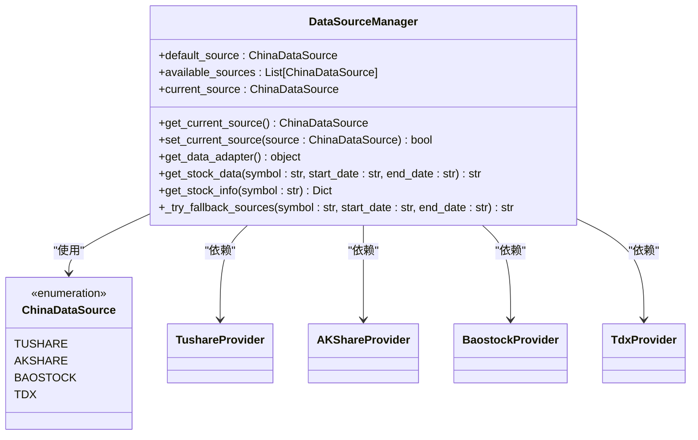
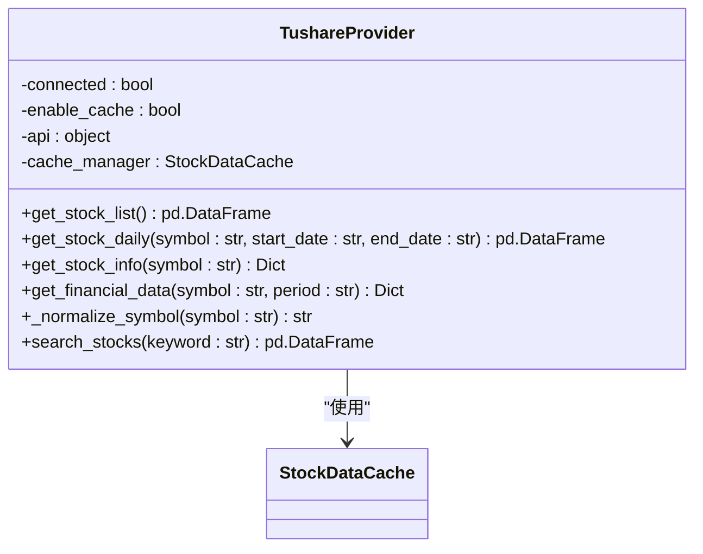
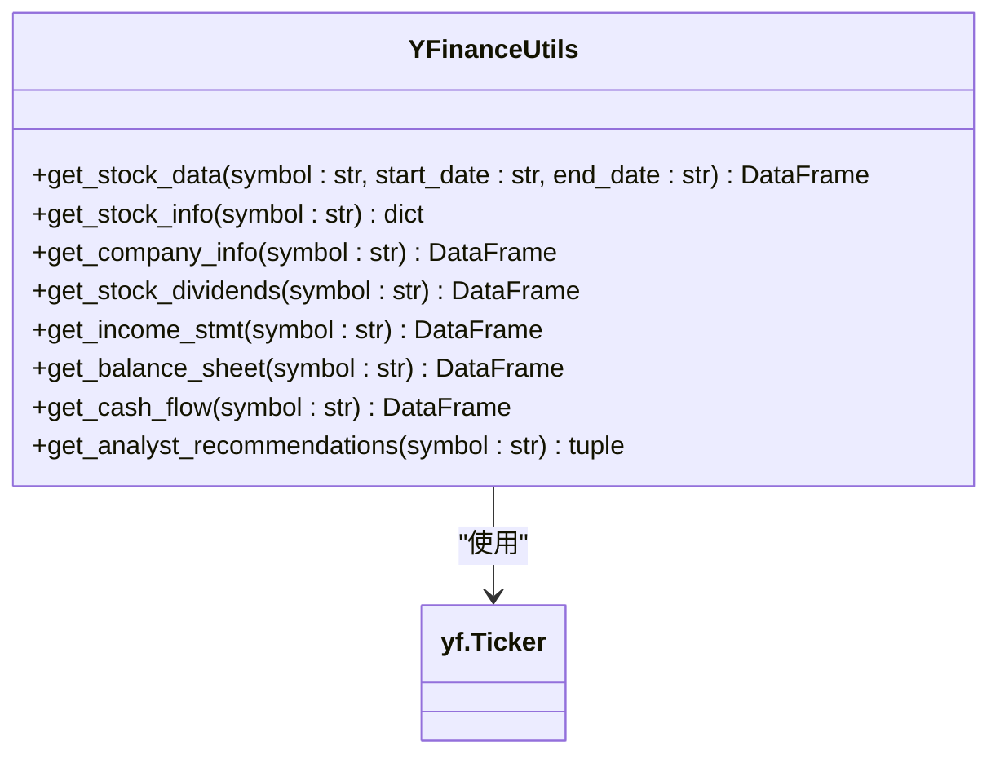

# 集成新的数据源

<cite>
**本文档引用的文件**  
- [data_source_manager.py](file://tradingagents/dataflows/data_source_manager.py)
- [tushare_utils.py](file://tradingagents/dataflows/tushare_utils.py)
- [yfin_utils.py](file://tradingagents/dataflows/yfin_utils.py)
- [cache_manager.py](file://tradingagents/dataflows/cache_manager.py)
- [interface.py](file://tradingagents/dataflows/interface.py)
- [akshare_utils.py](file://tradingagents/dataflows/akshare_utils.py)
</cite>

## 目录
1. [引言](#引言)
2. [数据源管理器架构](#数据源管理器架构)
3. [现有数据源实现分析](#现有数据源实现分析)
4. [新数据源集成流程](#新数据源集成流程)
5. [API接口设计与封装](#api接口设计与封装)
6. [缓存系统集成](#缓存系统集成)
7. [配置注册与调用](#配置注册与调用)
8. [异常处理与性能优化](#异常处理与性能优化)
9. [完整开发示例](#完整开发示例)
10. [结论](#结论)

## 引言
本指南旨在为开发者提供详尽的步骤，指导如何将新的金融数据API接入TradingAgents-CN系统。通过深入分析`data_source_manager.py`作为数据源路由和管理中枢的工作机制，结合`tushare_utils.py`、`yfin_utils.py`等现有实现，展示如何封装新的数据获取接口。本指南将重点说明API认证、请求构造、响应解析、错误处理等关键环节，并强调与缓存系统（`cache_manager.py`）的集成，确保新数据源支持多级缓存策略。最终，开发者将学会如何在配置中注册新数据源，并使其能被各类分析师智能体调用。

## 数据源管理器架构



**图示来源**
- [data_source_manager.py](file://tradingagents/dataflows/data_source_manager.py#L1-L353)

**数据源管理器**（`DataSourceManager`）是系统的核心组件，负责统一管理所有中国股票数据源的选择和切换。它通过`ChinaDataSource`枚举定义支持的数据源类型，包括Tushare、AKShare、BaoStock和TDX。管理器在初始化时会自动检测可用的数据源，并根据环境变量设置默认数据源。其核心功能包括数据源切换、适配器获取、统一数据接口和智能备用机制。

**Section sources**
- [data_source_manager.py](file://tradingagents/dataflows/data_source_manager.py#L1-L353)

## 现有数据源实现分析

### Tushare数据源实现
Tushare数据源通过`TushareProvider`类实现，该类封装了Tushare API的所有交互。它负责API连接管理、错误处理、股票列表获取、历史数据获取、基本信息获取和财务数据获取。`TushareProvider`还集成了智能缓存，以减少API调用次数，提高响应速度。



**图示来源**
- [tushare_utils.py](file://tradingagents/dataflows/tushare_utils.py#L1-L411)

### YFinance数据源实现
YFinance数据源通过`YFinanceUtils`类实现，该类利用`yfinance`库获取美股数据。它提供了获取股票数据、公司信息、股息、财务报表和分析师推荐等功能。`YFinanceUtils`使用装饰器模式初始化`yf.Ticker`对象，并通过`decorate_all_methods`装饰器为所有方法添加初始化逻辑。



**图示来源**
- [yfin_utils.py](file://tradingagents/dataflows/yfin_utils.py#L1-L126)

**Section sources**
- [tushare_utils.py](file://tradingagents/dataflows/tushare_utils.py#L1-L411)
- [yfin_utils.py](file://tradingagents/dataflows/yfin_utils.py#L1-L126)

## 新数据源集成流程

### 1. 创建数据提供器类
首先，创建一个新的数据提供器类，该类负责与新的金融数据API进行交互。该类应包含API连接管理、认证、请求构造和响应解析等方法。

### 2. 实现核心数据获取方法
实现获取股票数据、股票信息和财务数据的核心方法。这些方法应返回标准化的数据格式，以便与其他数据源兼容。

### 3. 集成缓存系统
将新的数据提供器与`cache_manager.py`集成，以支持多级缓存策略。这包括在获取数据前检查缓存、将新获取的数据保存到缓存以及设置适当的缓存过期时间。

### 4. 注册到数据源管理器
在`data_source_manager.py`中注册新的数据源，使其能够被`DataSourceManager`识别和管理。这通常涉及在`ChinaDataSource`枚举中添加新的数据源类型，并在`_check_available_sources`方法中添加相应的检查逻辑。

### 5. 配置和测试
在配置文件中注册新数据源的相关信息，如API密钥、端点URL等。然后进行充分的测试，确保新数据源能够正常工作，并且在主数据源失败时能够正确切换到备用数据源。

**Section sources**
- [data_source_manager.py](file://tradingagents/dataflows/data_source_manager.py#L1-L353)
- [cache_manager.py](file://tradingagents/dataflows/cache_manager.py#L1-L504)

## API接口设计与封装

### 接口设计原则
- **统一性**：所有数据源的接口应保持一致，以便于调用者使用。
- **灵活性**：接口应支持多种查询参数，以满足不同的需求。
- **可扩展性**：接口设计应易于扩展，以支持未来可能添加的新功能。

### 封装方法
- **认证封装**：将API认证逻辑封装在数据提供器的初始化方法中，确保每次请求都携带正确的认证信息。
- **请求构造**：将请求构造逻辑封装在独立的方法中，以便于维护和修改。
- **响应解析**：将响应解析逻辑封装在独立的方法中，确保返回的数据格式一致。

**Section sources**
- [tushare_utils.py](file://tradingagents/dataflows/tushare_utils.py#L1-L411)
- [yfin_utils.py](file://tradingagents/dataflows/yfin_utils.py#L1-L126)

## 缓存系统集成

```mermaid
classDiagram
    class StockDataCache {
        -cache_dir: Path
        -us_stock_dir: Path
        -china_stock_dir: Path
        -us_news_dir: Path
        -china_news_dir: Path
        -us_fundamentals_dir: Path
        -china_fundamentals_dir: Path
        -metadata_dir: Path
        -cache_config: Dict
        +save_stock_data(symbol: str, data: Union[pd.DataFrame, str], start_date: str, end_date: str, data_source: str) str
        +load_stock_data(cache_key: str) Optional[Union[pd.DataFrame, str]]
        +find_cached_stock_data(symbol: str, start_date: str, end_date: str, data_source: str, max_age_hours: int) Optional[str]
        +save_news_data(symbol: str, news_data: str, start_date: str