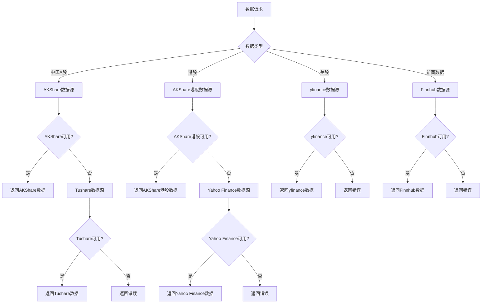
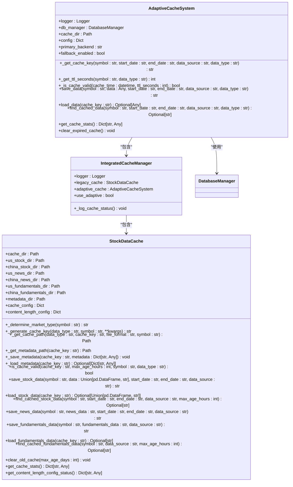
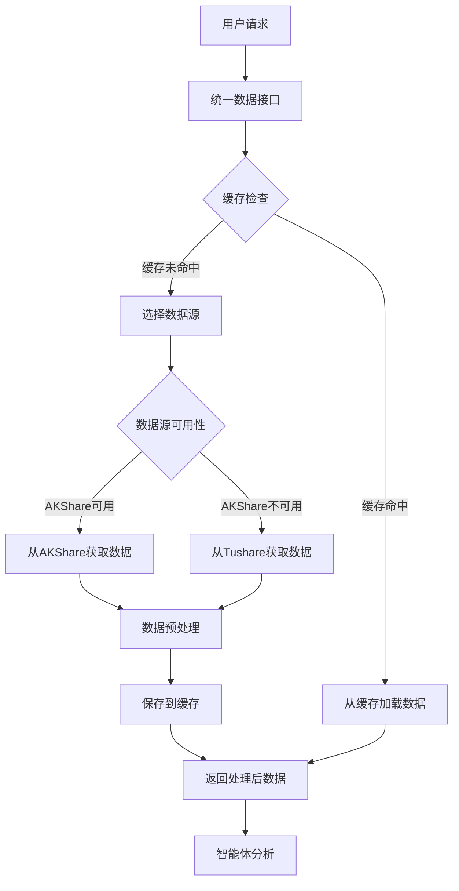

# 数据处理

<cite>
**本文档引用的文件**   
- [data_source_manager.py](file://tradingagents/dataflows/data_source_manager.py)
- [adaptive_cache.py](file://tradingagents/dataflows/adaptive_cache.py)
- [integrated_cache.py](file://tradingagents/dataflows/integrated_cache.py)
- [cache_manager.py](file://tradingagents/dataflows/cache_manager.py)
- [optimized_china_data.py](file://tradingagents/dataflows/optimized_china_data.py)
- [interface.py](file://tradingagents/dataflows/interface.py)
- [config.py](file://tradingagents/dataflows/config.py)
</cite>

## 目录
1. [引言](#引言)
2. [多数据源集成策略](#多数据源集成策略)
3. [数据预处理流程](#数据预处理流程)
4. [自适应缓存系统](#自适应缓存系统)
5. [数据流架构](#数据流架构)
6. [数据一致性与完整性保障](#数据一致性与完整性保障)
7. [结论](#结论)

## 引言

本系统采用先进的数据处理机制，确保金融分析的高质量和高效率。系统集成了多个金融数据API，包括AkShare、Tushare、Finnhub和yfinance等，通过智能优先级逻辑选择最优数据源。数据预处理流程涵盖了数据清洗、格式转换和标准化处理，确保数据质量。自适应缓存系统设计精巧，包含智能缓存策略、失效机制和性能优化，显著提升了系统性能。本文档详细描述了从原始数据获取到智能体可用数据的完整转换路径，并讨论了数据一致性和完整性保障措施。

## 多数据源集成策略

系统实现了多数据源集成策略，支持AkShare、Tushare、Finnhub、yfinance等多个金融数据API。数据源管理器（DataSourceManager）负责统一管理这些数据源的选择和切换，支持Tushare、AKShare、BaoStock等多种数据源。

数据源优先级逻辑如下：系统首先检查环境变量中的默认数据源配置，默认使用AKShare作为第一优先级数据源。在初始化时，系统会检查各数据源的可用性，包括Tushare、AKShare和BaoStock。对于中国A股数据，系统优先使用AKShare数据源，如果AKShare不可用，则降级到Tushare备用数据源。对于港股数据，系统优先使用AKShare数据源，其次尝试Yahoo Finance作为备用数据源。

系统提供了统一的接口来获取不同市场的数据。通过`get_china_stock_data_unified`接口，可以获取中国股票数据，该接口会自动使用配置的数据源并支持备用数据源机制。对于美股数据，系统通过`get_YFin_data`接口获取，支持在线和离线两种模式。这种多数据源集成策略确保了数据获取的可靠性和灵活性，即使某个数据源出现故障，系统也能通过备用数据源继续提供服务。

**图源**
- [data_source_manager.py](file://tradingagents/dataflows/data_source_manager.py#L430-L458)
- [interface.py](file://tradingagents/dataflows/interface.py#L0-L799)

**本节来源**
- [data_source_manager.py](file://tradingagents/dataflows/data_source_manager.py#L51-L98)
- [interface.py](file://tradingagents/dataflows/interface.py#L0-L799)

## 数据预处理流程

系统实现了完整的数据预处理流程，涵盖数据清洗、格式转换和标准化处理。数据预处理是确保数据质量和分析准确性的关键步骤。

数据清洗主要通过数据源管理器中的异常处理机制实现。当从数据源获取数据时，系统会捕获各种异常，包括网络连接错误、API调用失败等。对于无效或错误的数据，系统会记录详细的错误日志，并尝试从备用数据源获取数据。此外，系统还实现了数据质量检查，当获取的数据包含错误标识（如"❌"）时，会触发降级机制，尝试其他数据源。

格式转换和标准化处理主要在数据适配器中实现。以Tushare数据适配器为例，系统会将Tushare API返回的原始数据进行标准化处理。首先，系统定义了列名映射关系，将Tushare的列名（如'trade_date'、'ts_code'）转换为系统内部的标准列名（如'date'、'code'）。然后，系统会验证关键列是否存在，对于缺失的关键列，系统会尝试寻找备用列名或设置默认值。例如，如果缺少'volume'列，系统会尝试从'vol'、'volume'、'turnover'等列中寻找成交量数据。

数据标准化还包括日期格式化、数据排序和添加计算列等操作。系统会确保日期列存在且格式正确，将日期转换为标准的datetime格式，并按日期排序。同时，系统会添加一些计算列，如涨跌幅列，确保数据的一致性和完整性。对于财务数据，系统会解析原始财务报表，计算各种财务指标，如市盈率(PE)、市净率(PB)、净资产收益率(ROE)等，并生成标准化的财务分析报告。

**本节来源**
- [tushare_adapter.py](file://tradingagents/dataflows/tushare_adapter.py#L214-L293)
- [optimized_china_data.py](file://tradingagents/dataflows/optimized_china_data.py#L719-L856)

## 自适应缓存系统

系统设计并实现了先进的自适应缓存系统，旨在提高数据访问效率，减少API调用次数，降低系统延迟。自适应缓存系统根据数据库可用性自动选择最佳缓存策略，提供了向后兼容的接口。

自适应缓存系统的核心是`IntegratedCacheManager`类，它结合了原有的文件缓存系统和新的自适应数据库支持。系统首先尝试初始化自适应缓存系统，如果成功，则使用数据库作为主要后端；如果失败，则降级到传统的文件缓存系统。这种设计确保了系统的向后兼容性，即使在没有数据库支持的环境中也能正常运行。

缓存策略采用智能TTL（Time To Live）管理机制。系统根据市场类型和数据类型自动选择合适的缓存时长。例如，美股数据的缓存时长为2小时，A股数据为1小时，美股新闻为6小时，A股新闻为4小时，美股基本面数据为24小时，A股基本面数据为12小时。这种市场特定的TTL管理确保了数据的实时性和缓存效率。

缓存系统支持多种后端存储，包括Redis、MongoDB和文件系统。系统会根据配置选择主要后端，并在主要后端失败时自动降级到文件缓存。缓存键的生成基于股票代码、日期范围、数据源和数据类型等参数，通过MD5哈希生成唯一的缓存键。系统还实现了缓存统计功能，可以获取缓存的使用情况，包括缓存命中率、缓存大小等指标。

**图源**
- [adaptive_cache.py](file://tradingagents/dataflows/adaptive_cache.py#L0-L383)
- [integrated_cache.py](file://tradingagents/dataflows/integrated_cache.py#L0-L63)
- [cache_manager.py](file://tradingagents/dataflows/cache_manager.py#L0-L646)

**本节来源**
- [adaptive_cache.py](file://tradingagents/dataflows/adaptive_cache.py#L0-L383)
- [integrated_cache.py](file://tradingagents/dataflows/integrated_cache.py#L0-L63)
- [cache_manager.py](file://tradingagents/dataflows/cache_manager.py#L0-L646)

## 数据流架构

系统实现了从原始数据获取到智能体可用数据的完整数据流架构。数据流架构设计合理，确保了数据处理的高效性和可靠性。

数据流从用户请求开始，首先通过统一的接口（如`get_china_stock_data_unified`）发起数据请求。系统会根据股票代码和市场类型确定数据源优先级，优先尝试AKShare数据源。如果AKShare数据源不可用，则降级到Tushare备用数据源。对于美股数据，系统优先使用yfinance数据源。

在获取数据之前，系统会首先检查缓存。自适应缓存系统会根据股票代码、日期范围等参数生成缓存键，并检查缓存是否有效。如果缓存有效，则直接从缓存中加载数据，避免重复的API调用。如果缓存无效或不存在，则从数据源获取数据。

获取到原始数据后，系统会进行数据预处理。数据预处理包括数据清洗、格式转换和标准化处理。系统会验证数据质量，处理异常情况，并将数据转换为统一的格式。对于财务数据，系统会解析原始财务报表，计算各种财务指标，并生成标准化的财务分析报告。

预处理后的数据会被保存到缓存中，以便后续请求可以快速访问。系统会根据数据类型和市场类型选择合适的缓存目录和TTL。最后，处理后的数据返回给调用者，供智能体进行分析和决策。

**图源**
- [interface.py](file://tradingagents/dataflows/interface.py#L0-L799)
- [optimized_china_data.py](file://tradingagents/dataflows/optimized_china_data.py#L0-L799)
- [stock_data_service.py](file://tradingagents/dataflows/stock_data_service.py#L0-L285)

**本节来源**
- [interface.py](file://tradingagents/dataflows/interface.py#L0-L799)
- [optimized_china_data.py](file://tradingagents/dataflows/optimized_china_data.py#L0-L799)
- [stock_data_service.py](file://tradingagents/dataflows/stock_data_service.py#L0-L285)

## 数据一致性与完整性保障

系统通过多种机制确保数据的一致性和完整性。数据一致性保障主要通过统一的数据接口和标准化的数据格式实现。系统提供了统一的接口来获取不同市场的数据，确保了数据获取方式的一致性。所有数据在预处理阶段都会被转换为统一的格式，包括标准的列名、日期格式和数据类型，确保了数据的一致性。

数据完整性保障主要通过多层次的降级机制和错误处理实现。系统实现了完整的降级机制：MongoDB -> Tushare数据接口 -> 缓存 -> 错误处理。当从主要数据源获取数据失败时，系统会自动降级到备用数据源。例如，当MongoDB不可用时，系统会降级到增强获取器；当增强获取器也不可用时，系统会尝试从缓存获取数据；如果所有数据源都不可用，系统会返回包含错误信息的默认数据。

系统还实现了详细的数据验证和错误处理。在数据预处理阶段，系统会验证关键列是否存在，对于缺失的关键列，系统会尝试寻找备用列名或设置默认值。系统会捕获各种异常，包括网络连接错误、API调用失败等，并记录详细的错误日志。对于无效或错误的数据，系统会返回明确的错误信息，并提供解决建议。

此外，系统还实现了数据结构一致性检查和修复功能。通过`mongodb_report_manager`等工具，系统可以检查和修复不一致的报告数据结构，确保数据存储的完整性。这些机制共同保障了系统的数据一致性和完整性，即使在部分组件出现故障的情况下，系统也能提供可靠的服务。

**本节来源**
- [stock_data_service.py](file://tradingagents/dataflows/stock_data_service.py#L0-L285)
- [mongodb_report_manager.py](file://web/utils/mongodb_report_manager.py#L308-L345)
- [test_integration_validation.py](file://scripts/test_integration_validation.py#L128-L165)

## 结论

本系统实现了全面而高效的数据处理机制，确保了金融分析的高质量。通过集成AkShare、Tushare、Finnhub、yfinance等多个金融数据API，并采用智能优先级逻辑，系统能够灵活选择最优数据源，确保数据获取的可靠性和多样性。数据预处理流程涵盖了数据清洗、格式转换和标准化处理，确保了数据质量和一致性。

自适应缓存系统的设计和实现是系统的一大亮点。通过智能TTL管理、多种后端存储支持和降级机制，系统显著提升了数据访问效率，减少了API调用次数，降低了系统延迟。数据流架构清晰合理，从原始数据获取到智能体可用数据的转换路径高效可靠。

数据一致性和完整性保障措施完善，通过统一的数据接口、标准化的数据格式、多层次的降级机制和详细的错误处理，系统能够在各种情况下提供可靠的服务。这些机制共同构成了一个健壮、高效的数据处理系统，为智能体的分析和决策提供了坚实的基础。