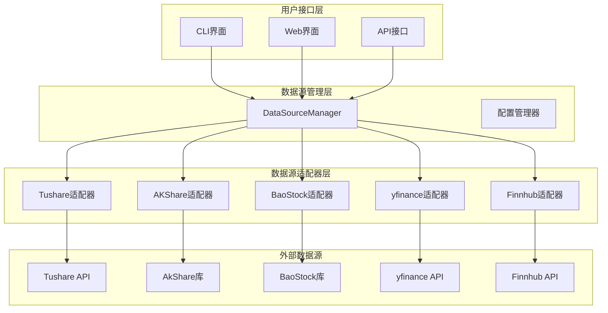
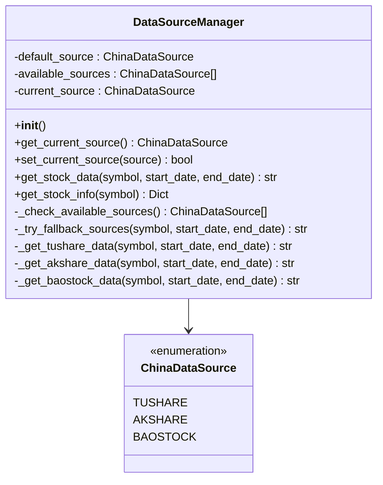
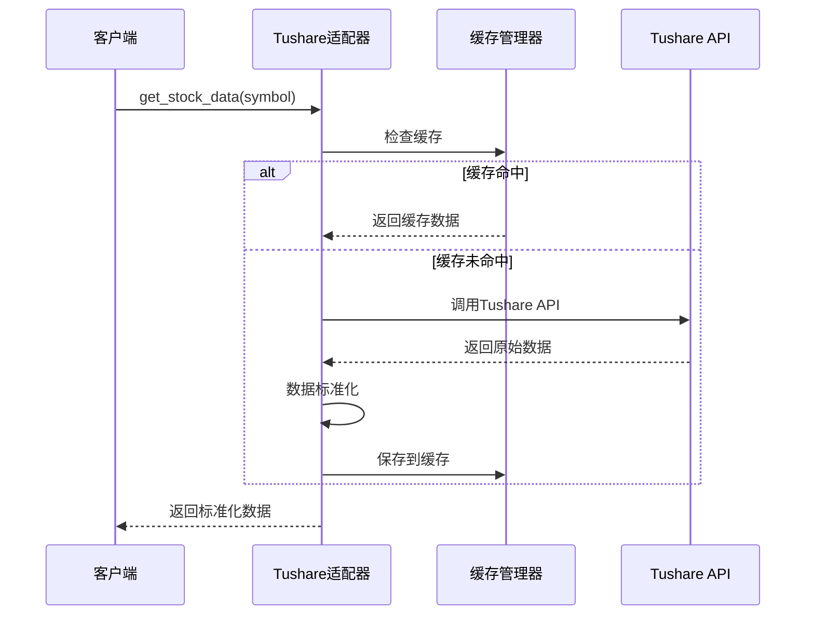
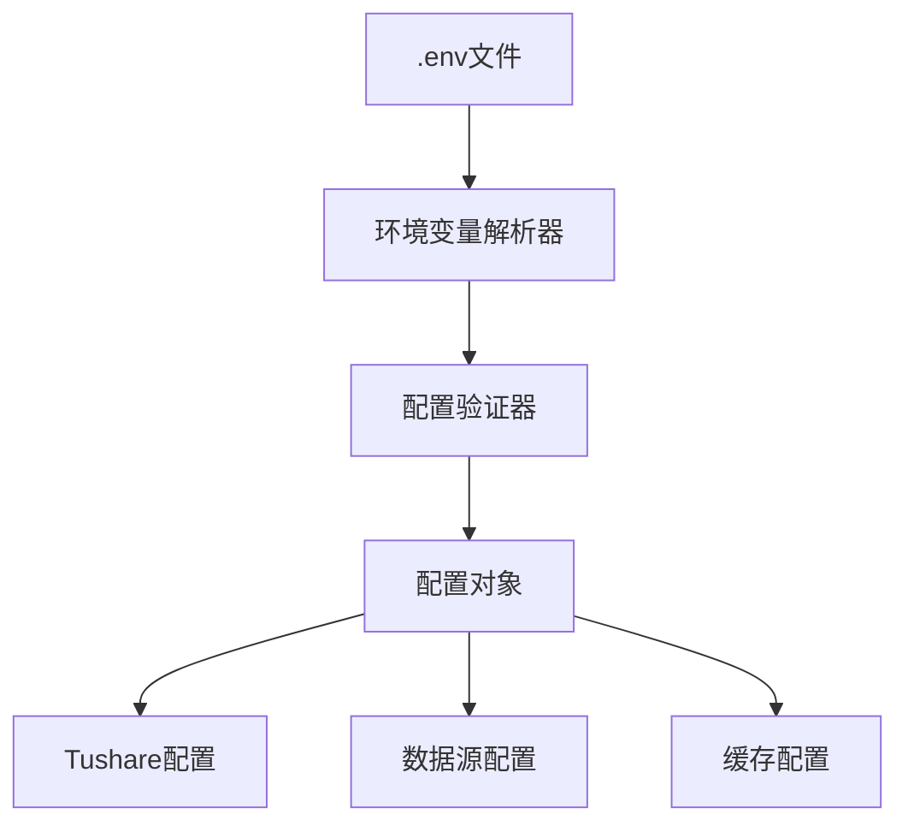
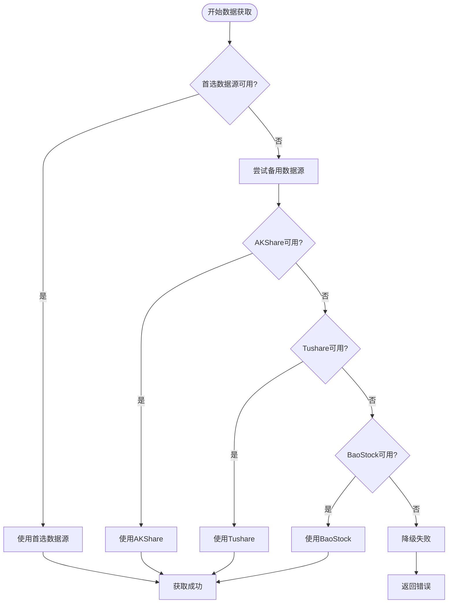
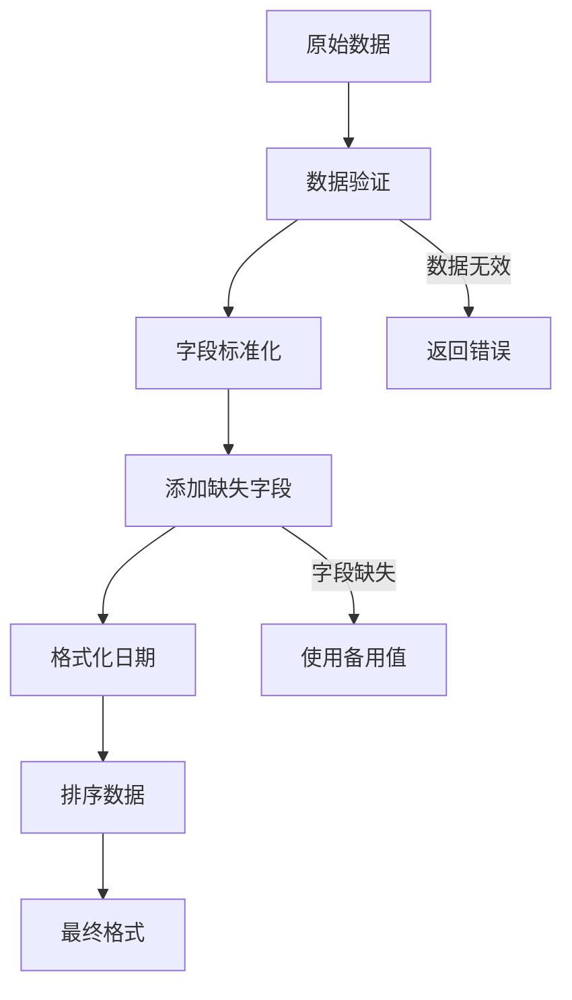
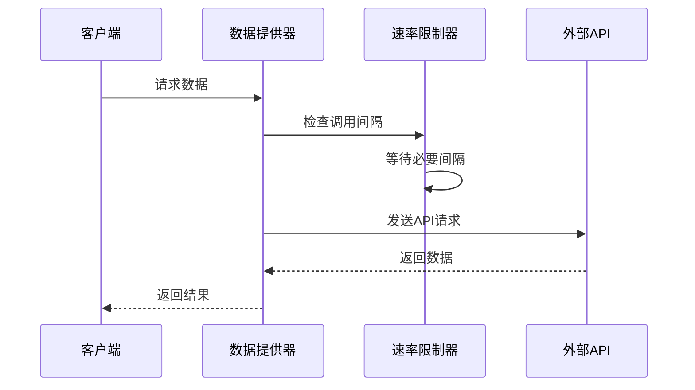

# 数据源集成

<cite>
**本文档引用的文件**
- [data_source_manager.py](file://tradingagents/dataflows/data_source_manager.py)
- [tushare_adapter.py](file://tradingagents/dataflows/tushare_adapter.py)
- [akshare_utils.py](file://tradingagents/dataflows/akshare_utils.py)
- [yfin_utils.py](file://tradingagents/dataflows/yfin_utils.py)
- [finnhub_utils.py](file://tradingagents/dataflows/finnhub_utils.py)
- [optimized_us_data.py](file://tradingagents/dataflows/optimized_us_data.py)
- [tushare_config.py](file://tradingagents/config/tushare_config.py)
- [env_utils.py](file://tradingagents/config/env_utils.py)
</cite>

## 目录
1. [概述](#概述)
2. [系统架构](#系统架构)
3. [数据源支持](#数据源支持)
4. [DataSourceManager核心设计](#datasourcemanager核心设计)
5. [数据源适配器](#数据源适配器)
6. [数据源配置](#数据源配置)
7. [降级机制](#降级机制)
8. [数据格式标准化](#数据格式标准化)
9. [性能优化](#性能优化)
10. [故障排除指南](#故障排除指南)

## 概述

TradingAgents-CN系统采用多数据源集成架构，支持A股、港股、美股三大市场的数据获取。系统通过统一的DataSourceManager类管理多个数据源，包括Tushare、AKShare、BaoStock、yfinance、Finnhub等，实现了智能的数据源选择、自动降级和数据格式标准化。

### 主要特性

- **多市场支持**：覆盖A股、港股、美股三大市场
- **智能降级**：自动切换可用数据源
- **数据标准化**：统一不同数据源的数据格式
- **缓存优化**：集成缓存机制提升性能
- **异常处理**：完善的错误处理和恢复机制

## 系统架构

**图表来源**
- [data_source_manager.py](file://tradingagents/dataflows/data_source_manager.py#L25-L50)
- [tushare_adapter.py](file://tradingagents/dataflows/tushare_adapter.py#L30-L50)

## 数据源支持

### A股市场数据源

| 数据源 | 类型 | 功能 | 优势 |
|--------|------|------|------|
| Tushare | API | 实时/历史数据、基本面数据 | 数据质量高、稳定性好 |
| AKShare | 库 | 历史数据、实时行情 | 免费、数据丰富 |
| BaoStock | 库 | 历史数据、财务数据 | 开源、本地部署 |

### 美股市场数据源

| 数据源 | 类型 | 功能 | 优势 |
|--------|------|------|------|
| Finnhub | API | 实时数据、新闻、技术指标 | 全球覆盖、API稳定 |
| yfinance | 库 | 历史数据、公司信息 | 免费、易于使用 |

### 港股市场数据源

| 数据源 | 类型 | 功能 | 优势 |
|--------|------|------|------|
| AKShare | 库 | 历史数据、实时行情 | 支持港股通 |
| Finnhub | API | 实时数据、新闻 | 全球覆盖 |

**章节来源**
- [data_source_manager.py](file://tradingagents/dataflows/data_source_manager.py#L25-L35)
- [akshare_utils.py](file://tradingagents/dataflows/akshare_utils.py#L20-L40)

## DataSourceManager核心设计

### 枚举定义

**图表来源**
- [data_source_manager.py](file://tradingagents/dataflows/data_source_manager.py#L25-L50)

### 初始化流程

DataSourceManager的初始化过程包括以下步骤：

1. **默认数据源确定**：从环境变量获取，默认为AKShare
2. **可用性检测**：检查各数据源的可用性
3. **当前数据源设置**：设置初始使用的数据源

### 数据源优先级

系统按照以下优先级顺序选择数据源：

1. **首选数据源**：从环境变量`DEFAULT_CHINA_DATA_SOURCE`获取
2. **备用数据源**：AKShare > Tushare > BaoStock

**章节来源**
- [data_source_manager.py](file://tradingagents/dataflows/data_source_manager.py#L40-L80)

## 数据源适配器

### Tushare适配器

Tushare适配器提供了完整的数据获取功能，包括：

- **数据获取**：历史数据、实时数据
- **股票信息**：基本信息、财务数据
- **缓存支持**：集成缓存机制
- **错误处理**：完善的异常处理

**图表来源**
- [tushare_adapter.py](file://tradingagents/dataflows/tushare_adapter.py#L100-L150)

### AKShare适配器

AKShare适配器专注于免费数据源，提供：

- **历史数据获取**：支持A股、港股历史数据
- **实时行情**：实时价格、成交量等
- **财务数据**：财务报表、主要指标
- **新闻资讯**：个股新闻、市场动态

### yfinance适配器

yfinance适配器为美股市场提供数据：

- **历史数据**：日线、周线、月线数据
- **公司信息**：公司概况、行业分类
- **财务报表**：收入、利润、现金流
- **分析师评级**：推荐意见、目标价

**章节来源**
- [tushare_adapter.py](file://tradingagents/dataflows/tushare_adapter.py#L30-L80)
- [akshare_utils.py](file://tradingagents/dataflows/akshare_utils.py#L20-L70)
- [yfin_utils.py](file://tradingagents/dataflows/yfin_utils.py#L20-L50)

## 数据源配置

### 环境变量配置

系统支持通过环境变量配置数据源：

| 环境变量 | 默认值 | 描述 |
|----------|--------|------|
| DEFAULT_CHINA_DATA_SOURCE | akshare | 默认A股数据源 |
| TUSHARE_TOKEN | 无 | Tushare API密钥 |
| TUSHARE_ENABLED | false | 是否启用Tushare |
| ENABLE_DATA_CACHE | true | 是否启用数据缓存 |

### 配置文件结构

**图表来源**
- [tushare_config.py](file://tradingagents/config/tushare_config.py#L15-L40)
- [env_utils.py](file://tradingagents/config/env_utils.py#L15-L50)

### 配置验证

系统提供完整的配置验证机制：

1. **必需变量检查**：验证关键环境变量
2. **格式验证**：检查Token格式、布尔值等
3. **兼容性测试**：测试不同Python版本的兼容性
4. **自动修复**：提供配置问题的修复建议

**章节来源**
- [tushare_config.py](file://tradingagents/config/tushare_config.py#L40-L100)
- [env_utils.py](file://tradingagents/config/env_utils.py#L180-L220)

## 降级机制

### 自动降级流程

当首选数据源出现故障时，系统会自动尝试备用数据源：

**图表来源**
- [data_source_manager.py](file://tradingagents/dataflows/data_source_manager.py#L547-L574)

### 降级策略

1. **优先级降级**：按照AKShare → Tushare → BaoStock的顺序
2. **数据质量检查**：验证返回数据的有效性
3. **异常处理**：捕获并处理各种异常情况
4. **日志记录**：详细记录降级过程和结果

**章节来源**
- [data_source_manager.py](file://tradingagents/dataflows/data_source_manager.py#L547-L590)

## 数据格式标准化

### 统一数据格式

不同数据源返回的数据格式存在差异，系统通过标准化处理统一格式：

| 字段 | Tushare | AKShare | BaoStock | 统一格式 |
|------|---------|---------|----------|----------|
| 日期 | trade_date | 日期 | date | date |
| 开盘价 | open | 开盘 | open | open |
| 收盘价 | close | 收盘 | close | close |
| 最高价 | high | 最高 | high | high |
| 最低价 | low | 最低 | low | low |
| 成交量 | vol | 成交量 | volume | volume |

### 标准化处理流程

**图表来源**
- [tushare_adapter.py](file://tradingagents/dataflows/tushare_adapter.py#L250-L350)

### 异常处理策略

1. **字段映射**：自动映射不同数据源的字段
2. **缺失值处理**：为缺失字段提供默认值
3. **数据类型转换**：确保数据类型一致性
4. **异常恢复**：在异常情况下提供备用数据

**章节来源**
- [tushare_adapter.py](file://tradingagents/dataflows/tushare_adapter.py#L250-L400)

## 性能优化

### 缓存机制

系统集成多层缓存机制提升性能：

1. **内存缓存**：快速访问常用数据
2. **磁盘缓存**：持久化存储历史数据
3. **分布式缓存**：支持集群部署

### API限制处理

**图表来源**
- [optimized_us_data.py](file://tradingagents/dataflows/optimized_us_data.py#L30-L50)

### 并发控制

- **API调用限制**：防止超出API限制
- **连接池管理**：复用HTTP连接
- **异步处理**：支持并发数据获取

**章节来源**
- [optimized_us_data.py](file://tradingagents/dataflows/optimized_us_data.py#L30-L80)

## 故障排除指南

### 常见问题

1. **数据源不可用**
   - 检查网络连接
   - 验证API密钥
   - 确认数据源可用性

2. **数据格式异常**
   - 检查数据标准化配置
   - 验证字段映射关系
   - 查看日志文件

3. **性能问题**
   - 检查缓存配置
   - 优化API调用频率
   - 监控资源使用情况

### 诊断工具

系统提供多种诊断工具：

- **配置检查器**：验证配置正确性
- **连接测试器**：测试数据源连接
- **性能监控器**：监控系统性能

**章节来源**
- [tushare_config.py](file://tradingagents/config/tushare_config.py#L150-L200)

### 最佳实践

1. **定期维护**：更新API密钥和配置
2. **监控告警**：设置关键指标监控
3. **备份策略**：建立数据备份机制
4. **文档更新**：及时更新配置文档

通过这套完整的多数据源集成机制，TradingAgents-CN系统能够为用户提供稳定、高效、可靠的数据服务，满足不同场景下的需求。