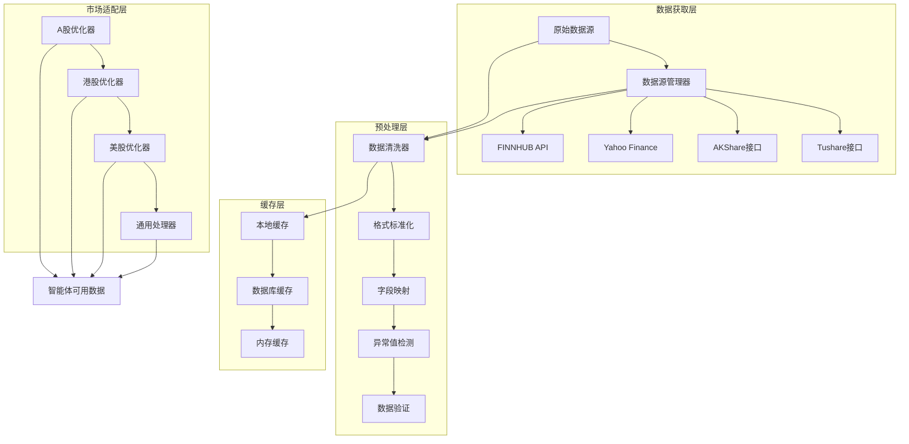
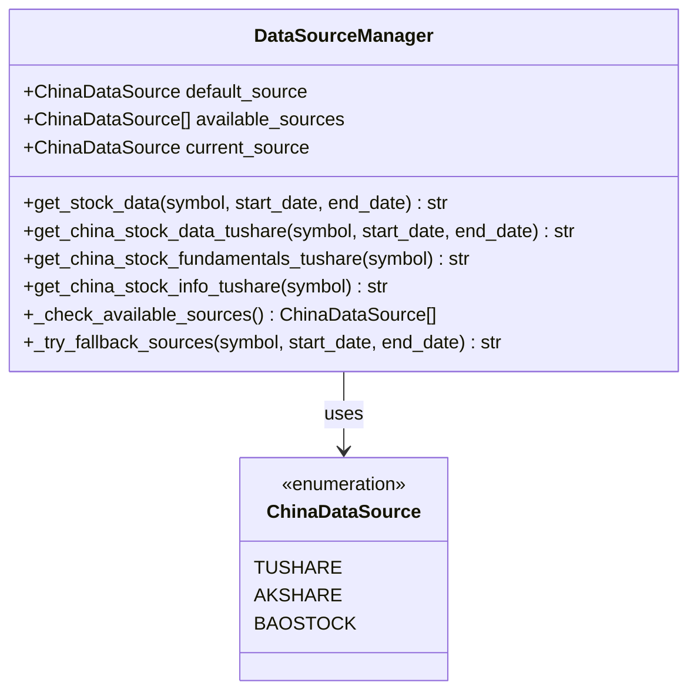
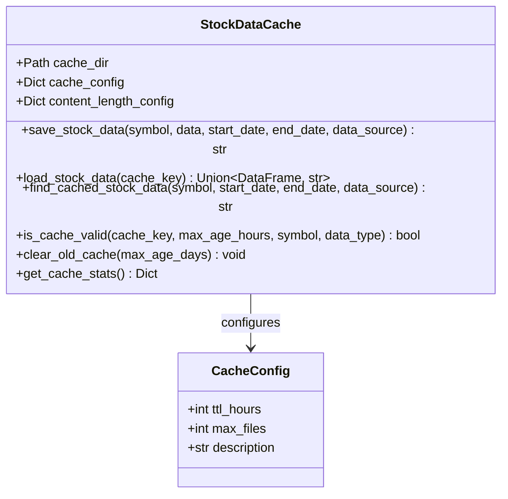
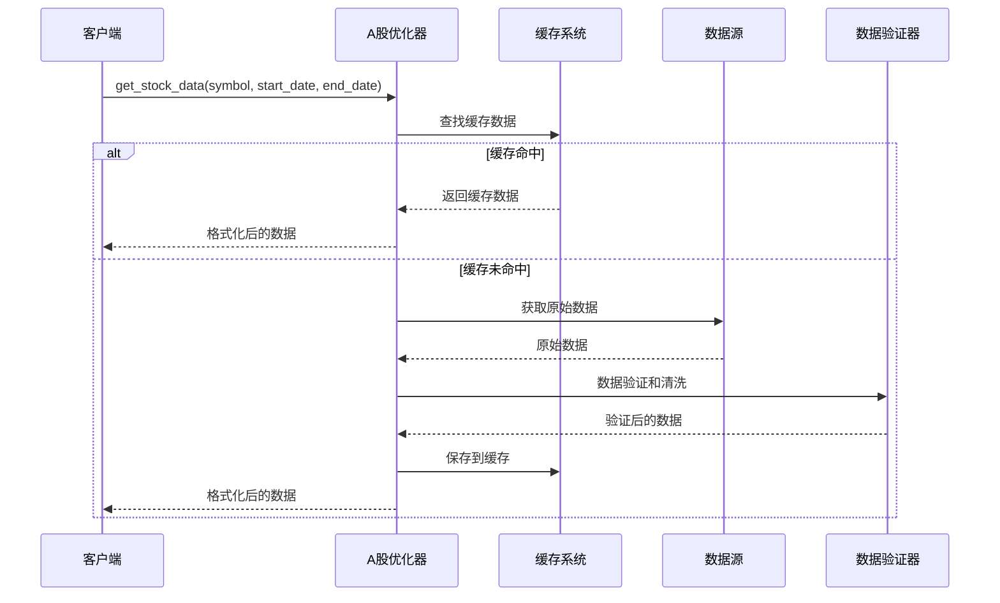
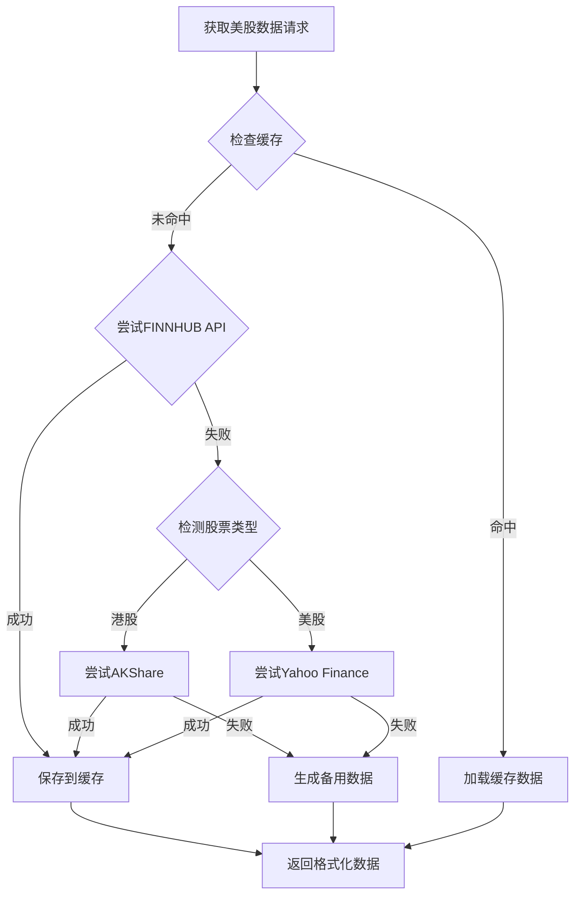
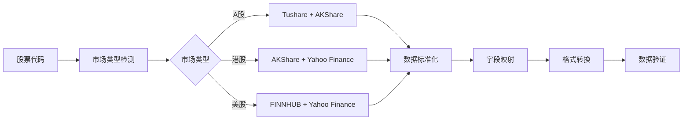
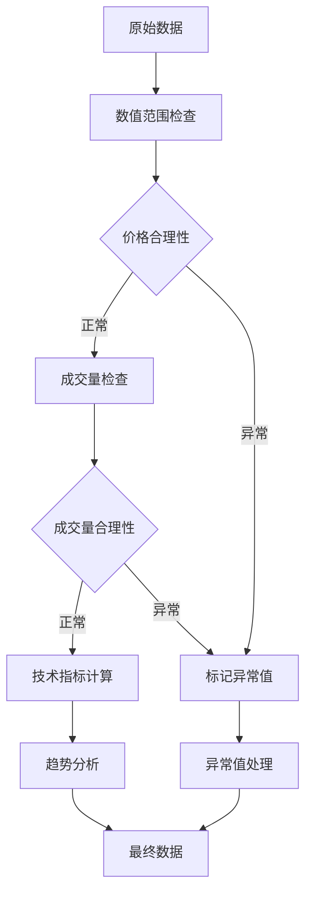
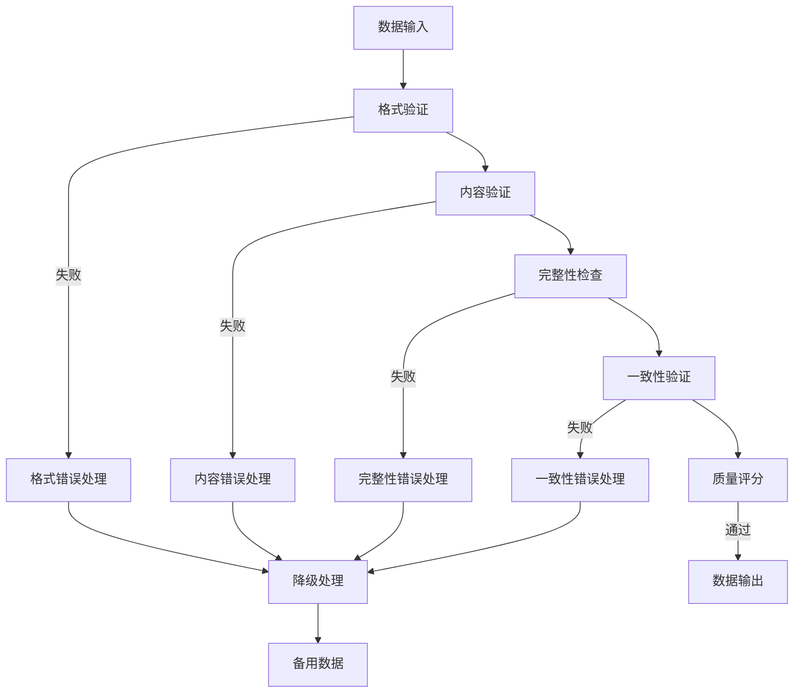
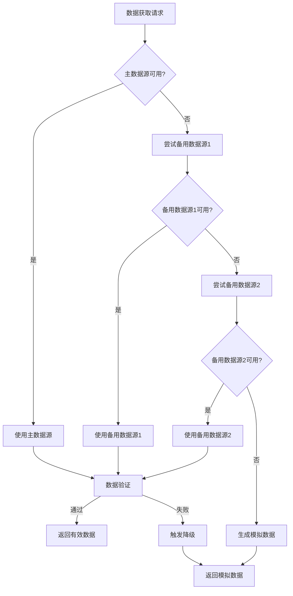
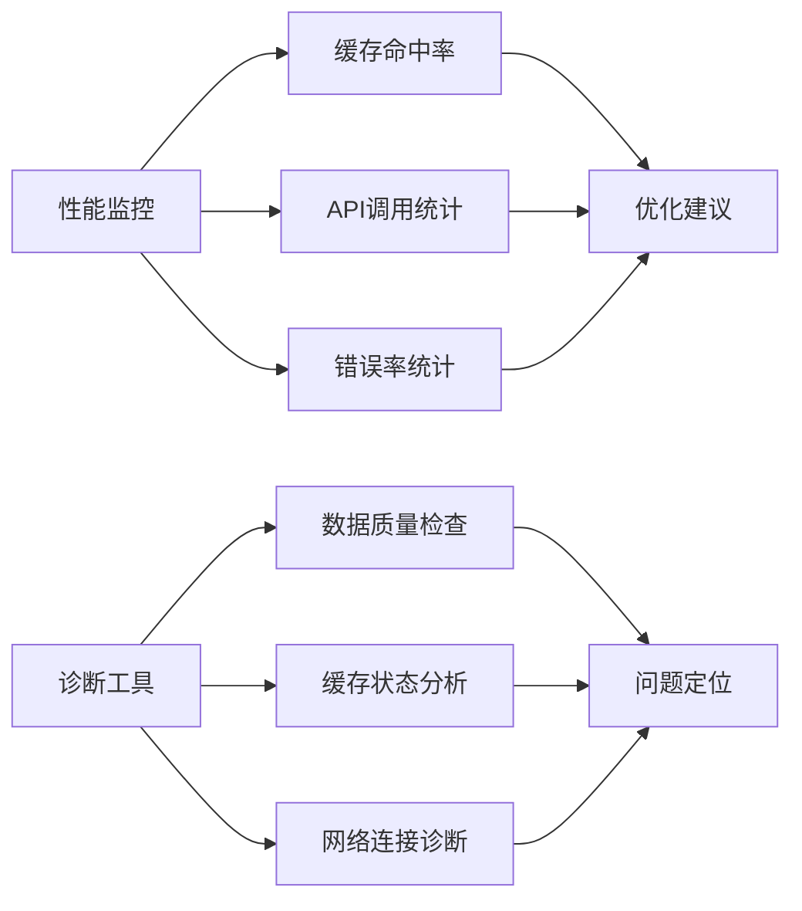

# 数据预处理流程

<cite>
**本文档引用的文件**
- [chinese_finance_utils.py](file://tradingagents/dataflows/chinese_finance_utils.py)
- [stockstats_utils.py](file://tradingagents/dataflows/stockstats_utils.py)
- [optimized_china_data.py](file://tradingagents/dataflows/optimized_china_data.py)
- [optimized_us_data.py](file://tradingagents/dataflows/optimized_us_data.py)
- [utils.py](file://tradingagents/dataflows/utils.py)
- [cache_manager.py](file://tradingagents/dataflows/cache_manager.py)
- [data_source_manager.py](file://tradingagents/dataflows/data_source_manager.py)
- [akshare_utils.py](file://tradingagents/dataflows/akshare_utils.py)
- [tushare_utils.py](file://tradingagents/dataflows/tushare_utils.py)
- [interface.py](file://tradingagents/dataflows/interface.py)
- [stock_validator.py](file://tradingagents/utils/stock_validator.py)
</cite>

## 目录
1. [概述](#概述)
2. [系统架构](#系统架构)
3. [核心组件分析](#核心组件分析)
4. [数据预处理流程](#数据预处理流程)
5. [市场特定处理策略](#市场特定处理策略)
6. [数据质量验证机制](#数据质量验证机制)
7. [错误处理与降级策略](#错误处理与降级策略)
8. [性能优化措施](#性能优化措施)
9. [总结](#总结)

## 概述

TradingAgents-CN系统采用多层次的数据预处理架构，实现了从原始数据获取到智能体可用数据的完整转换流程。该系统支持中美两大金融市场，具备强大的数据清洗、格式标准化、字段映射和异常值处理能力。

### 主要特性

- **多源数据集成**：支持Tushare、AKShare、Yahoo Finance、FINNHUB等多个数据源
- **智能缓存机制**：基于市场类型和数据类型的差异化缓存策略
- **市场特定优化**：针对A股、港股、美股市场的特殊处理逻辑
- **数据质量保证**：完善的验证机制和错误处理策略
- **性能优化**：API调用限制、并发控制和数据压缩

## 系统架构



**图表来源**
- [data_source_manager.py](file://tradingagents/dataflows/data_source_manager.py#L1-L50)
- [cache_manager.py](file://tradingagents/dataflows/cache_manager.py#L1-L100)

## 核心组件分析

### 1. 数据源管理器 (DataSourceManager)

数据源管理器是整个数据预处理系统的核心协调器，负责统一管理多个数据源的访问和切换。



**图表来源**
- [data_source_manager.py](file://tradingagents/dataflows/data_source_manager.py#L20-L50)

**章节来源**
- [data_source_manager.py](file://tradingagents/dataflows/data_source_manager.py#L1-L100)

### 2. 缓存管理系统 (StockDataCache)

缓存管理系统提供了智能的多层级缓存策略，支持不同市场和数据类型的差异化缓存配置。



**图表来源**
- [cache_manager.py](file://tradingagents/dataflows/cache_manager.py#L20-L80)

**章节来源**
- [cache_manager.py](file://tradingagents/dataflows/cache_manager.py#L1-L200)

### 3. 市场特定优化器

#### A股优化器 (OptimizedChinaDataProvider)

专门针对中国A股市场的优化处理，集成了Tushare和AKShare数据源。



**图表来源**
- [optimized_china_data.py](file://tradingagents/dataflows/optimized_china_data.py#L50-L150)

**章节来源**
- [optimized_china_data.py](file://tradingagents/dataflows/optimized_china_data.py#L1-L300)

#### 美股优化器 (OptimizedUSDataProvider)

针对美股市场的优化处理，支持FINNHUB和Yahoo Finance双重数据源。



**图表来源**
- [optimized_us_data.py](file://tradingagents/dataflows/optimized_us_data.py#L50-L150)

**章节来源**
- [optimized_us_data.py](file://tradingagents/dataflows/optimized_us_data.py#L1-L200)

## 数据预处理流程

### 1. 数据获取阶段

数据获取采用多源并行策略，确保数据获取的可靠性和效率。



**图表来源**
- [interface.py](file://tradingagents/dataflows/interface.py#L1-L100)

### 2. 数据清洗与标准化

数据清洗过程包括以下关键步骤：

#### 字段映射标准化

| 原始字段 | 标准字段 | 描述 |
|---------|---------|------|
| `trade_date` | `date` | 交易日期 |
| `ts_code` | `code` | 股票代码 |
| `vol` | `volume` | 成交量 |
| `pct_chg` | `pct_change` | 涨跌幅 |
| `amount` | `amount` | 成交金额 |

#### 数据类型转换

- **日期格式统一**：转换为标准的`YYYY-MM-DD`格式
- **数值精度控制**：价格保留2位小数，成交量整数化
- **字符编码处理**：确保中文字符的正确编码

**章节来源**
- [tushare_adapter.py](file://tradingagents/dataflows/tushare_adapter.py#L214-L293)

### 3. 异常值检测与处理

系统实现了多层次的异常值检测机制：



**图表来源**
- [stock_validator.py](file://tradingagents/utils/stock_validator.py#L100-L200)

**章节来源**
- [stock_validator.py](file://tradingagents/utils/stock_validator.py#L1-L300)

## 市场特定处理策略

### 中文金融数据特殊处理 (chinese_finance_utils.py)

针对中文市场的特殊需求，系统提供了专门的情感分析和舆情监控功能。

#### 股票代码标准化

```python
# 股票代码标准化示例
def _normalize_symbol(self, symbol: str) -> str:
    """标准化股票代码为Tushare格式"""
    # 移除可能的前缀
    symbol = symbol.replace('sh.', '').replace('sz.', '')
    
    # 根据代码判断交易所
    if symbol.startswith('6'):
        return f"{symbol}.SH"  # 上海证券交易所
    elif symbol.startswith(('0', '3')):
        return f"{symbol}.SZ"  # 深圳证券交易所
    else:
        return f"{symbol}.SZ"  # 默认深圳
```

#### 中文字符处理

- **中文新闻情感分析**：基于正负面词汇表的情感评分
- **繁简体转换**：自动处理繁简体中文字符
- **编码兼容性**：确保UTF-8编码的正确处理

**章节来源**
- [chinese_finance_utils.py](file://tradingagents/dataflows/chinese_finance_utils.py#L1-L200)

### 技术指标计算 (stockstats_utils.py)

系统集成了丰富的技术指标计算功能：

#### 支持的技术指标

| 指标类别 | 具体指标 | 描述 |
|---------|---------|------|
| 动量指标 | RSI, MACD, MFI | 动量和趋势强度 |
| 均线系统 | SMA, EMA, VWMA | 趋势跟踪 |
| 波动率指标 | ATR, Bollinger Bands | 波动性测量 |
| 成交量指标 | OBV, Volume Weighted | 成交量分析 |

**章节来源**
- [stockstats_utils.py](file://tradingagents/dataflows/stockstats_utils.py#L1-L88)

## 数据质量验证机制

### 多层次验证体系



**图表来源**
- [stock_validator.py](file://tradingagents/utils/stock_validator.py#L50-L150)

### 验证规则详解

#### 1. 格式验证
- **股票代码格式**：A股6位数字，港股4-5位数字.HK，美股1-5位字母
- **日期格式**：YYYY-MM-DD，日期范围合理性检查
- **数值格式**：价格、成交量等数值字段的格式和范围验证

#### 2. 内容验证
- **数据完整性**：检查关键字段是否存在
- **数值合理性**：价格、成交量等数值的合理性检查
- **时间序列完整性**：检查时间序列的连续性

#### 3. 一致性验证
- **跨数据源一致性**：比较不同数据源的数据一致性
- **历史数据一致性**：检查历史数据的时间顺序和连续性

**章节来源**
- [stock_validator.py](file://tradingagents/utils/stock_validator.py#L150-L500)

## 错误处理与降级策略

### 多级降级机制



**图表来源**
- [data_source_manager.py](file://tradingagents/dataflows/data_source_manager.py#L400-L500)

### 错误恢复策略

#### 1. API限制处理
- **速率限制**：自动检测API限制并等待合适的时机重试
- **请求重试**：指数退避算法实现的智能重试机制
- **超时处理**：设置合理的超时时间并提供备用方案

#### 2. 网络故障恢复
- **连接重试**：自动重试网络连接失败的情况
- **数据完整性检查**：验证下载数据的完整性
- **断点续传**：支持大数据的断点续传功能

#### 3. 数据质量问题处理
- **缺失值填充**：使用插值法或均值填充缺失数据
- **异常值过滤**：基于统计学方法识别和处理异常值
- **数据格式修复**：自动修复常见的数据格式问题

**章节来源**
- [optimized_china_data.py](file://tradingagents/dataflows/optimized_china_data.py#L100-L200)
- [optimized_us_data.py](file://tradingagents/dataflows/optimized_us_data.py#L100-L200)

## 性能优化措施

### 缓存优化策略

#### 1. 智能缓存配置

| 数据类型 | TTL配置 | 存储位置 | 压缩级别 |
|---------|---------|---------|---------|
| 股票历史数据 | 1-2小时 | 本地磁盘 | 高 |
| 新闻数据 | 4-6小时 | 本地磁盘 | 中 |
| 基本面数据 | 12-24小时 | 本地磁盘 | 低 |
| 实时数据 | 30分钟 | 内存 | 无 |

#### 2. 并发控制

- **API调用限制**：防止超出数据源的API限制
- **线程池管理**：合理分配系统资源
- **请求队列**：智能排队和调度机制

#### 3. 数据压缩

- **文本数据压缩**：使用gzip压缩节省存储空间
- **二进制数据优化**：对大型数据集进行分块处理
- **增量更新**：只更新变化的部分数据

**章节来源**
- [cache_manager.py](file://tradingagents/dataflows/cache_manager.py#L50-L150)

### 监控与诊断

系统提供了完善的监控和诊断功能：



**图表来源**
- [cache_manager.py](file://tradingagents/dataflows/cache_manager.py#L600-L647)

## 总结

TradingAgents-CN的数据预处理系统通过以下核心设计实现了高效、可靠的金融数据处理：

### 关键优势

1. **多源数据融合**：支持多个数据源的并行获取和智能切换
2. **市场特定优化**：针对不同市场的特殊需求提供定制化处理
3. **智能缓存机制**：基于市场类型和数据特征的差异化缓存策略
4. **完善的质量保证**：多层次的数据验证和错误处理机制
5. **高性能设计**：并发控制、缓存优化和数据压缩等性能优化措施

### 技术创新点

- **统一接口设计**：为不同市场提供一致的API接口
- **智能降级策略**：多级降级机制确保系统的高可用性
- **实时监控诊断**：完善的监控体系帮助快速定位和解决问题
- **自适应优化**：根据使用情况自动调整缓存策略和性能参数

该系统为智能交易分析提供了坚实的数据基础，能够满足复杂金融场景下的数据处理需求，同时保证了系统的稳定性和可扩展性。