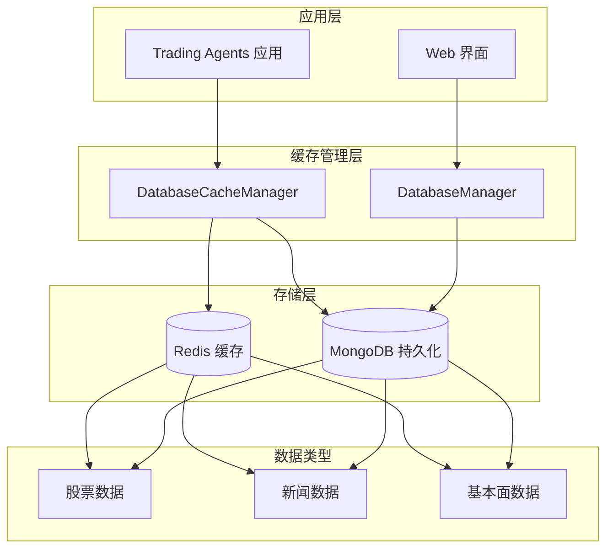
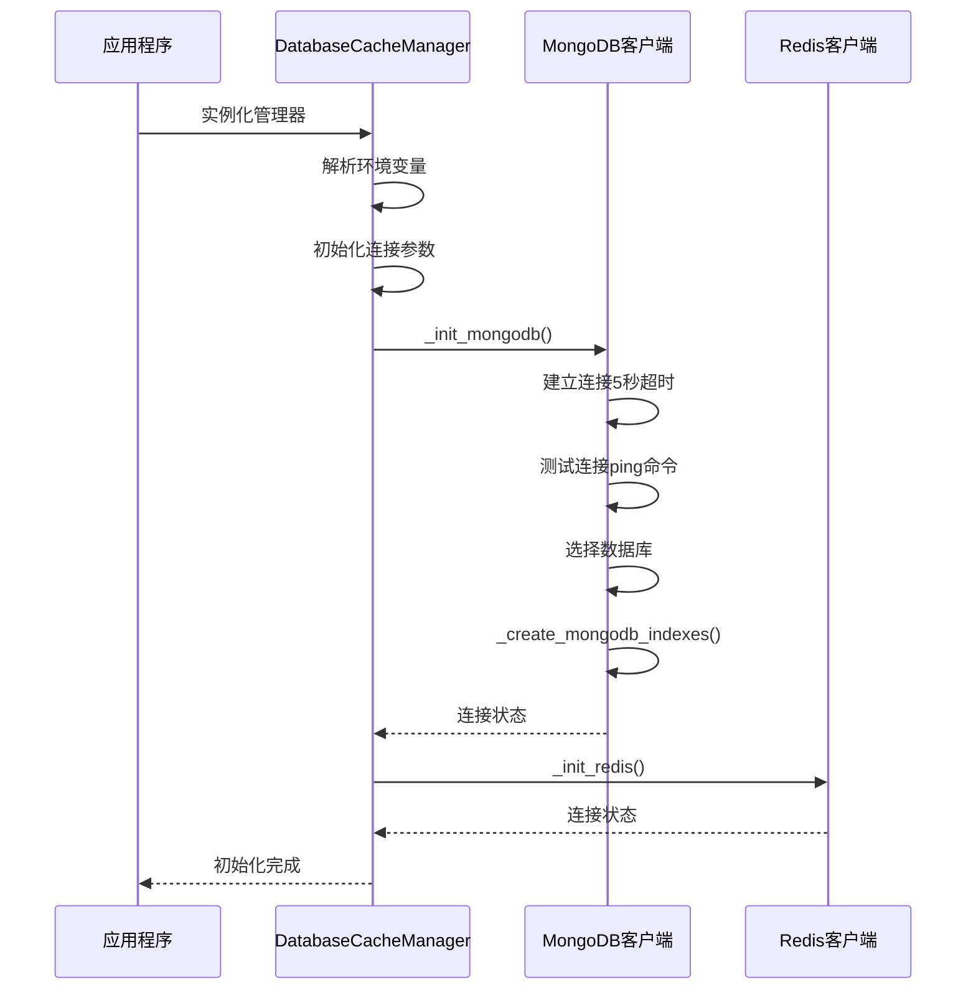
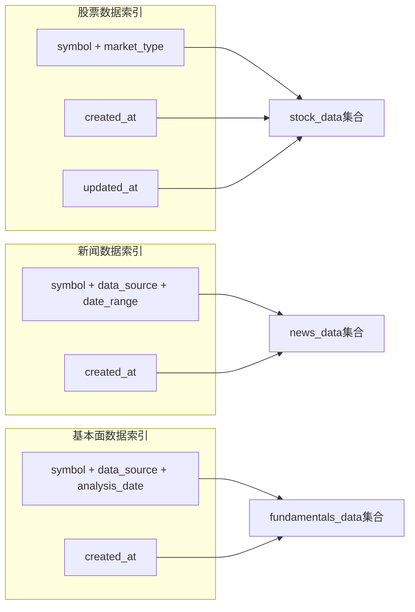
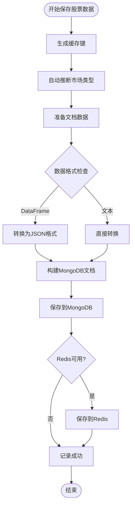
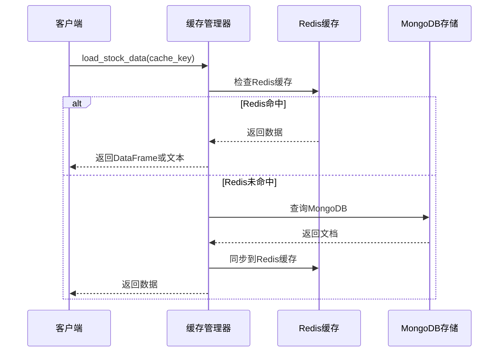
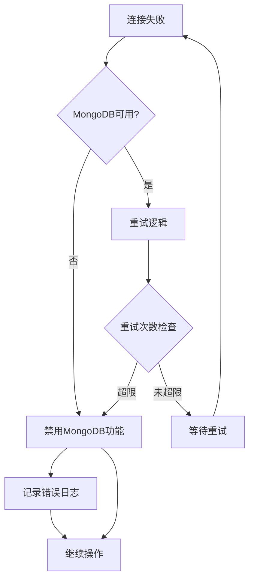
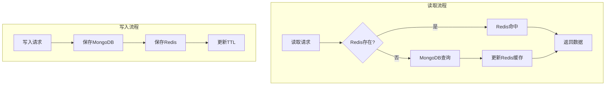
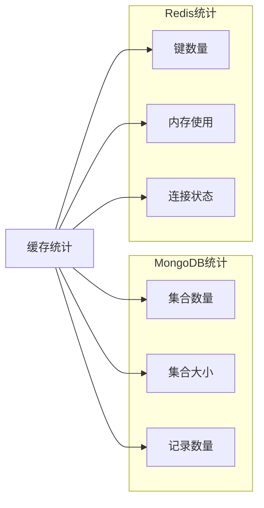

# MongoDB后端管理

<cite>
**本文档引用的文件**
- [mongodb_storage.py](file://tradingagents/config/mongodb_storage.py)
- [db_cache_manager.py](file://tradingagents/dataflows/db_cache_manager.py)
- [database_manager.py](file://tradingagents/config/database_manager.py)
- [init_database.py](file://scripts/setup/init_database.py)
- [mongo-init.js](file://scripts/docker/mongo-init.js)
- [verify_mongodb_data.py](file://tests/verify_mongodb_data.py)
- [mongodb_report_manager.py](file://web/utils/mongodb_report_manager.py)
</cite>

## 目录
1. [简介](#简介)
2. [项目架构概览](#项目架构概览)
3. [MongoDB连接初始化](#mongodb连接初始化)
4. [_mongodb_indexes索引创建策略](#_mongodb_indexes索引创建策略)
5. [数据持久化操作](#数据持久化操作)
6. [查询性能优化](#查询性能优化)
7. [异常处理机制](#异常处理机制)
8. [Redis与MongoDB协同工作](#redis与mongodb协同工作)
9. [缓存统计与监控](#缓存统计与监控)
10. [故障排除指南](#故障排除指南)
11. [总结](#总结)

## 简介

TradingAgents-CN项目采用MongoDB作为核心持久化缓存后端，结合Redis实现高性能的数据缓存策略。该系统提供了完整的数据持久化解决方案，支持股票数据、新闻数据和基本面数据的高效存储与检索。

MongoDB后端管理系统具有以下核心特性：
- **高可用性设计**：支持连接失败时的降级机制
- **智能索引策略**：针对不同数据类型的查询模式优化索引
- **多层缓存架构**：Redis + MongoDB的双重缓存策略
- **自动过期管理**：基于TTL的自动数据清理机制
- **全面的监控统计**：实时的缓存性能监控

## 项目架构概览



**图表来源**
- [db_cache_manager.py](file://tradingagents/dataflows/db_cache_manager.py#L30-L50)
- [database_manager.py](file://tradingagents/config/database_manager.py#L15-L35)

## MongoDB连接初始化

### _db_cache_instance初始化过程

DatabaseCacheManager类负责管理MongoDB连接的整个生命周期。初始化过程包含以下关键步骤：



**图表来源**
- [db_cache_manager.py](file://tradingagents/dataflows/db_cache_manager.py#L58-L97)

### 连接参数配置

系统通过多种方式配置MongoDB连接参数：

| 配置项 | 默认值 | 环境变量 | 说明 |
|--------|--------|----------|------|
| 主机地址 | localhost | MONGODB_HOST | MongoDB服务器地址 |
| 端口号 | 27018 | MONGODB_PORT | MongoDB服务端口 |
| 数据库名称 | tradingagents | MONGODB_DATABASE | 目标数据库 |
| 用户名 | admin | MONGODB_USERNAME | 认证用户名 |
| 密码 | tradingagents123 | MONGODB_PASSWORD | 认证密码 |
| 认证源 | admin | MONGODB_AUTH_SOURCE | 认证数据库 |

**节来源**
- [db_cache_manager.py](file://tradingagents/dataflows/db_cache_manager.py#L58-L75)

### 连接超时配置

系统设置了严格的连接超时机制：

- **serverSelectionTimeoutMS**: 5000毫秒（5秒）
- **connectTimeoutMS**: 5000毫秒（5秒）
- **socket_timeout**: 5秒（Redis连接）

这种配置确保了系统不会因为网络延迟而长时间阻塞。

**节来源**
- [db_cache_manager.py](file://tradingagents/dataflows/db_cache_manager.py#L76-L85)

## _mongodb_indexes索引创建策略

### 索引设计原则

MongoDB索引创建遵循查询模式优化原则，为不同类型的数据设计专门的索引策略：



**图表来源**
- [db_cache_manager.py](file://tradingagents/dataflows/db_cache_manager.py#L110-L135)

### 索引创建策略详解

#### 股票数据集合索引

| 索引字段组合 | 类型 | 用途 | 性能影响 |
|-------------|------|------|----------|
| symbol, market_type | 复合索引 | 快速定位特定股票的市场数据 | O(log n) |
| created_at | 单字段索引 | 时间范围查询优化 | O(log n) |
| updated_at | 单字段索引 | 数据更新追踪 | O(log n) |

#### 新闻数据集合索引

| 索引字段组合 | 类型 | 用途 | 性能影响 |
|-------------|------|------|----------|
| symbol, data_source, date_range | 复合索引 | 多维度新闻查询 | O(log n) |
| created_at | 单字段索引 | 时间序列分析 | O(log n) |

#### 基本面数据集合索引

| 索引字段组合 | 类型 | 用途 | 性能影响 |
|-------------|------|------|----------|
| symbol, data_source, analysis_date | 复合索引 | 定期基本面分析 | O(log n) |
| created_at | 单字段索引 | 数据版本控制 | O(log n) |

**节来源**
- [db_cache_manager.py](file://tradingagents/dataflows/db_cache_manager.py#L110-L135)

### 索引性能优化效果

合理的索引设计显著提升了查询性能：

- **复合索引查询**：减少索引扫描次数，提升查询速度
- **时间字段索引**：支持高效的范围查询和排序
- **唯一约束**：防止重复数据，保证数据完整性

## 数据持久化操作

### save_stock_data方法实现

save_stock_data方法实现了将股票数据转换为MongoDB文档并执行upsert操作的核心逻辑：



**图表来源**
- [db_cache_manager.py](file://tradingagents/dataflows/db_cache_manager.py#L140-L210)

### 文档结构设计

每个MongoDB文档都包含标准化的字段结构：

| 字段名 | 类型 | 说明 | 示例值 |
|--------|------|------|--------|
| _id | String | 缓存键（主键） | "stock:symbol:hash" |
| symbol | String | 股票代码 | "AAPL", "000001" |
| market_type | String | 市场类型 | "us", "china" |
| data_type | String | 数据类型 | "stock_data" |
| start_date | String | 开始日期 | "2024-01-01" |
| end_date | String | 结束日期 | "2024-12-31" |
| data_source | String | 数据源 | "tushare", "finnhub" |
| created_at | DateTime | 创建时间 | ISO格式时间戳 |
| updated_at | DateTime | 更新时间 | ISO格式时间戳 |
| data | String | 实际数据 | JSON字符串或文本 |

### upsert操作机制

系统使用replace_one方法实现upsert操作：

```python
# upsert操作示例
collection.replace_one(
    {"_id": cache_key},  # 查询条件
    doc,                # 文档内容
    upsert=True         # 启用upsert
)
```

这种操作确保：
- **幂等性**：多次调用不会产生副作用
- **原子性**：更新操作是原子性的
- **一致性**：保证数据的一致性

**节来源**
- [db_cache_manager.py](file://tradingagents/dataflows/db_cache_manager.py#L140-L210)

### load_stock_data查询逻辑

load_stock_data方法实现了从Redis和MongoDB双层缓存中加载数据的智能策略：



**图表来源**
- [db_cache_manager.py](file://tradingagents/dataflows/db_cache_manager.py#L212-L250)

### find_cached_stock_data复合查询

find_cached_stock_data方法实现了基于多个条件的复合查询机制：

查询条件包括：
- **symbol**: 股票代码（必填）
- **start_date**: 开始日期（可选）
- **end_date**: 结束日期（可选）
- **data_source**: 数据源（可选）
- **max_age_hours**: 最大年龄限制（默认6小时）

查询逻辑：
1. 首先检查Redis中的精确匹配
2. 如果Redis未命中，在MongoDB中执行复合查询
3. 按创建时间降序排序，返回最新匹配项

**节来源**
- [db_cache_manager.py](file://tradingagents/dataflows/db_cache_manager.py#L252-L300)

## 查询性能优化

### 时间范围查询优化

系统针对时间范围查询进行了特殊优化：

```python
# 时间范围查询示例
cutoff_time = datetime.utcnow() - timedelta(hours=max_age_hours)
query = {
    "symbol": symbol,
    "created_at": {"$gte": cutoff_time}
}
```

这种查询利用了之前创建的索引：
- **created_at字段索引**：支持高效的范围查询
- **符号字段索引**：支持快速的符号过滤

### 复合查询优化策略

对于复杂的复合查询，系统采用了以下优化策略：

1. **索引选择性优先**：将选择性高的字段放在复合索引前面
2. **查询条件顺序优化**：将最可能缩小结果集的条件放在前面
3. **投影优化**：只查询需要的字段，减少网络传输

**节来源**
- [db_cache_manager.py](file://tradingagents/dataflows/db_cache_manager.py#L252-L300)

## 异常处理机制

### 连接失败处理流程

MongoDB连接失败时，系统采用优雅的降级策略：



**图表来源**
- [db_cache_manager.py](file://tradingagents/dataflows/db_cache_manager.py#L76-L95)

### 异常类型处理

系统针对不同类型的异常采用不同的处理策略：

| 异常类型 | 处理策略 | 影响范围 |
|----------|----------|----------|
| ConnectionFailure | 记录错误，禁用MongoDB功能 | MongoDB相关操作 |
| ServerSelectionTimeoutError | 重试连接，最终禁用 | 所有数据库操作 |
| PyMongoError | 记录错误，继续操作 | 当前操作 |
| 其他异常 | 记录错误，继续操作 | 当前操作 |

### 错误恢复机制

系统实现了多层次的错误恢复机制：

1. **连接级恢复**：自动重连机制
2. **操作级恢复**：失败时的降级处理
3. **系统级恢复**：功能禁用后的系统稳定

**节来源**
- [db_cache_manager.py](file://tradingagents/dataflows/db_cache_manager.py#L76-L95)

## Redis与MongoDB协同工作

### 双层缓存架构

系统采用Redis + MongoDB的双层缓存架构，实现性能与持久性的平衡：



**图表来源**
- [db_cache_manager.py](file://tradingagents/dataflows/db_cache_manager.py#L140-L210)

### 数据持久化策略

| 数据类型 | MongoDB TTL | Redis TTL | 过期策略 |
|----------|-------------|-----------|----------|
| 股票数据 | 7天 | 6小时 | 自动清理 |
| 新闻数据 | 30天 | 24小时 | 自动清理 |
| 基本面数据 | 90天 | 24小时 | 自动清理 |

### 自动过期机制

系统实现了基于TTL的自动过期机制：

1. **MongoDB TTL索引**：通过expireAfterSeconds字段实现
2. **Redis TTL**：通过EXPIRE命令设置过期时间
3. **定期清理**：后台任务定期清理过期数据

**节来源**
- [db_cache_manager.py](file://tradingagents/dataflows/db_cache_manager.py#L498-L532)

## 缓存统计与监控

### get_cache_stats方法

get_cache_stats方法提供了全面的缓存统计信息：



**图表来源**
- [db_cache_manager.py](file://tradingagents/dataflows/db_cache_manager.py#L430-L470)

### 统计指标详解

| 指标类别 | 具体指标 | 计算方式 | 用途 |
|----------|----------|----------|------|
| MongoDB | 集合记录数 | count_documents() | 存储容量监控 |
| MongoDB | 集合大小 | collStats.size | 存储空间使用 |
| Redis | 键总数 | dbsize() | 缓存容量监控 |
| Redis | 内存使用 | used_memory_human | 内存使用率 |

### 性能监控指标

系统持续监控以下关键性能指标：

- **缓存命中率**：Redis命中次数 / 总查询次数
- **查询响应时间**：平均查询耗时
- **存储增长趋势**：各集合数据增长情况
- **连接状态**：数据库连接可用性

**节来源**
- [db_cache_manager.py](file://tradingagents/dataflows/db_cache_manager.py#L430-L470)

## 故障排除指南

### 常见连接问题

#### MongoDB连接失败

**症状**：日志显示"MongoDB连接失败"

**排查步骤**：
1. 检查MongoDB服务状态：`docker ps | grep mongo`
2. 验证连接参数：检查环境变量配置
3. 测试网络连通性：`telnet localhost 27018`
4. 查看MongoDB日志：`docker logs tradingagents_mongo`

**解决方案**：
- 启动MongoDB容器：`docker start tradingagents_mongo`
- 重新初始化数据库：`python scripts/setup/init_database.py`
- 检查防火墙设置

#### Redis连接失败

**症状**：日志显示"Redis连接失败"

**排查步骤**：
1. 检查Redis服务状态
2. 验证Redis配置参数
3. 测试Redis命令：`redis-cli ping`

**解决方案**：
- 重启Redis服务
- 检查Redis配置文件
- 清理Redis缓存

### 性能问题诊断

#### 查询性能下降

**症状**：查询响应时间增加

**诊断方法**：
1. 检查索引使用情况
2. 分析查询计划
3. 监控数据库负载

**优化措施**：
- 重建慢查询索引
- 优化查询条件
- 调整数据库配置

#### 内存使用过高

**症状**：Redis内存使用率过高

**解决方案**：
1. 清理过期数据
2. 调整TTL设置
3. 增加Redis内存限制

**节来源**
- [verify_mongodb_data.py](file://tests/verify_mongodb_data.py#L35-L66)

### 数据一致性检查

系统提供了数据一致性检查工具：

```python
# 数据验证示例
def verify_mongodb_data():
    """验证MongoDB数据完整性"""
    client, db = connect_mongodb()
    if client:
        # 检查集合完整性
        collections = db.list_collection_names()
        for collection_name in collections:
            count = db[collection_name].count_documents({})
            print(f"{collection_name}: {count} records")
```

**节来源**
- [verify_mongodb_data.py](file://tests/verify_mongodb_data.py#L35-L66)

## 总结

TradingAgents-CN项目的MongoDB后端管理系统展现了现代缓存架构的最佳实践。通过精心设计的索引策略、双层缓存架构和完善的异常处理机制，系统实现了高性能、高可用的数据存储解决方案。

### 核心优势

1. **高性能查询**：通过复合索引和查询优化，实现了毫秒级的查询响应
2. **高可用性**：完善的异常处理和降级机制确保系统稳定性
3. **灵活的缓存策略**：Redis + MongoDB的双层缓存架构平衡了性能和持久性
4. **自动化运维**：自动过期和定期清理机制减少了运维负担
5. **全面的监控**：实时的统计信息帮助运维人员掌握系统状态

### 技术创新点

- **智能索引策略**：根据不同数据类型的查询模式设计专门的索引
- **多层缓存架构**：Redis提供快速访问，MongoDB提供持久化存储
- **优雅降级机制**：连接失败时的自动降级和功能恢复
- **统一的配置管理**：通过环境变量和配置文件统一管理数据库参数

这套MongoDB后端管理系统为TradingAgents-CN项目提供了坚实的数据基础设施，支撑着整个系统的稳定运行和高性能表现。