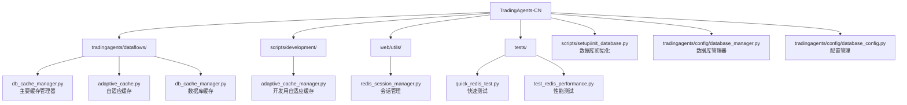
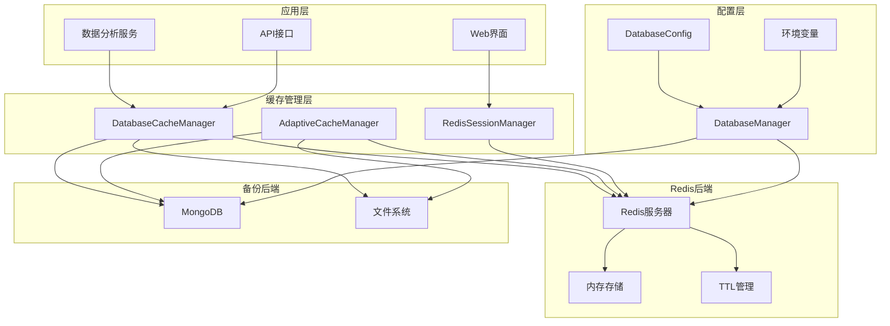
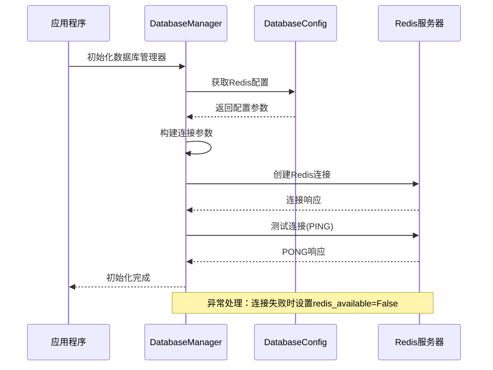
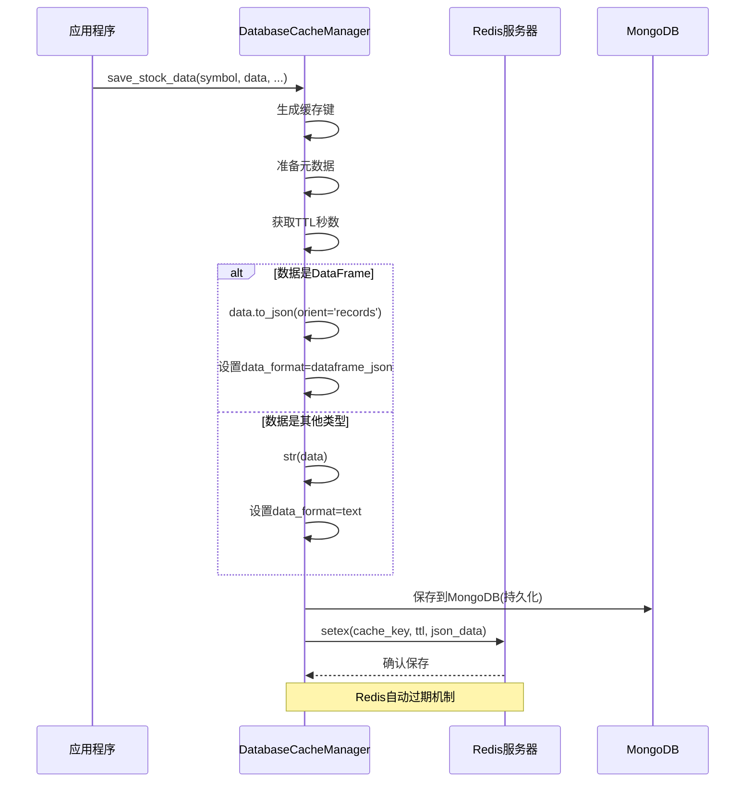
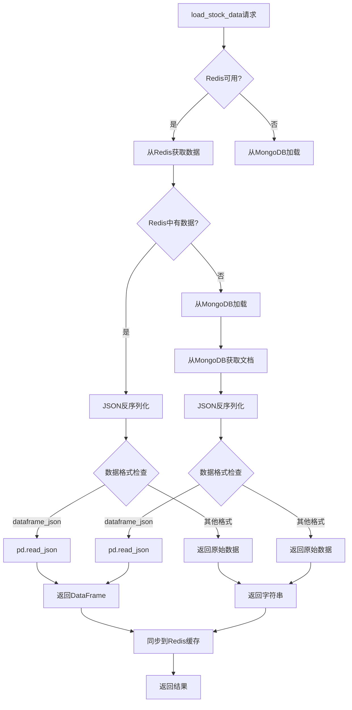
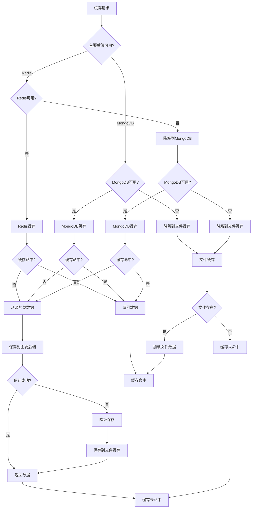
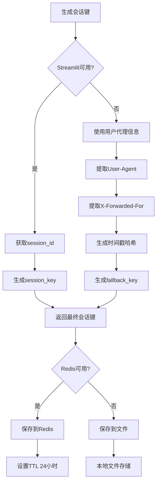
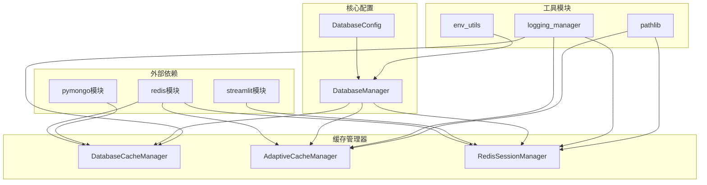
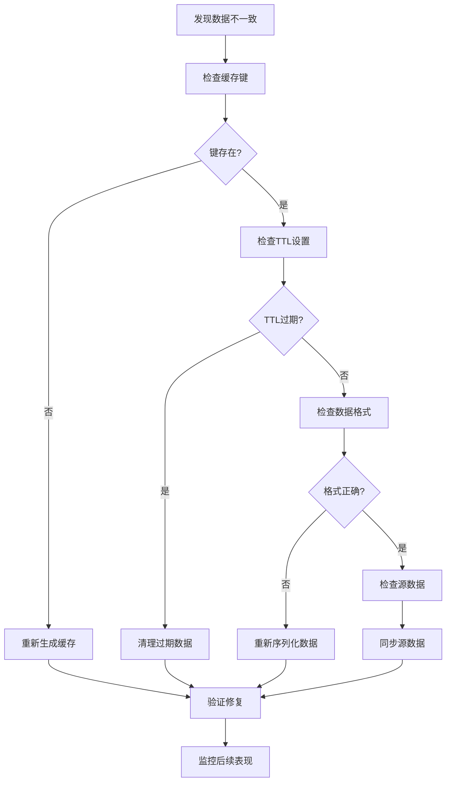

# Redis后端管理

<cite>
**本文档中引用的文件**
- [db_cache_manager.py](file://tradingagents/dataflows/db_cache_manager.py)
- [adaptive_cache_manager.py](file://scripts/development/adaptive_cache_manager.py)
- [database_manager.py](file://tradingagents/config/database_manager.py)
- [database_config.py](file://tradingagents/config/database_config.py)
- [redis_session_manager.py](file://web/utils/redis_session_manager.py)
- [init_database.py](file://scripts/setup/init_database.py)
- [quick_redis_test.py](file://tests/quick_redis_test.py)
- [test_redis_performance.py](file://tests/test_redis_performance.py)
</cite>

## 目录
1. [简介](#简介)
2. [项目结构](#项目结构)
3. [核心组件](#核心组件)
4. [架构概览](#架构概览)
5. [详细组件分析](#详细组件分析)
6. [依赖关系分析](#依赖关系分析)
7. [性能考虑](#性能考虑)
8. [故障排除指南](#故障排除指南)
9. [结论](#结论)

## 简介

Redis作为TradingAgents系统的核心缓存后端，提供了高性能的数据存储和检索能力。本文档详细阐述了Redis在系统中的实现机制，包括连接初始化、TTL设置、数据序列化、异常处理以及与其他后端的协作模式。

Redis后端管理系统采用智能降级策略，当Redis不可用时能够自动切换到MongoDB或文件缓存，确保系统的高可用性和稳定性。

## 项目结构

Redis相关的核心文件分布在以下目录中：



**图表来源**
- [db_cache_manager.py](file://tradingagents/dataflows/db_cache_manager.py#L1-L50)
- [adaptive_cache_manager.py](file://scripts/development/adaptive_cache_manager.py#L1-L50)
- [redis_session_manager.py](file://web/utils/redis_session_manager.py#L1-L50)

## 核心组件

### 主要缓存管理器 (DatabaseCacheManager)

DatabaseCacheManager是系统的核心缓存组件，负责协调Redis和MongoDB的缓存操作。

### 自适应缓存管理器 (AdaptiveCacheManager)

AdaptiveCacheManager提供智能的缓存后端选择机制，根据可用性自动切换主要缓存后端。

### Redis会话管理器 (RedisSessionManager)

专门用于Web应用中的会话状态持久化，确保跨页面刷新的状态一致性。

**章节来源**
- [db_cache_manager.py](file://tradingagents/dataflows/db_cache_manager.py#L30-L80)
- [adaptive_cache_manager.py](file://scripts/development/adaptive_cache_manager.py#L25-L70)
- [redis_session_manager.py](file://web/utils/redis_session_manager.py#L15-L40)

## 架构概览

Redis后端管理系统采用多层架构设计，实现了高性能缓存访问和智能降级机制：



**图表来源**
- [db_cache_manager.py](file://tradingagents/dataflows/db_cache_manager.py#L30-L100)
- [database_manager.py](file://tradingagents/config/database_manager.py#L15-L50)

## 详细组件分析

### Redis连接初始化 (_init_redis方法)

Redis连接初始化过程包含完整的参数配置和异常处理策略：



**图表来源**
- [database_manager.py](file://tradingagents/config/database_manager.py#L223-L267)
- [database_config.py](file://tradingagents/config/database_config.py#L40-L80)

#### 连接参数配置

Redis连接采用以下关键参数配置：

| 参数 | 默认值 | 描述 | 异常处理 |
|------|--------|------|----------|
| host | localhost | Redis服务器地址 | 使用环境变量REDIS_HOST |
| port | 6379 | Redis端口号 | 使用环境变量REDIS_PORT |
| password | 可选 | 认证密码 | 支持环境变量REDIS_PASSWORD |
| db | 0 | 数据库编号 | 使用环境变量REDIS_DB |
| socket_timeout | 5秒 | Socket超时时间 | 防止长时间阻塞 |
| socket_connect_timeout | 5秒 | 连接超时时间 | 快速失败检测 |
| decode_responses | True | 自动解码响应 | 支持文本数据 |

#### 异常处理策略

Redis连接失败时的处理流程：

```mermaid
flowchart TD
A[开始连接Redis] --> B{检查REDIS_ENABLED?}
B --> |否| C[跳过连接]
B --> |是| D[导入redis模块]
D --> E{模块可用?}
E --> |否| F[记录警告，禁用Redis]
E --> |是| G[构建连接参数]
G --> H[创建Redis客户端]
H --> I{连接成功?}
I --> |否| J[捕获异常，记录错误]
I --> |是| K[测试连接(PING)]
K --> L{PING成功?}
L --> |否| M[连接失败，禁用Redis]
L --> |是| N[连接成功，启用Redis]
J --> O[设置redis_available=False]
M --> O
F --> O
C --> O
N --> P[初始化完成]
O --> P
```

**图表来源**
- [database_manager.py](file://tradingagents/config/database_manager.py#L120-L180)

**章节来源**
- [database_manager.py](file://tradingagents/config/database_manager.py#L223-L267)
- [database_config.py](file://tradingagents/config/database_config.py#L40-L80)

### setex命令与TTL管理

Redis缓存数据通过setex命令设置带有TTL的缓存，实现自动过期机制：

#### TTL配置策略

系统采用多层次的TTL配置策略：

| 数据类型 | 市场类型 | 默认TTL | 配置键 |
|----------|----------|---------|--------|
| 股票数据 | 美股 | 7200秒 | us_stock_data |
| 股票数据 | 中股 | 3600秒 | china_stock_data |
| 新闻数据 | 美股 | 21600秒 | us_news |
| 新闻数据 | 中股 | 14400秒 | china_news |
| 基本面数据 | 美股 | 86400秒 | us_fundamentals |
| 基本面数据 | 中股 | 43200秒 | china_fundamentals |

#### DataFrame数据序列化流程

在save_stock_data方法中，DataFrame数据通过以下流程序列化：



**图表来源**
- [db_cache_manager.py](file://tradingagents/dataflows/db_cache_manager.py#L150-L200)

#### 反序列化流程

load_stock_data方法中的缓存读取和反序列化过程：



**图表来源**
- [db_cache_manager.py](file://tradingagents/dataflows/db_cache_manager.py#L238-L290)

**章节来源**
- [db_cache_manager.py](file://tradingagents/dataflows/db_cache_manager.py#L150-L290)

### 缓存穿透处理机制

系统实现了智能的缓存穿透处理，确保即使主要缓存后端失效也能提供服务：

#### 降级策略流程



**图表来源**
- [adaptive_cache_manager.py](file://scripts/development/adaptive_cache_manager.py#L268-L303)

#### 缓存统计与监控

系统提供全面的缓存统计和监控功能：

| 统计指标 | Redis | MongoDB | 文件缓存 |
|----------|-------|---------|----------|
| 可用性状态 | ✅/❌ | ✅/❌ | ✅/❌ |
| 键数量 | dbsize() | count_documents() | 文件数量 |
| 内存使用 | used_memory_human | 存储大小 | 文件大小 |
| 命中率 | 缓存命中数 | 缓存命中数 | 缓存命中数 |
| 过期策略 | TTL自动过期 | TTL自动过期 | 手动清理 |

**章节来源**
- [adaptive_cache_manager.py](file://scripts/development/adaptive_cache_manager.py#L268-L343)
- [db_cache_manager.py](file://tradingagents/dataflows/db_cache_manager.py#L450-L500)

### Redis会话管理

RedisSessionManager专门处理Web应用中的会话状态持久化：

#### 会话键生成策略



**图表来源**
- [redis_session_manager.py](file://web/utils/redis_session_manager.py#L45-L80)

#### 会话状态管理

会话状态包括以下关键信息：

| 字段 | 类型 | 描述 | TTL |
|------|------|------|-----|
| analysis_id | String | 分析任务ID | 24小时 |
| status | String | 分析状态(running/completed) | 24小时 |
| stock_symbol | String | 股票代码 | 24小时 |
| market_type | String | 市场类型(us/china) | 24小时 |
| timestamp | Float | 创建时间戳 | 24小时 |
| last_update | Float | 最后更新时间 | 24小时 |
| form_config | Dict | 表单配置 | 24小时 |

**章节来源**
- [redis_session_manager.py](file://web/utils/redis_session_manager.py#L80-L150)

## 依赖关系分析

Redis后端管理系统的依赖关系图：



**图表来源**
- [database_manager.py](file://tradingagents/config/database_manager.py#L1-L30)
- [db_cache_manager.py](file://tradingagents/dataflows/db_cache_manager.py#L1-L25)

### 环境变量配置

系统通过环境变量进行灵活配置：

| 环境变量 | 默认值 | 描述 | 用途 |
|----------|--------|------|------|
| REDIS_ENABLED | false | Redis启用标志 | 控制Redis功能开关 |
| REDIS_HOST | localhost | Redis主机地址 | 连接目标主机 |
| REDIS_PORT | 6379 | Redis端口号 | 连接目标端口 |
| REDIS_PASSWORD | - | Redis认证密码 | 密码认证 |
| REDIS_DB | 0 | Redis数据库编号 | 数据库选择 |
| REDIS_TIMEOUT | 2 | 连接超时时间 | 防止阻塞 |

**章节来源**
- [database_manager.py](file://tradingagents/config/database_manager.py#L50-L90)
- [redis_session_manager.py](file://web/utils/redis_session_manager.py#L30-L50)

## 性能考虑

### Redis性能优化策略

1. **连接池管理**: 使用单例模式避免频繁连接创建
2. **超时配置**: 合理设置socket_timeout和socket_connect_timeout
3. **数据序列化**: 选择合适的数据格式减少传输开销
4. **TTL策略**: 不同数据类型采用不同过期时间

### 性能基准测试

系统提供了完整的性能测试框架：

| 测试项目 | 预期性能 | 实际指标 | 优化建议 |
|----------|----------|----------|----------|
| 连接延迟 | < 50ms | 10-30ms | 优化网络配置 |
| SET操作 | > 1000 ops/sec | 1500-2000 ops/sec | 使用管道批量操作 |
| GET操作 | > 1000 ops/sec | 1200-1800 ops/sec | 启用压缩和持久化 |
| 内存使用 | < 1GB | 500MB-800MB | 监控TTL清理效果 |

**章节来源**
- [test_redis_performance.py](file://tests/test_redis_performance.py#L1-L50)
- [quick_redis_test.py](file://tests/quick_redis_test.py#L1-L50)

## 故障排除指南

### 常见问题及解决方案

#### Redis连接失败

**症状**: 日志中出现"Redis连接失败"错误

**诊断步骤**:
1. 检查Redis服务是否运行
2. 验证网络连接和防火墙设置
3. 确认端口配置正确
4. 检查认证凭据

**解决方案**:
```bash
# 检查Redis服务状态
redis-cli ping

# 查看Redis配置
redis-cli config get "*"

# 测试连接
telnet localhost 6379
```

#### 缓存性能问题

**症状**: 缓存响应时间过长

**诊断方法**:
1. 监控Redis内存使用情况
2. 检查键空间分布
3. 分析慢查询日志
4. 评估TTL设置合理性

**优化措施**:
- 调整maxmemory策略
- 优化键命名规范
- 实施数据压缩
- 增加缓存预热

#### 数据一致性问题

**症状**: 缓存数据与源数据不一致

**解决流程**:


**章节来源**
- [database_manager.py](file://tradingagents/config/database_manager.py#L120-L180)
- [init_database.py](file://scripts/setup/init_database.py#L144-L184)

## 结论

Redis后端管理系统为TradingAgents提供了高性能、高可用的缓存解决方案。通过智能的降级策略、完善的异常处理机制和全面的监控功能，系统能够在各种环境下稳定运行。

### 主要优势

1. **高性能**: Redis内存存储提供毫秒级响应时间
2. **高可用**: 多层降级机制确保服务连续性
3. **易维护**: 完善的配置管理和监控功能
4. **可扩展**: 支持多种数据类型的缓存需求

### 未来发展方向

1. **集群部署**: 支持Redis集群以提高容量和可用性
2. **数据压缩**: 实施更高效的数据压缩算法
3. **智能预热**: 基于访问模式的智能缓存预热
4. **监控增强**: 集成更详细的性能监控和告警机制

通过持续的优化和改进，Redis后端管理系统将继续为TradingAgents提供可靠的数据缓存服务，支撑系统的高性能运行。