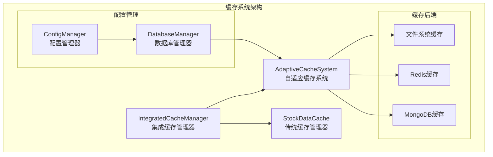
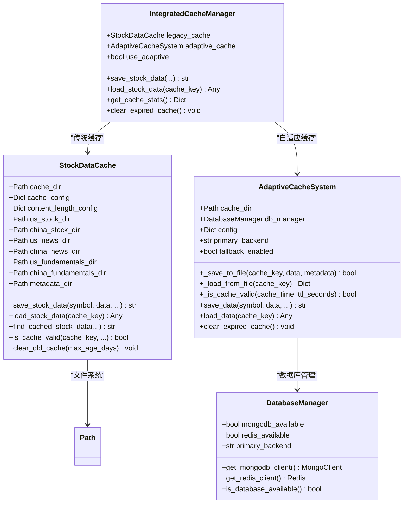
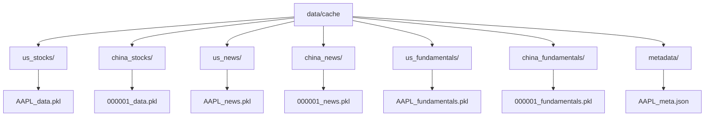
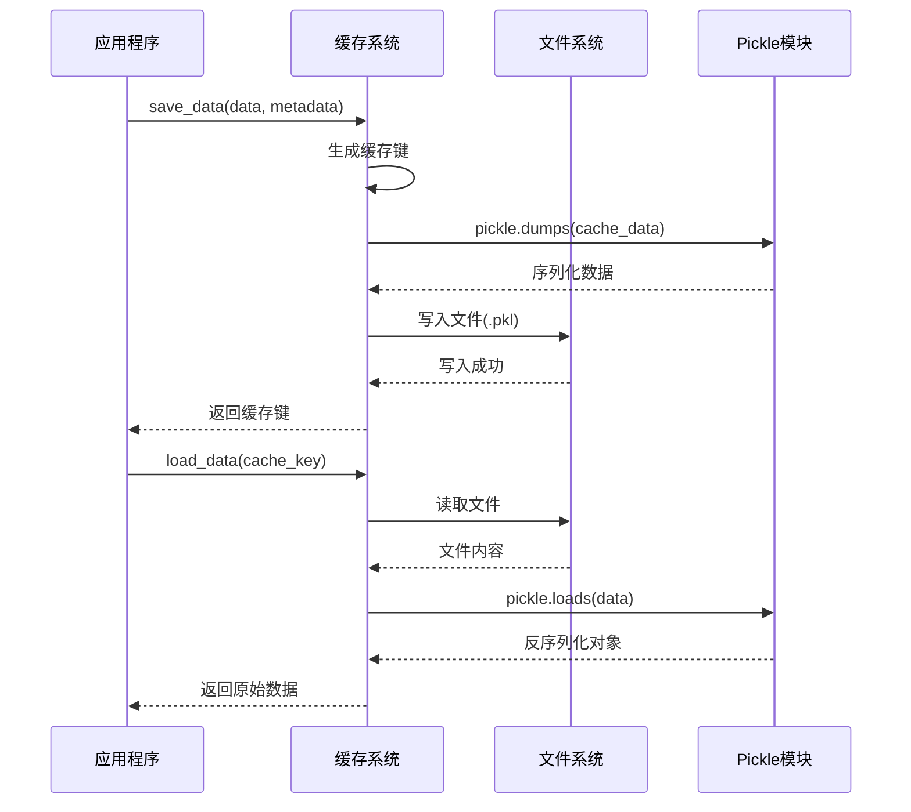
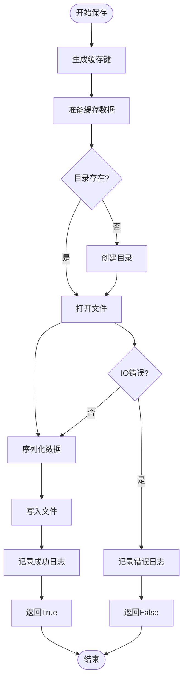
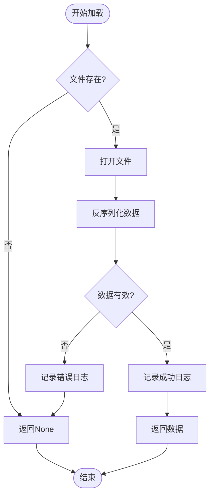
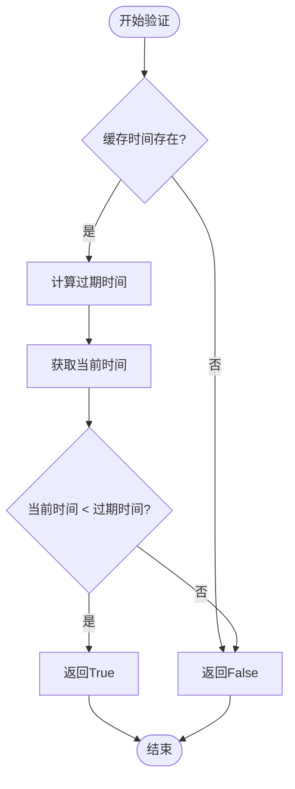
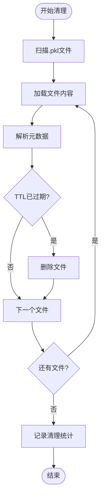
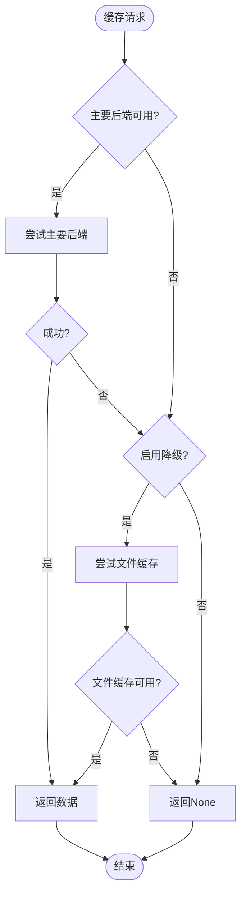
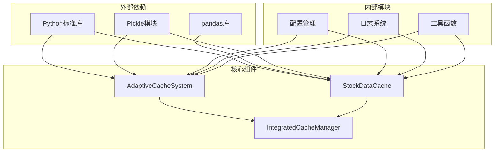

# 文件系统后端管理

<cite>
**本文档引用的文件**
- [adaptive_cache.py](file://tradingagents/dataflows/adaptive_cache.py)
- [cache_manager.py](file://tradingagents/dataflows/cache_manager.py)
- [integrated_cache.py](file://tradingagents/dataflows/integrated_cache.py)
- [database_manager.py](file://tradingagents/config/database_manager.py)
- [config_manager.py](file://tradingagents/config/config_manager.py)
- [test_fundamentals_cache.py](file://tests/test_fundamentals_cache.py)
- [test_cache_optimization.py](file://tests/test_cache_optimization.py)
</cite>

## 目录
1. [简介](#简介)
2. [项目结构概览](#项目结构概览)
3. [核心组件分析](#核心组件分析)
4. [架构概览](#架构概览)
5. [详细组件分析](#详细组件分析)
6. [依赖关系分析](#依赖关系分析)
7. [性能考虑](#性能考虑)
8. [故障排除指南](#故障排除指南)
9. [结论](#结论)

## 简介

文件系统作为缓存后端的实现方案是TradingAgents系统中的重要组成部分，它提供了可靠的数据持久化机制。该系统采用多层次的缓存策略，其中文件系统缓存作为最终的降级方案，确保在主要数据库后端不可用时仍能提供缓存服务。

本文档详细说明了文件系统缓存的实现机制，包括缓存目录的创建和管理、Pickle序列化技术的应用、文件I/O操作的异常处理，以及与其他缓存后端的优先级关系和切换条件。

## 项目结构概览

TradingAgents系统的缓存架构采用分层设计，包含以下核心模块：

**图表来源**
- [integrated_cache.py](file://tradingagents/dataflows/integrated_cache.py#L1-L50)
- [adaptive_cache.py](file://tradingagents/dataflows/adaptive_cache.py#L1-L50)
- [cache_manager.py](file://tradingagents/dataflows/cache_manager.py#L1-L50)

**章节来源**
- [integrated_cache.py](file://tradingagents/dataflows/integrated_cache.py#L1-L100)
- [adaptive_cache.py](file://tradingagents/dataflows/adaptive_cache.py#L1-L100)

## 核心组件分析

### AdaptiveCacheSystem类

AdaptiveCacheSystem是自适应缓存系统的核心类，负责协调多种缓存后端的工作。该类的主要职责包括：

- **缓存键生成**：使用MD5哈希算法生成唯一的缓存键
- **TTL管理**：根据不同市场类型和数据类型动态调整缓存有效期
- **多后端协调**：智能选择最适合的缓存后端
- **降级机制**：在主要后端不可用时自动切换到文件系统缓存

### StockDataCache类

StockDataCache是传统的文件缓存管理器，专门用于管理股票数据的本地缓存。其特点包括：

- **市场分类存储**：按美股和A股分别组织缓存目录
- **智能TTL配置**：针对不同数据类型设置不同的缓存期限
- **内容长度检查**：防止过大的数据占用过多磁盘空间
- **元数据管理**：维护详细的缓存元数据信息

**章节来源**
- [adaptive_cache.py](file://tradingagents/dataflows/adaptive_cache.py#L20-L80)
- [cache_manager.py](file://tradingagents/dataflows/cache_manager.py#L20-L100)

## 架构概览

文件系统缓存的架构设计遵循分层和模块化原则，确保系统的可扩展性和可维护性：

**图表来源**
- [adaptive_cache.py](file://tradingagents/dataflows/adaptive_cache.py#L20-L100)
- [cache_manager.py](file://tradingagents/dataflows/cache_manager.py#L20-L100)
- [integrated_cache.py](file://tradingagents/dataflows/integrated_cache.py#L20-L100)

## 详细组件分析

### 缓存目录管理机制

#### _cache_dir目录的创建和管理

文件系统缓存的目录结构采用层次化设计，确保不同类型的数据能够有序存储：

**图表来源**
- [cache_manager.py](file://tradingagents/dataflows/cache_manager.py#L40-L60)

每个目录都有特定的用途：
- **us_stocks/** 和 **china_stocks/**：存储股票历史数据
- **us_news/** 和 **china_news/**：存储新闻数据
- **us_fundamentals/** 和 **china_fundamentals/**：存储基本面数据
- **metadata/**：存储缓存元数据信息

#### 目录结构的动态创建

系统在初始化时会自动创建所需的目录结构，确保缓存操作的顺利进行。这种设计避免了手动管理目录的复杂性，提高了系统的可靠性。

**章节来源**
- [cache_manager.py](file://tradingagents/dataflows/cache_manager.py#L30-L80)

### Pickle序列化机制

#### 数据序列化和反序列化

文件系统缓存使用Python的Pickle模块进行数据序列化，这是一种高效的二进制序列化格式：

**图表来源**
- [adaptive_cache.py](file://tradingagents/dataflows/adaptive_cache.py#L70-L100)
- [cache_manager.py](file://tradingagents/dataflows/cache_manager.py#L200-L250)

#### Pickle文件命名规则

缓存文件采用统一的命名规则：`{cache_key}.pkl`，其中：
- **cache_key**：通过MD5哈希算法生成的唯一标识符
- **.pkl**：Pickle文件的标准扩展名

这种命名方式确保了文件的唯一性和可识别性，便于后续的管理和清理操作。

**章节来源**
- [adaptive_cache.py](file://tradingagents/dataflows/adaptive_cache.py#L70-L100)
- [cache_manager.py](file://tradingagents/dataflows/cache_manager.py#L150-L200)

### _save_to_file方法实现

_save_to_file方法负责将数据保存到文件系统缓存中，其实现包含以下关键步骤：

#### 方法执行流程

**图表来源**
- [adaptive_cache.py](file://tradingagents/dataflows/adaptive_cache.py#L70-L95)

#### 异常处理机制

_save_to_file方法实现了完善的异常处理机制：

1. **文件I/O异常**：捕获文件读写过程中的各种异常
2. **序列化异常**：处理数据无法序列化的特殊情况
3. **权限异常**：处理文件系统权限不足的问题
4. **磁盘空间异常**：检测磁盘空间不足的情况

所有异常都会被记录到日志中，并返回适当的错误状态，确保系统的稳定性。

**章节来源**
- [adaptive_cache.py](file://tradingagents/dataflows/adaptive_cache.py#L70-L95)

### _load_from_file方法实现

_load_from_file方法负责从文件系统缓存中加载数据，其执行流程与_save_to_file相对应：

#### 数据加载流程

**图表来源**
- [adaptive_cache.py](file://tradingagents/dataflows/adaptive_cache.py#L95-L115)

#### 数据完整性验证

加载过程中会进行多重验证：
- **文件存在性检查**：确保目标文件确实存在
- **序列化数据验证**：确认数据能够正确反序列化
- **数据结构验证**：检查数据结构的完整性

这些验证步骤确保了缓存数据的质量和系统的可靠性。

**章节来源**
- [adaptive_cache.py](file://tradingagents/dataflows/adaptive_cache.py#L95-L115)

### _is_cache_valid方法实现

_is_cache_valid方法基于TTL（生存时间）机制判断文件缓存的有效性：

#### TTL判断逻辑

**图表来源**
- [adaptive_cache.py](file://tradingagents/dataflows/adaptive_cache.py#L55-L65)

#### 动态TTL配置

系统支持基于市场类型和数据类型的动态TTL配置：

| 数据类型 | 美股TTL | A股TTL | 说明 |
|---------|--------|--------|------|
| 股票数据 | 2小时 | 1小时 | 实时性要求高的数据 |
| 新闻数据 | 6小时 | 4小时 | 新闻内容更新频率较低 |
| 基本面数据 | 24小时 | 12小时 | 基本面数据变化较慢 |

这种灵活的TTL配置确保了不同类型数据的最佳缓存策略。

**章节来源**
- [adaptive_cache.py](file://tradingagents/dataflows/adaptive_cache.py#L55-L65)
- [cache_manager.py](file://tradingagents/dataflows/cache_manager.py#L120-L150)

### clear_expired_cache方法实现

clear_expired_cache方法负责清理过期的缓存文件，维护缓存系统的健康运行：

#### 清理策略

**图表来源**
- [adaptive_cache.py](file://tradingagents/dataflows/adaptive_cache.py#L340-L360)

#### 清理效率优化

清理过程采用了多项优化措施：
- **批量处理**：一次性扫描所有.pkl文件
- **内存友好**：逐个处理文件，避免内存溢出
- **错误容忍**：单个文件清理失败不影响整体进程
- **统计报告**：提供详细的清理统计信息

**章节来源**
- [adaptive_cache.py](file://tradingagents/dataflows/adaptive_cache.py#L340-L360)

### 降级机制（Fallback）实现

当主要缓存后端不可用时，系统会自动切换到文件系统缓存作为降级方案：

#### 降级触发条件

**图表来源**
- [adaptive_cache.py](file://tradingagents/dataflows/adaptive_cache.py#L200-L250)

#### 降级配置选项

系统提供了灵活的降级配置：
- **fallback_enabled**：控制是否启用降级机制
- **primary_backend**：指定主要使用的缓存后端
- **自动检测**：系统自动检测各后端的可用性

这种设计确保了系统在各种环境下都能提供可靠的缓存服务。

**章节来源**
- [adaptive_cache.py](file://tradingagents/dataflows/adaptive_cache.py#L200-L250)

## 依赖关系分析

文件系统缓存系统的依赖关系体现了良好的模块化设计：

**图表来源**
- [adaptive_cache.py](file://tradingagents/dataflows/adaptive_cache.py#L1-L20)
- [cache_manager.py](file://tradingagents/dataflows/cache_manager.py#L1-L20)

### 模块间通信

各个模块之间通过清晰的接口进行通信：
- **配置传递**：通过配置对象传递缓存设置
- **日志共享**：统一的日志系统确保问题追踪
- **异常传播**：标准化的异常处理机制

这种设计降低了模块间的耦合度，提高了系统的可维护性。

**章节来源**
- [adaptive_cache.py](file://tradingagents/dataflows/adaptive_cache.py#L1-L30)
- [cache_manager.py](file://tradingagents/dataflows/cache_manager.py#L1-L30)

## 性能考虑

文件系统缓存在设计时充分考虑了性能因素：

### 存储效率优化

- **压缩存储**：使用Pickle的高效二进制格式
- **增量更新**：只在必要时更新缓存文件
- **目录结构**：合理的目录层次减少文件系统压力

### 访问性能优化

- **索引机制**：通过缓存键快速定位文件
- **内存映射**：对于大型数据集使用内存映射
- **并发控制**：适当的锁机制确保数据一致性

### 磁盘空间管理

- **自动清理**：定期清理过期文件
- **大小限制**：可配置的最大缓存大小
- **压缩策略**：对历史数据进行压缩存储

## 故障排除指南

### 常见问题及解决方案

#### 缓存文件损坏

**症状**：加载缓存时出现反序列化错误
**原因**：文件传输过程中损坏或磁盘错误
**解决**：删除损坏文件，重新生成缓存

#### 磁盘空间不足

**症状**：保存缓存时出现IO错误
**原因**：磁盘空间耗尽
**解决**：清理过期缓存，增加磁盘空间

#### 权限问题

**症状**：无法创建或访问缓存目录
**原因**：文件系统权限不足
**解决**：修改目录权限或更改缓存位置

**章节来源**
- [adaptive_cache.py](file://tradingagents/dataflows/adaptive_cache.py#L70-L115)
- [cache_manager.py](file://tradingagents/dataflows/cache_manager.py#L200-L250)

## 结论

文件系统作为缓存后端的实现方案展现了优秀的工程实践：

### 技术优势

1. **可靠性**：作为最终的降级方案，确保系统稳定性
2. **简单性**：基于标准文件系统的实现，易于理解和维护
3. **兼容性**：跨平台支持，无需额外依赖
4. **可扩展性**：支持多种数据类型和存储策略

### 设计亮点

- **智能降级**：自动检测后端可用性并切换
- **灵活配置**：支持动态调整缓存策略
- **完善监控**：提供详细的缓存统计和状态信息
- **异常处理**：全面的错误处理和恢复机制

### 应用价值

该实现方案为TradingAgents系统提供了坚实的缓存基础设施，不仅提高了系统的性能和用户体验，还增强了系统的可靠性和可维护性。通过合理的设计和实现，文件系统缓存成为了整个缓存生态系统中不可或缺的重要组成部分。