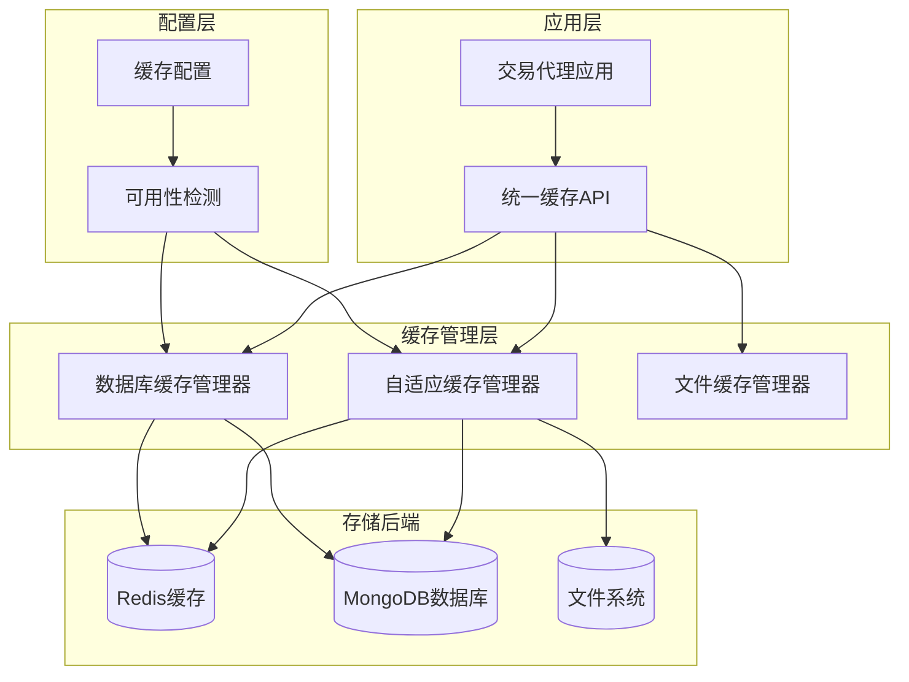
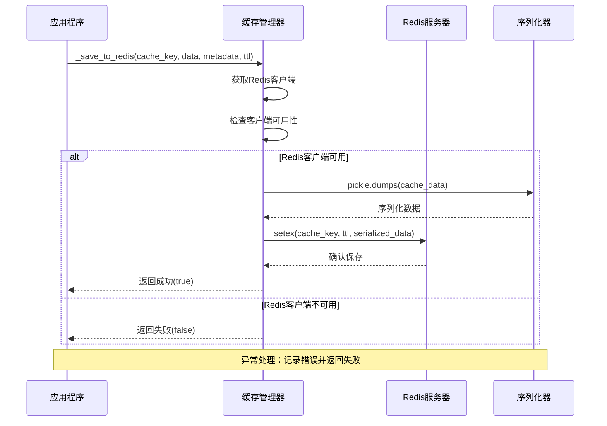
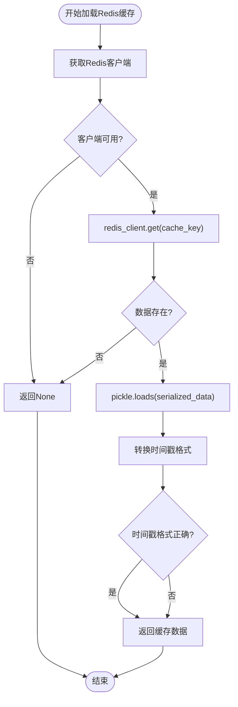
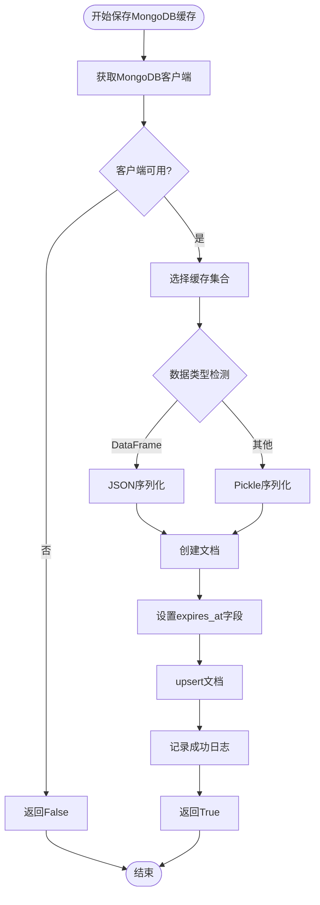
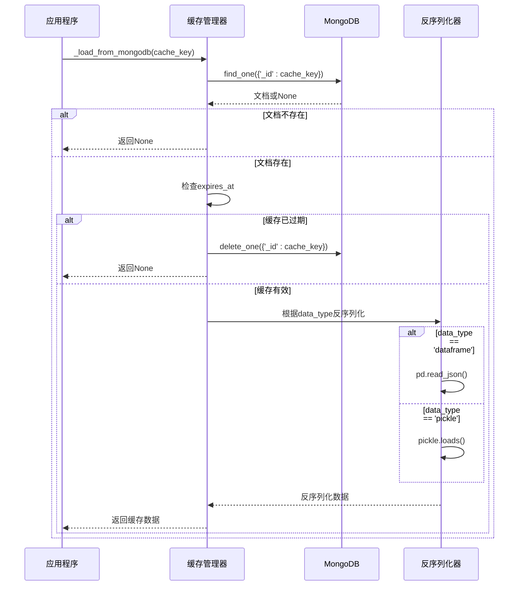
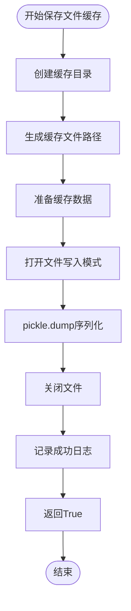
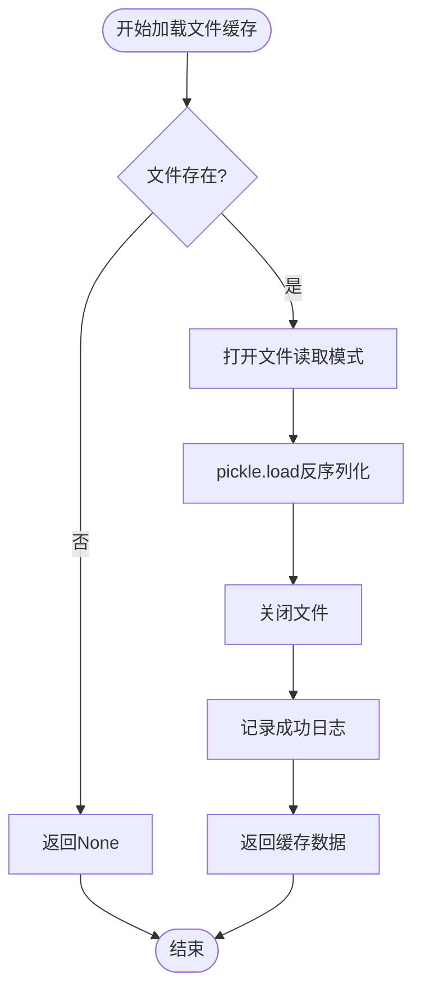
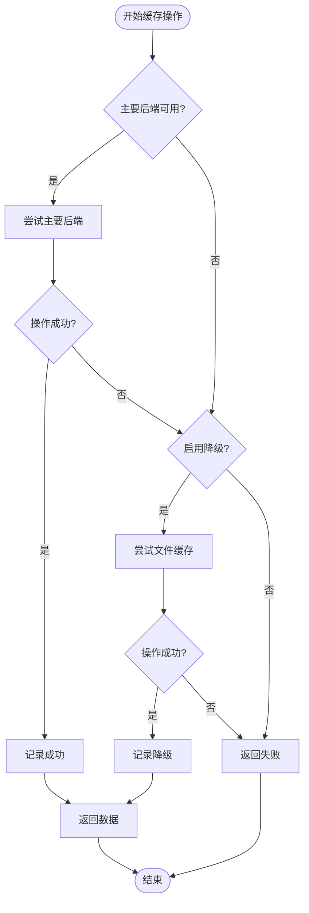
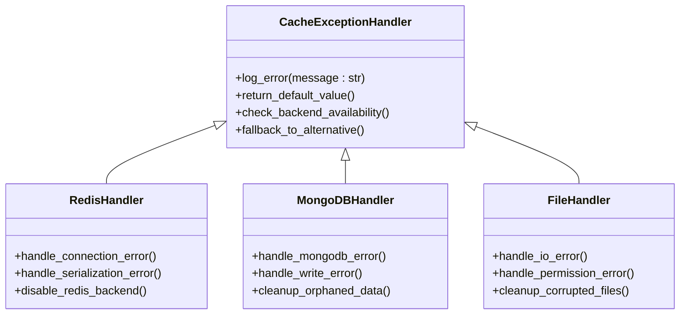
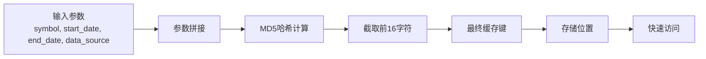

# 缓存后端管理系统

<cite>
**本文档引用的文件**
- [adaptive_cache.py](file://tradingagents/dataflows/adaptive_cache.py)
- [adaptive_cache_manager.py](file://scripts/development/adaptive_cache_manager.py)
- [db_cache_manager.py](file://tradingagents/dataflows/db_cache_manager.py)
- [database_manager.py](file://tradingagents/config/database_manager.py)
- [test_cache_optimization.py](file://tests/test_cache_optimization.py)
</cite>

## 目录
1. [简介](#简介)
2. [系统架构概览](#系统架构概览)
3. [Redis缓存后端](#redis缓存后端)
4. [MongoDB缓存后端](#mongodb缓存后端)
5. [文件系统缓存后端](#文件系统缓存后端)
6. [自适应缓存系统](#自适应缓存系统)
7. [异常处理机制](#异常处理机制)
8. [性能优化策略](#性能优化策略)
9. [故障排除指南](#故障排除指南)
10. [总结](#总结)

## 简介

TradingAgents项目实现了三种智能缓存后端：Redis、MongoDB和文件系统。这些缓存系统采用自适应策略，根据数据库可用性和性能需求自动选择最优的缓存方案。系统提供了统一的API接口，支持股票数据、新闻数据和基本面数据的高效缓存管理。

## 系统架构概览



**图表来源**
- [adaptive_cache.py](file://tradingagents/dataflows/adaptive_cache.py#L1-L50)
- [db_cache_manager.py](file://tradingagents/dataflows/db_cache_manager.py#L1-L50)
- [database_manager.py](file://tradingagents/config/database_manager.py#L1-L50)

## Redis缓存后端

### 实现原理

Redis缓存后端使用`setex`命令设置带TTL的序列化缓存数据，支持快速的数据访问和自动过期机制。

### 核心特性

| 特性 | 描述 | 实现方式 |
|------|------|----------|
| TTL设置 | 使用`setex`命令设置过期时间 | `redis_client.setex(cache_key, ttl_seconds, serialized_data)` |
| 序列化策略 | 使用pickle进行深度序列化 | `pickle.dumps(cache_data)` |
| 时间戳管理 | 存储ISO格式的时间戳 | `'timestamp': datetime.now().isoformat()` |
| 异常处理 | 完整的连接和序列化异常捕获 | `try-except`块包装 |

### 保存方法实现

Redis缓存的保存过程包括以下步骤：



**图表来源**
- [adaptive_cache.py](file://tradingagents/dataflows/adaptive_cache.py#L97-L138)
- [adaptive_cache_manager.py](file://scripts/development/adaptive_cache_manager.py#L187-L229)

### 加载方法实现

Redis缓存的加载过程包含以下步骤：



**图表来源**
- [adaptive_cache.py](file://tradingagents/dataflows/adaptive_cache.py#L138-L178)
- [adaptive_cache_manager.py](file://scripts/development/adaptive_cache_manager.py#L231-L266)

### 连接异常处理

Redis连接异常处理机制包括：

- **连接超时检测**：设置2秒socket超时
- **连接失败恢复**：自动禁用Redis后端
- **降级机制**：连接失败时自动切换到文件缓存
- **日志记录**：详细记录连接失败原因

**章节来源**
- [adaptive_cache.py](file://tradingagents/dataflows/adaptive_cache.py#L97-L138)
- [adaptive_cache_manager.py](file://scripts/development/adaptive_cache_manager.py#L113-L144)

## MongoDB缓存后端

### 实现原理

MongoDB缓存后端利用`expires_at`字段实现自动过期机制，并根据数据类型选择JSON或Pickle序列化策略。

### 核心特性

| 特性 | 描述 | 实现方式 |
|------|------|----------|
| 自动过期 | 使用`expires_at`字段实现 | `doc['expires_at'] < datetime.now()` |
| 数据类型检测 | 自动识别DataFrame和普通对象 | `isinstance(data, pd.DataFrame)` |
| JSON序列化 | DataFrame使用JSON格式 | `data.to_json()` |
| Pickle序列化 | 普通对象使用十六进制编码 | `pickle.dumps(data).hex()` |
| 索引优化 | 多字段复合索引加速查询 | `create_index([('symbol', 1), ('data_source', 1)])` |

### 保存方法实现

MongoDB缓存的保存过程如下：



**图表来源**
- [adaptive_cache.py](file://tradingagents/dataflows/adaptive_cache.py#L159-L195)
- [db_cache_manager.py](file://tradingagents/dataflows/db_cache_manager.py#L150-L220)

### 加载方法实现

MongoDB缓存的加载过程包含以下步骤：



**图表来源**
- [adaptive_cache.py](file://tradingagents/dataflows/adaptive_cache.py#L195-L223)
- [db_cache_manager.py](file://tradingagents/dataflows/db_cache_manager.py#L220-L280)

### 序列化策略选择

MongoDB缓存系统根据数据类型自动选择最优的序列化策略：

- **DataFrame数据**：使用JSON格式，支持结构化查询和更好的可读性
- **普通对象**：使用Pickle格式，支持复杂对象的完整序列化
- **字符串数据**：直接存储为文本

**章节来源**
- [adaptive_cache.py](file://tradingagents/dataflows/adaptive_cache.py#L159-L195)
- [db_cache_manager.py](file://tradingagents/dataflows/db_cache_manager.py#L150-L220)

## 文件系统缓存后端

### 实现原理

文件系统缓存后端使用Pickle序列化存储格式，将缓存数据保存在`data/cache/`目录结构中。

### 核心特性

| 特性 | 描述 | 实现方式 |
|------|------|----------|
| 存储格式 | Pickle二进制序列化 | `pickle.dump(cache_data, f)` |
| 目录结构 | `data/cache/{cache_key}.pkl` | `self.cache_dir / f"{cache_key}.pkl"` |
| 时间戳管理 | 存储本地时间戳 | `'timestamp': datetime.now()` |
| 文件权限 | 自动创建目录和文件 | `Path.mkdir(parents=True, exist_ok=True)` |
| 手动清理 | 支持过期文件手动删除 | `cache_file.unlink()` |

### 保存方法实现

文件缓存的保存过程相对简单直接：



**图表来源**
- [adaptive_cache.py](file://tradingagents/dataflows/adaptive_cache.py#L67-L97)
- [adaptive_cache_manager.py](file://scripts/development/adaptive_cache_manager.py#L159-L187)

### 加载方法实现

文件缓存的加载过程包括以下步骤：



**图表来源**
- [adaptive_cache.py](file://tradingagents/dataflows/adaptive_cache.py#L97-L119)
- [adaptive_cache_manager.py](scripts/development/adaptive_cache_manager.py#L187-L209)

### 目录结构设计

文件缓存采用扁平化的目录结构，所有缓存文件都存储在`data/cache/`目录下：

```
data/
└── cache/
    ├── abc123.pkl          # 缓存文件1
    ├── def456.pkl          # 缓存文件2
    └── ghi789.pkl          # 缓存文件3
```

**章节来源**
- [adaptive_cache.py](file://tradingagents/dataflows/adaptive_cache.py#L67-L97)
- [adaptive_cache_manager.py](file://scripts/development/adaptive_cache_manager.py#L159-L187)

## 自适应缓存系统

### 设计理念

自适应缓存系统根据数据库可用性自动选择最佳缓存策略，提供无缝的降级机制和性能优化。

### 后端优先级

系统按照以下优先级选择缓存后端：

1. **Redis**：最快的内存缓存，支持TTL自动过期
2. **MongoDB**：持久化存储，支持复杂查询和自动过期
3. **文件系统**：最基础的降级选项，适合离线场景

### 降级机制



**图表来源**
- [adaptive_cache.py](file://tradingagents/dataflows/adaptive_cache.py#L223-L292)
- [adaptive_cache_manager.py](file://scripts/development/adaptive_cache_manager.py#L268-L303)

### 配置管理

自适应缓存系统支持灵活的配置管理：

| 配置项 | 类型 | 描述 | 默认值 |
|--------|------|------|--------|
| primary_backend | string | 主要缓存后端 | "redis" |
| fallback_enabled | boolean | 是否启用降级 | true |
| ttl_settings | dict | TTL配置 | 详见配置示例 |
| cache_dir | string | 文件缓存目录 | "data/cache" |

**章节来源**
- [adaptive_cache.py](file://tradingagents/dataflows/adaptive_cache.py#L25-L35)
- [adaptive_cache_manager.py](file://scripts/development/adaptive_cache_manager.py#L27-L61)

## 异常处理机制

### 统一异常处理策略

所有缓存后端都实现了统一的异常处理策略：



**图表来源**
- [adaptive_cache.py](file://tradingagents/dataflows/adaptive_cache.py#L97-L138)
- [adaptive_cache.py](file://tradingagents/dataflows/adaptive_cache.py#L195-L223)

### 异常分类处理

| 异常类型 | 处理策略 | 影响范围 | 恢复机制 |
|----------|----------|----------|----------|
| 连接异常 | 禁用对应后端，启用降级 | 单个后端 | 自动重试下次请求 |
| 序列化异常 | 记录错误，跳过缓存 | 当前操作 | 使用原始数据 |
| 磁盘空间不足 | 清理过期缓存，记录警告 | 文件缓存 | 继续使用其他后端 |
| 数据损坏 | 删除损坏文件，重新获取 | 单个缓存项 | 重新下载数据 |

**章节来源**
- [adaptive_cache.py](file://tradingagents/dataflows/adaptive_cache.py#L97-L138)
- [adaptive_cache.py](file://tradingagents/dataflows/adaptive_cache.py#L195-L223)

## 性能优化策略

### 缓存键生成优化

系统使用MD5哈希算法生成缓存键，确保唯一性和性能：



**图表来源**
- [adaptive_cache.py](file://tradingagents/dataflows/adaptive_cache.py#L40-L45)

### TTL策略优化

不同数据类型的TTL配置经过精心优化：

| 数据类型 | 市场 | TTL配置 | 优化目标 |
|----------|------|---------|----------|
| 股票数据 | 美股 | 2小时 | 实时性优先 |
| 股票数据 | A股 | 1小时 | 盘后数据缓存 |
| 新闻数据 | 美股 | 6小时 | 内容时效性 |
| 新闻数据 | A股 | 4小时 | 政策敏感性 |
| 基本面数据 | 美股 | 24小时 | 季度报告周期 |
| 基本面数据 | A股 | 12小时 | 财报发布节奏 |

### 并发访问优化

- **连接池管理**：数据库连接采用连接池模式
- **异步操作**：支持异步缓存操作
- **锁机制**：防止并发写入冲突
- **批量操作**：支持批量缓存更新

**章节来源**
- [adaptive_cache.py](file://tradingagents/dataflows/adaptive_cache.py#L47-L65)
- [db_cache_manager.py](file://tradingagents/dataflows/db_cache_manager.py#L150-L220)

## 故障排除指南

### 常见问题诊断

#### Redis连接问题

**症状**：Redis缓存保存失败，日志显示连接超时

**诊断步骤**：
1. 检查Redis服务状态：`redis-cli ping`
2. 验证网络连接：`telnet localhost 6379`
3. 检查防火墙设置
4. 查看Redis配置文件

**解决方案**：
- 启动Redis服务：`sudo systemctl start redis`
- 调整超时设置：修改`socket_timeout`参数
- 检查密码配置：验证`REDIS_PASSWORD`环境变量

#### MongoDB连接问题

**症状**：MongoDB缓存操作失败，出现认证错误

**诊断步骤**：
1. 检查MongoDB服务状态
2. 验证用户权限
3. 检查认证机制
4. 查看MongoDB日志

**解决方案**：
- 重置用户密码：使用MongoDB shell重设密码
- 检查认证配置：验证`authSource`设置
- 调整连接参数：修改超时和重试设置

#### 文件系统权限问题

**症状**：文件缓存无法创建，出现权限拒绝错误

**诊断步骤**：
1. 检查缓存目录权限
2. 验证磁盘空间
3. 检查SELinux/AppArmor设置

**解决方案**：
- 修改目录权限：`chmod 755 data/cache`
- 创建目录所有权：`chown user:group data/cache`
- 清理磁盘空间：删除过期缓存文件

### 性能监控指标

| 指标类型 | 监控内容 | 正常范围 | 告警阈值 |
|----------|----------|----------|----------|
| Redis内存使用率 | 内存占用百分比 | < 80% | > 90% |
| MongoDB查询响应时间 | 平均查询延迟 | < 100ms | > 500ms |
| 文件缓存命中率 | 缓存命中次数/总请求数 | > 70% | < 50% |
| 缓存清理频率 | 过期文件清理速度 | < 100/分钟 | > 500/分钟 |

**章节来源**
- [adaptive_cache.py](file://tradingagents/dataflows/adaptive_cache.py#L320-L383)
- [database_manager.py](file://tradingagents/config/database_manager.py#L100-L150)

## 总结

TradingAgents的缓存后端管理系统提供了完整的三层缓存解决方案：

1. **Redis缓存**：提供最快的内存访问，支持自动过期和TTL管理
2. **MongoDB缓存**：提供持久化存储，支持复杂查询和自动过期
3. **文件系统缓存**：提供基础的降级选项，适合离线场景

系统的核心优势包括：

- **自适应选择**：根据可用性自动选择最优后端
- **无缝降级**：主后端失败时自动切换到备用方案
- **统一接口**：提供一致的API体验
- **完善监控**：实时监控缓存状态和性能指标
- **健壮异常处理**：全面的错误处理和恢复机制

这种多层次的缓存架构确保了系统的高可用性和优异的性能表现，为交易代理应用提供了可靠的数据缓存基础设施。