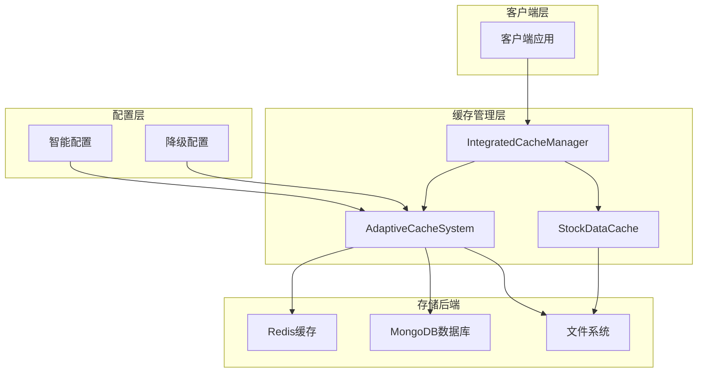
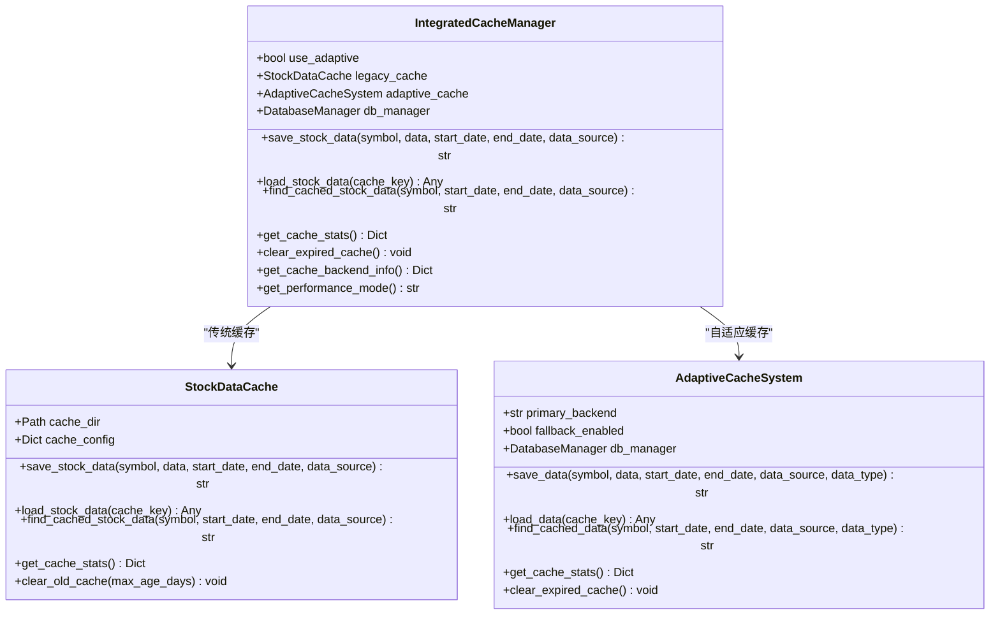
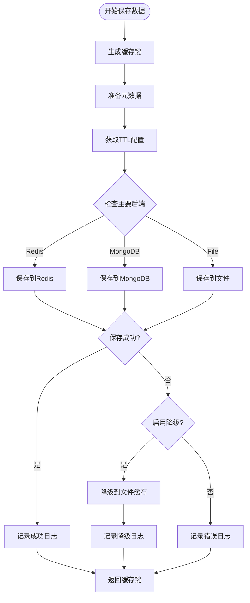
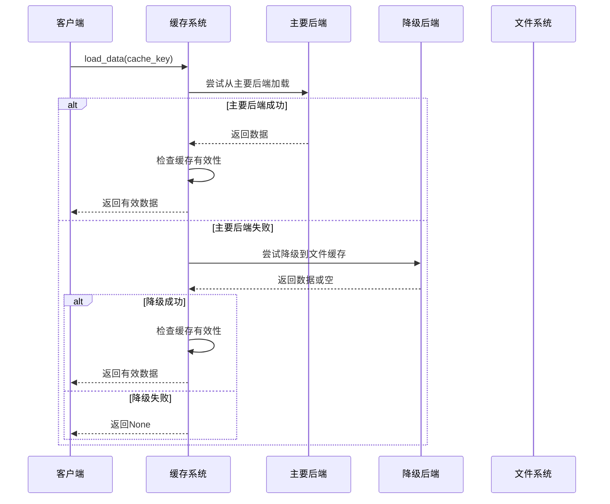
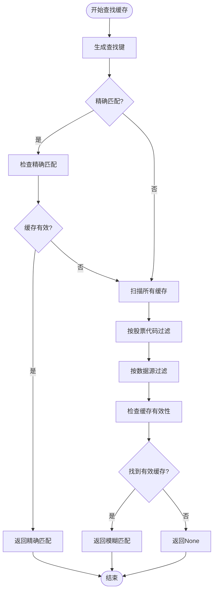
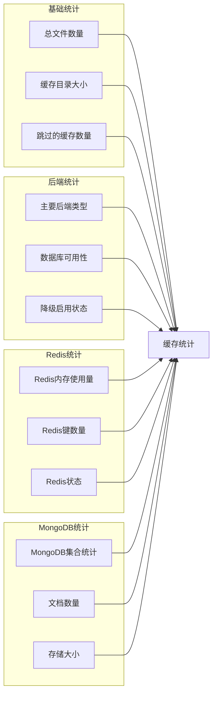
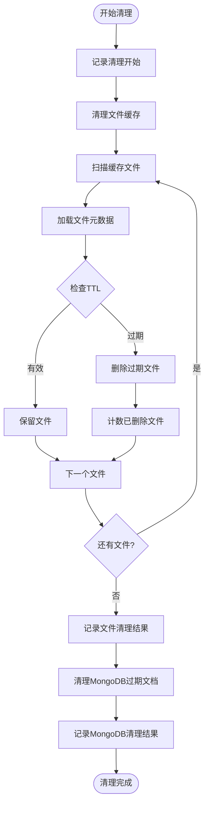
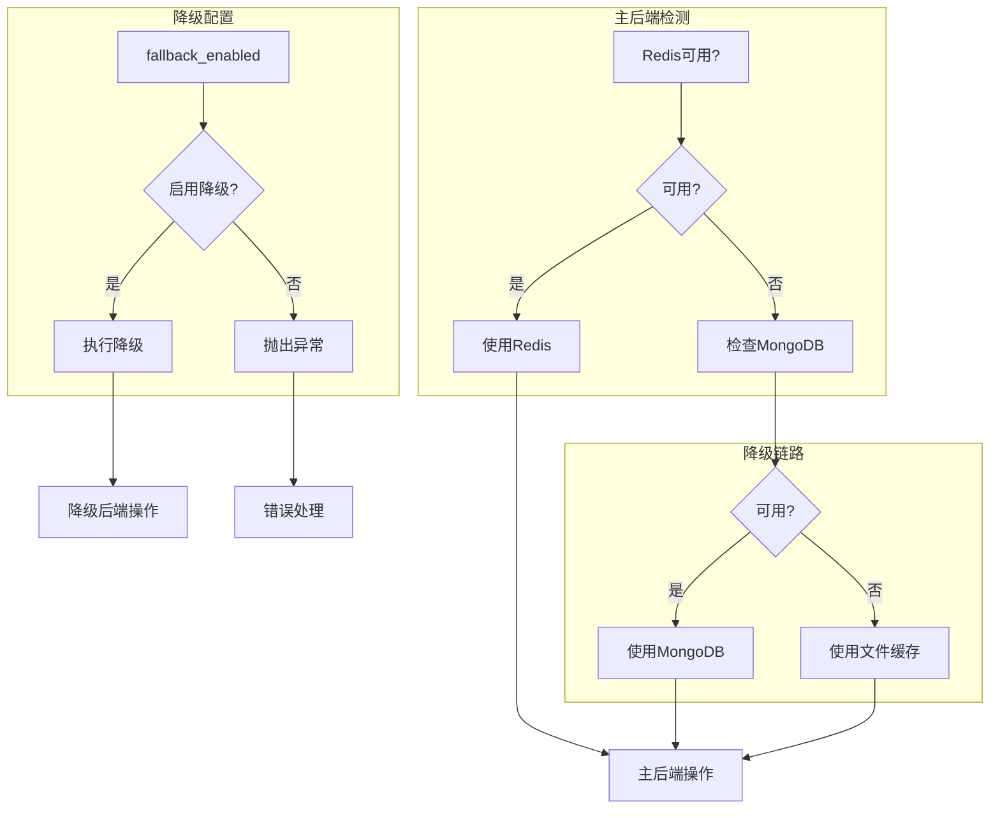
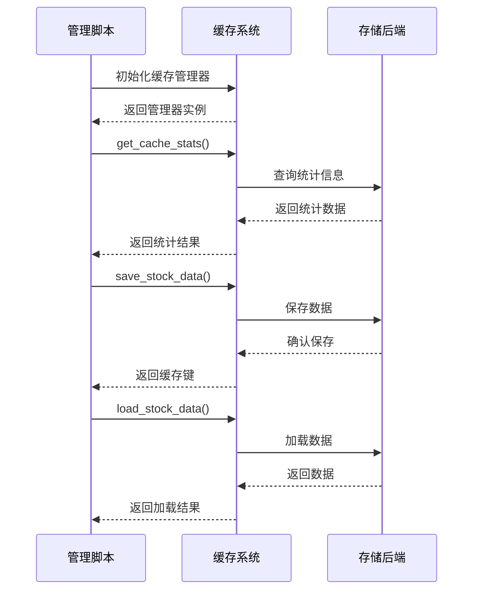
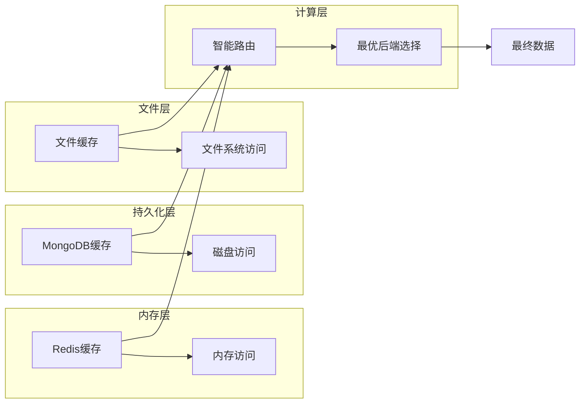

# 缓存操作与管理

<cite>
**本文档引用的文件**
- [adaptive_cache_manager.py](file://scripts/development/adaptive_cache_manager.py)
- [adaptive_cache.py](file://tradingagents/dataflows/adaptive_cache.py)
- [cache_manager.py](file://tradingagents/dataflows/cache_manager.py)
- [db_cache_manager.py](file://tradingagents/dataflows/db_cache_manager.py)
- [integrated_cache.py](file://tradingagents/dataflows/integrated_cache.py)
- [test_cache_optimization.py](file://tests/test_cache_optimization.py)
- [test_fundamentals_cache.py](file://tests/test_fundamentals_cache.py)
- [cleanup_cache.py](file://scripts/maintenance/cleanup_cache.py)
</cite>

## 目录
1. [简介](#简介)
2. [缓存架构概览](#缓存架构概览)
3. [核心缓存组件](#核心缓存组件)
4. [save_data方法详解](#save_data方法详解)
5. [load_data方法详解](#load_data方法详解)
6. [find_cached_data方法详解](#find_cached_data方法详解)
7. [get_cache_stats方法详解](#get_cache_stats方法详解)
8. [clear_expired_cache方法详解](#clear_expired_cache方法详解)
9. [降级机制](#降级机制)
10. [缓存管理脚本](#缓存管理脚本)
11. [性能优化策略](#性能优化策略)
12. [故障排除指南](#故障排除指南)

## 简介

TradingAgents-CN项目实现了多层次的缓存管理系统，支持文件缓存、Redis缓存和MongoDB缓存的智能切换。该系统提供了强大的降级机制，确保在任何情况下都能提供可靠的缓存服务。

## 缓存架构概览



**图表来源**
- [integrated_cache.py](file://tradingagents/dataflows/integrated_cache.py#L1-L50)
- [adaptive_cache.py](file://tradingagents/dataflows/adaptive_cache.py#L1-L50)

## 核心缓存组件

### 集成缓存管理器 (IntegratedCacheManager)

集成缓存管理器是整个缓存系统的核心协调者，它智能地选择使用传统文件缓存还是自适应数据库缓存。



**图表来源**
- [integrated_cache.py](file://tradingagents/dataflows/integrated_cache.py#L20-L80)
- [cache_manager.py](file://tradingagents/dataflows/cache_manager.py#L20-L100)
- [adaptive_cache.py](file://tradingagents/dataflows/adaptive_cache.py#L20-L80)

**节来源**
- [integrated_cache.py](file://tradingagents/dataflows/integrated_cache.py#L20-L100)
- [cache_manager.py](file://tradingagents/dataflows/cache_manager.py#L20-L150)
- [adaptive_cache.py](file://tradingagents/dataflows/adaptive_cache.py#L20-L100)

## save_data方法详解

### 方法签名与参数

`save_data`方法是缓存系统的核心写入接口，负责将数据保存到合适的存储后端。

### 主要功能流程



**图表来源**
- [adaptive_cache.py](file://tradingagents/dataflows/adaptive_cache.py#L200-L280)

### 存储后端选择逻辑

系统根据配置的`primary_backend`参数选择最优的存储后端：

1. **Redis优先级**：提供最快的访问速度
2. **MongoDB优先级**：提供持久化存储和复杂查询能力
3. **文件缓存**：作为最后的后备选项

### TTL配置机制

系统支持智能的TTL（生存时间）配置，根据不同数据类型和市场自动调整过期时间：

| 数据类型 | 美股TTL | A股TTL | 描述 |
|---------|--------|--------|------|
| 股票数据 | 2小时 | 1小时 | 实时性要求高的数据 |
| 新闻数据 | 6小时 | 4小时 | 时效性较弱的信息 |
| 基本面数据 | 24小时 | 12小时 | 分析型数据，更新频率低 |

**节来源**
- [adaptive_cache.py](file://tradingagents/dataflows/adaptive_cache.py#L200-L290)

## load_data方法详解

### 加载流程架构



**图表来源**
- [adaptive_cache.py](file://tradingagents/dataflows/adaptive_cache.py#L290-L330)

### 缓存有效性检查

对于文件缓存，系统会进行严格的有效性检查：

1. **时间戳验证**：检查缓存创建时间是否在TTL范围内
2. **数据完整性验证**：确保缓存文件未损坏
3. **市场类型匹配**：验证股票代码与缓存数据的一致性

### 数据反序列化

系统支持多种数据格式的自动识别和反序列化：

- **Pandas DataFrame**：自动转换为DataFrame对象
- **JSON数据**：解析为Python字典
- **文本数据**：保持原始字符串格式

**节来源**
- [adaptive_cache.py](file://tradingagents/dataflows/adaptive_cache.py#L290-L350)

## find_cached_data方法详解

### 缓存预检机制

`find_cached_data`方法实现了智能的缓存预检功能，支持精确匹配和模糊匹配两种模式。



**图表来源**
- [adaptive_cache.py](file://tradingagents/dataflows/adaptive_cache.py#L330-L350)

### 智能匹配算法

系统采用多维度匹配策略：

1. **精确匹配**：完全匹配所有查询条件
2. **符号匹配**：仅匹配股票代码
3. **时间范围匹配**：匹配时间区间
4. **数据源匹配**：匹配数据来源

### 性能优化

为了提高查找效率，系统实现了以下优化：

- **索引支持**：为常用查询字段建立索引
- **缓存预热**：预先加载热点数据
- **批量查询**：支持一次性查询多个缓存项

**节来源**
- [adaptive_cache.py](file://tradingagents/dataflows/adaptive_cache.py#L330-L360)

## get_cache_stats方法详解

### 统计指标体系

`get_cache_stats`方法提供了全面的缓存系统监控指标：



**图表来源**
- [adaptive_cache.py](file://tradingagents/dataflows/adaptive_cache.py#L350-L380)

### 监控指标详解

| 指标类别 | 具体指标 | 描述 | 单位 |
|---------|---------|------|------|
| 基础指标 | total_files | 总缓存文件数 | 个 |
| 基础指标 | total_size_mb | 总缓存大小 | MB |
| 基础指标 | skipped_count | 跳过的缓存数量 | 个 |
| 后端指标 | primary_backend | 主要后端类型 | 字符串 |
| 后端指标 | mongodb_available | MongoDB可用性 | 布尔值 |
| 后端指标 | redis_available | Redis可用性 | 布尔值 |
| Redis指标 | redis_memory_used | Redis内存使用量 | 字符串 |
| Redis指标 | redis_keys | Redis键数量 | 个 |
| MongoDB指标 | mongodb_cache_count | MongoDB缓存数量 | 个 |

### 实时监控

系统支持实时监控和告警：

- **内存使用监控**：跟踪Redis内存使用情况
- **磁盘空间监控**：监控文件缓存占用空间
- **性能指标监控**：记录缓存命中率和响应时间

**节来源**
- [adaptive_cache.py](file://tradingagents/dataflows/adaptive_cache.py#L350-L383)

## clear_expired_cache方法详解

### 过期清理策略

`clear_expired_cache`方法实现了智能的过期缓存清理机制：



**图表来源**
- [adaptive_cache.py](file://tradingagents/dataflows/adaptive_cache.py#L360-L383)

### 清理策略对比

| 存储类型 | 清理方式 | 自动清理 | 手动清理 | 清理粒度 |
|---------|---------|----------|----------|----------|
| 文件缓存 | 手动扫描删除 | 否 | 是 | 单个文件 |
| Redis缓存 | 自动过期删除 | 是 | 否 | 键级别 |
| MongoDB缓存 | 自动TTL索引 | 是 | 否 | 文档级别 |

### 清理性能优化

系统实现了高效的清理策略：

1. **增量清理**：只清理过期的缓存项
2. **并发处理**：支持多线程清理
3. **进度跟踪**：实时显示清理进度
4. **异常恢复**：清理中断后可恢复

**节来源**
- [adaptive_cache.py](file://tradingagents/dataflows/adaptive_cache.py#L360-L383)

## 降级机制

### 降级策略架构



**图表来源**
- [adaptive_cache.py](file://tradingagents/dataflows/adaptive_cache.py#L100-L130)

### 降级触发条件

系统会在以下情况下触发降级：

1. **主后端连接失败**：网络问题或服务不可用
2. **主后端响应超时**：性能问题导致延迟过高
3. **主后端资源不足**：内存或CPU使用率过高
4. **配置强制降级**：管理员手动禁用主后端

### 降级恢复机制

当主后端恢复可用时，系统会自动切换回主后端：

1. **健康检查**：定期检测主后端状态
2. **平滑切换**：无缝切换到主后端
3. **数据同步**：确保降级期间的数据一致性

**节来源**
- [adaptive_cache.py](file://tradingagents/dataflows/adaptive_cache.py#L100-L140)

## 缓存管理脚本

### adaptive_cache_manager.py

该脚本提供了完整的缓存状态检查和管理功能：



**图表来源**
- [adaptive_cache_manager.py](file://scripts/development/adaptive_cache_manager.py#L350-L410)

### 使用示例

#### 基本缓存操作

```python
# 初始化缓存管理器
from scripts.development.adaptive_cache_manager import get_cache

cache = get_cache()

# 保存股票数据
data = "股票历史数据"
cache_key = cache.save_stock_data(
    symbol="AAPL",
    data=data,
    start_date="2024-01-01",
    end_date="2024-12-31",
    data_source="yfinance"
)

# 加载缓存数据
loaded_data = cache.load_stock_data(cache_key)

# 查找缓存
found_key = cache.find_cached_stock_data(
    symbol="AAPL",
    start_date="2024-01-01",
    end_date="2024-12-31",
    data_source="yfinance"
)
```

#### 缓存统计查看

```python
# 获取缓存统计信息
stats = cache.get_cache_stats()
print(f"主要后端: {stats['primary_backend']}")
print(f"文件缓存数量: {stats['file_cache_count']}")
print(f"Redis可用: {stats['redis_enabled']}")
print(f"MongoDB可用: {stats['mongodb_enabled']}")
```

### cleanup_cache.py

该脚本专门用于清理过期的缓存文件：

#### 清理策略

- **时间阈值**：默认清理7天前的缓存
- **批量处理**：支持大规模缓存清理
- **安全删除**：确保不会误删活跃缓存

#### 使用方法

```bash
# 清理7天前的缓存
python scripts/maintenance/cleanup_cache.py

# 清理指定天数前的缓存
python scripts/maintenance/cleanup_cache.py --max-age 30
```

**节来源**
- [adaptive_cache_manager.py](file://scripts/development/adaptive_cache_manager.py#L350-L410)
- [cleanup_cache.py](file://scripts/maintenance/cleanup_cache.py#L1-L50)

## 性能优化策略

### 缓存层次结构

系统采用了多层缓存架构来最大化性能：



**图表来源**
- [integrated_cache.py](file://tradingagents/dataflows/integrated_cache.py#L250-L290)

### 性能监控指标

| 指标类型 | 监控项目 | 目标值 | 告警阈值 |
|---------|---------|--------|----------|
| 响应时间 | 缓存读取时间 | < 100ms | > 500ms |
| 命中率 | 缓存命中率 | > 95% | < 80% |
| 内存使用 | Redis内存使用率 | < 80% | > 90% |
| 磁盘使用 | 文件缓存大小 | < 1GB | > 2GB |

### 优化建议

1. **合理配置TTL**：根据数据特性设置合适的过期时间
2. **监控缓存命中率**：及时调整缓存策略
3. **定期清理过期缓存**：避免磁盘空间浪费
4. **负载均衡**：在多个存储后端之间分配负载

**节来源**
- [test_cache_optimization.py](file://tests/test_cache_optimization.py#L190-L270)

## 故障排除指南

### 常见问题诊断

#### 缓存无法保存

**症状**：`save_data`方法返回失败或抛出异常

**排查步骤**：
1. 检查存储后端连接状态
2. 验证磁盘空间是否充足
3. 确认权限设置正确
4. 检查配置文件设置

**解决方案**：
```python
# 检查缓存状态
stats = cache.get_cache_stats()
print(f"后端状态: {stats}")

# 强制使用文件缓存
cache.primary_backend = "file"
```

#### 缓存数据丢失

**症状**：`load_data`返回None或数据不一致

**排查步骤**：
1. 检查TTL设置是否过短
2. 验证缓存键是否正确
3. 确认数据序列化/反序列化过程
4. 检查文件权限和路径

**解决方案**：
```python
# 手动清理缓存
cache.clear_expired_cache()

# 重新保存数据
new_key = cache.save_stock_data(symbol, data)
```

#### 性能问题

**症状**：缓存操作响应缓慢

**排查步骤**：
1. 监控存储后端性能
2. 检查网络连接质量
3. 分析缓存命中率
4. 优化查询条件

**解决方案**：
```python
# 切换到更快的后端
cache.primary_backend = "redis"

# 调整TTL设置
cache.cache_config["us_stock_data"]["ttl_hours"] = 4
```

### 日志分析

系统提供了详细的日志记录功能，帮助诊断问题：

- **DEBUG级别**：详细的执行流程信息
- **INFO级别**：关键操作的状态信息
- **WARNING级别**：潜在问题的警告信息
- **ERROR级别**：错误和异常信息

**节来源**
- [test_cache_optimization.py](file://tests/test_cache_optimization.py#L1-L50)
- [test_fundamentals_cache.py](file://tests/test_fundamentals_cache.py#L1-L50)

## 结论

TradingAgents-CN的缓存系统通过多层次的设计和智能的降级机制，提供了高性能、高可靠性的数据缓存解决方案。系统支持多种存储后端，能够根据实际情况自动选择最优的缓存策略，同时保证在任何情况下都能提供稳定的缓存服务。

通过合理的配置和监控，该缓存系统能够显著提升应用程序的性能，减少API调用次数，降低系统负载，为用户提供更好的体验。