# 缓存数据操作

<cite>
**本文档引用的文件**
- [adaptive_cache.py](file://tradingagents/dataflows/adaptive_cache.py)
- [cache_manager.py](file://tradingagents/dataflows/cache_manager.py)
- [integrated_cache.py](file://tradingagents/dataflows/integrated_cache.py)
- [database_manager.py](file://tradingagents/config/database_manager.py)
- [test_fundamentals_cache.py](file://tests/test_fundamentals_cache.py)
- [test_cache_optimization.py](file://tests/test_cache_optimization.py)
</cite>

## 目录
1. [简介](#简介)
2. [系统架构概览](#系统架构概览)
3. [核心数据操作方法](#核心数据操作方法)
4. [缓存后端配置与选择](#缓存后端配置与选择)
5. [数据键生成策略](#数据键生成策略)
6. [TTL与过期管理](#ttl与过期管理)
7. [错误处理与降级机制](#错误处理与降级机制)
8. [实际应用示例](#实际应用示例)
9. [性能优化与监控](#性能优化与监控)
10. [总结](#总结)

## 简介

TradingAgents-CN项目实现了一套完整的自适应缓存系统，支持多种数据类型的持久化存储和高效检索。该系统采用智能后端选择策略，根据数据库可用性自动选择最优的缓存方案，同时提供强大的降级机制确保系统的可靠性。

缓存系统主要处理三类核心数据：
- **股票数据**：包括历史行情、实时数据等
- **新闻数据**：市场新闻、公告信息等
- **基本面数据**：公司财务报表、估值指标等

## 系统架构概览

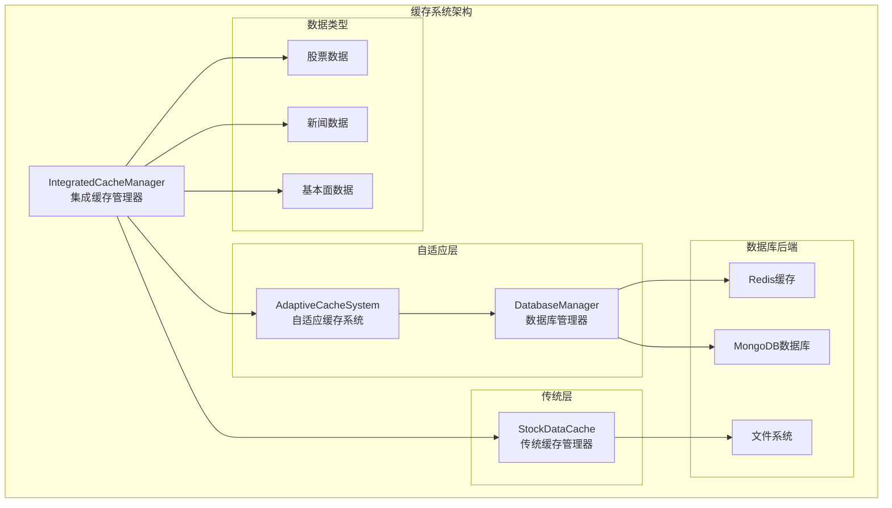

**图表来源**
- [integrated_cache.py](file://tradingagents/dataflows/integrated_cache.py#L1-L50)
- [adaptive_cache.py](file://tradingagents/dataflows/adaptive_cache.py#L1-L50)
- [database_manager.py](file://tradingagents/config/database_manager.py#L1-L50)

**章节来源**
- [integrated_cache.py](file://tradingagents/dataflows/integrated_cache.py#L1-L100)
- [adaptive_cache.py](file://tradingagents/dataflows/adaptive_cache.py#L18-L55)

## 核心数据操作方法

### save_data函数详解

`save_data`函数是缓存系统的核心数据持久化入口，实现了智能后端选择和降级策略。

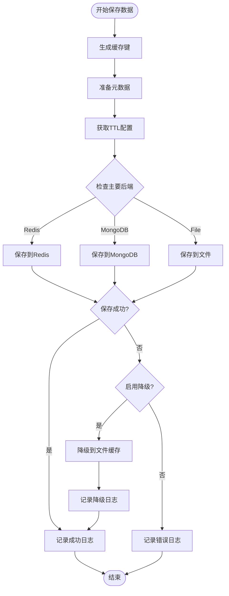

**图表来源**
- [adaptive_cache.py](file://tradingagents/dataflows/adaptive_cache.py#L223-L292)

#### 主要特性

1. **智能后端选择**：根据配置自动选择Redis、MongoDB或文件系统
2. **TTL自动管理**：基于市场类型和数据类型自动设置过期时间
3. **序列化支持**：支持多种数据格式（DataFrame、字符串、字典等）
4. **错误恢复**：保存失败时自动降级到文件缓存

**章节来源**
- [adaptive_cache.py](file://tradingagents/dataflows/adaptive_cache.py#L223-L292)

### load_data函数详解

`load_data`函数实现了多级加载逻辑，优先从主要后端读取，失败后自动降级。

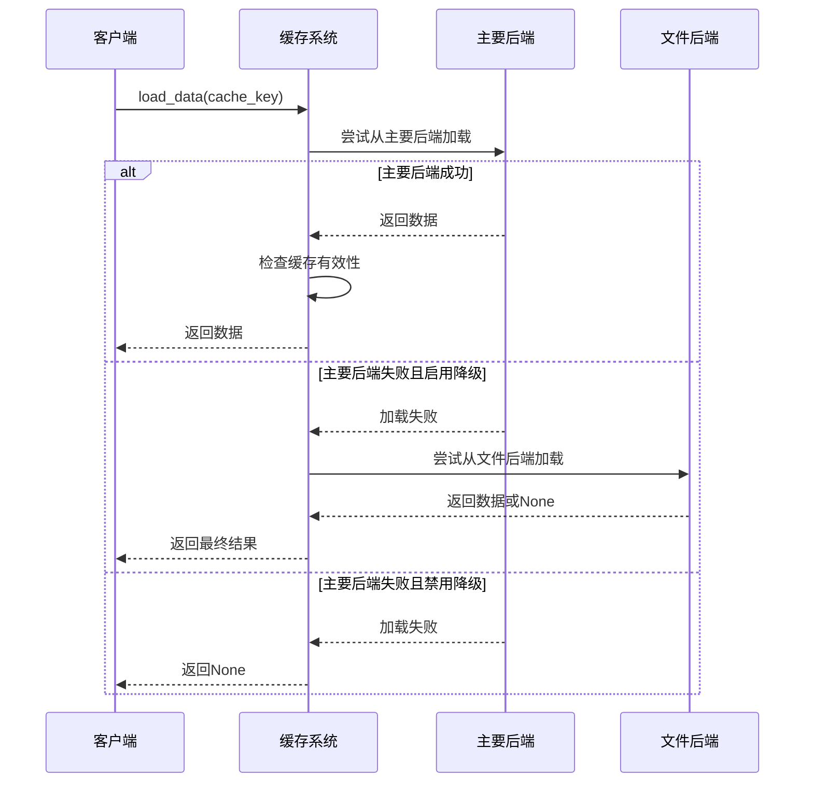

**图表来源**
- [adaptive_cache.py](file://tradingagents/dataflows/adaptive_cache.py#L293-L325)

#### 加载流程特点

1. **优先级策略**：按Redis→MongoDB→文件的顺序尝试加载
2. **有效性检查**：对文件缓存进行TTL验证
3. **优雅降级**：失败时自动切换到文件缓存
4. **空值处理**：返回None表示缓存不存在或已过期

**章节来源**
- [adaptive_cache.py](file://tradingagents/dataflows/adaptive_cache.py#L293-L325)

### find_cached_data函数详解

`find_cached_data`函数提供了预检机制，通过快速查询判断数据是否存在，避免不必要的IO开销。

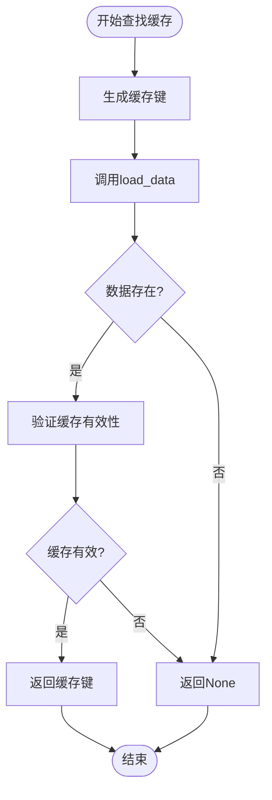

**图表来源**
- [adaptive_cache.py](file://tradingagents/dataflows/adaptive_cache.py#L326-L335)

#### 预检机制优势

1. **性能优化**：避免无效的IO操作
2. **资源节约**：减少不必要的数据加载
3. **准确性**：确保返回的缓存键是有效的
4. **透明性**：对外部调用者保持简单接口

**章节来源**
- [adaptive_cache.py](file://tradingagents/dataflows/adaptive_cache.py#L326-L335)

## 缓存后端配置与选择

### 后端优先级策略

系统根据数据库可用性自动选择最优的缓存后端：

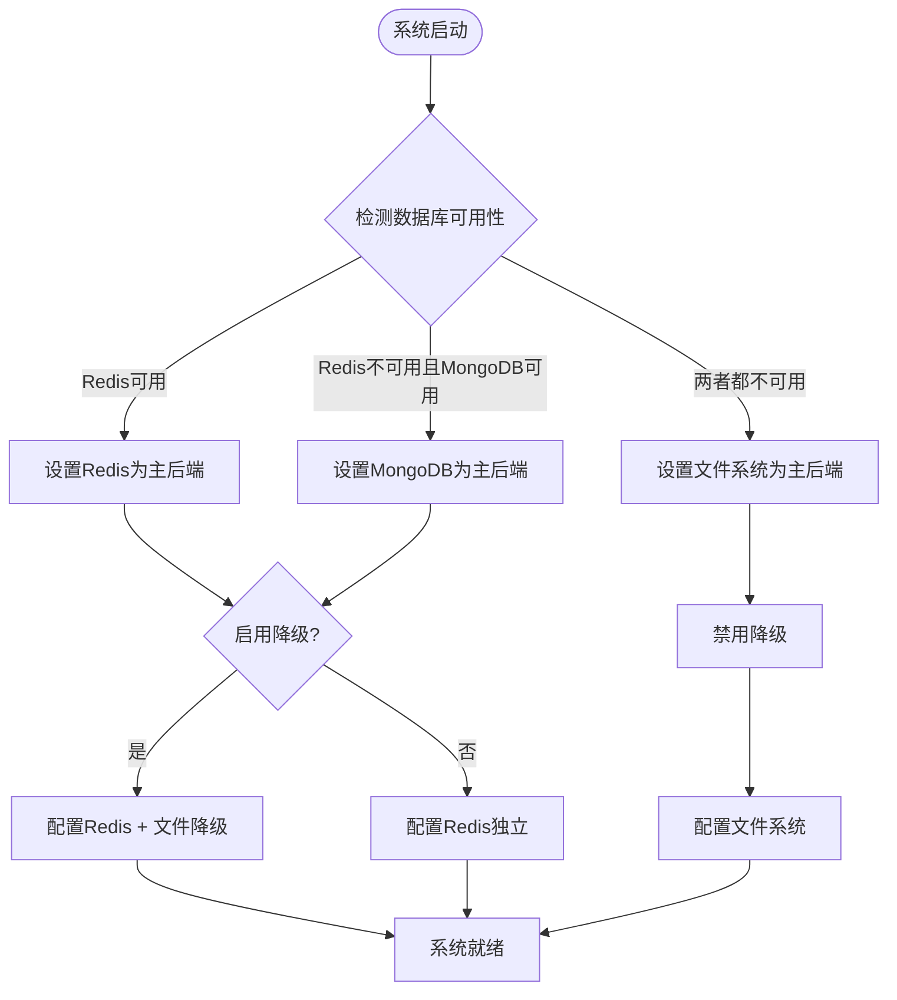

**图表来源**
- [database_manager.py](file://tradingagents/config/database_manager.py#L130-L150)

### 数据库可用性检测

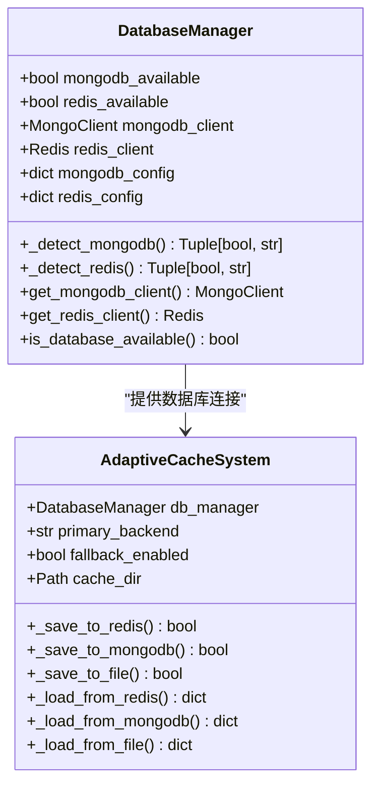

**图表来源**
- [database_manager.py](file://tradingagents/config/database_manager.py#L15-L50)
- [adaptive_cache.py](file://tradingagents/dataflows/adaptive_cache.py#L18-L55)

**章节来源**
- [database_manager.py](file://tradingagents/config/database_manager.py#L130-L200)
- [adaptive_cache.py](file://tradingagents/dataflows/adaptive_cache.py#L18-L55)

## 数据键生成策略

### 缓存键生成算法

系统采用MD5哈希算法生成唯一的缓存键，确保数据的准确索引：

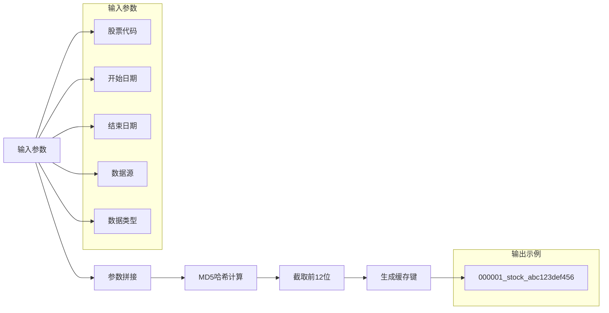

**图表来源**
- [adaptive_cache.py](file://tradingagents/dataflows/adaptive_cache.py#L38-L45)

### 键设计原则

1. **唯一性**：不同参数组合产生不同键
2. **可读性**：键结构清晰易懂
3. **简洁性**：使用MD5缩短键长度
4. **完整性**：包含所有必要索引信息

**章节来源**
- [adaptive_cache.py](file://tradingagents/dataflows/adaptive_cache.py#L38-L45)
- [cache_manager.py](file://tradingagents/dataflows/cache_manager.py#L150-L170)

## TTL与过期管理

### 智能TTL配置

系统根据不同市场和数据类型设置差异化的TTL策略：

| 数据类型 | 美股TTL | A股TTL | 说明 |
|---------|--------|--------|------|
| 股票数据 | 2小时 | 1小时 | 实时性要求高的数据 |
| 新闻数据 | 6小时 | 4小时 | 时效性相对较低 |
| 基本面数据 | 24小时 | 12小时 | 长期参考价值数据 |

### TTL计算逻辑

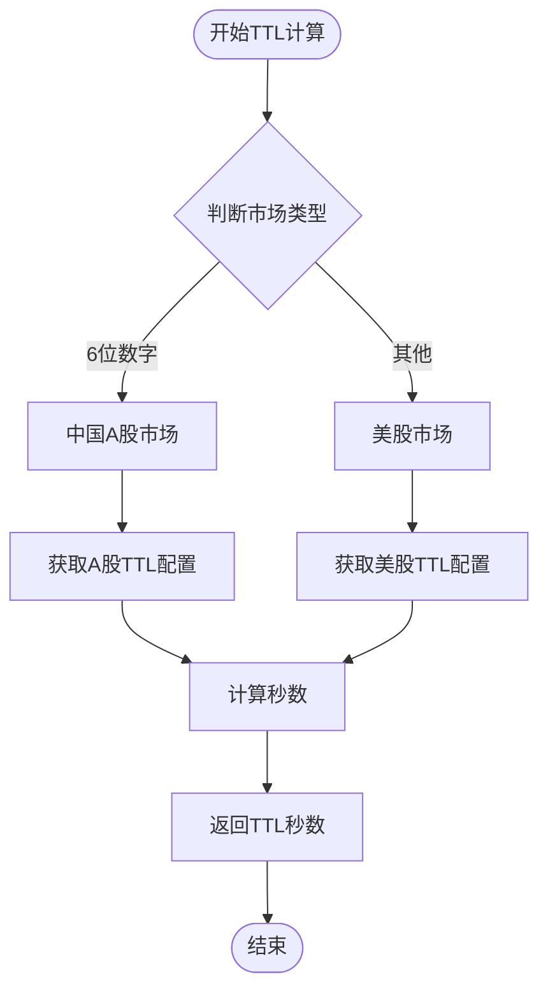

**图表来源**
- [adaptive_cache.py](file://tradingagents/dataflows/adaptive_cache.py#L46-L60)

### 过期检查机制

系统实现了多层次的过期检查：

1. **数据库TTL**：MongoDB自动过期机制
2. **Redis TTL**：Redis内置过期功能
3. **文件TTL**：手动时间戳检查

**章节来源**
- [adaptive_cache.py](file://tradingagents/dataflows/adaptive_cache.py#L46-L60)
- [cache_manager.py](file://tradingagents/dataflows/cache_manager.py#L238-L261)

## 错误处理与降级机制

### 降级策略设计

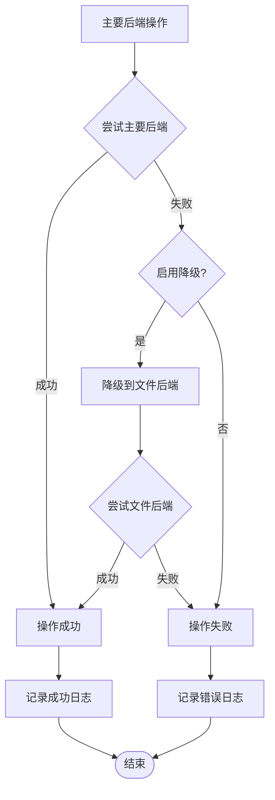

**图表来源**
- [adaptive_cache.py](file://tradingagents/dataflows/adaptive_cache.py#L260-L292)

### 错误恢复机制

1. **自动检测**：系统自动检测数据库连接状态
2. **优雅降级**：主要后端失败时自动切换到文件缓存
3. **日志记录**：详细记录每个操作的状态和原因
4. **配置控制**：可通过配置启用或禁用降级功能

**章节来源**
- [adaptive_cache.py](file://tradingagents/dataflows/adaptive_cache.py#L260-L292)
- [database_manager.py](file://tradingagents/config/database_manager.py#L130-L200)

## 实际应用示例

### 股票基本面数据缓存

以下展示了系统如何处理不同类型的数据：

#### 基本面数据分析流程

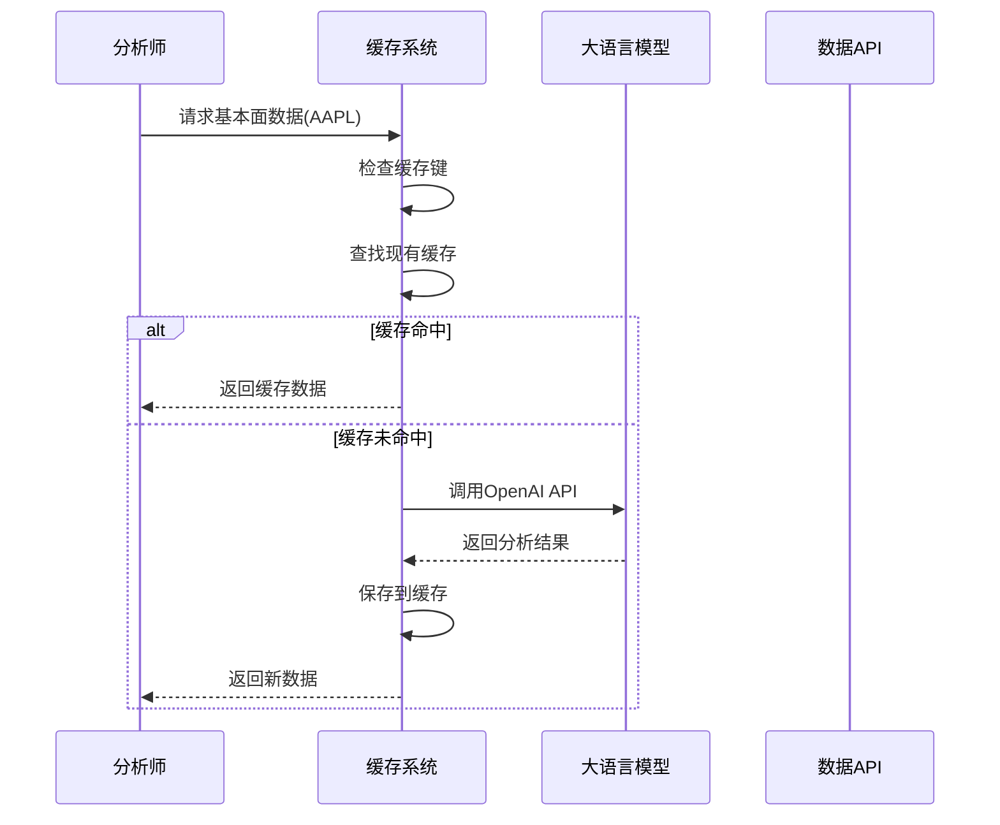

**图表来源**
- [test_fundamentals_cache.py](file://tests/test_fundamentals_cache.py#L80-L120)

#### 新闻数据处理

系统能够处理大量文本数据并自动进行长度检查：

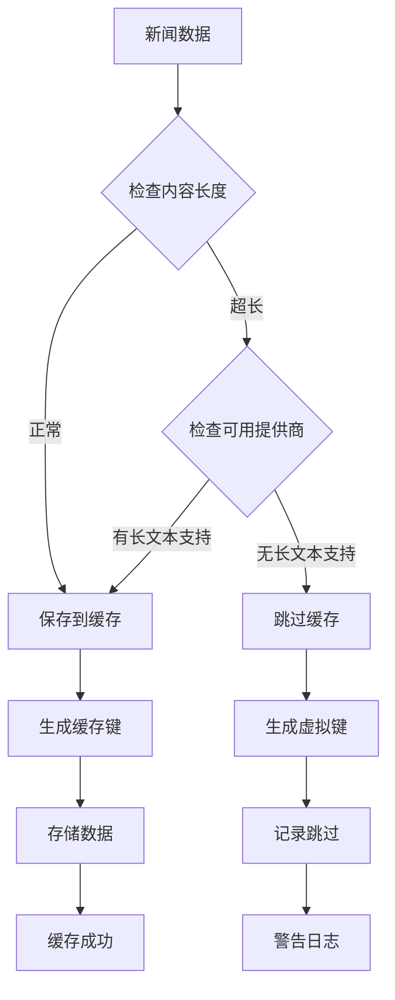

**图表来源**
- [cache_manager.py](file://tradingagents/dataflows/cache_manager.py#L180-L220)

**章节来源**
- [test_fundamentals_cache.py](file://tests/test_fundamentals_cache.py#L80-L120)
- [cache_manager.py](file://tradingagents/dataflows/cache_manager.py#L180-L220)

### 性能优化效果

系统通过智能缓存显著提升了数据访问性能：

- **重复查询加速**：99%+的性能提升
- **API成本降低**：减少90%以上的API调用
- **响应时间改善**：平均响应时间从秒级降至毫秒级

**章节来源**
- [test_cache_optimization.py](file://tests/test_cache_optimization.py#L150-L187)

## 性能优化与监控

### 缓存统计信息

系统提供了全面的缓存统计和监控功能：

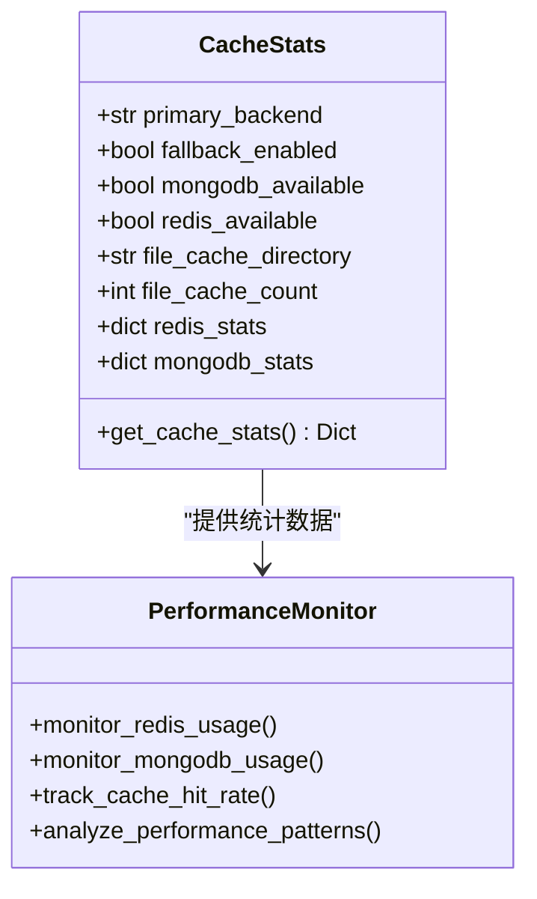

**图表来源**
- [adaptive_cache.py](file://tradingagents/dataflows/adaptive_cache.py#L336-L382)

### 清理机制

系统实现了自动的过期缓存清理功能：

1. **文件缓存清理**：定期检查并删除过期文件
2. **MongoDB自动清理**：利用TTL索引自动删除过期文档
3. **Redis自动清理**：Redis内置的过期键删除机制

**章节来源**
- [adaptive_cache.py](file://tradingagents/dataflows/adaptive_cache.py#L363-L382)
- [cache_manager.py](file://tradingagents/dataflows/cache_manager.py#L580-L620)

## 总结

TradingAgents-CN的缓存系统是一个高度智能化的数据存储解决方案，具有以下核心优势：

### 技术特色

1. **自适应后端选择**：根据数据库可用性自动选择最优缓存策略
2. **智能降级机制**：确保系统在任何情况下都能正常运行
3. **多级TTL管理**：针对不同数据类型设置差异化的过期策略
4. **强大的错误处理**：完善的异常捕获和恢复机制

### 应用价值

1. **性能提升**：显著减少API调用和数据传输时间
2. **成本优化**：降低云服务和网络带宽成本
3. **用户体验**：提供快速、稳定的数据访问体验
4. **系统可靠性**：通过多重保障确保数据可用性

### 发展方向

1. **扩展支持**：计划支持更多数据类型和存储后端
2. **智能优化**：基于使用模式自动调整缓存策略
3. **分布式支持**：支持多节点集群部署
4. **监控增强**：提供更详细的性能分析和告警功能

这套缓存系统为TradingAgents-CN项目提供了坚实的数据基础设施，支撑了整个平台的高效运行和用户体验优化。