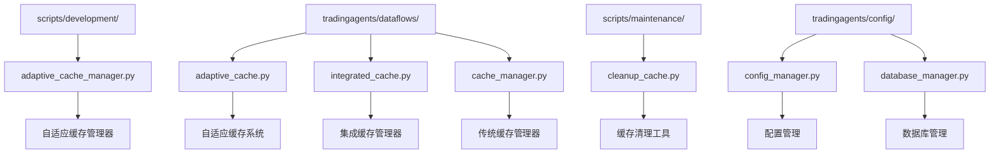
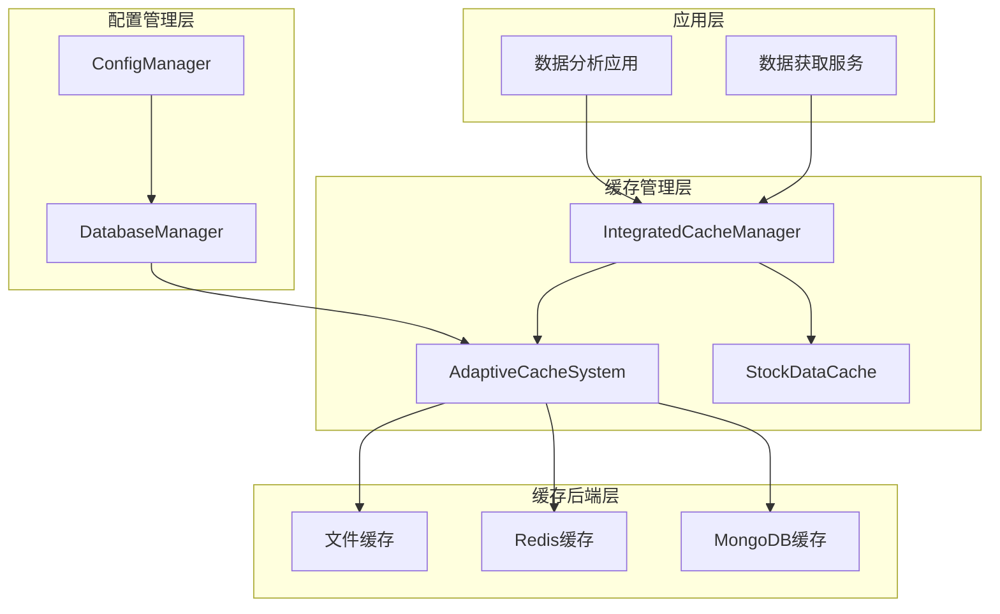
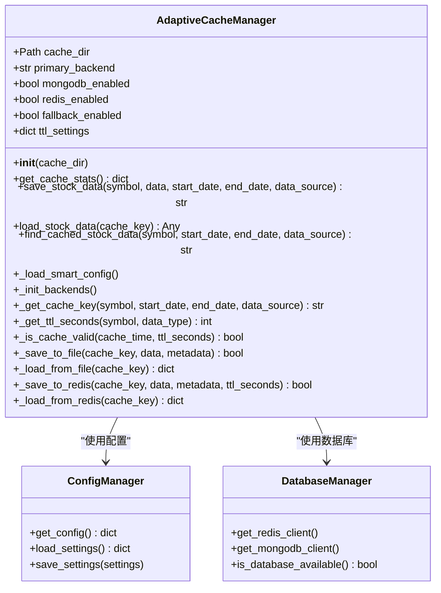
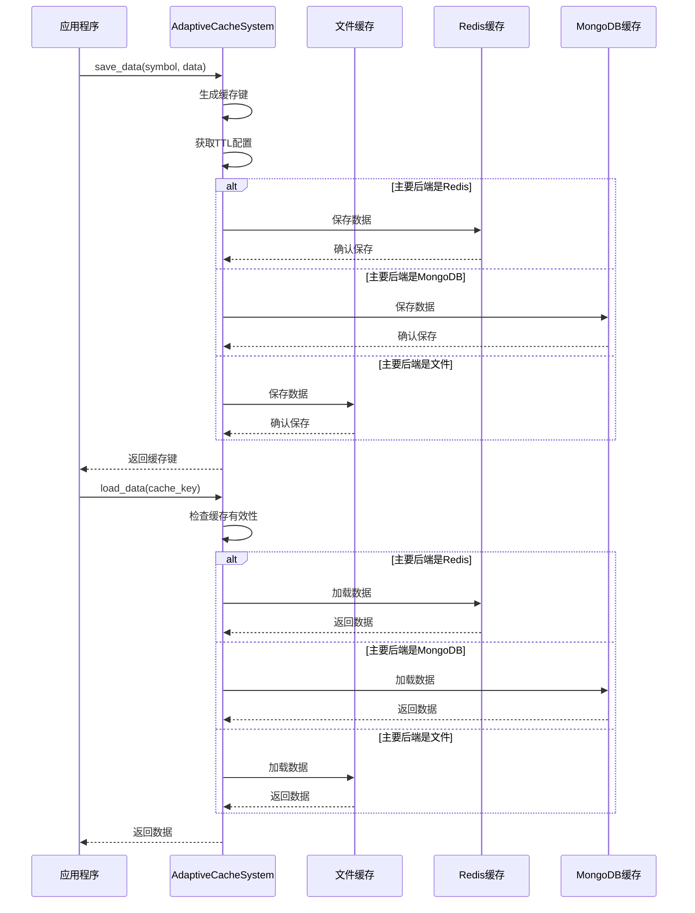
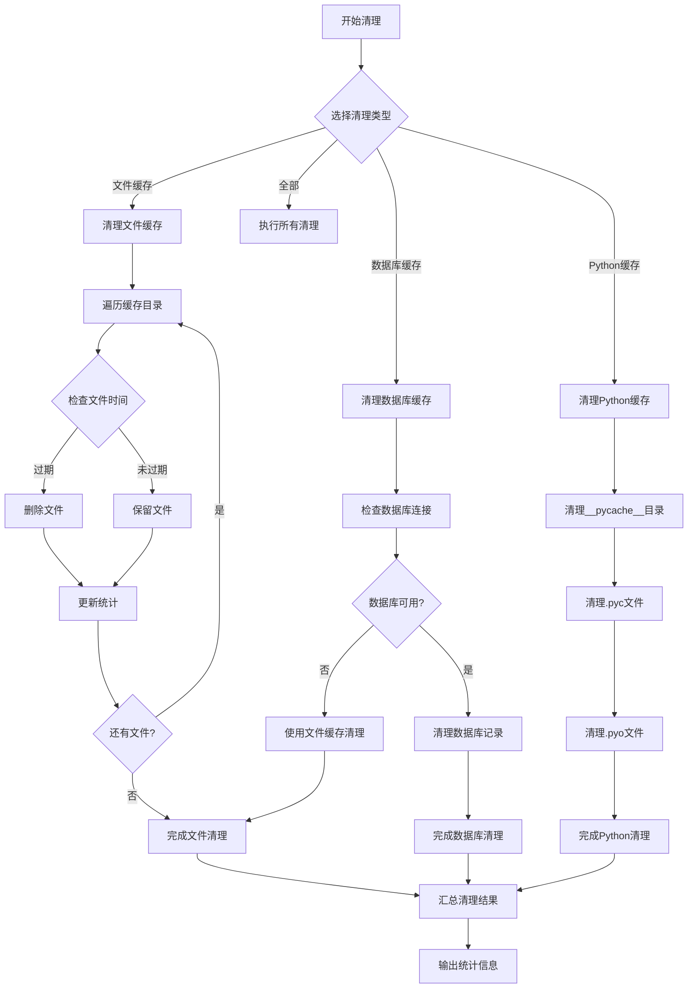

# 缓存管理工具

<cite>
**本文档中引用的文件**
- [adaptive_cache_manager.py](file://scripts/development/adaptive_cache_manager.py)
- [adaptive_cache.py](file://tradingagents/dataflows/adaptive_cache.py)
- [integrated_cache.py](file://tradingagents/dataflows/integrated_cache.py)
- [cache_manager.py](file://tradingagents/dataflows/cache_manager.py)
- [cleanup_cache.py](file://scripts/maintenance/cleanup_cache.py)
- [config_manager.py](file://tradingagents/config/config_manager.py)
- [database_manager.py](file://tradingagents/config/database_manager.py)
- [test_cache_optimization.py](file://tests/test_cache_optimization.py)
- [check_system_status.py](file://scripts/validation/check_system_status.py)
</cite>

## 目录
1. [简介](#简介)
2. [项目结构](#项目结构)
3. [核心组件](#核心组件)
4. [架构概览](#架构概览)
5. [详细组件分析](#详细组件分析)
6. [依赖关系分析](#依赖关系分析)
7. [性能考虑](#性能考虑)
8. [故障排除指南](#故障排除指南)
9. [结论](#结论)

## 简介

TradingAgents-CN项目提供了一套完整的缓存管理系统，旨在优化股票数据分析过程中的数据访问性能。该系统采用自适应缓存策略，能够根据可用的服务自动选择最佳的缓存后端，包括文件缓存、Redis缓存和MongoDB缓存。通过智能的TTL（生存时间）管理和自动清理机制，系统能够在保证数据新鲜度的同时最大化性能收益。

## 项目结构

缓存管理系统的核心文件分布在以下目录结构中：

**图表来源**
- [adaptive_cache_manager.py](file://scripts/development/adaptive_cache_manager.py#L1-L50)
- [adaptive_cache.py](file://tradingagents/dataflows/adaptive_cache.py#L1-L50)
- [integrated_cache.py](file://tradingagents/dataflows/integrated_cache.py#L1-L50)

**章节来源**
- [adaptive_cache_manager.py](file://scripts/development/adaptive_cache_manager.py#L1-L410)
- [adaptive_cache.py](file://tradingagents/dataflows/adaptive_cache.py#L1-L384)

## 核心组件

### 自适应缓存管理器 (AdaptiveCacheManager)

自适应缓存管理器是系统的核心组件，负责智能选择缓存后端并管理缓存操作。它支持三种主要的缓存后端：文件缓存、Redis缓存和MongoDB缓存，并具备自动降级机制。

### 缓存统计功能

系统提供了强大的缓存统计功能，通过`get_cache_stats()`方法可以获取详细的缓存状态信息，包括：
- 主要缓存后端类型
- 数据库连接健康度
- 文件缓存数量
- Redis内存使用情况
- MongoDB缓存记录数

### 过期缓存清理

系统实现了智能的过期缓存清理机制，能够自动识别和删除过期的缓存文件，确保磁盘空间的有效利用。

**章节来源**
- [adaptive_cache_manager.py](file://scripts/development/adaptive_cache_manager.py#L27-L100)
- [adaptive_cache.py](file://tradingagents/dataflows/adaptive_cache.py#L18-L80)

## 架构概览

缓存管理系统采用分层架构设计，支持多种缓存策略的智能切换：

**图表来源**
- [integrated_cache.py](file://tradingagents/dataflows/integrated_cache.py#L27-L63)
- [adaptive_cache.py](file://tradingagents/dataflows/adaptive_cache.py#L18-L55)

## 详细组件分析

### AdaptiveCacheManager 类分析

AdaptiveCacheManager 是自适应缓存管理器的核心类，提供了完整的缓存管理功能：

**图表来源**
- [adaptive_cache_manager.py](file://scripts/development/adaptive_cache_manager.py#L27-L100)
- [config_manager.py](file://tradingagents/config/config_manager.py#L100-L150)
- [database_manager.py](file://tradingagents/config/database_manager.py#L50-L100)

#### 核心功能实现

1. **智能配置加载**：自动检测可用的数据库服务并加载相应的配置
2. **多后端支持**：支持文件、Redis和MongoDB三种缓存后端
3. **自动降级机制**：当主要后端不可用时自动切换到备用方案
4. **TTL管理**：基于市场类型和数据类型的智能TTL配置

### AdaptiveCacheSystem 类分析

AdaptiveCacheSystem 提供了更高级的缓存功能，集成了数据库缓存和文件缓存：

**图表来源**
- [adaptive_cache.py](file://tradingagents/dataflows/adaptive_cache.py#L180-L250)
- [adaptive_cache.py](file://tradingagents/dataflows/adaptive_cache.py#L280-L350)

**章节来源**
- [adaptive_cache.py](file://tradingagents/dataflows/adaptive_cache.py#L18-L100)
- [adaptive_cache.py](file://tradingagents/dataflows/adaptive_cache.py#L180-L300)

### 缓存清理工具分析

cleanup_cache.py 提供了专门的缓存清理功能，支持多种清理策略：

**图表来源**
- [cleanup_cache.py](file://scripts/maintenance/cleanup_cache.py#L15-L80)
- [cleanup_cache.py](file://scripts/maintenance/cleanup_cache.py#L80-L150)

**章节来源**
- [cleanup_cache.py](file://scripts/maintenance/cleanup_cache.py#L15-L100)

## 依赖关系分析

缓存管理系统具有复杂的依赖关系网络：

```mermaid
graph TD
A[adaptive_cache_manager.py] --> B[smart_config]
A --> C[logging_manager]
A --> D[get_logger]
E[adaptive_cache.py] --> F[database_manager]
E --> G[get_database_manager]
E --> H[logging_manager]
I[integrated_cache.py] --> J[adaptive_cache.py]
I --> K[cache_manager.py]
I --> L[database_manager]
M[cache_manager.py] --> N[logging_manager]
M --> O[Path]
M --> P[hashlib]
Q[cleanup_cache.py] --> R[logging_manager]
Q --> S[Path]
Q --> T[datetime]
U[config_manager.py] --> V[database_manager]
U --> W[Path]
U --> X[json]
Y[database_manager.py] --> Z[pymongo]
Y --> AA[redis]
Y --> BB[get_logger]
```

**图表来源**
- [adaptive_cache_manager.py](file://scripts/development/adaptive_cache_manager.py#L1-L20)
- [adaptive_cache.py](file://tradingagents/dataflows/adaptive_cache.py#L1-L20)
- [integrated_cache.py](file://tradingagents/dataflows/integrated_cache.py#L1-L20)

**章节来源**
- [adaptive_cache_manager.py](file://scripts/development/adaptive_cache_manager.py#L1-L30)
- [adaptive_cache.py](file://tradingagents/dataflows/adaptive_cache.py#L1-L30)

## 性能考虑

### 缓存策略优化

系统采用了多层次的缓存策略来优化性能：

1. **市场区分缓存**：根据美股和A股的不同特点设置不同的TTL
2. **数据类型差异化**：不同类型的数据采用不同的缓存策略
3. **智能降级**：当主要缓存不可用时自动切换到备用方案
4. **自动清理**：定期清理过期缓存，避免磁盘空间浪费

### 性能监控指标

系统提供了丰富的性能监控指标：
- 缓存命中率
- 平均响应时间
- 缓存大小统计
- 各种后端的使用情况

### 配置优化建议

为了获得最佳性能，建议：
- 在生产环境中启用Redis或MongoDB缓存
- 根据实际需求调整TTL设置
- 定期监控缓存使用情况
- 设置合适的清理间隔

## 故障排除指南

### 常见问题及解决方案

1. **缓存后端连接失败**
   - 检查数据库服务是否正常运行
   - 验证网络连接和防火墙设置
   - 确认配置文件中的连接参数

2. **缓存清理失败**
   - 检查文件权限设置
   - 确认磁盘空间充足
   - 验证清理脚本的执行权限

3. **缓存统计信息不准确**
   - 检查日志级别设置
   - 验证缓存目录的可访问性
   - 确认相关配置文件的完整性

### 调试工具

系统提供了多个调试和诊断工具：
- `check_system_status.py`：检查系统状态和配置
- `cleanup_cache.py`：清理过期缓存
- 日志系统：提供详细的运行时信息

**章节来源**
- [check_system_status.py](file://scripts/validation/check_system_status.py#L99-L131)
- [cleanup_cache.py](file://scripts/maintenance/cleanup_cache.py#L150-L178)

## 结论

TradingAgents-CN的缓存管理系统提供了一个完整、灵活且高性能的解决方案，能够满足不同规模和需求的应用场景。通过自适应的缓存策略、智能的降级机制和完善的监控体系，系统能够在保证数据质量的同时最大化性能收益。

### 主要优势

1. **自适应性强**：能够根据可用资源自动选择最佳缓存策略
2. **性能优异**：支持多种缓存后端，提供卓越的读取性能
3. **易于维护**：提供完整的监控和清理工具
4. **扩展性好**：支持新的缓存后端和数据类型

### 发展方向

未来的发展重点包括：
- 支持更多的缓存后端
- 优化缓存算法和策略
- 增强监控和分析功能
- 提供更灵活的配置选项

通过持续的优化和改进，该缓存管理系统将继续为TradingAgents-CN项目提供强有力的支持，帮助用户获得更好的数据分析体验。