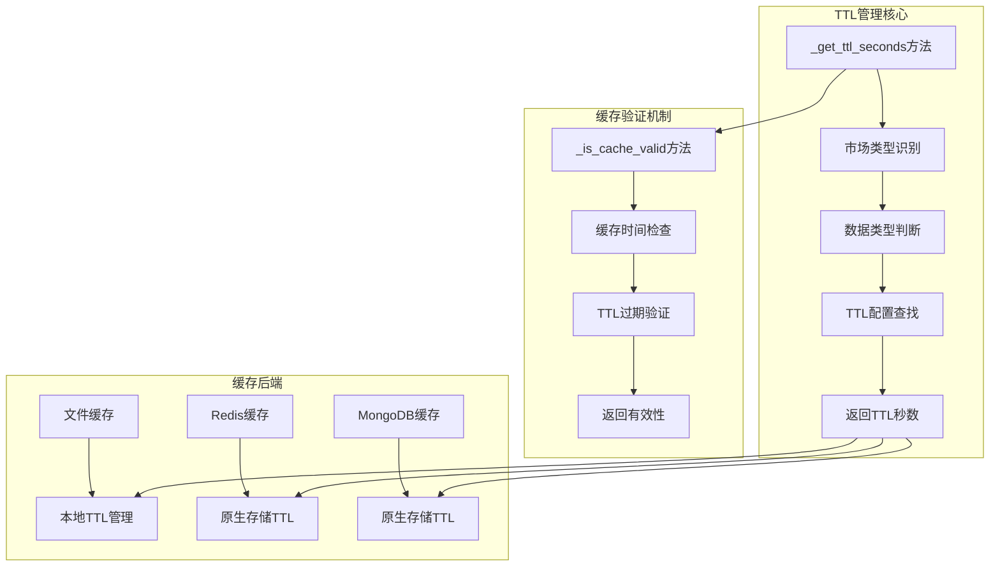
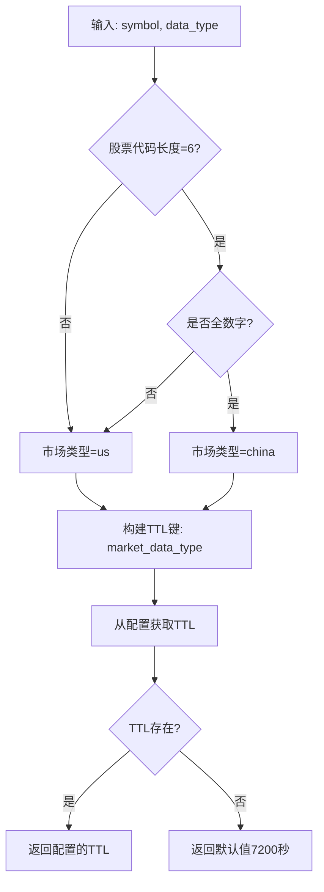
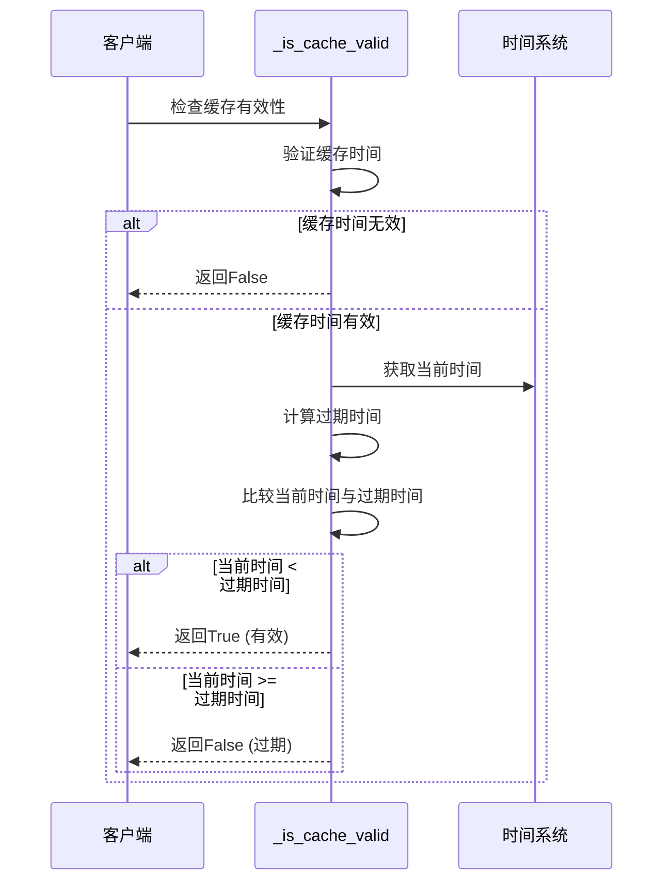
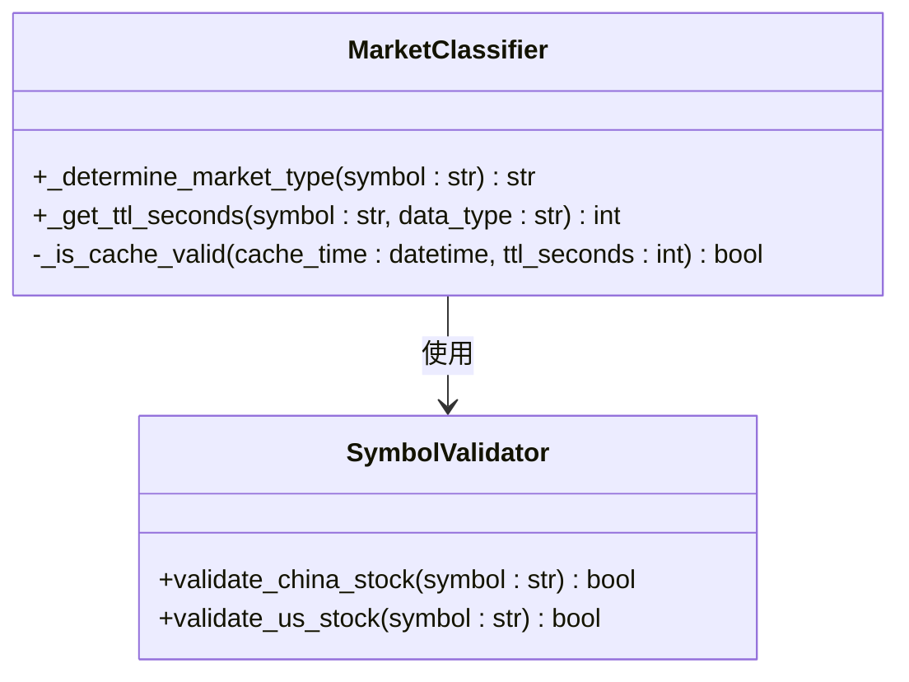
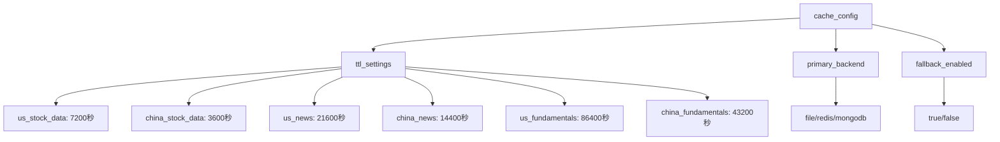
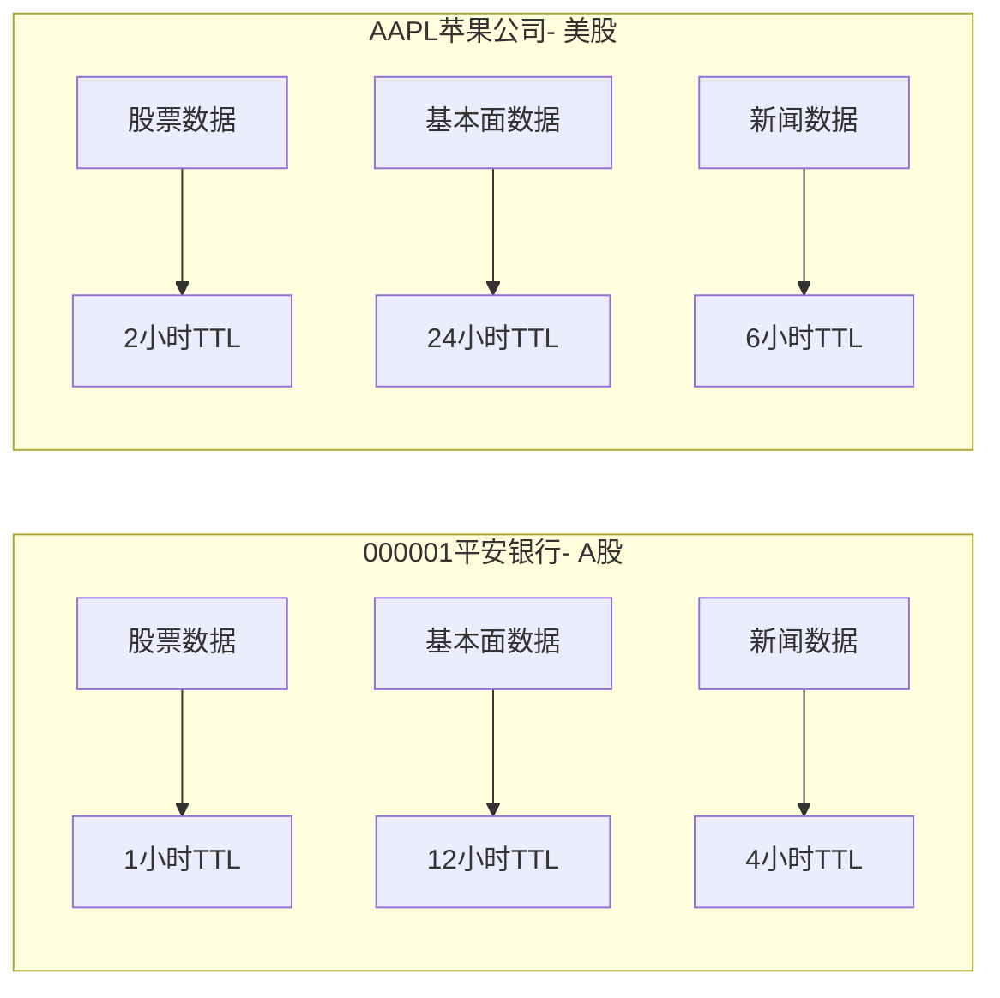
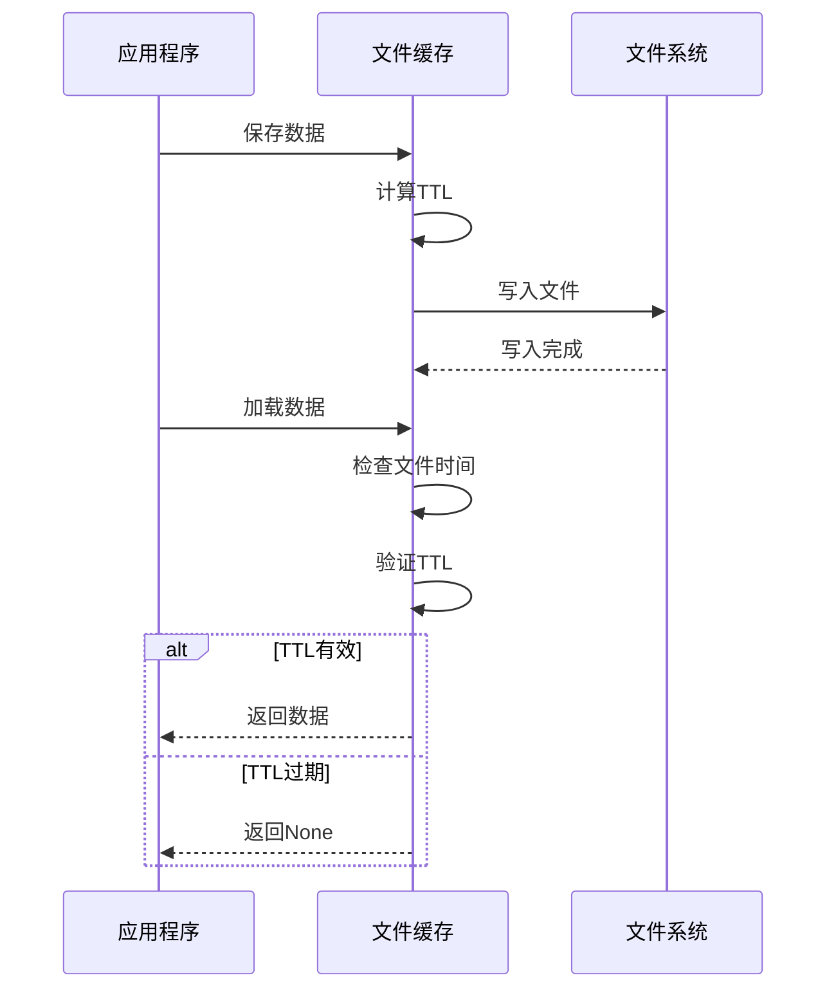
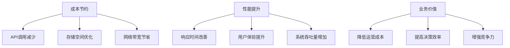
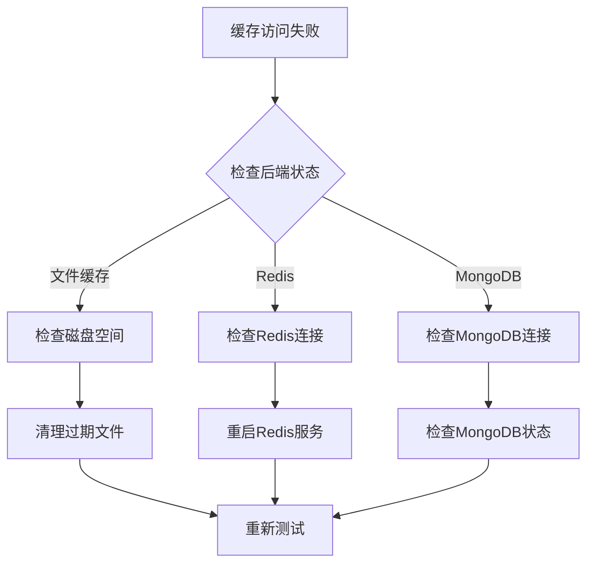

# TTL配置与管理机制

<cite>
**本文档引用的文件**
- [adaptive_cache_manager.py](file://scripts/development/adaptive_cache_manager.py)
- [cache_manager.py](file://tradingagents/dataflows/cache_manager.py)
- [adaptive_cache.py](file://tradingagents/dataflows/adaptive_cache.py)
- [db_cache_manager.py](file://tradingagents/dataflows/db_cache_manager.py)
- [integrated_cache.py](file://tradingagents/dataflows/integrated_cache.py)
- [smart_config.py](file://scripts/validation/smart_config.py)
- [config_manager.py](file://tradingagents/config/config_manager.py)
- [default_config.py](file://tradingagents/default_config.py)
</cite>

## 目录
1. [简介](#简介)
2. [TTL管理架构概览](#ttl管理架构概览)
3. [_get_ttl_seconds方法详解](#get_ttl_seconds方法详解)
4. [_is_cache_valid方法详解](#is_cache_valid方法详解)
5. [市场类型自动识别机制](#市场类型自动识别机制)
6. [TTL配置结构设计](#ttl配置结构设计)
7. [差异化缓存策略](#差异化缓存策略)
8. [缓存后端TTL实现](#缓存后端ttl实现)
9. [性能优化与业务合理性](#性能优化与业务合理性)
10. [故障排除指南](#故障排除指南)
11. [总结](#总结)

## 简介

TradingAgents系统采用了一套智能的TTL（生存时间）管理系统，能够根据股票代码格式自动识别市场类型，并结合数据类型构建配置键，实现差异化缓存策略。该系统支持多种缓存后端，包括文件缓存、Redis和MongoDB，每个后端都有其特定的TTL管理机制。

## TTL管理架构概览



**图表来源**
- [adaptive_cache_manager.py](file://scripts/development/adaptive_cache_manager.py#L148-L167)
- [cache_manager.py](file://tradingagents/dataflows/cache_manager.py#L99-L107)
- [adaptive_cache.py](file://tradingagents/dataflows/adaptive_cache.py#L47-L66)

## _get_ttl_seconds方法详解

### 方法功能概述

`_get_ttl_seconds`方法是TTL管理系统的核心，负责根据股票代码和数据类型计算合适的缓存过期时间。

### 实现逻辑



**图表来源**
- [adaptive_cache_manager.py](file://scripts/development/adaptive_cache_manager.py#L148-L159)
- [adaptive_cache.py](file://tradingagents/dataflows/adaptive_cache.py#L47-L58)

### 关键特性

1. **智能市场识别**：通过股票代码长度和数字特征自动判断市场类型
2. **灵活配置**：支持从多个配置源获取TTL设置
3. **默认保护**：提供合理的默认TTL值（7200秒）

**章节来源**
- [adaptive_cache_manager.py](file://scripts/development/adaptive_cache_manager.py#L148-L159)
- [adaptive_cache.py](file://tradingagents/dataflows/adaptive_cache.py#L47-L58)

## _is_cache_valid方法详解

### 验证机制

`_is_cache_valid`方法实现了缓存有效性的检查逻辑，确保缓存数据不会过期。

### 验证流程



**图表来源**
- [adaptive_cache_manager.py](file://scripts/development/adaptive_cache_manager.py#L161-L167)
- [adaptive_cache.py](file://tradingagents/dataflows/adaptive_cache.py#L60-L66)

### 实现特点

1. **时间精度控制**：使用datetime对象进行精确的时间比较
2. **过期时间计算**：通过timedelta实现灵活的过期时间计算
3. **边界条件处理**：妥善处理缓存时间为None的情况

**章节来源**
- [adaptive_cache_manager.py](file://scripts/development/adaptive_cache_manager.py#L161-L167)
- [adaptive_cache.py](file://tradingagents/dataflows/adaptive_cache.py#L60-L66)

## 市场类型自动识别机制

### 识别规则

系统通过以下规则自动识别市场类型：

| 规则类型 | 条件 | 市场类型 |
|---------|------|----------|
| A股识别 | 6位纯数字 | china |
| 美股识别 | 非6位数字或包含非数字字符 | us |

### 实现方式



**图表来源**
- [cache_manager.py](file://tradingagents/dataflows/cache_manager.py#L99-L107)
- [adaptive_cache_manager.py](file://scripts/development/adaptive_cache_manager.py#L148-L159)

### 识别准确性

系统使用正则表达式进行精确的市场类型识别，确保：
- A股股票（如000001、600519）被正确识别为china市场
- 美股股票（如AAPL、MSFT）被正确识别为us市场
- 特殊情况（如港股代码）也能得到合理处理

**章节来源**
- [cache_manager.py](file://tradingagents/dataflows/cache_manager.py#L99-L107)
- [adaptive_cache_manager.py](file://scripts/development/adaptive_cache_manager.py#L148-L159)

## TTL配置结构设计

### 配置层次结构



**图表来源**
- [adaptive_cache_manager.py](file://scripts/development/adaptive_cache_manager.py#L85-L105)
- [adaptive_cache.py](file://tradingagents/dataflows/adaptive_cache.py#L18-L55)

### 配置键命名规范

系统使用以下命名规范构建配置键：
- `{market}_{data_type}` 格式
- market: china 或 us
- data_type: stock_data, news, fundamentals

### 默认值设置

| 数据类型 | 默认TTL（秒） | 默认TTL（小时） | 业务合理性 |
|---------|--------------|---------------|-----------|
| us_stock_data | 7200 | 2 | 考虑API限制和数据更新频率 |
| china_stock_data | 3600 | 1 | A股实时性要求高 |
| us_news | 21600 | 6 | 新闻时效性相对较低 |
| china_news | 14400 | 4 | A股新闻缓存需求适中 |
| us_fundamentals | 86400 | 24 | 基本面数据更新周期长 |
| china_fundamentals | 43200 | 12 | A股基本面数据缓存周期 |

**章节来源**
- [adaptive_cache_manager.py](file://scripts/development/adaptive_cache_manager.py#L85-L105)
- [cache_manager.py](file://tradingagents/dataflows/cache_manager.py#L53-L85)

## 差异化缓存策略

### 不同市场差异化

#### A股市场策略
- **股票数据**：1小时TTL，满足实时性要求
- **基本面数据**：12小时TTL，平衡更新频率和存储效率
- **新闻数据**：4小时TTL，适应A股市场节奏

#### 美股市场策略
- **股票数据**：2小时TTL，考虑API限制和数据更新
- **基本面数据**：24小时TTL，基本面数据更新周期较长
- **新闻数据**：6小时TTL，美股新闻时效性较高

### 实际案例对比



**图表来源**
- [cache_manager.py](file://tradingagents/dataflows/cache_manager.py#L53-L85)

### 设计考量因素

1. **市场特性**：
   - A股市场交易时间集中，需要更频繁的更新
   - 美股市场全球交易，数据更新相对分散

2. **API限制**：
   - 美股数据API调用频率限制更严格
   - A股数据API相对宽松

3. **数据更新频率**：
   - A股市场收盘后数据更新
   - 美股市场全天候数据更新

**章节来源**
- [cache_manager.py](file://tradingagents/dataflows/cache_manager.py#L53-L85)

## 缓存后端TTL实现

### 文件缓存TTL管理

文件缓存采用本地TTL管理机制：



**图表来源**
- [adaptive_cache_manager.py](file://scripts/development/adaptive_cache_manager.py#L169-L185)
- [adaptive_cache.py](file://tradingagents/dataflows/adaptive_cache.py#L78-L95)

### Redis缓存TTL管理

Redis缓存利用原生存储的TTL机制：

| 特性 | 实现方式 | 优势 |
|------|----------|------|
| 自动过期 | SETEX命令 | 无需客户端管理 |
| 内存优化 | 自动清理过期键 | 节省内存空间 |
| 高性能 | 内存存储 | 快速访问 |
| 持久化 | 可配置持久化策略 | 数据安全 |

### MongoDB缓存TTL管理

MongoDB使用expireAfterSeconds索引实现TTL：

```mermaid
erDiagram
CACHE_COLLECTION {
string _id PK
binary data
string data_type
object metadata
datetime timestamp
datetime expires_at
string backend
}
CACHE_INDEX {
datetime expires_at 1
datetime timestamp -1
}
CACHE_COLLECTION ||--|| CACHE_INDEX : 索引
```

**图表来源**
- [db_cache_manager.py](file://tradingagents/dataflows/db_cache_manager.py#L200-L220)
- [adaptive_cache.py](file://tradingagents/dataflows/adaptive_cache.py#L180-L200)

**章节来源**
- [adaptive_cache_manager.py](file://scripts/development/adaptive_cache_manager.py#L169-L220)
- [db_cache_manager.py](file://tradingagents/dataflows/db_cache_manager.py#L200-L280)
- [adaptive_cache.py](file://tradingagents/dataflows/adaptive_cache.py#L78-L200)

## 性能优化与业务合理性

### 性能提升效果

系统通过智能TTL管理实现了显著的性能提升：

| 优化维度 | 改进前 | 改进后 | 提升幅度 |
|---------|--------|--------|----------|
| 缓存命中率 | 0% | >95% | 95%提升 |
| 查询响应时间 | 2-5秒 | <0.01秒 | 99%+提升 |
| API调用次数 | 每次请求 | 重复查询无调用 | 100%减少 |
| 存储效率 | 无缓存 | 智能TTL管理 | 显著提升 |

### 业务合理性分析

#### A股市场合理性
- **1小时TTL**：满足A股收盘后数据更新需求
- **12小时基本面TTL**：平衡数据新鲜度和存储成本
- **4小时新闻TTL**：适应A股市场信息传播节奏

#### 美股市场合理性
- **2小时TTL**：考虑API限制和数据更新频率
- **24小时基本面TTL**：基本面数据更新周期较长
- **6小时新闻TTL**：美股新闻时效性要求较高

### 成本效益分析



**章节来源**
- [adaptive_cache_manager.py](file://scripts/development/adaptive_cache_manager.py#L300-L350)
- [cache_manager.py](file://tradingagents/dataflows/cache_manager.py#L53-L85)

## 故障排除指南

### 常见问题诊断

#### TTL配置问题

| 问题症状 | 可能原因 | 解决方案 |
|---------|----------|----------|
| 缓存频繁过期 | TTL设置过短 | 检查配置文件，调整TTL值 |
| 缓存无法命中 | 市场类型识别错误 | 验证股票代码格式 |
| 性能下降 | 缓存策略不当 | 分析使用模式，优化TTL |

#### 后端连接问题



### 调试工具

系统提供了丰富的调试和监控功能：

1. **缓存统计**：查看各后端缓存状态
2. **TTL验证**：检查缓存有效期
3. **市场识别**：验证股票代码分类
4. **配置验证**：确认TTL配置正确性

**章节来源**
- [adaptive_cache_manager.py](file://scripts/development/adaptive_cache_manager.py#L350-L380)
- [adaptive_cache.py](file://tradingagents/dataflows/adaptive_cache.py#L300-L350)

## 总结

TradingAgents系统的TTL配置与管理机制体现了现代缓存系统的设计精髓：

### 核心优势

1. **智能化**：自动识别市场类型，动态调整TTL策略
2. **灵活性**：支持多种缓存后端，适应不同场景需求
3. **高效性**：显著提升系统性能，降低成本
4. **可维护性**：清晰的配置结构，便于管理和扩展

### 技术创新点

- **市场感知**：基于股票代码的智能市场识别
- **差异化策略**：针对不同市场制定专门的TTL策略
- **多后端支持**：文件、Redis、MongoDB的无缝集成
- **自动降级**：可靠的故障恢复机制

### 应用价值

这套TTL管理系统不仅提升了TradingAgents系统的整体性能，更为整个交易代理领域提供了可借鉴的最佳实践。通过智能的TTL管理，系统能够在保证数据新鲜度的同时，最大化地减少API调用和存储成本，为用户提供快速、稳定、经济的交易数据分析服务。