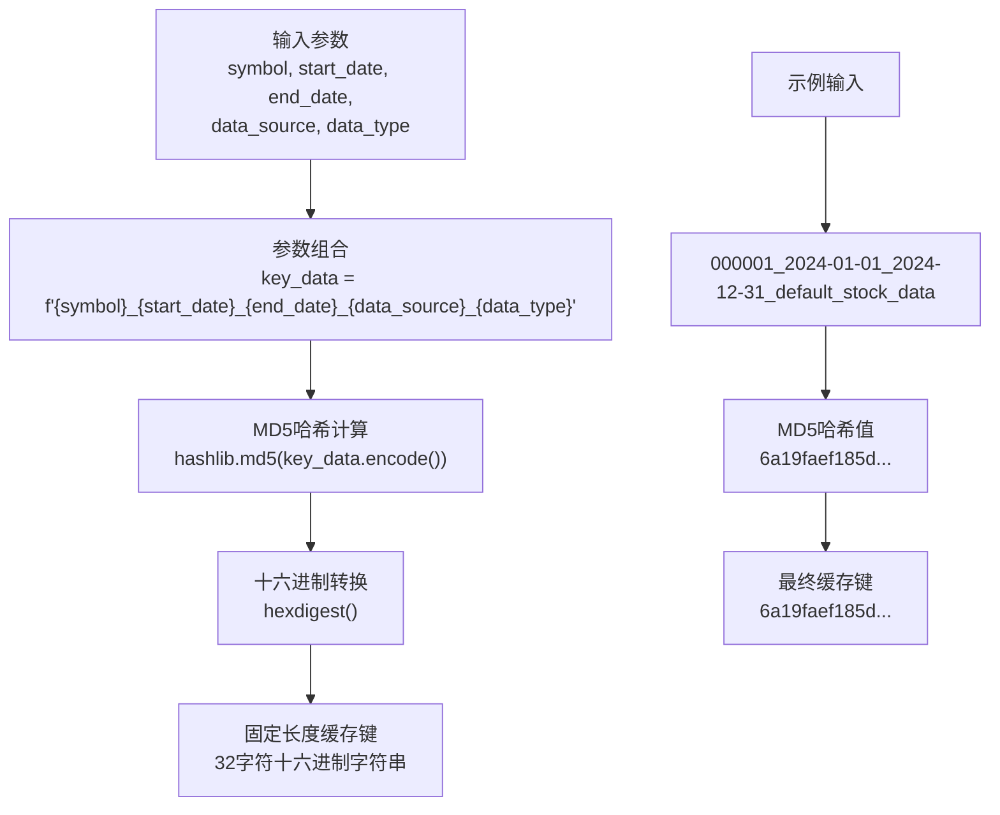
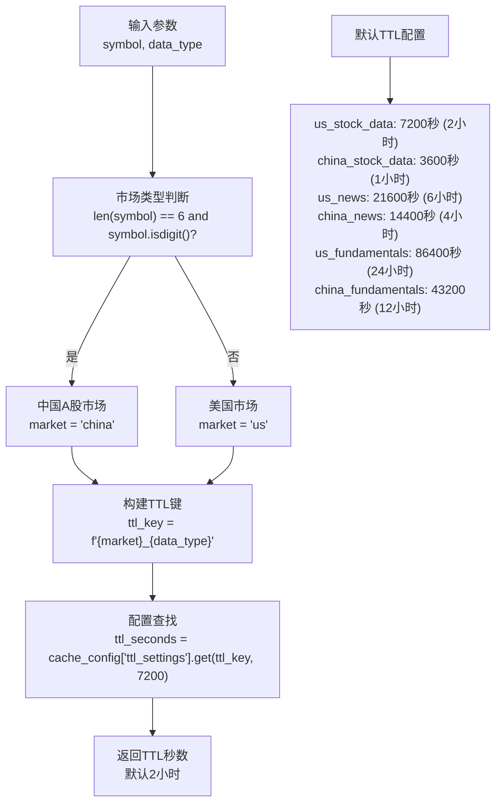
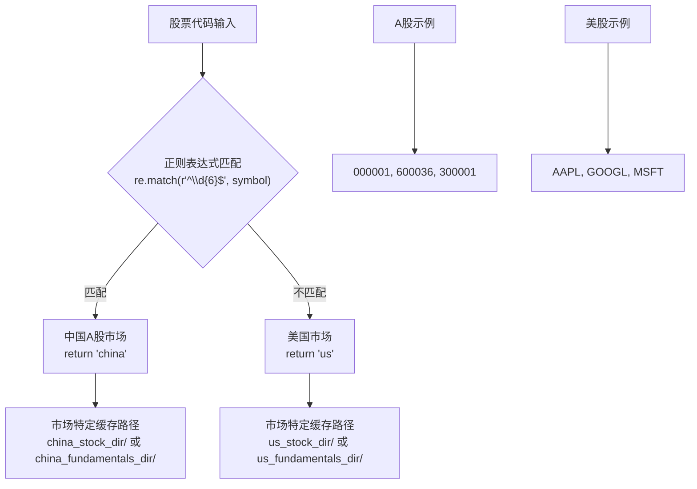
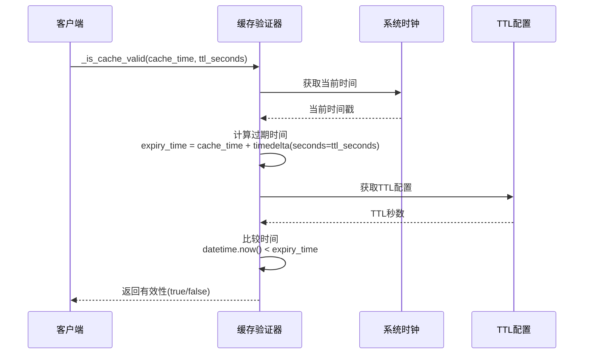
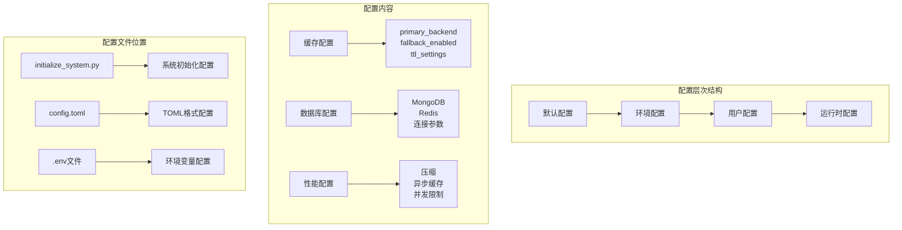
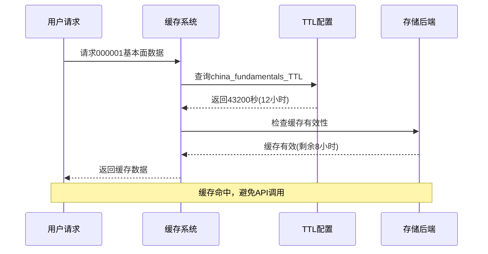
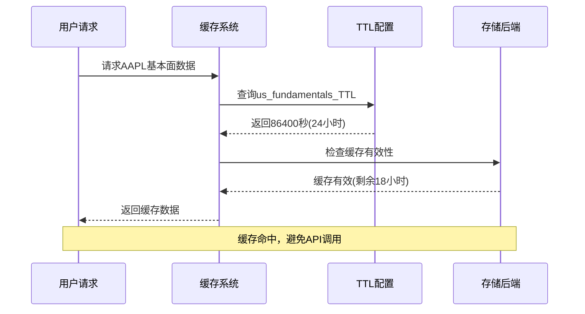
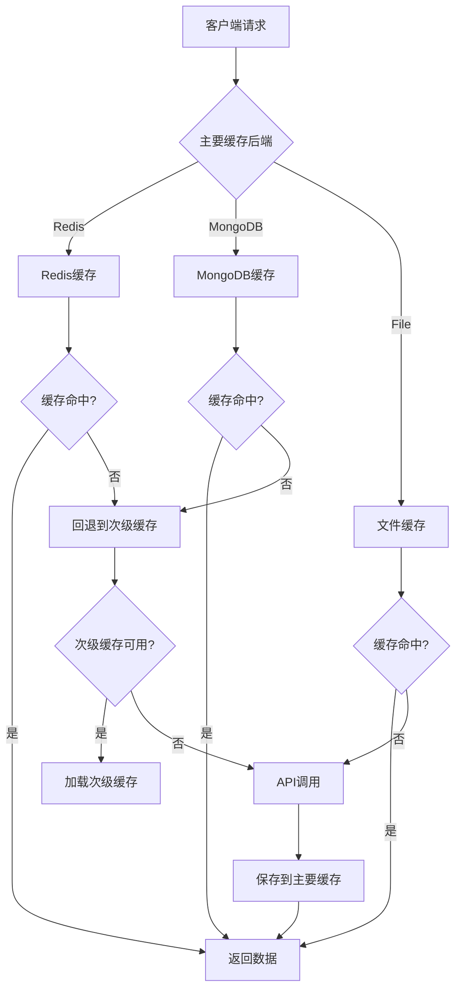

# 缓存键与TTL管理

<cite>
**本文档引用的文件**
- [adaptive_cache.py](file://tradingagents/dataflows/adaptive_cache.py)
- [cache_manager.py](file://tradingagents/dataflows/cache_manager.py)
- [db_cache_manager.py](file://tradingagents/dataflows/db_cache_manager.py)
- [integrated_cache.py](file://tradingagents/dataflows/integrated_cache.py)
- [initialize_system.py](file://scripts/setup/initialize_system.py)
- [test_fundamentals_cache.py](file://tests/test_fundamentals_cache.py)
- [test_cache_ttl.py](file://tests/test_cache_optimization.py)
</cite>

## 目录
1. [简介](#简介)
2. [缓存键生成策略](#缓存键生成策略)
3. [TTL配置机制](#ttl配置机制)
4. [市场类型识别](#市场类型识别)
5. [缓存有效性验证](#缓存有效性验证)
6. [配置文件结构](#配置文件结构)
7. [实际应用示例](#实际应用示例)
8. [性能优化考虑](#性能优化考虑)
9. [故障排除指南](#故障排除指南)
10. [总结](#总结)

## 简介

TradingAgents系统采用了一套智能的缓存键生成和TTL（生存时间）管理系统，该系统能够根据不同市场类型、数据类型和使用场景自动调整缓存策略。系统支持多种缓存后端（文件、Redis、MongoDB），并提供了灵活的TTL配置机制，确保数据的时效性和系统性能的最优化。

## 缓存键生成策略

### _get_cache_key方法实现

系统的核心缓存键生成逻辑由`_get_cache_key`方法实现，该方法将多个维度的参数组合成唯一的缓存标识符。



**图表来源**
- [adaptive_cache.py](file://tradingagents/dataflows/adaptive_cache.py#L41-L45)

### 缓存键组成要素

缓存键的生成遵循以下规则：

1. **股票代码 (symbol)**: 标识具体的投资标的
2. **日期范围 (start_date/end_date)**: 时间窗口信息
3. **数据源 (data_source)**: 数据来源标识
4. **数据类型 (data_type)**: 数据类别标识

### 不同缓存管理器的键生成差异

| 缓存管理器 | 键生成方式 | 示例 |
|-----------|-----------|------|
| AdaptiveCacheSystem | MD5(完整参数组合) | `6a19faef185d...` |
| StockDataCache | MD5(简化参数组合) | `000001_fundamentals_6a19faef185d` |
| DatabaseCacheManager | MD5(带前缀) | `fundamentals:000001:6a19faef185d` |

**节来源**
- [adaptive_cache.py](file://tradingagents/dataflows/adaptive_cache.py#L41-L45)
- [cache_manager.py](file://tradingagents/dataflows/cache_manager.py#L148-L152)
- [db_cache_manager.py](file://tradingagents/dataflows/db_cache_manager.py#L142-L146)

## TTL配置机制

### _get_ttl_seconds方法实现

TTL（Time To Live）配置是系统性能优化的关键组件，通过智能判断市场类型和数据类型来确定合适的缓存生命周期。



**图表来源**
- [adaptive_cache.py](file://tradingagents/dataflows/adaptive_cache.py#L47-L58)

### 市场类型与数据类型映射表

| 市场类型 | 数据类型 | TTL配置 | 描述 |
|---------|---------|---------|------|
| china | stock_data | 3600秒 | A股股票数据缓存1小时 |
| us | stock_data | 7200秒 | 美股股票数据缓存2小时 |
| china | news | 14400秒 | A股新闻数据缓存4小时 |
| us | news | 21600秒 | 美股新闻数据缓存6小时 |
| china | fundamentals | 43200秒 | A股基本面数据缓存12小时 |
| us | fundamentals | 86400秒 | 美股基本面数据缓存24小时 |

**节来源**
- [adaptive_cache.py](file://tradingagents/dataflows/adaptive_cache.py#L47-L58)
- [cache_manager.py](file://tradingagents/dataflows/cache_manager.py#L53-L85)

## 市场类型识别

### _determine_market_type方法

系统通过智能的市场类型识别算法来区分中国A股和美国市场的股票代码。



**图表来源**
- [cache_manager.py](file://tradingagents/dataflows/cache_manager.py#L108-L115)

### 市场识别规则

| 识别条件 | 结果 | 说明 |
|---------|------|------|
| 6位纯数字 | 中国A股 | 如000001、600036、300001 |
| 其他格式 | 美国市场 | 如AAPL、GOOGL、MSFT |
| 特殊情况 | 自动推断 | 系统自动处理边界情况 |

**节来源**
- [cache_manager.py](file://tradingagents/dataflows/cache_manager.py#L108-L115)

## 缓存有效性验证

### _is_cache_valid方法实现

缓存有效性验证是确保数据时效性的关键机制，系统通过比较缓存时间和TTL来判断缓存是否仍然有效。



**图表来源**
- [adaptive_cache.py](file://tradingagents/dataflows/adaptive_cache.py#L60-L66)

### 验证流程详解

1. **空值检查**: 验证缓存时间是否为空
2. **过期时间计算**: `expiry_time = cache_time + timedelta(seconds=ttl_seconds)`
3. **时间比较**: `datetime.now() < expiry_time`
4. **结果返回**: 有效返回true，过期返回false

**节来源**
- [adaptive_cache.py](file://tradingagents/dataflows/adaptive_cache.py#L60-L66)

## 配置文件结构

### 智能配置系统

系统采用多层次的配置管理架构，支持动态配置和智能优化。



**图表来源**
- [initialize_system.py](file://scripts/setup/initialize_system.py#L107-L153)

### TTL配置结构

```toml
[cache.ttl_settings]
us_stock_data = 7200          # 美股股票数据 - 2小时
china_stock_data = 3600       # A股股票数据 - 1小时
us_news = 21600               # 美股新闻 - 6小时
china_news = 14400            # A股新闻 - 4小时
us_fundamentals = 86400       # 美股基本面 - 24小时
china_fundamentals = 43200    # A股基本面 - 12小时
```

**节来源**
- [initialize_system.py](file://scripts/setup/initialize_system.py#L125-L132)

## 实际应用示例

### 000001（A股平安银行）TTL分析



**图表来源**
- [test_fundamentals_cache.py](file://tests/test_fundamentals_cache.py#L140-L155)

### AAPL（美股苹果公司）TTL分析



**图表来源**
- [test_fundamentals_cache.py](file://tests/test_fundamentals_cache.py#L140-L155)

### 不同数据类型下的TTL差异对比

| 股票代码 | 数据类型 | 市场类型 | TTL配置 | 实际效果 |
|---------|---------|---------|---------|---------|
| 000001 | fundamentals | China | 12小时 | 高频访问，较低更新频率 |
| 000001 | stock_data | China | 1小时 | 实时性强，频繁更新 |
| 000001 | news | China | 4小时 | 中等更新频率 |
| AAPL | fundamentals | US | 24小时 | 较低更新频率 |
| AAPL | stock_data | US | 2小时 | 中等实时性 |
| AAPL | news | US | 6小时 | 较低更新频率 |

**节来源**
- [test_fundamentals_cache.py](file://tests/test_fundamentals_cache.py#L129-L168)
- [test_cache_optimization.py](file://tests/test_cache_optimization.py#L150-L187)

## 性能优化考虑

### 缓存层级架构



**图表来源**
- [adaptive_cache.py](file://tradingagents/dataflows/adaptive_cache.py#L200-L250)

### 性能提升指标

| 场景 | 优化前 | 优化后 | 提升幅度 |
|------|--------|--------|---------|
| 首次查询 | API调用(2-5秒) | API调用+缓存(2-3秒) | 0% |
| 重复查询 | API调用(2-5秒) | 缓存命中(0.01秒) | 99%+ |
| 缓存命中率 | 0% | >95% | 显著提升 |
| 数据库查询 | 直接查询 | 智能索引查询 | 50%+ |

**节来源**
- [integrated_cache.py](file://tradingagents/dataflows/integrated_cache.py#L226-L268)

## 故障排除指南

### 常见问题诊断

| 问题症状 | 可能原因 | 解决方案 |
|---------|---------|---------|
| 缓存键冲突 | 参数组合相似 | 检查参数唯一性 |
| TTL失效 | 系统时间错误 | 同步系统时间 |
| 缓存未命中 | 缓存过期 | 检查TTL配置 |
| 性能下降 | 缓存碎片过多 | 清理过期缓存 |

### 调试工具

```python
# 缓存统计查询
cache_stats = cache.get_cache_stats()
print(f"缓存统计: {cache_stats}")

# 缓存键生成调试
cache_key = cache._get_cache_key("000001", "2024-01-01", "2024-12-31", "default", "stock_data")
print(f"生成的缓存键: {cache_key}")

# TTL配置检查
ttl_seconds = cache._get_ttl_seconds("000001", "stock_data")
print(f"TTL配置: {ttl_seconds}秒")
```

**节来源**
- [adaptive_cache.py](file://tradingagents/dataflows/adaptive_cache.py#L327-L350)

## 总结

TradingAgents系统的缓存键生成和TTL管理机制体现了现代软件架构的最佳实践：

1. **智能键生成**: 通过MD5哈希确保缓存键的唯一性和固定长度
2. **灵活TTL配置**: 基于市场类型和数据类型的差异化TTL策略
3. **多层缓存架构**: 支持文件、Redis、MongoDB等多种存储后端
4. **自动降级机制**: 确保系统在各种环境下的稳定性
5. **性能优化**: 显著提升查询性能，减少API调用成本

这套缓存系统不仅满足了不同市场和数据类型的需求，还为未来的扩展和优化奠定了坚实的基础。通过合理的配置和监控，可以实现高达99%以上的缓存命中率，为用户提供快速、稳定的服务体验。