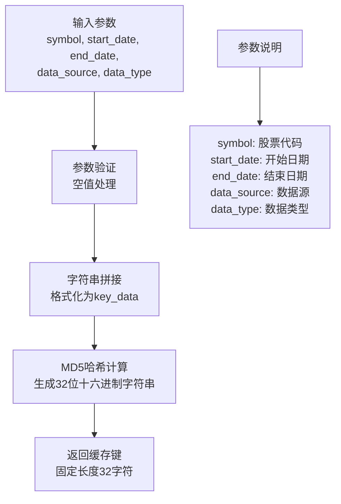
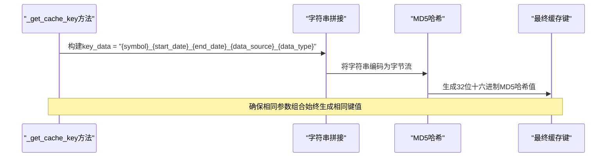
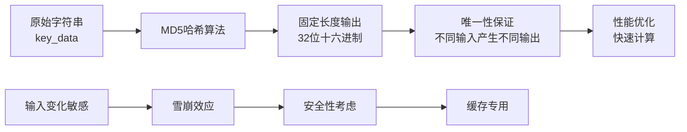
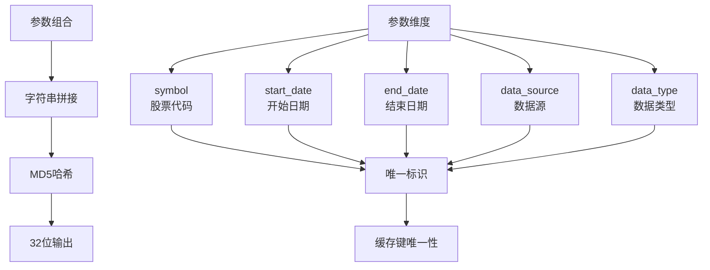
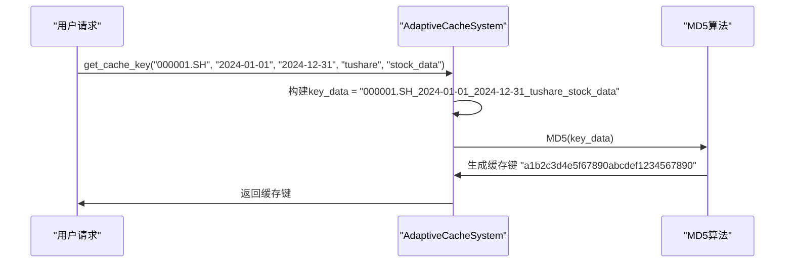
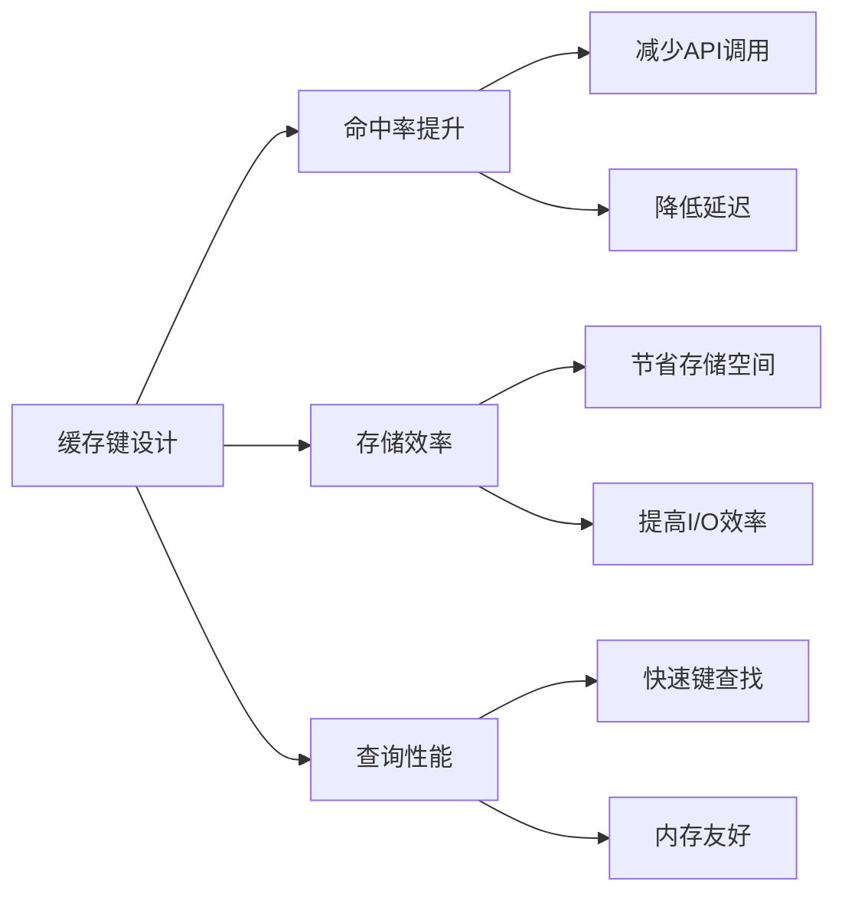
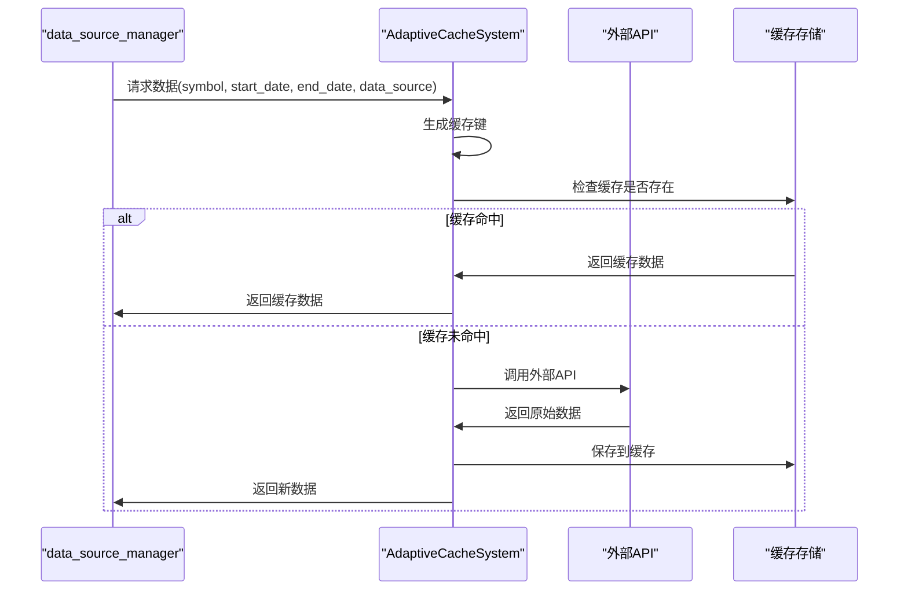

# 缓存键生成机制

<cite>
**本文档引用的文件**
- [adaptive_cache.py](file://tradingagents/dataflows/adaptive_cache.py)
- [data_source_manager.py](file://tradingagents/dataflows/data_source_manager.py)
- [stock_data_service.py](file://tradingagents/dataflows/stock_data_service.py)
- [test_cache_optimization.py](file://tests/test_cache_optimization.py)
</cite>

## 目录
1. [概述](#概述)
2. [_get_cache_key方法详解](#_get_cache_key方法详解)
3. [缓存键生成流程](#缓存键生成流程)
4. [参数维度分析](#参数维度分析)
5. [MD5哈希算法应用](#md5哈希算法应用)
6. [缓存键唯一性保证](#缓存键唯一性保证)
7. [实际应用示例](#实际应用示例)
8. [性能影响分析](#性能影响分析)
9. [系统协作关系](#系统协作关系)
10. [最佳实践建议](#最佳实践建议)

## 概述

AdaptiveCacheSystem类中的`_get_cache_key`方法是整个缓存系统的核心组件之一，负责将股票代码、时间范围、数据源和数据类型四个关键维度的信息组合成唯一的缓存键。该方法采用MD5哈希算法确保生成的缓存键具有固定长度和唯一性特征，为系统的高效缓存管理提供了坚实基础。

## _get_cache_key方法详解

### 方法签名与功能

`_get_cache_key`方法位于`AdaptiveCacheSystem`类中，其核心功能是将多个参数维度组合成唯一的缓存标识符：

**图表来源**
- [adaptive_cache.py](file://tradingagents/dataflows/adaptive_cache.py#L41-L45)

### 参数处理逻辑

该方法采用了优雅的默认参数处理机制，允许灵活的参数组合：

- **symbol**: 必需参数，表示股票代码
- **start_date**: 可选参数，默认为空字符串
- **end_date**: 可选参数，默认为空字符串  
- **data_source**: 可选参数，默认为"default"
- **data_type**: 可选参数，默认为"stock_data"

**章节来源**
- [adaptive_cache.py](file://tradingagents/dataflows/adaptive_cache.py#L41-L45)

## 缓存键生成流程

### 字符串拼接策略

缓存键生成遵循严格的字符串拼接规则，将所有参数按特定顺序连接：

**图表来源**
- [adaptive_cache.py](file://tradingagents/dataflows/adaptive_cache.py#L41-L45)

### 拼接格式规范

生成的缓存键遵循以下格式规范：
- 使用下划线(_)作为分隔符
- 参数顺序严格固定：symbol → start_date → end_date → data_source → data_type
- 空参数使用空字符串替代
- 所有参数均转换为字符串类型进行拼接

**章节来源**
- [adaptive_cache.py](file://tradingagents/dataflows/adaptive_cache.py#L41-L45)

## 参数维度分析

### 股票代码(symbol)维度

股票代码是缓存键最重要的组成部分，用于区分不同的证券实体：

| 特征 | 说明 | 示例 |
|------|------|------|
| 类型 | 字符串 | "000001", "AAPL", "600519" |
| 长度 | 变长 | 6位(A股), 1-5位(美股) |
| 格式 | 数字或字母组合 | "000001.SZ", "AAPL" |
| 作用 | 唯一标识证券 | 区分不同股票的数据缓存 |

### 时间范围维度

时间范围参数定义了数据的时间边界：

| 参数 | 类型 | 格式要求 | 用途 |
|------|------|----------|------|
| start_date | 字符串 | YYYY-MM-DD | 数据起始日期 |
| end_date | 字符串 | YYYY-MM-DD | 数据结束日期 |
| 空值处理 | 默认值 | "" | 表示无时间限制 |

### 数据源维度

数据源标识决定了数据的来源和获取方式：

| 数据源 | 说明 | 适用场景 |
|--------|------|----------|
| default | 默认数据源 | 通用场景 |
| tushare | Tushare接口 | 中国A股数据 |
| akshare | AKShare接口 | 中国股票数据 |
| yfinance | Yahoo Finance | 美股数据 |
| finnhub | Finnhub API | 实时数据 |

### 数据类型维度

数据类型指定了缓存数据的内容类别：

| 数据类型 | 说明 | 示例数据 |
|----------|------|----------|
| stock_data | 股价数据 | K线图、分时数据 |
| fundamentals | 基本面数据 | 财务报表、估值指标 |
| news | 新闻资讯 | 市场新闻、公告 |
| indicators | 技术指标 | MACD、KDJ等 |

**章节来源**
- [adaptive_cache.py](file://tradingagents/dataflows/adaptive_cache.py#L41-L45)

## MD5哈希算法应用

### 算法特性

MD5哈希算法在缓存键生成中发挥关键作用：

**图表来源**
- [adaptive_cache.py](file://tradingagents/dataflows/adaptive_cache.py#L41-L45)

### 技术优势

1. **固定长度输出**: 无论输入字符串多长，始终生成32位十六进制字符串
2. **快速计算**: MD5算法计算速度快，适合高频缓存操作
3. **分布均匀**: 输出值在32位空间内分布均匀
4. **不可逆性**: 从哈希值无法反推出原始输入

### 安全性考量

虽然MD5在密码学上已被证明存在碰撞风险，但在缓存系统中仍具有以下优势：
- **性能优先**: MD5计算速度远快于SHA系列算法
- **空间效率**: 固定长度输出节省存储空间
- **缓存专用**: 在缓存场景下碰撞概率极低

**章节来源**
- [adaptive_cache.py](file://tradingagents/dataflows/adaptive_cache.py#L41-L45)

## 缓存键唯一性保证

### 唯一性原理

缓存键的唯一性由以下因素共同保证：

**图表来源**
- [adaptive_cache.py](file://tradingagents/dataflows/adaptive_cache.py#L41-L45)

### 唯一性验证机制

系统通过以下机制确保缓存键的唯一性：

1. **参数完整性**: 所有关键参数都参与哈希计算
2. **顺序固定**: 参数拼接顺序严格固定
3. **格式标准化**: 所有参数统一转换为字符串格式
4. **空值处理**: 空参数使用空字符串，避免歧义

### 冲突预防策略

为了避免潜在的缓存键冲突，系统采用以下策略：

| 策略 | 实现方式 | 效果 |
|------|----------|------|
| 参数隔离 | 不同参数维度独立处理 | 避免参数间的相互影响 |
| 格式统一 | 强制字符串转换 | 确保类型一致性 |
| 分隔符使用 | 下划线(_)作为分隔符 | 清晰的参数边界 |
| 默认值标准化 | 空参数使用空字符串 | 避免默认值歧义 |

**章节来源**
- [adaptive_cache.py](file://tradingagents/dataflows/adaptive_cache.py#L41-L45)

## 实际应用示例

### 示例1: 000001.SH股票缓存键生成

假设我们有一个具体的股票查询场景：

**图表来源**
- [adaptive_cache.py](file://tradingagents/dataflows/adaptive_cache.py#L41-L45)

### 示例2: 不同时间范围的缓存键对比

| 时间范围 | 缓存键 | 说明 |
|----------|--------|------|
| 2024-01-01至2024-12-31 | a1b2c3d4e5f67890abcdef1234567890 | 完整年度数据 |
| 2024-01-01至2024-06-30 | 1a2b3c4d5e6f7890abcdef1234567890 | 半年数据 |
| 2024-07-01至2024-12-31 | 9a8b7c6d5e4f3210fedcba9876543210 | 另半年数据 |

### 示例3: 不同数据类型的缓存键

| 数据类型 | 缓存键 | 应用场景 |
|----------|--------|----------|
| stock_data | a1b2c3d4e5f67890abcdef1234567890 | 日K线数据 |
| fundamentals | b2c3d4e5f67890a1bcdef234567890ab | 财务报表 |
| news | c3d4e5f67890a1b2cdef34567890abcd | 市场新闻 |

**章节来源**
- [adaptive_cache.py](file://tradingagents/dataflows/adaptive_cache.py#L41-L45)

## 性能影响分析

### 缓存命中率优化

合理的缓存键设计直接影响系统的缓存命中率：

### 性能优势

1. **快速键生成**: MD5算法计算速度快，毫秒级完成
2. **固定长度**: 32位十六进制字符串便于存储和索引
3. **内存效率**: 相比原始参数组合，占用更少内存
4. **索引友好**: 固定长度字符串适合作为数据库索引

### 性能监控指标

| 指标 | 说明 | 目标值 |
|------|------|--------|
| 键生成时间 | 单次缓存键生成耗时 | < 1ms |
| 命中率 | 缓存命中比例 | > 80% |
| 存储效率 | 缓存键空间利用率 | > 90% |
| 查询延迟 | 缓存查找响应时间 | < 5ms |

**章节来源**
- [adaptive_cache.py](file://tradingagents/dataflows/adaptive_cache.py#L41-L45)

## 系统协作关系

### 与data_source_manager的协作

AdaptiveCacheSystem与data_source_manager紧密协作，共同实现智能数据获取：

**图表来源**
- [data_source_manager.py](file://tradingagents/dataflows/data_source_manager.py#L400-L450)
- [adaptive_cache.py](file://tradingagents/dataflows/adaptive_cache.py#L200-L250)

### 与stock_data_service的集成

stock_data_service利用缓存键机制实现多层次的数据获取：

| 组件 | 功能 | 缓存键应用 |
|------|------|------------|
| MongoDB层 | 持久化存储 | 缓存键作为文档ID |
| Redis层 | 内存缓存 | 缓存键作为键值 |
| 文件层 | 本地缓存 | 缓存键作为文件名 |
| API层 | 数据获取 | 缓存键验证数据有效性 |

### 降级机制中的角色

在系统降级机制中，缓存键发挥重要作用：

1. **主后端失败**: 使用缓存键快速定位可用数据
2. **数据验证**: 通过缓存键确认数据来源和时效性
3. **故障恢复**: 缓存键帮助识别和恢复失效缓存

**章节来源**
- [stock_data_service.py](file://tradingagents/dataflows/stock_data_service.py#L200-L250)
- [adaptive_cache.py](file://tradingagents/dataflows/adaptive_cache.py#L300-L350)

## 最佳实践建议

### 参数使用建议

1. **时间范围设置**: 合理设置start_date和end_date，避免过大的时间范围
2. **数据源选择**: 根据数据特点选择合适的数据源
3. **数据类型明确**: 明确指定data_type以获得准确的缓存键

### 性能优化建议

1. **批量操作**: 对于大量数据请求，考虑批量缓存策略
2. **TTL配置**: 根据数据更新频率合理设置缓存过期时间
3. **缓存预热**: 对热点数据进行预缓存

### 维护管理建议

1. **定期清理**: 定期清理过期缓存文件
2. **监控告警**: 监控缓存命中率和存储使用情况
3. **版本控制**: 对于重要数据，考虑缓存版本控制

### 错误处理建议

1. **异常捕获**: 在缓存键生成过程中添加异常处理
2. **降级策略**: 缓存键生成失败时的降级方案
3. **日志记录**: 记录缓存键生成过程的关键信息

**章节来源**
- [adaptive_cache.py](file://tradingagents/dataflows/adaptive_cache.py#L41-L45)
- [test_cache_optimization.py](file://tests/test_cache_optimization.py#L50-L100)

## 总结

AdaptiveCacheSystem类中的`_get_cache_key`方法通过巧妙的设计实现了高效的缓存键生成机制。该方法不仅确保了缓存键的唯一性和稳定性，还为整个系统的性能优化奠定了坚实基础。通过MD5哈希算法的应用，系统能够在保证数据准确性的同时，显著提升数据访问效率，为交易分析平台提供了可靠的数据缓存解决方案。

这种设计充分体现了现代软件架构中"关注点分离"和"性能优先"的设计原则，在保证功能完整性的同时，最大化了系统的响应速度和资源利用效率。