# 健康检查与故障转移

<cite>
**本文档中引用的文件**
- [database_manager.py](file://tradingagents/config/database_manager.py)
- [adaptive_cache.py](file://tradingagents/dataflows/adaptive_cache.py)
- [integrated_cache.py](file://tradingagents/dataflows/integrated_cache.py)
- [check_system_status.py](file://scripts/validation/check_system_status.py)
- [demo_fallback_system.py](file://tests/demo_fallback_system.py)
- [test_fallback_mechanism.py](file://tests/test_fallback_mechanism.py)
- [database_config.py](file://tradingagents/config/database_config.py)
- [env_utils.py](file://tradingagents/config/env_utils.py)
</cite>

## 目录
1. [简介](#简介)
2. [系统架构概述](#系统架构概述)
3. [健康检查机制](#健康检查机制)
4. [故障转移策略](#故障转移策略)
5. [缓存统计与监控](#缓存统计与监控)
6. [实际故障场景演示](#实际故障场景演示)
7. [监控与告警建议](#监控与告警建议)
8. [故障排除指南](#故障排除指南)
9. [总结](#总结)

## 简介

TradingAgents系统采用了一套完善的自适应缓存健康检查与故障转移机制，确保在各种数据库服务不可用的情况下仍能维持系统的稳定运行。该系统通过DatabaseManager类实时检测后端服务健康状态，并在主要后端（如Redis）不可用时自动触发降级到文件缓存的故障转移策略。

## 系统架构概述

系统采用多层次的缓存架构，支持多种后端存储：

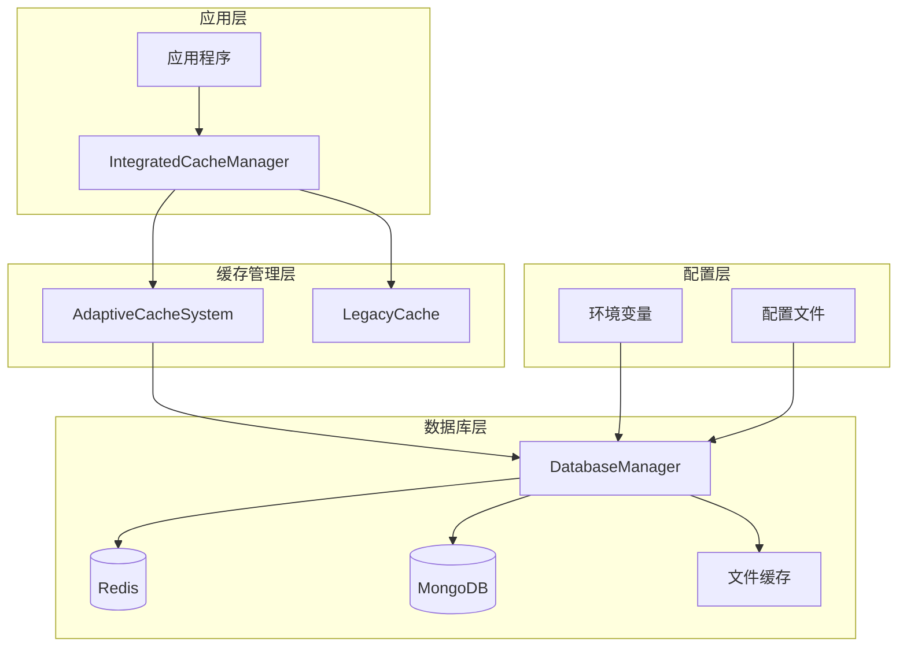

**图表来源**
- [integrated_cache.py](file://tradingagents/dataflows/integrated_cache.py#L20-L50)
- [adaptive_cache.py](file://tradingagents/dataflows/adaptive_cache.py#L20-L50)
- [database_manager.py](file://tradingagents/config/database_manager.py#L12-L30)

## 健康检查机制

### DatabaseManager的健康检查方法

系统通过DatabaseManager类提供实时的数据库健康检查功能：

#### is_redis_available方法
该方法用于检查Redis服务的可用性：

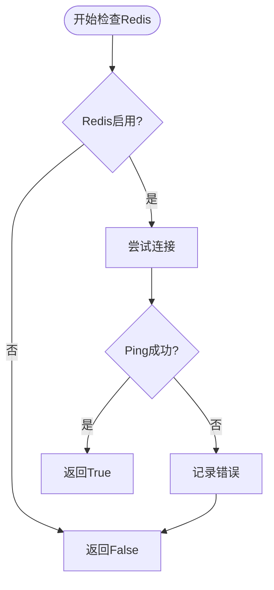

**图表来源**
- [database_manager.py](file://tradingagents/config/database_manager.py#L119-L151)

#### is_mongodb_available方法
MongoDB健康检查采用类似的机制：

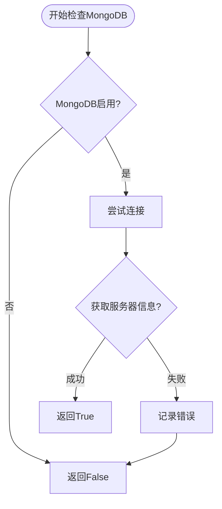

**图表来源**
- [database_manager.py](file://tradingagents/config/database_manager.py#L80-L117)

#### 自动检测机制

DatabaseManager在初始化时会自动检测所有可用的数据库服务：

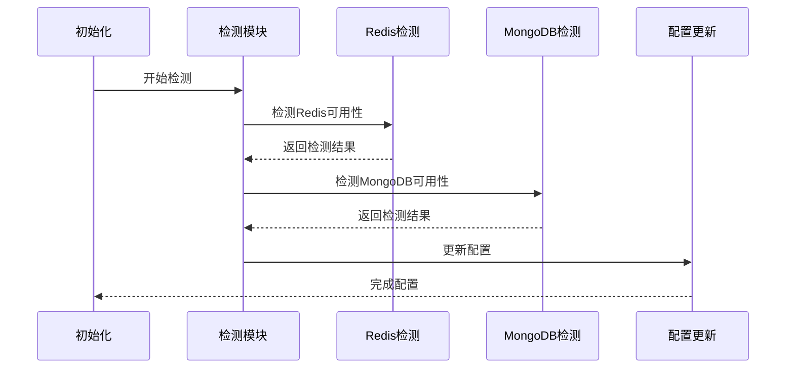

**图表来源**
- [database_manager.py](file://tradingagents/config/database_manager.py#L153-L176)

**章节来源**
- [database_manager.py](file://tradingagents/config/database_manager.py#L119-L176)

## 故障转移策略

### 自动降级机制

当主要后端服务不可用时，系统会自动触发降级策略：

#### 主要后端选择逻辑

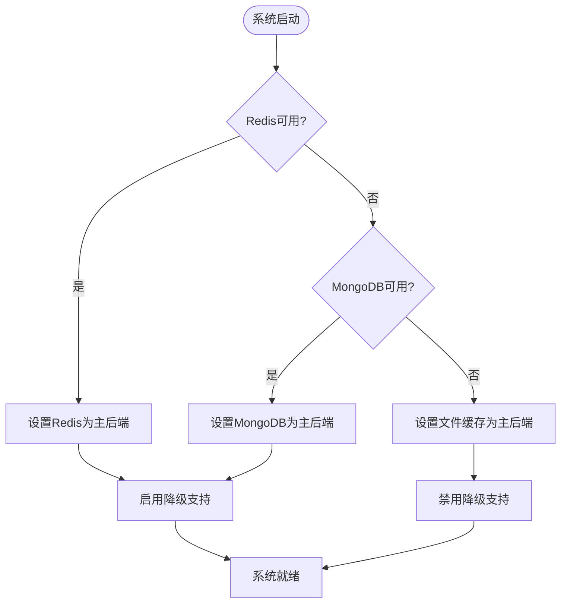

**图表来源**
- [database_manager.py](file://tradingagents/config/database_manager.py#L178-L188)

#### 降级执行流程

当主要后端操作失败时，系统会自动尝试降级：

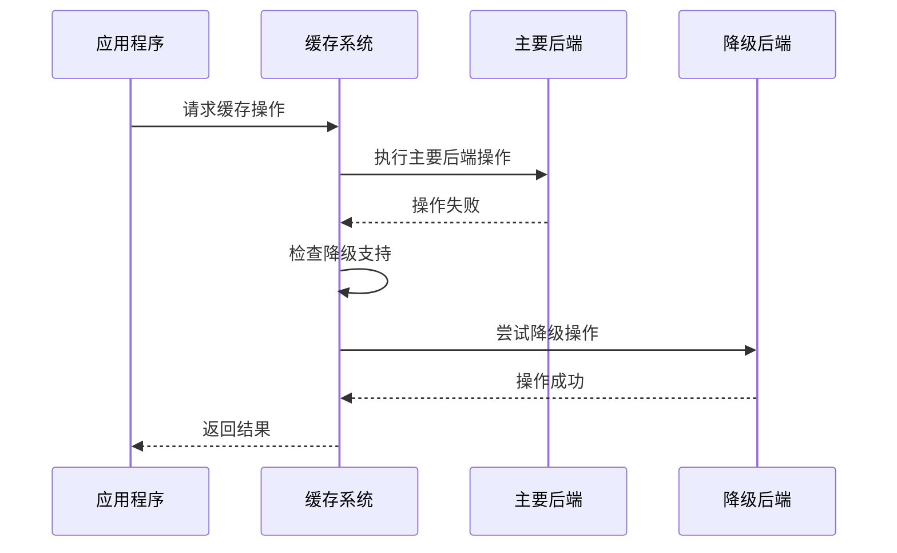

**图表来源**
- [adaptive_cache.py](file://tradingagents/dataflows/adaptive_cache.py#L260-L292)

### 具体故障场景处理

#### Redis连接失败场景

当Redis服务不可用时，系统会自动降级到MongoDB或文件缓存：

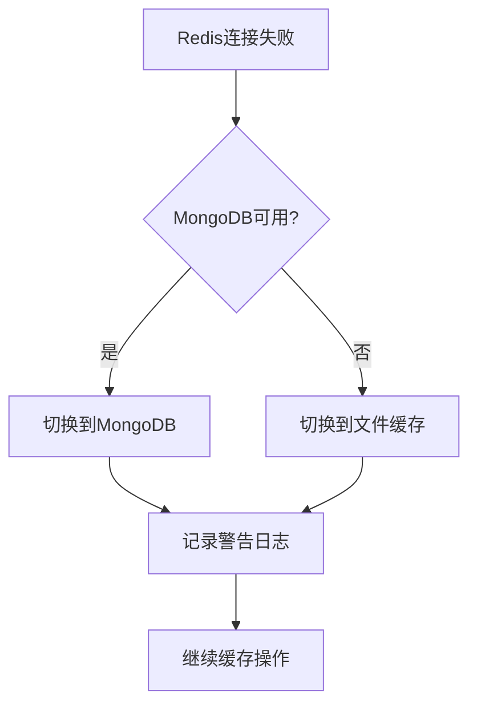

**图表来源**
- [adaptive_cache.py](file://tradingagents/dataflows/adaptive_cache.py#L113-L144)

#### MongoDB连接失败场景

MongoDB故障时的处理流程：

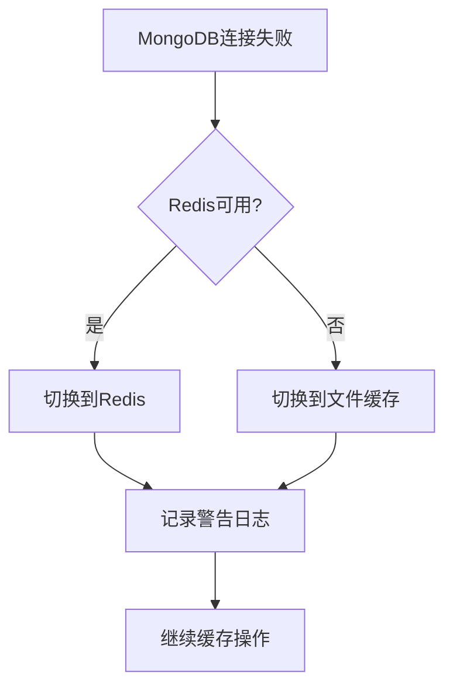

**图表来源**
- [adaptive_cache.py](file://tradingagents/dataflows/adaptive_cache.py#L113-L144)

**章节来源**
- [adaptive_cache.py](file://tradingagents/dataflows/adaptive_cache.py#L260-L292)
- [database_manager.py](file://tradingagents/config/database_manager.py#L178-L188)

## 缓存统计与监控

### get_cache_stats方法

系统通过get_cache_stats方法提供关键的健康指标：

#### 统计信息结构

| 指标类别 | 具体指标 | 描述 |
|---------|---------|------|
| 数据库状态 | mongodb_available | MongoDB可用性状态 |
| 数据库状态 | redis_available | Redis可用性状态 |
| Redis统计 | redis_keys | Redis键数量 |
| Redis统计 | redis_memory | Redis内存使用量 |
| 文件缓存 | file_cache_count | 文件缓存数量 |
| 后端信息 | primary_backend | 主要缓存后端 |
| 后端信息 | fallback_enabled | 降级支持状态 |

#### 统计收集流程

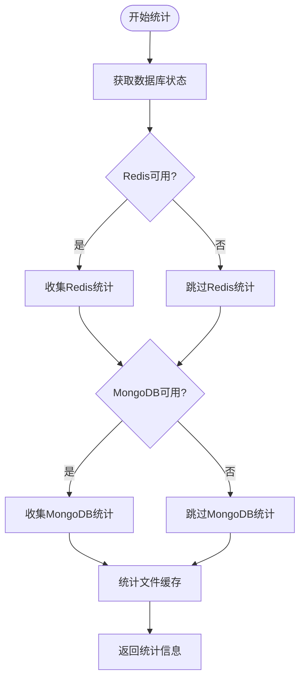

**图表来源**
- [adaptive_cache.py](file://tradingagents/dataflows/adaptive_cache.py#L325-L383)

### 系统状态报告

get_status_report方法提供综合的系统状态信息：

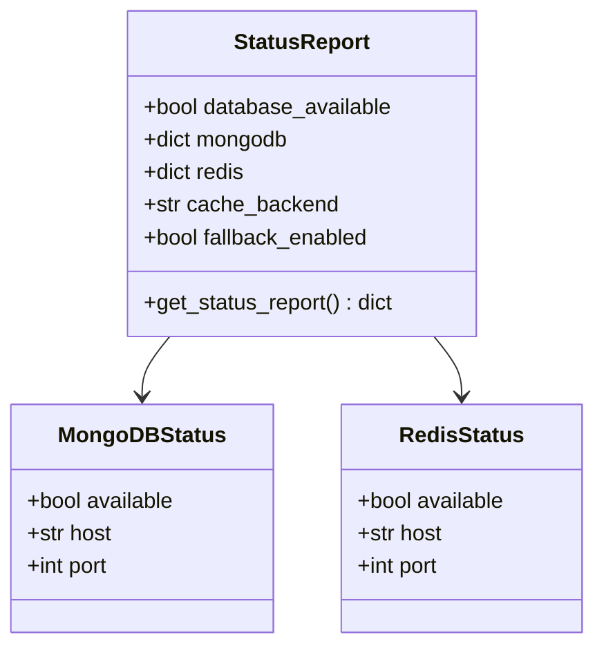

**图表来源**
- [database_manager.py](file://tradingagents/config/database_manager.py#L279-L295)

**章节来源**
- [adaptive_cache.py](file://tradingagents/dataflows/adaptive_cache.py#L325-L383)
- [database_manager.py](file://tradingagents/config/database_manager.py#L279-L315)

## 实际故障场景演示

### Redis连接失败演示

以下是Redis连接失败时的完整故障转移流程：

#### 场景描述
1. 系统启动时检测到Redis服务不可用
2. 自动切换到MongoDB作为主要后端
3. 如果MongoDB也不可用，则降级到文件缓存
4. 记录详细的错误日志和状态信息

#### 日志输出示例

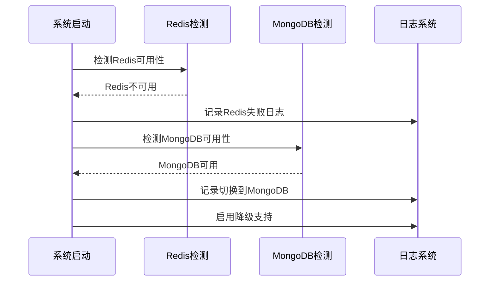

**图表来源**
- [demo_fallback_system.py](file://tests/demo_fallback_system.py#L80-L120)

### MongoDB连接失败演示

#### 场景描述
1. Redis可用但MongoDB不可用
2. 系统自动切换到Redis作为主要后端
3. 保持降级支持以应对Redis故障

#### 性能模式变化

| 数据库状态 | 性能模式 | 特点 |
|-----------|---------|------|
| Redis+MongoDB可用 | 高性能模式 | Redis + MongoDB + 文件缓存 |
| 仅Redis可用 | 快速模式 | Redis + 文件缓存 |
| 仅MongoDB可用 | 持久化模式 | MongoDB + 文件缓存 |
| 仅文件可用 | 标准模式 | 智能文件缓存 |

**章节来源**
- [demo_fallback_system.py](file://tests/demo_fallback_system.py#L80-L150)
- [integrated_cache.py](file://tradingagents/dataflows/integrated_cache.py#L226-L268)

## 监控与告警建议

### 关键监控指标

#### 实时健康检查指标

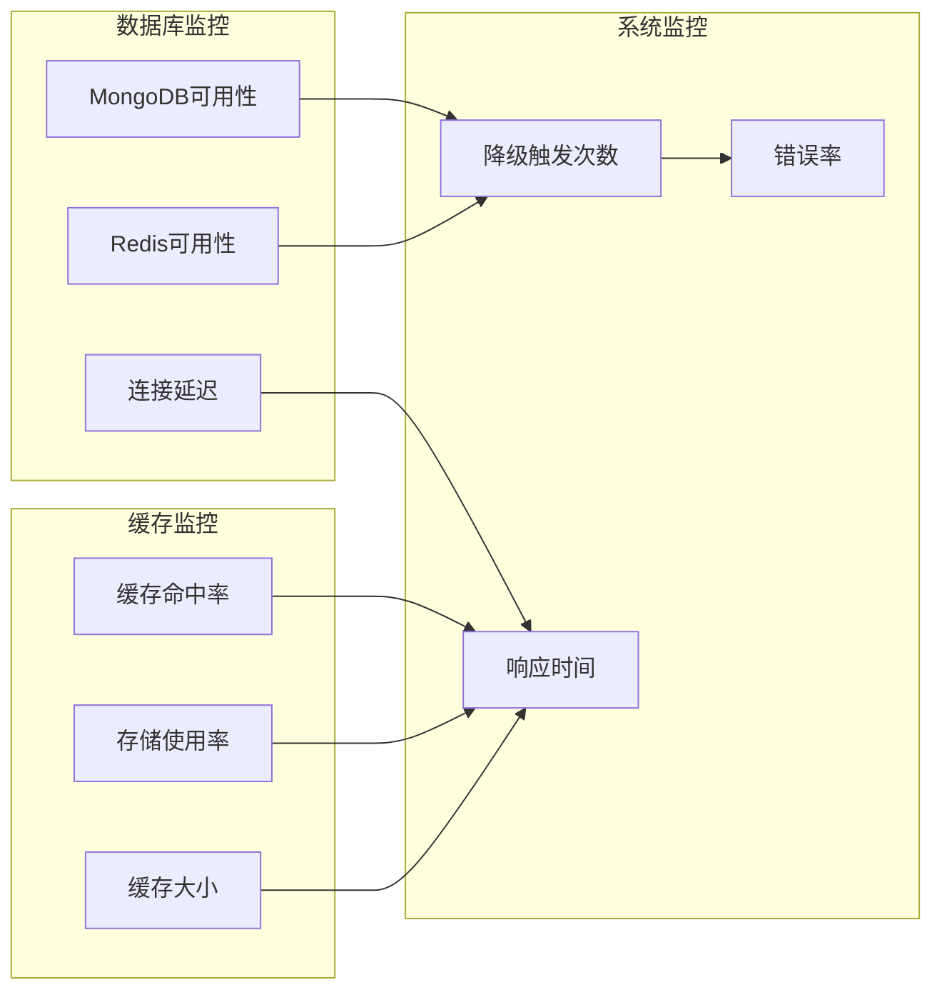

#### 告警阈值建议

| 监控指标 | 正常范围 | 告警阈值 | 严重阈值 |
|---------|---------|---------|---------|
| 数据库连接成功率 | >95% | <90% | <80% |
| 缓存命中率 | >80% | <70% | <60% |
| 平均响应时间 | <100ms | >200ms | >500ms |
| 降级触发频率 | <1次/小时 | >5次/小时 | >10次/小时 |

### 监控脚本

系统提供了专门的监控脚本来检查整体状态：

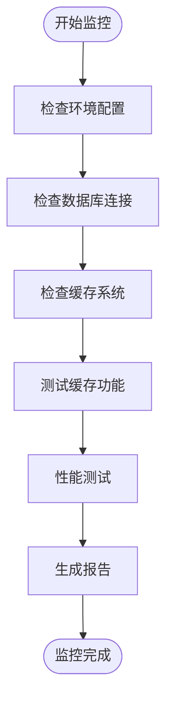

**图表来源**
- [check_system_status.py](file://scripts/validation/check_system_status.py#L20-L50)

**章节来源**
- [check_system_status.py](file://scripts/validation/check_system_status.py#L20-L100)

## 故障排除指南

### 常见问题诊断

#### 数据库连接问题

1. **检查环境变量配置**
   ```bash
   # 检查数据库启用状态
   echo "MONGODB_ENABLED=$MONGODB_ENABLED"
   echo "REDIS_ENABLED=$REDIS_ENABLED"
   
   # 检查连接配置
   echo "MONGODB_HOST=$MONGODB_HOST"
   echo "REDIS_HOST=$REDIS_HOST"
   ```

2. **验证网络连通性**
   ```bash
   # 测试Redis连接
   redis-cli ping
   
   # 测试MongoDB连接
   mongo --eval "db.runCommand({ping: 1})"
   ```

3. **检查服务状态**
   ```bash
   # 检查Redis服务
   systemctl status redis
   
   # 检查MongoDB服务
   systemctl status mongod
   ```

#### 缓存系统问题

1. **检查缓存目录权限**
   ```bash
   # 检查缓存目录
   ls -la data/cache/
   
   # 确保有足够的磁盘空间
   df -h data/cache/
   ```

2. **验证配置文件**
   ```bash
   # 检查.env文件
   cat .env | grep -E "(MONGODB|REDIS)_ENABLED"
   ```

### 故障恢复步骤

#### 自动恢复流程

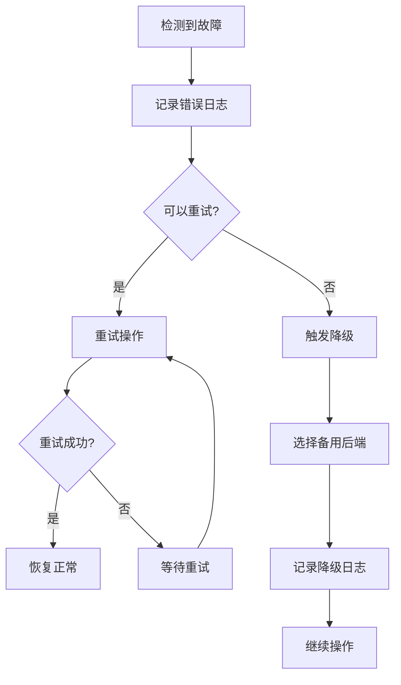

#### 手动干预步骤

1. **重启数据库服务**
   ```bash
   # 重启Redis
   systemctl restart redis
   
   # 重启MongoDB
   systemctl restart mongod
   ```

2. **清除损坏的缓存**
   ```bash
   # 清理过期缓存
   python scripts/maintenance/cleanup_cache.py --days 7
   
   # 强制清理所有缓存
   rm -rf data/cache/*
   ```

3. **重新初始化系统**
   ```bash
   # 重新加载配置
   python -c "from tradingagents.config.database_manager import get_database_manager; get_database_manager()"
   
   # 重新初始化缓存
   python -c "from tradingagents.dataflows.integrated_cache import get_cache; get_cache()"
   ```

**章节来源**
- [check_system_status.py](file://scripts/validation/check_system_status.py#L100-L200)
- [database_config.py](file://tradingagents/config/database_config.py#L56-L108)

## 总结

TradingAgents系统的健康检查与故障转移机制提供了以下核心优势：

### 主要特性

1. **实时健康监控**：通过DatabaseManager的is_redis_available和is_mongodb_available方法实现实时数据库健康状态检测
2. **智能故障转移**：系统能够自动检测后端服务故障并无缝切换到备用缓存后端
3. **多层降级策略**：从Redis到MongoDB再到文件缓存的完整降级链路
4. **全面统计监控**：通过get_cache_stats方法提供详细的健康指标和性能数据
5. **灵活配置管理**：支持通过环境变量控制数据库启用状态和连接参数

### 技术优势

- **高可用性**：即使所有数据库服务都不可用，系统仍能通过文件缓存维持基本功能
- **性能优化**：根据可用的数据库服务自动选择最优的缓存策略
- **易于维护**：统一的配置管理和清晰的日志记录便于故障诊断
- **向后兼容**：现有代码无需修改即可享受新的故障转移能力

### 最佳实践建议

1. **定期监控**：建立自动化监控系统跟踪关键指标
2. **定期测试**：定期运行故障转移测试确保机制正常工作
3. **容量规划**：根据业务需求合理配置数据库资源
4. **日志分析**：定期分析系统日志识别潜在问题
5. **应急预案**：制定详细的故障处理和恢复预案

这套自适应缓存健康检查与故障转移机制确保了TradingAgents系统在各种环境下都能保持稳定可靠的运行，为用户提供持续的服务可用性保障。