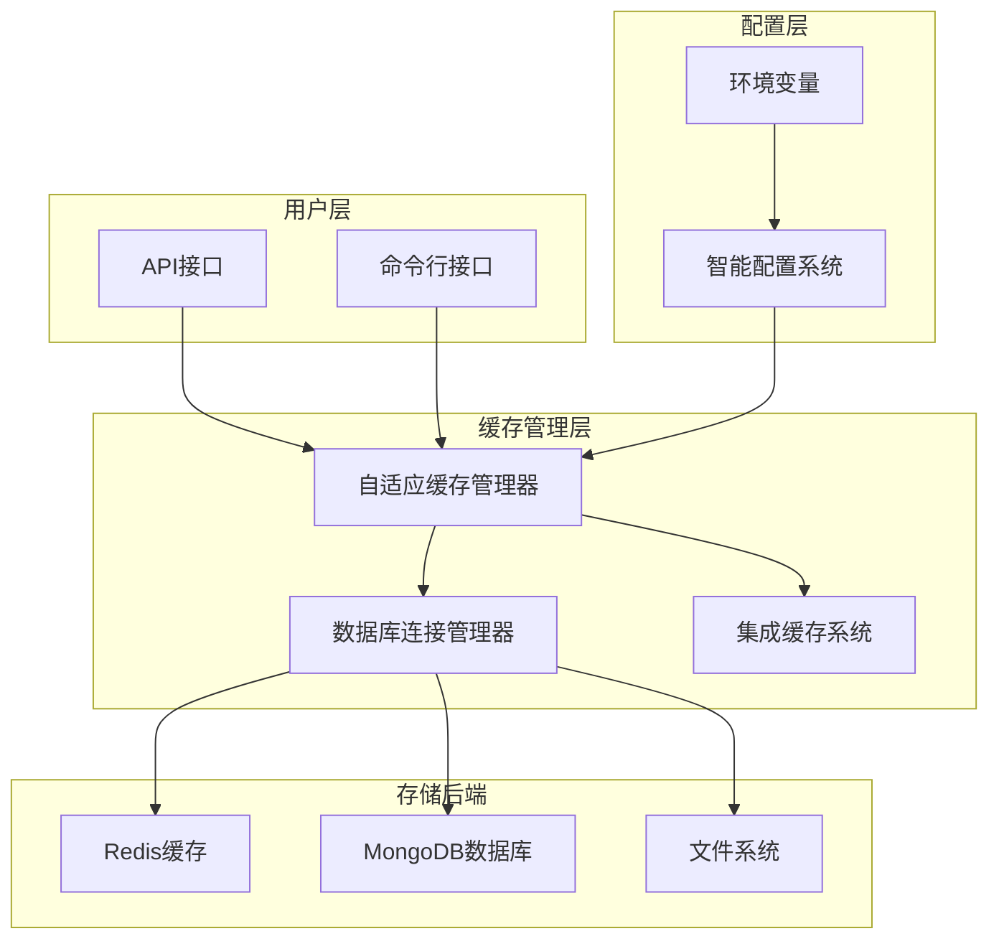
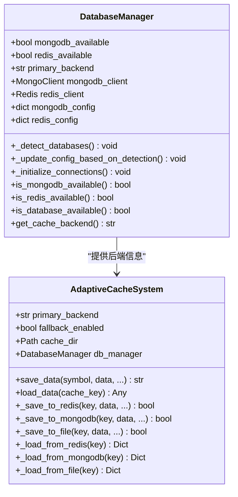
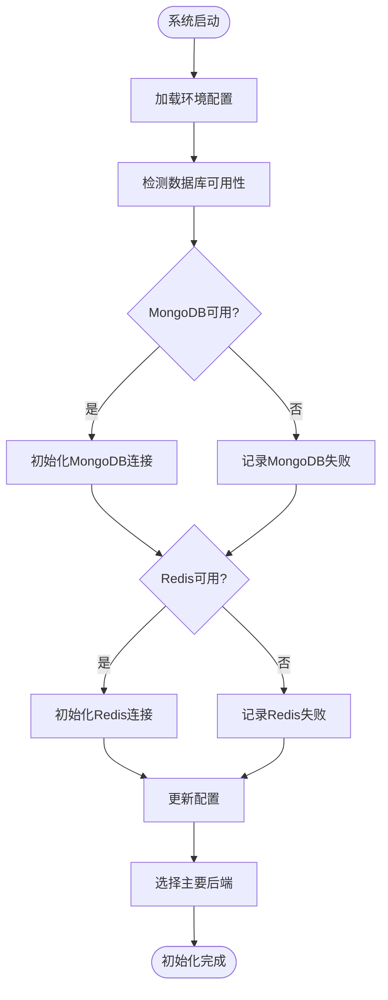
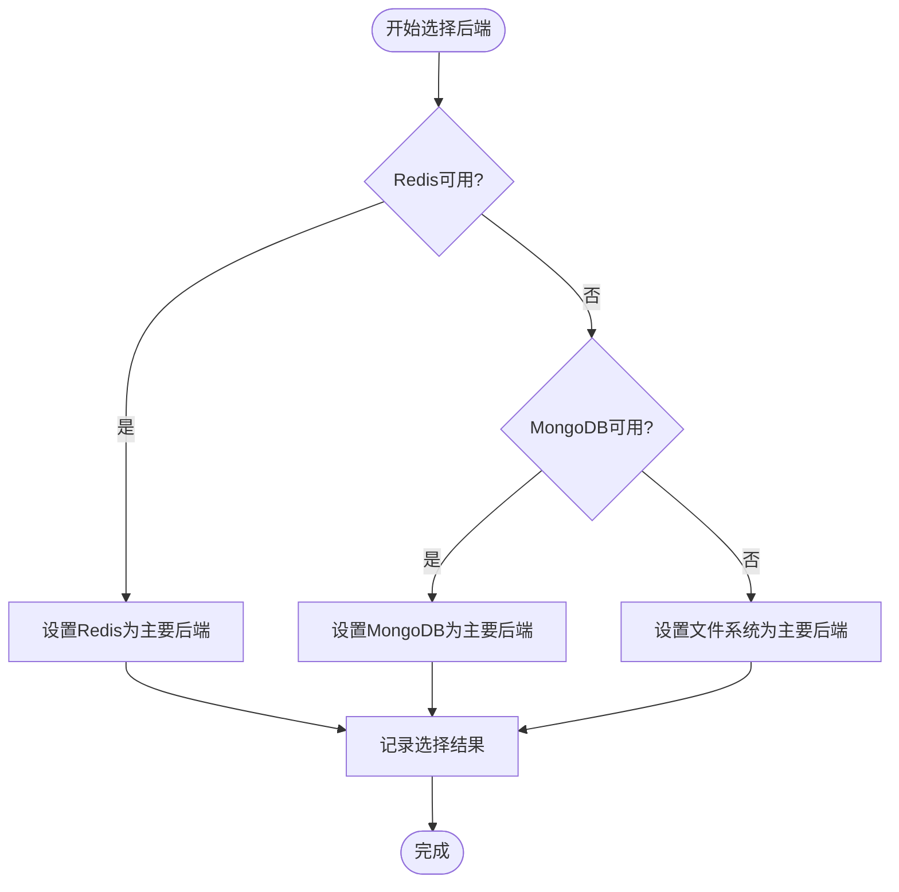
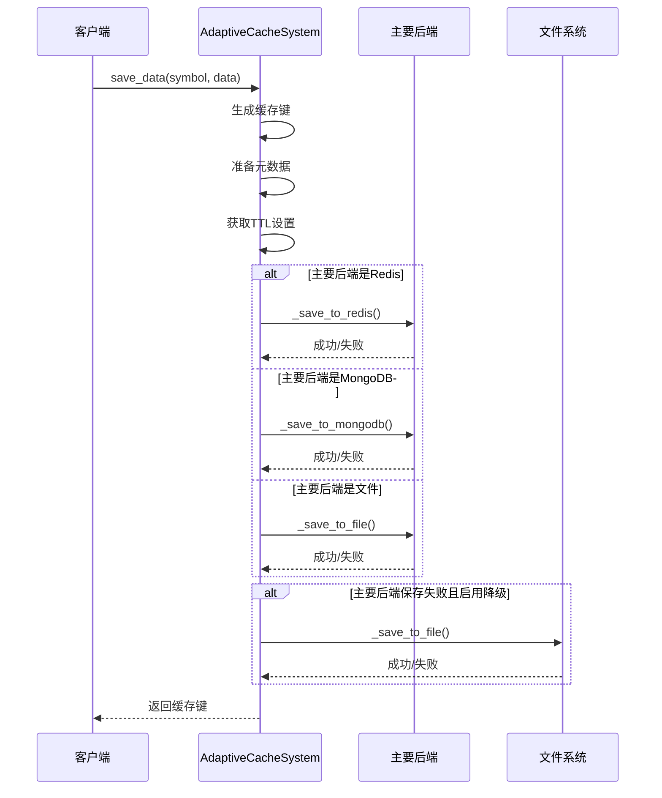
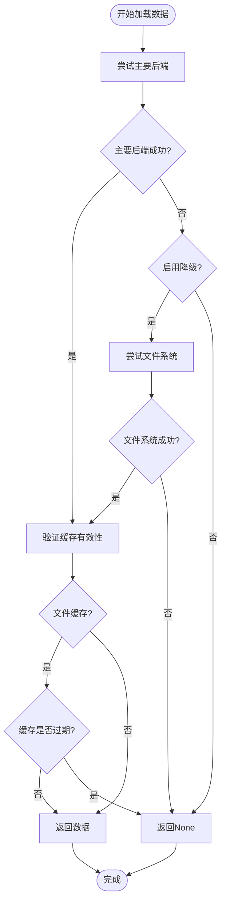
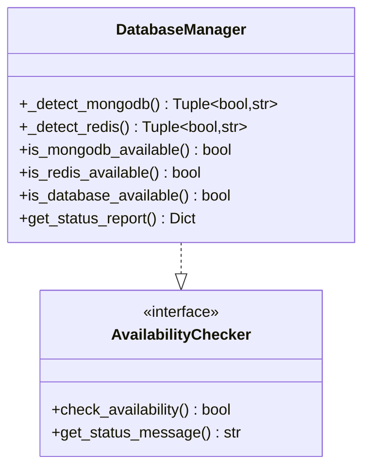
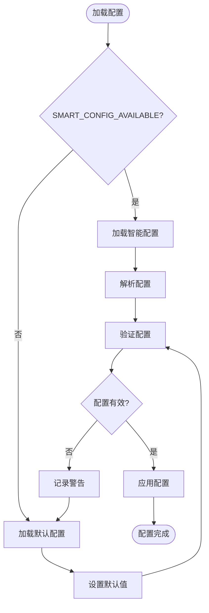

# 缓存后端选择算法

<cite>
**本文档中引用的文件**
- [database_manager.py](file://tradingagents/config/database_manager.py)
- [adaptive_cache.py](file://tradingagents/dataflows/adaptive_cache.py)
- [adaptive_cache_manager.py](file://scripts/development/adaptive_cache_manager.py)
- [database_config.py](file://tradingagents/config/database_config.py)
- [env_utils.py](file://tradingagents/config/env_utils.py)
- [integrated_cache.py](file://tradingagents/dataflows/integrated_cache.py)
- [test_fallback_mechanism.py](file://scripts/test_fallback_mechanism.py)
- [test_smart_system.py](file://tests/test_smart_system.py)
</cite>

## 目录
1. [简介](#简介)
2. [系统架构概览](#系统架构概览)
3. [核心组件分析](#核心组件分析)
4. [后端选择算法详解](#后端选择算法详解)
5. [优先级决策逻辑](#优先级决策逻辑)
6. [异常处理与降级机制](#异常处理与降级机制)
7. [配置管理系统](#配置管理系统)
8. [性能优化策略](#性能优化策略)
9. [故障排除指南](#故障排除指南)
10. [总结](#总结)

## 简介

TradingAgents-CN系统实现了一个高度智能的自适应缓存系统，能够根据可用的后端存储资源自动选择最优的缓存策略。该系统支持三种主要的缓存后端：Redis内存数据库、MongoDB文档数据库和文件系统缓存，并具备完善的降级机制确保系统的高可用性。

系统的核心设计理念是在保证数据访问速度的同时，最大化存储资源的利用效率。通过智能检测各个后端的可用性，系统能够在不同环境下自动调整其行为，为用户提供一致的性能体验。

## 系统架构概览

**图表来源**
- [database_manager.py](file://tradingagents/config/database_manager.py#L1-L50)
- [adaptive_cache.py](file://tradingagents/dataflows/adaptive_cache.py#L1-L50)
- [integrated_cache.py](file://tradingagents/dataflows/integrated_cache.py#L1-L50)

## 核心组件分析

### 数据库管理器 (DatabaseManager)

DatabaseManager是整个缓存系统的核心协调者，负责检测和管理各种存储后端的可用性。

**图表来源**
- [database_manager.py](file://tradingagents/config/database_manager.py#L15-L100)
- [adaptive_cache.py](file://tradingagents/dataflows/adaptive_cache.py#L20-L80)

**章节来源**
- [database_manager.py](file://tradingagents/config/database_manager.py#L15-L100)
- [adaptive_cache.py](file://tradingagents/dataflows/adaptive_cache.py#L20-L80)

### 自适应缓存系统

AdaptiveCacheSystem实现了基于优先级的缓存策略，根据主要后端的状态动态调整存储行为。

**章节来源**
- [adaptive_cache.py](file://tradingagents/dataflows/adaptive_cache.py#L20-L150)

## 后端选择算法详解

### 初始化阶段的后端检测

系统在启动时执行全面的后端可用性检测：

**图表来源**
- [database_manager.py](file://tradingagents/config/database_manager.py#L148-L186)

### 主要后端选择优先级

系统按照以下优先级顺序选择主要缓存后端：

1. **Redis** - 优先选择Redis作为主要后端，因为其具有最快的访问速度
2. **MongoDB** - 如果Redis不可用，则选择MongoDB作为次优选择
3. **文件系统** - 如果所有数据库都不可用，则回退到文件系统缓存

**图表来源**
- [database_manager.py](file://tradingagents/config/database_manager.py#L188-L200)

**章节来源**
- [database_manager.py](file://tradingagents/config/database_manager.py#L148-L200)

## 优先级决策逻辑

### save_data 方法的决策流程

save_data方法实现了复杂的优先级决策逻辑，确保数据能够可靠地存储：

**图表来源**
- [adaptive_cache.py](file://tradingagents/dataflows/adaptive_cache.py#L223-L292)

### load_data 方法的降级逻辑

load_data方法实现了智能的降级机制：

**图表来源**
- [adaptive_cache.py](file://tradingagents/dataflows/adaptive_cache.py#L294-L330)

**章节来源**
- [adaptive_cache.py](file://tradingagents/dataflows/adaptive_cache.py#L223-L330)

## 异常处理与降级机制

### 数据库可用性检查

系统提供了多层次的数据库可用性检查机制：

**图表来源**
- [database_manager.py](file://tradingagents/config/database_manager.py#L80-L150)

### 降级触发条件

系统定义了明确的降级触发条件：

| 触发条件 | 描述 | 处理方式 |
|---------|------|----------|
| Redis连接失败 | Redis服务器不可达或认证失败 | 自动降级到MongoDB或文件系统 |
| MongoDB连接失败 | MongoDB服务器不可达或认证失败 | 自动降级到文件系统 |
| 主要后端保存失败 | 写入操作失败但启用降级功能 | 使用文件系统作为备用 |
| 主要后端加载失败 | 读取操作失败但启用降级功能 | 尝试从文件系统加载 |

**章节来源**
- [database_manager.py](file://tradingagents/config/database_manager.py#L80-L186)
- [adaptive_cache.py](file://tradingagents/dataflows/adaptive_cache.py#L260-L292)

## 配置管理系统

### 智能配置加载

系统支持两种配置加载模式：

1. **智能配置模式** - 通过SMART_CONFIG_AVAILABLE检测外部配置系统
2. **默认配置模式** - 使用内置的默认配置

**图表来源**
- [adaptive_cache_manager.py](file://scripts/development/adaptive_cache_manager.py#L40-L61)

### 配置参数详解

| 参数名称 | 类型 | 默认值 | 描述 |
|---------|------|--------|------|
| primary_backend | str | "file" | 主要缓存后端类型 |
| fallback_enabled | bool | True | 是否启用降级机制 |
| mongodb_enabled | bool | False | MongoDB是否启用 |
| redis_enabled | bool | False | Redis是否启用 |
| ttl_settings | dict | {} | TTL配置设置 |

**章节来源**
- [adaptive_cache_manager.py](file://scripts/development/adaptive_cache_manager.py#L40-L80)
- [database_config.py](file://tradingagents/config/database_config.py#L15-L80)

## 性能优化策略

### 缓存键生成算法

系统使用MD5哈希算法生成缓存键，确保唯一性和高效性：

**图表来源**
- [adaptive_cache.py](file://tradingagents/dataflows/adaptive_cache.py#L40-L50)

### TTL（生存时间）管理

系统实现了智能的TTL管理机制：

| 市场类型 | 数据类型 | 默认TTL | 说明 |
|---------|---------|---------|------|
| 中国股市 | 股票数据 | 3600秒 | 较短TTL确保数据及时更新 |
| 美国股市 | 股票数据 | 7200秒 | 较长TTL减少查询频率 |
| 中国股市 | 基本面数据 | 43200秒 | 长期有效数据 |
| 美国股市 | 基本面数据 | 86400秒 | 长期有效数据 |

**章节来源**
- [adaptive_cache.py](file://tradingagents/dataflows/adaptive_cache.py#L50-L70)

## 故障排除指南

### 常见问题诊断

#### 1. 后端连接问题

**症状**: 系统报告数据库连接失败
**诊断步骤**:
1. 检查环境变量配置
2. 验证网络连接
3. 确认服务进程运行状态

**解决方案**:
- 检查`.env`文件中的连接配置
- 验证防火墙设置
- 确认数据库服务已启动

#### 2. 降级机制失效

**症状**: 主要后端失败但未触发降级
**诊断步骤**:
1. 检查`fallback_enabled`配置
2. 验证文件系统权限
3. 确认缓存目录可写

**解决方案**:
- 确保`fallback_enabled`设置为`True`
- 检查缓存目录权限
- 验证磁盘空间充足

#### 3. 性能问题

**症状**: 缓存访问速度慢
**诊断步骤**:
1. 检查主要后端选择
2. 分析网络延迟
3. 监控资源使用情况

**解决方案**:
- 优化数据库连接参数
- 调整TTL设置
- 考虑增加缓存容量

**章节来源**
- [test_fallback_mechanism.py](file://scripts/test_fallback_mechanism.py#L1-L50)
- [test_smart_system.py](file://tests/test_smart_system.py#L160-L192)

## 总结

TradingAgents-CN的自适应缓存系统通过智能的后端选择算法和完善的降级机制，实现了高可用性和优异的性能表现。系统的主要优势包括：

1. **智能后端选择** - 基于可用性的动态后端选择
2. **完善的降级机制** - 确保系统在任何情况下都能正常工作
3. **灵活的配置管理** - 支持多种配置加载方式
4. **高效的性能优化** - 智能的TTL管理和缓存键生成

该系统为TradingAgents-CN提供了可靠的缓存基础设施，支持大规模的数据处理和分析需求。通过持续的监控和优化，系统能够适应不断变化的业务需求和技术环境。