# 自适应缓存架构

<cite>
**本文档中引用的文件**
- [adaptive_cache.py](file://tradingagents/dataflows/adaptive_cache.py)
- [database_manager.py](file://tradingagents/config/database_manager.py)
- [integrated_cache.py](file://tradingagents/dataflows/integrated_cache.py)
- [adaptive_cache_manager.py](file://scripts/development/adaptive_cache_manager.py)
- [smart_config.py](file://scripts/validation/smart_config.py)
- [setup-docker.py](file://scripts/setup-docker.py)
- [test_fallback_mechanism.py](file://tests/test_fallback_mechanism.py)
- [test_smart_system.py](file://tests/test_smart_system.py)
</cite>

## 目录
1. [简介](#简介)
2. [系统架构概览](#系统架构概览)
3. [核心组件分析](#核心组件分析)
4. [初始化过程详解](#初始化过程详解)
5. [缓存后端选择机制](#缓存后端选择机制)
6. [健康检查与故障转移](#健康检查与故障转移)
7. [部署环境适配](#部署环境适配)
8. [性能优化策略](#性能优化策略)
9. [故障排除指南](#故障排除指南)
10. [总结](#总结)

## 简介

自适应缓存系统是TradingAgents-CN项目的核心组件之一，它能够根据数据库可用性自动选择最优的缓存策略，提供高性能的数据访问能力。该系统支持三种缓存后端：Redis、MongoDB和文件系统，并具备智能的故障转移机制。

## 系统架构概览

自适应缓存系统采用分层架构设计，包含以下主要层次：

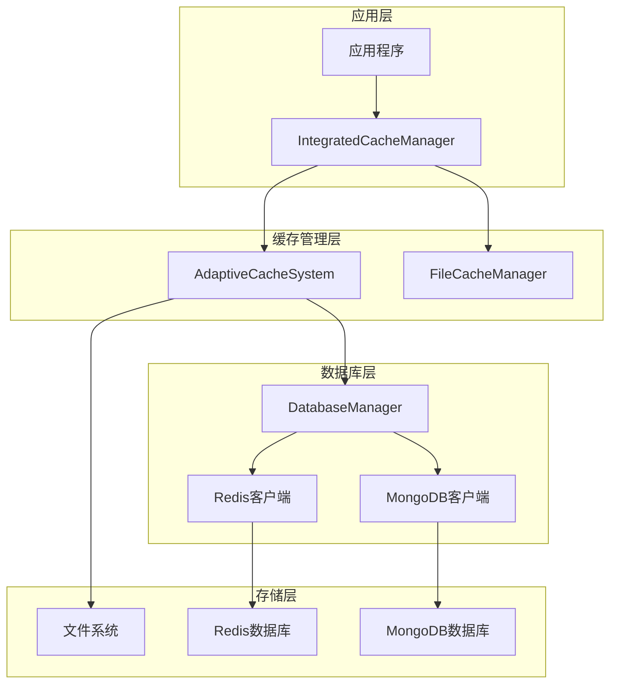

**图表来源**
- [integrated_cache.py](file://tradingagents/dataflows/integrated_cache.py#L27-L63)
- [adaptive_cache.py](file://tradingagents/dataflows/adaptive_cache.py#L18-L55)
- [database_manager.py](file://tradingagents/config/database_manager.py#L15-L50)

## 核心组件分析

### AdaptiveCacheSystem 类

AdaptiveCacheSystem 是自适应缓存系统的核心类，负责管理所有缓存操作和后端选择逻辑。

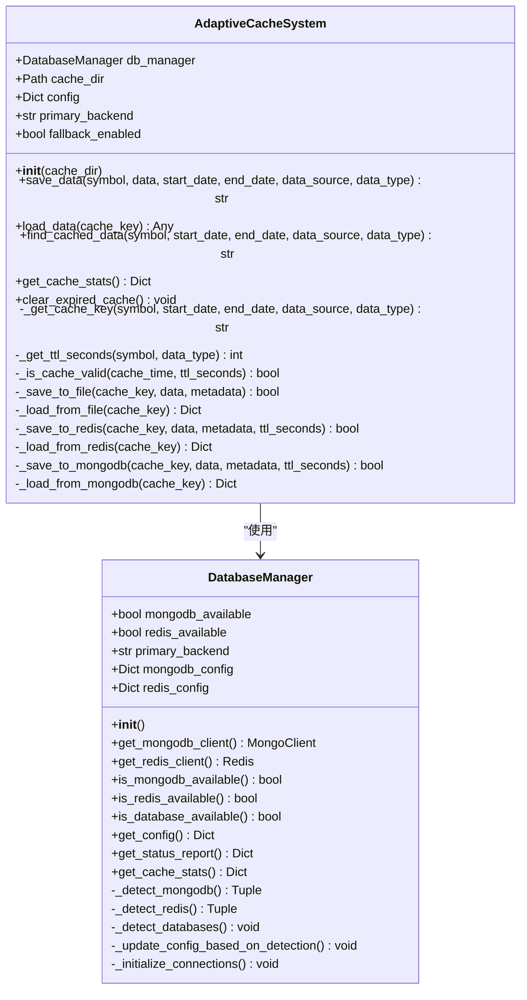

**图表来源**
- [adaptive_cache.py](file://tradingagents/dataflows/adaptive_cache.py#L18-L55)
- [database_manager.py](file://tradingagents/config/database_manager.py#L15-L50)

**章节来源**
- [adaptive_cache.py](file://tradingagents/dataflows/adaptive_cache.py#L18-L55)
- [database_manager.py](file://tradingagents/config/database_manager.py#L15-L50)

### IntegratedCacheManager 类

IntegratedCacheManager 提供向后兼容的接口，同时支持新旧两种缓存系统。

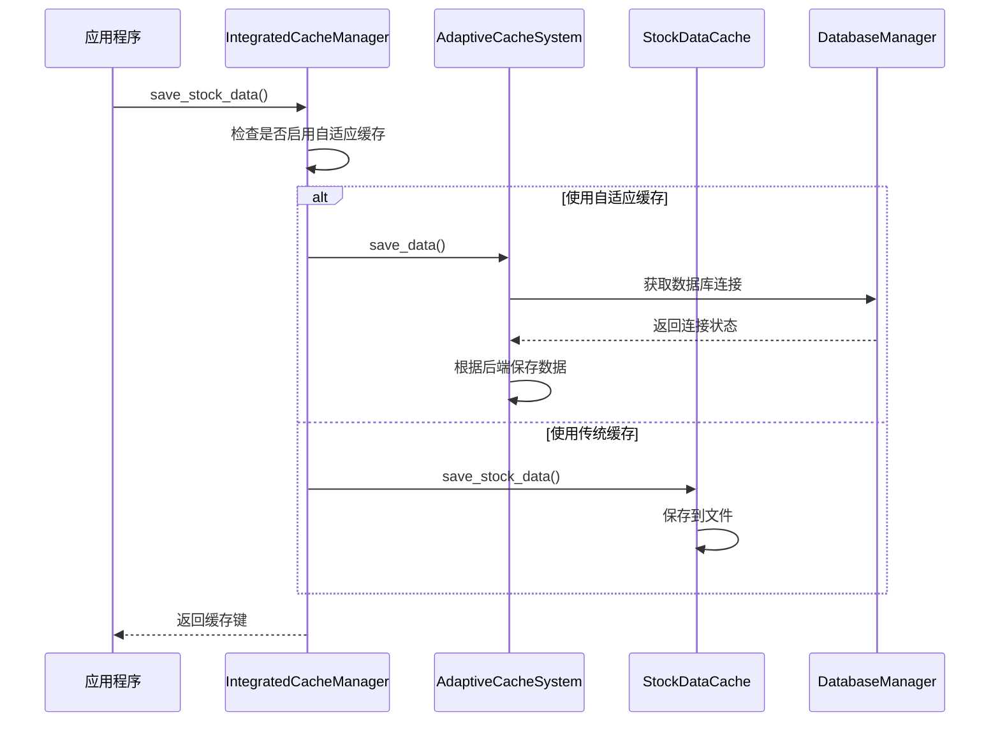

**图表来源**
- [integrated_cache.py](file://tradingagents/dataflows/integrated_cache.py#L50-L100)
- [adaptive_cache.py](file://tradingagents/dataflows/adaptive_cache.py#L200-L250)

**章节来源**
- [integrated_cache.py](file://tradingagents/dataflows/integrated_cache.py#L27-L63)

## 初始化过程详解

### AdaptiveCacheSystem 初始化流程

AdaptiveCacheSystem 的初始化过程遵循严格的顺序，确保所有依赖项正确配置：

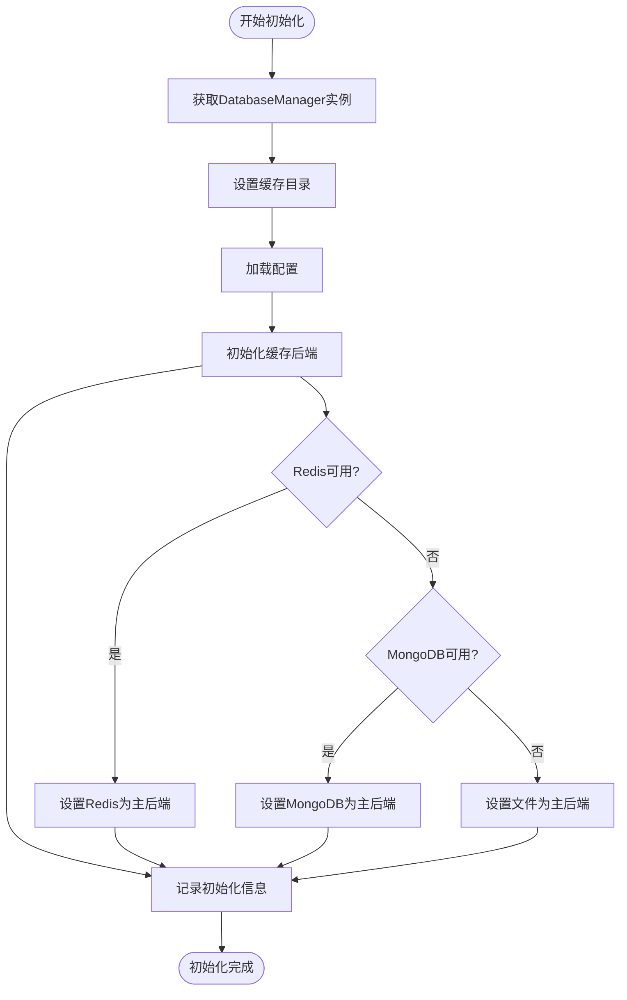

**图表来源**
- [adaptive_cache.py](file://tradingagents/dataflows/adaptive_cache.py#L20-L40)
- [database_manager.py](file://tradingagents/config/database_manager.py#L148-L186)

### DatabaseManager 初始化过程

DatabaseManager 负责检测和初始化数据库连接：

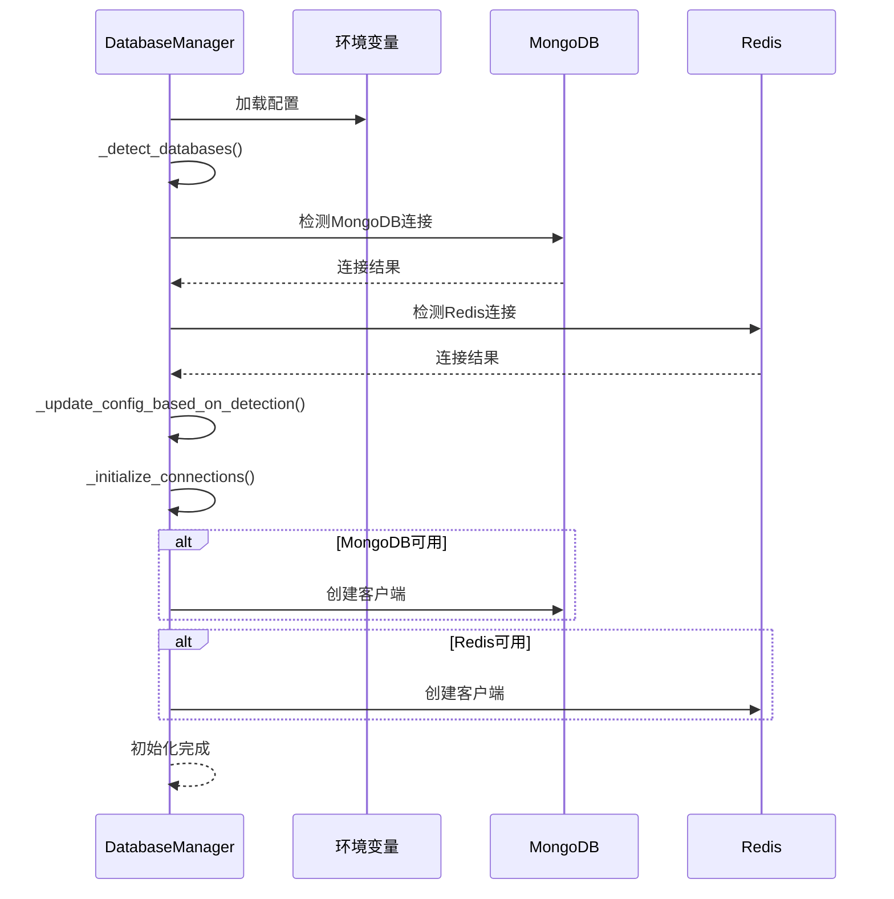

**图表来源**
- [database_manager.py](file://tradingagents/config/database_manager.py#L15-L50)
- [database_manager.py](file://tradingagents/config/database_manager.py#L148-L186)

**章节来源**
- [adaptive_cache.py](file://tradingagents/dataflows/adaptive_cache.py#L20-L40)
- [database_manager.py](file://tradingagents/config/database_manager.py#L15-L50)

## 缓存后端选择机制

### 自动选择算法

系统根据数据库可用性自动选择最优缓存后端，优先级顺序为：Redis > MongoDB > 文件系统。

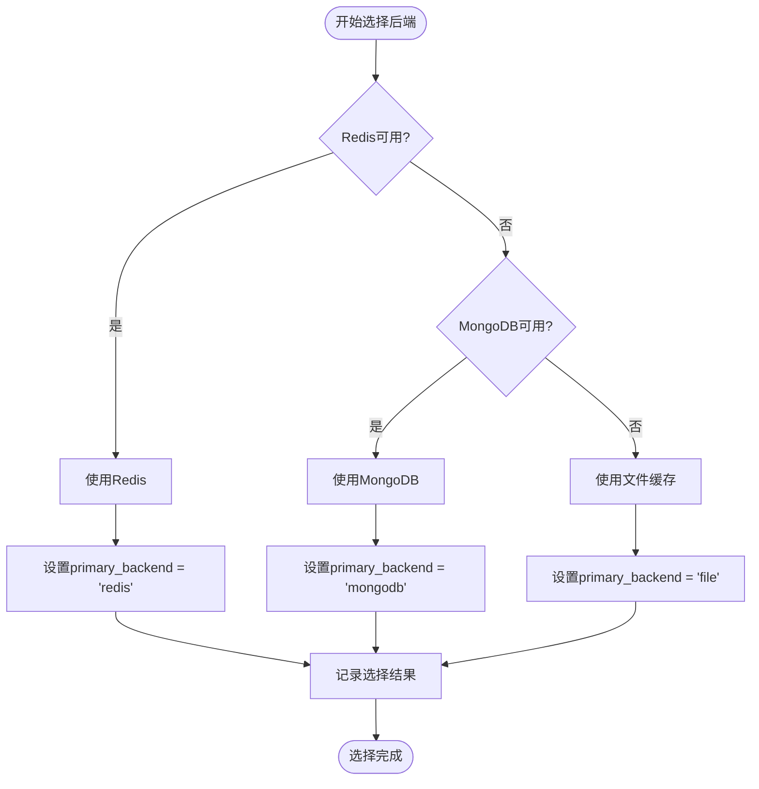

**图表来源**
- [database_manager.py](file://tradingagents/config/database_manager.py#L170-L186)
- [smart_config.py](file://scripts/validation/smart_config.py#L120-L150)

### 配置优先级表

| 后端类型 | 优先级 | 性能特点 | 适用场景 |
|---------|--------|----------|----------|
| Redis | 最高 | 极快 (<0.001秒) | 实时数据、高频访问 |
| MongoDB | 中等 | 快 (<0.01秒) | 结构化数据、复杂查询 |
| 文件缓存 | 最低 | 较慢 (<0.1秒) | 备份、离线使用 |

**章节来源**
- [database_manager.py](file://tradingagents/config/database_manager.py#L170-L186)
- [smart_config.py](file://scripts/validation/smart_config.py#L120-L150)

## 健康检查与故障转移

### 数据库健康检查机制

系统实现了多层次的健康检查机制：

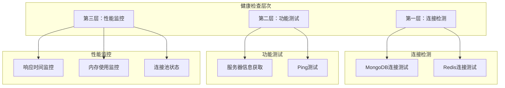

**图表来源**
- [database_manager.py](file://tradingagents/config/database_manager.py#L70-L120)
- [smart_config.py](file://scripts/validation/smart_config.py#L30-L80)

### 故障转移策略

当主要后端不可用时，系统自动执行降级策略：

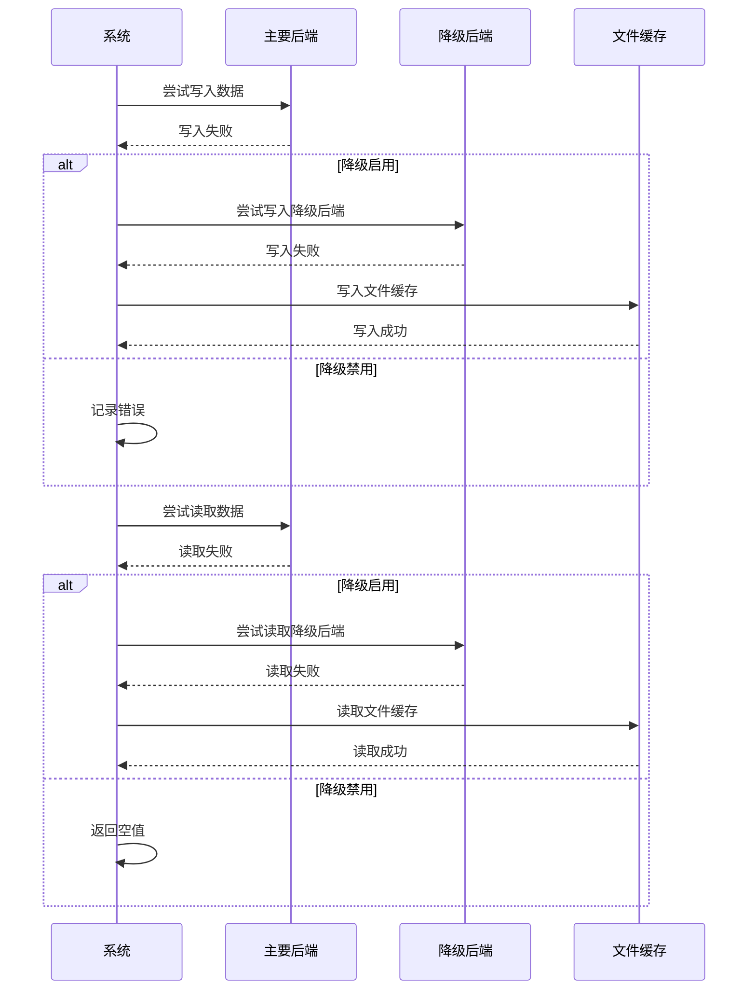

**图表来源**
- [adaptive_cache.py](file://tradingagents/dataflows/adaptive_cache.py#L250-L300)
- [test_fallback_mechanism.py](file://tests/test_fallback_mechanism.py#L160-L192)

**章节来源**
- [database_manager.py](file://tradingagents/config/database_manager.py#L70-L120)
- [adaptive_cache.py](file://tradingagents/dataflows/adaptive_cache.py#L250-L300)

## 部署环境适配

### 本地开发环境

在本地开发环境中，系统优先使用文件缓存，便于调试和开发：

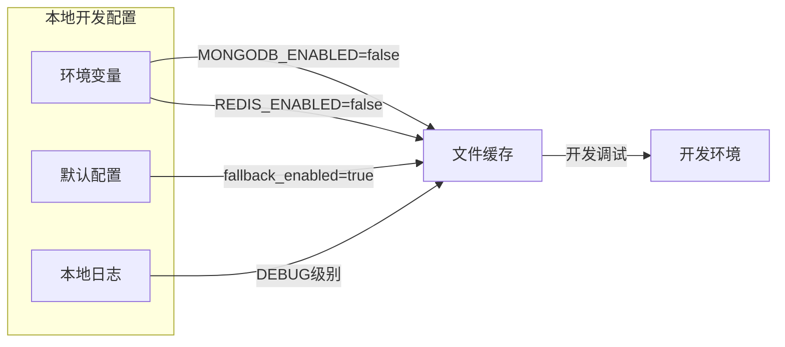

**图表来源**
- [setup-docker.py](file://scripts/setup-docker.py#L40-L60)
- [adaptive_cache_manager.py](file://scripts/development/adaptive_cache_manager.py#L50-L80)

### Docker容器环境

Docker环境提供了标准化的部署配置：

| 环境变量 | 默认值 | 说明 |
|---------|--------|------|
| MONGODB_ENABLED | true | 启用MongoDB支持 |
| REDIS_ENABLED | true | 启用Redis支持 |
| MONGODB_HOST | mongodb | MongoDB容器名称 |
| REDIS_HOST | redis | Redis容器名称 |
| MONGODB_PORT | 27017 | MongoDB端口 |
| REDIS_PORT | 6379 | Redis端口 |

### 生产环境配置

生产环境强调稳定性和性能：

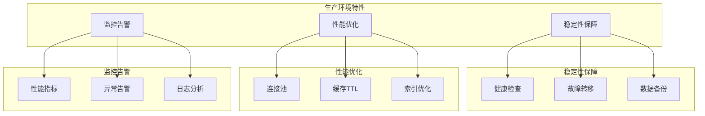

**图表来源**
- [setup-docker.py](file://scripts/setup-docker.py#L40-L60)
- [database_manager.py](file://tradingagents/config/database_manager.py#L300-L350)

**章节来源**
- [setup-docker.py](file://scripts/setup-docker.py#L40-L85)
- [database_manager.py](file://tradingagents/config/database_manager.py#L300-L350)

## 性能优化策略

### 缓存TTL配置

系统根据不同数据类型的访问模式设置了优化的TTL值：

| 数据类型 | 中国数据TTL | 美国数据TTL | 说明 |
|---------|------------|------------|------|
| 股票数据 | 3600秒 | 7200秒 | 实时性要求较高 |
| 新闻数据 | 14400秒 | 21600秒 | 内容更新频率较低 |
| 基本面数据 | 43200秒 | 86400秒 | 数据变化较慢 |

### 连接池优化

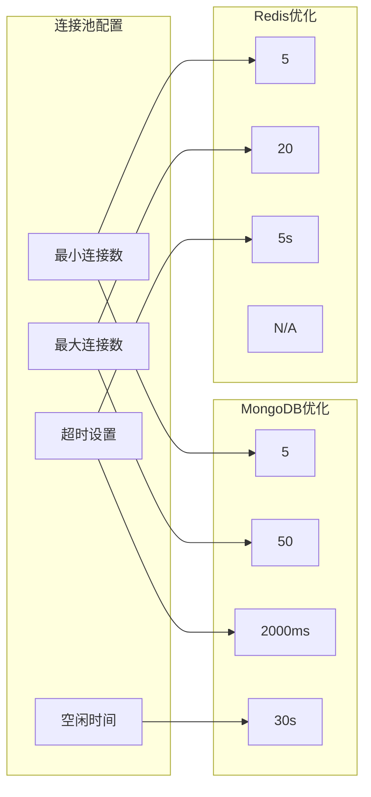

**图表来源**
- [smart_config.py](file://scripts/validation/smart_config.py#L120-L150)
- [database_manager.py](file://tradingagents/config/database_manager.py#L300-L350)

**章节来源**
- [smart_config.py](file://scripts/validation/smart_config.py#L120-L150)
- [database_manager.py](file://tradingagents/config/database_manager.py#L300-L350)

## 故障排除指南

### 常见问题诊断

系统提供了完善的诊断工具和故障排除指南：

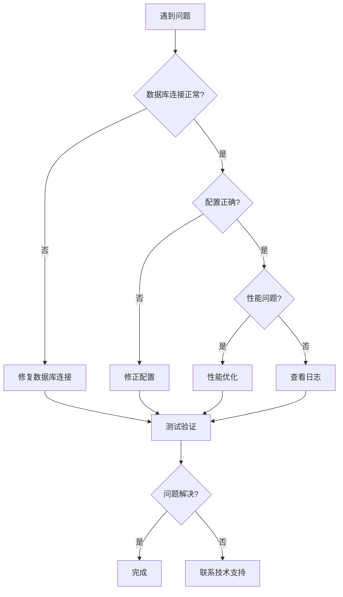

**图表来源**
- [test_fallback_mechanism.py](file://tests/test_fallback_mechanism.py#L160-L192)
- [test_smart_system.py](file://tests/test_smart_system.py#L219-L255)

### 状态检查命令

系统提供了多种状态检查工具：

| 检查类型 | 命令 | 输出内容 |
|---------|------|----------|
| 数据库状态 | `check_system_status.py` | 连接状态、性能指标 |
| 缓存统计 | `get_cache_stats()` | 各后端使用情况 |
| 配置验证 | `test_smart_config()` | 配置正确性检查 |

**章节来源**
- [test_fallback_mechanism.py](file://tests/test_fallback_mechanism.py#L160-L192)
- [test_smart_system.py](file://tests/test_smart_system.py#L219-L255)

## 总结

自适应缓存系统通过智能的后端选择、完善的健康检查和灵活的故障转移机制，为TradingAgents-CN项目提供了高性能、高可用的数据缓存解决方案。系统的主要优势包括：

1. **智能自适应**：根据数据库可用性自动选择最优缓存策略
2. **高可用性**：完善的故障转移和降级机制
3. **性能优化**：针对不同数据类型的TTL优化和连接池配置
4. **环境适配**：支持本地开发、Docker和生产环境的无缝切换
5. **易于维护**：提供丰富的诊断工具和监控指标

该系统不仅提升了数据访问性能，还确保了在各种部署环境下的稳定运行，是TradingAgents-CN项目架构中的重要组成部分。