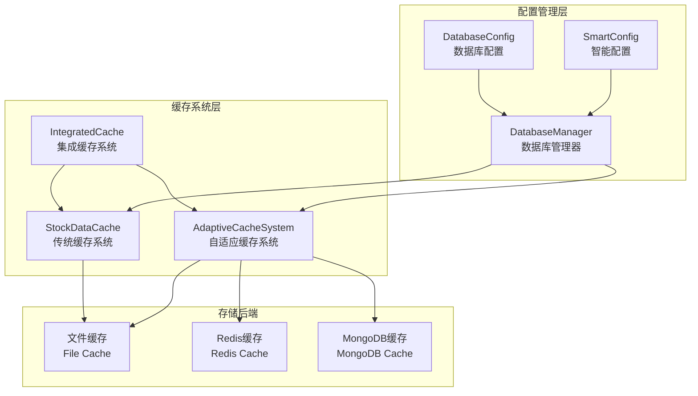
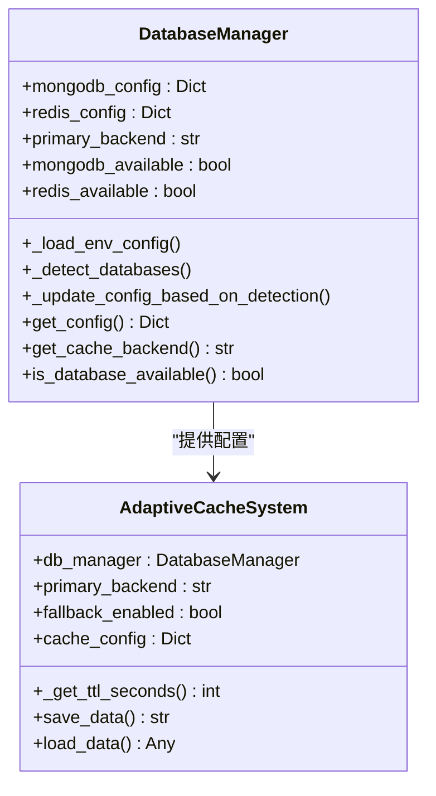
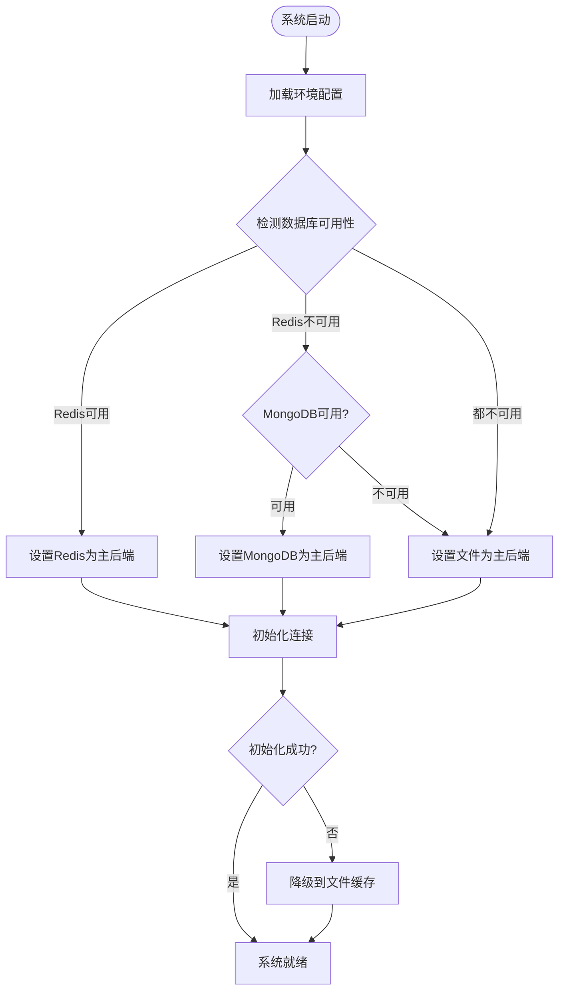
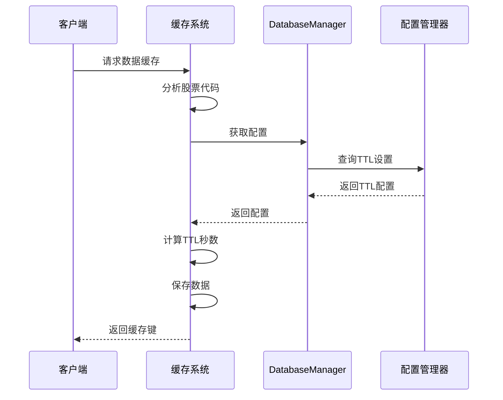
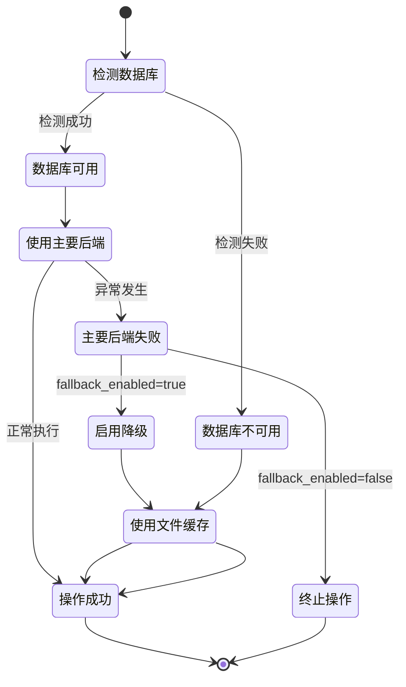
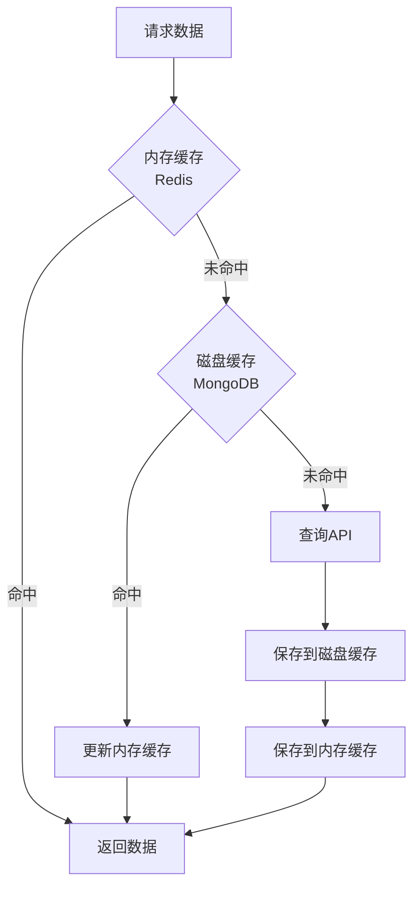

# 自适应缓存配置管理

<cite>
**本文档引用的文件**
- [tradingagents/config/database_manager.py](file://tradingagents/config/database_manager.py)
- [tradingagents/dataflows/adaptive_cache.py](file://tradingagents/dataflows/adaptive_cache.py)
- [tradingagents/dataflows/cache_manager.py](file://tradingagents/dataflows/cache_manager.py)
- [scripts/development/adaptive_cache_manager.py](file://scripts/development/adaptive_cache_manager.py)
- [tradingagents/dataflows/integrated_cache.py](file://tradingagents/dataflows/integrated_cache.py)
- [scripts/setup/initialize_system.py](file://scripts/setup/initialize_system.py)
- [tradingagents/default_config.py](file://tradingagents/default_config.py)
- [tradingagents/config/database_config.py](file://tradingagents/config/database_config.py)
- [scripts/validation/smart_config.py](file://scripts/validation/smart_config.py)
</cite>

## 目录
1. [概述](#概述)
2. [系统架构](#系统架构)
3. [配置管理机制](#配置管理机制)
4. [缓存后端选择策略](#缓存后端选择策略)
5. [TTL配置与动态调整](#ttl配置与动态调整)
6. [配置加载流程](#配置加载流程)
7. [部署环境配置](#部署环境配置)
8. [错误处理与默认值回退](#错误处理与默认值回退)
9. [性能优化策略](#性能优化策略)
10. [故障排除指南](#故障排除指南)

## 概述

TradingAgents系统采用自适应缓存配置管理机制，通过DatabaseManager实现智能的全局配置获取和管理。该系统支持多种缓存后端（文件、Redis、MongoDB），并根据市场类型（中国/美国）和数据类型（股票数据、基本面等）动态调整TTL（Time-To-Live）设置。

### 核心特性

- **智能配置管理**：通过DatabaseManager统一获取全局配置
- **多后端支持**：文件、Redis、MongoDB缓存后端
- **动态TTL调整**：基于市场类型和数据类型的智能TTL设置
- **自动降级机制**：数据库不可用时自动降级到文件缓存
- **向后兼容**：保持传统缓存系统的兼容性

## 系统架构



**图表来源**
- [tradingagents/config/database_manager.py](file://tradingagents/config/database_manager.py#L1-L50)
- [tradingagents/dataflows/adaptive_cache.py](file://tradingagents/dataflows/adaptive_cache.py#L1-L50)
- [tradingagents/dataflows/integrated_cache.py](file://tradingagents/dataflows/integrated_cache.py#L1-L50)

## 配置管理机制

### DatabaseManager核心功能

DatabaseManager是整个缓存配置管理系统的核心组件，负责：

1. **环境变量加载**：从`.env`文件读取数据库配置
2. **数据库可用性检测**：自动检测MongoDB和Redis服务
3. **智能后端选择**：根据可用性自动选择最佳缓存后端
4. **配置统一管理**：提供统一的配置访问接口



**图表来源**
- [tradingagents/config/database_manager.py](file://tradingagents/config/database_manager.py#L15-L50)
- [tradingagents/dataflows/adaptive_cache.py](file://tradingagents/dataflows/adaptive_cache.py#L18-L55)

**章节来源**
- [tradingagents/config/database_manager.py](file://tradingagents/config/database_manager.py#L1-L362)

### cache配置块详解

cache配置块包含以下关键参数：

| 参数名 | 类型 | 默认值 | 描述 |
|--------|------|--------|------|
| `enabled` | bool | true | 缓存系统启用状态 |
| `primary_backend` | str | "file" | 主要缓存后端（file/redis/mongodb） |
| `fallback_enabled` | bool | true | 是否启用降级机制 |
| `ttl_settings` | dict | {} | TTL设置配置 |

#### primary_backend参数

系统根据以下优先级自动选择主要缓存后端：
1. **Redis**：如果Redis可用且启用
2. **MongoDB**：如果MongoDB可用且Redis不可用
3. **文件缓存**：如果所有数据库都不可用

#### fallback_enabled参数

降级机制始终启用，当主要后端不可用时自动降级到文件缓存。

**章节来源**
- [tradingagents/config/database_manager.py](file://tradingagents/config/database_manager.py#L269-L304)
- [scripts/setup/initialize_system.py](file://scripts/setup/initialize_system.py#L107-L153)

## 缓存后端选择策略

### 自动检测机制



**图表来源**
- [tradingagents/config/database_manager.py](file://tradingagents/config/database_manager.py#L130-L180)

### 性能模式识别

系统根据可用的数据库服务自动识别性能模式：

| 性能模式 | 数据库组合 | 特点 |
|----------|------------|------|
| 高性能模式 | Redis + MongoDB + 文件 | 最佳性能，支持分布式部署 |
| 快速模式 | Redis + 文件 | 快速访问，适合内存密集型应用 |
| 持久化模式 | MongoDB + 文件 | 数据持久化，适合长期存储 |
| 标准模式 | 智能文件缓存 | 自动优化的文件缓存策略 |

**章节来源**
- [tradingagents/dataflows/integrated_cache.py](file://tradingagents/dataflows/integrated_cache.py#L240-L268)

## TTL配置与动态调整

### 默认TTL设置

系统为不同市场和数据类型预设了优化的TTL值：

| 数据类型 | 中国市场 | 美国市场 | 默认值（秒） |
|----------|----------|----------|--------------|
| 股票数据 | 3600 | 7200 | 7200 |
| 新闻数据 | 14400 | 21600 | 7200 |
| 基本面数据 | 43200 | 86400 | 7200 |

### 动态TTL计算



**图表来源**
- [tradingagents/dataflows/adaptive_cache.py](file://tradingagents/dataflows/adaptive_cache.py#L45-L60)

### 市场类型判断

系统通过股票代码特征自动判断市场类型：

```python
def _get_ttl_seconds(self, symbol: str, data_type: str = "stock_data") -> int:
    # 判断市场类型
    if len(symbol) == 6 and symbol.isdigit():
        market = "china"
    else:
        market = "us"
    
    # 获取TTL配置
    ttl_key = f"{market}_{data_type}"
    ttl_seconds = self.cache_config["ttl_settings"].get(ttl_key, 7200)
    return ttl_seconds
```

**章节来源**
- [tradingagents/dataflows/adaptive_cache.py](file://tradingagents/dataflows/adaptive_cache.py#L45-L60)
- [tradingagents/dataflows/cache_manager.py](file://tradingagents/dataflows/cache_manager.py#L53-L85)

## 配置加载流程

### 配置加载顺序


**图表来源**
- [tradingagents/config/database_manager.py](file://tradingagents/config/database_manager.py#L20-L50)

### 配置优先级

1. **环境变量**：最高优先级，直接从`.env`文件读取
2. **智能配置**：通过SmartConfig自动检测和优化
3. **默认配置**：系统内置的默认值

**章节来源**
- [tradingagents/config/database_manager.py](file://tradingagents/config/database_manager.py#L40-L80)
- [scripts/development/adaptive_cache_manager.py](file://scripts/development/adaptive_cache_manager.py#L40-L70)

## 部署环境配置

### 环境变量配置

系统通过环境变量控制数据库启用状态：

| 环境变量 | 默认值 | 描述 |
|----------|--------|------|
| `MONGODB_ENABLED` | false | 是否启用MongoDB |
| `REDIS_ENABLED` | false | 是否启用Redis |
| `MONGODB_HOST` | localhost | MongoDB主机地址 |
| `MONGODB_PORT` | 27017 | MongoDB端口 |
| `REDIS_HOST` | localhost | Redis主机地址 |
| `REDIS_PORT` | 6379 | Redis端口 |

### 典型部署场景

#### 场景1：开发环境（默认配置）
```bash
# .env文件配置
MONGODB_ENABLED=false
REDIS_ENABLED=false
```
- 使用文件缓存
- 无需数据库服务
- 适合开发和测试

#### 场景2：生产环境（高性能配置）
```bash
# .env文件配置
MONGODB_ENABLED=true
REDIS_ENABLED=true
MONGODB_HOST=prod-mongodb.example.com
REDIS_HOST=prod-redis.example.com
```
- 使用Redis和MongoDB
- 支持高并发访问
- 提供数据持久化

#### 场景3：混合环境（渐进式部署）
```bash
# .env文件配置
MONGODB_ENABLED=true
REDIS_ENABLED=false
MONGODB_HOST=staging-db.example.com
```
- 仅启用MongoDB
- 渐进式迁移策略
- 降低部署风险

**章节来源**
- [scripts/setup/initialize_system.py](file://scripts/setup/initialize_system.py#L63-L107)
- [tradingagents/config/database_config.py](file://tradingagents/config/database_config.py#L56-L108)

## 错误处理与默认值回退

### 降级机制



**图表来源**
- [tradingagents/dataflows/adaptive_cache.py](file://tradingagents/dataflows/adaptive_cache.py#L200-L250)

### 错误恢复策略

1. **连接失败**：自动重试连接，最多3次
2. **操作超时**：使用默认TTL值，避免阻塞
3. **磁盘空间不足**：清理旧缓存文件
4. **网络中断**：降级到本地文件缓存

### 默认值配置

当配置加载失败时，系统使用以下默认配置：

```python
default_config = {
    "cache": {
        "primary_backend": "file",
        "fallback_enabled": True,
        "ttl_settings": {
            "us_stock_data": 7200,
            "china_stock_data": 3600,
            "us_news": 21600,
            "china_news": 14400,
            "us_fundamentals": 86400,
            "china_fundamentals": 43200,
        }
    }
}
```

**章节来源**
- [scripts/development/adaptive_cache_manager.py](file://scripts/development/adaptive_cache_manager.py#L50-L80)
- [tradingagents/dataflows/adaptive_cache.py](file://tradingagents/dataflows/adaptive_cache.py#L200-L250)

## 性能优化策略

### 缓存层次结构



**图表来源**
- [tradingagents/dataflows/adaptive_cache.py](file://tradingagents/dataflows/adaptive_cache.py#L250-L300)

### 性能监控指标

| 指标类型 | 监控项目 | 阈值建议 |
|----------|----------|----------|
| 响应时间 | 缓存命中延迟 | < 100ms |
| 吞吐量 | 每秒请求数 | > 1000 req/s |
| 存储效率 | 缓存命中率 | > 80% |
| 资源使用 | 内存占用 | < 80% |
| 可用性 | 服务可用性 | > 99.9% |

### 优化建议

1. **合理设置TTL**：根据数据更新频率调整TTL值
2. **监控缓存命中率**：定期分析缓存效果
3. **清理过期数据**：定期清理长时间未访问的缓存
4. **负载均衡**：在多个实例间分布缓存负载

**章节来源**
- [tradingagents/dataflows/adaptive_cache.py](file://tradingagents/dataflows/adaptive_cache.py#L350-L383)

## 故障排除指南

### 常见问题诊断

#### 问题1：数据库连接失败
**症状**：系统无法连接到MongoDB或Redis
**解决方案**：
1. 检查环境变量配置
2. 验证数据库服务状态
3. 检查网络连接
4. 查看系统日志

#### 问题2：缓存性能下降
**症状**：数据访问速度变慢
**解决方案**：
1. 检查TTL设置是否合理
2. 监控磁盘空间使用情况
3. 分析缓存命中率
4. 考虑升级硬件配置

#### 问题3：配置加载异常
**症状**：系统使用默认配置而非预期配置
**解决方案**：
1. 验证`.env`文件语法
2. 检查环境变量权限
3. 重启应用程序
4. 查看配置加载日志

### 调试工具

系统提供了多种调试工具帮助诊断问题：

```python
# 获取系统状态
from tradingagents.dataflows.integrated_cache import get_cache
cache = get_cache()
status = cache.get_cache_stats()

# 获取后端信息
backend_info = cache.get_cache_backend_info()

# 检查数据库可用性
is_db_available = cache.is_database_available()
```

**章节来源**
- [tradingagents/dataflows/integrated_cache.py](file://tradingagents/dataflows/integrated_cache.py#L220-L250)
- [tests/test_smart_system.py](file://tests/test_smart_system.py#L160-L192)

## 总结

TradingAgents的自适应缓存配置管理系统通过DatabaseManager实现了智能的全局配置管理，支持多种缓存后端和动态TTL调整。系统具备完善的错误处理和降级机制，确保在各种环境下都能稳定运行。通过合理的配置和优化策略，可以显著提升系统的性能和可靠性。

### 关键优势

1. **智能配置管理**：自动检测和优化配置
2. **多后端支持**：灵活的缓存后端选择
3. **动态TTL调整**：基于市场和数据类型的智能TTL
4. **自动降级**：确保系统稳定性
5. **向后兼容**：保持传统缓存系统的兼容性

### 最佳实践

1. 根据实际需求选择合适的缓存后端
2. 合理设置TTL值以平衡性能和数据新鲜度
3. 定期监控和优化缓存性能
4. 建立完善的监控和告警机制
5. 制定应急预案以应对各种故障场景