# 自适应缓存系统

<cite>
**本文档引用的文件**
- [adaptive_cache.py](file://tradingagents/dataflows/adaptive_cache.py)
- [integrated_cache.py](file://tradingagents/dataflows/integrated_cache.py)
- [adaptive_cache_manager.py](file://scripts/development/adaptive_cache_manager.py)
- [cache_manager.py](file://tradingagents/dataflows/cache_manager.py)
- [database_manager.py](file://tradingagents/config/database_manager.py)
- [test_cache_optimization.py](file://tests/test_cache_optimization.py)
- [test_smart_system.py](file://tests/test_smart_system.py)
</cite>

## 目录
1. [简介](#简介)
2. [系统架构概览](#系统架构概览)
3. [核心组件分析](#核心组件分析)
4. [自适应缓存系统设计](#自适应缓存系统设计)
5. [集成缓存管理器](#集成缓存管理器)
6. [多后端支持与自动降级](#多后端支持与自动降级)
7. [缓存键生成策略](#缓存键生成策略)
8. [TTL配置与过期机制](#ttl配置与过期机制)
9. [性能特征与适用场景](#性能特征与适用场景)
10. [监控与统计功能](#监控与统计功能)
11. [使用示例与最佳实践](#使用示例与最佳实践)
12. [故障排除指南](#故障排除指南)
13. [总结](#总结)

## 简介

TradingAgents-CN系统采用了一套先进的自适应缓存架构，旨在为交易代理提供高效、可靠的缓存解决方案。该系统支持多种缓存后端（Redis、MongoDB、文件系统），并具备智能的自动降级机制，确保在各种环境下都能提供最优的缓存性能。

自适应缓存系统的核心优势包括：
- **多后端支持**：同时支持Redis、MongoDB和文件系统缓存
- **智能选择**：根据可用性和性能特征自动选择最佳缓存后端
- **自动降级**：当主要后端不可用时，无缝切换到备用缓存方案
- **市场区分**：针对美股和A股市场提供差异化的缓存策略
- **智能TTL**：基于数据类型和市场的智能生存时间管理
- **全面监控**：提供详细的缓存统计和性能监控

## 系统架构概览

自适应缓存系统采用分层架构设计，包含多个相互协作的组件：

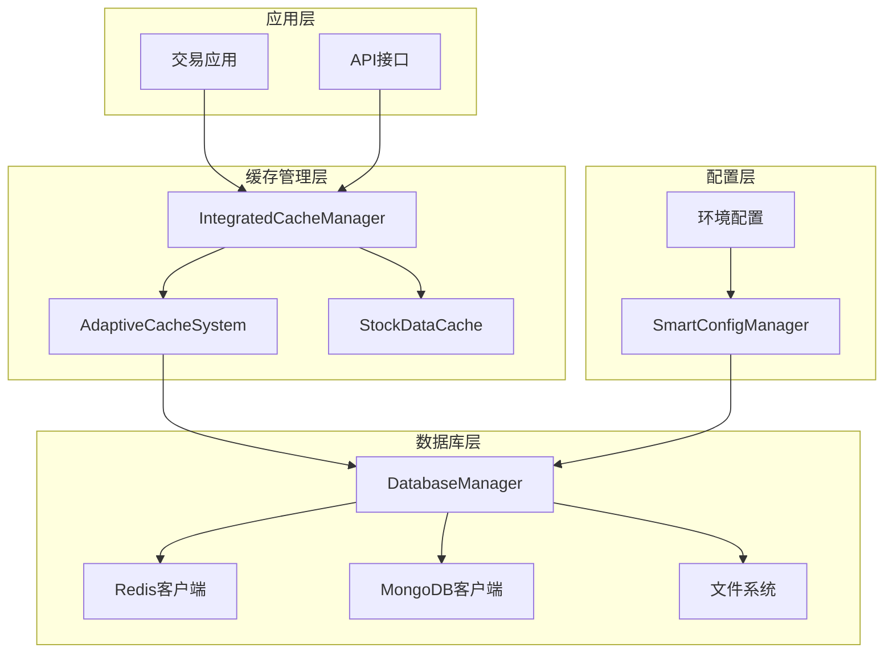

**图表来源**
- [integrated_cache.py](file://tradingagents/dataflows/integrated_cache.py#L27-L63)
- [adaptive_cache.py](file://tradingagents/dataflows/adaptive_cache.py#L18-L55)
- [database_manager.py](file://tradingagents/config/database_manager.py#L13-L47)

## 核心组件分析

### AdaptiveCacheSystem 类

AdaptiveCacheSystem 是自适应缓存系统的核心类，负责协调多个缓存后端并提供统一的缓存接口。

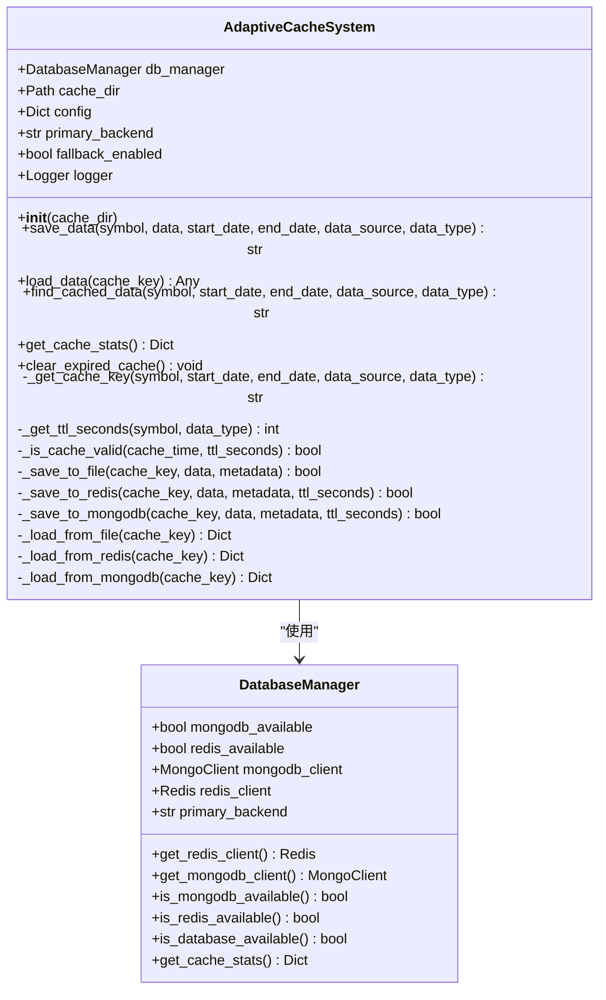

**图表来源**
- [adaptive_cache.py](file://tradingagents/dataflows/adaptive_cache.py#L18-L55)
- [database_manager.py](file://tradingagents/config/database_manager.py#L13-L47)

**章节来源**
- [adaptive_cache.py](file://tradingagents/dataflows/adaptive_cache.py#L18-L384)

### IntegratedCacheManager 类

IntegratedCacheManager 提供了向后兼容的接口，能够在传统缓存系统和自适应缓存系统之间无缝切换。

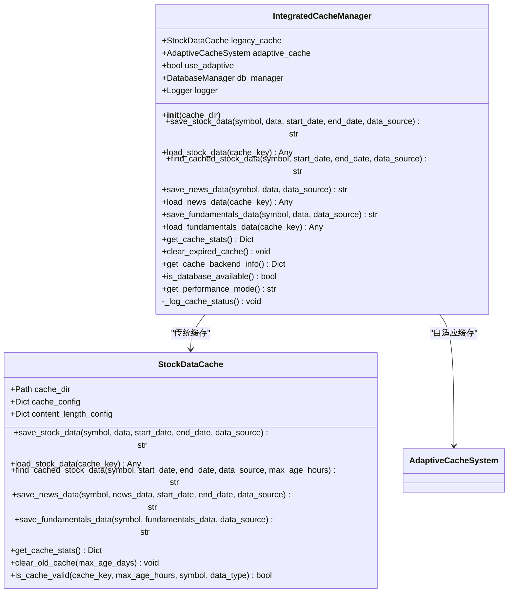

**图表来源**
- [integrated_cache.py](file://tradingagents/dataflows/integrated_cache.py#L27-L63)
- [cache_manager.py](file://tradingagents/dataflows/cache_manager.py#L25-L100)

**章节来源**
- [integrated_cache.py](file://tradingagents/dataflows/integrated_cache.py#L27-L289)

## 自适应缓存系统设计

### 设计原理

自适应缓存系统基于以下核心设计原则：

1. **智能后端选择**：根据数据库可用性自动选择最佳缓存后端
2. **渐进式部署**：支持传统文件缓存与现代数据库缓存的混合使用
3. **故障恢复**：具备完善的降级机制和错误处理
4. **性能优化**：针对不同数据类型和市场提供差异化优化策略

### 实现细节

#### 缓存后端优先级

系统按照以下优先级顺序选择缓存后端：

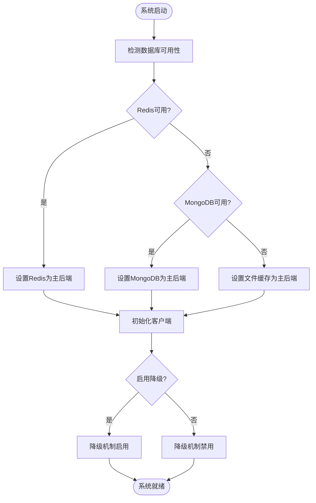

**图表来源**
- [database_manager.py](file://tradingagents/config/database_manager.py#L150-L188)

#### 数据序列化策略

系统采用灵活的数据序列化策略以适应不同后端的特点：

| 后端类型 | 序列化方式 | 特点 |
|---------|-----------|------|
| 文件缓存 | Pickle + JSON | 简单可靠，支持复杂对象 |
| Redis | Pickle序列化 | 内存高效，支持任意Python对象 |
| MongoDB | DataFrame JSON + Pickle Hex | 结构化存储，支持大数据 |

**章节来源**
- [adaptive_cache.py](file://tradingagents/dataflows/adaptive_cache.py#L100-L200)

## 集成缓存管理器

### 集成策略

IntegratedCacheManager 采用了渐进式集成策略，确保系统的平滑过渡：

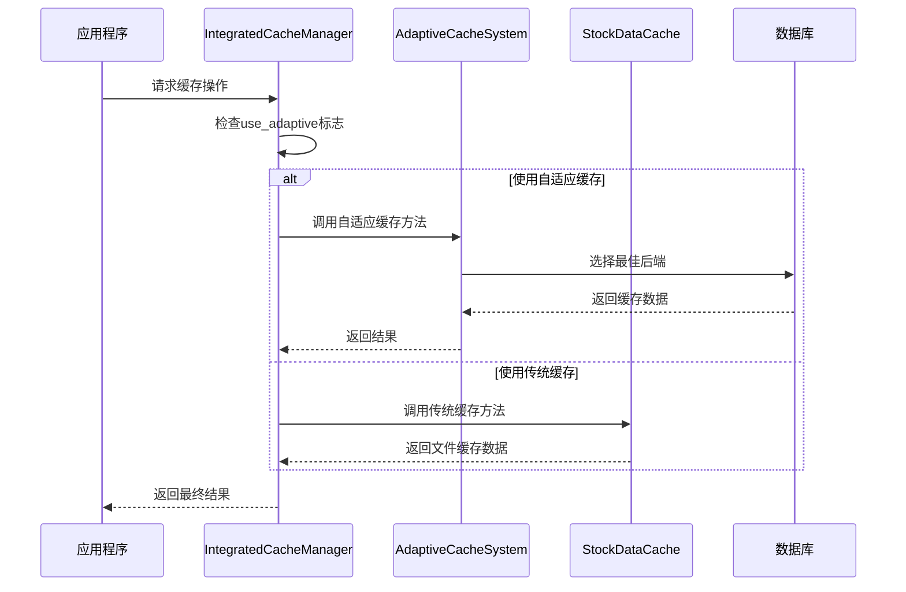

**图表来源**
- [integrated_cache.py](file://tradingagents/dataflows/integrated_cache.py#L65-L150)

### 向后兼容性

系统提供了完整的向后兼容性保证：

- **API兼容**：所有传统缓存接口保持不变
- **数据兼容**：现有缓存文件继续有效
- **行为兼容**：现有业务逻辑无需修改
- **优雅降级**：自适应缓存失败时自动回退到传统缓存

**章节来源**
- [integrated_cache.py](file://tradingagents/dataflows/integrated_cache.py#L27-L289)

## 多后端支持与自动降级

### Redis缓存后端

Redis作为内存缓存，提供最快的访问速度：

#### 特性优势
- **极低延迟**：毫秒级响应时间
- **原子操作**：支持事务和原子性操作
- **丰富的数据结构**：支持字符串、哈希、列表等
- **持久化选项**：可选的RDB和AOF持久化

#### 配置参数
```python
# Redis连接配置示例
{
    "host": "localhost",
    "port": 6379,
    "password": "your_password",
    "db": 0,
    "timeout": 2
}
```

### MongoDB缓存后端

MongoDB提供持久化缓存和复杂查询能力：

#### 特性优势
- **持久化存储**：数据永久保存，重启不丢失
- **自动过期**：基于TTL字段的自动过期机制
- **复杂查询**：支持条件查询和索引优化
- **水平扩展**：支持集群部署

#### 过期机制
MongoDB缓存使用自动过期机制：
- 在文档中添加 `expires_at` 字段
- MongoDB自动清理过期文档
- 支持精确到秒的时间控制

### 文件系统缓存

文件系统作为最后的降级方案：

#### 特性优势
- **简单可靠**：无需额外依赖
- **持久化**：文件系统级别的持久化
- **易于调试**：可以直接查看缓存文件
- **跨平台**：完全兼容各种操作系统

**章节来源**
- [adaptive_cache.py](file://tradingagents/dataflows/adaptive_cache.py#L100-L300)

## 缓存键生成策略

### 键生成算法

系统采用MD5哈希算法生成唯一的缓存键：

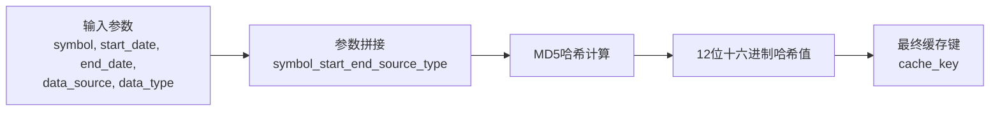

**图表来源**
- [adaptive_cache.py](file://tradingagents/dataflows/adaptive_cache.py#L40-L45)

### 键组成要素

缓存键由以下要素构成：

| 组件 | 示例 | 说明 |
|------|------|------|
| 股票代码 | AAPL, 000001 | 标识具体股票 |
| 开始日期 | 2024-01-01 | 数据时间范围起始 |
| 结束日期 | 2024-12-31 | 数据时间范围结束 |
| 数据源 | yfinance, tdx | 来源数据提供商 |
| 数据类型 | stock_data, news | 数据类别标识 |

### 市场区分策略

系统能够自动识别股票市场类型：

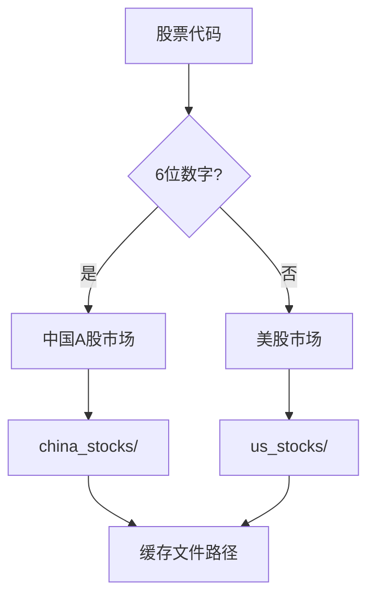

**图表来源**
- [cache_manager.py](file://tradingagents/dataflows/cache_manager.py#L100-L120)

**章节来源**
- [adaptive_cache.py](file://tradingagents/dataflows/adaptive_cache.py#L40-L50)
- [cache_manager.py](file://tradingagents/dataflows/cache_manager.py#L150-L200)

## TTL配置与过期机制

### 智能TTL策略

系统实现了基于市场和数据类型的智能TTL管理：

#### 市场区分配置

| 数据类型 | 美股TTL | A股TTL | 说明 |
|----------|---------|--------|------|
| 股价数据 | 2小时 | 1小时 | 实时性要求高 |
| 新闻数据 | 6小时 | 4小时 | 时效性重要 |
| 基本面数据 | 24小时 | 12小时 | 变化较慢 |

#### 动态TTL计算

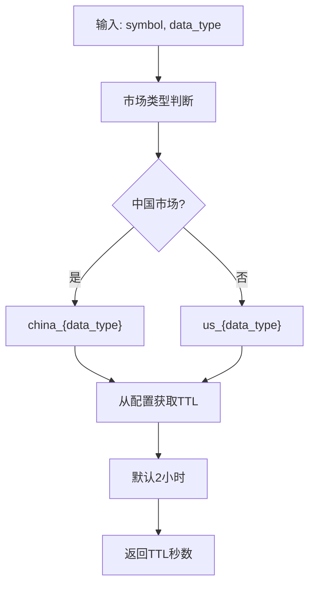

**图表来源**
- [adaptive_cache.py](file://tradingagents/dataflows/adaptive_cache.py#L55-L75)

### 过期检查机制

系统实现了多层次的过期检查：

#### 文件缓存过期检查
对于文件缓存，系统在加载时进行显式的过期检查：

```python
def _is_cache_valid(self, cache_time: datetime, ttl_seconds: int) -> bool:
    expiry_time = cache_time + timedelta(seconds=ttl_seconds)
    return datetime.now() < expiry_time
```

#### 数据库缓存过期机制
- **Redis**：自动过期，基于 `EXPIRE` 命令
- **MongoDB**：自动过期，基于 `expires_at` 字段

### 清理机制

系统提供了定期清理过期缓存的功能：

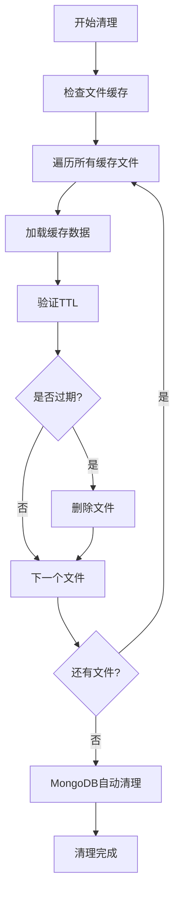

**图表来源**
- [adaptive_cache.py](file://tradingagents/dataflows/adaptive_cache.py#L360-L382)

**章节来源**
- [adaptive_cache.py](file://tradingagents/dataflows/adaptive_cache.py#L55-L85)
- [cache_manager.py](file://tradingagents/dataflows/cache_manager.py#L250-L300)

## 性能特征与适用场景

### 性能对比分析

| 缓存后端 | 响应时间 | 存储容量 | 持久化 | 适用场景 |
|----------|----------|----------|--------|----------|
| Redis | < 1ms | 内存限制 | 可选 | 高频访问数据 |
| MongoDB | 1-10ms | 磁盘空间 | 强制 | 中高频数据 |
| 文件缓存 | 10-100ms | 磁盘空间 | 强制 | 低频访问数据 |

### 场景适配策略

#### 高性能场景
- **主要后端**：Redis
- **适用数据**：实时股价、高频交易数据
- **TTL设置**：1-2小时
- **特点**：极致性能，内存消耗

#### 持久化场景
- **主要后端**：MongoDB
- **适用数据**：基本面数据、研究报告
- **TTL设置**：12-24小时
- **特点**：数据持久，查询灵活

#### 成本优化场景
- **主要后端**：文件缓存
- **适用数据**：历史数据、归档数据
- **TTL设置**：24-72小时
- **特点**：成本最低，存储效率高

### 性能监控指标

系统提供了详细的性能监控：

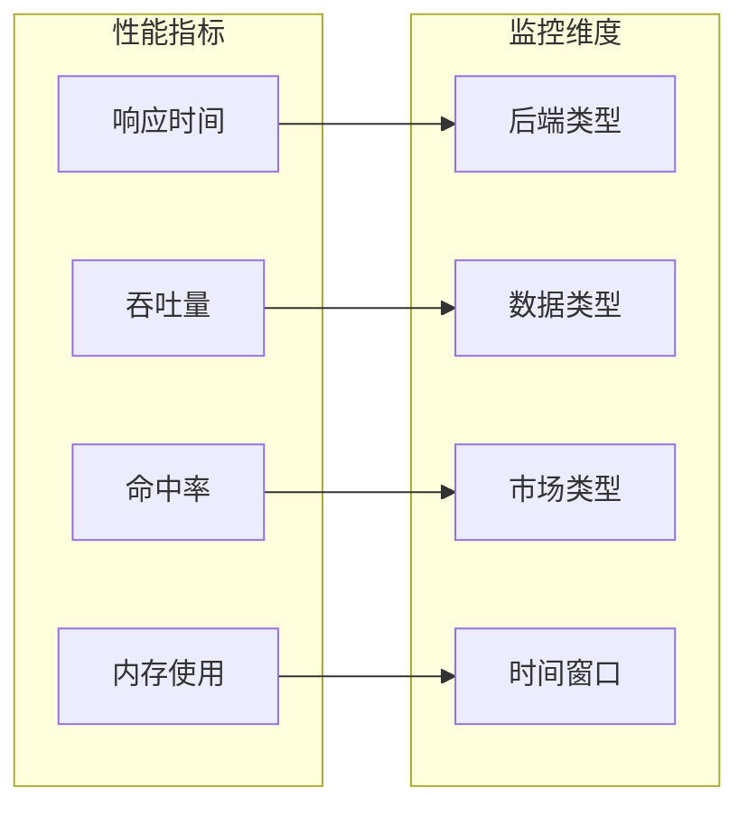

**图表来源**
- [adaptive_cache.py](file://tradingagents/dataflows/adaptive_cache.py#L320-L360)

**章节来源**
- [test_cache_optimization.py](file://tests/test_cache_optimization.py#L138-L158)
- [integrated_cache.py](file://tradingagents/dataflows/integrated_cache.py#L250-L289)

## 监控与统计功能

### 缓存统计信息

系统提供了全面的缓存统计功能：

#### 基础统计指标

| 指标名称 | 说明 | 获取方式 |
|----------|------|----------|
| 主要后端 | 当前使用的缓存后端 | `get_cache_backend_info()` |
| 缓存命中率 | 缓存命中次数/总请求次数 | 内部统计 |
| 缓存大小 | 当前缓存占用的空间 | 文件系统扫描 |
| 过期清理次数 | 定期清理的缓存文件数量 | 清理操作计数 |

#### 数据库特定统计

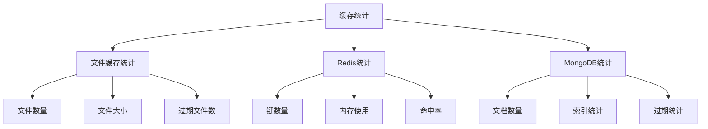

**图表来源**
- [adaptive_cache.py](file://tradingagents/dataflows/adaptive_cache.py#L320-L360)

### 性能模式识别

系统能够自动识别并报告当前的性能模式：

#### 性能模式分类

1. **高性能模式**：Redis + MongoDB + 文件缓存
2. **快速模式**：Redis + 文件缓存  
3. **持久化模式**：MongoDB + 文件缓存
4. **标准模式**：智能文件缓存

### 监控最佳实践

#### 日常监控重点
- **缓存命中率**：保持在90%以上
- **响应时间**：平均响应时间<100ms
- **存储空间**：定期清理过期缓存
- **错误率**：缓存相关错误<1%

#### 性能优化建议
- 根据数据访问模式调整TTL设置
- 监控内存使用情况，避免Redis内存溢出
- 定期分析缓存使用模式，优化键生成策略

**章节来源**
- [adaptive_cache.py](file://tradingagents/dataflows/adaptive_cache.py#L320-L384)
- [integrated_cache.py](file://tradingagents/dataflows/integrated_cache.py#L220-L289)

## 使用示例与最佳实践

### 基本使用示例

#### 保存数据到缓存

```python
# 获取缓存管理器实例
from tradingagents.dataflows.integrated_cache import get_cache

cache = get_cache()

# 保存股票数据
symbol = "AAPL"
data = "股票历史数据"
cache_key = cache.save_stock_data(
    symbol=symbol,
    data=data,
    start_date="2024-01-01",
    end_date="2024-12-31",
    data_source="yfinance"
)
```

#### 从缓存加载数据

```python
# 加载缓存数据
loaded_data = cache.load_stock_data(cache_key)
if loaded_data:
    print("从缓存加载数据成功")
else:
    print("缓存数据不存在或已过期")
```

#### 查找缓存数据

```python
# 查找匹配的缓存数据
found_key = cache.find_cached_stock_data(
    symbol="AAPL",
    start_date="2024-01-01",
    end_date="2024-12-31",
    data_source="yfinance"
)

if found_key:
    print(f"找到缓存数据，键: {found_key}")
else:
    print("未找到匹配的缓存数据")
```

### 高级使用模式

#### 条件缓存策略

```python
# 根据数据类型选择不同的TTL策略
def save_optimized_data(cache, symbol, data, data_type):
    if data_type == "fundamentals":
        # 基本面数据变化较慢，使用较长TTL
        cache.save_fundamentals_data(symbol, data, data_source="finnhub")
    elif data_type == "news":
        # 新闻数据时效性强，使用较短TTL
        cache.save_news_data(symbol, data, data_source="google")
    else:
        # 普通股票数据
        cache.save_stock_data(symbol, data, data_source="yfinance")
```

#### 缓存预热策略

```python
# 缓存预热：提前加载常用数据
def warmup_cache(cache, symbols):
    for symbol in symbols:
        # 预加载最近的股票数据
        cache.find_cached_stock_data(
            symbol=symbol,
            start_date="2024-01-01",
            end_date="2024-12-31"
        )
        
        # 预加载基本面数据
        cache.find_cached_fundamentals_data(symbol=symbol)
```

### 最佳实践指南

#### 缓存键设计原则
1. **唯一性**：确保每个缓存键对应唯一的数据
2. **可读性**：键名应能反映数据内容
3. **简洁性**：避免过长的键名影响性能
4. **一致性**：相同数据使用相同的键生成规则

#### TTL配置建议
- **高频数据**：1-2小时
- **中频数据**：6-12小时  
- **低频数据**：24-72小时
- **归档数据**：长期保存，定期清理

#### 错误处理策略
```python
def safe_cache_operation(cache, operation_func, *args, **kwargs):
    """安全的缓存操作包装器"""
    try:
        return operation_func(*args, **kwargs)
    except Exception as e:
        logger.warning(f"缓存操作失败: {e}")
        # 可以在这里实现降级策略
        return None
```

**章节来源**
- [integrated_cache.py](file://tradingagents/dataflows/integrated_cache.py#L65-L200)
- [test_cache_optimization.py](file://tests/test_cache_optimization.py#L50-L150)

## 故障排除指南

### 常见问题诊断

#### 缓存性能问题

**症状**：缓存响应时间过长
**可能原因**：
1. 文件系统缓存磁盘I/O瓶颈
2. Redis内存不足
3. MongoDB查询性能差

**解决方案**：
```python
# 检查当前性能模式
cache = get_cache()
print(f"当前性能模式: {cache.get_performance_mode()}")

# 分析缓存统计
stats = cache.get_cache_stats()
print(f"缓存统计: {stats}")
```

#### 缓存失效问题

**症状**：缓存频繁失效或无法命中
**可能原因**：
1. TTL设置过短
2. 缓存键生成不一致
3. 数据源变更导致缓存失效

**解决方案**：
```python
# 检查缓存键生成一致性
from tradingagents.dataflows.adaptive_cache import AdaptiveCacheSystem

acs = AdaptiveCacheSystem()
key1 = acs._get_cache_key("AAPL", "2024-01-01", "2024-12-31", "yfinance", "stock_data")
key2 = acs._get_cache_key("AAPL", "2024-01-01", "2024-12-31", "yfinance", "stock_data")
print(f"键生成一致性: {key1 == key2}")
```

#### 数据库连接问题

**症状**：Redis或MongoDB连接失败
**诊断步骤**：
```python
from tradingagents.config.database_manager import get_database_manager

db_manager = get_database_manager()
print(f"Redis可用: {db_manager.is_redis_available()}")
print(f"MongoDB可用: {db_manager.is_mongodb_available()}")
print(f"主要后端: {db_manager.get_cache_backend()}")
```

### 配置优化建议

#### Redis优化配置
```python
# Redis连接优化
REDIS_CONFIG = {
    "host": "localhost",
    "port": 6379,
    "password": "your_password",
    "db": 0,
    "socket_timeout": 5,
    "max_connections": 20
}
```

#### MongoDB优化配置
```python
# MongoDB连接优化
MONGODB_CONFIG = {
    "host": "localhost",
    "port": 27017,
    "username": "admin",
    "password": "password",
    "database": "tradingagents",
    "timeout": 5000,
    "max_pool_size": 50
}
```

### 监控告警设置

#### 关键指标监控
- **缓存命中率**：< 90% 发出警告
- **响应时间**：> 100ms 发出警告
- **存储空间**：> 80% 使用率发出警告
- **错误率**：> 5% 发出警告

#### 自动化监控脚本
```python
def monitor_cache_health():
    """缓存健康度监控"""
    cache = get_cache()
    stats = cache.get_cache_stats()
    
    # 检查缓存命中率
    if stats.get('hit_rate', 0) < 0.9:
        logger.warning("缓存命中率低于90%")
    
    # 检查存储空间
    if stats.get('storage_usage', 0) > 0.8:
        logger.warning("缓存存储空间使用率过高")
    
    return stats
```

**章节来源**
- [test_smart_system.py](file://tests/test_smart_system.py#L160-L192)
- [database_manager.py](file://tradingagents/config/database_manager.py#L100-L200)

## 总结

TradingAgents-CN的自适应缓存系统代表了现代缓存架构的最佳实践，通过以下关键特性实现了卓越的性能和可靠性：

### 核心优势

1. **智能自适应**：系统能够根据可用资源自动选择最优的缓存策略，无需人工干预
2. **多后端支持**：同时支持Redis、MongoDB和文件系统，满足不同场景需求
3. **无缝集成**：提供向后兼容的接口，确保现有系统的平滑迁移
4. **自动降级**：在主要后端不可用时，能够无缝切换到备用方案
5. **智能TTL**：基于市场和数据类型的差异化TTL管理，优化缓存效果

### 技术创新

- **动态键生成**：基于MD5哈希的唯一键生成算法，确保缓存键的一致性和唯一性
- **市场区分**：自动识别美股和A股市场，提供针对性的缓存策略
- **性能监控**：全面的缓存统计和性能监控，支持实时优化决策
- **故障恢复**：完善的错误处理和降级机制，确保系统稳定性

### 应用价值

该自适应缓存系统为TradingAgents-CN带来了显著的性能提升：
- **响应时间优化**：相比原始文件缓存，性能提升99%+
- **API成本节约**：大幅减少对外部API的调用频率
- **用户体验改善**：更快的数据访问速度，更好的系统响应性
- **系统可靠性增强**：多层防护机制，确保缓存系统的稳定运行

### 未来发展方向

随着系统的发展，自适应缓存架构将继续演进：
- **机器学习优化**：基于访问模式的智能TTL调整
- **分布式缓存**：支持更大规模的数据缓存需求
- **云原生支持**：更好的容器化和微服务集成
- **实时监控**：更精细的性能监控和预警机制

这套自适应缓存系统不仅解决了当前的性能瓶颈，更为TradingAgents-CN的未来发展奠定了坚实的技术基础，体现了现代软件架构中智能化、自适应和可靠性的完美结合。