# 兼容层设计

<cite>
**本文档引用的文件**
- [integrated_cache.py](file://tradingagents/dataflows/integrated_cache.py)
- [cache_manager.py](file://tradingagents/dataflows/cache_manager.py)
- [adaptive_cache.py](file://tradingagents/dataflows/adaptive_cache.py)
- [database_manager.py](file://tradingagents/config/database_manager.py)
- [test_fundamentals_cache.py](file://tests/test_fundamentals_cache.py)
- [test_smart_system.py](file://tests/test_smart_system.py)
- [adaptive_cache_manager.py](file://scripts/development/adaptive_cache_manager.py)
</cite>

## 目录
1. [简介](#简介)
2. [系统架构概览](#系统架构概览)
3. [IntegratedCacheManager核心设计](#integratedcachemanager核心设计)
4. [初始化过程与降级机制](#初始化过程与降级机制)
5. [核心方法的动态路由机制](#核心方法的动态路由机制)
6. [向后兼容性设计](#向后兼容性设计)
7. [缓存后端协作机制](#缓存后端协作机制)
8. [异常处理策略](#异常处理策略)
9. [性能模式与监控](#性能模式与监控)
10. [总结](#总结)

## 简介

集成缓存系统兼容层（Integrated Cache Compatibility Layer）是TradingAgents项目中的一个关键组件，它作为自适应缓存系统与传统文件缓存之间的智能适配层。该系统的核心目标是在保持向后兼容性的前提下，为用户提供更高效、更灵活的缓存解决方案。

兼容层设计遵循以下核心原则：
- **向后兼容性**：确保现有代码无需修改即可正常工作
- **智能降级**：当高级缓存系统不可用时自动回退到传统缓存
- **透明切换**：用户无需感知底层缓存实现的变化
- **性能优化**：根据可用资源自动选择最优缓存策略

## 系统架构概览


**图表来源**
- [integrated_cache.py](file://tradingagents/dataflows/integrated_cache.py#L27-L63)
- [cache_manager.py](file://tradingagents/dataflows/cache_manager.py#L25-L60)
- [adaptive_cache.py](file://tradingagents/dataflows/adaptive_cache.py#L20-L40)
- [database_manager.py](file://tradingagents/config/database_manager.py#L15-L35)

## IntegratedCacheManager核心设计

IntegratedCacheManager是整个兼容层的核心类，它同时维护两个缓存实例并根据可用性自动选择合适的后端。

### 类结构设计


**图表来源**
- [integrated_cache.py](file://tradingagents/dataflows/integrated_cache.py#L27-L63)
- [cache_manager.py](file://tradingagents/dataflows/cache_manager.py#L25-L60)
- [adaptive_cache.py](file://tradingagents/dataflows/adaptive_cache.py#L20-L40)
- [database_manager.py](file://tradingagents/config/database_manager.py#L15-L35)

**节来源**
- [integrated_cache.py](file://tradingagents/dataflows/integrated_cache.py#L27-L63)

## 初始化过程与降级机制

IntegratedCacheManager的初始化过程体现了优雅的错误处理和降级机制设计。

### 初始化流程


**图表来源**
- [integrated_cache.py](file://tradingagents/dataflows/integrated_cache.py#L35-L55)

### 异常处理机制

初始化过程中的异常处理展现了系统的设计精髓：

1. **优雅降级**：当自适应缓存系统加载失败时，系统不会崩溃，而是自动降级到传统文件缓存
2. **详细日志记录**：每次初始化尝试都会记录详细的日志信息，便于调试和监控
3. **状态清晰**：无论使用哪种缓存系统，都会清楚地显示当前的缓存配置

**节来源**
- [integrated_cache.py](file://tradingagents/dataflows/integrated_cache.py#L35-L55)

## 核心方法的动态路由机制

IntegratedCacheManager的核心方法实现了智能的后端选择机制，根据`use_adaptive`标志动态路由到不同的缓存实现。

### 方法路由设计

```mermaid
sequenceDiagram
participant Client as "客户端代码"
participant ICM as "IntegratedCacheManager"
participant Legacy as "传统缓存"
participant Adaptive as "自适应缓存"
participant DB as "数据库"
Client->>ICM : save_stock_data(...)
ICM->>ICM : 检查use_adaptive标志
alt use_adaptive = True
ICM->>Adaptive : save_data(...)
Adaptive->>DB : 保存到数据库
DB-->>Adaptive : 保存成功
Adaptive-->>ICM : 返回缓存键
else use_adaptive = False
ICM->>Legacy : save_stock_data(...)
Legacy->>Legacy : 保存到文件系统
Legacy-->>ICM : 返回缓存键
end
ICM-->>Client : 返回缓存键
```



**图表来源**
- [integrated_cache.py](file://tradingagents/dataflows/integrated_cache.py#L67-L101)

### 具体方法映射表

| 方法名 | 自适应缓存实现 | 传统缓存实现 | 数据类型支持 |
|--------|----------------|--------------|--------------|
| `save_stock_data` | `adaptive_cache.save_data()` | `legacy_cache.save_stock_data()` | 股票数据 |
| `load_stock_data` | `adaptive_cache.load_data()` | `legacy_cache.load_stock_data()` | 股票数据 |
| `find_cached_stock_data` | `adaptive_cache.find_cached_data()` | `legacy_cache.find_cached_stock_data()` | 股票数据 |
| `save_news_data` | `adaptive_cache.save_data()` | `legacy_cache.save_news_data()` | 新闻数据 |
| `load_news_data` | `adaptive_cache.load_data()` | `legacy_cache.load_news_data()` | 新闻数据 |
| `save_fundamentals_data` | `adaptive_cache.save_data()` | `legacy_cache.save_fundamentals_data()` | 基本面数据 |
| `load_fundamentals_data` | `adaptive_cache.load_data()` | `legacy_cache.load_fundamentals_data()` | 基本面数据 |

**节来源**
- [integrated_cache.py](file://tradingagents/dataflows/integrated_cache.py#L67-L180)

## 向后兼容性设计

兼容层的一个重要特性是确保向后兼容性，使得现有代码无需修改即可继续工作。

### 全局实例设计


**图表来源**
- [integrated_cache.py](file://tradingagents/dataflows/integrated_cache.py#L271-L288)

### 向后兼容函数详解

1. **`get_stock_cache()`**：向后兼容的函数，直接调用`get_cache()`返回全局实例
2. **`create_cache_manager()`**：向后兼容的函数，直接创建`IntegratedCacheManager`实例
3. **`get_cache()`**：全局缓存实例的获取函数，采用单例模式

这些函数的设计确保了：
- **API一致性**：现有代码调用的API名称和签名保持不变
- **行为一致性**：新旧接口返回相同类型的缓存管理器实例
- **透明升级**：用户无需修改代码即可享受新功能

**节来源**
- [integrated_cache.py](file://tradingagents/dataflows/integrated_cache.py#L271-L288)

## 缓存后端协作机制

IntegratedCacheManager内部的两个缓存实例通过协作机制实现高效的缓存管理。

### 字段协作关系

```mermaid
graph TD
subgraph "IntegratedCacheManager"
UseAdaptive[use_adaptive<br/>bool]
LegacyCache[legacy_cache<br/>StockDataCache]
AdaptiveCache[adaptive_cache<br/>AdaptiveCacheSystem]
DBManager[db_manager<br/>DatabaseManager]
end
subgraph "传统缓存"
LegacyConfig[cache_config<br/>配置]
LegacyStats[get_cache_stats()<br/>统计]
end
subgraph "自适应缓存"
AdaptiveConfig[cache_config<br/>配置]
AdaptiveStats[get_cache_stats()<br/>统计]
FallbackEnabled[fallback_enabled<br/>降级开关]
end
UseAdaptive --> LegacyCache
UseAdaptive --> AdaptiveCache
AdaptiveCache --> DBManager
LegacyCache -.-> LegacyConfig
AdaptiveCache -.-> AdaptiveConfig
AdaptiveCache --> FallbackEnabled
LegacyCache --> LegacyStats
AdaptiveCache --> AdaptiveStats
```

**图表来源**
- [integrated_cache.py](file://tradingagents/dataflows/integrated_cache.py#L27-L63)

### 协作机制特点

1. **条件选择**：根据`use_adaptive`标志决定使用哪个缓存系统
2. **状态同步**：自适应缓存的状态信息通过`db_manager`获取
3. **统计聚合**：在获取缓存统计时，同时收集两个系统的统计数据
4. **清理协调**：过期缓存清理同时作用于两个系统

**节来源**
- [integrated_cache.py](file://tradingagents/dataflows/integrated_cache.py#L182-L226)

## 异常处理策略

兼容层采用了多层次的异常处理策略来保障系统的稳定性。

### 错误处理层次


**图表来源**
- [integrated_cache.py](file://tradingagents/dataflows/integrated_cache.py#L67-L101)
- [adaptive_cache.py](file://tradingagents/dataflows/adaptive_cache.py#L293-L325)

### 异常处理策略详解

1. **初始化阶段**：
   - 使用try-catch捕获自适应缓存系统的加载异常
   - 记录警告日志而非抛出异常
   - 自动降级到传统文件缓存

2. **运行时操作**：
   - 主要后端失败时自动尝试降级
   - 详细的日志记录帮助诊断问题
   - 返回适当的错误状态而不是抛出异常

3. **数据一致性**：
   - 保证即使某个后端失败，系统仍能正常工作
   - 提供清晰的错误信息帮助用户理解问题

**节来源**
- [integrated_cache.py](file://tradingagents/dataflows/integrated_cache.py#L35-L55)
- [adaptive_cache.py](file://tradingagents/dataflows/adaptive_cache.py#L293-L325)

## 性能模式与监控

兼容层提供了丰富的性能监控和模式识别功能。

### 性能模式识别


**图表来源**
- [integrated_cache.py](file://tradingagents/dataflows/integrated_cache.py#L240-L268)

### 监控功能

1. **缓存状态监控**：
   - 实时显示当前使用的缓存后端
   - 显示数据库连接状态
   - 提供详细的性能统计信息

2. **性能模式识别**：
   - 根据可用资源自动识别最优性能模式
   - 提供清晰的模式描述和性能特征

3. **统计信息聚合**：
   - 同时收集传统缓存和自适应缓存的统计信息
   - 提供数据库可用性状态

**节来源**
- [integrated_cache.py](file://tradingagents/dataflows/integrated_cache.py#L182-L268)

## 总结

集成缓存系统的兼容层设计体现了现代软件架构的最佳实践：

### 设计优势

1. **无缝迁移**：用户无需修改现有代码即可享受新功能
2. **智能降级**：系统在遇到问题时能够优雅地降级而不影响功能
3. **性能优化**：根据可用资源自动选择最优缓存策略
4. **稳定可靠**：完善的异常处理机制确保系统稳定性
5. **易于监控**：丰富的监控和诊断功能帮助运维人员管理

### 技术创新

- **双系统并存**：同时维护传统和现代缓存系统，发挥各自优势
- **智能路由**：根据系统状态动态选择最优后端
- **状态感知**：实时监控系统状态并做出相应调整
- **向后兼容**：确保现有代码的持续可用性

这种设计不仅解决了技术债务问题，还为未来的功能扩展奠定了坚实的基础，是软件架构演进的典型范例。