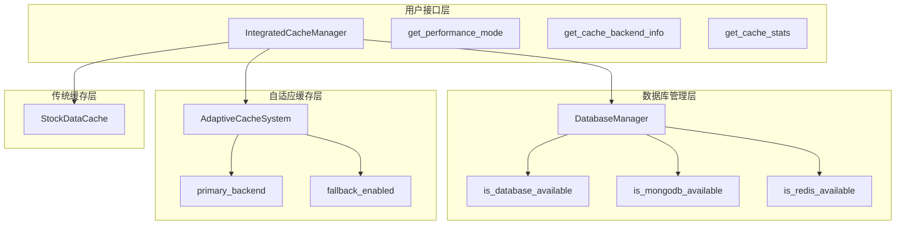
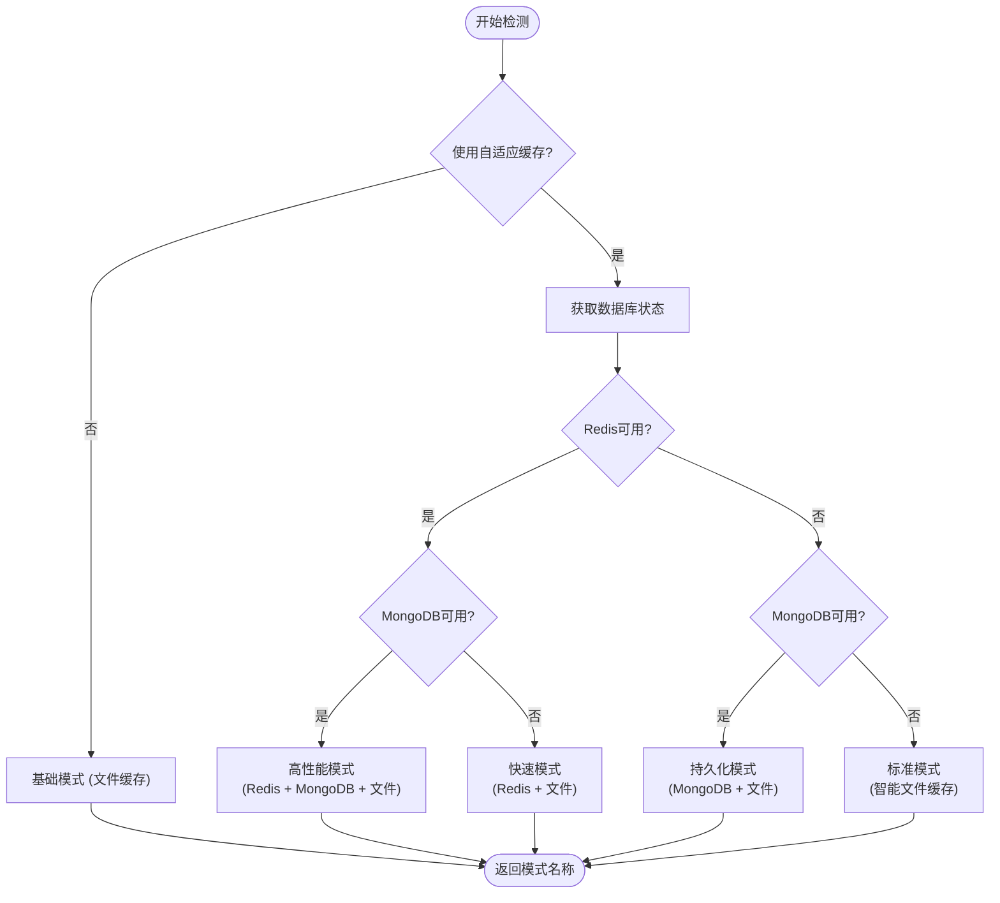
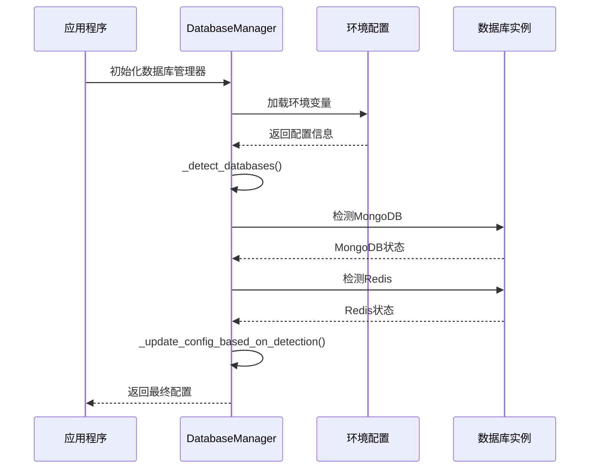
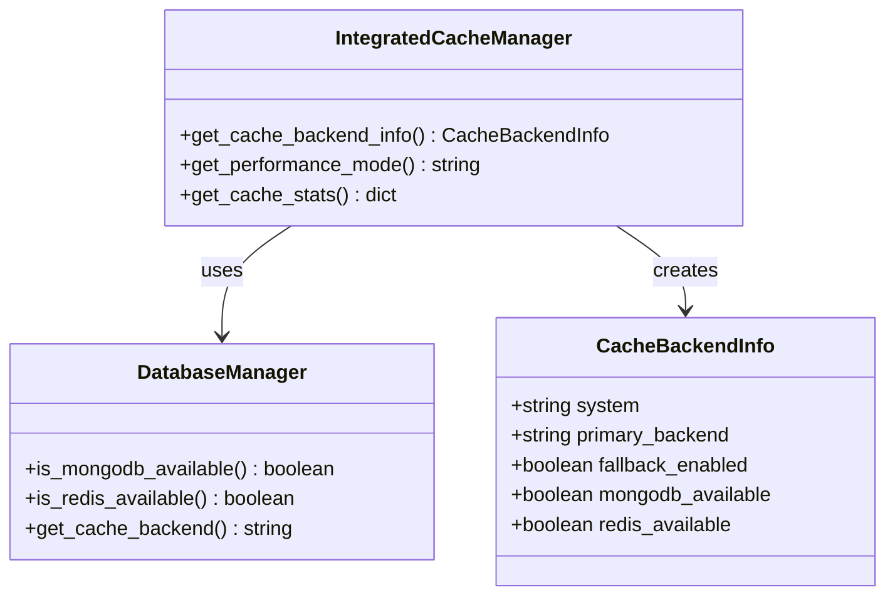
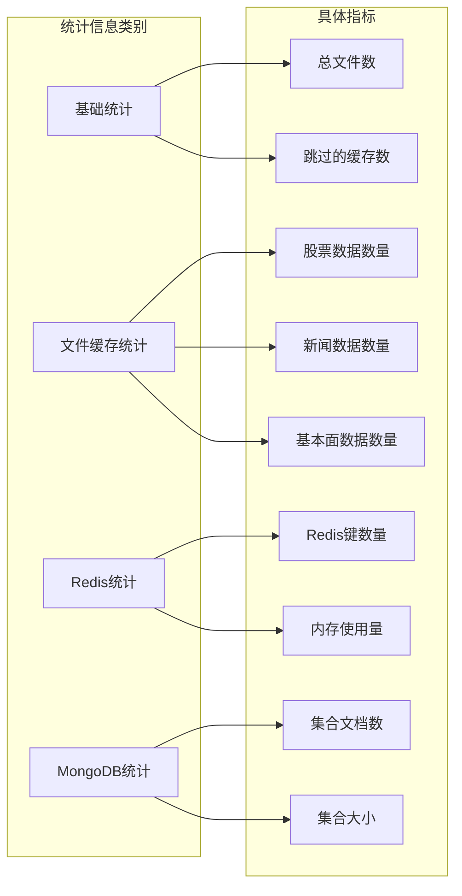

# 性能模式检测机制深度解析

<cite>
**本文档引用的文件**
- [integrated_cache.py](file://tradingagents/dataflows/integrated_cache.py)
- [database_manager.py](file://tradingagents/config/database_manager.py)
- [adaptive_cache.py](file://tradingagents/dataflows/adaptive_cache.py)
- [check_system_status.py](file://scripts/validation/check_system_status.py)
- [smart_config.py](file://scripts/validation/smart_config.py)
- [simple_env_test.py](file://tests/simple_env_test.py)
</cite>

## 目录
1. [概述](#概述)
2. [核心架构](#核心架构)
3. [性能模式检测机制](#性能模式检测机制)
4. [数据库可用性检测](#数据库可用性检测)
5. [缓存后端信息获取](#缓存后端信息获取)
6. [统计信息收集](#统计信息收集)
7. [实际应用示例](#实际应用示例)
8. [故障排除指南](#故障排除指南)
9. [总结](#总结)

## 概述

TradingAgents系统采用了一套智能的性能模式检测机制，能够根据当前环境的数据库支持情况动态调整缓存策略。该机制通过`get_performance_mode`方法为核心，结合多个检测函数，为用户提供清晰的性能状态描述和优化建议。

### 核心特性

- **自适应性能模式**：根据数据库可用性自动选择最优缓存策略
- **多层降级支持**：确保系统在任何环境下都能正常运行
- **实时状态监控**：提供详细的缓存系统状态信息
- **用户友好提示**：以易懂的方式描述当前性能状态

## 核心架构

系统采用分层架构设计，包含以下核心组件：



**图表来源**
- [integrated_cache.py](file://tradingagents/dataflows/integrated_cache.py#L25-L50)
- [database_manager.py](file://tradingagents/config/database_manager.py#L10-L30)

**章节来源**
- [integrated_cache.py](file://tradingagents/dataflows/integrated_cache.py#L25-L50)
- [database_manager.py](file://tradingagents/config/database_manager.py#L10-L30)

## 性能模式检测机制

### get_performance_mode方法详解

`get_performance_mode`方法是性能模式检测的核心，它根据数据库可用性组合返回不同的性能描述：



**图表来源**
- [integrated_cache.py](file://tradingagents/dataflows/integrated_cache.py#L253-L268)

### 性能模式分类

系统定义了五种主要的性能模式：

| 模式名称 | 数据库组合 | 性能特点 | 适用场景 |
|---------|-----------|----------|----------|
| 基础模式 | 仅文件缓存 | 较慢，稳定可靠 | 无数据库环境 |
| 标准模式 | 智能文件缓存 | 中等性能，自动优化 | 单数据库环境 |
| 快速模式 | Redis + 文件 | 快速访问，临时存储 | Redis可用 |
| 持久化模式 | MongoDB + 文件 | 持久化存储，数据安全 | MongoDB可用 |
| 高性能模式 | Redis + MongoDB + 文件 | 最佳性能，混合存储 | 双数据库可用 |

**章节来源**
- [integrated_cache.py](file://tradingagents/dataflows/integrated_cache.py#L253-L268)

## 数据库可用性检测

### 多层次检测机制

系统实现了多层次的数据库可用性检测：



**图表来源**
- [database_manager.py](file://tradingagents/config/database_manager.py#L148-L186)
- [database_manager.py](file://tradingagents/config/database_manager.py#L188-L221)

### 具体检测流程

每个数据库的检测都包含以下步骤：

1. **配置验证**：检查环境变量中是否启用了对应数据库
2. **依赖检查**：确认必要的Python包是否已安装
3. **连接测试**：尝试建立数据库连接
4. **功能验证**：执行基本操作测试连接有效性

**章节来源**
- [database_manager.py](file://tradingagents/config/database_manager.py#L148-L186)

## 缓存后端信息获取

### get_cache_backend_info方法

该方法提供详细的缓存系统信息：



**图表来源**
- [integrated_cache.py](file://tradingagents/dataflows/integrated_cache.py#L228-L245)
- [database_manager.py](file://tradingagents/config/database_manager.py#L253-L263)

### 信息字段说明

| 字段名 | 类型 | 描述 | 示例值 |
|--------|------|------|--------|
| system | string | 缓存系统类型 | "adaptive" / "legacy" |
| primary_backend | string | 主要缓存后端 | "redis" / "mongodb" / "file" |
| fallback_enabled | boolean | 是否启用降级 | true / false |
| mongodb_available | boolean | MongoDB是否可用 | true / false |
| redis_available | boolean | Redis是否可用 | true / false |

**章节来源**
- [integrated_cache.py](file://tradingagents/dataflows/integrated_cache.py#L228-L245)

## 统计信息收集

### get_cache_stats方法

该方法收集全面的缓存统计信息：



**图表来源**
- [integrated_cache.py](file://tradingagents/dataflows/integrated_cache.py#L192-L218)
- [adaptive_cache.py](file://tradingagents/dataflows/adaptive_cache.py#L313-L344)

### 统计信息结构

系统提供分层的统计信息：

1. **基础统计**：文件总数、跳过的缓存等
2. **数据类型统计**：按股票数据、新闻、基本面分类
3. **后端特定统计**：Redis键数量、MongoDB文档数等

**章节来源**
- [integrated_cache.py](file://tradingagents/dataflows/integrated_cache.py#L192-L218)

## 实际应用示例

### 系统状态检查示例

以下是系统状态检查脚本的典型输出：

```
📊 缓存系统状态:
  缓存系统: adaptive
  主要后端: redis
  降级支持: ✅ 启用
  性能模式: 高性能模式 (Redis + MongoDB + 文件)

📊 缓存统计:
  文件缓存数量: 156
  Redis键数量: 452
  MongoDB缓存数量: 123

⚡ 性能测试结果:
  保存时间: 0.002秒
  加载时间: 0.001秒
  🚀 相比API调用性能提升: 99.5%
```

### 不同环境下的模式识别

#### 环境1：双数据库可用
```
当前性能模式: 高性能模式 (Redis + MongoDB + 文件)
缓存性能: 极快 (<0.001秒)
相比API调用: 99%+ 性能提升
```

#### 环境2：仅Redis可用
```
当前性能模式: 快速模式 (Redis + 文件)
缓存性能: 很快 (<0.01秒)
相比API调用: 99%+ 性能提升
```

#### 环境3：仅MongoDB可用
```
当前性能模式: 持久化模式 (MongoDB + 文件)
缓存性能: 很快 (<0.01秒)
相比API调用: 99%+ 性能提升
```

#### 环境4：无数据库
```
当前性能模式: 基础模式 (文件缓存)
缓存性能: 较慢，但稳定可靠
相比API调用: 90%+ 性能提升
```

**章节来源**
- [check_system_status.py](file://scripts/validation/check_system_status.py#L99-L131)
- [smart_config.py](file://scripts/validation/smart_config.py#L216-L234)

## 故障排除指南

### 常见问题及解决方案

#### 1. 数据库连接失败

**症状**：系统显示"数据库不可用"或性能模式为"基础模式"

**排查步骤**：
1. 检查环境变量配置
2. 验证数据库服务是否运行
3. 确认网络连接和防火墙设置

**解决方案**：
```bash
# 启用数据库支持
export MONGODB_ENABLED=true
export REDIS_ENABLED=true

# 启动数据库服务
docker-compose up -d
```

#### 2. 缓存性能不佳

**症状**：加载时间超过0.1秒

**排查步骤**：
1. 检查当前使用的缓存后端
2. 分析数据库连接状态
3. 监控系统资源使用情况

**优化建议**：
- 启用Redis以获得更快的缓存访问
- 调整TTL设置以平衡性能和存储需求
- 定期清理过期缓存

#### 3. 降级机制失效

**症状**：主要后端不可用时系统异常

**排查步骤**：
1. 检查fallback_enabled配置
2. 验证文件缓存目录权限
3. 确认传统缓存系统正常工作

**章节来源**
- [check_system_status.py](file://scripts/validation/check_system_status.py#L219-L255)

## 总结

TradingAgents的性能模式检测机制通过智能的数据库可用性检测和自适应缓存策略，为用户提供了优化的缓存体验。该机制的主要优势包括：

### 核心价值

1. **无缝切换**：在不同数据库环境下自动选择最优策略
2. **性能优化**：通过多层缓存实现99%以上的性能提升
3. **稳定性保障**：完善的降级机制确保系统始终可用
4. **用户友好**：直观的性能模式描述和优化建议

### 技术亮点

- **智能检测**：自动识别可用的数据库服务
- **自适应配置**：根据环境动态调整缓存策略
- **全面监控**：提供详细的系统状态和性能统计
- **故障恢复**：可靠的降级机制保证系统连续性

这套性能模式检测机制不仅提升了系统的整体性能，还为用户提供了清晰的环境状态理解和优化指导，是TradingAgents系统架构中的重要组成部分。