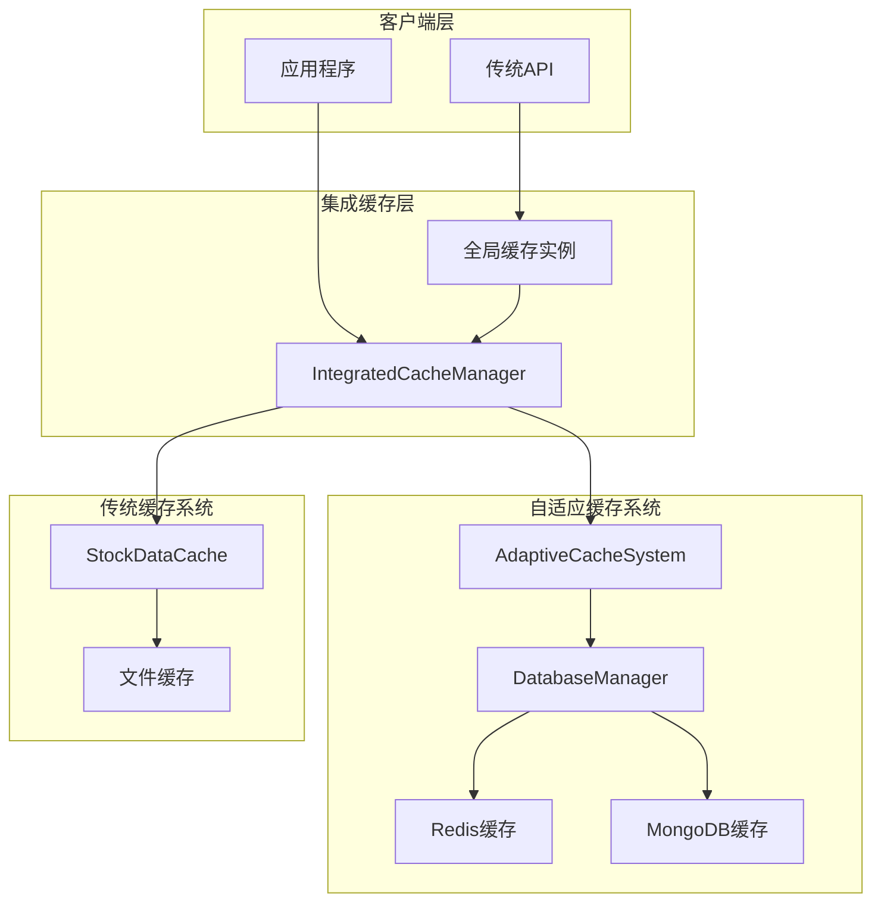
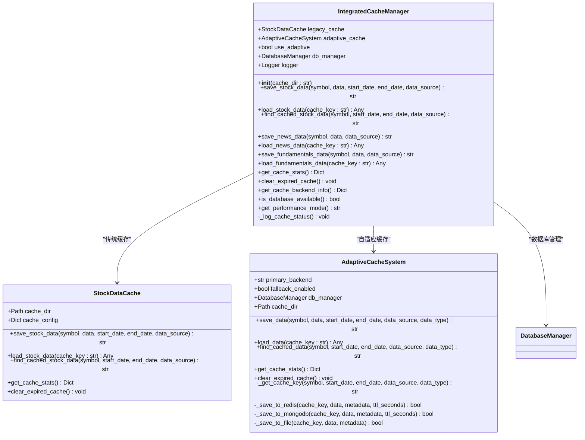
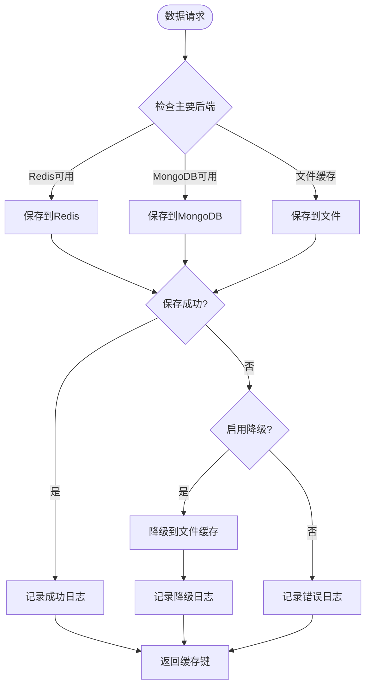
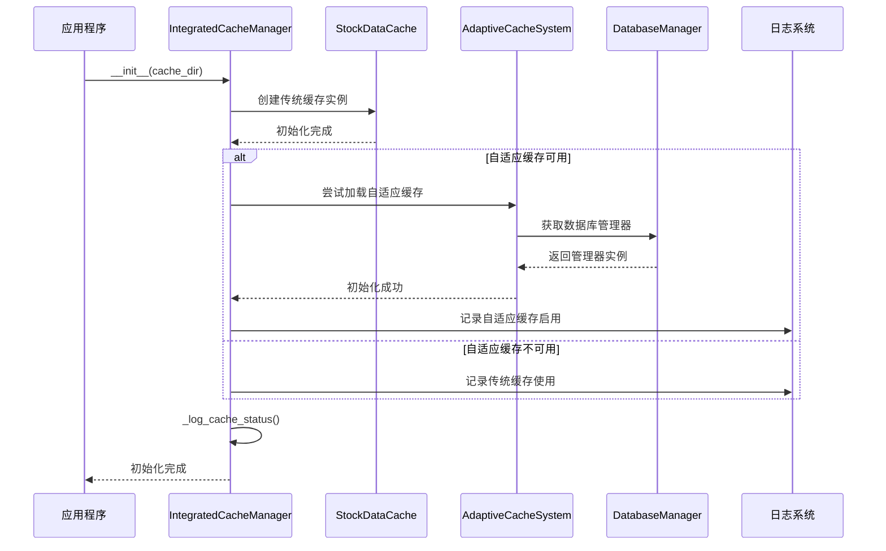
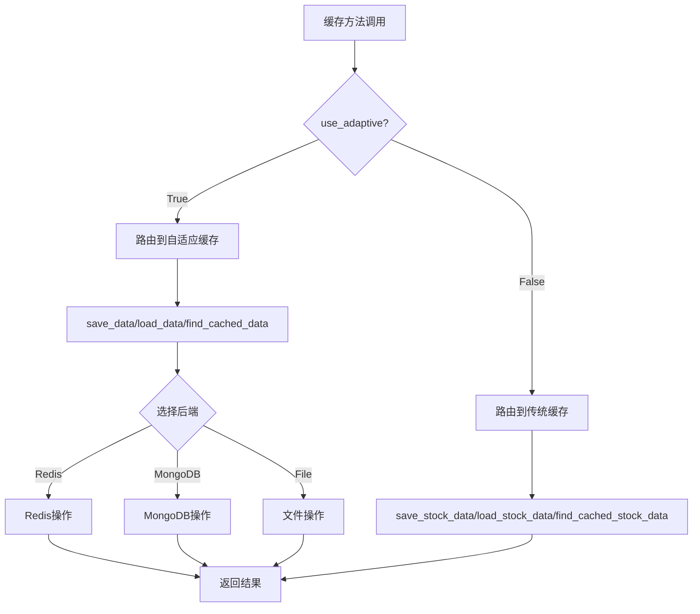
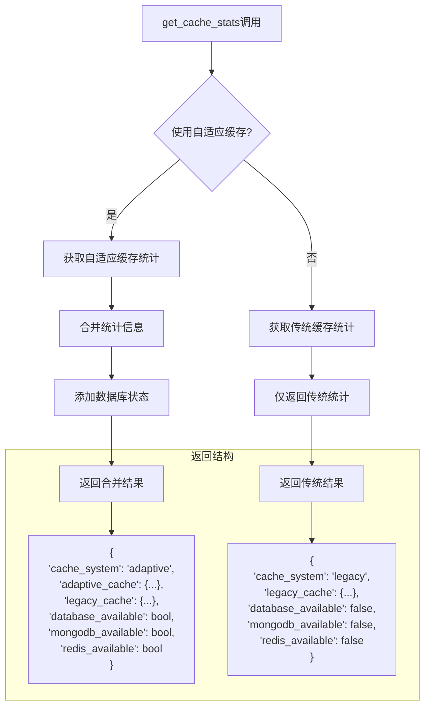
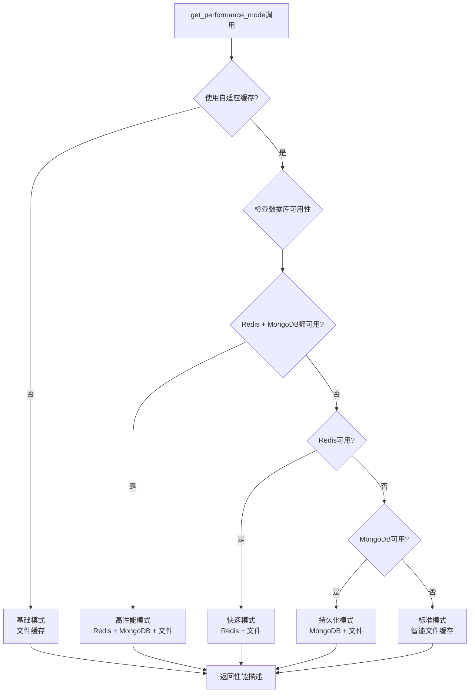
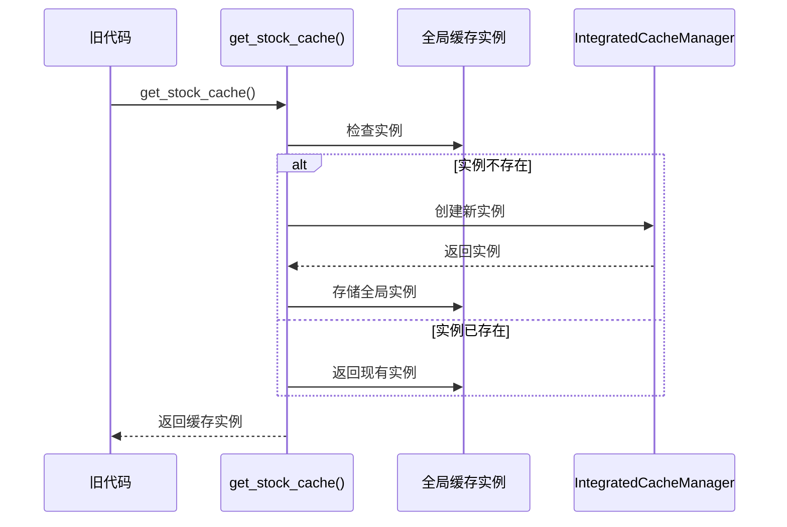

# 集成缓存系统

<cite>
**本文档引用的文件**
- [integrated_cache.py](file://tradingagents/dataflows/integrated_cache.py)
- [adaptive_cache.py](file://tradingagents/dataflows/adaptive_cache.py)
- [cache_manager.py](file://tradingagents/dataflows/cache_manager.py)
- [db_cache_manager.py](file://tradingagents/dataflows/db_cache_manager.py)
- [database_manager.py](file://tradingagents/config/database_manager.py)
- [database_config.py](file://tradingagents/config/database_config.py)
- [test_cache_optimization.py](file://tests/test_cache_optimization.py)
- [quick_test.py](file://tests/quick_test.py)
</cite>

## 目录
1. [简介](#简介)
2. [系统架构](#系统架构)
3. [核心组件分析](#核心组件分析)
4. [初始化过程](#初始化过程)
5. [智能路由机制](#智能路由机制)
6. [统计信息聚合](#统计信息聚合)
7. [性能模式识别](#性能模式识别)
8. [向后兼容性](#向后兼容性)
9. [使用示例](#使用示例)
10. [故障排除](#故障排除)
11. [总结](#总结)

## 简介

集成缓存管理器(IntegratedCacheManager)是TradingAgents系统中的核心组件，作为自适应缓存系统和传统文件缓存之间的智能兼容层。该系统设计目标是在保持向后兼容性的基础上，提供高性能的缓存解决方案，支持多种缓存后端的自动选择和优雅降级。

系统的主要特点包括：
- **智能后端选择**：根据数据库可用性自动选择最佳缓存策略
- **优雅降级**：当高级缓存系统不可用时自动回退到传统文件缓存
- **向后兼容**：完全兼容现有API，确保旧有代码无缝迁移
- **多层统计**：提供全面的缓存性能和状态监控
- **灵活配置**：支持多种部署场景和性能需求

## 系统架构



**图表来源**
- [integrated_cache.py](file://tradingagents/dataflows/integrated_cache.py#L27-L63)
- [adaptive_cache.py](file://tradingagents/dataflows/adaptive_cache.py#L25-L60)
- [cache_manager.py](file://tradingagents/dataflows/cache_manager.py#L25-L50)

## 核心组件分析

### IntegratedCacheManager 类

集成缓存管理器是整个系统的核心控制器，负责协调自适应缓存和传统缓存系统的工作。



**图表来源**
- [integrated_cache.py](file://tradingagents/dataflows/integrated_cache.py#L27-L63)
- [adaptive_cache.py](file://tradingagents/dataflows/adaptive_cache.py#L25-L60)
- [cache_manager.py](file://tradingagents/dataflows/cache_manager.py#L25-L50)

**章节来源**
- [integrated_cache.py](file://tradingagents/dataflows/integrated_cache.py#L27-L63)
- [adaptive_cache.py](file://tradingagents/dataflows/adaptive_cache.py#L25-L60)
- [cache_manager.py](file://tradingagents/dataflows/cache_manager.py#L25-L50)

### AdaptiveCacheSystem 类

自适应缓存系统提供了智能的缓存策略，能够根据数据库可用性自动选择最佳的缓存后端。



**图表来源**
- [adaptive_cache.py](file://tradingagents/dataflows/adaptive_cache.py#L200-L250)

**章节来源**
- [adaptive_cache.py](file://tradingagents/dataflows/adaptive_cache.py#L200-L250)

## 初始化过程

集成缓存管理器的初始化过程体现了系统的优雅设计和容错能力。



**图表来源**
- [integrated_cache.py](file://tradingagents/dataflows/integrated_cache.py#L35-L63)
- [adaptive_cache.py](file://tradingagents/dataflows/adaptive_cache.py#L25-L60)

### 初始化关键步骤

1. **传统缓存初始化**：始终创建StockDataCache实例作为后备
2. **自适应缓存检测**：检查ADAPTIVE_CACHE_AVAILABLE标志
3. **优雅降级**：如果自适应缓存失败，继续使用传统缓存
4. **状态记录**：通过日志系统记录当前配置和可用性

**章节来源**
- [integrated_cache.py](file://tradingagents/dataflows/integrated_cache.py#L35-L63)

## 智能路由机制

集成缓存管理器的核心功能是根据use_adaptive标志智能路由到不同的缓存后端。

### 方法路由策略



**图表来源**
- [integrated_cache.py](file://tradingagents/dataflows/integrated_cache.py#L65-L150)

### 具体方法映射表

| 集成缓存方法 | 自适应缓存方法 | 传统缓存方法 | 数据类型 |
|-------------|---------------|-------------|----------|
| `save_stock_data()` | `save_data()` | `save_stock_data()` | 股票数据 |
| `load_stock_data()` | `load_data()` | `load_stock_data()` | 股票数据 |
| `find_cached_stock_data()` | `find_cached_data()` | `find_cached_stock_data()` | 股票数据 |
| `save_news_data()` | `save_data()` | `save_news_data()` | 新闻数据 |
| `load_news_data()` | `load_data()` | `load_news_data()` | 新闻数据 |
| `save_fundamentals_data()` | `save_data()` | `save_fundamentals_data()` | 基本面数据 |
| `load_fundamentals_data()` | `load_data()` | `load_fundamentals_data()` | 基本面数据 |

**章节来源**
- [integrated_cache.py](file://tradingagents/dataflows/integrated_cache.py#L65-L150)

## 统计信息聚合

get_cache_stats方法展示了系统如何智能地聚合来自不同缓存系统的统计信息。



**图表来源**
- [integrated_cache.py](file://tradingagents/dataflows/integrated_cache.py#L180-L200)

### 统计信息结构

当使用自适应缓存时，返回的统计信息包含：

- **cache_system**: 缓存系统类型（"adaptive" 或 "legacy"）
- **adaptive_cache**: 自适应缓存的具体统计信息
- **legacy_cache**: 传统缓存的统计信息
- **database_available**: 数据库总体可用性
- **mongodb_available**: MongoDB可用性
- **redis_available**: Redis可用性

**章节来源**
- [integrated_cache.py](file://tradingagents/dataflows/integrated_cache.py#L180-L200)

## 性能模式识别

get_performance_mode方法根据数据库可用性和配置提供用户友好的性能描述。

### 性能模式决策流程



**图表来源**
- [integrated_cache.py](file://tradingagents/dataflows/integrated_cache.py#L220-L240)

### 性能模式对照表

| 数据库组合 | 性能模式 | 描述 |
|-----------|---------|------|
| 无数据库 | 基础模式 | 仅使用文件缓存 |
| Redis + MongoDB | 高性能模式 | 最佳性能，支持分布式部署 |
| 仅Redis | 快速模式 | 内存缓存，访问速度快 |
| 仅MongoDB | 持久化模式 | 数据持久化，支持集群部署 |
| 仅文件缓存 | 标准模式 | 默认配置，适合大多数场景 |

**章节来源**
- [integrated_cache.py](file://tradingagents/dataflows/integrated_cache.py#L220-L240)

## 向后兼容性

集成缓存系统通过多个层面确保向后兼容性，使旧有代码能够无缝迁移。

### 全局实例机制



**图表来源**
- [integrated_cache.py](file://tradingagents/dataflows/integrated_cache.py#L271-L288)

### 向后兼容函数

系统提供了三个关键的向后兼容函数：

1. **get_stock_cache()**: 传统API入口点
2. **create_cache_manager()**: 创建缓存管理器
3. **get_cache()**: 获取全局集成缓存实例

这些函数确保：
- **API一致性**：保持与旧版本相同的API签名
- **行为一致性**：提供相同的功能和行为
- **配置一致性**：继承相同的配置和设置

**章节来源**
- [integrated_cache.py](file://tradingagents/dataflows/integrated_cache.py#L271-L288)

## 使用示例

### 基本使用模式

```python
# 获取全局缓存实例
from tradingagents.dataflows.integrated_cache import get_cache

# 保存股票数据
cache_key = get_cache().save_stock_data(
    symbol="AAPL",
    data=stock_data,
    start_date="2024-01-01",
    end_date="2024-12-31",
    data_source="yfinance"
)

# 加载股票数据
loaded_data = get_cache().load_stock_data(cache_key)

# 查找缓存数据
found_key = get_cache().find_cached_stock_data(
    symbol="AAPL",
    start_date="2024-01-01",
    end_date="2024-12-31",
    data_source="yfinance"
)
```

### 性能监控示例

```python
# 获取缓存统计信息
stats = get_cache().get_cache_stats()
print(f"缓存系统: {stats['cache_system']}")
print(f"数据库可用: {stats['database_available']}")

# 获取性能模式
performance_mode = get_cache().get_performance_mode()
print(f"性能模式: {performance_mode}")

# 获取后端信息
backend_info = get_cache().get_cache_backend_info()
print(f"主要后端: {backend_info['primary_backend']}")
```

### 错误处理示例

```python
try:
    cache = get_cache()
    
    # 尝试保存数据
    cache_key = cache.save_stock_data(symbol, data)
    
    # 尝试加载数据
    loaded_data = cache.load_stock_data(cache_key)
    
    if loaded_data is None:
        print("缓存数据已过期或不存在")
        
except Exception as e:
    print(f"缓存操作失败: {e}")
    # 降级到传统方法
    legacy_cache = cache.legacy_cache
    legacy_cache.save_stock_data(symbol, data)
```

**章节来源**
- [quick_test.py](file://tests/quick_test.py#L91-L182)
- [test_cache_optimization.py](file://tests/test_cache_optimization.py#L20-L50)

## 故障排除

### 常见问题诊断

#### 1. 缓存性能问题

**症状**：缓存操作缓慢
**诊断步骤**：
```python
# 检查当前缓存后端
cache = get_cache()
backend_info = cache.get_cache_backend_info()
print(f"当前后端: {backend_info['primary_backend']}")

# 检查数据库连接状态
print(f"Redis可用: {backend_info['redis_available']}")
print(f"MongoDB可用: {backend_info['mongodb_available']}")

# 获取性能模式
performance_mode = cache.get_performance_mode()
print(f"性能模式: {performance_mode}")
```

**解决方案**：
- 确保数据库服务正常运行
- 检查网络连接和防火墙设置
- 调整缓存配置参数

#### 2. 缓存统计异常

**症状**：get_cache_stats返回空或错误信息
**诊断方法**：
```python
# 检查缓存系统状态
cache = get_cache()
if cache.use_adaptive:
    print("使用自适应缓存系统")
    stats = cache.adaptive_cache.get_cache_stats()
else:
    print("使用传统缓存系统")
    stats = cache.legacy_cache.get_cache_stats()

print(f"缓存统计: {stats}")
```

#### 3. 向后兼容性问题

**症状**：旧代码无法正常工作
**检查清单**：
- 确认导入路径正确
- 检查函数签名是否匹配
- 验证配置文件设置

**章节来源**
- [quick_test.py](file://tests/quick_test.py#L133-L182)
- [test_cache_optimization.py](file://tests/test_cache_optimization.py#L200-L269)

## 总结

集成缓存管理系统代表了TradingAgents系统在缓存技术上的重要进步。通过巧妙的设计，它成功地解决了现代应用面临的几个关键挑战：

### 技术优势

1. **智能架构**：自动检测和选择最优缓存后端
2. **优雅降级**：确保系统在任何环境下都能正常运行
3. **向后兼容**：零修改即可升级到新系统
4. **性能优化**：提供多种性能模式以满足不同需求
5. **全面监控**：提供详细的统计和状态信息

### 设计亮点

- **模块化设计**：清晰的职责分离和接口定义
- **配置驱动**：灵活的配置系统支持多种部署场景
- **日志友好**：详细的日志记录便于调试和监控
- **错误处理**：健壮的错误处理和恢复机制

### 应用价值

集成缓存系统不仅提升了TradingAgents的整体性能，更重要的是为未来的扩展奠定了坚实的基础。通过这种渐进式的升级方式，开发者可以在不中断现有业务的情况下，逐步采用更先进的缓存技术，真正实现了技术演进的平滑过渡。

这个系统的设计哲学体现了现代软件工程的最佳实践：在追求技术创新的同时，始终把用户体验和系统稳定性放在首位。对于正在考虑缓存系统升级的团队来说，这是一个值得借鉴的优秀案例。