# 缓存系统

<cite>
**本文档引用文件**   
- [cache_manager.py](file://tradingagents/dataflows/cache_manager.py)
- [db_cache_manager.py](file://tradingagents/dataflows/db_cache_manager.py)
- [integrated_cache.py](file://tradingagents/dataflows/integrated_cache.py)
- [mongo-init.js](file://scripts/docker/mongo-init.js)
- [sync_stock_info_to_mongodb.py](file://data/scripts/sync_stock_info_to_mongodb.py)
</cite>

## 目录
1. [三级缓存架构概述](#三级缓存架构概述)
2. [核心组件职责划分](#核心组件职责划分)
3. [缓存键生成与TTL管理](#缓存键生成与TTL管理)
4. [多级缓存读写协调机制](#多级缓存读写协调机制)
5. [MongoDB集合结构设计](#mongodb集合结构设计)
6. [数据库初始化与同步脚本](#数据库初始化与同步脚本)
7. [性能调优建议](#性能调优建议)

## 三级缓存架构概述

本系统采用三级缓存架构，结合本地文件缓存、Redis高速缓存和MongoDB持久化存储，实现高性能、高可用的股票数据缓存解决方案。该架构通过分层存储策略，平衡了访问速度、数据持久性和系统资源消耗。

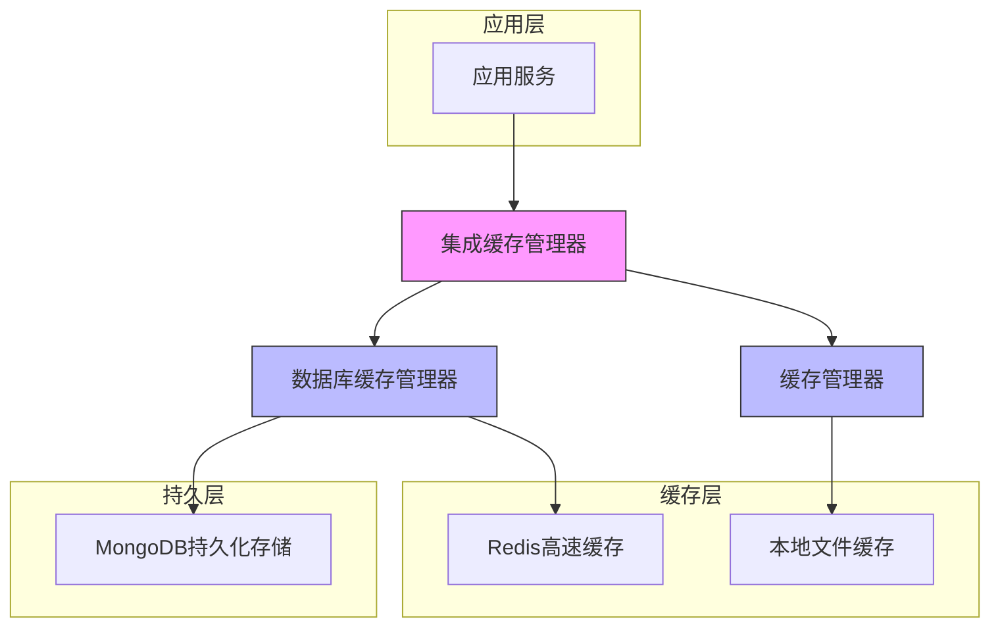

**图表来源**
- [integrated_cache.py](file://tradingagents/dataflows/integrated_cache.py#L0-L286)
- [cache_manager.py](file://tradingagents/dataflows/cache_manager.py#L0-L503)
- [db_cache_manager.py](file://tradingagents/dataflows/db_cache_manager.py#L0-L528)

## 核心组件职责划分

### cache_manager职责

`cache_manager`模块负责本地文件缓存管理，主要处理股票数据、新闻数据和基本面数据的本地缓存。该组件将缓存文件按市场类型分类存储，支持美股和A股数据的差异化管理。

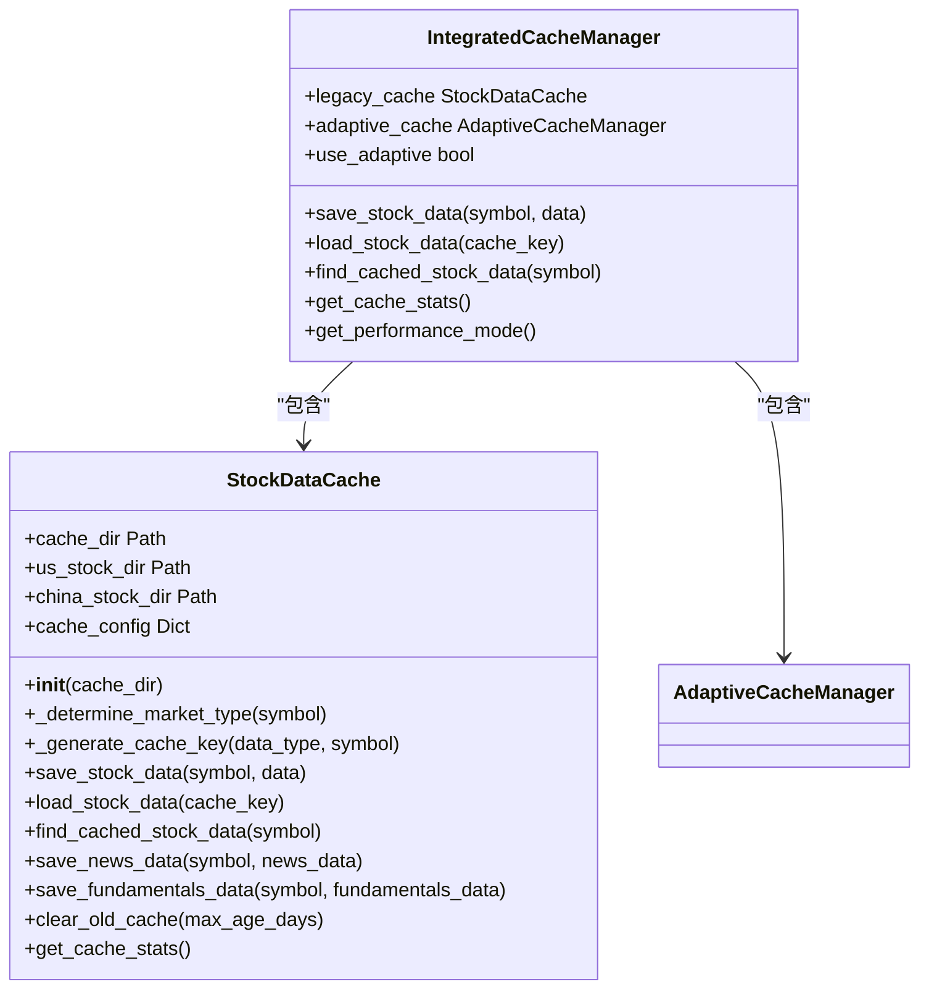

**图表来源**
- [cache_manager.py](file://tradingagents/dataflows/cache_manager.py#L0-L503)
- [integrated_cache.py](file://tradingagents/dataflows/integrated_cache.py#L0-L286)

### db_cache_manager职责

`db_cache_manager`模块负责数据库缓存管理，整合Redis和MongoDB两种存储技术。Redis提供高速缓存访问，而MongoDB确保数据的持久化存储和复杂查询能力。

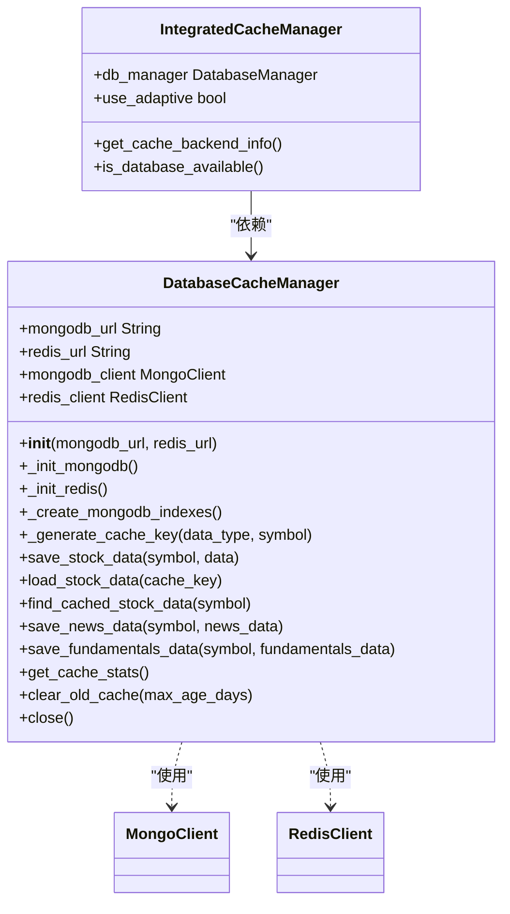

**图表来源**
- [db_cache_manager.py](file://tradingagents/dataflows/db_cache_manager.py#L0-L528)
- [integrated_cache.py](file://tradingagents/dataflows/integrated_cache.py#L0-L286)

## 缓存键生成与TTL管理

### 缓存键生成策略

系统采用复合键生成策略，结合数据类型、股票代码和相关参数生成唯一缓存键。对于股票数据，缓存键包含股票代码、数据类型和基于参数的MD5哈希值。

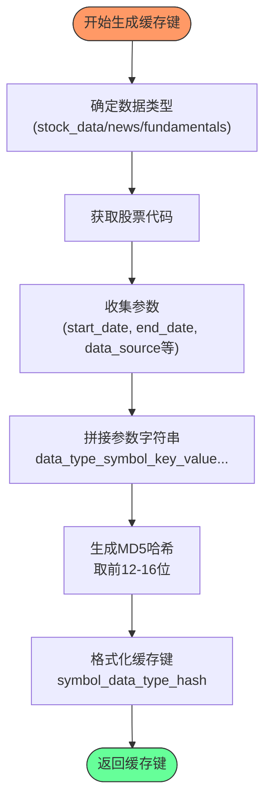

**图表来源**
- [cache_manager.py](file://tradingagents/dataflows/cache_manager.py#L150-L170)
- [db_cache_manager.py](file://tradingagents/dataflows/db_cache_manager.py#L200-L210)

### TTL管理机制

系统根据不同数据类型和市场设置差异化的TTL（Time To Live）策略，确保数据新鲜度与缓存效率的平衡。

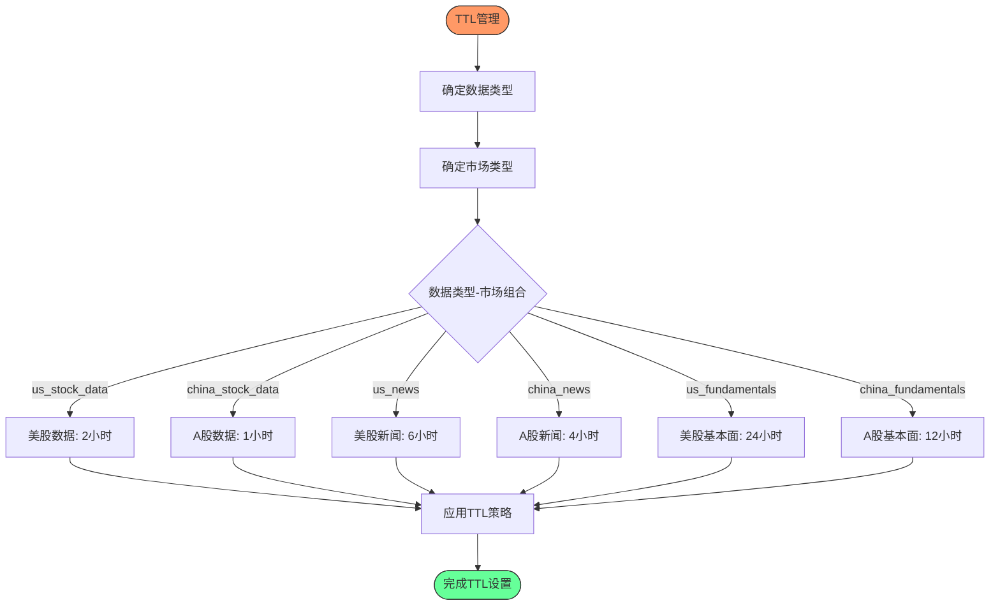

**图表来源**
- [cache_manager.py](file://tradingagents/dataflows/cache_manager.py#L80-L100)
- [mongo-init.js](file://scripts/docker/mongo-init.js#L50-L70)

## 多级缓存读写协调机制

### 读取顺序流程

系统采用智能的多级缓存读取策略，优先从最快存储层获取数据，逐级降级查询，确保最佳性能。

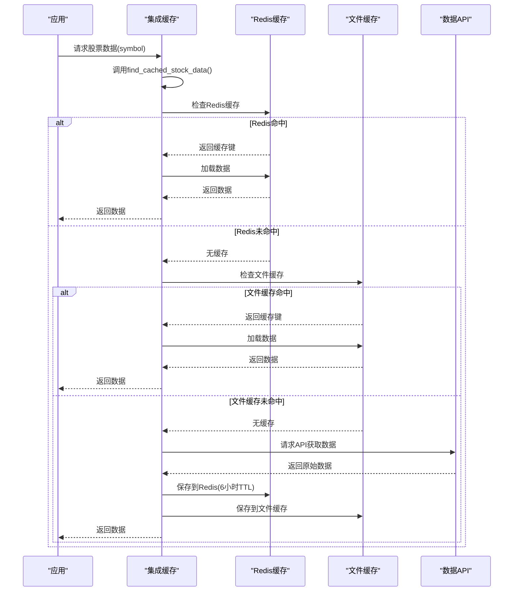

**图表来源**
- [integrated_cache.py](file://tradingagents/dataflows/integrated_cache.py#L0-L286)
- [db_cache_manager.py](file://tradingagents/dataflows/db_cache_manager.py#L250-L300)

### 写入顺序流程

数据写入采用并行策略，同时写入多个存储层，确保数据一致性和高可用性。

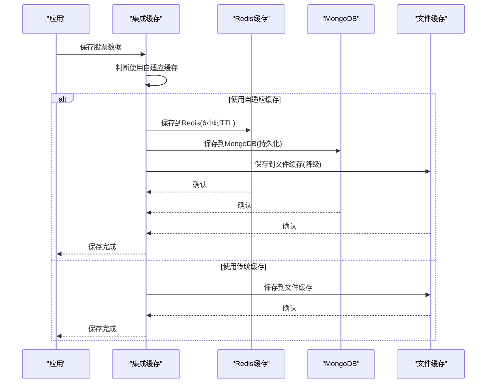

**图表来源**
- [db_cache_manager.py](file://tradingagents/dataflows/db_cache_manager.py#L215-L250)
- [integrated_cache.py](file://tradingagents/dataflows/integrated_cache.py#L100-L150)

## MongoDB集合结构设计

### 集合结构与字段定义

系统设计了多个MongoDB集合来存储不同类型的数据，每个集合都有明确的字段定义和索引策略。

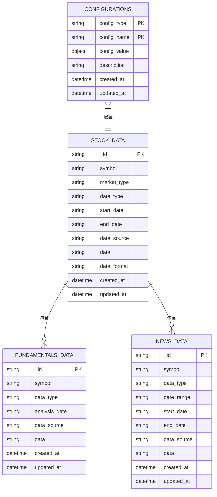

**图表来源**
- [db_cache_manager.py](file://tradingagents/dataflows/db_cache_manager.py#L260-L350)
- [mongo-init.js](file://scripts/docker/mongo-init.js#L10-L40)

### 索引策略

为优化查询性能，系统为关键字段创建了复合索引和单字段索引。

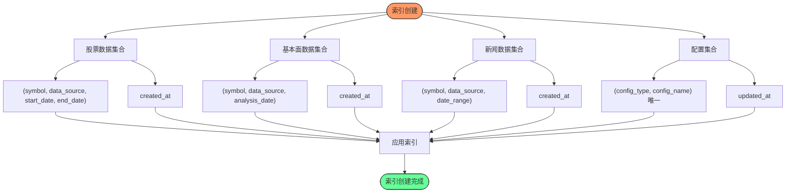

**图表来源**
- [db_cache_manager.py](file://tradingagents/dataflows/db_cache_manager.py#L150-L190)
- [mongo-init.js](file://scripts/docker/mongo-init.js#L15-L40)

## 数据库初始化与同步脚本

### mongo-init.js作用解析

`mongo-init.js`脚本负责初始化MongoDB数据库，创建必要的集合、索引和初始配置数据。

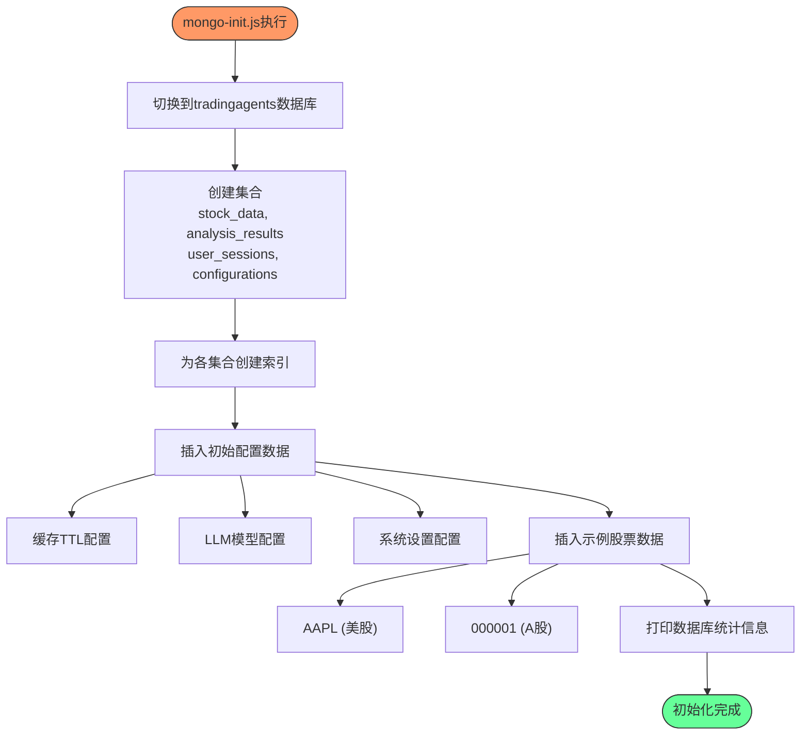

**图表来源**
- [mongo-init.js](file://scripts/docker/mongo-init.js#L0-L140)

### sync_stock_info_to_mongodb.py定时同步逻辑

该脚本实现A股股票基础信息的定时同步，从通达信获取数据并更新到MongoDB。

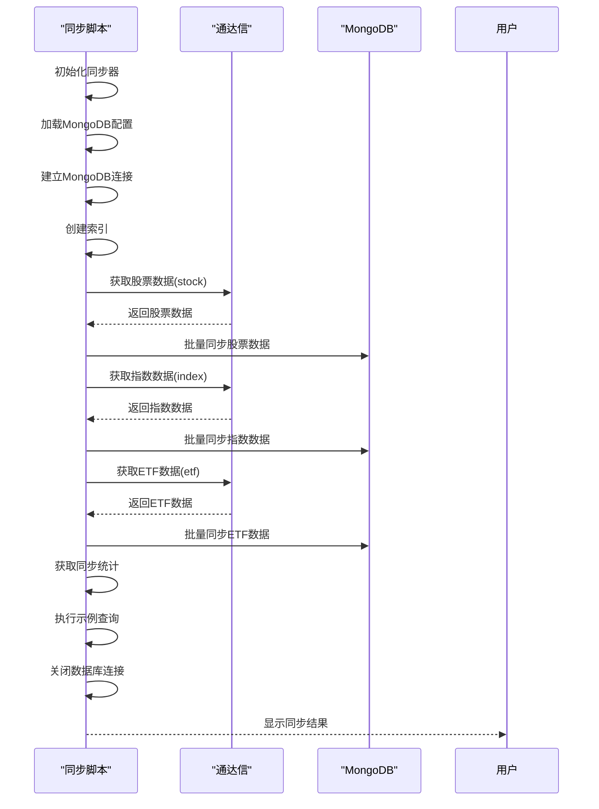

**图表来源**
- [sync_stock_info_to_mongodb.py](file://data/scripts/sync_stock_info_to_mongodb.py#L0-L400)

## 性能调优建议

### Redis内存配置

合理的Redis内存配置对系统性能至关重要，建议根据实际数据量和访问模式进行优化。

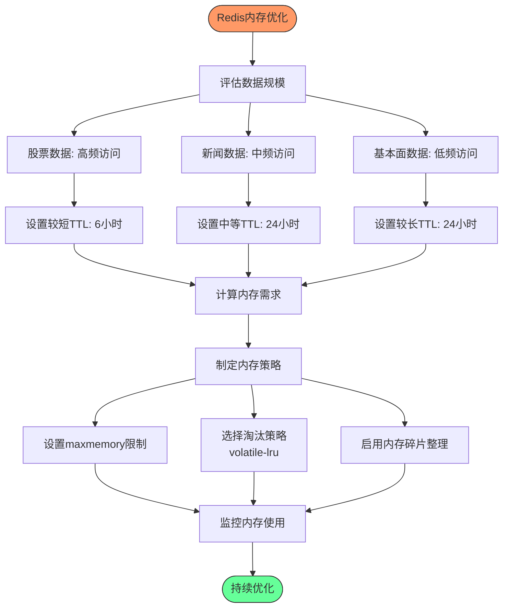

**图表来源**
- [db_cache_manager.py](file://tradingagents/dataflows/db_cache_manager.py#L215-L250)

### 批量写入优化

为提高数据写入效率，系统采用批量写入策略，减少数据库操作开销。

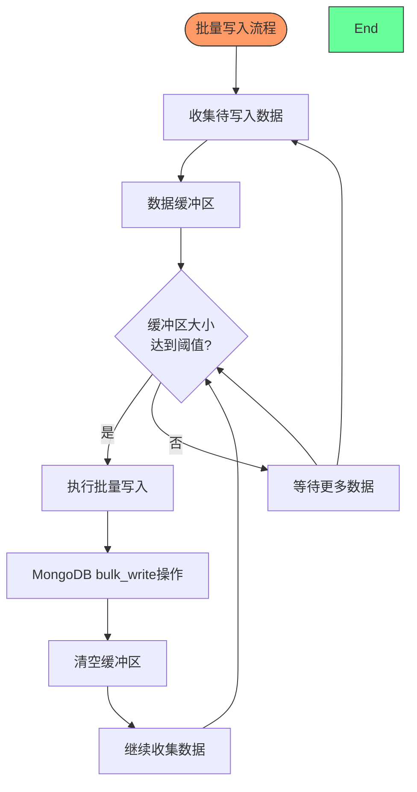

**图表来源**
- [sync_stock_info_to_mongodb.py](file://data/scripts/sync_stock_info_to_mongodb.py#L250-L300)

### 缓存穿透防护措施

系统实现多种机制防止缓存穿透，保护后端数据源。

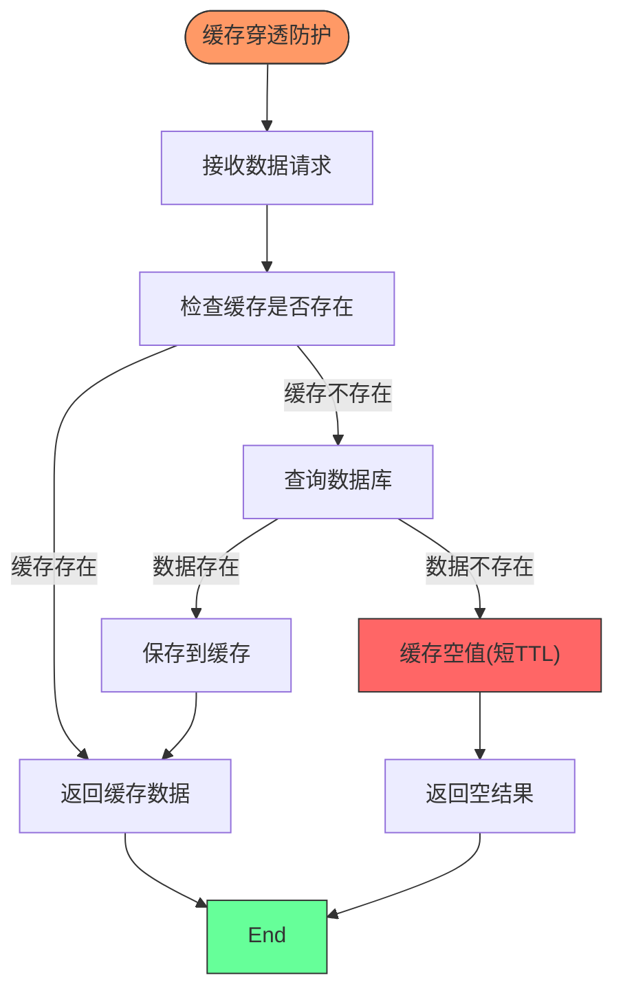

**图表来源**
- [db_cache_manager.py](file://tradingagents/dataflows/db_cache_manager.py#L250-L300)
- [cache_manager.py](file://tradingagents/dataflows/cache_manager.py#L300-L350)