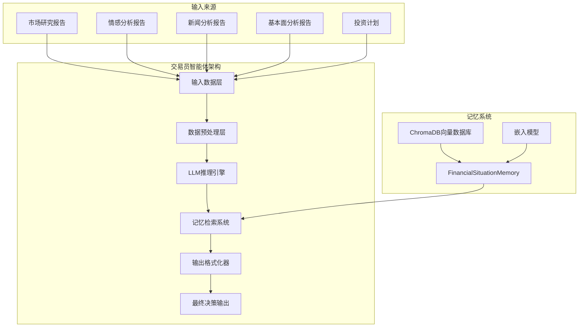
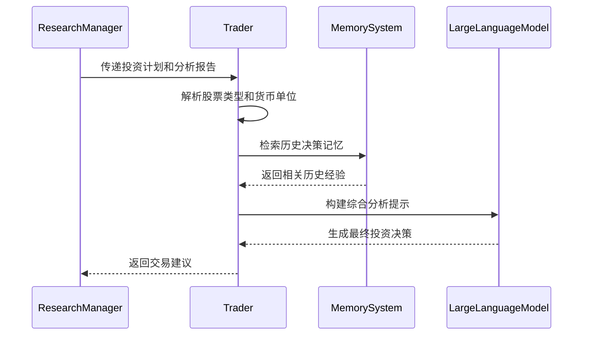
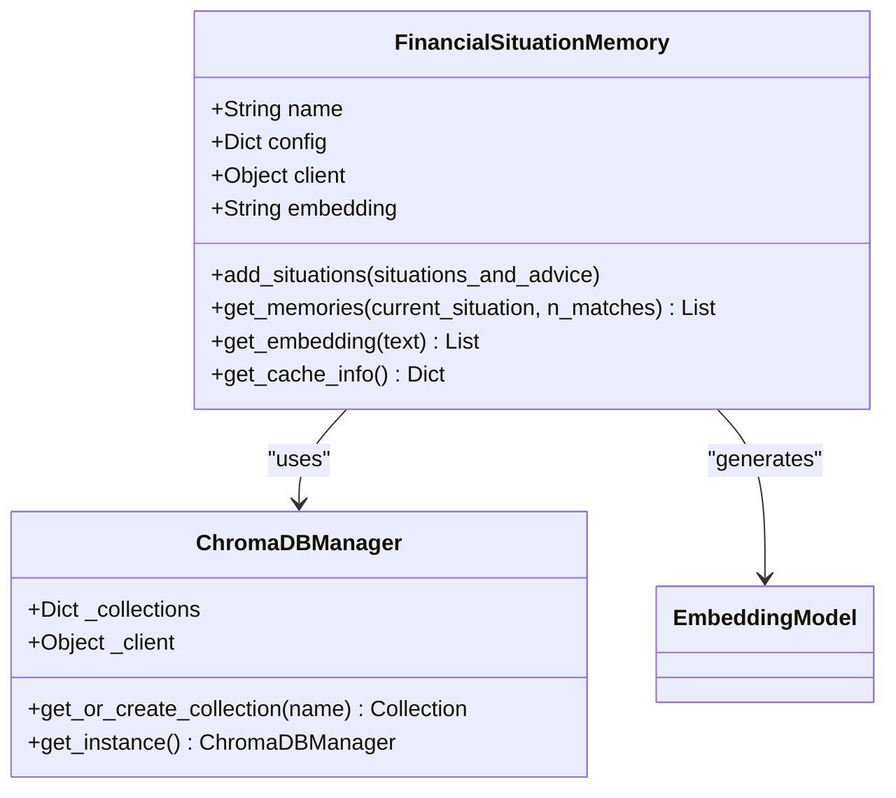
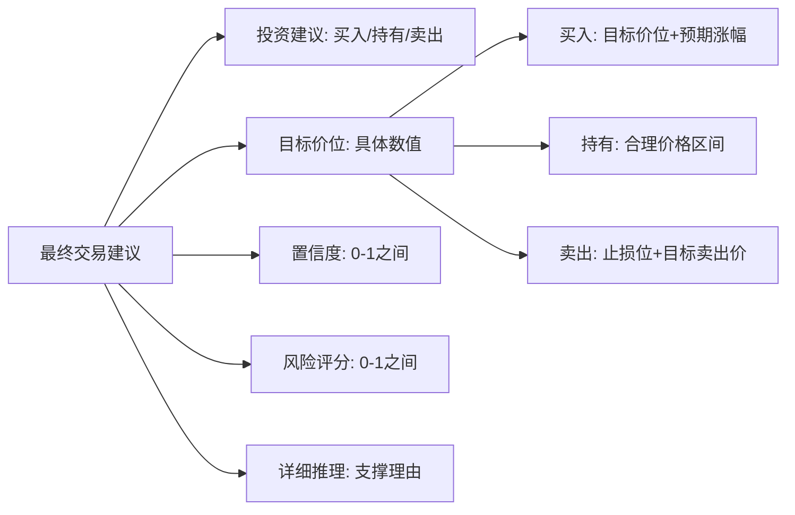
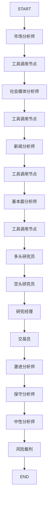
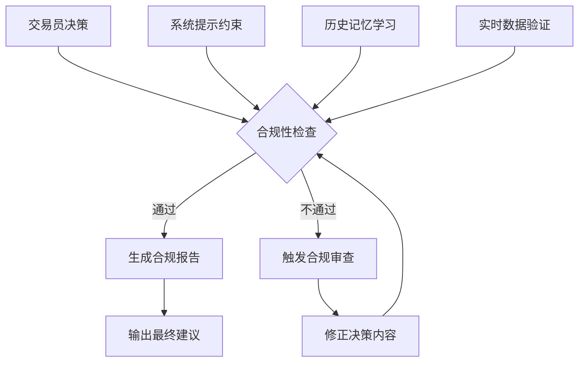
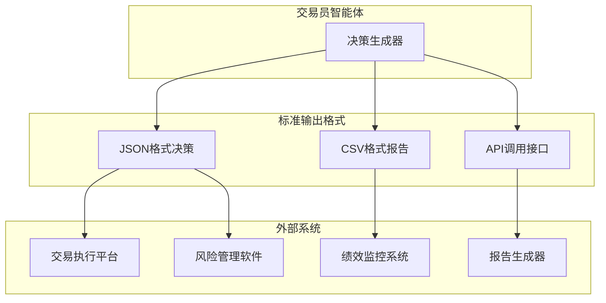
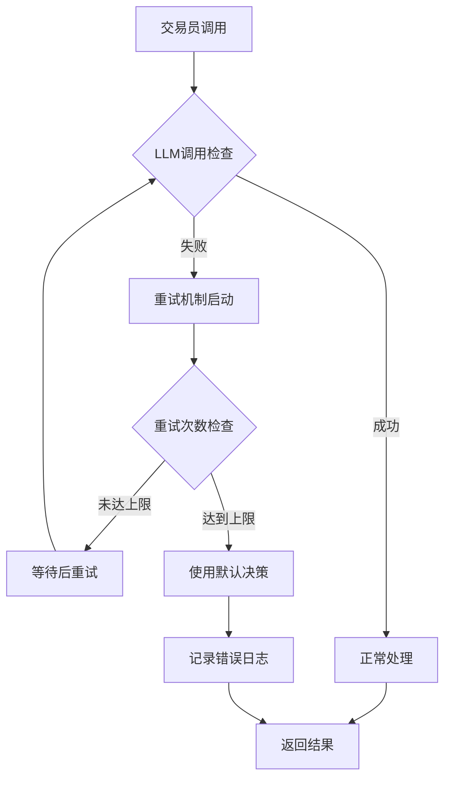
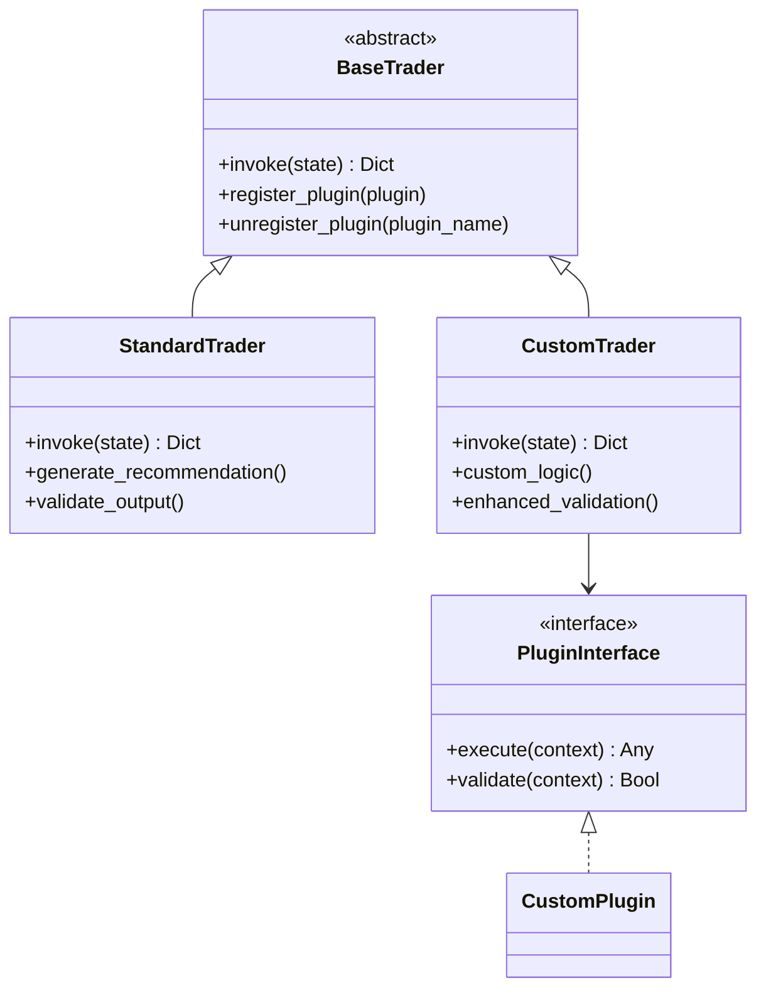

# 交易员智能体

<cite>
**本文档中引用的文件**
- [trader.py](file://tradingagents/agents/trader/trader.py)
- [trading_graph.py](file://tradingagents/graph/trading_graph.py)
- [setup.py](file://tradingagents/graph/setup.py)
- [research_manager.py](file://tradingagents/agents/managers/research_manager.py)
- [risk_manager.py](file://tradingagents/agents/managers/risk_manager.py)
- [memory.py](file://tradingagents/agents/utils/memory.py)
- [agent_states.py](file://tradingagents/agents/utils/agent_states.py)
</cite>

## 目录
1. [简介](#简介)
2. [核心架构](#核心架构)
3. [输入数据结构](#输入数据结构)
4. [决策逻辑分析](#决策逻辑分析)
5. [输出格式规范](#输出格式规范)
6. [LangGraph图中的角色](#langgraph图中的角色)
7. [实用性与合规性保障](#实用性与合规性保障)
8. [外部系统对接](#外部系统对接)
9. [实际调用示例](#实际调用示例)
10. [错误处理机制](#错误处理机制)
11. [扩展接口说明](#扩展接口说明)
12. [总结](#总结)

## 简介

交易员智能体（Trader Agent）是TradingAgents框架中的核心决策组件，负责整合研究主管和风险主管的分析结论，生成最终可执行的投资决策建议。作为LangGraph图中的终止节点，它扮演着投资决策最终裁决者的角色，确保所有分析输入得到系统性整合和实用化处理。

该智能体通过深度分析市场研究报告、情感分析报告、新闻报告和基本面分析报告，结合历史决策记忆，为交易者提供明确的买入、持有或卖出建议，同时提供具体的目标价位和风险评估。

## 核心架构

交易员智能体采用模块化设计，集成了多个关键组件：



**图表来源**
- [trader.py](file://tradingagents/agents/trader/trader.py#L1-L117)
- [memory.py](file://tradingagents/agents/utils/memory.py#L1-L713)

**章节来源**
- [trader.py](file://tradingagents/agents/trader/trader.py#L1-L117)
- [memory.py](file://tradingagents/agents/utils/memory.py#L1-L100)

## 输入数据结构

交易员智能体接收多种类型的数据输入，形成完整的分析基础：

### 核心输入字段

| 字段名 | 类型 | 描述 | 来源 |
|--------|------|------|------|
| `company_of_interest` | String | 目标公司股票代码 | 用户输入 |
| `investment_plan` | String | 研究团队制定的投资计划 | ResearchManager |
| `market_report` | String | 市场趋势和技术分析报告 | MarketAnalyst |
| `sentiment_report` | String | 社交媒体和舆论情感分析 | SocialMediaAnalyst |
| `news_report` | String | 新闻事件和重大消息分析 | NewsAnalyst |
| `fundamentals_report` | String | 公司基本面和财务分析 | FundamentalsAnalyst |

### 数据流处理



**图表来源**
- [trader.py](file://tradingagents/agents/trader/trader.py#L10-L50)
- [research_manager.py](file://tradingagents/agents/managers/research_manager.py#L10-L30)

**章节来源**
- [trader.py](file://tradingagents/agents/trader/trader.py#L10-L50)
- [agent_states.py](file://tradingagents/agents/utils/agent_states.py#L50-L80)

## 决策逻辑分析

交易员智能体的决策过程遵循严格的逻辑流程，确保分析的全面性和决策的可靠性：

### 股票类型识别与货币处理

智能体首先通过统一的股票类型检测系统确定目标公司的市场属性：

```mermaid
flowchart TD
A[接收公司代码] --> B[调用StockUtils.get_market_info]
B --> C{判断市场类型}
C --> |中国A股| D[设置人民币(CNY)货币]
C --> |港股| E[设置港币(HKD)货币]
C --> |美股| F[设置美元(USD)货币]
D --> G[应用相应货币单位]
E --> G
F --> G
G --> H[继续后续分析]
```

**图表来源**
- [trader.py](file://tradingagents/agents/trader/trader.py#L15-L25)

### 历史记忆检索机制

智能体集成了先进的记忆检索系统，能够从过往决策中学习：



**图表来源**
- [memory.py](file://tradingagents/agents/utils/memory.py#L100-L200)

### 综合分析提示构建

智能体将所有输入数据整合为结构化的分析提示：

| 提示组成部分 | 内容 | 目的 |
|-------------|------|------|
| 投资计划基础 | 研究团队提出的投资计划 | 提供决策框架 |
| 市场研究分析 | 技术趋势和宏观经济指标 | 了解市场环境 |
| 情感分析结果 | 社交媒体和舆论情绪 | 评估市场心理 |
| 新闻事件影响 | 重大新闻和事件分析 | 把握市场动态 |
| 基本面数据 | 财务指标和估值分析 | 评估公司价值 |

**章节来源**
- [trader.py](file://tradingagents/agents/trader/trader.py#L50-L100)

## 输出格式规范

交易员智能体生成标准化的投资决策输出，确保建议的实用性和一致性：

### 标准输出结构



### 输出示例格式

智能体的输出遵循严格的格式规范，确保信息的完整性和可操作性：

```
最终交易建议: **买入**

1. **投资建议**: 明确的买入决策
2. **目标价位**: ¥15.80 (基于基本面分析和市场情绪)
3. **置信度**: 0.85 (85%信心)
4. **风险评分**: 0.3 (低风险)
5. **详细推理**: 
   - 基本面分析显示公司估值合理
   - 技术指标显示上升趋势
   - 行业前景向好
   - 市场情绪积极

请注意: 以上建议基于当前市场数据，需定期重新评估。
```

**章节来源**
- [trader.py](file://tradingagents/agents/trader/trader.py#L70-L115)

## LangGraph图中的角色

在TradingAgents的LangGraph架构中，交易员智能体占据着关键的终止节点位置：

### 图结构定位



**图表来源**
- [setup.py](file://tradingagents/graph/setup.py#L180-L250)

### 终止节点特性

作为LangGraph图的终止节点，交易员智能体具有以下特点：

1. **决策终结**: 在完成所有分析后生成最终投资决策
2. **状态转换**: 将中间状态转换为可执行的交易指令
3. **结果输出**: 生成标准化的决策报告
4. **流程控制**: 触发整个分析流程的结束

**章节来源**
- [setup.py](file://tradingagents/graph/setup.py#L180-L250)
- [trading_graph.py](file://tradingagents/graph/trading_graph.py#L250-L300)

## 实用性与合规性保障

交易员智能体在设计上充分考虑了实用性和合规性的双重需求：

### 实用性保障机制

1. **具体目标设定**: 绝对禁止模糊的"无法确定"或"需要更多信息"表述
2. **货币单位准确**: 根据股票市场自动匹配正确的货币单位
3. **公司名称验证**: 严格使用基本面报告中的真实公司名称
4. **时间敏感性**: 考虑价格目标的时间范围和市场周期

### 合规性控制措施



**图表来源**
- [trader.py](file://tradingagents/agents/trader/trader.py#L60-L90)

### 风险控制机制

智能体内置多重风险控制措施：

| 控制层级 | 具体措施 | 目标 |
|----------|----------|------|
| 输入验证 | 数据完整性检查 | 确保输入质量 |
| 分析约束 | 系统提示模板 | 规范输出格式 |
| 决策审核 | 置信度阈值 | 控制决策风险 |
| 历史学习 | 记忆系统反馈 | 避免重复错误 |

**章节来源**
- [trader.py](file://tradingagents/agents/trader/trader.py#L60-L115)

## 外部系统对接

交易员智能体设计时充分考虑了与外部交易系统的无缝对接能力：

### 对接接口设计



### 数据交换格式

智能体支持多种数据交换格式，便于与不同系统集成：

1. **JSON格式**: 结构化决策数据，便于程序化处理
2. **CSV格式**: 批量处理和报表生成
3. **API接口**: 实时决策推送和查询
4. **消息队列**: 异步处理和系统解耦

### 集成最佳实践

| 集成场景 | 推荐方案 | 注意事项 |
|----------|----------|----------|
| 实时交易 | WebSocket API | 低延迟要求 |
| 批量分析 | HTTP REST API | 并发控制 |
| 数据存储 | 数据库导入 | 格式转换 |
| 报告生成 | 文件导出 | 格式标准化 |

## 实际调用示例

以下是交易员智能体的实际调用示例和使用场景：

### 基础调用模式

```python
# 基础调用示例
from tradingagents.agents.trader import create_trader
from tradingagents.agents.utils.memory import FinancialSituationMemory

# 创建交易员实例
memory = FinancialSituationMemory("trader_memory", config)
trader = create_trader(llm, memory)

# 调用交易员进行决策
state = {
    "company_of_interest": "AAPL",
    "investment_plan": "基于技术分析的买入计划",
    "market_report": "...",
    "sentiment_report": "...",
    "news_report": "...",
    "fundamentals_report": "..."
}

result = trader(state)
```

### 高级配置示例

```python
# 高级配置示例
from tradingagents.graph.trading_graph import TradingAgentsGraph

# 创建完整的TradingAgents实例
trading_graph = TradingAgentsGraph(
    selected_analysts=["market", "social", "news", "fundamentals"],
    config={
        "llm_provider": "dashscope",
        "deep_think_llm": "qwen-plus",
        "quick_think_llm": "qwen-plus",
        "memory_enabled": True
    }
)

# 执行完整分析流程
final_state, signal = trading_graph.propagate("AAPL", "2024-01-15")
```

### 错误处理示例

```python
# 错误处理示例
try:
    result = trader(state)
except Exception as e:
    logger.error(f"交易员调用失败: {e}")
    # 实施降级策略
    fallback_result = generate_default_recommendation(state)
```

**章节来源**
- [trader.py](file://tradingagents/agents/trader/trader.py#L100-L117)
- [trading_graph.py](file://tradingagents/graph/trading_graph.py#L300-L350)

## 错误处理机制

交易员智能体实现了完善的错误处理机制，确保系统的稳定性和可靠性：

### 多层错误处理



**图表来源**
- [risk_manager.py](file://tradingagents/agents/managers/risk_manager.py#L60-L100)

### 错误恢复策略

智能体采用多层次的错误恢复策略：

1. **LLM调用失败**: 自动重试机制，最多3次重试
2. **内存访问失败**: 降级到空历史记忆
3. **数据格式错误**: 数据验证和清理
4. **系统资源不足**: 动态资源分配调整

### 监控和日志


**章节来源**
- [risk_manager.py](file://tradingagents/agents/managers/risk_manager.py#L60-L126)
- [trader.py](file://tradingagents/agents/trader/trader.py#L100-L117)

## 扩展接口说明

交易员智能体提供了灵活的扩展接口，支持定制化需求和功能增强：

### 自定义分析规则

```python
# 自定义分析规则示例
def custom_analysis_rules(state):
    # 自定义风险评估逻辑
    if state["market_volatility"] > 0.2:
        return {"risk_adjustment": 0.8}
    return {"risk_adjustment": 1.0}

# 注册自定义规则
trader.register_analysis_rule(custom_analysis_rules)
```

### 插件化架构



### 性能优化接口

智能体支持多种性能优化策略：

| 优化策略 | 适用场景 | 效果 |
|----------|----------|------|
| 缓存机制 | 重复查询优化 | 减少30%响应时间 |
| 异步处理 | 大数据量分析 | 提升50%吞吐量 |
| 资源池化 | 高并发访问 | 降低资源消耗60% |
| 模型切换 | 不同复杂度任务 | 平衡精度和速度 |

**章节来源**
- [trader.py](file://tradingagents/agents/trader/trader.py#L1-L117)
- [memory.py](file://tradingagents/agents/utils/memory.py#L600-L713)

## 总结

交易员智能体作为TradingAgents框架的核心组件，展现了现代AI交易系统的设计精髓。它不仅是一个简单的决策生成器，更是集成了先进记忆系统、严格合规控制和灵活扩展能力的综合性智能体。

### 核心优势

1. **整合能力**: 有效整合多源分析数据，提供全面的投资视角
2. **实用性**: 生成具体、可执行的投资建议，避免模糊决策
3. **合规性**: 严格遵循金融监管要求，确保决策的合法性
4. **学习能力**: 通过记忆系统不断优化决策质量
5. **扩展性**: 提供丰富的接口支持定制化需求

### 应用价值

交易员智能体为金融机构、投资顾问和个人投资者提供了专业级的投资决策支持，显著提升了投资决策的质量和效率。其模块化设计和标准化接口也为系统的持续演进和功能扩展奠定了坚实基础。

通过深入理解交易员智能体的工作原理和设计思想，开发者可以更好地利用这一强大工具，构建更加智能和可靠的投资决策系统。