# 分析师团队

<cite>
**本文档引用的文件**
- [fundamentals_analyst.py](file://tradingagents/agents/analysts/fundamentals_analyst.py)
- [market_analyst.py](file://tradingagents/agents/analysts/market_analyst.py)
- [news_analyst.py](file://tradingagents/agents/analysts/news_analyst.py)
- [social_media_analyst.py](file://tradingagents/agents/analysts/social_media_analyst.py)
- [china_market_analyst.py](file://tradingagents/agents/analysts/china_market_analyst.py)
- [unified_news_tool.py](file://tradingagents/tools/unified_news_tool.py)
- [stock_data_service.py](file://tradingagents/dataflows/stock_data_service.py)
- [trading_graph.py](file://tradingagents/graph/trading_graph.py)
- [google_tool_handler.py](file://tradingagents/agents/utils/google_tool_handler.py)
- [simple_analysis_demo.py](file://examples/simple_analysis_demo.py)
- [custom_analysis_demo.py](file://examples/custom_analysis_demo.py)
</cite>

## 目录
1. [简介](#简介)
2. [分析师团队架构](#分析师团队架构)
3. [核心分析师详解](#核心分析师详解)
4. [统一工具系统](#统一工具系统)
5. [LangGraph工作流](#langgraph工作流)
6. [数据流与状态管理](#数据流与状态管理)
7. [实际使用场景](#实际使用场景)
8. [性能优化与故障处理](#性能优化与故障处理)
9. [总结](#总结)

## 简介

TradingAgents-CN是一个基于LangGraph的智能投资分析系统，采用团队协作的方式为投资者提供全面的股票分析服务。系统的核心是由五个专业分析师组成的团队，每个分析师都有独特的职责分工，通过统一的工具架构和协调机制，共同生成高质量的投资分析报告。

## 分析师团队架构

### 团队组成与职责划分

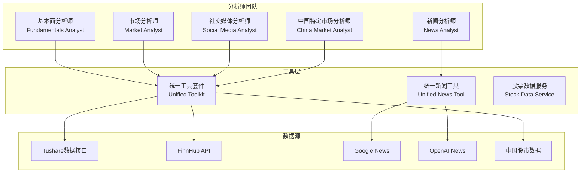

**图表来源**
- [fundamentals_analyst.py](file://tradingagents/agents/analysts/fundamentals_analyst.py#L1-L50)
- [market_analyst.py](file://tradingagents/agents/analysts/market_analyst.py#L1-L50)
- [news_analyst.py](file://tradingagents/agents/analysts/news_analyst.py#L1-L50)

### 协作机制

分析师团队采用流水线式的协作模式，每个分析师独立完成自己的分析任务，然后将结果传递给下一个分析师。这种设计确保了分析的专业性和深度，同时避免了重复劳动。

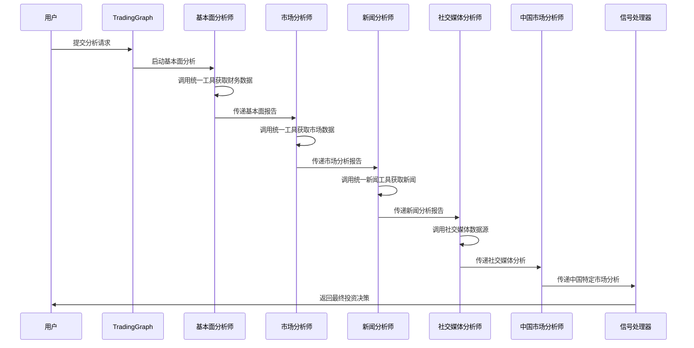

**图表来源**
- [trading_graph.py](file://tradingagents/graph/trading_graph.py#L254-L284)
- [fundamentals_analyst.py](file://tradingagents/agents/analysts/fundamentals_analyst.py#L100-L200)

## 核心分析师详解

### 基本面分析师

基本面分析师负责深入分析公司的财务状况、业务模式和竞争优势，为长期投资决策提供依据。

#### 主要职责
- **财务数据分析**：分析资产负债表、利润表、现金流量表
- **估值分析**：计算PE、PB、PEG等估值指标
- **业务模式评估**：评估公司的商业模式和竞争优势
- **行业地位分析**：分析公司在行业中的地位和市场份额

#### 输入输出数据格式

| 输入参数 | 类型 | 描述 |
|---------|------|------|
| ticker | str | 股票代码 |
| start_date | str | 分析开始日期 |
| end_date | str | 分析结束日期 |
| curr_date | str | 当前日期 |

| 输出格式 | 类型 | 描述 |
|---------|------|------|
| fundamentals_report | str | 基本面分析报告 |
| investment_recommendation | str | 投资建议（买入/持有/卖出） |
| valuation_range | str | 估值区间 |

#### 调用的工具和API

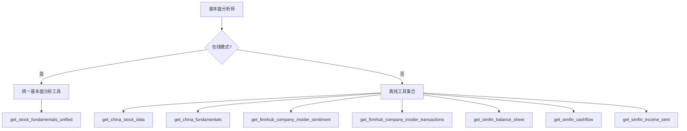

**图表来源**
- [fundamentals_analyst.py](file://tradingagents/agents/analysts/fundamentals_analyst.py#L150-L250)

**章节来源**
- [fundamentals_analyst.py](file://tradingagents/agents/analysts/fundamentals_analyst.py#L1-L401)

### 市场分析师

市场分析师专注于技术分析和市场数据，为短期交易决策提供技术支持。

#### 主要职责
- **技术指标分析**：计算和分析各种技术指标
- **价格趋势分析**：识别价格趋势和支撑阻力位
- **成交量分析**：分析成交量变化和资金流向
- **市场情绪分析**：评估市场参与者的情绪和行为

#### 输入输出数据格式

| 输入参数 | 类型 | 描述 |
|---------|------|------|
| ticker | str | 股票代码 |
| start_date | str | 分析开始日期 |
| end_date | str | 分析结束日期 |

| 输出格式 | 类型 | 描述 |
|---------|------|------|
| market_report | str | 市场分析报告 |
| technical_indicators | dict | 技术指标数据 |
| price_predictions | str | 价格预测 |

#### 调用的工具和API

市场分析师支持两种模式：传统模式和ReAct Agent模式。

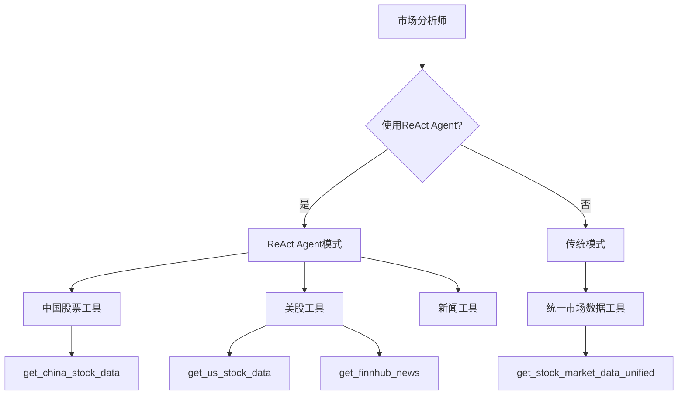

**图表来源**
- [market_analyst.py](file://tradingagents/agents/analysts/market_analyst.py#L100-L200)

**章节来源**
- [market_analyst.py](file://tradingagents/agents/analysts/market_analyst.py#L1-L520)

### 新闻分析师

新闻分析师负责收集和分析最新的市场新闻，评估新闻事件对股价的潜在影响。

#### 主要职责
- **实时新闻获取**：获取最新的财经新闻和公告
- **新闻时效性评估**：评估新闻的时效性和相关性
- **事件影响分析**：分析新闻事件对股价的短期影响
- **市场情绪评估**：评估新闻对投资者情绪的影响

#### 输入输出数据格式

| 输入参数 | 类型 | 描述 |
|---------|------|------|
| ticker | str | 股票代码 |
| max_news | int | 最大新闻数量 |
| model_info | str | 模型信息 |

| 输出格式 | 类型 | 描述 |
|---------|------|------|
| news_report | str | 新闻分析报告 |
| event_impact | dict | 事件影响评估 |
| sentiment_score | float | 情绪评分 |

#### 调用的工具和API

新闻分析师使用统一新闻工具，自动识别股票类型并获取相应新闻：

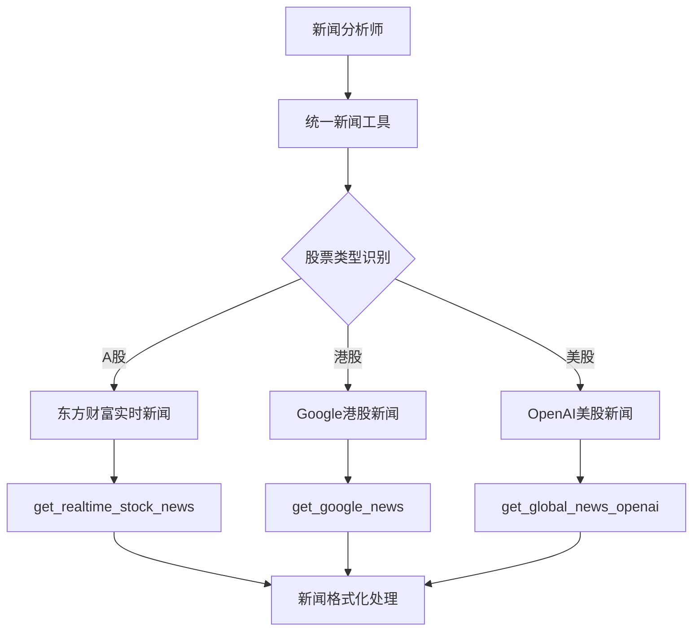

**图表来源**
- [news_analyst.py](file://tradingagents/agents/analysts/news_analyst.py#L50-L150)
- [unified_news_tool.py](file://tradingagents/tools/unified_news_tool.py#L50-L150)

**章节来源**
- [news_analyst.py](file://tradingagents/agents/analysts/news_analyst.py#L1-L348)
- [unified_news_tool.py](file://tradingagents/tools/unified_news_tool.py#L1-L367)

### 社交媒体分析师

社交媒体分析师专注于分析中国投资者的社交媒体情绪和讨论热度。

#### 主要职责
- **社交媒体监控**：监控中国主要财经平台的讨论
- **情绪分析**：分析投资者情绪和市场预期
- **热点事件识别**：识别影响股价的热点事件
- **舆论影响评估**：评估社交媒体舆论对股价的影响

#### 输入输出数据格式

| 输入参数 | 类型 | 描述 |
|---------|------|------|
| ticker | str | 股票代码 |
| platform | str | 平台类型 |

| 输出格式 | 类型 | 描述 |
|---------|------|------|
| sentiment_report | str | 情绪分析报告 |
| sentiment_score | float | 情绪指数 |
| hot_topics | list | 热点话题列表 |

#### 调用的工具和API

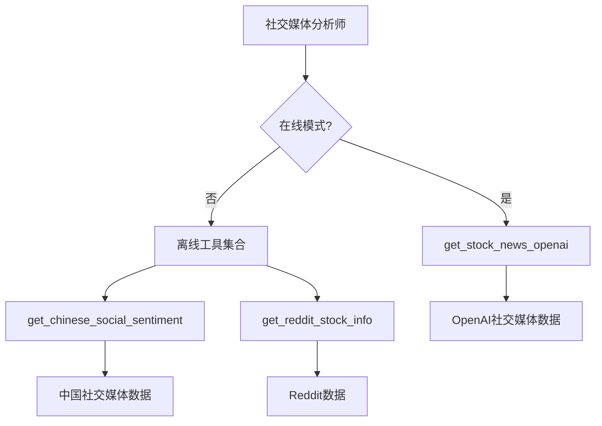

**图表来源**
- [social_media_analyst.py](file://tradingagents/agents/analysts/social_media_analyst.py#L50-L150)

**章节来源**
- [social_media_analyst.py](file://tradingagents/agents/analysts/social_media_analyst.py#L1-L214)

### 中国特定市场分析师

中国特定市场分析师专注于中国资本市场的独特特点和政策环境。

#### 主要职责
- **政策影响分析**：分析政策变化对股市的影响
- **市场特色分析**：分析中国股市的特殊机制
- **行业轮动分析**：分析行业板块的轮动规律
- **资金流向分析**：分析北向资金、融资融券等资金流向

#### 输入输出数据格式

| 输入参数 | 类型 | 描述 |
|---------|------|------|
| ticker | str | 股票代码 |
| market_type | str | 市场类型 |

| 输出格式 | 类型 | 描述 |
|---------|------|------|
| china_market_report | str | 中国市场分析报告 |
| policy_impact | dict | 政策影响评估 |
| market_conditions | str | 市场状况分析 |

#### 调用的工具和API

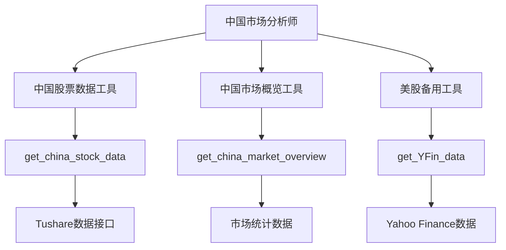

**图表来源**
- [china_market_analyst.py](file://tradingagents/agents/analysts/china_market_analyst.py#L50-L150)

**章节来源**
- [china_market_analyst.py](file://tradingagents/agents/analysts/china_market_analyst.py#L1-L278)

## 统一工具系统

### 工具架构设计

统一工具系统是TradingAgents-CN的核心基础设施，它解决了多源数据整合和跨平台兼容性的问题。

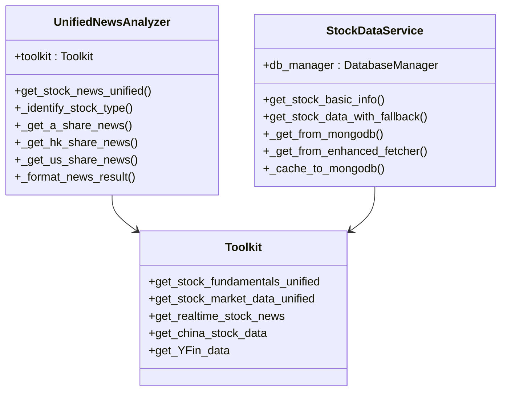

**图表来源**
- [unified_news_tool.py](file://tradingagents/tools/unified_news_tool.py#L15-L50)
- [stock_data_service.py](file://tradingagents/dataflows/stock_data_service.py#L20-L60)

### 多源数据整合

统一工具系统支持多种数据源的自动识别和降级机制：

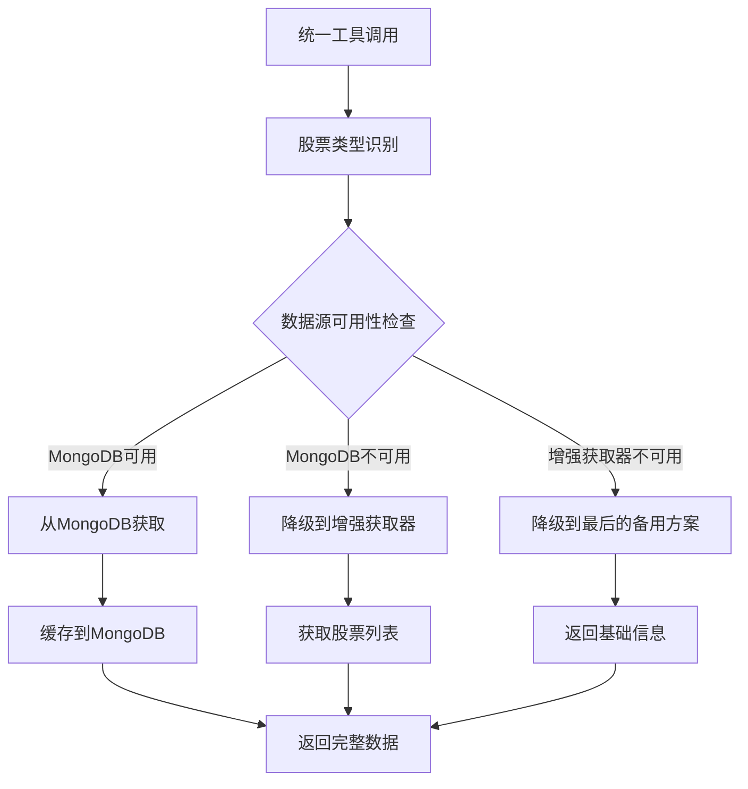

**图表来源**
- [stock_data_service.py](file://tradingagents/dataflows/stock_data_service.py#L50-L150)

**章节来源**
- [unified_news_tool.py](file://tradingagents/tools/unified_news_tool.py#L1-L367)
- [stock_data_service.py](file://tradingagents/dataflows/stock_data_service.py#L1-L286)

## LangGraph工作流

### 工作流设计

TradingAgents-CN基于LangGraph构建了复杂的工作流系统，实现了智能体之间的协调和状态管理。

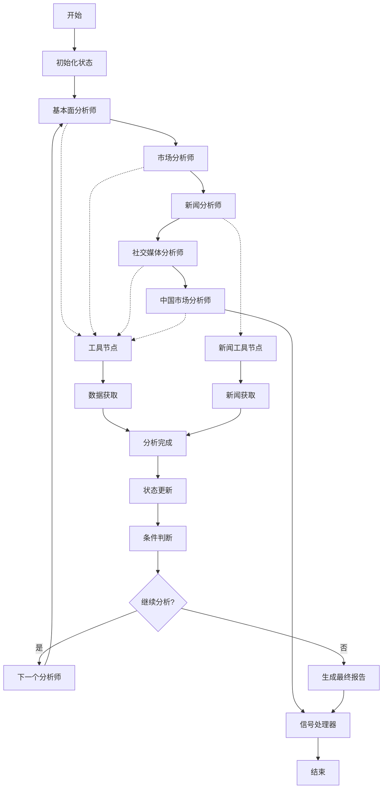

**图表来源**
- [trading_graph.py](file://tradingagents/graph/trading_graph.py#L254-L284)
- [setup.py](file://tradingagents/graph/setup.py#L169-L203)

### 状态转换机制

工作流中的状态转换遵循严格的规则，确保分析的完整性和一致性：

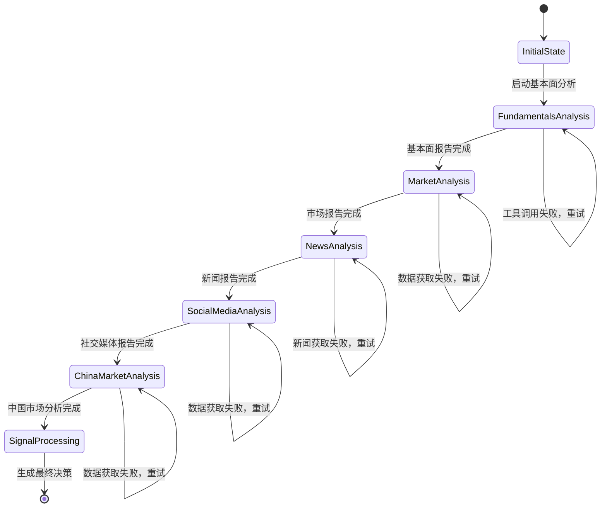

**图表来源**
- [trading_graph.py](file://tradingagents/graph/trading_graph.py#L300-L400)

**章节来源**
- [trading_graph.py](file://tradingagents/graph/trading_graph.py#L1-L441)

## 数据流与状态管理

### 数据流架构

系统采用分层的数据流架构，确保数据的一致性和可靠性：

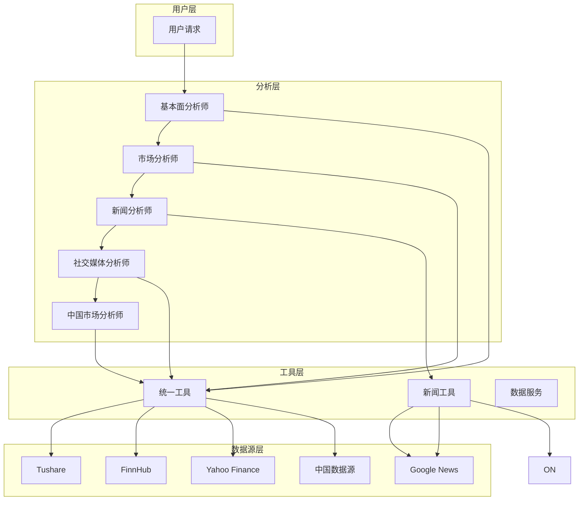

**图表来源**
- [trading_graph.py](file://tradingagents/graph/trading_graph.py#L254-L284)

### 状态管理机制

系统维护复杂的状态信息，包括分析进度、工具调用状态和错误信息：

| 状态字段 | 类型 | 描述 |
|---------|------|------|
| company_of_interest | str | 分析目标股票 |
| trade_date | str | 交易日期 |
| messages | list | 对话历史 |
| fundamentals_report | str | 基本面分析报告 |
| market_report | str | 市场分析报告 |
| news_report | str | 新闻分析报告 |
| sentiment_report | str | 社交媒体分析报告 |
| china_market_report | str | 中国市场分析报告 |
| final_trade_decision | str | 最终交易决策 |

**章节来源**
- [trading_graph.py](file://tradingagents/graph/trading_graph.py#L400-L441)

## 实际使用场景

### 场景一：全面投资分析

```python
# 示例：使用TradingAgents-CN进行全面投资分析
from tradingagents.graph.trading_graph import TradingAgentsGraph

# 初始化分析器
graph = TradingAgentsGraph(
    selected_analysts=["fundamentals", "market", "news", "social", "china"],
    config=config
)

# 执行分析
final_state, decision = graph.propagate(
    company_name="AAPL",
    trade_date="2024-12-15"
)

print(f"最终投资决策: {decision}")
```

### 场景二：特定需求分析

```python
# 示例：专注于基本面分析
from tradingagents.agents.analysts.fundamentals_analyst import create_fundamentals_analyst

# 创建专门的基本面分析师
fundamentals_analyst = create_fundamentals_analyst(llm, toolkit)

# 执行分析
state = {
    "company_of_interest": "MSFT",
    "trade_date": "2024-12-15",
    "messages": []
}

result = fundamentals_analyst(state)
print(f"基本面分析结果: {result['fundamentals_report']}")
```

### 场景三：批量分析

```python
# 示例：批量分析多个股票
stocks = ["AAPL", "MSFT", "GOOGL", "TSLA", "AMZN"]
results = []

for stock in stocks:
    final_state, decision = graph.propagate(
        company_name=stock,
        trade_date="2024-12-15"
    )
    results.append({
        "stock": stock,
        "decision": decision,
        "fundamentals": final_state["fundamentals_report"]
    })
```

**章节来源**
- [simple_analysis_demo.py](file://examples/simple_analysis_demo.py#L1-L214)
- [custom_analysis_demo.py](file://examples/custom_analysis_demo.py#L1-L278)

## 性能优化与故障处理

### Google模型专用处理

系统针对Google模型的特殊行为进行了优化，解决了工具调用返回空内容的问题：

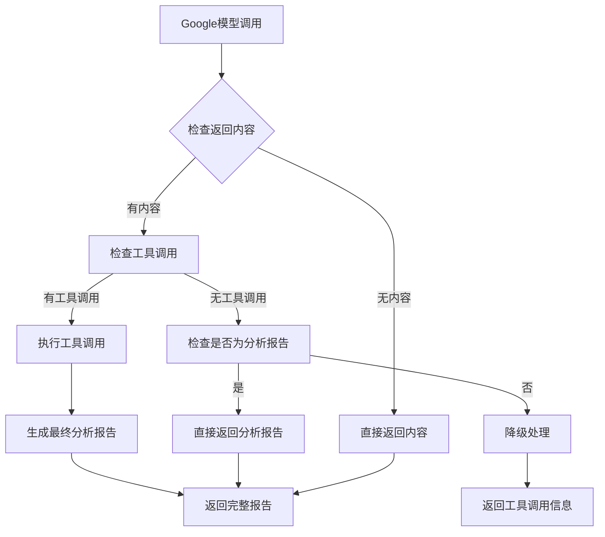

**图表来源**
- [google_tool_handler.py](file://tradingagents/agents/utils/google_tool_handler.py#L50-L150)

### 降级机制

系统实现了多层次的降级机制，确保在任何情况下都能提供有用的信息：

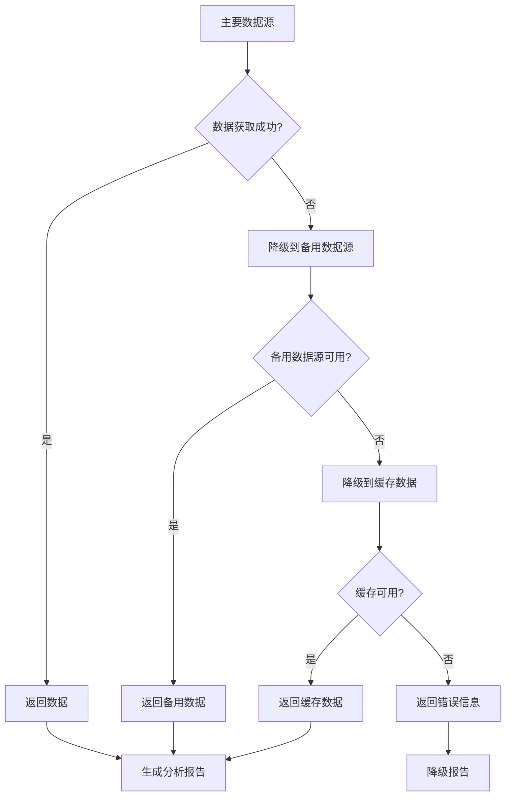

**图表来源**
- [stock_data_service.py](file://tradingagents/dataflows/stock_data_service.py#L100-L200)

### 错误处理策略

系统采用多种错误处理策略，确保分析的连续性和稳定性：

| 错误类型 | 处理策略 | 示例 |
|---------|---------|------|
| 工具调用失败 | 重试机制 | 自动重试最多3次 |
| 数据获取超时 | 降级到备用源 | 从缓存获取历史数据 |
| 模型响应异常 | 降级处理 | 使用简单文本生成 |
| 网络连接失败 | 离线模式 | 使用本地缓存数据 |

**章节来源**
- [google_tool_handler.py](file://tradingagents/agents/utils/google_tool_handler.py#L1-L782)

## 总结

TradingAgents-CN的分析师团队通过专业化分工和统一的工具架构，实现了高效、准确的股票分析服务。五大分析师各司其职，从不同角度深入分析股票，确保分析的全面性和准确性。

### 核心优势

1. **专业化分工**：每个分析师专注于特定领域，确保分析的专业深度
2. **统一工具架构**：自动识别股票类型，统一调用相应工具
3. **多源数据整合**：支持多种数据源，提供可靠的数据基础
4. **智能工作流**：基于LangGraph的智能协调机制
5. **容错处理**：完善的降级机制和错误处理策略

### 应用价值

- **投资决策支持**：为投资者提供全面、专业的分析报告
- **风险控制**：识别各类风险因素，提供风险控制建议
- **市场洞察**：深入分析市场趋势和投资者情绪
- **效率提升**：自动化分析流程，大幅提高分析效率

TradingAgents-CN的分析师团队代表了人工智能在金融分析领域的前沿应用，为现代投资决策提供了强有力的技术支持。