# 智能体系统

<cite>
**本文档引用的文件**
- [fundamentals_analyst.py](file://tradingagents/agents/analysts/fundamentals_analyst.py)
- [market_analyst.py](file://tradingagents/agents/analysts/market_analyst.py)
- [news_analyst.py](file://tradingagents/agents/analysts/news_analyst.py)
- [social_media_analyst.py](file://tradingagents/agents/analysts/social_media_analyst.py)
- [bull_researcher.py](file://tradingagents/agents/researchers/bull_researcher.py)
- [bear_researcher.py](file://tradingagents/agents/researchers/bear_researcher.py)
- [research_manager.py](file://tradingagents/agents/managers/research_manager.py)
- [risk_manager.py](file://tradingagents/agents/managers/risk_manager.py)
- [trader.py](file://tradingagents/agents/trader/trader.py)
- [agent_states.py](file://tradingagents/agents/utils/agent_states.py)
- [memory.py](file://tradingagents/agents/utils/memory.py)
</cite>

## 目录
1. [引言](#引言)
2. [专业分析师系统](#专业分析师系统)
3. [研究员团队辩论机制](#研究员团队辩论机制)
4. [管理层智能体协调功能](#管理层智能体协调功能)
5. [交易员智能体决策整合](#交易员智能体决策整合)
6. [智能体通信与状态管理](#智能体通信与状态管理)
7. [智能体记忆与上下文处理](#智能体记忆与上下文处理)
8. [结论](#结论)

## 引言

TradingAgents-CN的智能体系统是一个复杂的多智能体协作框架，旨在通过专业分工和协同决策来提供全面的投资分析和建议。该系统模拟了真实投资团队的组织结构，包含多个专业分析师、研究员团队、管理层智能体和交易员智能体，通过精心设计的通信协议和状态管理机制实现高效协作。本文档将深入解析这一核心组件，详细阐述各类智能体的职责、实现机制和交互模式。

## 专业分析师系统

智能体系统中的专业分析师负责从不同维度收集和分析市场信息，为后续的决策提供基础数据和专业见解。系统包含四类专业分析师：基本面分析师、市场分析师、新闻分析师和社交媒体分析师，每类分析师都有明确的职责范围和实现机制。

### 基本面分析师

基本面分析师负责评估公司的内在价值和财务健康状况。该智能体通过调用统一的基本面分析工具`get_stock_fundamentals_unified`获取真实数据，确保分析基于事实而非假设。分析师会计算并提供合理的价位区间，分析当前股价是否被低估或高估，并给出基于基本面的目标价位建议。

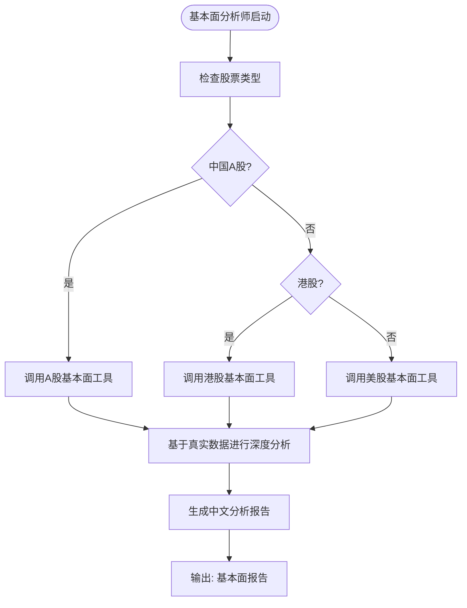

**智能体通信与状态管理**
- **输入**: 股票代码、交易日期、当前状态
- **输出**: `fundamentals_report`（基本面报告）
- **状态转换**: 通过`AgentState`中的`fundamentals_report`字段传递分析结果

**智能体记忆与上下文处理**
- 在分析前会检索历史记忆，参考类似情况下的过去错误，以完善决策制定
- 使用`FinancialSituationMemory`类管理记忆，通过向量数据库存储和检索历史投资建议

**本节来源**
- [fundamentals_analyst.py](file://tradingagents/agents/analysts/fundamentals_analyst.py#L1-L401)

### 市场分析师

市场分析师负责技术分析，评估股票的价格走势和市场趋势。该智能体能够根据股票类型自动选择合适的数据源，对中国A股使用优化的缓存数据获取，对美股/港股使用FINNHUB API。分析师会分析移动平均线、MACD、RSI、布林带等技术指标，并结合市场特点进行分析。

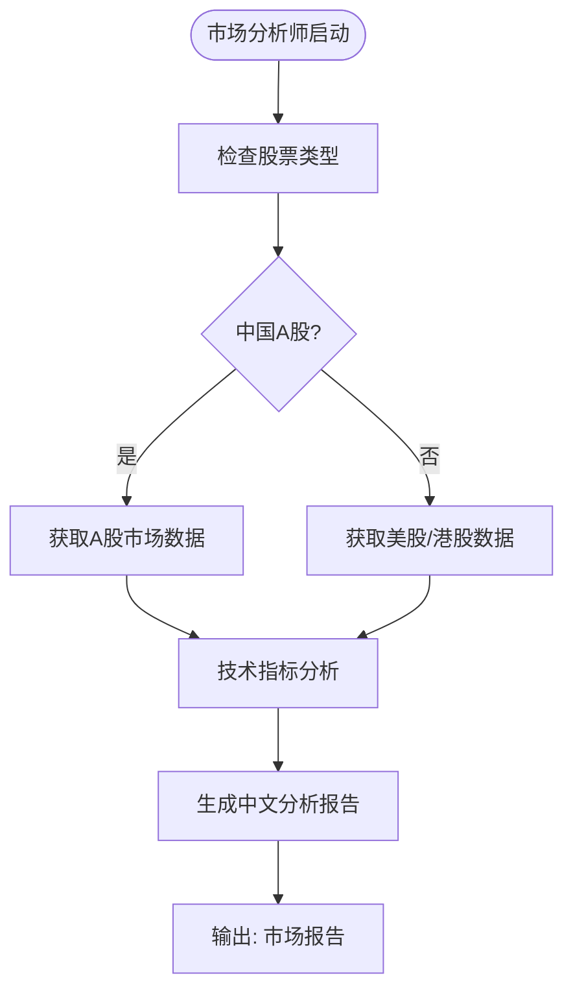

**智能体通信与状态管理**
- **输入**: 股票代码、交易日期、当前状态
- **输出**: `market_report`（市场报告）
- **状态转换**: 通过`AgentState`中的`market_report`字段传递分析结果

**智能体记忆与上下文处理**
- 分析师会考虑当前市场特点进行分析，确保分析结果与市场环境相符
- 所有价格数据使用正确的货币单位表示，确保分析的准确性

**本节来源**
- [market_analyst.py](file://tradingagents/agents/analysts/market_analyst.py#L1-L520)

### 新闻分析师

新闻分析师负责分析最新的市场新闻和事件对股票价格的潜在影响。该智能体使用统一的新闻工具`get_stock_news_unified`自动识别股票类型并获取相应新闻，确保分析的全面性和准确性。分析师会评估新闻事件的紧急程度和市场影响，识别可能影响股价的关键信息。

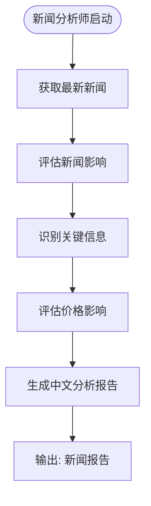

**智能体通信与状态管理**
- **输入**: 股票代码、交易日期、当前状态
- **输出**: `news_report`（新闻报告）
- **状态转换**: 通过`AgentState`中的`news_report`字段传递分析结果

**智能体记忆与上下文处理**
- 分析师会特别注意新闻的时效性，如果新闻数据存在滞后，会在分析中明确说明
- 优先分析最新的、高相关性的新闻事件，确保分析的及时性

**本节来源**
- [news_analyst.py](file://tradingagents/agents/analysts/news_analyst.py#L1-L348)

### 社交媒体分析师

社交媒体分析师负责分析中国投资者对特定股票的讨论和情绪变化。该智能体重点关注中国主要财经平台的投资者情绪，如雪球、东方财富股吧等，监控财经媒体和新闻对股票的报道倾向。分析师会量化投资者情绪强度，评估情绪变化对短期股价的影响。

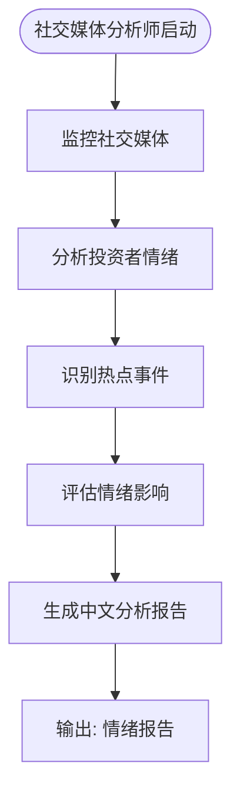

**智能体通信与状态管理**
- **输入**: 股票代码、交易日期、当前状态
- **输出**: `sentiment_report`（情绪报告）
- **状态转换**: 通过`AgentState`中的`sentiment_report`字段传递分析结果

**智能体记忆与上下文处理**
- 分析师会评估散户与机构投资者的观点差异，提供更全面的市场视角
- 由于中国社交媒体API限制，如果数据获取受限，会明确说明并提供替代分析建议

**本节来源**
- [social_media_analyst.py](file://tradingagents/agents/analysts/social_media_analyst.py#L1-L214)

## 研究员团队辩论机制

研究员团队由看涨研究员和看跌研究员组成，通过辩论机制形成投资建议。这种创新设计模拟了真实投资团队中的多角度讨论，确保决策的全面性和客观性。研究主管作为主持人，负责总结双方观点并做出最终决策。

### 看涨研究员

看涨研究员负责为股票投资建立强有力的论证，强调增长潜力、竞争优势和积极的市场指标。该智能体利用提供的研究和数据来解决担忧并有效反驳看跌论点，构建基于证据的强有力案例。

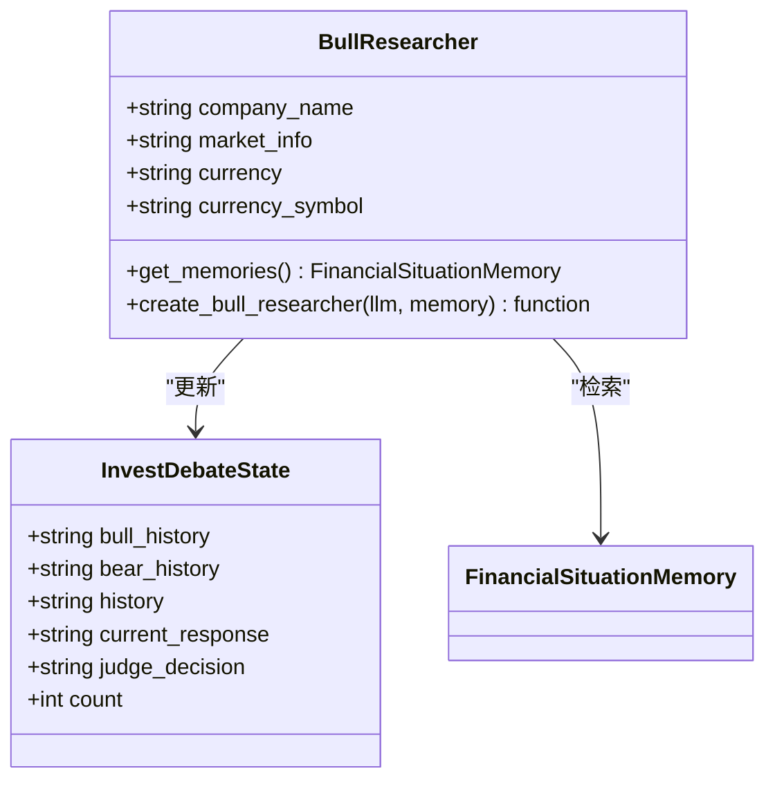

**智能体通信与状态管理**
- **输入**: 市场报告、情绪报告、新闻报告、基本面报告、辩论历史
- **输出**: 更新`investment_debate_state`中的`bull_history`和`current_response`
- **状态转换**: 通过`InvestDebateState`类管理辩论状态，记录看涨研究员的历史观点

**智能体记忆与上下文处理**
- 研究员会从过去的经验教训和错误中学习，避免重复过去的错误
- 使用`FinancialSituationMemory`检索类似情况下的历史记忆，完善当前分析

**本节来源**
- [bull_researcher.py](file://tradingagents/agents/researchers/bull_researcher.py#L1-L99)

### 看跌研究员

看跌研究员负责论证不投资某只股票的理由，强调风险、挑战和负面指标。该智能体利用提供的研究和数据来突出潜在的不利因素并有效反驳看涨论点，提出合理的投资风险警示。

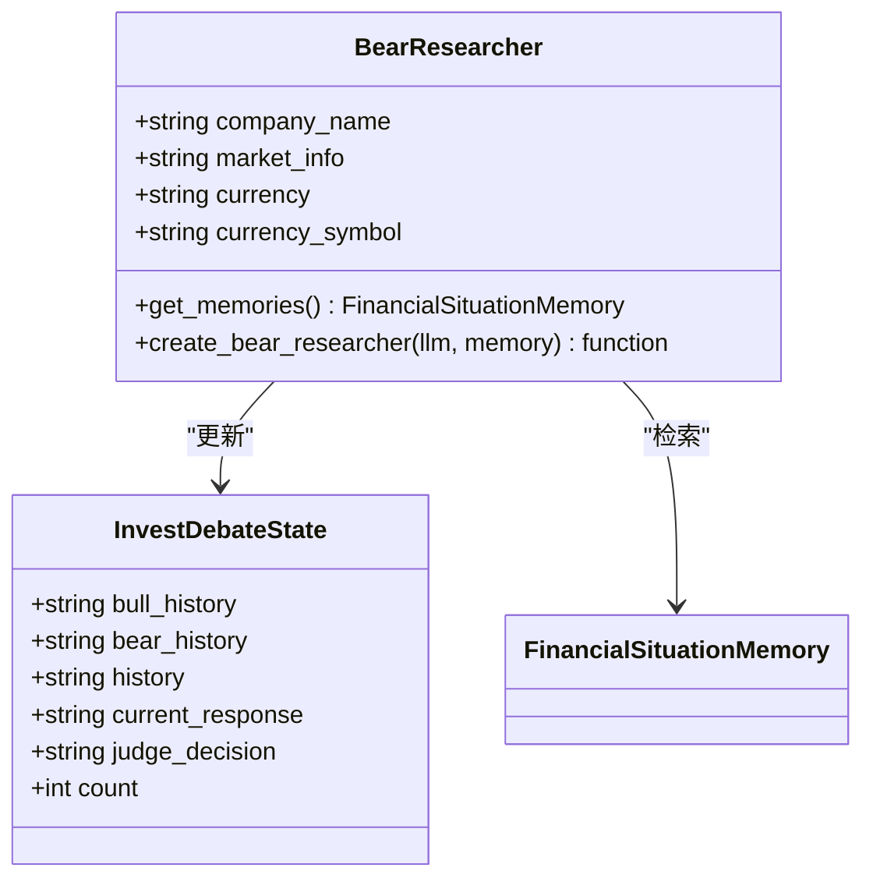

**智能体通信与状态管理**
- **输入**: 市场报告、情绪报告、新闻报告、基本面报告、辩论历史
- **输出**: 更新`investment_debate_state`中的`bear_history`和`current_response`
- **状态转换**: 通过`InvestDebateState`类管理辩论状态，记录看跌研究员的历史观点

**智能体记忆与上下文处理**
- 研究员会从过去的经验教训和错误中学习，确保风险评估的全面性
- 使用`FinancialSituationMemory`检索类似情况下的历史记忆，完善当前分析

**本节来源**
- [bear_researcher.py](file://tradingagents/agents/researchers/bear_researcher.py#L1-L90)

## 管理层智能体协调功能

管理层智能体包括研究主管和风险主管，负责协调团队讨论和做出最终决策。研究主管作为投资组合经理和辩论主持人，负责评估看涨/看跌研究员的辩论并做出明确决策。风险主管作为风险管理委员会主席，负责评估风险分析师的辩论并确定最佳行动方案。

### 研究主管

研究主管负责批判性地评估看涨/看跌研究员的辩论，并做出明确的投资决策。该智能体会简洁地总结双方的关键观点，重点关注最有说服力的证据或推理，并为交易员制定详细的投资计划。

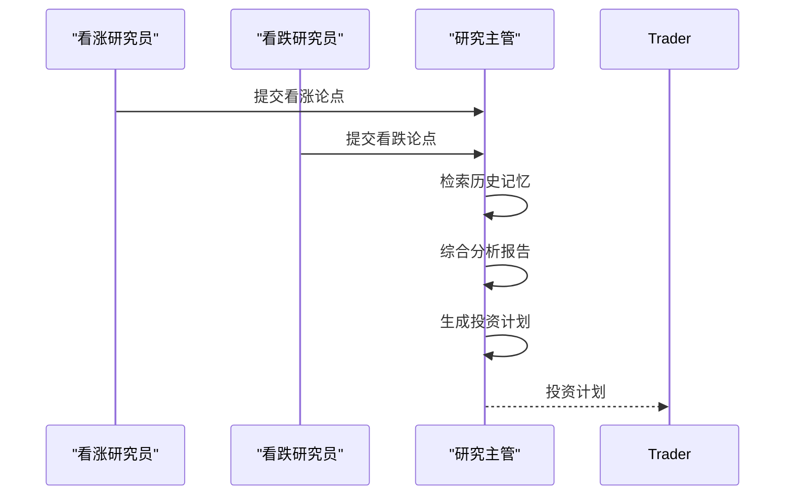

**智能体通信与状态管理**
- **输入**: 市场报告、情绪报告、新闻报告、基本面报告、辩论历史
- **输出**: `investment_plan`（投资计划）和更新的`investment_debate_state`
- **状态转换**: 通过`AgentState`中的`investment_plan`字段传递投资计划

**智能体记忆与上下文处理**
- 研究主管会考虑过去类似情况下的错误，利用这些见解来完善决策制定
- 使用`FinancialSituationMemory`检索历史记忆，避免重复过去的错误

**本节来源**
- [research_manager.py](file://tradingagents/agents/managers/research_manager.py#L1-L86)

### 风险主管

风险主管负责评估风险分析师的辩论，并确定交易员的最佳行动方案。该智能体有三位风险分析师：激进、中性和保守，通过辩论形成风险评估。风险主管会评估三位分析师的论点，并做出明确的风险管理决策。

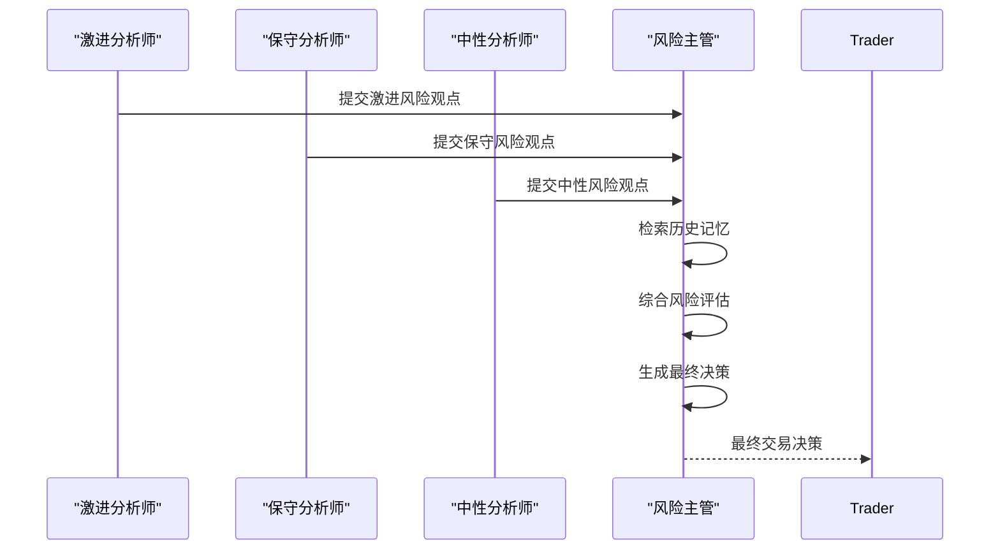

**智能体通信与状态管理**
- **输入**: 市场报告、新闻报告、基本面报告、情绪报告、交易员计划、辩论历史
- **输出**: `final_trade_decision`（最终交易决策）和更新的`risk_debate_state`
- **状态转换**: 通过`AgentState`中的`final_trade_decision`字段传递最终决策

**智能体记忆与上下文处理**
- 风险主管会从过去的经验教训和错误中学习，改进当前的决策
- 使用`FinancialSituationMemory`检索历史记忆，确保风险管理的持续改进

**本节来源**
- [risk_manager.py](file://tradingagents/agents/managers/risk_manager.py#L1-L127)

## 交易员智能体决策整合

交易员智能体负责整合各方意见，形成最终的投资建议。该智能体接收来自研究主管的投资计划，并结合市场数据做出最终的交易决策。交易员会提供明确的买入、卖出或持有建议，并给出具体的目标价位和详细推理。

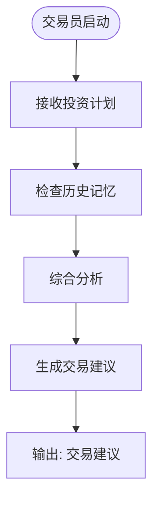

**智能体通信与状态管理**
- **输入**: 投资计划、市场报告、情绪报告、新闻报告、基本面报告
- **输出**: `trader_investment_plan`（交易员投资计划）和`sender`（发送者）
- **状态转换**: 通过`AgentState`中的`trader_investment_plan`字段传递交易建议

**智能体记忆与上下文处理**
- 交易员会利用过去决策的经验教训来避免重复错误
- 使用`FinancialSituationMemory`检索历史记忆，参考类似情况下的交易反思

**本节来源**
- [trader.py](file://tradingagents/agents/trader/trader.py#L1-L117)

## 智能体通信与状态管理

智能体系统通过精心设计的通信协议和状态管理机制实现高效协作。所有智能体共享一个统一的状态对象`AgentState`，通过该对象传递信息和协调工作流程。

### 状态定义

`AgentState`类定义了智能体系统中所有共享的状态变量，包括公司兴趣、交易日期、各类型报告、辩论状态和最终决策等。

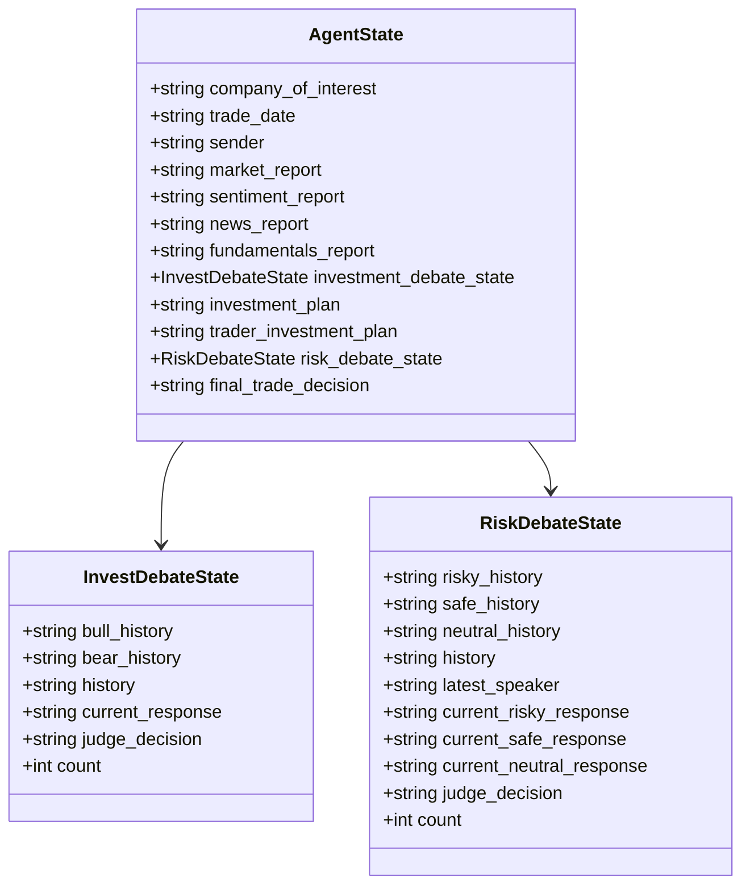

**智能体通信模式**
- **顺序通信**: 智能体按照预定义的顺序依次执行，每个智能体的输出作为下一个智能体的输入
- **状态共享**: 所有智能体共享`AgentState`对象，通过该对象传递信息和协调工作
- **反馈循环**: 系统支持从过去的经验中学习，通过记忆机制实现持续改进

**本节来源**
- [agent_states.py](file://tradingagents/agents/utils/agent_states.py#L1-L81)

## 智能体记忆与上下文处理

智能体系统通过`FinancialSituationMemory`类实现记忆管理和上下文处理，确保系统能够从过去的经验中学习并持续改进。

### 记忆管理机制

`FinancialSituationMemory`类使用ChromaDB作为向量数据库，存储和检索历史投资建议。系统会根据当前情况的相似度检索最相关的记忆，为当前决策提供参考。

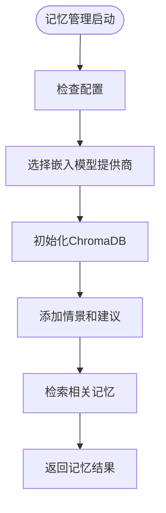

**记忆管理功能**
- **向量嵌入**: 使用不同提供商的嵌入模型将文本转换为向量，支持DashScope、OpenAI、Google等
- **智能截断**: 对长文本进行智能截断，保持语义完整性
- **降级选项**: 当主要嵌入服务不可用时，自动切换到备用方案
- **长度限制**: 支持配置向量缓存的长度限制，避免处理过长文本

**上下文处理策略**
- **上下文感知**: 智能体能够根据股票类型自动调整分析策略和货币单位
- **错误处理**: 系统包含完善的错误处理和重试机制，确保在异常情况下仍能正常运行
- **日志记录**: 详细的日志记录功能，便于调试和监控系统运行状态

**本节来源**
- [memory.py](file://tradingagents/agents/utils/memory.py#L1-L713)

## 结论

TradingAgents-CN的智能体系统通过专业分工、协同决策和持续学习的机制，实现了复杂的投资分析和决策过程。系统中的各类智能体各司其职，通过精心设计的通信协议和状态管理机制高效协作。研究员团队的辩论机制确保了决策的全面性和客观性，管理层智能体的协调功能保证了决策的质量和一致性，交易员智能体的整合能力形成了最终的投资建议。通过`FinancialSituationMemory`类实现的记忆管理和上下文处理，系统能够从过去的经验中学习并持续改进。这一创新的智能体系统为自动化投资分析提供了强大的技术支持。