# 研究员团队

<cite>
**本文档引用的文件**
- [bull_researcher.py](file://tradingagents/agents/researchers/bull_researcher.py)
- [bear_researcher.py](file://tradingagents/agents/researchers/bear_researcher.py)
- [research_manager.py](file://tradingagents/agents/managers/research_manager.py)
- [setup.py](file://tradingagents/graph/setup.py)
- [trading_graph.py](file://tradingagents/graph/trading_graph.py)
- [conditional_logic.py](file://tradingagents/graph/conditional_logic.py)
- [agent_states.py](file://tradingagents/agents/utils/agent_states.py)
- [memory.py](file://tradingagents/agents/utils/memory.py)
- [reflection.py](file://tradingagents/graph/reflection.py)
- [logging_init.py](file://tradingagents/utils/logging_init.py)
- [default_config.py](file://tradingagents/default_config.py)
</cite>

## 目录
1. [简介](#简介)
2. [系统架构概览](#系统架构概览)
3. [核心组件分析](#核心组件分析)
4. [辩论机制设计](#辩论机制设计)
5. [提示词工程与LLM调用](#提示词工程与llm调用)
6. [记忆系统与对抗性推理](#记忆系统与对抗性推理)
7. [智能体协作链](#智能体协作链)
8. [应用场景与调试建议](#应用场景与调试建议)
9. [总结](#总结)

## 简介

研究员团队是TradingAgents-CN智能交易系统中的核心分析组件，负责通过看涨研究员（bull_researcher）和看跌研究员（bear_researcher）之间的辩论机制，为投资决策提供多角度论证。该团队基于分析师团队的输出进行深入分析，通过对抗性推理增强决策的鲁棒性，最终为研究主管智能体提供全面的投资建议。

## 系统架构概览

研究员团队采用基于LangGraph的有向无环图（DAG）架构，实现了复杂的多智能体协作流程：

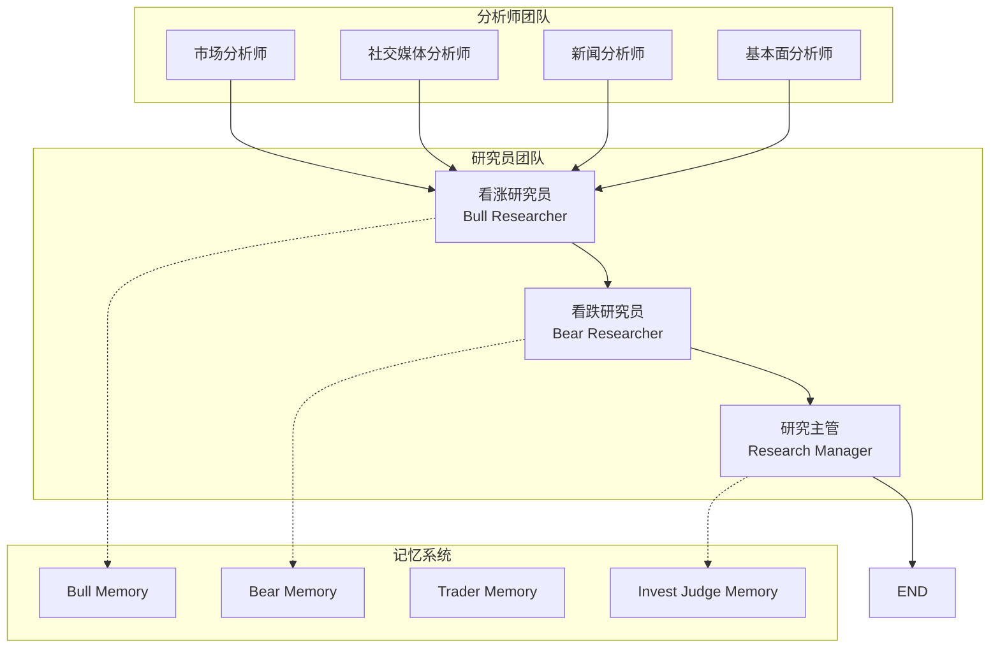

**图表来源**
- [setup.py](file://tradingagents/graph/setup.py#L205-L252)
- [trading_graph.py](file://tradingagents/graph/trading_graph.py#L237-L255)

**章节来源**
- [setup.py](file://tradingagents/graph/setup.py#L1-L254)
- [trading_graph.py](file://tradingagents/graph/trading_graph.py#L1-L441)

## 核心组件分析

### 看涨研究员（Bull Researcher）

看涨研究员负责构建支持股票投资的强有力论证，强调增长潜力、竞争优势和积极的市场指标：

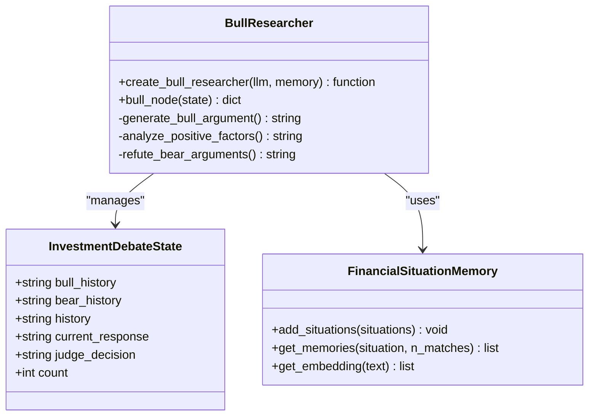

**图表来源**
- [bull_researcher.py](file://tradingagents/agents/researchers/bull_researcher.py#L8-L99)
- [agent_states.py](file://tradingagents/agents/utils/agent_states.py#L12-L25)
- [memory.py](file://tradingagents/agents/utils/memory.py#L137-L713)

### 看跌研究员（Bear Researcher）

看跌研究员专注于识别投资风险、挑战和负面指标，为投资决策提供审慎视角：

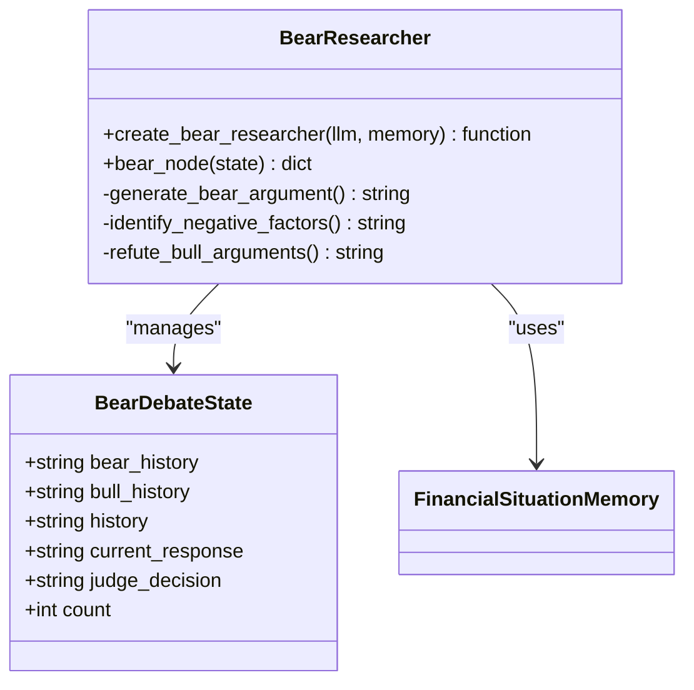

**图表来源**
- [bear_researcher.py](file://tradingagents/agents/researchers/bear_researcher.py#L8-L90)
- [agent_states.py](file://tradingagents/agents/utils/agent_states.py#L12-L25)
- [memory.py](file://tradingagents/agents/utils/memory.py#L137-L713)

### 研究主管（Research Manager）

研究主管作为辩论的仲裁者，负责批判性评估双方论点并做出明确的投资决策：

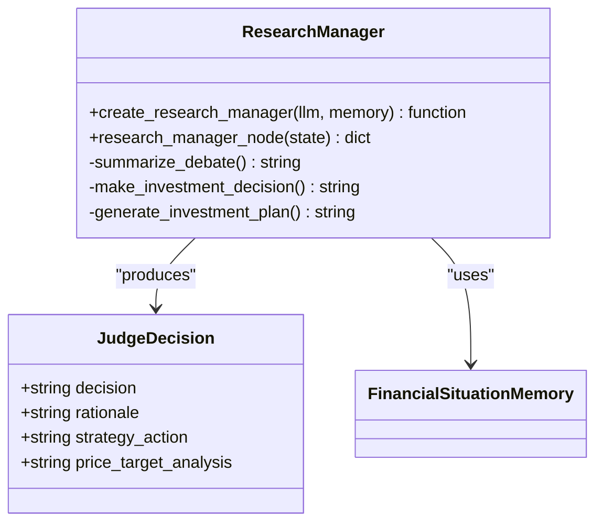

**图表来源**
- [research_manager.py](file://tradingagents/agents/managers/research_manager.py#L8-L86)
- [agent_states.py](file://tradingagents/agents/utils/agent_states.py#L12-L25)
- [memory.py](file://tradingagents/agents/utils/memory.py#L137-L713)

**章节来源**
- [bull_researcher.py](file://tradingagents/agents/researchers/bull_researcher.py#L1-L99)
- [bear_researcher.py](file://tradingagents/agents/researchers/bear_researcher.py#L1-L90)
- [research_manager.py](file://tradingagents/agents/managers/research_manager.py#L1-L86)

## 辩论机制设计

研究员团队的辩论机制基于循环迭代的对抗性推理过程，通过条件逻辑控制辩论流程：

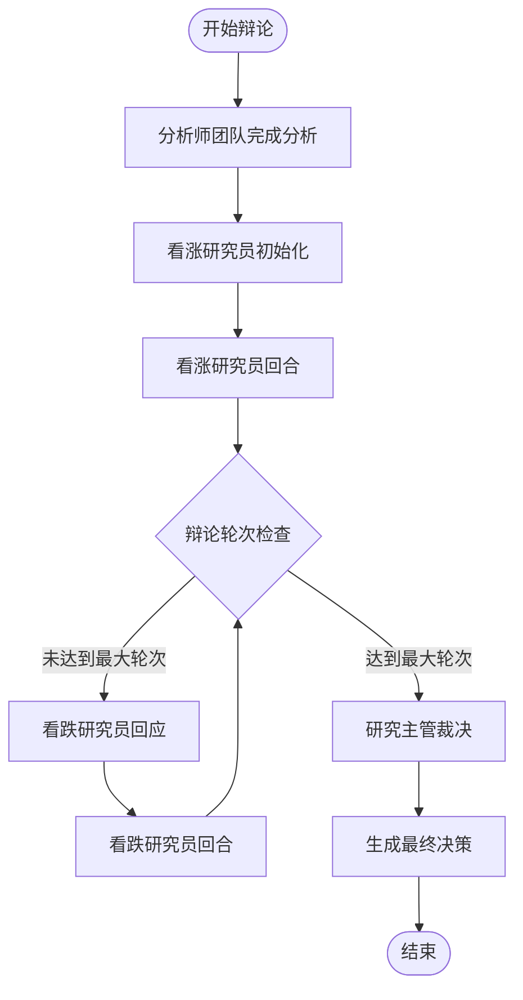

**图表来源**
- [conditional_logic.py](file://tradingagents/graph/conditional_logic.py#L58-L66)
- [setup.py](file://tradingagents/graph/setup.py#L205-L252)

### 辩论轮次控制

辩论机制通过以下规则控制轮次：

| 参数 | 默认值 | 说明 |
|------|--------|------|
| 最大辩论轮次 | 1 | 控制看涨和看跌研究员之间的对话轮数 |
| 总轮次计算 | 2 × max_debate_rounds | 3轮对话（2×1） |
| 轮次检查 | 基于计数器 | 每回合增加计数器值 |

### 状态管理

辩论过程中的状态通过`InvestDebateState`结构管理：

| 字段 | 类型 | 用途 |
|------|------|------|
| bull_history | string | 看涨研究员对话历史 |
| bear_history | string | 看跌研究员对话历史 |
| history | string | 完整对话历史 |
| current_response | string | 最新回应 |
| judge_decision | string | 研究主管决策 |
| count | int | 当前对话轮次 |

**章节来源**
- [conditional_logic.py](file://tradingagents/graph/conditional_logic.py#L1-L80)
- [agent_states.py](file://tradingagents/agents/utils/agent_states.py#L12-L25)

## 提示词工程与LLM调用

### 看涨研究员提示词设计

看涨研究员采用结构化的提示词模板，强调积极因素和增长潜力：

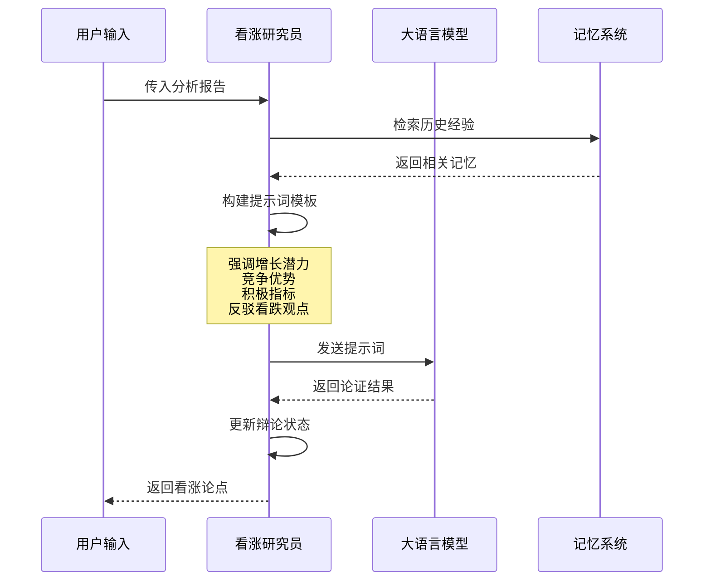

**图表来源**
- [bull_researcher.py](file://tradingagents/agents/researchers/bull_researcher.py#L40-L80)

### 看跌研究员提示词设计

看跌研究员专注于风险识别和负面因素分析：

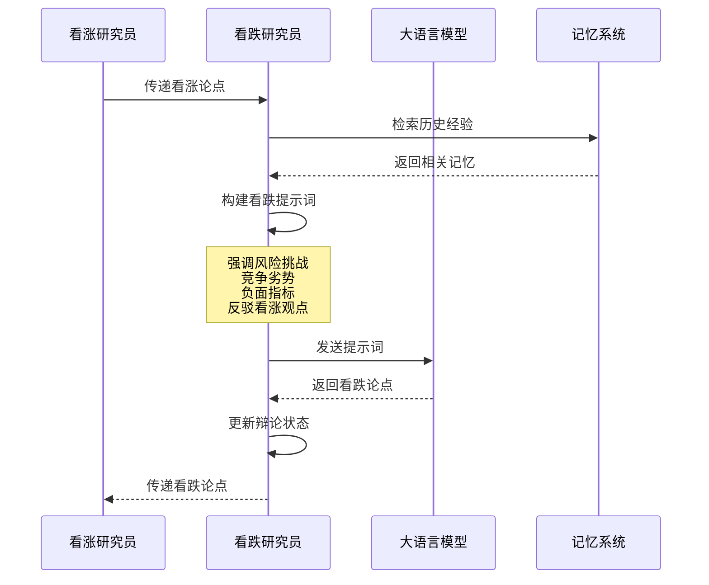

**图表来源**
- [bear_researcher.py](file://tradingagents/agents/researchers/bear_researcher.py#L35-L75)

### 研究主管提示词设计

研究主管采用综合评估模板，平衡双方论点：

| 分析要素 | 提示词重点 | 输出要求 |
|----------|------------|----------|
| 关键观点总结 | 提炼双方核心论点 | 简洁明了的要点列表 |
| 最有说服力证据 | 评估论点强度 | 基于数据和逻辑的判断 |
| 投资建议 | 明确立场 | 买入、卖出或持有 |
| 战略行动 | 具体执行步骤 | 可操作的行动计划 |
| 目标价格分析 | 全面价格评估 | 具体价格目标和时间范围 |

**章节来源**
- [bull_researcher.py](file://tradingagents/agents/researchers/bull_researcher.py#L40-L99)
- [bear_researcher.py](file://tradingagents/agents/researchers/bear_researcher.py#L35-L90)
- [research_manager.py](file://tradingagents/agents/managers/research_manager.py#L25-L86)

## 记忆系统与对抗性推理

### 记忆系统架构

研究员团队采用基于向量嵌入的记忆系统，支持智能检索和经验学习：

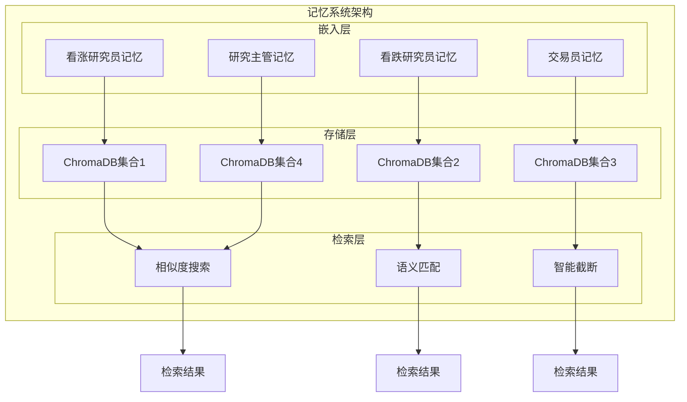

**图表来源**
- [memory.py](file://tradingagents/agents/utils/memory.py#L137-L713)
- [trading_graph.py](file://tradingagents/graph/trading_graph.py#L237-L255)

### 对抗性推理流程

记忆系统支持研究员之间的对抗性推理，通过历史经验指导当前分析：

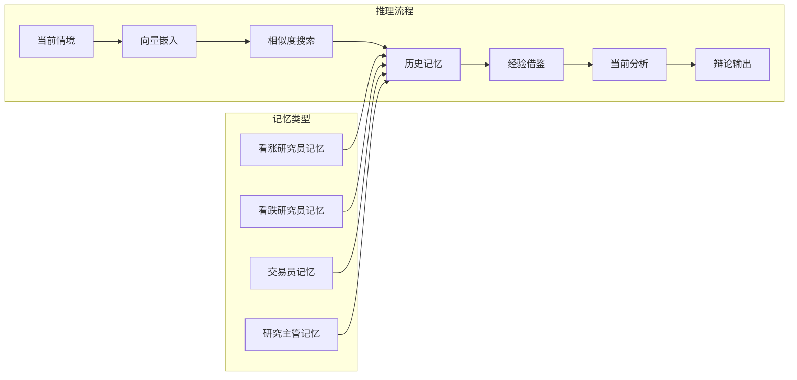

**图表来源**
- [reflection.py](file://tradingagents/graph/reflection.py#L76-L124)
- [memory.py](file://tradingagents/agents/utils/memory.py#L592-L623)

### 多提供商支持

记忆系统支持多种LLM提供商的嵌入模型：

| 提供商 | 嵌入模型 | 特点 |
|--------|----------|------|
| 阿里百炼 | text-embedding-v3 | 高质量中文处理 |
| 百度千帆 | text-embedding-v3 | 文心一言专用 |
| DeepSeek | text-embedding-v3/OpenAI | 双重降级选项 |
| Google AI | text-embedding-v3 | 阿里百炼降级 |
| OpenAI | text-embedding-3-small | 标准兼容 |

**章节来源**
- [memory.py](file://tradingagents/agents/utils/memory.py#L104-L713)
- [reflection.py](file://tradingagents/graph/reflection.py#L76-L124)

## 智能体协作链

研究员团队在整体智能体协作链中扮演关键角色，与研究主管智能体形成完整的决策闭环：

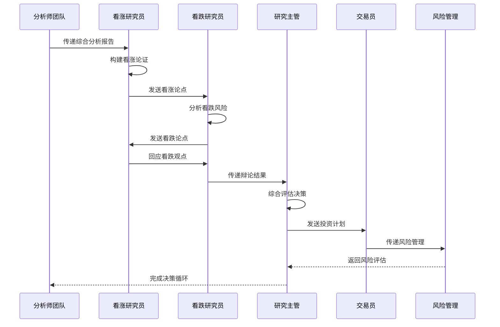

**图表来源**
- [setup.py](file://tradingagents/graph/setup.py#L205-L252)
- [trading_graph.py](file://tradingagents/graph/trading_graph.py#L237-L255)

### 协作链中的位置

研究员团队位于分析师团队和交易决策之间，起到承上启下的作用：

| 阶段 | 研究员团队职责 | 输出内容 |
|------|----------------|----------|
| 上游 | 整合分析师报告 | 综合分析视角 |
| 中游 | 对抗性辩论 | 多角度论证 |
| 下游 | 支持决策制定 | 投资建议和计划 |

### 与研究主管的交互

研究主管通过以下方式与研究员团队交互：

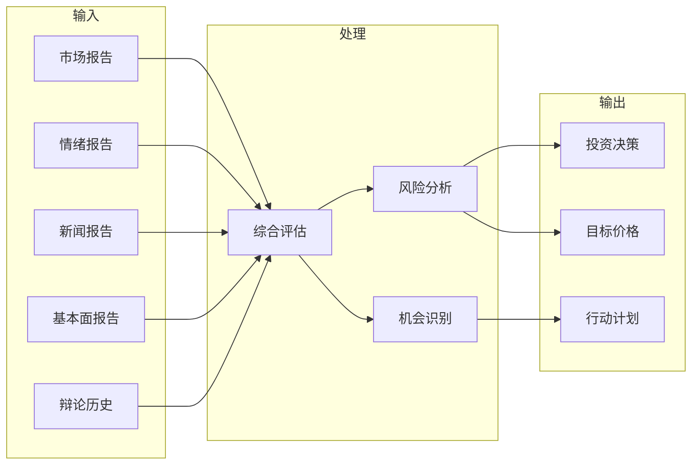

**图表来源**
- [research_manager.py](file://tradingagents/agents/managers/research_manager.py#L25-L86)

**章节来源**
- [setup.py](file://tradingagents/graph/setup.py#L205-L252)
- [trading_graph.py](file://tradingagents/graph/trading_graph.py#L237-L255)

## 应用场景与调试建议

### 典型应用场景

研究员团队适用于以下投资分析场景：

| 场景类型 | 适用性 | 关键优势 |
|----------|--------|----------|
| 股票筛选 | 高 | 多角度风险评估 |
| 行业分析 | 高 | 对比性视角分析 |
| 投资组合优化 | 中 | 动态风险平衡 |
| 事件驱动分析 | 中 | 对冲策略制定 |
| 长期趋势判断 | 低 | 短期决策支持 |

### 调试与监控

系统提供了完善的调试和监控机制：

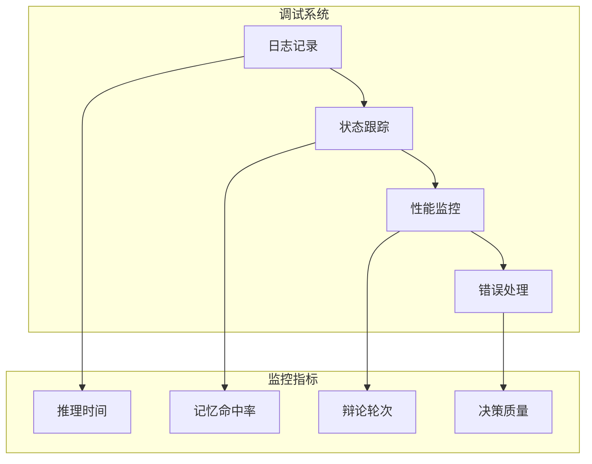

**图表来源**
- [logging_init.py](file://tradingagents/utils/logging_init.py#L1-L166)

### 性能优化建议

1. **记忆系统优化**
   - 合理配置嵌入模型和向量维度
   - 监控ChromaDB集合大小
   - 定期清理过期记忆数据

2. **辩论效率提升**
   - 控制最大辩论轮次避免过度迭代
   - 优化提示词模板减少Token消耗
   - 使用适当的LLM模型平衡质量和成本

3. **系统稳定性**
   - 监控API调用频率和配额
   - 实施优雅的降级策略
   - 建立完善的错误恢复机制

### 配置最佳实践

| 参数 | 推荐值 | 说明 |
|------|--------|------|
| max_debate_rounds | 1-2 | 平衡深度和效率 |
| memory_enabled | true | 启用经验学习 |
| max_embedding_length | 50000 | 长文本处理能力 |
| enable_embedding_length_check | true | 长度限制保护 |

**章节来源**
- [default_config.py](file://tradingagents/default_config.py#L1-L28)
- [logging_init.py](file://tradingagents/utils/logging_init.py#L1-L166)

## 总结

研究员团队通过看涨研究员和看跌研究员之间的辩论机制，实现了智能投资分析的多角度论证。该系统具有以下核心优势：

1. **对抗性推理**：通过正反两方的辩论，确保分析的全面性和客观性
2. **记忆学习**：基于向量嵌入的记忆系统支持经验传承和持续改进
3. **灵活架构**：模块化设计支持多种LLM提供商和配置选项
4. **智能协作**：与分析师团队和研究主管形成完整的决策链条

该团队为TradingAgents-CN系统提供了强大的分析能力，能够为投资者提供更加稳健和可靠的投资建议。通过持续的优化和迭代，研究员团队将在智能投顾领域发挥越来越重要的作用。