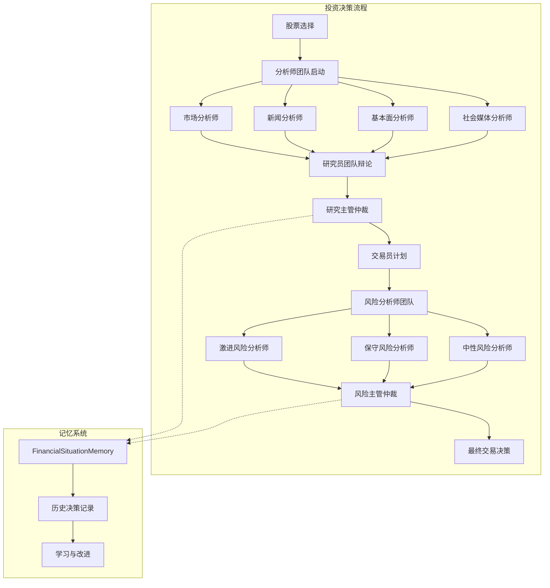
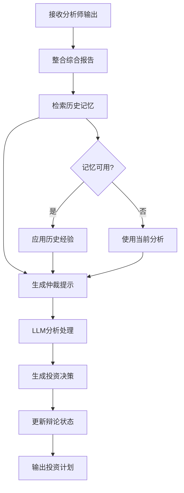
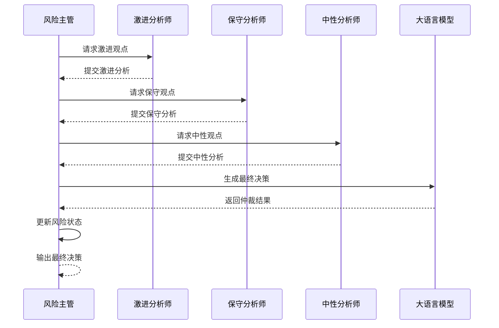
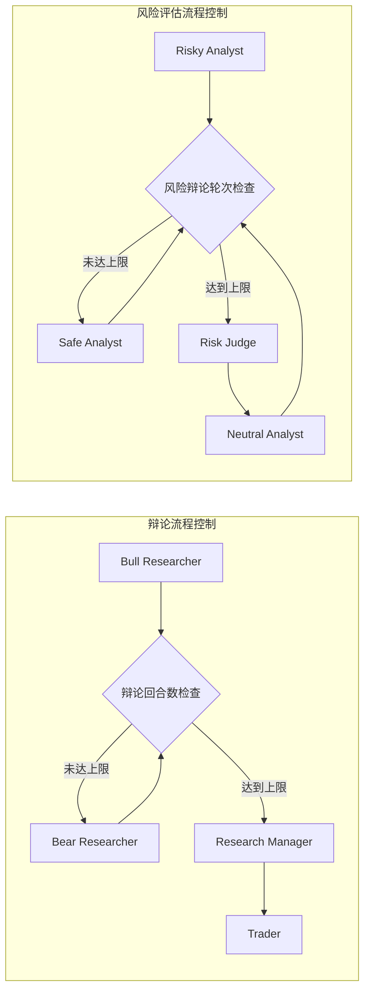
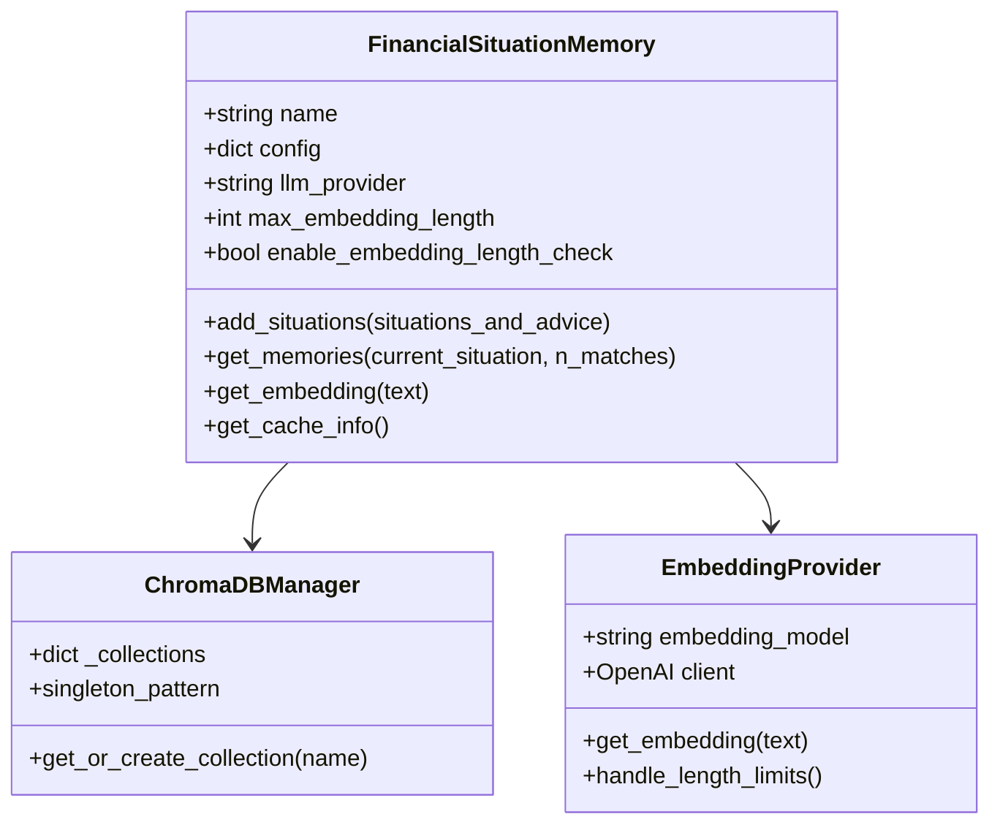

# 管理层智能体

<cite>
**本文档中引用的文件**
- [research_manager.py](file://tradingagents/agents/managers/research_manager.py)
- [risk_manager.py](file://tradingagents/agents/managers/risk_manager.py)
- [trading_graph.py](file://tradingagents/graph/trading_graph.py)
- [agent_states.py](file://tradingagents/agents/utils/agent_states.py)
- [memory.py](file://tradingagents/agents/utils/memory.py)
- [conditional_logic.py](file://tradingagents/graph/conditional_logic.py)
- [setup.py](file://tradingagents/graph/setup.py)
- [default_config.py](file://tradingagents/default_config.py)
- [simple_analysis_demo.py](file://examples/simple_analysis_demo.py)
- [test_risk_assessment.py](file://tests/test_risk_assessment.py)
</cite>

## 目录
1. [简介](#简介)
2. [系统架构概览](#系统架构概览)
3. [研究主管（Research Manager）](#研究主管research-manager)
4. [风险主管（Risk Manager）](#风险主管risk-manager)
5. [工作流仲裁机制](#工作流仲裁机制)
6. [配置参数详解](#配置参数详解)
7. [内存与学习机制](#内存与学习机制)
8. [性能优化建议](#性能优化建议)
9. [常见问题排查](#常见问题排查)
10. [最佳实践指南](#最佳实践指南)

## 简介

管理层智能体是TradingAgents-CN投资决策系统的核心组件，负责整合各分析师和研究员的输出，形成统一的投资策略建议。系统包含两个关键角色：研究主管（Research Manager）和风险主管（Risk Manager），它们在决策链中发挥着仲裁和协调的作用。

研究主管负责整合来自市场分析师、新闻分析师、基本面分析师等多方面的信息，评估投资方案的价值主张，并制定具体的投资行动计划。风险主管则专注于评估投资方案的风险等级，执行合规检查，并提出相应的风险控制建议。

## 系统架构概览



**图表来源**
- [trading_graph.py](file://tradingagents/graph/trading_graph.py#L1-L441)
- [setup.py](file://tradingagents/graph/setup.py#L205-L252)

**章节来源**
- [trading_graph.py](file://tradingagents/graph/trading_graph.py#L1-L100)
- [agent_states.py](file://tradingagents/agents/utils/agent_states.py#L1-L81)

## 研究主管（Research Manager）

### 核心功能

研究主管是投资决策流程中的关键仲裁者，负责整合各分析师的输出并形成明确的投资建议。其主要职责包括：

1. **综合分析整合**：汇总市场研究、情绪分析、新闻分析和基本面分析的结果
2. **辩论仲裁**：评估看涨分析师和看跌分析师的论点，做出明确的投资决策
3. **投资计划制定**：为交易员制定详细的操作计划
4. **目标价格分析**：提供全面的目标价格区间和具体价格目标

### 工作原理

研究主管通过以下流程执行其功能：



**图表来源**
- [research_manager.py](file://tradingagents/agents/managers/research_manager.py#L10-L85)

### 关键特性

#### 1. 历史记忆集成
研究主管能够检索和应用过往的决策经验，避免重复错误：

```python
# 历史记忆检索示例
past_memories = memory.get_memories(curr_situation, n_matches=2)
past_memory_str = ""
for i, rec in enumerate(past_memories, 1):
    past_memory_str += rec["recommendation"] + "\n\n"
```

#### 2. 多维度分析
系统整合四个维度的分析结果：
- **市场研究报告**：技术面和基本面分析
- **情绪分析报告**：市场情绪和投资者心理
- **新闻分析报告**：实时新闻事件影响
- **基本面分析报告**：财务数据和业务分析

#### 3. 目标价格体系
研究主管提供多层次的目标价格分析：

| 价格类型 | 时间范围 | 风险水平 | 应用场景 |
|---------|---------|---------|---------|
| 保守价格 | 1-3个月 | 低风险 | 稳健型投资者 |
| 基准价格 | 3-6个月 | 中等风险 | 平衡型投资者 |
| 乐观价格 | 6-12个月 | 高风险 | 积极型投资者 |

**章节来源**
- [research_manager.py](file://tradingagents/agents/managers/research_manager.py#L1-L86)

## 风险主管（Risk Manager）

### 核心功能

风险主管负责评估投资方案的整体风险水平，确保投资决策符合风险控制要求。其核心职责包括：

1. **风险评估仲裁**：整合激进、保守和中性风险分析师的观点
2. **合规检查**：验证投资决策是否符合合规要求
3. **风险控制建议**：提供具体的风险管理措施
4. **决策质量保证**：确保决策的严谨性和可靠性

### 工作流程



**图表来源**
- [risk_manager.py](file://tradingagents/agents/managers/risk_manager.py#L10-L127)
- [conditional_logic.py](file://tradingagents/graph/conditional_logic.py#L60-L79)

### 关键特性

#### 1. 多轮辩论机制
风险主管支持三轮辩论，确保充分的风险评估：

```python
# 风险辩论条件判断
def should_continue_risk_analysis(self, state: AgentState) -> str:
    if state["risk_debate_state"]["count"] >= 3 * self.max_risk_discuss_rounds:
        return "Risk Judge"
    if state["risk_debate_state"]["latest_speaker"].startswith("Risky"):
        return "Safe Analyst"
    if state["risk_debate_state"]["latest_speaker"].startswith("Safe"):
        return "Neutral Analyst"
    return "Risky Analyst"
```

#### 2. 错误处理与重试机制
风险主管实现了完善的错误处理系统：

```python
# 重试机制示例
max_retries = 3
retry_count = 0
while retry_count < max_retries:
    try:
        response = llm.invoke(prompt)
        if response and response.content:
            break
    except Exception as e:
        retry_count += 1
        time.sleep(2)
```

#### 3. 默认决策机制
当LLM调用失败时，系统提供默认的安全决策：

```python
# 默认决策模板
response_content = f"""**默认建议：持有**

由于技术原因无法生成详细分析，基于当前市场状况和风险控制原则，
建议对{company_name}采取持有策略。
```

**章节来源**
- [risk_manager.py](file://tradingagents/agents/managers/risk_manager.py#L1-L127)
- [conditional_logic.py](file://tradingagents/graph/conditional_logic.py#L60-L79)

## 工作流仲裁机制

### 条件逻辑系统

TradingAgents-CN使用复杂的条件逻辑来控制决策流程的流向：



**图表来源**
- [conditional_logic.py](file://tradingagents/graph/conditional_logic.py#L50-L79)
- [setup.py](file://tradingagents/graph/setup.py#L205-L252)

### 状态管理系统

系统维护复杂的状态信息来跟踪决策进程：

| 状态类型 | 包含字段 | 用途 |
|---------|---------|------|
| InvestDebateState | bull_history, bear_history, history, current_response, judge_decision, count | 研究辩论状态管理 |
| RiskDebateState | risky_history, safe_history, neutral_history, history, latest_speaker, judge_decision, count | 风险评估状态管理 |
| AgentState | company_of_interest, trade_date, market_report, sentiment_report, news_report, fundamentals_report, investment_debate_state, risk_debate_state, final_trade_decision | 全局代理状态 |

**章节来源**
- [agent_states.py](file://tradingagents/agents/utils/agent_states.py#L1-L81)
- [conditional_logic.py](file://tradingagents/graph/conditional_logic.py#L1-L80)

## 配置参数详解

### 基础配置参数

系统提供了丰富的配置选项来适应不同的使用场景：

| 参数名称 | 默认值 | 类型 | 说明 |
|---------|-------|------|------|
| llm_provider | "openai" | string | LLM提供商选择 |
| deep_think_llm | "o4-mini" | string | 深度思考模型 |
| quick_think_llm | "gpt-4o-mini" | string | 快速思考模型 |
| backend_url | "https://api.openai.com/v1" | string | LLM API端点 |
| max_debate_rounds | 1 | integer | 最大辩论轮次 |
| max_risk_discuss_rounds | 1 | integer | 最大风险讨论轮次 |
| max_recur_limit | 100 | integer | 最大递归限制 |

### 内存配置参数

| 参数名称 | 默认值 | 类型 | 说明 |
|---------|-------|------|------|
| memory_enabled | true | boolean | 是否启用记忆功能 |
| max_embedding_length | 50000 | integer | 嵌入向量最大长度 |
| enable_embedding_length_check | true | boolean | 是否启用长度检查 |

### 环境变量配置

系统支持通过环境变量进行配置：

```bash
# LLM提供商配置
export DASHSCOPE_API_KEY="your_api_key"
export OPENAI_API_KEY="your_api_key"
export GOOGLE_API_KEY="your_api_key"

# 功能开关配置
export ONLINE_TOOLS_ENABLED=true
export REALTIME_DATA_ENABLED=false
export MEMORY_ENABLED=true

# 性能配置
export MAX_EMBEDDING_CONTENT_LENGTH=50000
export ENABLE_EMBEDDING_LENGTH_CHECK=true
```

**章节来源**
- [default_config.py](file://tradingagents/default_config.py#L1-L28)
- [memory.py](file://tradingagents/agents/utils/memory.py#L50-L100)

## 内存与学习机制

### FinancialSituationMemory系统

系统实现了先进的记忆管理机制，支持智能的记忆检索和学习：



**图表来源**
- [memory.py](file://tradingagents/agents/utils/memory.py#L1-L200)

### 智能文本截断机制

系统实现了智能的文本截断算法，确保长文本的有效处理：

```python
# 智能截断策略
def _smart_text_truncation(self, text, max_length=8192):
    # 1. 句子边界截断
    sentences = text.split('。')
    # 2. 段落边界截断  
    paragraphs = text.split('\n')
    # 3. 首尾关键信息保留
    front_part = text[:max_length//2]
    back_part = text[-(max_length//2-100):]
```

### 学习与改进循环

系统通过反射机制实现持续学习：

```python
# 反思机制示例
def reflect_invest_judge(self, current_state, returns_losses, invest_judge_memory):
    situation = self._extract_current_situation(current_state)
    judge_decision = current_state["investment_debate_state"]["judge_decision"]
    result = self._reflect_on_component("INVEST JUDGE", judge_decision, situation, returns_losses)
    invest_judge_memory.add_situations([(situation, result)])
```

**章节来源**
- [memory.py](file://tradingagents/agents/utils/memory.py#L1-L713)
- [reflection.py](file://tradingagents/graph/reflection.py#L106-L124)

## 性能优化建议

### LLM调用优化

1. **模型选择策略**
   - 使用"gpt-4o-mini"作为快速思考模型
   - 使用"o4-mini"作为深度思考模型
   - 根据任务复杂度选择合适的模型

2. **缓存机制**
   - 启用向量缓存减少重复计算
   - 合理设置缓存大小和过期时间
   - 使用智能截断避免缓存溢出

3. **并发控制**
   - 限制同时进行的LLM调用数量
   - 实现请求队列和负载均衡
   - 设置合理的超时时间

### 内存管理优化

1. **向量存储优化**
   ```python
   # 启用长度检查
   self.enable_embedding_length_check = True
   self.max_embedding_length = 50000
   
   # 智能截断策略
   def _smart_text_truncation(self, text, max_length=8192):
       # 优先在语义边界截断
       # 保留关键信息，避免数据丢失
   ```

2. **数据库连接池**
   - 使用单例模式管理ChromaDB连接
   - 实现连接池复用机制
   - 定期清理无效连接

### 网络优化

1. **重试机制**
   ```python
   # 指数退避重试
   max_retries = 3
   base_delay = 1
   for attempt in range(max_retries):
       try:
           response = llm.invoke(prompt)
           break
       except Exception as e:
           delay = base_delay * (2 ** attempt)
           time.sleep(delay)
   ```

2. **超时控制**
   - 设置合理的请求超时时间
   - 实现连接超时和读取超时分离
   - 提供优雅的降级策略

## 常见问题排查

### API密钥问题

**问题症状**：记忆功能无法使用，返回空向量

**排查步骤**：
1. 检查环境变量设置
   ```bash
   echo $DASHSCOPE_API_KEY
   echo $OPENAI_API_KEY
   echo $GOOGLE_API_KEY
   ```

2. 验证API密钥有效性
   ```python
   # 测试DashScope API
   import dashscope
   dashscope.api_key = "your_key"
   response = dashscope.TextEmbedding.call(
       model="text-embedding-v3",
       input="测试文本"
   )
   ```

3. 检查网络连接
   ```python
   import requests
   try:
       response = requests.get("https://api.dashscope.aliyun.com")
       print("网络连接正常")
   except:
       print("网络连接异常")
   ```

### 记忆功能异常

**问题症状**：历史记忆检索失败，返回空结果

**排查步骤**：
1. 检查向量缓存配置
   ```python
   memory = FinancialSituationMemory("test", config)
   cache_info = memory.get_cache_info()
   print(cache_info)
   ```

2. 验证嵌入模型可用性
   ```python
   # 测试嵌入生成
   test_text = "测试文本"
   embedding = memory.get_embedding(test_text)
   print(f"嵌入维度: {len(embedding)}")
   ```

3. 检查集合创建状态
   ```python
   # 查看ChromaDB集合状态
   collections = chroma_manager._client.list_collections()
   print(collections)
   ```

### 性能问题

**问题症状**：系统响应缓慢，LLM调用超时

**排查步骤**：
1. 检查网络延迟
   ```python
   import time
   start_time = time.time()
   response = llm.invoke("测试")
   end_time = time.time()
   print(f"响应时间: {end_time - start_time}秒")
   ```

2. 监控资源使用
   ```python
   import psutil
   print(f"CPU使用率: {psutil.cpu_percent()}%")
   print(f"内存使用率: {psutil.virtual_memory().percent}%")
   ```

3. 优化配置参数
   ```python
   # 减少最大轮次
   config["max_debate_rounds"] = 1
   config["max_risk_discuss_rounds"] = 1
   
   # 启用缓存
   config["memory_enabled"] = True
   ```

### 决策质量异常

**问题症状**：生成的决策缺乏逻辑性或信息不足

**排查步骤**：
1. 检查输入数据完整性
   ```python
   # 验证各分析报告
   required_fields = ["market_report", "sentiment_report", "news_report", "fundamentals_report"]
   for field in required_fields:
       if not state.get(field):
           print(f"缺少必要字段: {field}")
   ```

2. 调整提示词模板
   ```python
   # 增加上下文信息
   prompt = f"""基于以下详细分析：
   市场研究: {market_report}
   情绪分析: {sentiment_report}
   新闻分析: {news_report}
   基本面分析: {fundamentals_report}
   
   请提供具体的、可操作的投资建议...
   """
   ```

3. 启用调试模式
   ```python
   # 启用详细日志
   logger.setLevel("DEBUG")
   graph = TradingAgentsGraph(debug=True)
   ```

**章节来源**
- [memory.py](file://tradingagents/agents/utils/memory.py#L200-L400)
- [risk_manager.py](file://tradingagents/agents/managers/risk_manager.py#L55-L90)

## 最佳实践指南

### 配置最佳实践

1. **生产环境配置**
   ```python
   production_config = {
       "llm_provider": "dashscope",
       "deep_think_llm": "qwen-plus",
       "quick_think_llm": "qwen-turbo",
       "memory_enabled": True,
       "max_debate_rounds": 1,
       "max_risk_discuss_rounds": 1,
       "online_tools": False,  # 生产环境关闭在线工具
   }
   ```

2. **开发环境配置**
   ```python
   dev_config = {
       "llm_provider": "openai",
       "deep_think_llm": "gpt-4o-mini",
       "quick_think_llm": "gpt-4o-mini",
       "memory_enabled": True,
       "max_debate_rounds": 2,
       "max_risk_discuss_rounds": 2,
       "online_tools": True,  # 开启在线工具便于测试
   }
   ```

### 数据质量保证

1. **输入验证**
   ```python
   def validate_input(company_name, trade_date):
       if not company_name or not isinstance(company_name, str):
           raise ValueError("公司名称不能为空且必须是字符串")
       
       try:
           date_obj = datetime.strptime(trade_date, "%Y-%m-%d")
       except:
           raise ValueError("交易日期格式必须为YYYY-MM-DD")
   ```

2. **输出标准化**
   ```python
   def standardize_decision(decision):
       # 标准化决策格式
       decision = decision.strip()
       decision = re.sub(r'\n+', '\n', decision)  # 压缩多余换行
       decision = decision[:1000]  # 限制输出长度
       return decision
   ```

### 监控与日志

1. **关键指标监控**
   ```python
   # 监控指标收集
   metrics = {
       "response_time": response_time,
       "decision_quality_score": quality_score,
       "memory_hit_rate": hit_rate,
       "error_rate": error_rate,
   }
   ```

2. **日志分级**
   ```python
   # 结构化日志
   logger.info({
       "event": "decision_made",
       "company": company_name,
       "decision": final_decision,
       "confidence": confidence_score,
       "timestamp": datetime.now(),
   })
   ```

### 安全考虑

1. **API密钥管理**
   ```python
   # 使用环境变量而非硬编码
   api_key = os.getenv("DASHSCOPE_API_KEY")
   if not api_key:
       raise ValueError("API密钥未设置")
   ```

2. **输入过滤**
   ```python
   def sanitize_input(input_text):
       # 过滤潜在的恶意输入
       sanitized = re.sub(r'[^\w\s\u4e00-\u9fff]', '', input_text)
       return sanitized[:1000]  # 限制输入长度
   ```

### 扩展性设计

1. **插件化架构**
   ```python
   # 支持自定义分析器
   class CustomAnalyzer:
       def __init__(self, config):
           self.config = config
       
       def analyze(self, data):
           # 自定义分析逻辑
           pass
   ```

2. **配置热更新**
   ```python
   # 实现配置热更新机制
   def update_config(new_config):
       global current_config
       current_config.update(new_config)
       reload_components()
   ```

通过遵循这些最佳实践，可以确保管理层智能体系统在各种环境下稳定、高效地运行，为投资决策提供可靠的支持。