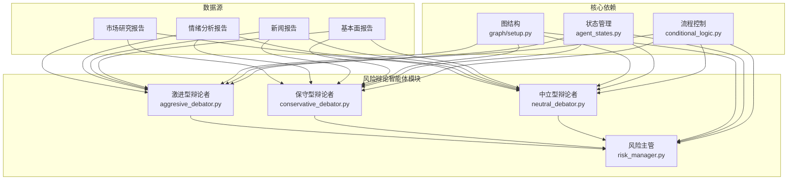
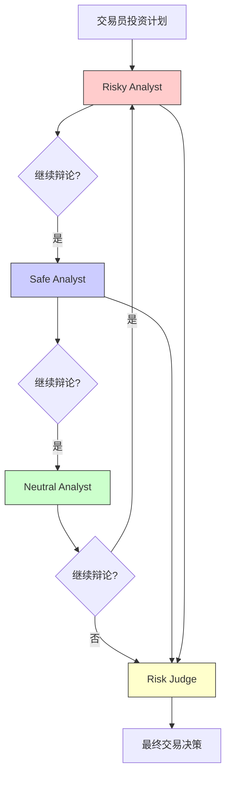
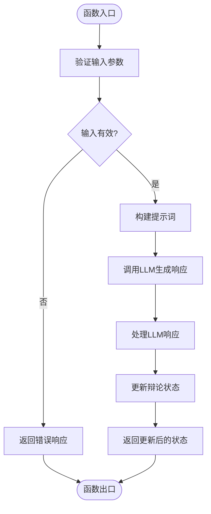
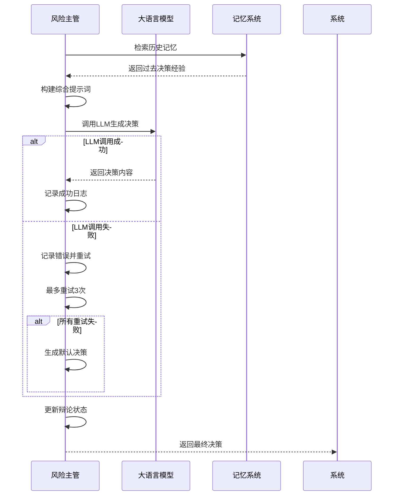
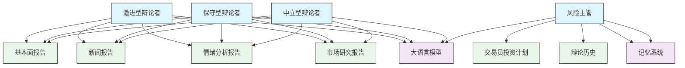

# 风险辩论智能体

<cite>
**本文档引用的文件**  
- [aggresive_debator.py](file://tradingagents/agents/risk_mgmt/aggresive_debator.py)
- [conservative_debator.py](file://tradingagents/agents/risk_mgmt/conservative_debator.py)
- [neutral_debator.py](file://tradingagents/agents/risk_mgmt/neutral_debator.py)
- [risk_manager.py](file://tradingagents/agents/managers/risk_manager.py)
- [setup.py](file://tradingagents/graph/setup.py)
- [propagation.py](file://tradingagents/graph/propagation.py)
- [agent_states.py](file://tradingagents/agents/utils/agent_states.py)
- [conditional_logic.py](file://tradingagents/graph/conditional_logic.py)
- [simple_analysis_demo.py](file://examples/simple_analysis_demo.py)
- [test_risk_assessment.py](file://tests/test_risk_assessment.py)
</cite>

## 目录
1. [引言](#引言)
2. [项目结构](#项目结构)
3. [核心组件](#核心组件)
4. [架构概述](#架构概述)
5. [详细组件分析](#详细组件分析)
6. [依赖分析](#依赖分析)
7. [性能考虑](#性能考虑)
8. [故障排除指南](#故障排除指南)
9. [结论](#结论)

## 引言
风险辩论智能体模块是交易智能体系统中的关键决策支持组件，通过构建多视角风险评估机制，显著提升投资决策的稳健性。该模块采用"三体辩论"架构，由激进型、保守型和中立型三种风险偏好不同的智能体组成辩论团队，对投资方案进行多角度评估。每个智能体从其特定风险偏好出发，利用市场研究、情绪分析、新闻事件和基本面数据等信息源，形成独特的风险评估观点。这些观点通过结构化辩论流程进行交互和碰撞，最终由风险主管智能体整合各方意见，形成综合性的风险分析报告和明确的交易建议。这种设计有效避免了单一视角可能导致的决策偏差，通过系统性地暴露和讨论潜在风险与机会，为投资决策提供了更加全面和平衡的参考依据。

## 项目结构
风险辩论智能体模块在项目中具有清晰的组织结构，位于`tradingagents/agents/risk_mgmt`目录下，与其他智能体模块保持一致的分层架构。该模块与系统其他组件通过明确定义的接口进行交互，形成了一个高度模块化和可扩展的系统设计。

**图示来源**
- [aggresive_debator.py](file://tradingagents/agents/risk_mgmt/aggresive_debator.py)
- [conservative_debator.py](file://tradingagents/agents/risk_mgmt/conservative_debator.py)
- [neutral_debator.py](file://tradingagents/agents/risk_mgmt/neutral_debator.py)
- [risk_manager.py](file://tradingagents/agents/managers/risk_manager.py)
- [setup.py](file://tradingagents/graph/setup.py)
- [agent_states.py](file://tradingagents/agents/utils/agent_states.py)
- [conditional_logic.py](file://tradingagents/graph/conditional_logic.py)

## 核心组件
风险辩论智能体模块的核心由四个主要组件构成：激进型辩论者、保守型辩论者、中立型辩论者和风险主管。这四个组件协同工作，形成一个完整的多视角风险评估系统。激进型、保守型和中立型辩论者分别代表三种不同的风险偏好，它们基于相同的输入数据但采用不同的分析框架和提示词策略，生成具有鲜明特色的风险评估观点。风险主管则扮演辩论主持人和最终决策者的双重角色，负责协调辩论流程并整合各方意见形成最终建议。所有组件都遵循统一的状态管理机制，通过`RiskDebateState`对象在系统中传递和更新辩论状态，确保了信息的一致性和可追溯性。

**节来源**
- [aggresive_debator.py](file://tradingagents/agents/risk_mgmt/aggresive_debator.py)
- [conservative_debator.py](file://tradingagents/agents/risk_mgmt/conservative_debator.py)
- [neutral_debator.py](file://tradingagents/agents/risk_mgmt/neutral_debator.py)
- [risk_manager.py](file://tradingagents/agents/managers/risk_manager.py)

## 架构概述
风险辩论智能体模块采用基于图的工作流架构，集成在系统的整体决策流程中。该模块在交易员生成投资计划后被激活，启动一个三阶段的辩论流程：观点生成、交互辩论和最终裁决。整个流程由`StateGraph`驱动，通过条件边（conditional edges）控制流程走向，实现了灵活而严谨的决策逻辑。

**图示来源**
- [setup.py](file://tradingagents/graph/setup.py)
- [conditional_logic.py](file://tradingagents/graph/conditional_logic.py)

## 详细组件分析
风险辩论智能体模块的每个组件都经过精心设计，以实现特定的功能目标。以下是对各组件的深入分析。

### 激进型辩论者分析
激进型辩论者代表高风险偏好的投资视角，其主要职责是积极倡导高回报、高风险的投资机会，强调大胆策略和竞争优势。该组件通过专门设计的提示词引导LLM从增长潜力、创新收益和市场机会等角度评估投资方案。

**图示来源**
- [aggresive_debator.py](file://tradingagents/agents/risk_mgmt/aggresive_debator.py)

**节来源**
- [aggresive_debator.py](file://tradingagents/agents/risk_mgmt/aggresive_debator.py)

### 保守型辩论者分析
保守型辩论者代表低风险偏好的投资视角，其主要目标是保护资产、最小化波动性，并确保稳定、可靠的增长。该组件优先考虑稳定性、安全性和风险缓解，仔细评估潜在损失、经济衰退和市场波动。

**图示来源**
- [conservative_debator.py](file://tradingagents/agents/risk_mgmt/conservative_debator.py)

**节来源**
- [conservative_debator.py](file://tradingagents/agents/risk_mgmt/conservative_debator.py)

### 中立型辩论者分析
中立型辩论者提供平衡的视角，权衡投资决策的潜在收益和风险。该组件优先考虑全面的方法，评估上行和下行风险，同时考虑更广泛的市场趋势、潜在的经济变化和多元化策略。

**图示来源**
- [neutral_debator.py](file://tradingagents/agents/risk_mgmt/neutral_debator.py)

**节来源**
- [neutral_debator.py](file://tradingagents/agents/risk_mgmt/neutral_debator.py)

### 风险主管智能体分析
风险主管智能体作为风险管理委员会主席和辩论主持人，负责评估三位风险分析师之间的辩论，并确定交易员的最佳行动方案。该组件从辩论历史中提取关键论点，结合过去的经验教训，生成明确的买入、卖出或持有建议。

**图示来源**
- [risk_manager.py](file://tradingagents/agents/managers/risk_manager.py)

**节来源**
- [risk_manager.py](file://tradingagents/agents/managers/risk_manager.py)

## 依赖分析
风险辩论智能体模块与系统其他组件存在明确的依赖关系，这些依赖确保了模块能够获取必要的数据和功能支持。

**图示来源**
- [setup.py](file://tradingagents/graph/setup.py)
- [agent_states.py](file://tradingagents/agents/utils/agent_states.py)

**节来源**
- [setup.py](file://tradingagents/graph/setup.py)
- [agent_states.py](file://tradingagents/agents/utils/agent_states.py)

## 性能考虑
风险辩论智能体模块在设计时充分考虑了性能和可靠性因素。风险主管智能体实现了增强的LLM调用机制，包含最大3次重试的错误处理策略，确保在LLM服务不稳定时仍能生成决策。每次调用失败后，系统会等待2秒再进行重试，避免对LLM服务造成过大压力。如果所有重试都失败，系统会生成一个默认的"持有"决策，避免系统完全无法响应。此外，系统通过`max_risk_discuss_rounds`参数控制辩论轮次，防止无限循环，确保流程能在合理时间内完成。日志系统详细记录了LLM调用的尝试次数、响应长度等关键指标，便于性能监控和问题排查。

## 故障排除指南
当风险辩论智能体模块出现问题时，可以参考以下故障排除步骤：

1. **检查LLM连接**: 确认LLM服务是否正常运行，API密钥是否正确配置
2. **查看日志文件**: 检查`logs/`目录下的日志文件，特别是与风险主管相关的日志
3. **验证输入数据**: 确保市场研究、情绪分析、新闻和基本面报告等输入数据完整且格式正确
4. **检查辩论状态**: 验证`RiskDebateState`对象中的计数器和发言者状态是否正常更新
5. **测试单个组件**: 分别测试激进型、保守型和中立型辩论者，确定问题组件
6. **调整重试参数**: 如果LLM调用频繁失败，可以适当调整重试次数和等待时间

**节来源**
- [risk_manager.py](file://tradingagents/agents/managers/risk_manager.py)
- [test_risk_assessment.py](file://tests/test_risk_assessment.py)

## 结论
风险辩论智能体模块通过创新的三体辩论架构，为交易智能体系统提供了强大的多视角风险评估能力。该模块通过激进型、保守型和中立型三种不同风险偏好的智能体之间的结构化辩论，有效提升了投资决策的稳健性和全面性。每个智能体基于专门设计的提示词和LLM调用策略，从其特定视角对投资方案进行评估，形成了丰富多样的风险分析观点。风险主管智能体作为最终决策者，不仅整合了当前辩论的各方意见，还能够从过去的经验教训中学习，避免重复历史错误。这种设计显著降低了单一视角可能导致的决策偏差，为投资决策提供了更加可靠的支持。未来可以通过引入更多样化的风险偏好类型、优化辩论流程控制逻辑、增强记忆系统的反思能力等方式，进一步提升该模块的性能和价值。