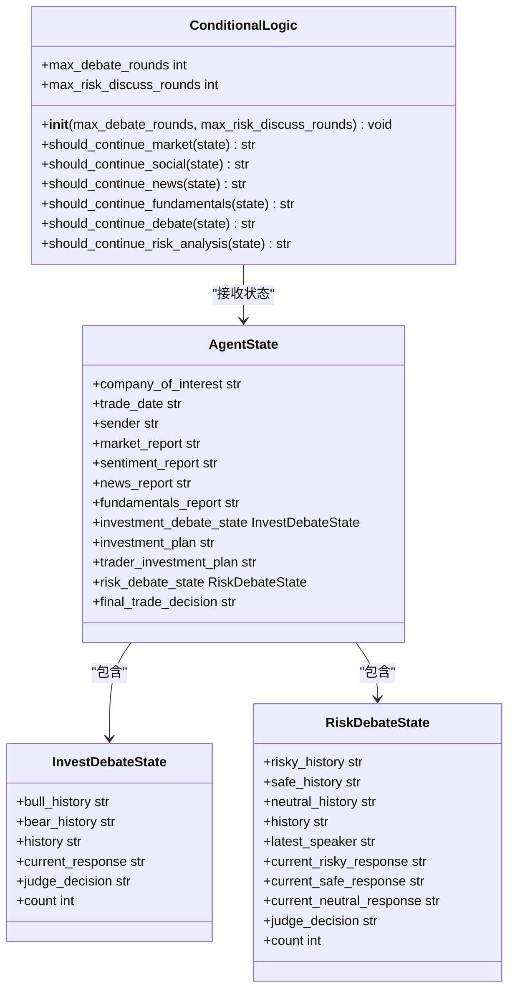
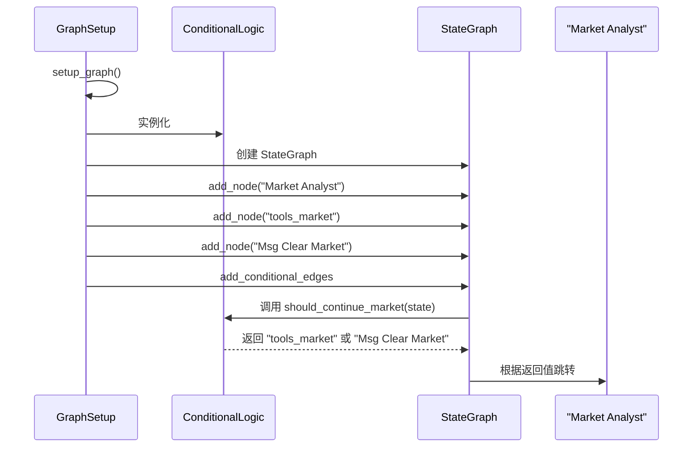
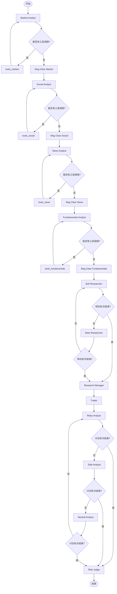

# 条件逻辑控制

<cite>
**本文档中引用的文件**  
- [conditional_logic.py](file://tradingagents/graph/conditional_logic.py)
- [trading_graph.py](file://tradingagents/graph/trading_graph.py)
- [agent_states.py](file://tradingagents/agents/utils/agent_states.py)
- [setup.py](file://tradingagents/graph/setup.py)
</cite>

## 目录
1. [引言](#引言)
2. [条件逻辑机制概述](#条件逻辑机制概述)
3. [核心条件函数分析](#核心条件函数分析)
4. [条件边在图中的注册与调用](#条件边在图中的注册与调用)
5. [动态路径控制流程](#动态路径控制流程)
6. [自定义条件逻辑扩展示例](#自定义条件逻辑扩展示例)
7. [结论](#结论)

## 引言
本文件详细阐述了 `conditional_logic.py` 模块中实现的动态条件跳转机制，该机制是交易智能体系统工作流控制的核心。通过分析智能体的输出结果（如市场趋势判断、风险等级评估等），系统能够动态决定后续执行路径，例如在牛市或熊市状态下激活不同的研究员智能体。本文将深入解析条件函数的定义规范、返回值格式及其在图结构中的注册方式，并结合 `trading_graph.py` 中的实际调用，展示条件边（conditional edges）如何实现非线性工作流控制。

**Section sources**
- [conditional_logic.py](file://tradingagents/graph/conditional_logic.py#L1-L10)

## 条件逻辑机制概述
`ConditionalLogic` 类封装了所有用于控制图执行流程的条件判断逻辑。它根据当前智能体状态（`AgentState`）中的信息，决定下一步应跳转到哪个节点。这种机制使得工作流不再是线性的，而是可以根据智能体的分析结果进行动态分支和循环。

该类在 `TradingAgentsGraph` 初始化时被创建，并传递给 `GraphSetup`，用于在构建状态图时注册条件边。条件逻辑的判断依据包括但不限于：工具调用需求、辩论轮次计数、最新发言者角色等。



**Diagram sources**
- [conditional_logic.py](file://tradingagents/graph/conditional_logic.py#L1-L10)
- [agent_states.py](file://tradingagents/agents/utils/agent_states.py#L10-L75)

**Section sources**
- [conditional_logic.py](file://tradingagents/graph/conditional_logic.py#L1-L10)
- [agent_states.py](file://tradingagents/agents/utils/agent_states.py#L10-L75)

## 核心条件函数分析
`ConditionalLogic` 类中定义了多个条件函数，每个函数负责特定环节的流程控制决策。

### 市场分析条件
`should_continue_market` 函数检查市场分析师的最新消息是否包含工具调用请求。如果存在，则返回 `"tools_market"` 以执行工具调用；否则，返回 `"Msg Clear Market"`，表示市场分析阶段结束，可以进入下一阶段。

**Section sources**
- [conditional_logic.py](file://tradingagents/graph/conditional_logic.py#L13-L19)

### 投资辩论条件
`should_continue_debate` 函数管理多空研究员之间的辩论流程。它首先检查辩论轮次计数（`count`）是否已达到预设的最大轮次（`max_debate_rounds` 的两倍）。如果达到，则将控制权交给 `"Research Manager"` 做出最终判断。否则，根据上一轮发言者（`current_response`）是“Bull”还是“Bear”，决定下一轮由“Bear Researcher”还是“Bull Researcher”发言，从而实现交替辩论。

**Section sources**
- [conditional_logic.py](file://tradingagents/graph/conditional_logic.py#L45-L54)

### 风险评估条件
`should_continue_risk_analysis` 函数控制风险分析师团队（Risky, Safe, Neutral）的讨论流程。它同样检查轮次计数（`count`）是否达到上限（`max_risk_discuss_rounds` 的三倍），若达到则将决策权交给 `"Risk Judge"`。否则，根据最后发言者（`latest_speaker`）的角色，决定下一个发言者：Risky -> Safe, Safe -> Neutral, Neutral -> Risky，形成一个循环讨论机制。

**Section sources**
- [conditional_logic.py](file://tradingagents/graph/conditional_logic.py#L56-L66)

## 条件边在图中的注册与调用
条件边的注册发生在 `GraphSetup` 类的 `setup_graph` 方法中。该方法利用 `ConditionalLogic` 实例中的条件函数，通过 `workflow.add_conditional_edges` 方法将它们与图中的节点关联起来。

例如，对于市场分析师节点，代码会动态获取 `should_continue_market` 函数，并将其作为条件函数注册到 `"Market Analyst"` 节点上，指定其两个可能的跳转目标：`"tools_market"` 和 `"Msg Clear Market"`。



**Diagram sources**
- [setup.py](file://tradingagents/graph/setup.py#L46-L248)
- [conditional_logic.py](file://tradingagents/graph/conditional_logic.py#L13-L19)

**Section sources**
- [setup.py](file://tradingagents/graph/setup.py#L46-L248)

## 动态路径控制流程
整个系统的动态路径控制流程始于 `TradingAgentsGraph` 的 `propagate` 方法。该方法初始化状态并调用编译好的图。图的执行从第一个分析师节点开始，经过一系列条件判断，最终完成从市场分析、新闻分析、基本面分析，到多空辩论、交易员决策，再到风险评估的完整非线性工作流。



**Diagram sources**
- [trading_graph.py](file://tradingagents/graph/trading_graph.py#L228-L261)
- [setup.py](file://tradingagents/graph/setup.py#L46-L248)

**Section sources**
- [trading_graph.py](file://tradingagents/graph/trading_graph.py#L228-L261)

## 自定义条件逻辑扩展示例
要扩展自定义的条件逻辑，开发者可以继承 `ConditionalLogic` 类或在其基础上添加新的方法。例如，可以创建一个 `should_activate_bullish_researcher` 方法，根据 `market_report` 的内容判断市场是否处于牛市，从而决定是否激活 `Bull Researcher`。

```python
def should_activate_bullish_researcher(self, state: AgentState) -> str:
    """根据市场报告判断是否激活多头研究员。"""
    if "bullish trend" in state["market_report"].lower() or "strong market" in state["market_report"].lower():
        return "Bull Researcher"
    return "Bear Researcher"
```

然后，在 `setup_graph` 方法中，可以使用这个新的条件函数来创建条件边，从而实现基于市场趋势的智能体激活策略。

**Section sources**
- [conditional_logic.py](file://tradingagents/graph/conditional_logic.py#L1-L67)

## 结论
`conditional_logic.py` 模块通过定义一系列条件函数，实现了对交易智能体工作流的精细控制。这些函数基于智能体的状态和分析结果，动态决定执行路径，支持复杂的辩论、循环和分支逻辑。通过与 `trading_graph.py` 和 `setup.py` 的紧密集成，条件边机制成功地将一个线性的分析流程转变为一个能够根据实时信息做出响应的、高度灵活的非线性决策系统。这种设计模式为构建复杂的AI代理工作流提供了强大的基础。