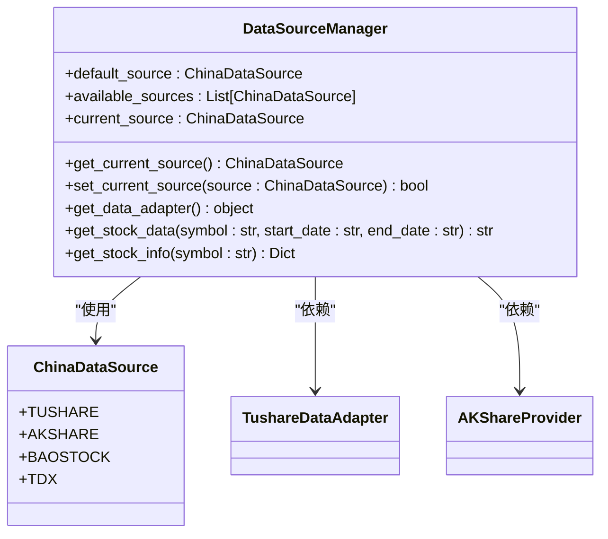
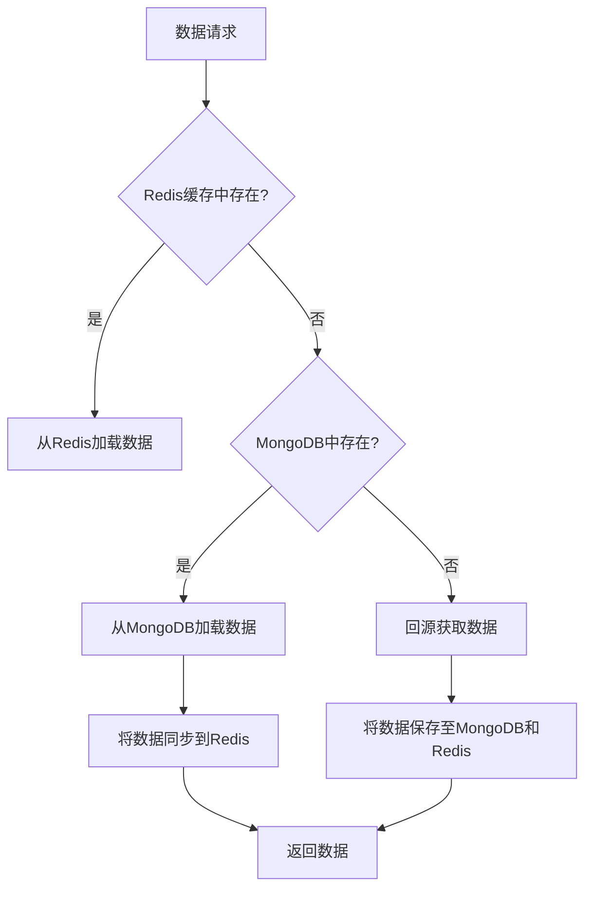
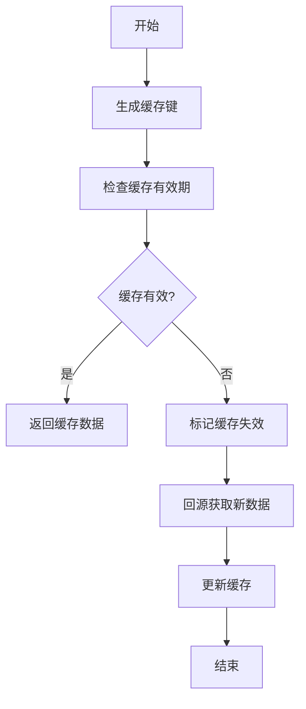
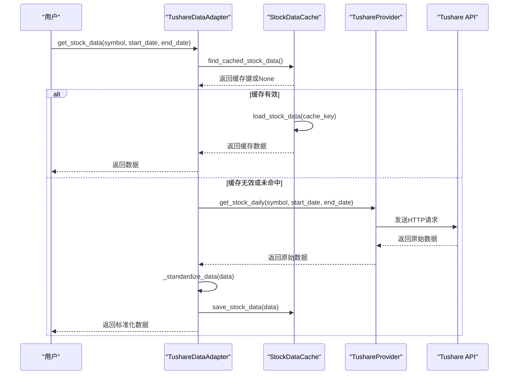

# 数据流管理

<cite>
**本文档引用的文件**   
- [data_source_manager.py](file://tradingagents/dataflows/data_source_manager.py)
- [cache_manager.py](file://tradingagents/dataflows/cache_manager.py)
- [db_cache_manager.py](file://tradingagents/dataflows/db_cache_manager.py)
- [akshare_utils.py](file://tradingagents/dataflows/akshare_utils.py)
- [tushare_utils.py](file://tradingagents/dataflows/tushare_utils.py)
- [tushare_adapter.py](file://tradingagents/dataflows/tushare_adapter.py)
- [interface.py](file://tradingagents/dataflows/interface.py)
</cite>

## 目录
1. [引言](#引言)
2. [数据源统一调度机制](#数据源统一调度机制)
3. [三级缓存体系协同工作机制](#三级缓存体系协同工作机制)
4. [缓存策略与失效更新](#缓存策略与失效更新)
5. [数据请求拦截与回源逻辑](#数据请求拦截与回源逻辑)
6. [数据源工具模块封装模式](#数据源工具模块封装模式)
7. [数据标准化与异常处理](#数据标准化与异常处理)
8. [结论](#结论)

## 引言
本系统旨在构建一个高效、可靠的数据流管理体系，用于统一调度Tushare、AkShare、FinnHub、Yahoo Finance等多源数据获取。该体系通过`data_source_manager.py`实现数据源的统一调度与切换，并构建了由本地文件缓存、Redis内存缓存和MongoDB持久化存储组成的三级缓存体系。`cache_manager.py`和`db_cache_manager.py`分别负责本地缓存和数据库缓存的管理，实现了精细化的缓存策略（如TTL、失效更新）。系统通过拦截数据请求，优先查询缓存，若缓存未命中则回源获取数据，确保了数据获取的高效性与可靠性。各数据源工具模块（如`akshare_utils.py`）采用统一的封装模式，实现了数据标准化与异常处理机制，为上层应用提供了稳定的数据服务。

## 数据源统一调度机制

`data_source_manager.py`是整个数据流管理的核心，它通过`DataSourceManager`类实现了对Tushare、AkShare、BaoStock等多个中国股票数据源的统一调度和管理。该类在初始化时会检查各数据源的可用性，并根据环境变量`DEFAULT_CHINA_DATA_SOURCE`设置默认数据源。用户可以通过`set_current_source`方法动态切换当前使用的数据源。

当需要获取股票数据时，系统调用`get_stock_data`方法。该方法首先根据当前设置的数据源，通过`get_data_adapter`获取相应的数据适配器（如Tushare适配器或AKShare适配器），然后调用适配器的具体方法来获取数据。如果当前数据源获取失败，系统会自动按照预设的优先级（Tushare > AKShare > BaoStock > TDX）尝试备用数据源，确保数据获取的鲁棒性。

**图 1：数据源管理器类图**

**图源**
- [data_source_manager.py](file://tradingagents/dataflows/data_source_manager.py#L21-L310)
- [tushare_adapter.py](file://tradingagents/dataflows/tushare_adapter.py#L30-L342)
- [akshare_utils.py](file://tradingagents/dataflows/akshare_utils.py#L11-L74)

## 三级缓存体系协同工作机制

系统构建了由本地文件缓存、Redis内存缓存和MongoDB持久化存储组成的三级缓存体系，以优化数据访问性能并确保数据的持久性。

1.  **本地文件缓存**：由`cache_manager.py`中的`StockDataCache`类实现。它将数据（如股票历史数据、新闻、基本面数据）以文件形式（CSV、TXT、JSON）存储在本地磁盘的`data_cache`目录下，并为每份数据生成元数据文件（JSON）记录其缓存时间、数据源等信息。本地缓存主要用于持久化存储和离线访问。

2.  **Redis内存缓存**：由`db_cache_manager.py`中的`DatabaseCacheManager`类实现。它利用Redis作为高速内存缓存，将数据以JSON字符串的形式存储，并设置较短的过期时间（如股票数据6小时）。Redis提供了极快的读写速度，是系统性能的关键。

3.  **MongoDB持久化存储**：同样由`DatabaseCacheManager`类实现。它利用MongoDB作为持久化数据库，存储所有缓存数据的完整副本。MongoDB具有高可靠性和可扩展性，确保了数据的长期安全。

当系统需要加载数据时，会遵循“内存 -> 本地 -> 持久化”的优先级顺序进行查询。首先尝试从Redis加载，若Redis中不存在，则从MongoDB加载，并将数据同步回Redis以加速后续访问。这种分层设计兼顾了速度与可靠性。

**图 2：三级缓存体系数据加载流程**

**图源**
- [db_cache_manager.py](file://tradingagents/dataflows/db_cache_manager.py#L168-L248)
- [db_cache_manager.py](file://tradingagents/dataflows/db_cache_manager.py#L250-L304)
- [cache_manager.py](file://tradingagents/dataflows/cache_manager.py#L187-L236)

## 缓存策略与失效更新

系统的缓存策略主要体现在`cache_manager.py`和`db_cache_manager.py`中，通过TTL（Time To Live）机制实现缓存的自动失效与更新。

在`StockDataCache`类中，`cache_config`字典为不同类型的缓存（如美股数据、A股数据、新闻、基本面数据）设置了不同的TTL（以小时为单位）。例如，A股数据的TTL为1小时，而A股基本面数据的TTL为12小时，这反映了不同数据的实时性要求。`is_cache_valid`方法用于检查缓存是否有效，它会计算缓存的年龄并与TTL进行比较。

`find_cached_stock_data`方法在查找缓存时，会先生成一个精确匹配的查找键，然后调用`is_cache_valid`检查其有效性。如果精确匹配无效，它还会遍历所有元数据文件，查找部分匹配（如相同股票代码但不同日期范围）且有效的缓存。

在`DatabaseCacheManager`中，缓存的TTL通过Redis的`setex`命令实现。例如，股票数据在Redis中的过期时间被设置为6小时。当缓存过期后，Redis会自动删除该键，从而在下一次请求时触发回源操作。

**图 3：缓存失效与更新流程**

**图源**
- [cache_manager.py](file://tradingagents/dataflows/cache_manager.py#L154-L185)
- [cache_manager.py](file://tradingagents/dataflows/cache_manager.py#L258-L315)
- [db_cache_manager.py](file://tradingagents/dataflows/db_cache_manager.py#L159-L166)

## 数据请求拦截与回源逻辑

数据请求的拦截与回源逻辑是整个数据流管理的核心流程，它确保了系统在优先使用缓存的同时，能够及时获取最新的数据。

以通过Tushare适配器获取A股日线数据为例，其完整流程如下：
1.  **请求拦截**：用户调用`get_stock_data`方法。
2.  **缓存查询**：适配器的`_get_daily_data`方法首先尝试从`StockDataCache`中查找有效缓存。
3.  **缓存命中**：如果找到有效缓存，则直接返回缓存数据，流程结束。
4.  **缓存未命中**：如果未找到有效缓存，则进入回源流程。
5.  **回源获取**：调用`TushareProvider`的`get_stock_daily`方法，通过Tushare API获取原始数据。
6.  **数据处理**：对获取的原始数据进行标准化处理（如重命名列、转换日期格式）。
7.  **缓存更新**：将处理后的数据同时保存到本地文件缓存和数据库缓存（MongoDB和Redis）中。
8.  **返回结果**：将数据返回给用户。

**图 4：数据请求拦截与回源序列图**

**图源**
- [tushare_adapter.py](file://tradingagents/dataflows/tushare_adapter.py#L66