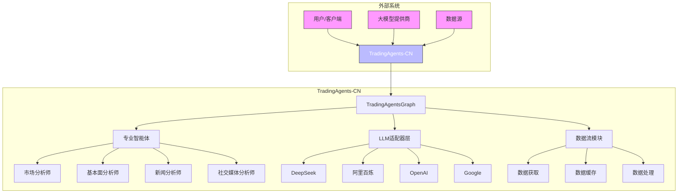
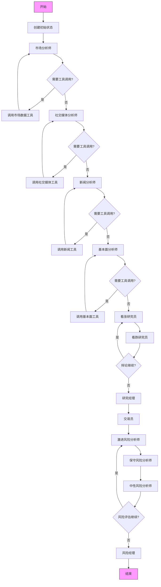

# 核心架构

<cite>
**本文档引用的文件**   
- [trading_graph.py](file://tradingagents/graph/trading_graph.py)
- [agent_states.py](file://tradingagents/agents/utils/agent_states.py)
- [conditional_logic.py](file://tradingagents/graph/conditional_logic.py)
- [setup.py](file://tradingagents/graph/setup.py)
- [deepseek_adapter.py](file://tradingagents/llm_adapters/deepseek_adapter.py)
- [dashscope_adapter.py](file://tradingagents/llm_adapters/dashscope_adapter.py)
- [openai_compatible_base.py](file://tradingagents/llm_adapters/openai_compatible_base.py)
- [cache_manager.py](file://tradingagents/dataflows/cache_manager.py)
- [adaptive_cache.py](file://tradingagents/dataflows/adaptive_cache.py)
- [integrated_cache.py](file://tradingagents/dataflows/integrated_cache.py)
- [db_cache_manager.py](file://tradingagents/dataflows/db_cache_manager.py)
- [interface.py](file://tradingagents/dataflows/interface.py)
- [tdx_utils.py](file://tradingagents/dataflows/tdx_utils.py)
- [tushare_utils.py](file://tradingagents/dataflows/tushare_utils.py)
- [tushare_adapter.py](file://tradingagents/dataflows/tushare_adapter.py)
</cite>

## 目录
1. [系统上下文图](#系统上下文图)
2. [组件交互图](#组件交互图)
3. [TradingAgentsGraph图状工作流架构](#tradingagentsgraph图状工作流架构)
4. [智能体状态设计与流转机制](#智能体状态设计与流转机制)
5. [条件逻辑在决策路径中的作用](#条件逻辑在决策路径中的作用)
6. [LLM适配器层统一接口调用](#llm适配器层统一接口调用)
7. [数据流模块与缓存机制](#数据流模块与缓存机制)
8. [架构优势分析](#架构优势分析)

## 系统上下文图



**图源**
- [trading_graph.py](file://tradingagents/graph/trading_graph.py#L32-L325)
- [agent_states.py](file://tradingagents/agents/utils/agent_states.py#L49-L75)
- [llm_adapters](file://tradingagents/llm_adapters)
- [dataflows](file://tradingagents/dataflows)

## 组件交互图

```mermaid
sequenceDiagram
participant User as 用户
participant Graph as TradingAgentsGraph
participant State as AgentState
participant Logic as ConditionalLogic
participant LLM as LLM适配器
participant Dataflow as 数据流模块
participant Analyst as 专业智能体
User->>Graph : propagate(company_name, trade_date)
Graph->>State : create_initial_state()
Graph->>Graph : 初始化LLM和工具
loop 智能体分析阶段
Analyst->>Dataflow : 请求数据
Dataflow->>Dataflow : 缓存检查
alt 缓存命中
Dataflow-->>Analyst : 返回缓存数据
else 缓存未命中
Dataflow->>外部API : 获取数据
外部API-->>Dataflow : 返回数据
Dataflow->>Dataflow : 保存到缓存
Dataflow-->>Analyst : 返回数据
end
Analyst->>LLM : 调用LLM进行分析
LLM-->>Analyst : 返回分析结果
Analyst->>State : 更新状态
Logic->>Logic : should_continue_analyst()
alt 需要更多工具调用
Analyst->>Dataflow : 请求更多数据
else 分析完成
break
end
end
loop 投资辩论阶段
Analyst->>LLM : 进行辩论
LLM-->>Analyst : 返回论点
Analyst->>State : 更新辩论状态
Logic->>Logic : should_continue_debate()
alt 辩论继续
Analyst->>LLM : 反驳对方观点
else 辩论结束
break
end
end
loop 风险管理阶段
Analyst->>LLM : 进行风险评估
LLM-->>Analyst : 返回风险评估
Analyst->>State : 更新风险状态
Logic->>Logic : should_continue_risk_analysis()
alt 评估继续
Analyst->>LLM : 提出风险观点
else 评估结束
break
end
end
Graph->>Graph : process_signal()
Graph-->>User : 返回最终决策
```

**图源**
- [trading_graph.py](file://tradingagents/graph/trading_graph.py#L32-L325)
- [setup.py](file://tradingagents/graph/setup.py#L14-L248)
- [conditional_logic.py](file://tradingagents/graph/conditional_logic.py#L0-L67)
- [agent_states.py](file://tradingagents/agents/utils/agent_states.py#L49-L75)
- [dataflows](file://tradingagents/dataflows)

## TradingAgentsGraph图状工作流架构

`TradingAgentsGraph`是TradingAgents-CN框架的核心类，负责协调整个交易智能体系统的工作流。该类基于LangGraph构建，实现了图状工作流架构，能够灵活地协调多个专业智能体协同工作。

工作流从`propagate`方法开始，接收公司名称和交易日期作为输入。首先创建初始状态`AgentState`，然后通过`graph.invoke()`或`graph.stream()`方法启动工作流。工作流按照预定义的顺序依次执行各个智能体节点，包括市场分析师、社交媒体分析师、新闻分析师和基本面分析师。

每个智能体节点在执行时，会根据需要调用相应的工具来获取数据。工具调用由`Toolkit`类管理，该类封装了各种数据获取工具。当智能体需要数据时，会通过条件逻辑判断是否需要调用工具，如果需要，则调用相应的工具节点获取数据。

工作流的控制流由`ConditionalLogic`类管理。该类定义了各种条件判断方法，如`should_continue_market`、`should_continue_social`等，用于决定工作流的下一步走向。例如，当市场分析师节点完成分析后，条件逻辑会判断是否需要继续调用工具，或者继续下一个分析节点。

在所有分析师完成工作后，工作流进入投资辩论阶段。看涨研究员和看跌研究员基于各分析师的报告进行辩论，研究经理作为裁判做出最终投资决策。随后进入风险管理阶段，激进、中性和保守三位风险分析师对交易决策进行风险评估，风险经理做出最终的风险管理决策。



**图源**
- [trading_graph.py](file://tradingagents/graph/trading_graph.py#L32-L325)
- [setup.py](file://tradingagents/graph/setup.py#L14-L248)
- [conditional_logic.py](file://tradingagents/graph/conditional_logic.py#L0-L67)

**本节源码**
- [trading_graph.py](file://tradingagents/graph/trading_graph.py#L32-L325)
- [setup.py](file://tradingagents/graph/setup.py#L14-L248)

## 智能体状态设计与流转机制

智能体状态（AgentState）是TradingAgents-CN系统中数据流转的核心。该状态类继承自`MessagesState`，并扩展了多个字段来存储分析过程中的各种信息。

`AgentState`的设计体现了系统对多维度分析的全面考虑。状态中包含了`company_of_interest`（关注的公司）、`trade_date`（交易日期）等基本信息，以及`market_report`（市场报告）、`sentiment_report`（情绪报告）、`news_report`（新闻报告）和`fundamentals_report`（基本面报告）等四个主要分析维度的报告。

投资决策过程通过`investment_debate_state`字段来管理，该字段是一个`InvestDebateState`类型的TypedDict，包含了看涨和看跌双方的辩论历史、当前响应和裁判决策。类似地，`risk_debate_state`字段用于管理风险管理阶段的辩论状态。

状态的流转机制贯穿整个工作流。初始状态由`Propagator`类的`create_initial_state`方法创建，包含空的报告和初始化的辩论状态。随着工作流的推进，各个智能体节点会更新相应的报告字段。在辩论阶段，研究员节点会更新`investment_debate_state`，而风险分析师会更新`risk_debate_state`。

最终的交易决策通过`final_trade_decision`字段返回。整个状态对象在工作流的每个节点之间传递，确保了信息的完整性和一致性。这种设计使得系统能够保持上下文，支持复杂的多轮交互和决策过程。

```mermaid
classDiagram
    class AgentState {
        +string company_of_interest
        +string trade_date
        +string sender
        +string market_report
        +string sentiment_report
        +string news_report
        +string fundamentals_report
        +InvestDebateState investment_debate_state
        +string investment_plan
        +string trader_investment_plan
        +RiskDebateState risk_debate_state
        +string final_trade_decision
    }
    
    class