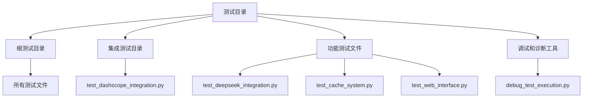
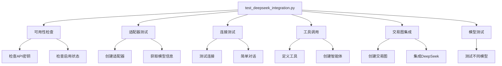
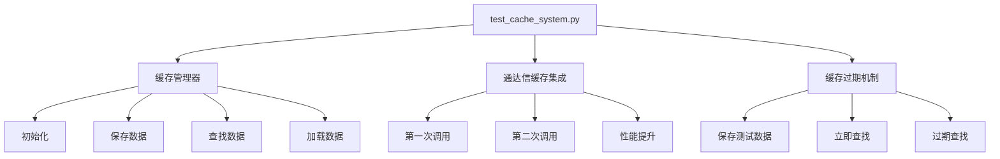
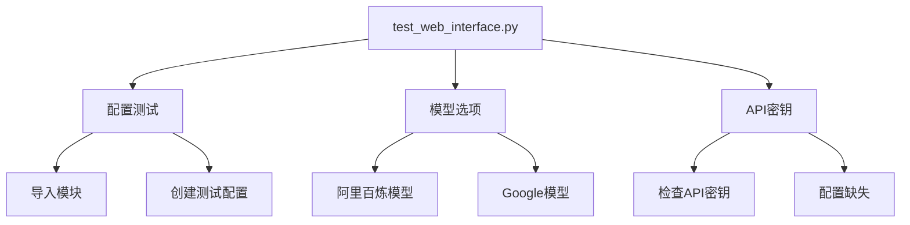
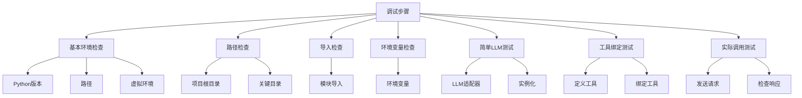

# 测试指南

<cite>
**本文档引用的文件**
- [test_deepseek_integration.py](file://tests/test_deepseek_integration.py)
- [test_cache_system.py](file://tests/test_cache_system.py)
- [test_web_interface.py](file://tests/test_web_interface.py)
- [debug_test_execution.py](file://tests/debug_test_execution.py)
- [test_dashscope_integration.py](file://tests/integration/test_dashscope_integration.py)
</cite>

## 目录
1. [简介](#简介)
2. [测试目录结构](#测试目录结构)
3. [测试策略与实践](#测试策略与实践)
4. [测试套件执行](#测试套件执行)
5. [关键测试用例解读](#关键测试用例解读)
6. [测试环境搭建](#测试环境搭建)
7. [调试技巧](#调试技巧)
8. [测试的重要性](#测试的重要性)

## 简介
本测试指南旨在为TradingAgents-CN项目提供全面的测试策略和实践指导。通过系统化的测试方法，确保系统的稳定性和功能正确性。本指南将详细介绍测试目录结构、不同类型的测试（单元测试、集成测试、端到端测试）、测试执行方法、关键测试用例分析、测试环境搭建步骤以及调试技巧。

## 测试目录结构
项目的测试目录结构清晰地组织了不同类型的测试文件，便于管理和执行。主要分为以下几个部分：

- **根测试目录 (tests/)**: 包含所有测试文件和子目录。
- **集成测试目录 (tests/integration/)**: 专门存放集成测试文件，验证不同模块之间的交互。
- **功能测试文件 (test_*.py)**: 各种功能测试文件，覆盖API集成、数据源、性能、AI模型等。
- **调试和诊断工具 (debug_*.py)**: 用于诊断和解决测试执行中的问题。



**图示来源**
- [test_deepseek_integration.py](file://tests/test_deepseek_integration.py)
- [test_cache_system.py](file://tests/test_cache_system.py)
- [test_web_interface.py](file://tests/test_web_interface.py)
- [debug_test_execution.py](file://tests/debug_test_execution.py)
- [test_dashscope_integration.py](file://tests/integration/test_dashscope_integration.py)

## 测试策略与实践
本项目采用多层次的测试策略，确保代码质量和系统稳定性。测试类型包括单元测试、集成测试和端到端测试。

### 单元测试
单元测试主要针对单个函数或类进行测试，确保其行为符合预期。例如，`test_cache_system.py` 中的 `test_cache_manager` 函数测试了缓存管理器的基本功能。

### 集成测试
集成测试验证不同模块之间的交互。例如，`test_dashscope_integration.py` 测试了阿里百炼大模型的集成，包括模块导入、API密钥配置、连接测试、LangChain适配器和TradingGraph配置。

### 端到端测试
端到端测试模拟真实用户场景，验证整个系统的功能。例如，`test_web_interface.py` 测试了Web界面的Google模型功能，包括配置、模型选项和API密钥要求。

**本节来源**
- [test_cache_system.py](file://tests/test_cache_system.py#L1-L219)
- [test_dashscope_integration.py](file://tests/integration/test_dashscope_integration.py#L1-L180)
- [test_web_interface.py](file://tests/test_web_interface.py#L1-L163)

## 测试套件执行
使用pytest可以方便地执行测试套件。以下是执行测试的步骤：

1. **安装依赖**: 确保已安装所有必要的依赖包。
2. **运行所有测试**: 在项目根目录下运行 `pytest` 命令，执行所有测试。
3. **运行特定测试文件**: 使用 `pytest tests/test_deepseek_integration.py` 命令执行特定的测试文件。
4. **运行特定测试函数**: 使用 `pytest tests/test_cache_system.py::test_cache_manager` 命令执行特定的测试函数。

```bash
# 安装pytest
pip install pytest

# 运行所有测试
pytest

# 运行特定测试文件
pytest tests/test_deepseek_integration.py

# 运行特定测试函数
pytest tests/test_cache_system.py::test_cache_manager
```

**本节来源**
- [test_deepseek_integration.py](file://tests/test_deepseek_integration.py#L1-L238)
- [test_cache_system.py](file://tests/test_cache_system.py#L1-L219)
- [test_web_interface.py](file://tests/test_web_interface.py#L1-L163)

## 关键测试用例解读
### test_deepseek_integration.py
该测试文件验证了DeepSeek V3的集成。测试内容包括：
- **可用性检查**: 检查API密钥和启用状态。
- **适配器测试**: 测试DeepSeek适配器的创建和模型信息。
- **连接测试**: 测试与DeepSeek的连接和简单对话。
- **工具调用**: 测试工具调用功能。
- **交易图集成**: 测试DeepSeek在交易图中的集成。
- **模型测试**: 测试不同DeepSeek模型。



**图示来源**
- [test_deepseek_integration.py](file://tests/test_deepseek_integration.py#L1-L238)

### test_cache_system.py
该测试文件验证了缓存系统的功能。测试内容包括：
- **缓存管理器**: 测试缓存管理器的初始化、保存、查找和加载数据。
- **通达信缓存集成**: 测试通达信数据的缓存性能提升。
- **缓存过期机制**: 测试缓存的过期机制。



**图示来源**
- [test_cache_system.py](file://tests/test_cache_system.py#L1-L219)

### test_web_interface.py
该测试文件验证了Web界面的Google模型功能。测试内容包括：
- **配置测试**: 测试Web界面的配置功能。
- **模型选项**: 测试阿里百炼和Google模型的选项。
- **API密钥**: 检查必需的API密钥是否配置。



**图示来源**
- [test_web_interface.py](file://tests/test_web_interface.py#L1-L163)

## 测试环境搭建
搭建测试环境是确保测试顺利进行的关键步骤。以下是搭建测试环境的步骤：

1. **配置环境变量**: 在 `.env` 文件中设置必要的API密钥，如 `DEEPSEEK_API_KEY`、`DASHSCOPE_API_KEY` 和 `FINNHUB_API_KEY`。
2. **安装依赖**: 使用 `pip install -r requirements.txt` 安装所有依赖包。
3. **启动服务**: 如果需要，启动数据库和其他依赖服务。
4. **验证配置**: 使用 `test_env_config.py` 验证环境配置是否正确。

```bash
# 配置环境变量
echo "DEEPSEEK_API_KEY=your_api_key" >> .env
echo "DASHSCOPE_API_KEY=your_api_key" >> .env
echo "FINNHUB_API_KEY=your_api_key" >> .env

# 安装依赖
pip install -r requirements.txt

# 验证配置
python tests/test_env_config.py
```

**本节来源**
- [test_env_config.py](file://tests/test_env_config.py#L1-L168)
- [test_dashscope_integration.py](file://tests/integration/test_dashscope_integration.py#L1-L180)

## 调试技巧
调试是解决测试问题的重要环节。以下是使用 `debug_test_execution.py` 进行调试的步骤：

1. **基本环境检查**: 检查Python版本、路径和虚拟环境。
2. **路径检查**: 确认项目根目录和关键目录的存在。
3. **导入检查**: 检查关键模块的导入是否成功。
4. **环境变量检查**: 检查必要的环境变量是否设置。
5. **简单LLM测试**: 测试LLM适配器的创建和实例化。
6. **工具绑定测试**: 测试工具绑定功能。
7. **实际调用测试**: 发送实际请求并检查响应。



**图示来源**
- [debug_test_execution.py](file://tests/debug_test_execution.py#L1-L293)

## 测试的重要性
测试在确保系统稳定性和功能正确性方面起着至关重要的作用。通过全面的测试策略，可以：
- **发现和修复缺陷**: 在早期阶段发现并修复代码中的缺陷。
- **提高代码质量**: 确保代码符合预期行为，提高代码质量。
- **增强系统稳定性**: 通过集成测试和端到端测试，确保系统在各种场景下的稳定性。
- **支持持续集成**: 自动化测试支持持续集成和持续交付，加快开发周期。

**本节来源**
- [test_deepseek_integration.py](file://tests/test_deepseek_integration.py#L1-L238)
- [test_cache_system.py](file://tests/test_cache_system.py#L1-L219)
- [test_web_interface.py](file://tests/test_web_interface.py#L1-L163)