# CLI工具

<cite>
**本文档中引用的文件**   
- [main.py](file://cli/main.py)
- [models.py](file://cli/models.py)
- [utils.py](file://cli/utils.py)
- [welcome.txt](file://cli/static/welcome.txt)
- [cli_demo.py](file://examples/cli_demo.py)
- [batch_analysis.py](file://examples/batch_analysis.py)
</cite>

## 目录
1. [简介](#简介)
2. [项目结构](#项目结构)
3. [核心组件](#核心组件)
4. [架构概述](#架构概述)
5. [详细组件分析](#详细组件分析)
6. [依赖分析](#依赖分析)
7. [性能考虑](#性能考虑)
8. [故障排除指南](#故障排除指南)
9. [结论](#结论)

## 简介
TradingAgents CLI 是一个基于Typer框架构建的命令行接口工具，旨在为用户提供多智能体大语言模型金融交易框架的交互式分析能力。该工具支持中英文双语界面，具备完整的股票分析功能，涵盖市场、基本面、新闻和社会情绪等多个维度。CLI工具通过Rich库提供丰富的终端显示效果，包括进度面板、消息日志和实时报告，使用户能够直观地监控分析过程。系统支持多种LLM提供商，包括阿里百炼、DeepSeek、OpenAI等，并针对中文用户优化了阿里百炼大模型的集成。通过交互式问卷，用户可以自定义分析参数，包括股票市场、代码、分析日期、分析师团队、研究深度和LLM引擎等。该工具特别适用于自动化脚本、批量处理和服务器部署场景，为金融分析提供了强大的命令行解决方案。

## 项目结构
TradingAgents-CN项目的目录结构清晰地组织了CLI工具、数据管理、示例程序和测试代码。CLI相关文件位于`cli/`目录下，包含核心的`main.py`、参数模型`models.py`、辅助函数`utils.py`以及启动时显示的欢迎信息`static/welcome.txt`。数据存储和报告生成在`data/`目录中进行，其中`reports/`子目录保存分析结果，`scripts/`包含数据同步脚本。`examples/`目录提供了丰富的使用示例，包括CLI演示、批量分析、配置管理等脚本，帮助用户快速上手。`scripts/`目录包含部署、开发、Docker、Git管理和维护脚本，支持系统的全生命周期管理。`tests/`目录包含集成测试和单元测试，确保系统功能的稳定性。`tradingagents/`目录存放核心的智能体框架、API接口、配置管理、数据流和图结构等模块。`web/`目录包含Web界面的组件和页面，与CLI工具形成互补。整个项目结构体现了模块化设计原则，将CLI工具与核心框架、示例程序和测试代码分离，便于维护和扩展。

**图源**
- [main.py](file://cli/main.py)
- [models.py](file://cli/models.py)
- [utils.py](file://cli/utils.py)
- [welcome.txt](file://cli/static/welcome.txt)
- [cli_demo.py](file://examples/cli_demo.py)
- [batch_analysis.py](file://examples/batch_analysis.py)

## 核心组件
TradingAgents CLI的核心组件包括命令定义、参数模型、辅助工具和欢迎信息展示。`main.py`中的`app`对象通过Typer框架定义了CLI的命令结构，包括`analyze`（核心分析）、`config`（配置管理）、`data_config`（数据目录配置）、`help_chinese`（中文帮助）、`version`（版本信息）和`test`（系统测试）等命令。`models.py`中的`AnalystType`枚举类定义了四种分析师类型：市场、社交媒体、新闻和基本面，为参数验证提供了数据模型基础。`utils.py`提供了丰富的交互式选择功能，如`select_market`（选择市场）、`get_ticker`（获取股票代码）、`select_analysts`（选择分析师团队）、`select_research_depth`（选择研究深度）和`select_llm_provider`（选择LLM提供商），这些函数使用Questionary库创建了用户友好的交互界面。`welcome.txt`文件包含ASCII艺术字的欢迎信息，在CLI启动时展示，增强了用户体验。这些核心组件协同工作，为用户提供了一个功能完整、交互友好的命令行分析工具。

**节源**
- [main.py](file://cli/main.py)
- [models.py](file://cli/models.py)
- [utils.py](file://cli/utils.py)
- [welcome.txt](file://cli/static/welcome.txt)

## 架构概述
TradingAgents CLI的架构采用分层设计，从用户交互层到核心框架层，再到外部服务层，形成了清晰的调用链。用户通过命令行输入触发CLI命令，Typer框架解析命令并调用相应的处理函数。`main.py`中的`analyze`函数作为入口点，调用`get_user_selections`获取用户输入，然后初始化`TradingAgentsGraph`进行多智能体分析。`utils.py`中的辅助函数负责与用户交互，收集分析参数。`models.py`中的数据模型确保参数的有效性。CLI工具通过环境变量加载API密钥，与外部LLM服务（如阿里百炼、DeepSeek、OpenAI）和金融数据服务（如Finnhub）进行通信。分析结果通过Rich库在终端实时展示，并保存到`data/reports/`目录。整个架构体现了关注点分离原则，将用户界面、业务逻辑和数据访问分离，提高了代码的可维护性和可扩展性。

```mermaid
graph TD
A[用户命令行输入] --> B[Typer命令解析]
B --> C[main.py: analyze]
C --> D[utils.py: get_user_selections]
D --> E[交互式参数收集]
E --> F[main.py: run_analysis]
F --> G[tradingagents.graph.TradingAgentsGraph]
G --> H[LLM服务]
G --> I[金融数据服务]
H --> J[阿里百炼/DashScope]
H --> K[DeepSeek]
H --> L[OpenAI]
I --> M[Finnhub]
G --> N[分析结果]
N --> O[Rich终端显示]
N --> P[保存到data/reports/]
```

**图源**
- [main.py](file://cli/main.py)
- [utils.py](file://cli/utils.py)
- [models.py](file://cli/models.py)

## 详细组件分析
### 核心分析命令分析
核心分析命令`analyze`是CLI工具的主要功能入口，通过一系列交互式问卷收集用户输入。首先，`get_user_selections`函数依次调用`select_market`、`get_ticker`、`get_analysis_date`、`select_analysts`、`select_research_depth`、`select_llm_provider`和`select_thinking_agent`等函数，收集市场、股票代码、分析日期、分析师团队、研究深度、LLM提供商和思考引擎等参数。这些参数随后传递给`TradingAgentsGraph`进行多智能体分析。分析过程中，`MessageBuffer`类用于存储和管理分析状态、消息和报告，`update_display`函数实时更新终端显示，展示各智能体的进度、消息日志和当前报告。最终，`display_complete_report`函数生成完整的分析报告，按团队组织为多个面板，提供全面的分析结果。

#### 对于API/服务组件：

**图源**
- [main.py](file://cli/main.py#L1265-L1270)
- [utils.py](file://cli/utils.py)

### 配置管理命令分析
配置管理命令`config`和`data_config`为用户提供了系统设置的查看和修改功能。`config`命令显示当前支持的LLM提供商、模型、状态和说明，并检查API密钥的配置状态，为用户提供清晰的配置指导。`data_config`命令允许用户查看、设置或重置数据目录路径，支持通过命令行选项`--show`、`--set`和`--reset`进行操作。该命令还显示环境变量的设置情况，帮助用户理解配置的优先级。通过这些配置命令，用户可以轻松管理系统的运行环境，确保CLI工具能够正确访问所需的资源和服务。

#### 对于复杂逻辑组件：

**图源**
- [main.py](file://cli/main.py#L1431-L1518)

### 系统工具命令分析
系统工具命令包括`help_chinese`、`version`、`test`和`examples`，为用户提供辅助功能。`help_chinese`命令显示详细的中文帮助信息，包括快速开始指南、主要命令说明和获取帮助的途径，特别推荐使用阿里百炼大模型。`version`命令显示软件版本和功能特性信息。`test`命令运行系统集成测试，验证各功能模块的正常性。`examples`命令列出可用的示例程序，帮助用户学习和使用CLI工具。这些工具命令构成了CLI的辅助系统，提升了用户的使用体验和系统的可维护性。

**节源**
- [main.py](file://cli/main.py)

## 依赖分析
CLI工具的依赖关系清晰地展示了其与核心框架、外部服务和辅助库的交互。`main.py`直接依赖`tradingagents.graph.TradingAgentsGraph`进行多智能体分析，依赖`tradingagents.config.config_manager`进行配置管理。它通过`dotenv`加载环境变量，获取API密钥。CLI工具使用`typer`作为命令行框架，`rich`进行终端美化，`questionary`创建交互式界面。`models.py`仅依赖Python标准库的`enum`和`typing`，以及`pydantic`进行数据验证。`utils.py`依赖`questionary`进行用户交互，依赖`cli.models`获取分析师类型。`welcome.txt`被`main.py`直接读取，用于启动时的欢迎信息展示。这些依赖关系体现了CLI工具的模块化设计，每个组件职责明确，耦合度低，便于独立开发和测试。

**图源**
- [main.py](file://cli/main.py)
- [models.py](file://cli/models.py)
- [utils.py](file://cli/utils.py)
- [welcome.txt](file://cli/static/welcome.txt)

## 性能考虑
CLI工具在性能方面主要考虑了API调用效率、数据缓存和用户交互响应。通过使用`MessageBuffer`类，工具能够高效地管理分析过程中的消息和状态，避免了频繁的I/O操作。`select_shallow_thinking_agent`和`select_deep_thinking_agent`函数允许用户根据需求选择不同性能特征的LLM引擎，平衡分析深度和响应速度。在批量处理场景中，如`batch_analysis.py`示例所示，通过在每次API调用后添加`time.sleep(1)`，避免了API速率限制，确保了系统的稳定运行。对于大量数据的处理，建议使用`data_config`命令将数据目录设置到高性能存储设备上，以提高读写速度。此外，通过环境变量配置API密钥，避免了每次启动时的重复输入，提高了使用效率。

## 故障排除指南
当使用CLI工具时，可能会遇到各种问题，以下是一些常见问题及其解决方案。**参数错误**：如果输入的股票代码格式不正确，系统会提示"股票代码格式不正确"，请根据所选市场的格式要求输入正确的代码，如美股为1-5位大写字母，A股为6位数字。**API密钥缺失**：如果缺少必要的API密钥，`config`命令会明确指出未配置的密钥，用户需要在项目根目录的`.env`文件中设置相应的环境变量，如`DASHSCOPE_API_KEY`和`FINNHUB_API_KEY`。**网络连接问题**：如果无法连接到LLM服务或金融数据服务，请检查网络连接，特别是使用国外API时可能需要代理。**依赖缺失**：如果出现模块导入错误，请确保已安装所有依赖，可通过运行`pip install -r requirements.txt`解决。**配置冲突**：如果环境变量和配置文件中的设置冲突，环境变量具有最高优先级，建议统一在`.env`文件中管理所有配置。通过`config`命令可以检查API密钥状态，通过`test`命令可以验证系统功能，帮助快速定位和解决问题。

**节源**
- [main.py](file://cli/main.py)
- [utils.py](file://cli/utils.py)

## 结论
TradingAgents CLI工具是一个功能强大、用户友好的命令行接口，为多智能体大语言模型金融交易框架提供了便捷的访问方式。通过Typer框架构建的命令结构清晰，支持核心分析、配置管理、系统工具等多种功能。`models.py`中的参数模型和`utils.py`中的辅助功能确保了输入的有效性和交互的友好性。`welcome.txt`的欢迎信息增强了用户体验。与Web界面相比，CLI工具在自动化脚本、批量处理和服务器部署方面具有明显优势，特别适合集成到自动化工作流中。通过`examples`目录中的`cli_demo.py`和`batch_analysis.py`等示例，用户可以快速学习和应用CLI工具的各种功能。完善的错误处理机制和配置管理功能，使得CLI工具既强大又易于维护，为金融分析提供了一个可靠的命令行解决方案。