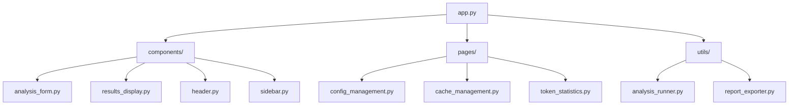
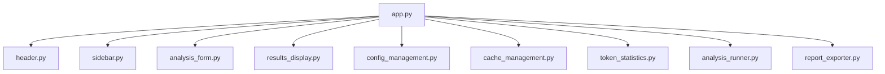
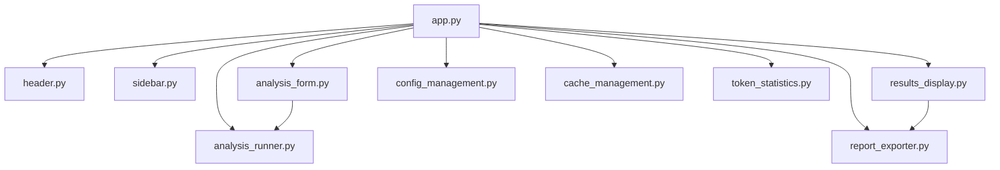

# Web界面

<cite>
**本文档引用的文件**  
- [app.py](file://web/app.py)
- [analysis_form.py](file://web/components/analysis_form.py)
- [results_display.py](file://web/components/results_display.py)
- [header.py](file://web/components/header.py)
- [sidebar.py](file://web/components/sidebar.py)
- [config_management.py](file://web/pages/config_management.py)
- [cache_management.py](file://web/pages/cache_management.py)
- [token_statistics.py](file://web/pages/token_statistics.py)
- [analysis_runner.py](file://web/utils/analysis_runner.py)
- [report_exporter.py](file://web/utils/report_exporter.py)
</cite>

## 目录
1. [简介](#简介)
2. [项目结构](#项目结构)
3. [核心组件](#核心组件)
4. [架构概览](#架构概览)
5. [详细组件分析](#详细组件分析)
6. [依赖分析](#依赖分析)
7. [性能考虑](#性能考虑)
8. [故障排除指南](#故障排除指南)
9. [结论](#结论)

## 简介
TradingAgents-CN 是一个基于 Streamlit 构建的交互式前端系统，旨在为用户提供一个直观、功能丰富的股票分析平台。该系统整合了多智能体大语言模型（LLM）技术，通过多个专业分析师的协作，为用户提供全面的股票投资决策支持。本系统不仅支持实时股票数据分析，还提供专业的投资建议，帮助用户做出更明智的投资决策。

## 项目结构
TradingAgents-CN 项目的结构清晰，各组件职责分明。主要组件包括：
- **app.py**: 主应用入口，负责页面路由和状态管理。
- **components/**: 包含核心UI组件，如分析表单、结果展示、头部和侧边栏。
- **pages/**: 包含管理页面，如配置管理、缓存管理和Token统计。
- **utils/**: 包含辅助工具，如分析任务启动和报告导出。

**图源**
- [app.py](file://web/app.py)
- [components/](file://web/components/)
- [pages/](file://web/pages/)
- [utils/](file://web/utils/)

## 核心组件
### 分析表单 (analysis_form.py)
`analysis_form.py` 实现了分析参数输入表单，用户可以通过该表单选择市场类型、输入股票代码、选择分析日期、设置研究深度，并选择参与分析的分析师团队。表单还提供了高级选项，如包含情绪分析和风险评估。

**组件源**
- [analysis_form.py](file://web/components/analysis_form.py)

### 结果展示 (results_display.py)
`results_display.py` 负责报告的可视化展示，包括投资决策摘要、分析配置信息、详细分析报告和风险提示。该组件还集成了报告导出功能，支持将分析结果导出为Markdown、Word和PDF格式。

**组件源**
- [results_display.py](file://web/components/results_display.py)

### 头部和侧边栏 (header.py 和 sidebar.py)
`header.py` 提供了页面头部，包括主标题和功能特性展示。`sidebar.py` 提供了全局控制，包括API密钥状态、AI模型配置和系统信息。

**组件源**
- [header.py](file://web/components/header.py)
- [sidebar.py](file://web/components/sidebar.py)

## 架构概览
TradingAgents-CN 的架构基于 Streamlit 构建，采用模块化设计，各组件通过清晰的接口进行通信。主应用 `app.py` 负责页面路由和状态管理，核心UI组件负责用户交互，管理页面负责系统配置和监控，辅助工具负责前后端协作。

**图源**
- [app.py](file://web/app.py)
- [header.py](file://web/components/header.py)
- [sidebar.py](file://web/components/sidebar.py)
- [analysis_form.py](file://web/components/analysis_form.py)
- [results_display.py](file://web/components/results_display.py)
- [config_management.py](file://web/pages/config_management.py)
- [cache_management.py](file://web/pages/cache_management.py)
- [token_statistics.py](file://web/pages/token_statistics.py)
- [analysis_runner.py](file://web/utils/analysis_runner.py)
- [report_exporter.py](file://web/utils/report_exporter.py)

## 详细组件分析
### 主应用流程 (app.py)
`app.py` 是整个系统的入口，负责初始化会话状态、渲染页面头部、处理页面导航，并根据用户选择的页面渲染相应的内容。主应用通过 `render_header`、`render_sidebar`、`render_analysis_form` 和 `render_results` 等函数调用，实现了页面的动态渲染。

**组件源**
- [app.py](file://web/app.py)

### 配置管理 (config_management.py)
`config_management.py` 提供了配置管理功能，用户可以在此页面查看和编辑模型配置、定价设置、使用统计和系统设置。该页面还提供了导出配置和清空使用记录的功能。

**组件源**
- [config_management.py](file://web/pages/config_management.py)

### 缓存管理 (cache_management.py)
`cache_management.py` 提供了缓存管理功能，用户可以在此页面查看缓存统计、清理过期缓存和测试缓存。该页面还提供了缓存详情，包括缓存文件列表和缓存目录信息。

**组件源**
- [cache_management.py](file://web/pages/cache_management.py)

### Token统计 (token_statistics.py)
`token_statistics.py` 提供了Token使用统计功能，用户可以在此页面查看Token使用情况、成本分析和统计图表。该页面还提供了导出统计数据的功能。

**组件源**
- [token_statistics.py](file://web/pages/token_statistics.py)

### 辅助工具 (analysis_runner.py 和 report_exporter.py)
`analysis_runner.py` 负责启动分析任务，`report_exporter.py` 负责导出报告。这两个工具通过清晰的接口与主应用和其他组件进行通信，实现了前后端的协作。

**组件源**
- [analysis_runner.py](file://web/utils/analysis_runner.py)
- [report_exporter.py](file://web/utils/report_exporter.py)

## 依赖分析
TradingAgents-CN 的依赖关系清晰，各组件之间的耦合度较低。主应用 `app.py` 依赖于核心UI组件和管理页面，核心UI组件依赖于辅助工具，管理页面和辅助工具之间没有直接依赖。

**图源**
- [app.py](file://web/app.py)
- [header.py](file://web/components/header.py)
- [sidebar.py](file://web/components/sidebar.py)
- [analysis_form.py](file://web/components/analysis_form.py)
- [results_display.py](file://web/components/results_display.py)
- [config_management.py](file://web/pages/config_management.py)
- [cache_management.py](file://web/pages/cache_management.py)
- [token_statistics.py](file://web/pages/token_statistics.py)
- [analysis_runner.py](file://web/utils/analysis_runner.py)
- [report_exporter.py](file://web/utils/report_exporter.py)

## 性能考虑
TradingAgents-CN 在设计时充分考虑了性能问题。通过缓存机制，减少了API调用次数，提高了数据获取速度。通过优化数据提供器，提高了分析响应速度。此外，系统还支持离线分析，进一步提高了性能。

## 故障排除指南
### 页面无响应
- **检查API密钥**: 确认API密钥是否正确配置。
- **检查网络连接**: 确认网络连接是否正常。
- **重启应用**: 重启应用以清除可能的缓存问题。

### 分析卡顿
- **减少研究深度**: 尝试减少研究深度以降低分析复杂度。
- **更换模型**: 尝试更换模型以提高分析速度。
- **检查系统资源**: 确认系统资源是否充足。

## 结论
TradingAgents-CN 是一个功能强大、易于使用的股票分析平台，通过多智能体大语言模型技术，为用户提供全面的投资决策支持。系统的模块化设计和清晰的依赖关系，使其易于维护和扩展。通过合理的性能优化和故障排除指南，确保了系统的稳定性和可靠性。