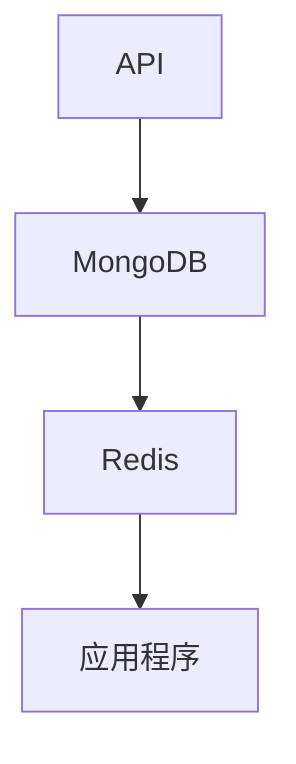

# 管理功能

<cite>
**本文档引用的文件**   
- [config_management.py](file://web/pages/config_management.py)
- [cache_management.py](file://web/pages/cache_management.py)
- [database_management.py](file://web/pages/database_management.py)
- [token_statistics.py](file://web/pages/token_statistics.py)
- [CACHE_CLEANING_GUIDE.md](file://web/CACHE_CLEANING_GUIDE.md)
- [config_manager.py](file://tradingagents/config/config_manager.py)
- [cache_manager.py](file://tradingagents/dataflows/cache_manager.py)
- [database_manager.py](file://tradingagents/config/database_manager.py)
</cite>

## 目录
1. [配置管理](#配置管理)
2. [缓存管理](#缓存管理)
3. [数据库管理](#数据库管理)
4. [Token统计](#token统计)
5. [权限与风险](#权限与风险)
6. [使用场景示例](#使用场景示例)

## 配置管理

`config_management.py` 实现了系统的配置管理系统，提供了一个可视化的Web界面，用于管理环境变量、模型配置、定价设置和系统设置。该系统通过 `ConfigManager` 类实现，支持从 `.env` 文件和Web界面双重配置，其中 `.env` 文件的配置具有更高优先级。

配置管理页面分为四个主要功能模块：

1.  **模型配置**：允许用户添加、编辑和启用/禁用不同的LLM模型（如DashScope、OpenAI、Google等）。用户可以设置模型名称、API密钥、最大Token数、温度参数等。系统会优先使用 `.env` 文件中的API密钥。
2.  **定价设置**：用于配置不同模型的输入和输出Token价格，支持多种货币（CNY、USD、EUR）。这些价格信息是后续Token成本计算的基础。
3.  **使用统计**：提供模型使用情况的概览，包括总成本、总请求数、输入/输出Token数，并按供应商进行统计和可视化展示。
4.  **系统设置**：包含默认供应商、默认模型、成本跟踪开关、成本警告阈值等全局设置。用户还可以导出配置、清空使用记录或重置所有配置。

**Section sources**
- [config_management.py](file://web/pages/config_management.py#L1-L574)
- [config_manager.py](file://tradingagents/config/config_manager.py#L1-L603)

## 缓存管理

`cache_management.py` 提供了全面的缓存清理功能，旨在优化系统性能和释放磁盘空间。该功能通过 `StockDataCache` 类实现，支持对文件系统缓存进行管理。

### 缓存清理功能
-   **清理过期缓存**：用户可以指定一个天数（1-30天），系统将自动删除该天数之前的过期缓存文件。此操作通过 `clear_old_cache` 方法实现。
-   **缓存统计**：页面实时显示缓存的总文件数、总大小、股票数据、新闻数据和基本面数据的文件数量。
-   **缓存测试**：提供对美股（如AAPL）和A股（如000001）数据缓存的测试功能，以验证缓存机制的正常工作。

### 安全操作指引
根据 `CACHE_CLEANING_GUIDE.md` 文档，缓存清理操作有以下几种模式：
-   **默认启动**：仅清理项目代码的 `__pycache__` 目录，推荐日常开发使用。
-   **跳过清理**：使用 `--no-clean` 参数，启动更快，适用于稳定环境。
-   **强制清理**：使用 `--force-clean` 参数，清理所有缓存（包括虚拟环境），适用于解决文件监控错误等疑难问题。

**Section sources**
- [cache_management.py](file://web/pages/cache_management.py#L1-L325)
- [CACHE_CLEANING_GUIDE.md](file://web/CACHE_CLEANING_GUIDE.md#L1-L146)
- [cache_manager.py](file://tradingagents/dataflows/cache_manager.py#L1-L502)

## 数据库管理

`database_management.py` 模块负责对MongoDB和Redis数据库进行监控与维护。它通过 `DatabaseManager` 类来检测和管理数据库连接状态。

### 监控与维护功能
-   **连接状态监控**：在侧边栏实时显示MongoDB和Redis的连接状态（已连接/未连接）。
-   **数据统计**：
    -   **MongoDB**：显示各集合（如股票数据、分析结果、用户会话）的记录数量。
    -   **Redis**：显示缓存键的数量和内存使用情况。
-   **数据清理**：提供“清理过期数据”功能，可删除指定天数前的缓存数据。
-   **架构说明**：文档清晰地阐述了系统的三层缓存架构：
    1.  **L1缓存 (Redis)**：内存缓存，提供毫秒级访问速度。
    2.  **L2缓存 (MongoDB)**：持久化存储，提供秒级访问速度和复杂查询能力。
    3.  **L3数据源 (API)**：外部数据源，如Tushare、FINNHUB API。

**Diagram sources**
- [database_management.py](file://web/pages/database_management.py#L1-L298)
- [database_manager.py](file://tradingagents/config/database_manager.py#L1-L328)

## Token统计

`token_statistics.py` 模块实现了对LLM调用次数、Token消耗和成本的统计与分析功能。该功能由 `TokenTracker` 和 `ConfigManager` 类协同完成。

### 统计与分析功能
-   **成本计算**：系统根据 `pricing.json` 中的定价配置，自动计算每次LLM调用的成本。
-   **多维度统计**：支持按时间范围（今天、最近7/30/90天、全部）查看统计信息，包括：
    -   总成本、总调用次数、总Token数。
    -   按供应商（如DashScope、DeepSeek）的详细统计。
    -   成本与Token使用量的关系散点图。
-   **趋势分析**：通过双轴图表展示每日成本和Token使用量的趋势。
-   **报告导出**：支持将详细的使用记录（包括时间、供应商、模型、Token数、成本等）按JSON格式导出。

**Section sources**
- [token_statistics.py](file://web/pages/token_statistics.py#L1-L440)
- [config_manager.py](file://tradingagents/config/config_manager.py#L1-L603)

## 权限与风险

### 权限要求
-   **配置管理**：需要对 `config` 目录的读写权限，以修改 `models.json`、`pricing.json` 等配置文件。
-   **缓存管理**：需要对 `data_cache` 目录的读写和删除权限，以清理缓存文件。
-   **数据库管理**：需要对MongoDB和Redis数据库的连接和操作权限。
-   **Token统计**：需要读取 `usage.json` 文件或访问MongoDB中使用记录集合的权限。

### 操作风险提示
-   **重置配置**：在配置管理中重置配置会删除 `config` 目录下的所有配置文件，导致所有自定义设置丢失。
-   **清空记录**：清空使用记录是不可逆操作，会永久删除所有历史使用数据。
-   **强制清理**：使用 `--force-clean` 可能会清理虚拟环境的缓存，导致依赖包需要重新编译，启动时间变长。
-   **数据库清理**：直接操作数据库（如执行 `cache_clear_pattern`）可能会影响正在运行的其他服务。

## 使用场景示例

### 场景一：配置更新后服务重启流程
1.  在Web界面的“配置管理”中修改模型的API密钥或参数。
2.  点击“保存配置”。
3.  如果API密钥是从 `.env` 文件读取的，则需要**重启Web服务**，使新的 `.env` 配置生效。
4.  重启后，新配置即可被系统使用。

### 场景二：缓存清理对性能的影响评估
1.  **清理前**：在“缓存管理”页面查看缓存统计，记录当前的总大小和文件数。
2.  执行“清理过期缓存”操作。
3.  **清理后**：再次查看统计，对比清理前后的数据，评估释放的磁盘空间。
4.  **性能影响**：首次访问被清理的股票数据时，系统需要重新从API获取，响应速度会变慢。但一旦数据被重新缓存，后续访问速度将恢复到正常水平。此操作在磁盘空间不足或需要获取最新数据时非常有效。