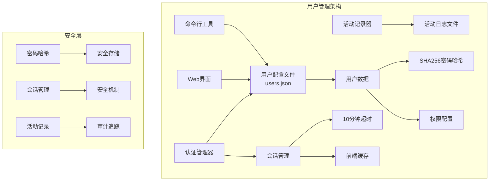
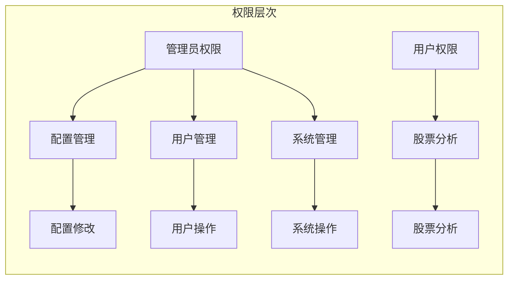
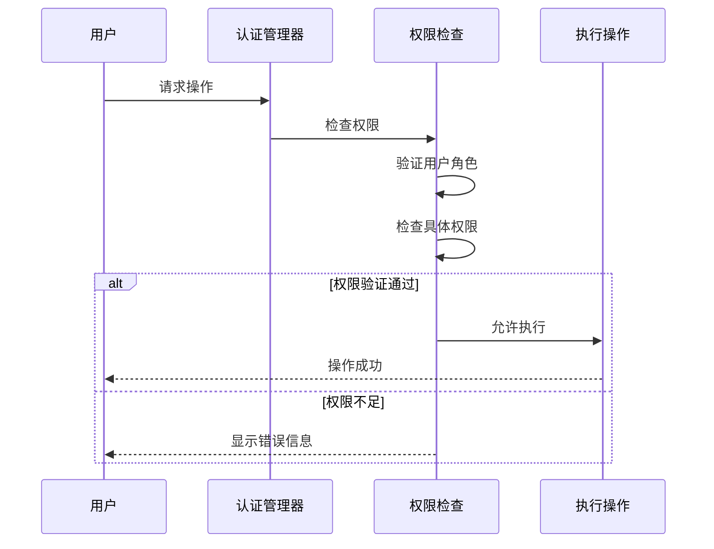
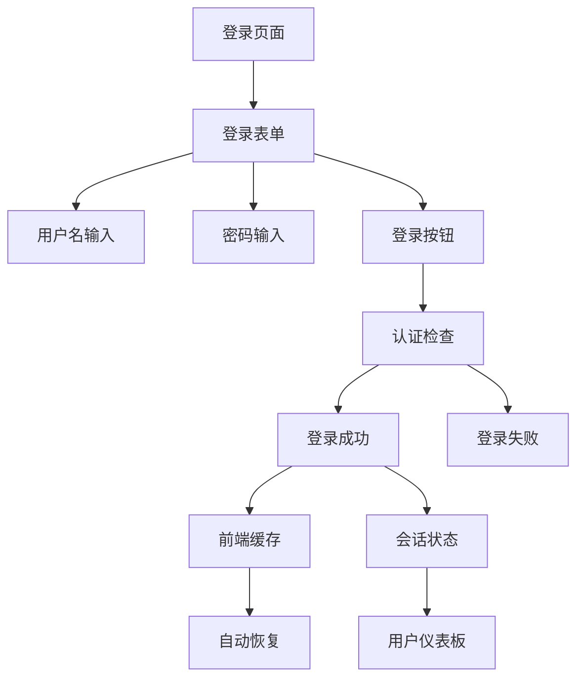
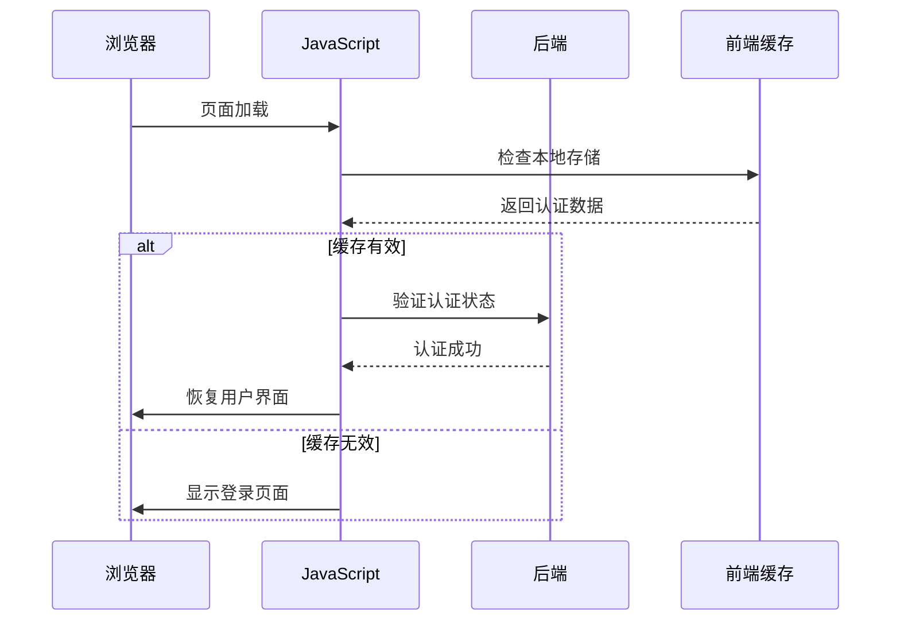
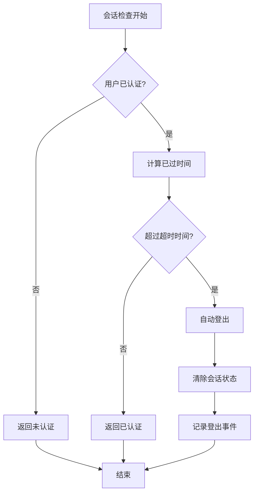
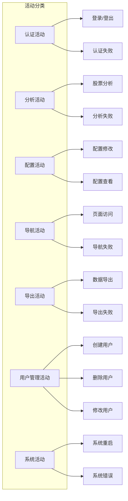

# 用户管理

<cite>
**本文档引用的文件**
- [USER_MANAGEMENT.md](file://scripts/USER_MANAGEMENT.md)
- [user_password_manager.py](file://scripts/user_password_manager.py)
- [user_manager.ps1](file://scripts/user_manager.ps1)
- [user_manager.bat](file://scripts/user_manager.bat)
- [auth_manager.py](file://web/utils/auth_manager.py)
- [login.py](file://web/components/login.py)
- [user_activity_logger.py](file://web/utils/user_activity_logger.py)
- [config_management.py](file://web/modules/config_management.py)
- [app.py](file://web/app.py)
</cite>

## 目录
1. [简介](#简介)
2. [系统架构](#系统架构)
3. [用户角色和权限](#用户角色和权限)
4. [命令行用户管理工具](#命令行用户管理工具)
5. [Web界面用户管理](#web界面用户管理)
6. [会话管理和安全机制](#会话管理和安全机制)
7. [用户活动记录](#用户活动记录)
8. [批量用户管理](#批量用户管理)
9. [安全最佳实践](#安全最佳实践)
10. [故障排除](#故障排除)

## 简介

TradingAgents-CN 提供了一套完整的用户管理系统，支持多用户部署场景。该系统包含命令行工具和Web界面两种管理方式，具备完善的权限控制、会话管理和安全机制。

### 核心特性
- **多用户支持**: 支持同时管理多个用户账户
- **角色权限控制**: 区分管理员和普通用户，提供细粒度权限管理
- **安全存储**: 密码采用SHA256哈希加密存储
- **会话管理**: 支持10分钟无操作自动超时
- **活动记录**: 完整的用户操作审计日志
- **跨平台支持**: 提供Windows批处理和PowerShell脚本

## 系统架构



**架构图源文件**
- [auth_manager.py](file://web/utils/auth_manager.py#L25-L61)
- [user_password_manager.py](file://scripts/user_password_manager.py#L18-L25)

## 用户角色和权限

### 角色定义

系统提供两种用户角色，每种角色具有不同的权限级别：

| 角色 | 权限描述 | 默认权限 | 用途 |
|------|----------|----------|------|
| `admin` | 系统管理员 | `["analysis", "config", "admin"]` | 系统配置、用户管理、高级操作 |
| `user` | 普通用户 | `["analysis"]` | 股票分析、基础功能使用 |

### 权限分类



**权限图源文件**
- [auth_manager.py](file://web/utils/auth_manager.py#L363-L383)
- [user_password_manager.py](file://scripts/user_password_manager.py#L100-L122)

### 权限检查机制

系统在每个关键操作前都会进行权限验证：



**序列图源文件**
- [auth_manager.py](file://web/utils/auth_manager.py#L363-L383)
- [app.py](file://web/app.py#L927-L988)

**章节源文件**
- [auth_manager.py](file://web/utils/auth_manager.py#L25-L61)
- [user_password_manager.py](file://scripts/user_password_manager.py#L100-L122)

## 命令行用户管理工具

### 工具概述

系统提供三个用户管理脚本，支持不同的操作系统和使用场景：

| 脚本文件 | 平台支持 | 使用场景 |
|----------|----------|----------|
| `user_password_manager.py` | 跨平台 | Python原生脚本，功能完整 |
| `user_manager.bat` | Windows | 批处理脚本，简单易用 |
| `user_manager.ps1` | Windows | PowerShell脚本，功能丰富 |

### 基本使用方法

#### Python脚本（推荐）

```bash
# 查看帮助信息
python scripts/user_password_manager.py --help

# 列出所有用户
python scripts/user_password_manager.py list

# 修改用户密码
python scripts/user_password_manager.py change-password admin newpassword123

# 创建新用户
python scripts/user_password_manager.py create-user newuser password123 --role user

# 创建管理员用户
python scripts/user_password_manager.py create-user newadmin adminpass123 --role admin

# 删除用户
python scripts/user_password_manager.py delete-user olduser

# 重置为默认配置
python scripts/user_password_manager.py reset
```

#### Windows批处理脚本

```cmd
# 列出所有用户
scripts\user_manager.bat list

# 修改用户密码
scripts\user_manager.bat change-password admin newpassword123

# 创建新用户
scripts\user_manager.bat create-user newuser password123 user

# 删除用户
scripts\user_manager.bat delete-user olduser

# 重置为默认配置
scripts\user_manager.bat reset
```

#### PowerShell脚本

```powershell
# 列出所有用户
.\scripts\user_manager.ps1 list

# 修改用户密码
.\scripts\user_manager.ps1 change-password admin newpassword123

# 创建新用户
.\scripts\user_manager.ps1 create-user newuser password123 user

# 删除用户
.\scripts\user_manager.ps1 delete-user olduser

# 重置为默认配置
.\scripts\user_manager.ps1 reset
```

### 功能详解

#### 1. 列出用户 (list)

显示所有用户的详细信息：

```bash
📋 用户列表:
------------------------------------------------------------
用户名           角色       权限                           创建时间
------------------------------------------------------------
admin          admin      analysis, config, admin        2024-01-15 10:30:25
user           user       analysis                       2024-01-15 10:30:25
analyst        user       analysis                       2024-01-16 14:20:10
manager        admin      analysis, config, admin        2024-01-17 09:45:30
```

#### 2. 修改密码 (change-password)

修改指定用户的密码，系统自动进行SHA256哈希处理：

```bash
# 语法: change-password <用户名> <新密码>
python scripts/user_password_manager.py change-password admin secure_new_password123
```

#### 3. 创建用户 (create-user)

创建新的用户账户，支持自定义角色和权限：

```bash
# 基本语法
python scripts/user_password_manager.py create-user <用户名> <密码> [--role <角色>]

# 示例：创建分析师用户
python scripts/user_password_manager.py create-user analyst analyst123 --role user

# 示例：创建管理员用户
python scripts/user_password_manager.py create-user manager manager123 --role admin
```

**参数说明**：
- `--role`: 用户角色，可选值为 `user` 或 `admin`，默认为 `user`
- `--permissions`: 权限列表，如不指定则根据角色自动分配

#### 4. 删除用户 (delete-user)

删除指定的用户账户，系统会防止删除最后一个管理员用户：

```bash
# 语法: delete-user <用户名>
python scripts/user_password_manager.py delete-user olduser

# 系统会提示确认
确认删除用户 'olduser'? (y/N): y
✅ 用户 olduser 已删除
```

#### 5. 重置配置 (reset)

将用户配置重置为默认设置：

```bash
# 重置前会提示确认
确认重置为默认用户配置? 这将删除所有现有用户! (y/N): y

✅ 用户配置已重置为默认设置
   默认用户:
   - admin / admin123 (管理员)
   - user / user123 (普通用户)
```

### 配置文件位置

用户配置文件位于：`web/config/users.json`

**章节源文件**
- [USER_MANAGEMENT.md](file://scripts/USER_MANAGEMENT.md#L1-L161)
- [user_password_manager.py](file://scripts/user_password_manager.py#L1-L262)
- [user_manager.ps1](file://scripts/user_manager.ps1#L1-L83)
- [user_manager.bat](file://scripts/user_manager.bat#L1-L56)

## Web界面用户管理

### 登录界面

Web界面提供现代化的登录体验，支持前端缓存和自动恢复功能：



**登录流程图源文件**
- [login.py](file://web/components/login.py#L150-L200)
- [auth_manager.py](file://web/utils/auth_manager.py#L229-L266)

### 会话管理

Web界面实现了完整的会话管理机制：

#### 1. 会话超时机制

- **超时时间**: 10分钟无操作自动超时
- **检测频率**: 实时检查会话状态
- **自动登出**: 超时时自动清除会话

#### 2. 前端缓存机制

系统在浏览器本地存储用户认证信息：

```javascript
// 前端缓存结构
{
    "userInfo": {
        "username": "admin",
        "role": "admin",
        "permissions": ["analysis", "config", "admin"]
    },
    "loginTime": 1640995200.123,
    "lastActivity": 1640995800.456
}
```

#### 3. 自动恢复功能

当用户关闭浏览器重新打开时，系统会自动尝试恢复之前的登录状态：



**自动恢复流程图源文件**
- [auth_manager.py](file://web/utils/auth_manager.py#L59-L93)
- [app.py](file://web/app.py#L416-L448)

### 权限控制

Web界面在每个页面和功能模块都实施严格的权限控制：

#### 页面级权限控制

```python
# 配置管理页面 - 需要config权限
if not require_permission("config"):
    return

# 系统设置页面 - 需要admin权限
if not require_permission("admin"):
    return
```

#### 功能级权限控制

```python
# 检查用户是否有特定权限
if auth_manager.check_permission("analysis"):
    # 允许股票分析功能
    render_analysis_form()
else:
    st.error("您没有分析权限")
```

**章节源文件**
- [login.py](file://web/components/login.py#L1-L557)
- [auth_manager.py](file://web/utils/auth_manager.py#L25-L384)
- [app.py](file://web/app.py#L927-L988)

## 会话管理和安全机制

### 密码存储策略

系统采用强密码哈希策略保护用户凭据：

#### 哈希算法
- **算法**: SHA256
- **实现**: `hashlib.sha256(password.encode()).hexdigest()`
- **安全性**: 单向哈希，不可逆推

#### 存储格式

```json
{
    "admin": {
        "password_hash": "e3b0c44298fc1c149afbf4c8996fb92427ae41e4649b934ca495991b7852b855",
        "role": "admin",
        "permissions": ["analysis", "config", "admin"],
        "created_at": 1640995200.123
    }
}
```

### 会话超时机制

#### 超时配置

```python
# 会话超时时间：10分钟（600,000毫秒）
self.session_timeout = 600000
```

#### 超时检测流程



**超时检测流程图源文件**
- [auth_manager.py](file://web/utils/auth_manager.py#L229-L266)

### 访问日志

系统记录所有重要的访问和操作事件：

#### 日志类型

| 日志类型 | 描述 | 记录内容 |
|----------|------|----------|
| 登录日志 | 用户登录/登出 | 用户名、时间、成功/失败 |
| 权限日志 | 权限检查结果 | 用户名、权限、检查结果 |
| 操作日志 | 功能使用情况 | 用户名、操作类型、参数 |
| 错误日志 | 系统错误信息 | 错误类型、堆栈信息 |

#### 日志格式

```json
{
    "timestamp": 1640995200.123,
    "username": "admin",
    "user_role": "admin",
    "action_type": "auth",
    "action_name": "user_login",
    "details": {"username": "admin"},
    "session_id": "session_1640995200_123456",
    "success": true,
    "ip_address": "192.168.1.100",
    "user_agent": "Mozilla/5.0..."
}
```

**章节源文件**
- [auth_manager.py](file://web/utils/auth_manager.py#L159-L198)
- [user_activity_logger.py](file://web/utils/user_activity_logger.py#L1-L414)

## 用户活动记录

### 活动记录器功能

系统提供完整的用户活动记录功能，支持审计和监控：

#### 记录的活动类型



**活动分类图源文件**
- [user_activity_logger.py](file://web/utils/user_activity_logger.py#L50-L70)

### 活动记录API

#### 基本记录方法

```python
# 记录登录活动
user_activity_logger.log_login(username, success, error_message)

# 记录分析请求
user_activity_logger.log_analysis_request(stock_code, analysis_type, success)

# 记录配置变更
user_activity_logger.log_config_change(config_type, changes)

# 记录用户管理操作
user_activity_logger.log_user_management(operation, target_user, success)
```

#### 高级查询功能

```python
# 获取用户活动记录
activities = user_activity_logger.get_user_activities(
    username="admin",
    start_date=datetime.now() - timedelta(days=7),
    end_date=datetime.now(),
    action_type="auth",
    limit=100
)

# 获取活动统计
stats = user_activity_logger.get_activity_statistics(days=7)
```

### 日志文件管理

#### 文件组织结构

```
web/data/user_activities/
├── user_activities_2024-01-15.jsonl
├── user_activities_2024-01-16.jsonl
├── user_activities_2024-01-17.jsonl
└── ...
```

#### 自动清理机制

系统自动清理超过90天的旧日志文件：

```python
# 清理旧活动记录
deleted_count = user_activity_logger.cleanup_old_activities(days_to_keep=90)
print(f"已删除 {deleted_count} 个旧日志文件")
```

**章节源文件**
- [user_activity_logger.py](file://web/utils/user_activity_logger.py#L1-L414)

## 批量用户管理

### 批量操作脚本

系统支持通过Python脚本进行批量用户管理操作：

#### 批量创建用户

```python
#!/usr/bin/env python3
"""
批量创建用户脚本示例
"""

import sys
import os
from pathlib import Path

# 添加项目根目录到Python路径
project_root = Path(__file__).parent.parent
sys.path.insert(0, str(project_root))

from scripts.user_password_manager import create_user, load_users, save_users

def batch_create_users(user_list):
    """批量创建用户"""
    users = load_users()
    
    for username, password, role in user_list:
        if username in users:
            print(f"用户 {username} 已存在，跳过")
            continue
        
        success = create_user(username, password, role)
        if success:
            print(f"✅ 用户 {username} 创建成功")
        else:
            print(f"❌ 用户 {username} 创建失败")

# 用户列表格式：(用户名, 密码, 角色)
users_to_create = [
    ("analyst1", "analyst_pass123", "user"),
    ("analyst2", "analyst_pass123", "user"),
    ("analyst3", "analyst_pass123", "user"),
    ("manager1", "manager_pass123", "admin"),
    ("manager2", "manager_pass123", "admin")
]

batch_create_users(users_to_create)
```

#### 批量修改密码

```python
#!/usr/bin/env python3
"""
批量修改密码脚本示例
"""

import sys
from pathlib import Path

# 添加项目根目录到Python路径
project_root = Path(__file__).parent.parent
sys.path.insert(0, str(project_root))

from scripts.user_password_manager import change_password, load_users

def batch_change_passwords(password_map):
    """批量修改密码"""
    users = load_users()
    
    for username, new_password in password_map.items():
        if username not in users:
            print(f"用户 {username} 不存在，跳过")
            continue
        
        success = change_password(username, new_password)
        if success:
            print(f"✅ 用户 {username} 密码修改成功")
        else:
            print(f"❌ 用户 {username} 密码修改失败")

# 用户密码映射
password_updates = {
    "analyst1": "new_analyst_pass123",
    "analyst2": "new_analyst_pass123", 
    "manager1": "new_manager_pass123"
}

batch_change_passwords(password_updates)
```

#### 批量删除用户

```python
#!/usr/bin/env python3
"""
批量删除用户脚本示例
"""

import sys
from pathlib import Path

# 添加项目根目录到Python路径
project_root = Path(__file__).parent.parent
sys.path.insert(0, str(project_root))

from scripts.user_password_manager import delete_user, load_users

def batch_delete_users(usernames):
    """批量删除用户"""
    users = load_users()
    
    for username in usernames:
        if username not in users:
            print(f"用户 {username} 不存在，跳过")
            continue
        
        success = delete_user(username)
        if success:
            print(f"✅ 用户 {username} 删除成功")
        else:
            print(f"❌ 用户 {username} 删除失败")

# 要删除的用户列表
users_to_delete = ["test_user1", "test_user2", "test_user3"]

batch_delete_users(users_to_delete)
```

### 配置模板管理

#### 用户配置模板

```python
# 用户配置模板
USER_TEMPLATES = {
    "analyst": {
        "role": "user",
        "permissions": ["analysis"],
        "default_password": "analyst123"
    },
    "admin": {
        "role": "admin", 
        "permissions": ["analysis", "config", "admin"],
        "default_password": "admin123"
    },
    "readonly": {
        "role": "user",
        "permissions": ["analysis"],
        "default_password": "readonly123"
    }
}

def create_user_with_template(username, template_name):
    """使用模板创建用户"""
    if template_name not in USER_TEMPLATES:
        print(f"模板 {template_name} 不存在")
        return False
    
    template = USER_TEMPLATES[template_name]
    return create_user(
        username, 
        template["default_password"], 
        template["role"], 
        template["permissions"]
    )
```

**章节源文件**
- [user_password_manager.py](file://scripts/user_password_manager.py#L80-L170)

## 安全最佳实践

### 密码安全

#### 密码策略

1. **最小长度**: 建议至少8位字符
2. **复杂度要求**: 包含字母、数字和特殊字符
3. **定期更换**: 建议每90天更换一次密码
4. **唯一性**: 不同账户使用不同密码

#### 密码存储安全

```python
# 强密码哈希示例
def secure_password_hash(password):
    """安全的密码哈希函数"""
    # 使用SHA256哈希
    hashed = hashlib.sha256(password.encode()).hexdigest()
    
    # 可选：添加盐值（实际实现中应使用随机盐）
    salted_hash = hashlib.sha256((hashed + "random_salt").encode()).hexdigest()
    
    return salted_hash
```

### 访问控制

#### 网络安全

1. **HTTPS协议**: 生产环境必须使用HTTPS
2. **防火墙配置**: 限制访问端口
3. **IP白名单**: 可选的IP访问控制
4. **DDoS防护**: 部署适当的防护措施

#### 文件权限

```bash
# 设置用户配置文件权限
chmod 600 web/config/users.json
chmod 700 web/config/

# 设置脚本执行权限
chmod +x scripts/user_password_manager.py
chmod +x scripts/user_manager.bat
chmod +x scripts/user_manager.ps1
```

### 监控和审计

#### 关键监控指标

| 监控项目 | 阈值 | 告警条件 |
|----------|------|----------|
| 登录失败率 | < 5% | 连续3次失败 |
| 异常登录时间 | - | 非工作时间登录 |
| 权限滥用 | - | 超级权限频繁使用 |
| 并发用户数 | < 100 | 超过系统容量 |

#### 审计日志

```python
# 审计日志示例
audit_log = {
    "timestamp": time.time(),
    "event_type": "security_audit",
    "severity": "high",
    "message": "检测到异常登录行为",
    "details": {
        "username": "admin",
        "ip_address": "192.168.1.100",
        "location": "未知地区",
        "risk_score": 85
    }
}
```

### 备份和恢复

#### 配置备份

```bash
#!/bin/bash
# 用户配置备份脚本

BACKUP_DIR="backup/user_configs"
DATE=$(date +%Y%m%d_%H%M%S)

# 创建备份目录
mkdir -p "$BACKUP_DIR"

# 备份用户配置文件
cp web/config/users.json "$BACKUP_DIR/users_backup_$DATE.json"

# 备份活动日志
tar -czf "$BACKUP_DIR/activity_logs_$DATE.tar.gz" web/data/user_activities/

echo "备份完成: $BACKUP_DIR"
```

#### 恢复操作

```bash
#!/bin/bash
# 用户配置恢复脚本

BACKUP_FILE="$1"

if [ -z "$BACKUP_FILE" ]; then
    echo "用法: $0 <备份文件>"
    exit 1
fi

# 停止Web服务
# systemctl stop tradingagents-web

# 恢复配置文件
cp "$BACKUP_FILE" web/config/users.json

# 重启Web服务
# systemctl start tradingagents-web

echo "配置恢复完成"
```

**章节源文件**
- [USER_MANAGEMENT.md](file://scripts/USER_MANAGEMENT.md#L100-L130)
- [auth_manager.py](file://web/utils/auth_manager.py#L159-L198)

## 故障排除

### 常见问题及解决方案

#### 1. 找不到Python

**问题**: 执行脚本时提示找不到Python

**解决方案**:
```bash
# 检查Python是否安装
python --version

# 如果未安装，下载并安装Python 3.8+

# 添加到系统PATH（Windows）
set PATH=%PATH%;C:\Python39\;C:\Python39\Scripts\

# 验证PATH设置
echo %PATH%
```

#### 2. 权限错误

**问题**: Windows上无法运行批处理或PowerShell脚本

**解决方案**:
```powershell
# 修改PowerShell执行策略
Set-ExecutionPolicy -ExecutionPolicy RemoteSigned -Scope CurrentUser

# 或者以管理员身份运行
Run as Administrator
```

#### 3. 配置文件不存在

**问题**: 用户配置文件丢失或损坏

**解决方案**:
```bash
# 使用重置功能恢复默认配置
python scripts/user_password_manager.py reset

# 或手动创建配置文件
cat > web/config/users.json << EOF
{
    "admin": {
        "password_hash": "e3b0c44298fc1c149afbf4c8996fb92427ae41e4649b934ca495991b7852b855",
        "role": "admin",
        "permissions": ["analysis", "config", "admin"],
        "created_at": 1640995200.123
    },
    "user": {
        "password_hash": "e3b0c44298fc1c149afbf4c8996fb92427ae41e4649b934ca495991b7852b855",
        "role": "user",
        "permissions": ["analysis"],
        "created_at": 1640995200.123
    }
}
EOF
```

#### 4. 会话超时问题

**问题**: 用户频繁被强制登出

**解决方案**:
```python
# 修改会话超时时间（在auth_manager.py中）
class AuthManager:
    def __init__(self):
        self.session_timeout = 1800000  # 30分钟
```

#### 5. 前端缓存问题

**问题**: 登录状态无法持久化

**解决方案**:
```javascript
// 检查浏览器Cookie和LocalStorage
console.log('LocalStorage:', localStorage.getItem('tradingagents_auth'));
console.log('Cookies:', document.cookie);

// 清除缓存后重试
localStorage.removeItem('tradingagents_auth');
localStorage.removeItem('tradingagents_last_activity');
```

### 调试技巧

#### 1. 启用详细日志

```python
# 在auth_manager.py中启用调试模式
import logging
logging.basicConfig(level=logging.DEBUG)
```

#### 2. 检查配置文件

```bash
# 验证JSON格式
python -m json.tool web/config/users.json

# 检查文件权限
ls -la web/config/users.json
```

#### 3. 测试连接

```python
# 测试认证功能
from web.utils.auth_manager import auth_manager

# 测试登录
result = auth_manager.authenticate("admin", "admin123")
print(f"认证结果: {result}")

# 检查权限
has_permission = auth_manager.check_permission("admin")
print(f"管理员权限: {has_permission}")
```

### 性能优化

#### 1. 缓存优化

```python
# 优化用户配置加载
class OptimizedAuthManager(AuthManager):
    def __init__(self):
        super().__init__()
        self._user_cache = None
        self._cache_timestamp = 0
    
    def _load_users(self):
        # 实现缓存机制
        current_time = time.time()
        if self._user_cache is None or (current_time - self._cache_timestamp) > 60:
            self._user_cache = super()._load_users()
            self._cache_timestamp = current_time
        return self._user_cache
```

#### 2. 并发处理

```python
# 使用线程池处理大量用户操作
from concurrent.futures import ThreadPoolExecutor

def batch_process_users(user_operations):
    with ThreadPoolExecutor(max_workers=5) as executor:
        futures = []
        for op in user_operations:
            future = executor.submit(op['func'], *op['args'])
            futures.append(future)
        
        results = []
        for future in futures:
            try:
                results.append(future.result())
            except Exception as e:
                results.append({'error': str(e)})
        
        return results
```

**章节源文件**
- [USER_MANAGEMENT.md](file://scripts/USER_MANAGEMENT.md#L130-L161)
- [auth_manager.py](file://web/utils/auth_manager.py#L159-L198)