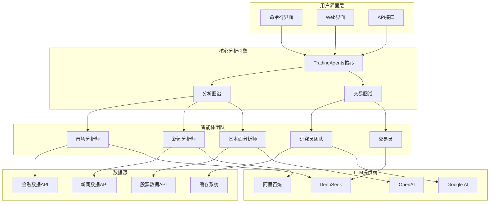
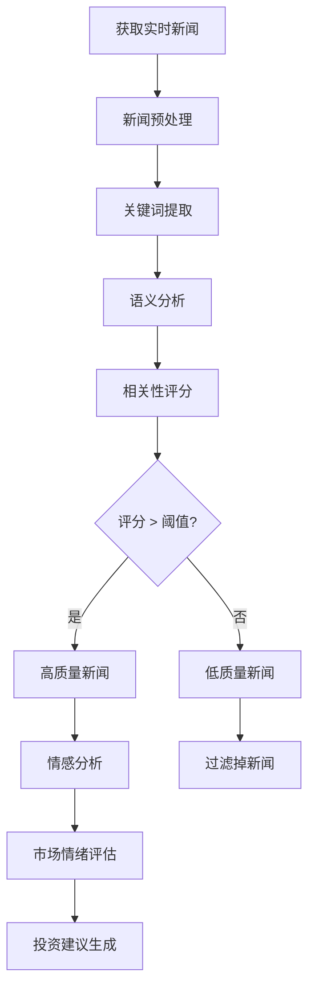
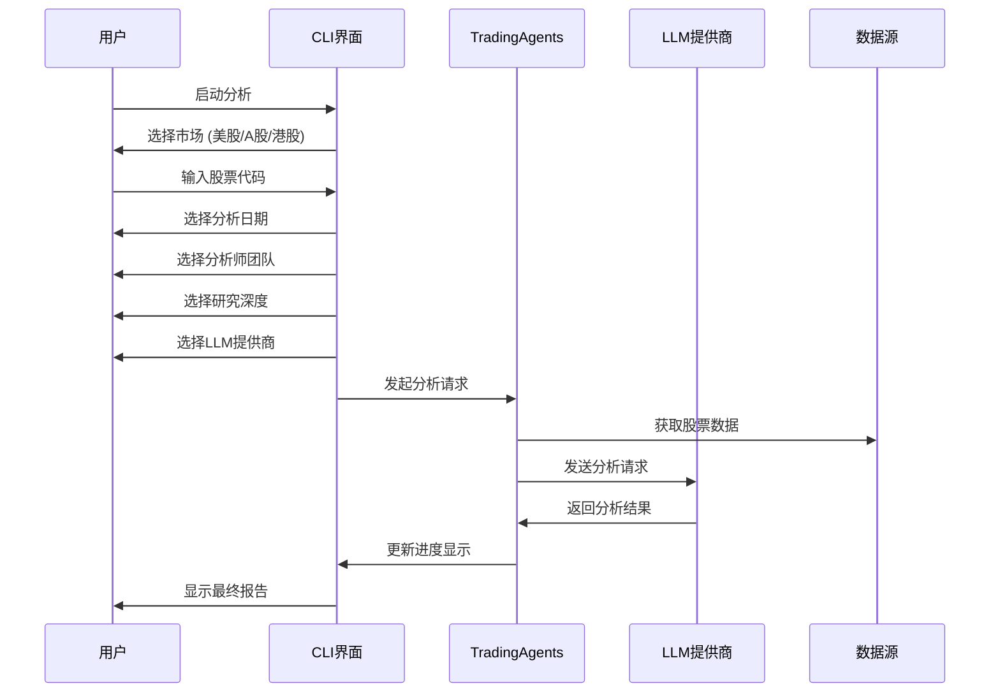
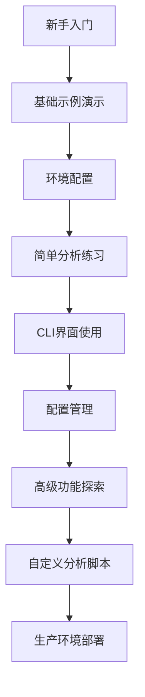

# 基础使用示例

<cite>
**本文档引用的文件**
- [examples/README.md](file://examples/README.md)
- [examples/simple_analysis_demo.py](file://examples/simple_analysis_demo.py)
- [examples/demo_deepseek_simple.py](file://examples/demo_deepseek_simple.py)
- [examples/demo_deepseek_analysis.py](file://examples/demo_deepseek_analysis.py)
- [examples/dashscope_examples/demo_dashscope_simple.py](file://examples/dashscope_examples/demo_dashscope_simple.py)
- [examples/dashscope_examples/demo_dashscope_chinese.py](file://examples/dashscope_examples/demo_dashscope_chinese.py)
- [examples/demo_news_filtering.py](file://examples/demo_news_filtering.py)
- [examples/my_stock_analysis.py](file://examples/my_stock_analysis.py)
- [examples/stock_query_examples.py](file://examples/stock_query_examples.py)
- [cli/main.py](file://cli/main.py)
- [tradingagents/default_config.py](file://tradingagents/default_config.py)
- [examples/config_management_demo.py](file://examples/config_management_demo.py)
</cite>

## 目录
1. [简介](#简介)
2. [系统架构概览](#系统架构概览)
3. [环境配置](#环境配置)
4. [快速开始示例](#快速开始示例)
5. [单只股票基本面分析](#单只股票基本面分析)
6. [不同LLM提供商使用示例](#不同llm提供商使用示例)
7. [新闻情绪分析](#新闻情绪分析)
8. [股票信息查询](#股票信息查询)
9. [CLI命令行界面](#cli命令行界面)
10. [配置管理](#配置管理)
11. [故障排除](#故障排除)
12. [最佳实践](#最佳实践)

## 简介

TradingAgents-CN是一个基于多智能体大语言模型的金融交易框架，提供了强大的股票分析和投资决策支持功能。本指南将帮助新用户快速上手系统，掌握基本的使用方法和核心功能。

### 核心特性

- **多智能体协作**：多个专业智能体协同完成复杂的股票分析任务
- **多LLM支持**：支持DeepSeek、阿里百炼、OpenAI等多种大语言模型
- **实时数据分析**：集成实时股票数据和新闻信息
- **成本控制**：提供Token跟踪和成本估算功能
- **中文优化**：针对中文用户的深度优化

## 系统架构概览



**图表来源**
- [cli/main.py](file://cli/main.py#L1-L100)
- [tradingagents/default_config.py](file://tradingagents/default_config.py#L1-L28)

## 环境配置

### API密钥配置

系统支持多个LLM提供商，每个都需要配置相应的API密钥：

#### 1. 阿里百炼 (推荐新手)
```bash
# 设置环境变量
export DASHSCOPE_API_KEY=your_dashscope_api_key
export FINNHUB_API_KEY=your_finnhub_api_key
```

#### 2. DeepSeek V3 (高性价比)
```bash
# 设置环境变量
export DEEPSEEK_API_KEY=sk-your_deepseek_api_key
export FINNHUB_API_KEY=your_finnhub_api_key
```

#### 3. OpenAI (功能强大)
```bash
# 设置环境变量
export OPENAI_API_KEY=your_openai_api_key
export FINNHUB_API_KEY=your_finnhub_api_key
```

### 配置文件设置

创建或编辑项目根目录的 `.env` 文件：

```bash
# LLM提供商配置
DASHSCOPE_API_KEY=your_dashscope_key
DEEPSEEK_API_KEY=your_deepseek_key
OPENAI_API_KEY=your_openai_key

# 金融数据API
FINNHUB_API_KEY=your_finnhub_key

# 数据目录配置
TRADINGAGENTS_DATA_DIR=./data
TRADINGAGENTS_RESULTS_DIR=./results

# 日志配置
TRADINGAGENTS_LOG_LEVEL=INFO
```

**章节来源**
- [examples/README.md](file://examples/README.md#L1-L100)
- [examples/config_management_demo.py](file://examples/config_management_demo.py#L1-L50)

## 快速开始示例

### 基础分析演示

最简单的使用方式是运行基础分析演示：

```bash
# 运行简单分析演示
python examples/simple_analysis_demo.py
```

该演示将展示：
- 支持的分析类型和适用场景
- 不同模型的特点对比
- 投资分析工作流程
- 实用的投资技巧和建议

### 深度分析演示

对于希望体验完整功能的用户：

```bash
# DeepSeek V3完整分析演示
python examples/demo_deepseek_analysis.py

# 阿里百炼中文优化演示
python examples/dashscope_examples/demo_dashscope_chinese.py
```

**章节来源**
- [examples/simple_analysis_demo.py](file://examples/simple_analysis_demo.py#L1-L100)
- [examples/demo_deepseek_analysis.py](file://examples/demo_deepseek_analysis.py#L1-L100)

## 单只股票基本面分析

### 完整分析流程

以下是使用不同LLM提供商进行单只股票基本面分析的完整流程：

#### 1. 使用DeepSeek V3进行分析

```python
# 基本分析示例
from tradingagents.llm_adapters.deepseek_direct_adapter import create_deepseek_direct_adapter

# 创建DeepSeek适配器
adapter = create_deepseek_direct_adapter(
    model="deepseek-chat",
    temperature=0.1,
    max_tokens=1000
)

# 执行分析
query = """
请全面分析招商银行(600036)的投资价值：
1. 财务状况分析
2. 盈利能力评估
3. 行业地位分析
4. 风险因素识别
5. 投资建议
"""

response = adapter.invoke(query)
print(response)
```

#### 2. 使用阿里百炼进行中文分析

```python
from tradingagents.llm_adapters import ChatDashScope
from langchain_core.messages import HumanMessage, SystemMessage

# 创建阿里百炼模型
llm = ChatDashScope(
    model="qwen-plus-latest",
    temperature=0.1,
    max_tokens=3000
)

# 构建中文分析提示
system_prompt = """
你是一位专业的股票分析师，具有丰富的金融市场经验。
请用中文进行分析，确保内容专业、客观、易懂。
"""

user_prompt = """
请对招商银行(600036)进行全面的股票分析，包括：
1. 财务指标分析
2. 业务模式评估
3. 市场竞争力
4. 风险评估
5. 投资建议
"""

messages = [
    SystemMessage(content=system_prompt),
    HumanMessage(content=user_prompt)
]

response = llm.invoke(messages)
print(response.content)
```

### 输入参数配置

| 参数 | 类型 | 默认值 | 说明 |
|------|------|--------|------|
| model | str | "deepseek-chat" | 使用的LLM模型 |
| temperature | float | 0.1 | 控制输出随机性，0表示确定性输出 |
| max_tokens | int | 1000 | 最大生成Token数 |
| timeout | int | 30 | 请求超时时间（秒） |

### 执行命令

```bash
# 直接运行分析脚本
python examples/demo_deepseek_analysis.py

# 自定义股票分析
python examples/my_stock_analysis.py
```

### 结果解读

分析结果通常包含以下部分：

1. **财务分析**：资产负债表、利润表、现金流量表分析
2. **业务分析**：核心业务、竞争优势、市场地位
3. **估值分析**：市盈率、市净率、PEG等指标
4. **风险评估**：经营风险、市场风险、政策风险
5. **投资建议**：买入/持有/卖出建议及目标价位

**章节来源**
- [examples/demo_deepseek_analysis.py](file://examples/demo_deepseek_analysis.py#L50-L150)
- [examples/my_stock_analysis.py](file://examples/my_stock_analysis.py#L1-L124)

## 不同LLM提供商使用示例

### DeepSeek V3（预览版推荐）

DeepSeek V3是新集成的高性价比大模型：

```python
# DeepSeek V3简单对话示例
from tradingagents.llm_adapters.deepseek_direct_adapter import create_deepseek_direct_adapter

# 创建适配器
adapter = create_deepseek_direct_adapter(
    model="deepseek-chat",
    temperature=0.1,
    max_tokens=500
)

# 执行简单对话
response = adapter.invoke("请解释什么是股票投资")
print(response)
```

**特点**：
- 💰 **超低成本**：相比GPT-4节省90%+费用
- 🇨🇳 **中文优化**：优秀的中文理解和生成能力
- 📊 **专业分析**：适合金融投资分析场景
- 🔧 **完整集成**：支持Token统计和成本跟踪

### 阿里百炼（中文优化）

阿里百炼是国内优秀的国产大模型：

```python
# 阿里百炼中文分析示例
from tradingagents.llm_adapters import ChatDashScope

# 创建模型实例
llm = ChatDashScope(
    model="qwen-plus-latest",
    temperature=0.1,
    max_tokens=3000
)

# 使用中文进行分析
messages = [
    SystemMessage(content="请用中文分析股票投资"),
    HumanMessage(content="请分析腾讯控股的投资价值")
]

response = llm.invoke(messages)
print(response.content)
```

**模型对比**：

| 模型 | 优势 | 适用场景 | 价格 |
|------|------|----------|------|
| qwen-turbo | 响应快，成本低 | 快速查询 | 最低 |
| qwen-plus | 平衡性能和成本 | 日常分析 | 中等 |
| qwen-max | 最高质量 | 深度分析 | 较高 |

### OpenAI（功能强大）

OpenAI模型提供最强的分析能力：

```python
# OpenAI分析示例
from openai import OpenAI

client = OpenAI(api_key=os.getenv("OPENAI_API_KEY"))
response = client.chat.completions.create(
    model="gpt-4o-mini",
    messages=[
        {"role": "system", "content": "你是专业的股票分析师"},
        {"role": "user", "content": "分析苹果公司的投资价值"}
    ],
    temperature=0.1,
    max_tokens=1000
)
```

**章节来源**
- [examples/demo_deepseek_simple.py](file://examples/demo_deepseek_simple.py#L1-L151)
- [examples/dashscope_examples/demo_dashscope_simple.py](file://examples/dashscope_examples/demo_dashscope_simple.py#L1-L132)

## 新闻情绪分析

### 基础新闻过滤

系统提供了强大的新闻过滤功能，可以自动识别和过滤低质量新闻：

```python
# 基础新闻过滤示例
from tradingagents.utils.news_filter import create_news_filter

# 创建招商银行新闻过滤器
filter = create_news_filter('600036')

# 模拟新闻数据
mixed_news = pd.DataFrame([
    {
        '新闻标题': '招商银行发布2024年第三季度财报',
        '新闻内容': '招商银行今日发布第三季度财报，净利润同比增长8%'
    },
    {
        '新闻标题': '上证180ETF指数基金投资策略分析',
        '新闻内容': '上证180指数包含招商银行等180只大盘蓝筹股'
    }
])

# 执行过滤
filtered_news = filter.filter_news(mixed_news, min_score=30)
print(f"过滤后新闻数量: {len(filtered_news)}")
```

### 增强新闻分析

```python
# 增强新闻过滤示例
from tradingagents.utils.enhanced_news_filter import create_enhanced_news_filter

# 创建增强过滤器
enhanced_filter = create_enhanced_news_filter(
    '600036',
    use_semantic=True,
    use_local_model=True
)

# 执行增强过滤
enhanced_result = enhanced_filter.filter_news_enhanced(news_data, min_score=40)
```

### 实时新闻分析

```python
# 实时新闻获取和分析
from tradingagents.utils.news_filter_integration import create_filtered_realtime_news_function

# 创建增强版实时新闻函数
enhanced_news_func = create_filtered_realtime_news_function()

# 获取过滤后的实时新闻
result = enhanced_news_func(
    ticker="600036",
    curr_date=datetime.now().strftime("%Y-%m-%d"),
    enable_filter=True,
    min_score=30
)
```

### 新闻分析工作流程



**图表来源**
- [examples/demo_news_filtering.py](file://examples/demo_news_filtering.py#L1-L100)

**章节来源**
- [examples/demo_news_filtering.py](file://examples/demo_news_filtering.py#L1-L230)

## 股票信息查询

### 基础查询功能

系统提供了完整的股票信息查询功能：

```python
# 单个股票查询
from tradingagents.api.stock_api import get_stock_info

# 查询招商银行信息
stock_info = get_stock_info('600036')
print(f"股票名称: {stock_info.get('name')}")
print(f"市场: {stock_info.get('market')}")
print(f"类别: {stock_info.get('category')}")
```

### 批量查询功能

```python
# 股票搜索功能
from tradingagents.api.stock_api import search_stocks

# 搜索包含"平安"的股票
results = search_stocks('平安')
for stock in results[:5]:  # 显示前5个结果
    print(f"{stock.get('code')} - {stock.get('name')}")

# 市场概览查询
from tradingagents.api.stock_api import get_market_summary

summary = get_market_summary()
print(f"总股票数: {summary.get('total_count')}")
print(f"沪市股票: {summary.get('shanghai_count')}")
print(f"深市股票: {summary.get('shenzhen_count')}")
```

### 历史数据查询

```python
# 股票历史数据查询
from tradingagents.api.stock_api import get_stock_data

# 获取最近30天的招商银行数据
end_date = datetime.now().strftime('%Y-%m-%d')
start_date = (datetime.now() - timedelta(days=30)).strftime('%Y-%m-%d')

data = get_stock_data('600036', start_date, end_date)
print(data[:500])  # 显示前500字符
```

### 降级机制

系统具备完善的降级机制，确保在API不可用时仍能提供基本功能：

```python
# 降级机制演示
from tradingagents.api.stock_api import check_service_status

# 检查服务状态
status = check_service_status()
print(f"服务可用性: {status.get('service_available')}")
print(f"数据库状态: {status.get('mongodb_status')}")
print(f"统一API状态: {status.get('unified_api_status')}")
```

**章节来源**
- [examples/stock_query_examples.py](file://examples/stock_query_examples.py#L1-L252)

## CLI命令行界面

### 启动CLI界面

```bash
# 启动CLI分析界面
python -m cli.main analyze

# 或者
python examples/cli_demo.py
```

### CLI使用流程

CLI界面提供了完整的交互式分析体验：



**图表来源**
- [cli/main.py](file://cli/main.py#L200-L400)

### CLI界面功能

1. **实时进度显示**：显示各智能体的工作状态
2. **消息面板**：查看详细的分析过程
3. **报告预览**：实时预览生成的分析报告
4. **工具调用**：显示智能体使用的工具

### 命令行参数

```bash
# 基本使用
python -m cli.main analyze

# 指定股票代码
python -m cli.main analyze --ticker AAPL

# 指定市场
python -m cli.main analyze --market us

# 指定日期
python -m cli.main analyze --date 2024-05-10
```

**章节来源**
- [cli/main.py](file://cli/main.py#L1-L800)

## 配置管理

### 模型配置

系统支持灵活的模型配置管理：

```python
# 模型管理示例
from tradingagents.config.config_manager import config_manager

# 查看当前启用的模型
models = config_manager.get_enabled_models()
for model in models:
    print(f"{model.provider}/{model.model_name}")

# 获取特定模型配置
qwen_config = config_manager.get_model_by_name("dashscope", "qwen-plus-latest")
print(f"最大Token: {qwen_config.max_tokens}")
print(f"温度: {qwen_config.temperature}")
```

### 成本跟踪

```python
# 成本计算示例
from tradingagents.config.config_manager import token_tracker

# 记录使用情况
record = token_tracker.track_usage(
    provider="dashscope",
    model_name="qwen-plus",
    input_tokens=2000,
    output_tokens=1000,
    session_id="demo_session_001",
    analysis_type="A股分析"
)

print(f"本次成本: ¥{record.cost:.4f}")
```

### 使用统计

```python
# 使用统计示例
stats = config_manager.get_usage_statistics(30)  # 最近30天
print(f"总请求数: {stats['total_requests']}")
print(f"总成本: ¥{stats['total_cost']:.4f}")
print(f"输入Token: {stats['total_input_tokens']:,}")
print(f"输出Token: {stats['total_output_tokens']:,}")
```

### 配置文件管理

```bash
# 查看配置状态
python examples/config_management_demo.py

# Web界面配置管理
python -m streamlit run web/app.py
```

**章节来源**
- [examples/config_management_demo.py](file://examples/config_management_demo.py#L1-L258)

## 故障排除

### 常见问题及解决方案

#### 1. API密钥错误

```bash
# 检查API密钥配置
export DASHSCOPE_API_KEY=your_key_here
echo $DASHSCOPE_API_KEY

# 验证密钥有效性
curl -H "Authorization: Bearer $DASHSCOPE_API_KEY" \
     https://dashscope.aliyuncs.com/api/v1/services/aigc/text-generation/generation
```

#### 2. 网络连接问题

```bash
# 测试网络连接
ping api.deepseek.com
ping dashscope.aliyuncs.com

# 检查防火墙设置
telnet api.deepseek.com 443
```

#### 3. 依赖包问题

```bash
# 检查依赖安装
pip list | grep tradingagents

# 重新安装依赖
pip install -r requirements.txt
```

#### 4. 数据源问题

```python
# 检查数据源状态
from tradingagents.api.stock_api import check_service_status

status = check_service_status()
print(f"服务状态: {status}")
```

### 调试技巧

1. **启用详细日志**：
```bash
export TRADINGAGENTS_LOG_LEVEL=DEBUG
python examples/simple_analysis_demo.py
```

2. **检查环境变量**：
```python
import os
print("已配置的API密钥:")
for key in ['DASHSCOPE_API_KEY', 'DEEPSEEK_API_KEY', 'FINNHUB_API_KEY']:
    value = os.getenv(key, '未配置')
    print(f"{key}: {value}")
```

3. **测试基本功能**：
```python
# 测试LLM连接
from tradingagents.llm_adapters import ChatDashScope
llm = ChatDashScope(model="qwen-turbo")
response = llm.invoke(["测试连接"])
print("LLM连接成功")
```

## 最佳实践

### 1. 模型选择指南

| 使用场景 | 推荐模型 | 配置建议 |
|----------|----------|----------|
| 日常投资分析 | qwen-plus | temperature=0.1, max_tokens=2000 |
| 深度研究报告 | qwen-max | temperature=0.0, max_tokens=4000 |
| 快速查询 | qwen-turbo | temperature=0.2, max_tokens=1000 |
| 成本敏感场景 | deepseek-chat | temperature=0.1, max_tokens=1500 |

### 2. 分析策略

1. **多维度分析**：结合技术面、基本面、新闻面进行综合分析
2. **时间框架**：区分短期交易和长期投资的分析重点
3. **风险控制**：始终包含风险评估和应对策略
4. **持续跟踪**：定期更新分析，跟踪投资组合表现

### 3. 成本优化

```python
# 成本估算示例
from tradingagents.config.config_manager import config_manager

# 估算不同场景的成本
scenarios = [
    {"analysts": 1, "depth": "快速", "tokens": 1000},
    {"analysts": 3, "depth": "标准", "tokens": 2000},
    {"analysts": 5, "depth": "深度", "tokens": 3000}
]

for scenario in scenarios:
    cost = config_manager.calculate_cost(
        "dashscope", "qwen-plus", 
        scenario["tokens"], scenario["tokens"]
    )
    print(f"{scenario['analysts']}分析师×{scenario['depth']}: ¥{cost:.4f}")
```

### 4. 安全建议

1. **保护API密钥**：不要将.env文件提交到版本控制系统
2. **定期轮换密钥**：定期更换API密钥以提高安全性
3. **限制访问权限**：在生产环境中限制对敏感配置的访问
4. **监控使用情况**：定期检查Token使用量和成本

### 5. 学习路径



通过遵循这些最佳实践，您可以充分利用TradingAgents-CN的强大功能，获得高质量的投资分析结果，同时控制成本和确保安全。