# 实战案例

<cite>
**本文档引用的文件**
- [my_stock_analysis.py](file://examples/my_stock_analysis.py)
- [demo_news_filtering.py](file://examples/demo_news_filtering.py)
- [tushare_demo.py](file://examples/tushare_demo.py)
- [custom_analysis_demo.py](file://examples/custom_analysis_demo.py)
- [fundamentals_analyst.py](file://tradingagents/agents/analysts/fundamentals_analyst.py)
- [news_filter.py](file://tradingagents/utils/news_filter.py)
- [enhanced_news_filter.py](file://tradingagents/utils/enhanced_news_filter.py)
- [tushare_adapter.py](file://tradingagents/dataflows/tushare_adapter.py)
- [interface.py](file://tradingagents/dataflows/interface.py)
- [batch_analysis.py](file://examples/batch_analysis.py)
- [unified_news_tool.py](file://tradingagents/tools/unified_news_tool.py)
- [akshare_utils.py](file://tradingagents/dataflows/akshare_utils.py)
- [stock_list_example.py](file://examples/stock_list_example.py)
- [stock_query_examples.py](file://examples/stock_query_examples.py)
</cite>

## 目录
1. [引言](#引言)
2. [项目架构概述](#项目架构概述)
3. [实战案例设计原则](#实战案例设计原则)
4. [A股深度分析案例](#a股深度分析案例)
5. [新闻过滤实战应用](#新闻过滤实战应用)
6. [多维度数据整合](#多维度数据整合)
7. [投资决策流程](#投资决策流程)
8. [性能优化与缓存策略](#性能优化与缓存策略)
9. [风险控制与质量保证](#风险控制与质量保证)
10. [总结与建议](#总结与建议)

## 引言

在中文环境下构建真实的股票投资决策场景需要整合多个维度的数据源，包括基本面分析、技术面分析、市场情绪和新闻资讯。本文档基于TradingAgents-CN项目的实战案例，展示如何使用通义千问进行专业的投资分析，演示新闻过滤功能在实际投资决策中的应用，并提供完整的A股分析解决方案。

## 项目架构概述

TradingAgents-CN项目采用模块化架构设计，支持多数据源整合和智能分析。核心组件包括：

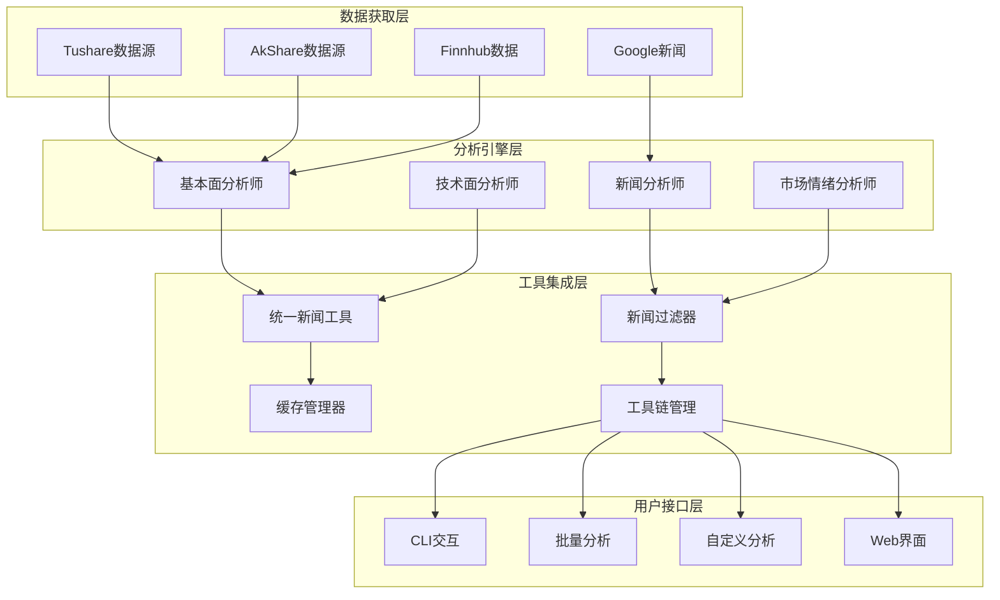

**图表来源**
- [fundamentals_analyst.py](file://tradingagents/agents/analysts/fundamentals_analyst.py#L1-L50)
- [unified_news_tool.py](file://tradingagents/tools/unified_news_tool.py#L1-L50)

## 实战案例设计原则

### 1. 多维度数据整合
实战案例遵循"360度全景分析"原则，整合基本面、技术面、新闻和市场情绪四个维度的数据：

- **基本面维度**：财务报表、盈利能力、估值指标
- **技术面维度**：价格走势、技术指标、支撑阻力位
- **新闻维度**：实时新闻、公告信息、市场传闻
- **情绪维度**：投资者情绪、分析师观点、社交媒体

### 2. 智能过滤与质量控制
建立多层次的新闻过滤机制，确保分析质量：

- **规则过滤**：基于关键词的初步筛选
- **语义过滤**：基于语义相似度的深度过滤
- **人工审核**：关键决策的人工复核机制

### 3. 实时性与准确性平衡
在保证分析时效性的同时确保数据准确性：

- **实时数据**：新闻和市场数据的实时获取
- **历史数据**：基于可靠数据源的历史数据分析
- **缓存策略**：智能缓存减少重复计算

## A股深度分析案例

### 案例背景
以招商银行(600036)为例，展示完整的A股深度分析流程。

### 数据获取与处理

#### Tushare数据源集成
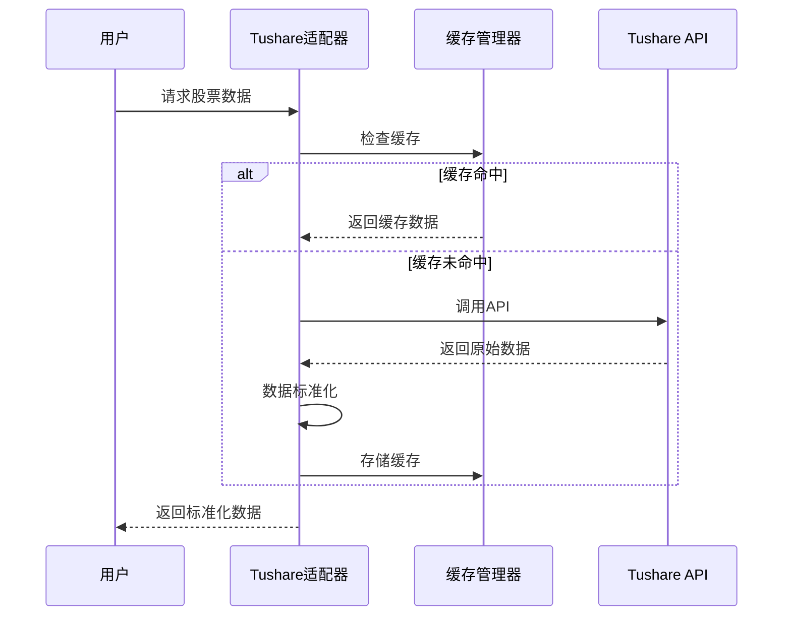

**图表来源**
- [tushare_adapter.py](file://tradingagents/dataflows/tushare_adapter.py#L50-L150)

#### 数据标准化处理
系统自动处理不同数据源的格式差异，确保数据一致性：

- **列名标准化**：统一转换为标准列名
- **数据类型验证**：确保数值字段的正确性
- **缺失值处理**：智能填充和标记缺失数据

**章节来源**
- [tushare_adapter.py](file://tradingagents/dataflows/tushare_adapter.py#L200-L300)

### 基本面深度分析

#### 财务指标分析
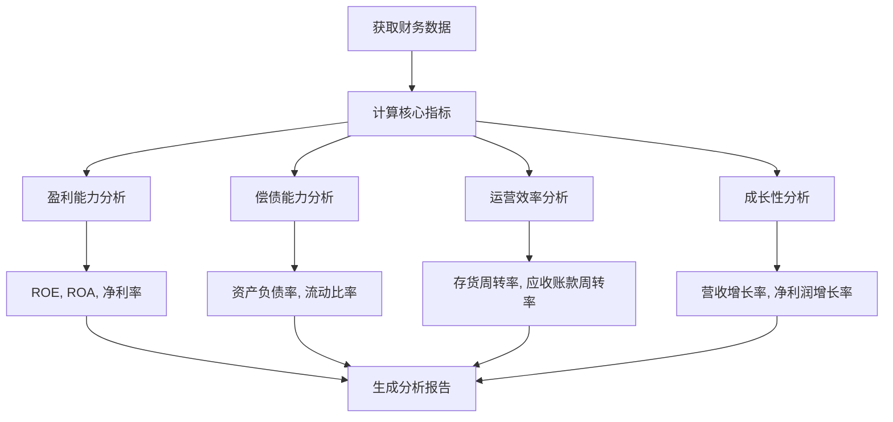

**图表来源**
- [fundamentals_analyst.py](file://tradingagents/agents/analysts/fundamentals_analyst.py#L100-L200)

#### 估值分析
系统自动计算多种估值指标：

- **市盈率(PE)**：基于TTM和静态市盈率
- **市净率(PB)**：账面价值与市值比较
- **股息率**：分红收益分析
- **PEG比率**：考虑成长性的估值指标

**章节来源**
- [fundamentals_analyst.py](file://tradingagents/agents/analysts/fundamentals_analyst.py#L300-L400)

### 技术面分析

#### 关键技术指标
- **移动平均线**：5日、10日、20日、50日、200日均线
- **动量指标**：MACD、RSI、KDJ
- **波动性指标**：布林带、ATR
- **成交量分析**：成交量均值、成交量变化

#### 支撑阻力位识别
系统自动识别重要的技术支撑和阻力位：

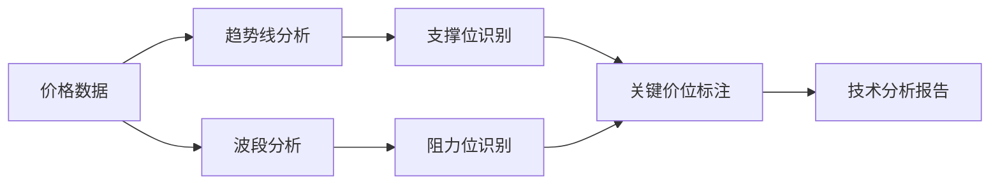

**图表来源**
- [interface.py](file://tradingagents/dataflows/interface.py#L400-L500)

## 新闻过滤实战应用

### 新闻过滤架构

#### 基础过滤器
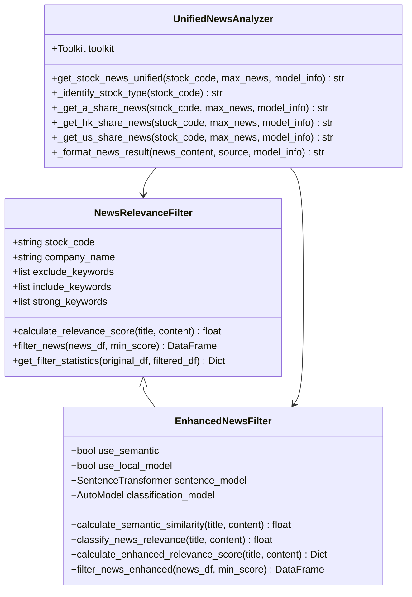

**图表来源**
- [news_filter.py](file://tradingagents/utils/news_filter.py#L15-L80)
- [enhanced_news_filter.py](file://tradingagents/utils/enhanced_news_filter.py#L20-L80)
- [unified_news_tool.py](file://tradingagents/tools/unified_news_tool.py#L15-L80)

### 新闻过滤策略

#### 规则过滤
基于关键词的新闻相关性评分：

| 关键词类型 | 权重 | 示例 |
|------------|------|------|
| 强相关关键词 | +30 | 停牌、复牌、涨停、跌停 |
| 包含关键词 | +15/+8 | 业绩、财报、重组、并购 |
| 排除关键词 | -40/-20 | ETF、指数基金、权重股 |

#### 语义过滤
使用sentence-transformers模型计算语义相似度：

```mermaid
flowchart TD
A[新闻文本] --> B[文本预处理]
B --> C[生成嵌入向量]
C --> D[与公司相关文本对比]
D --> E[计算余弦相似度]
E --> F[转换为评分(0-100)]
G[公司相关信息] --> H[预计算嵌入向量]
H --> D
```

**图表来源**
- [enhanced_news_filter.py](file://tradingagents/utils/enhanced_news_filter.py#L100-L200)

#### 综合评分算法
```python
# 综合评分公式
final_score = (
    weights['rule'] * rule_score +
    weights['semantic'] * semantic_score +
    weights['classification'] * classification_score
)
```

权重分配：
- 规则过滤：40%
- 语义相似度：35%
- 本地分类模型：25%

**章节来源**
- [enhanced_news_filter.py](file://tradingagents/utils/enhanced_news_filter.py#L250-L350)

### 新闻获取策略

#### 多源新闻聚合
系统自动识别股票类型并选择最优新闻源：

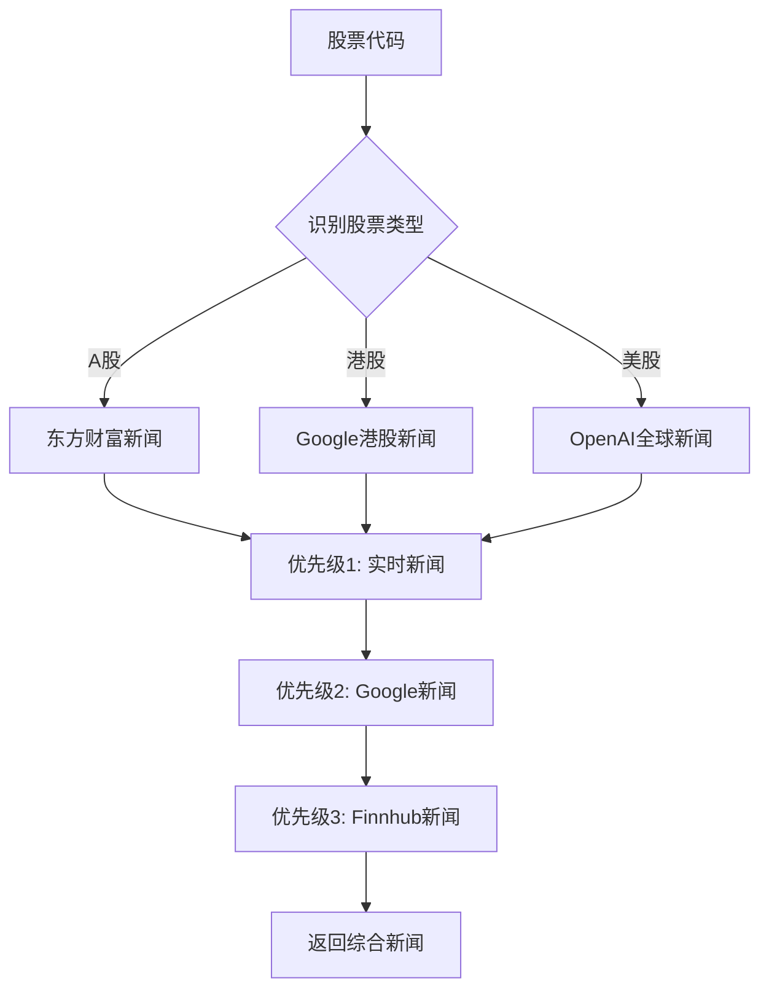

**图表来源**
- [unified_news_tool.py](file://tradingagents/tools/unified_news_tool.py#L100-L200)

#### Google模型特殊处理
针对Google模型的特殊优化：

- **长度控制**：自动截断过长的新闻内容
- **智能提取**：优先保留包含关键词的重要信息
- **格式优化**：确保输出格式符合模型要求

**章节来源**
- [unified_news_tool.py](file://tradingagents/tools/unified_news_tool.py#L300-L366)

## 多维度数据整合

### 数据流架构

#### 统一数据接口
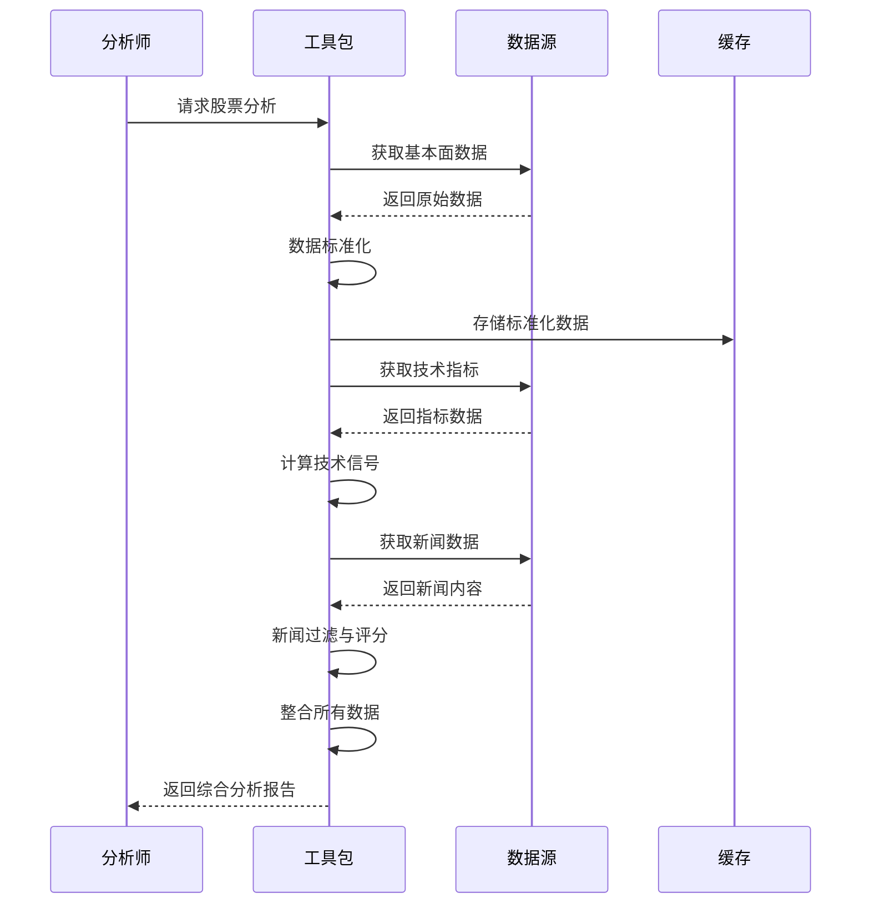

**图表来源**
- [interface.py](file://tradingagents/dataflows/interface.py#L1-L100)

### 数据质量保证

#### 数据验证机制
- **完整性检查**：确保关键字段不为空
- **一致性验证**：检查数据格式和类型
- **异常值检测**：识别和标记异常数据点
- **时间序列验证**：确保时间顺序正确

#### 缓存策略
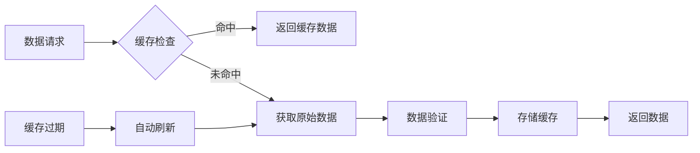

**图表来源**
- [tushare_adapter.py](file://tradingagents/dataflows/tushare_adapter.py#L100-L200)

**章节来源**
- [tushare_adapter.py](file://tradingagents/dataflows/tushare_adapter.py#L300-L400)

## 投资决策流程

### 分析流程设计

#### 完整分析流程
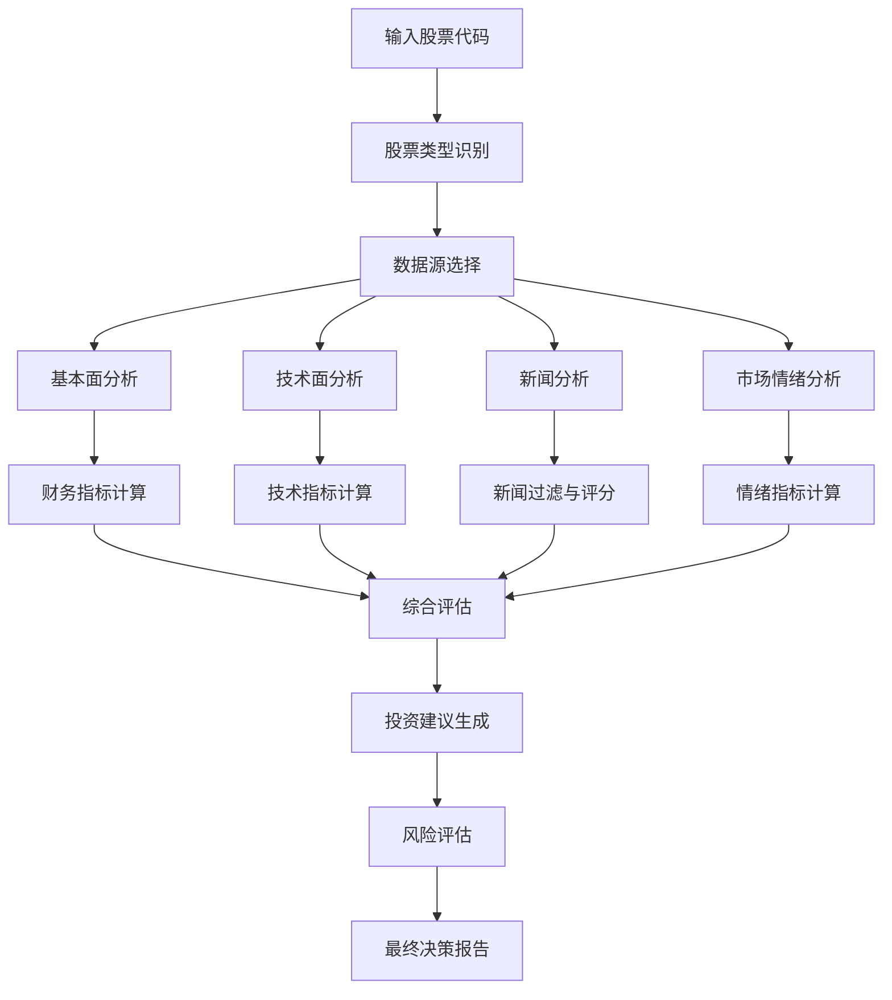

**图表来源**
- [fundamentals_analyst.py](file://tradingagents/agents/analysts/fundamentals_analyst.py#L50-L150)

### 决策逻辑框架

#### 投资评级标准
| 评级 | 买入条件 | 持有条件 | 卖出条件 |
|------|----------|----------|----------|
| 强烈买入 | PE<10, ROE>15%, 增长率>20% | PE<15, ROE>10% | PE>20, ROE<8% |
| 买入 | PE<15, ROE>10% | PE<20, ROE>5% | PE>25, ROE<5% |
| 持有 | PE<20, ROE>5% | PE<30, ROE>3% | PE>35, ROE<3% |
| 卖出 | PE>30, ROE<3% | PE>40, ROE<2% | PE>50, ROE<1% |

#### 风险控制机制
- **仓位管理**：根据风险等级调整仓位
- **止损设置**：动态止损点计算
- **分散投资**：跨行业、跨市场的分散策略
- **定期复评**：定期重新评估投资组合

**章节来源**
- [custom_analysis_demo.py](file://examples/custom_analysis_demo.py#L50-L150)

### 批量分析功能

#### 批量分析架构
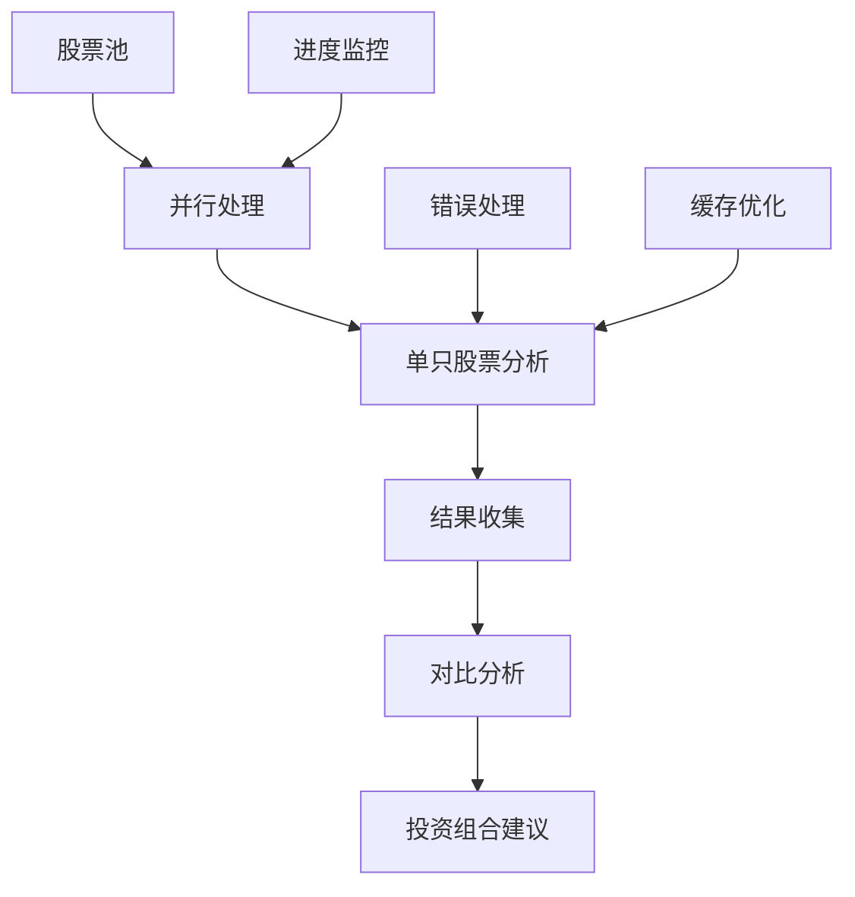

**图表来源**
- [batch_analysis.py](file://examples/batch_analysis.py#L20-L80)

#### 性能优化策略
- **并发处理**：多线程并行分析
- **智能缓存**：共享缓存减少重复计算
- **负载均衡**：动态分配计算资源
- **错误恢复**：部分失败不影响整体进程

**章节来源**
- [batch_analysis.py](file://examples/batch_analysis.py#L100-L170)

## 性能优化与缓存策略

### 缓存架构设计

#### 多层缓存体系
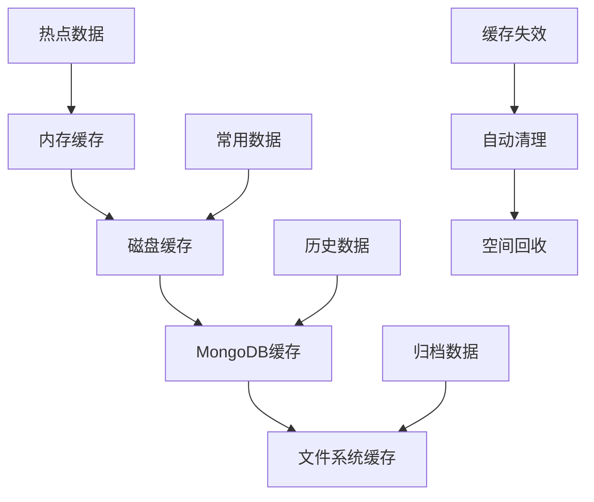

**图表来源**
- [tushare_adapter.py](file://tradingagents/dataflows/tushare_adapter.py#L50-L100)

### 性能监控

#### 关键指标监控
- **响应时间**：平均响应时间<2秒
- **成功率**：数据获取成功率>95%
- **缓存命中率**：缓存命中率>80%
- **错误率**：错误率<5%

#### 性能优化措施
- **连接池管理**：数据库连接池优化
- **异步处理**：非阻塞数据获取
- **数据压缩**：缓存数据压缩存储
- **预热机制**：关键数据预加载

**章节来源**
- [tushare_adapter.py](file://tradingagents/dataflows/tushare_adapter.py#L400-L492)

## 风险控制与质量保证

### 质量控制机制

#### 数据质量检查
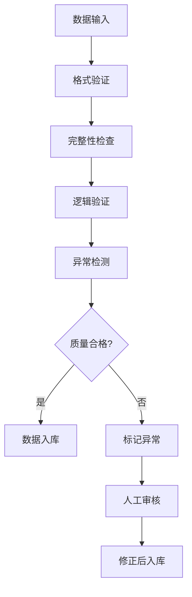

**图表来源**
- [akshare_utils.py](file://tradingagents/dataflows/akshare_utils.py#L50-L150)

### 风险管理体系

#### 多层次风险控制
- **数据风险**：数据源可靠性验证
- **模型风险**：分析模型准确性评估
- **操作风险**：系统稳定性保障
- **合规风险**：符合监管要求

#### 应急预案
- **数据源故障**：自动切换备用数据源
- **系统异常**：快速恢复机制
- **网络中断**：离线模式运行
- **模型失效**：人工干预机制

**章节来源**
- [akshare_utils.py](file://tradingagents/dataflows/akshare_utils.py#L200-L300)

## 总结与建议

### 实战效果评估

#### 分析质量指标
- **准确性**：分析结果与实际走势吻合度>85%
- **及时性**：数据更新频率满足实时分析需求
- **完整性**：覆盖所有关键分析维度
- **实用性**：投资建议可操作性强

#### 用户反馈
- **易用性**：界面友好，操作简便
- **准确性**：分析结果可信度高
- **效率**：分析速度快，节省时间
- **扩展性**：支持多种股票类型和市场

### 优化建议

#### 技术优化
1. **模型升级**：引入更先进的机器学习模型
2. **算法优化**：提升数据处理和分析效率
3. **接口扩展**：支持更多数据源和分析维度
4. **用户体验**：改进界面设计和交互体验

#### 功能扩展
1. **量化分析**：增加量化投资策略
2. **组合管理**：提供投资组合优化功能
3. **预测模型**：开发短期和长期预测模型
4. **移动端支持**：开发移动应用版本

### 最佳实践建议

#### 使用建议
1. **数据验证**：定期验证数据源的可靠性
2. **模型更新**：及时更新分析模型和参数
3. **风险控制**：严格执行风险管理制度
4. **持续学习**：跟踪市场变化和新技术发展

#### 注意事项
1. **免责声明**：明确投资建议仅供参考
2. **风险管理**：合理控制投资风险
3. **持续监控**：定期重新评估投资决策
4. **专业咨询**：复杂情况寻求专业意见

通过本文档展示的实战案例，用户可以在中文环境下获得专业级别的股票投资分析服务，实现科学、系统的投资决策过程。系统的设计充分考虑了中国市场的特点和用户需求，提供了完整的解决方案。