# 示例教程

<cite>
**本文档中引用的文件**   
- [simple_analysis_demo.py](file://examples/simple_analysis_demo.py)
- [my_stock_analysis.py](file://examples/my_stock_analysis.py)
- [batch_analysis.py](file://examples/batch_analysis.py)
- [custom_analysis_demo.py](file://examples/custom_analysis_demo.py)
- [demo_deepseek_analysis.py](file://examples/demo_deepseek_analysis.py)
- [cli_demo.py](file://examples/cli_demo.py)
- [tushare_demo.py](file://examples/tushare_demo.py)
- [stock_query_examples.py](file://examples/stock_query_examples.py)
- [demo_news_filtering.py](file://examples/demo_news_filtering.py)
- [config_management_demo.py](file://examples/config_management_demo.py)
- [data_dir_config_demo.py](file://examples/data_dir_config_demo.py)
- [token_tracking_demo.py](file://examples/token_tracking_demo.py)
- [china_market_analyst.py](file://tradingagents/agents/analysts/china_market_analyst.py)
- [fundamentals_analyst.py](file://tradingagents/agents/analysts/fundamentals_analyst.py)
- [news_analyst.py](file://tradingagents/agents/analysts/news_analyst.py)
</cite>

## 目录

1. [简介](#简介)
2. [基础示例](#基础示例)
3. [高级应用示例](#高级应用示例)
4. [实战案例](#实战案例)
5. [配置管理](#配置管理)
6. [数据源配置](#数据源配置)
7. [性能优化](#性能优化)
8. [故障排除](#故障排除)
9. [结论](#结论)

## 简介

本教程旨在通过一系列实际案例帮助用户掌握交易代理系统（TradingAgents-CN）的使用。系统提供了一个强大的AI驱动的金融分析框架，支持多种大模型提供商，包括DeepSeek、阿里百炼和OpenAI等。通过本教程，用户将学习如何进行单只股票的基本面分析、新闻情绪分析等基础操作，以及投资组合优化、跨市场比较分析等高级应用。每个示例都包含详细的步骤说明、配置参数和预期结果解释，并提供可运行的代码片段和配置文件，方便用户复现。

**本文档中引用的文件**   
- [simple_analysis_demo.py](file://examples/simple_analysis_demo.py)
- [demo_deepseek_analysis.py](file://examples/demo_deepseek_analysis.py)

## 基础示例

### 单只股票基本面分析

本示例演示如何对单只股票进行基本面分析。用户可以通过修改股票代码和分析重点来定制分析内容。

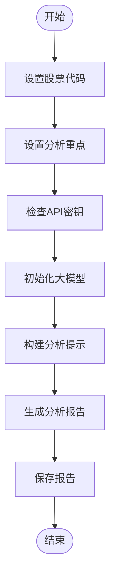

**图示来源**
- [my_stock_analysis.py](file://examples/my_stock_analysis.py#L20-L120)

**本节来源**
- [my_stock_analysis.py](file://examples/my_stock_analysis.py#L20-L120)

### 新闻情绪分析

本示例演示如何进行新闻情绪分析，通过过滤和分析相关新闻来评估市场情绪。

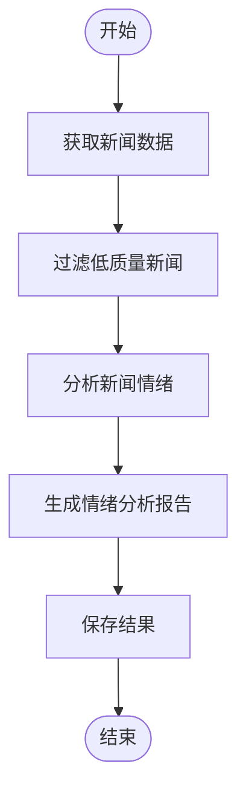

**图示来源**
- [demo_news_filtering.py](file://examples/demo_news_filtering.py#L20-L230)

**本节来源**
- [demo_news_filtering.py](file://examples/demo_news_filtering.py#L20-L230)

## 高级应用示例

### 投资组合优化

本示例演示如何进行投资组合优化，通过批量分析多只股票并生成投资组合建议。

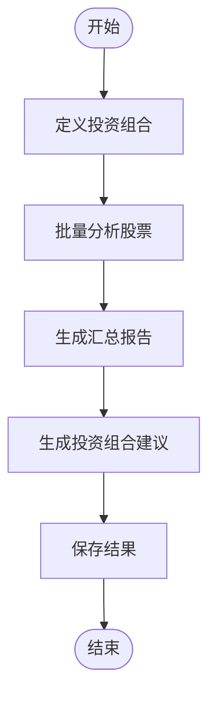

**图示来源**
- [batch_analysis.py](file://examples/batch_analysis.py#L20-L170)

**本节来源**
- [batch_analysis.py](file://examples/batch_analysis.py#L20-L170)

### 跨市场比较分析

本示例演示如何进行跨市场比较分析，对比不同市场的股票表现。

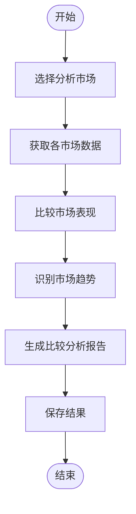

**图示来源**
- [custom_analysis_demo.py](file://examples/custom_analysis_demo.py#L20-L280)

**本节来源**
- [custom_analysis_demo.py](file://examples/custom_analysis_demo.py#L20-L280)

## 实战案例

### 模拟真实投资决策场景

本实战案例模拟一个完整的投资决策流程，从数据获取到最终决策。

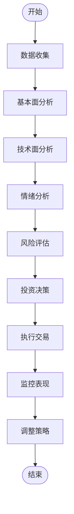

**图示来源**
- [custom_analysis_demo.py](file://examples/custom_analysis_demo.py#L20-L280)
- [batch_analysis.py](file://examples/batch_analysis.py#L20-L170)

**本节来源**
- [custom_analysis_demo.py](file://examples/custom_analysis_demo.py#L20-L280)
- [batch_analysis.py](file://examples/batch_analysis.py#L20-L170)

## 配置管理

### 模型管理

本示例演示如何管理不同大模型的配置。

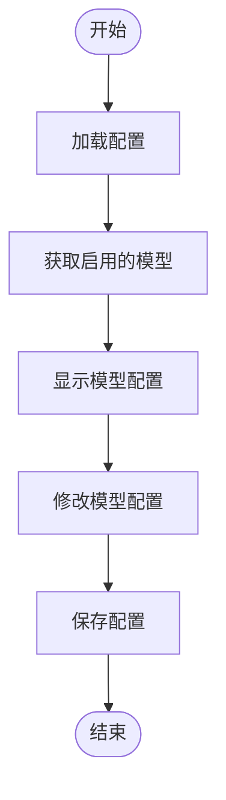

**图示来源**
- [config_management_demo.py](file://examples/config_management_demo.py#L20-L260)

**本节来源**
- [config_management_demo.py](file://examples/config_management_demo.py#L20-L260)

### 成本跟踪

本示例演示如何跟踪API使用成本。

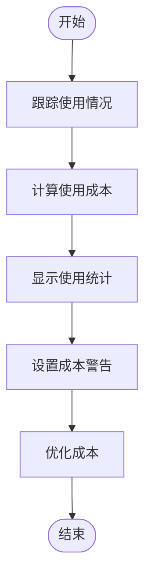

**图示来源**
- [token_tracking_demo.py](file://examples/token_tracking_demo.py#L20-L280)

**本节来源**
- [token_tracking_demo.py](file://examples/token_tracking_demo.py#L20-L280)

## 数据源配置

### Tushare数据源配置

本示例演示如何配置和使用Tushare数据源。

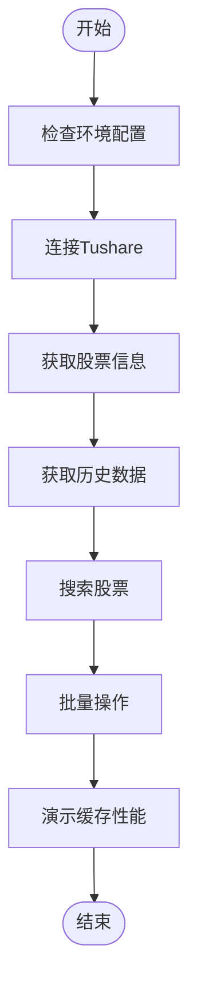

**图示来源**
- [tushare_demo.py](file://examples/tushare_demo.py#L20-L295)

**本节来源**
- [tushare_demo.py](file://examples/tushare_demo.py#L20-L295)

### 股票查询配置

本示例演示如何进行股票查询，包括单个股票查询、股票搜索和市场概览。

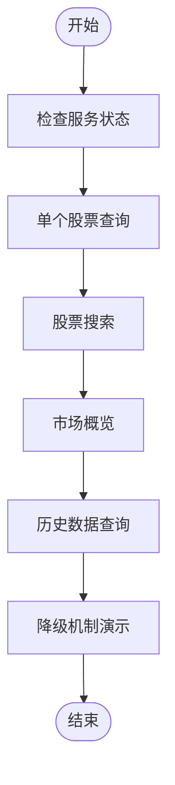

**图示来源**
- [stock_query_examples.py](file://examples/stock_query_examples.py#L20-L250)

**本节来源**
- [stock_query_examples.py](file://examples/stock_query_examples.py#L20-L250)

## 性能优化

### 缓存性能优化

本示例演示如何通过缓存优化系统性能。

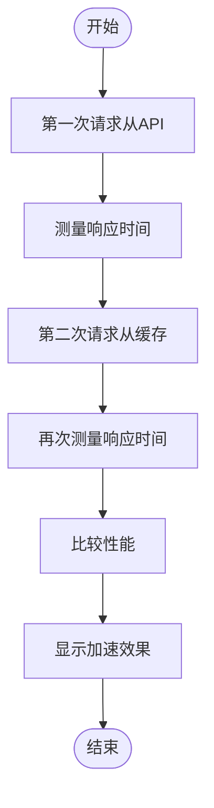

**图示来源**
- [tushare_demo.py](file://examples/tushare_demo.py#L20-L295)

**本节来源**
- [tushare_demo.py](file://examples/tushare_demo.py#L20-L295)

## 故障排除

### 常见问题解决

本节提供常见问题的解决方案。

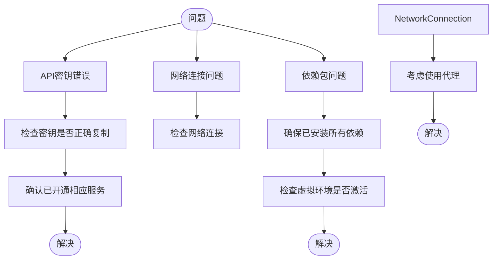

**图示来源**
- [simple_analysis_demo.py](file://examples/simple_analysis_demo.py#L20-L215)

**本节来源**
- [simple_analysis_demo.py](file://examples/simple_analysis_demo.py#L20-L215)

## 结论

本教程通过一系列实际案例，全面介绍了交易代理系统（TradingAgents-CN）的使用方法。从基础的单只股票分析到高级的投资组合优化，再到完整的实战案例，用户可以逐步掌握系统的各项功能。通过合理的配置管理和性能优化，用户可以充分利用系统的强大功能，提高投资分析的效率和准确性。希望本教程能帮助用户更好地使用该系统，实现更智能的投资决策。

**本节来源**
- [simple_analysis_demo.py](file://examples/simple_analysis_demo.py#L20-L215)
- [demo_deepseek_analysis.py](file://examples/demo_deepseek_analysis.py#L20-L300)