# 配置管理示例

<cite>
**本文档引用的文件**
- [config_management_demo.py](file://examples/config_management_demo.py)
- [data_dir_config_demo.py](file://examples/data_dir_config_demo.py)
- [cli_demo.py](file://examples/cli_demo.py)
- [config_manager.py](file://tradingagents/config/config_manager.py)
- [config.py](file://tradingagents/dataflows/config.py)
- [data_source_manager.py](file://tradingagents/dataflows/data_source_manager.py)
- [config_management.py](file://web/modules/config_management.py)
- [logging.toml](file://config/logging.toml)
- [default_config.py](file://tradingagents/default_config.py)
</cite>

## 目录
1. [简介](#简介)
2. [系统架构概览](#系统架构概览)
3. [核心配置文件结构](#核心配置文件结构)
4. [LLM模型配置管理](#llm模型配置管理)
5. [数据源优先级配置](#数据源优先级配置)
6. [缓存策略配置](#缓存策略配置)
7. [自定义数据目录配置](#自定义数据目录配置)
8. [命令行接口配置](#命令行接口配置)
9. [Web界面配置管理](#web界面配置管理)
10. [环境变量配置](#环境变量配置)
11. [多用户部署配置](#多用户部署配置)
12. [故障排除指南](#故障排除指南)
13. [最佳实践建议](#最佳实践建议)

## 简介

TradingAgents-CN是一个基于多智能体大语言模型的金融交易框架，提供了完善的配置管理系统。本指南将详细介绍如何使用各种配置选项来定制系统行为，包括LLM设置、数据源优先级、缓存策略和多环境部署配置。

## 系统架构概览

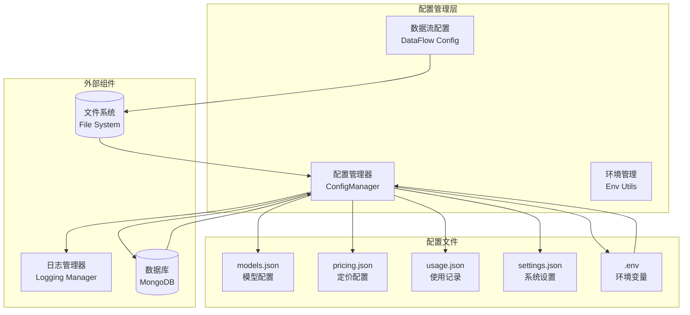

**图表来源**
- [config_manager.py](file://tradingagents/config/config_manager.py#L1-L50)
- [config.py](file://tradingagents/dataflows/config.py#L1-L30)

**章节来源**
- [config_manager.py](file://tradingagents/config/config_manager.py#L1-L100)
- [config.py](file://tradingagents/dataflows/config.py#L1-L79)

## 核心配置文件结构

### 默认配置结构

系统的核心配置采用分层设计，支持多种配置方式：

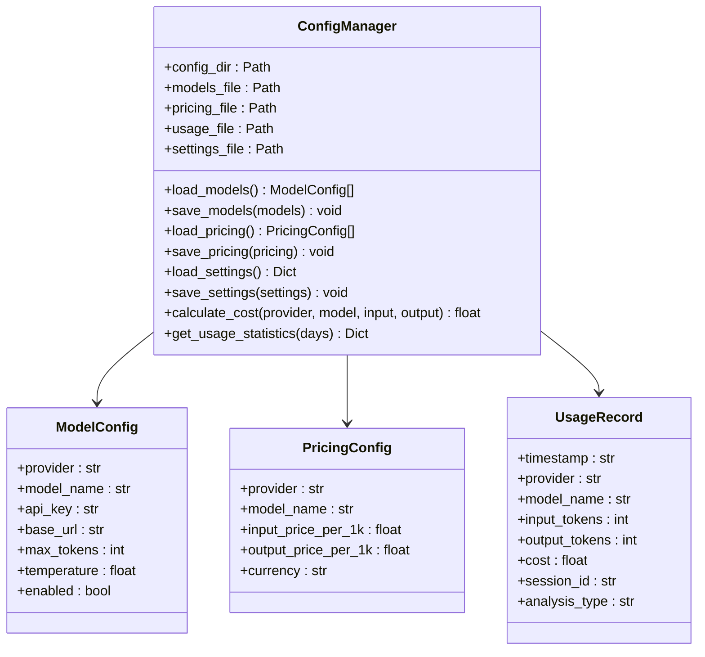

**图表来源**
- [config_manager.py](file://tradingagents/config/config_manager.py#L25-L60)

### 配置文件优先级

系统按照以下优先级顺序加载配置：

1. **环境变量** (`TRADINGAGENTS_*`)
2. **.env文件** (项目根目录)
3. **配置文件** (`config/*.json`)
4. **默认值** (代码中的硬编码值)

**章节来源**
- [config_manager.py](file://tradingagents/config/config_manager.py#L423-L500)

## LLM模型配置管理

### 模型配置示例

以下是完整的LLM模型配置示例：

| 参数 | 描述 | 默认值 | 可选值 |
|------|------|--------|--------|
| provider | 供应商名称 | dashscope | dashscope, openai, google, anthropic |
| model_name | 模型标识符 | qwen-turbo | 具体模型名称 |
| api_key | API密钥 | "" | 有效的API密钥 |
| base_url | 自定义API端点 | null | 自定义URL |
| max_tokens | 最大Token数 | 4000 | 1000-32000 |
| temperature | 温度参数 | 0.7 | 0.0-2.0 |
| enabled | 是否启用 | true | true, false |

### 配置管理功能演示

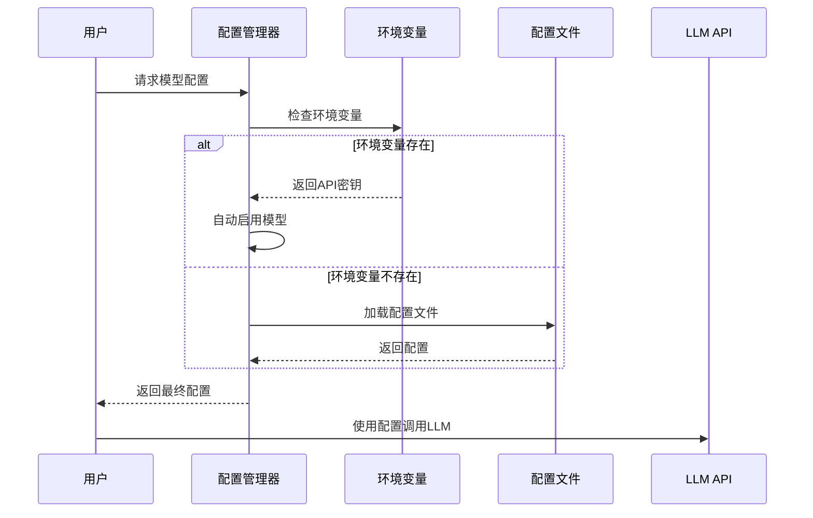

**图表来源**
- [config_manager.py](file://tradingagents/config/config_manager.py#L290-L320)

### 成本计算和跟踪

系统提供精确的成本计算功能：

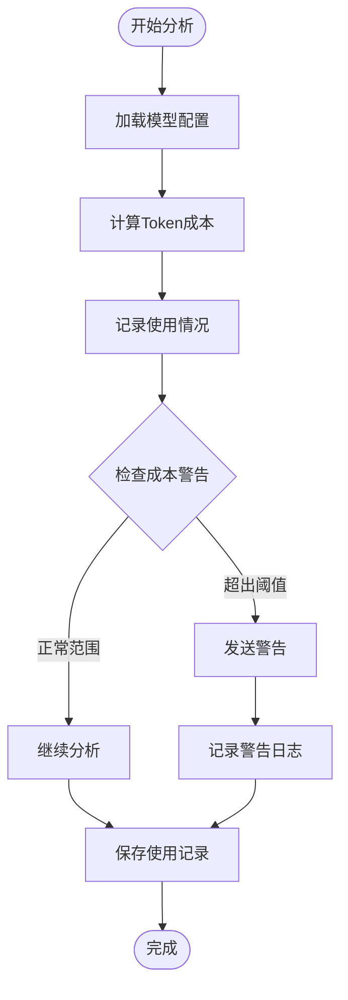

**图表来源**
- [config_manager.py](file://tradingagents/config/config_manager.py#L500-L600)

**章节来源**
- [config_management_demo.py](file://examples/config_management_demo.py#L25-L100)
- [config_manager.py](file://tradingagents/config/config_manager.py#L25-L150)

## 数据源优先级配置

### 中国股票数据源优先级

系统支持多个中国股票数据源，按优先级排序：

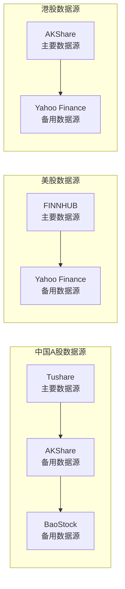

**图表来源**
- [data_source_manager.py](file://tradingagents/dataflows/data_source_manager.py#L1-L50)

### 数据源配置示例

| 市场类型 | 主要数据源 | 备用数据源 | 环境变量 |
|----------|------------|------------|----------|
| 中国A股 | Tushare/AKShare/BaoStock | - | DEFAULT_CHINA_DATA_SOURCE |
| 美股 | FINNHUB | Yahoo Finance | FINNHUB_API_KEY |
| 港股 | AKShare | Yahoo Finance | - |

### 数据源降级机制

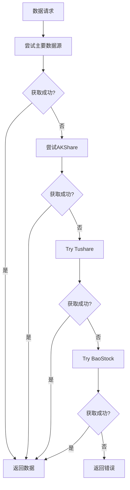

**图表来源**
- [data_source_manager.py](file://tradingagents/dataflows/data_source_manager.py#L700-L800)

**章节来源**
- [data_source_manager.py](file://tradingagents/dataflows/data_source_manager.py#L1-L200)

## 缓存策略配置

### 缓存系统架构

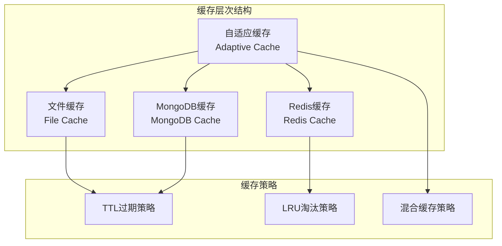

**图表来源**
- [config_manager.py](file://tradingagents/config/config_manager.py#L1-L50)

### 缓存配置参数

| 参数 | 描述 | 默认值 | 范围 |
|------|------|--------|------|
| primary_backend | 主要缓存后端 | mongodb | mongodb, redis, file |
| fallback_enabled | 启用降级缓存 | true | true, false |
| ttl_settings | TTL配置 | 24小时 | 1小时-7天 |
| cache_size_limit | 缓存大小限制 | 1GB | 100MB-10GB |

**章节来源**
- [config_manager.py](file://tradingagents/config/config_manager.py#L1-L100)

## 自定义数据目录配置

### 配置方法对比

系统提供三种配置数据目录的方法：

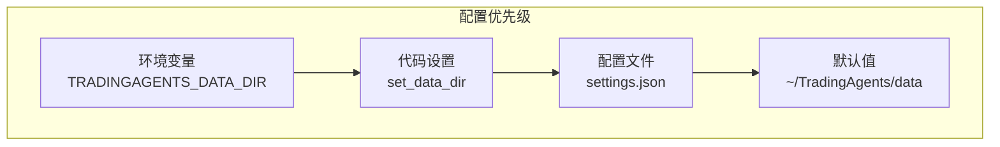

**图表来源**
- [data_dir_config_demo.py](file://examples/data_dir_config_demo.py#L1-L50)

### 目录结构配置

系统自动创建以下目录结构：

```
data_directory/
├── cache/                    # 缓存数据
├── finnhub_data/           # FINNHUB数据
│   ├── news_data/          # 新闻数据
│   ├── insider_sentiment/  # 内幕情绪
│   └── insider_transactions/ # 内幕交易
├── tushare_data/           # Tushare数据
├── akshare_data/           # AKShare数据
└── logs/                   # 日志文件
```

### 环境变量配置示例

```bash
# Windows PowerShell
$env:TRADINGAGENTS_DATA_DIR="C:\TradingAgents\data"
$env:TRADINGAGENTS_CACHE_DIR="C:\TradingAgents\cache"
$env:TRADINGAGENTS_RESULTS_DIR="C:\TradingAgents\results"

# Linux/macOS
export TRADINGAGENTS_DATA_DIR="/home/user/TradingAgents/data"
export TRADINGAGENTS_CACHE_DIR="/home/user/TradingAgents/cache"
export TRADINGAGENTS_RESULTS_DIR="/home/user/TradingAgents/results"
```

**章节来源**
- [data_dir_config_demo.py](file://examples/data_dir_config_demo.py#L50-L150)
- [config.py](file://tradingagents/dataflows/config.py#L1-L79)

## 命令行接口配置

### CLI配置管理

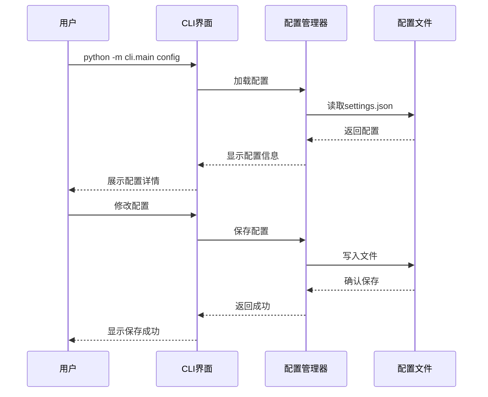

**图表来源**
- [cli_demo.py](file://examples/cli_demo.py#L1-L50)

### 常用CLI命令

| 命令 | 功能 | 示例 |
|------|------|------|
| `python -m cli.main --help` | 显示帮助信息 | `--help` |
| `python -m cli.main config` | 显示配置信息 | `config` |
| `python -m cli.main version` | 显示版本信息 | `version` |
| `python -m cli.main test` | 运行测试 | `test` |
| `python -m cli.main analyze` | 开始分析 | `analyze` |

### CLI配置示例

```bash
# 启动CLI并查看配置
python -m cli.main config

# 运行系统测试
python -m cli.main test

# 开始股票分析
python -m cli.main analyze --ticker AAPL --market us
```

**章节来源**
- [cli_demo.py](file://examples/cli_demo.py#L1-L83)

## Web界面配置管理

### Web配置界面功能

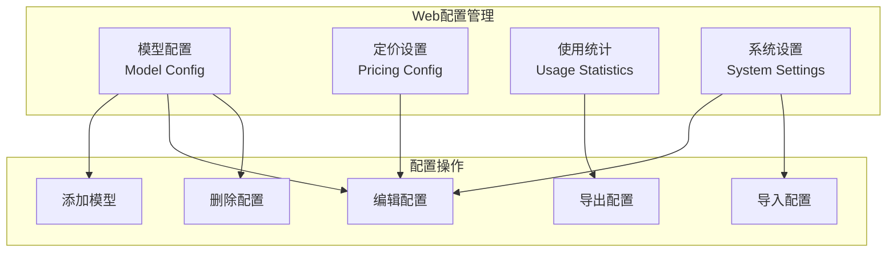

**图表来源**
- [config_management.py](file://web/modules/config_management.py#L1-L50)

### Web配置管理功能

| 功能模块 | 描述 | 主要操作 |
|----------|------|----------|
| 模型配置 | 管理LLM模型设置 | 添加、编辑、删除模型 |
| 定价设置 | 配置Token定价 | 设置输入/输出价格 |
| 使用统计 | 查看使用情况 | 统计分析、趋势图表 |
| 系统设置 | 全局系统配置 | 默认设置、警告阈值 |

### Web配置界面截图

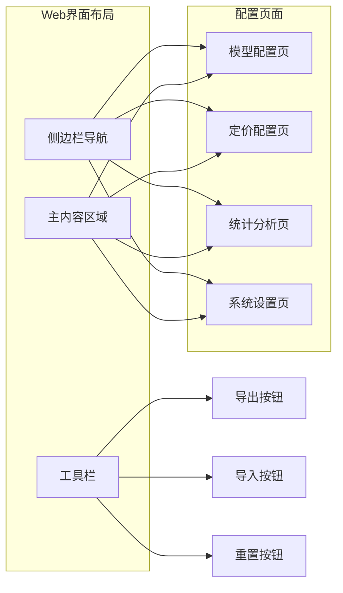

**图表来源**
- [config_management.py](file://web/modules/config_management.py#L20-L100)

**章节来源**
- [config_management.py](file://web/modules/config_management.py#L1-L200)

## 环境变量配置

### 关键环境变量

| 变量名 | 描述 | 示例值 |
|--------|------|--------|
| DASHSCOPE_API_KEY | 阿里百炼API密钥 | sk-xxx |
| OPENAI_API_KEY | OpenAI API密钥 | sk-xxx |
| GOOGLE_API_KEY | Google API密钥 | xxx |
| FINNHUB_API_KEY | FINNHUB金融数据API | xxx |
| REDDIT_CLIENT_ID | Reddit客户端ID | xxx |
| REDDIT_CLIENT_SECRET | Reddit客户端密钥 | xxx |
| TRADINGAGENTS_DATA_DIR | 数据目录路径 | ~/data |
| TRADINGAGENTS_CACHE_DIR | 缓存目录路径 | ~/cache |
| TRADINGAGENTS_RESULTS_DIR | 结果目录路径 | ~/results |

### 环境变量优先级

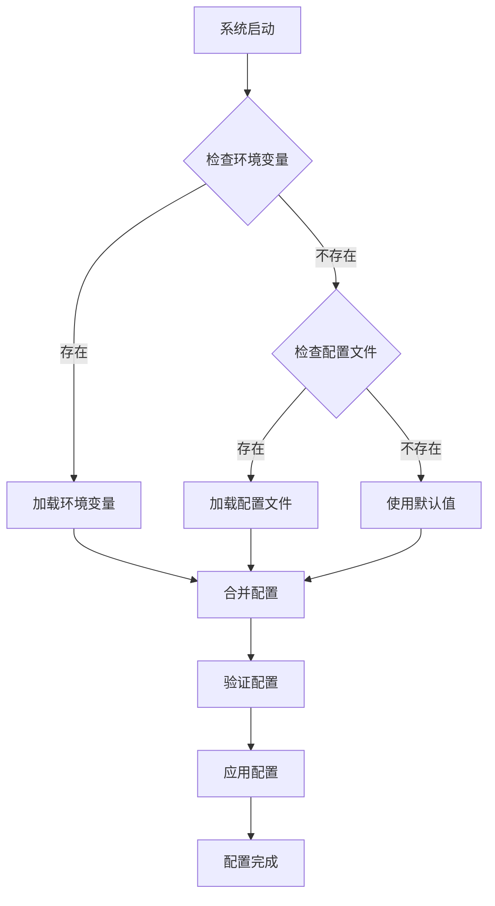

**图表来源**
- [config_manager.py](file://tradingagents/config/config_manager.py#L423-L500)

### 环境变量配置示例

```bash
# .env文件配置示例
# LLM API配置
DASHSCOPE_API_KEY=sk-xxxxxxxxxxxxxxxxxxxxxxxxxxxxxxxx
OPENAI_API_KEY=sk-xxxxxxxxxxxxxxxxxxxxxxxxxxxxxxxx
GOOGLE_API_KEY=xxxxxxxxxxxxxxxxxxxxxxxxxxxxxxxx

# 数据源配置
FINNHUB_API_KEY=xxxxxxxxxxxxxxxxxxxxxxxxxxxxxxxx
DEFAULT_CHINA_DATA_SOURCE=akshare

# 目录配置
TRADINGAGENTS_DATA_DIR=./trading_data
TRADINGAGENTS_CACHE_DIR=./cache
TRADINGAGENTS_RESULTS_DIR=./results

# 功能开关
ONLINE_TOOLS_ENABLED=true
ONLINE_NEWS_ENABLED=true
REALTIME_DATA_ENABLED=false

# 日志配置
TRADINGAGENTS_LOG_LEVEL=INFO
```

**章节来源**
- [config_manager.py](file://tradingagents/config/config_manager.py#L423-L550)

## 多用户部署配置

### 多用户配置策略

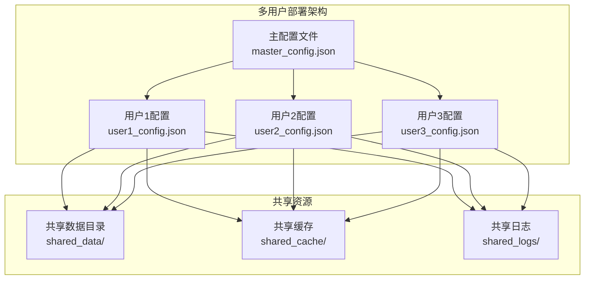

**图表来源**
- [config_manager.py](file://tradingagents/config/config_manager.py#L1-L50)

### 多环境配置管理

| 环境类型 | 配置特点 | 适用场景 |
|----------|----------|----------|
| 开发环境 | 离线模式，使用缓存数据 | 开发调试 |
| 测试环境 | 部分在线，平衡功能和成本 | 功能测试 |
| 生产环境 | 完全在线，实时数据 | 实盘交易 |

### 配置隔离策略

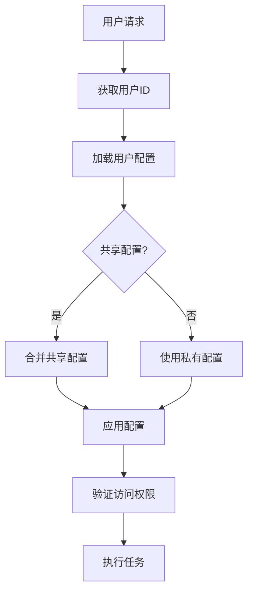

**图表来源**
- [config_manager.py](file://tradingagents/config/config_manager.py#L600-L700)

**章节来源**
- [config_manager.py](file://tradingagents/config/config_manager.py#L600-L727)

## 故障排除指南

### 常见配置问题

| 问题类型 | 症状 | 解决方案 |
|----------|------|----------|
| API密钥错误 | 模型无法使用 | 检查.env文件中的API密钥格式 |
| 目录权限问题 | 数据保存失败 | 确保数据目录有写入权限 |
| 网络连接问题 | 数据源无法访问 | 检查网络连接和防火墙设置 |
| 配置文件损坏 | 系统启动失败 | 备份并重置配置文件 |

### 配置验证流程

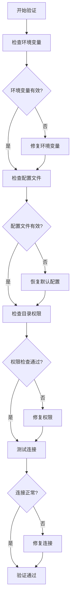

**图表来源**
- [config_manager.py](file://tradingagents/config/config_manager.py#L100-L200)

### 调试配置问题

```bash
# 检查配置状态
python -c "from tradingagents.config.config_manager import config_manager; print(config_manager.get_env_config_status())"

# 验证API密钥
python -c "from tradingagents.config.config_manager import config_manager; print(config_manager.get_openai_config_status())"

# 检查目录权限
python -c "from tradingagents.dataflows.config import get_data_dir; print(get_data_dir())"

# 测试数据源
python -c "from tradingagents.dataflows.data_source_manager import get_data_source_manager; ds = get_data_source_manager(); print(ds.available_sources)"
```

**章节来源**
- [config_manager.py](file://tradingagents/config/config_manager.py#L100-L200)

## 最佳实践建议

### 配置管理最佳实践

1. **安全性**
   - 使用环境变量存储敏感信息
   - 定期轮换API密钥
   - 限制配置文件的访问权限

2. **性能优化**
   - 合理设置缓存策略
   - 选择合适的数据源优先级
   - 监控成本使用情况

3. **维护性**
   - 定期备份配置文件
   - 使用版本控制管理配置
   - 文档化配置变更

### 配置模板

```json
{
    "default_provider": "dashscope",
    "default_model": "qwen-plus-latest",
    "enable_cost_tracking": true,
    "cost_alert_threshold": 100.0,
    "currency_preference": "CNY",
    "auto_save_usage": true,
    "max_usage_records": 10000,
    "data_dir": "~/TradingAgents/data",
    "cache_dir": "~/TradingAgents/cache",
    "results_dir": "~/TradingAgents/results",
    "auto_create_dirs": true,
    "openai_enabled": false
}
```

### 监控和告警

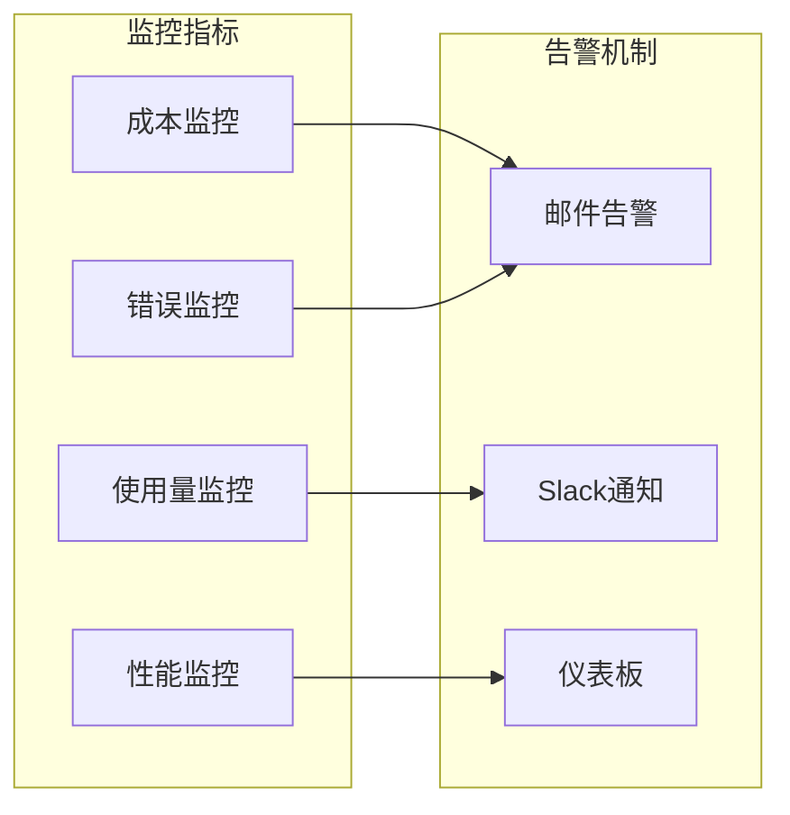

**图表来源**
- [config_manager.py](file://tradingagents/config/config_manager.py#L700-L727)

通过遵循这些配置管理最佳实践，您可以确保TradingAgents-CN系统稳定、高效地运行，并根据您的具体需求进行灵活定制。