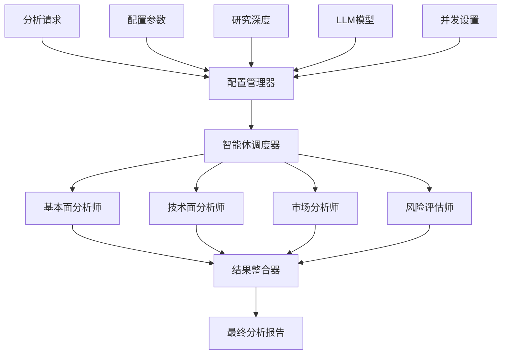
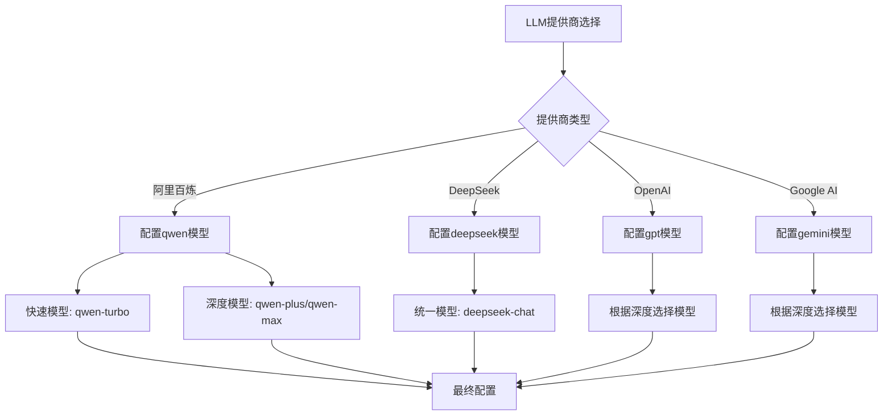
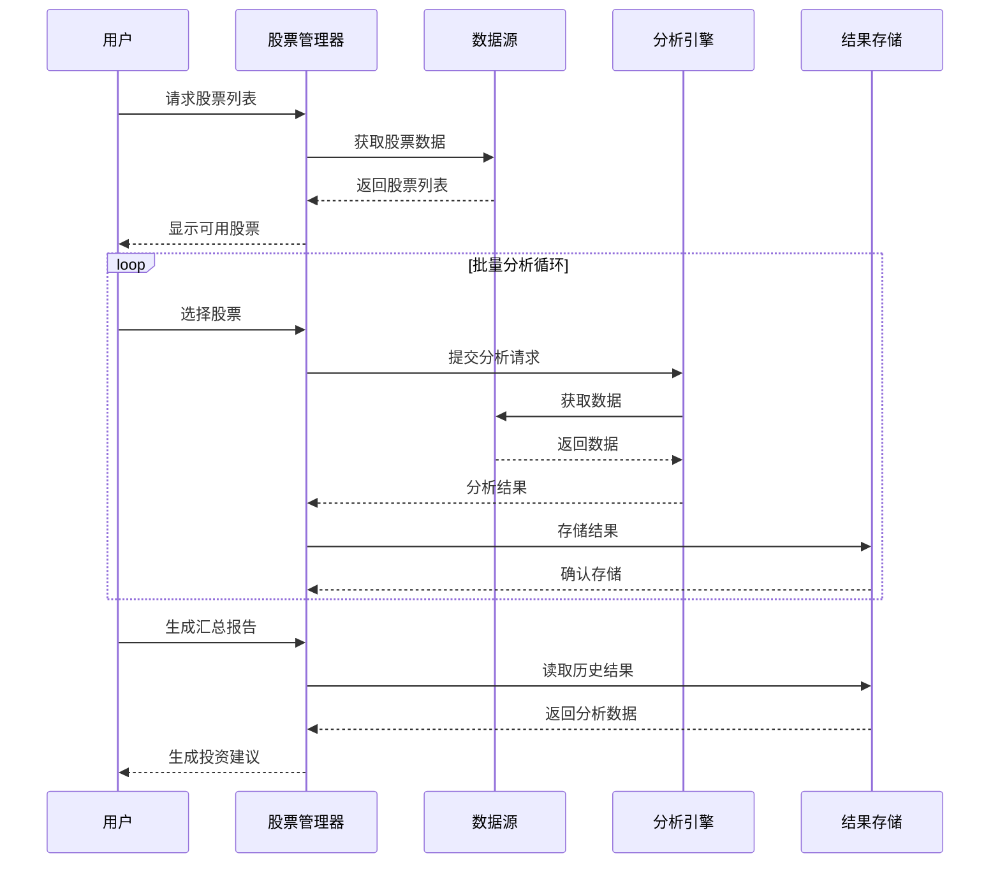
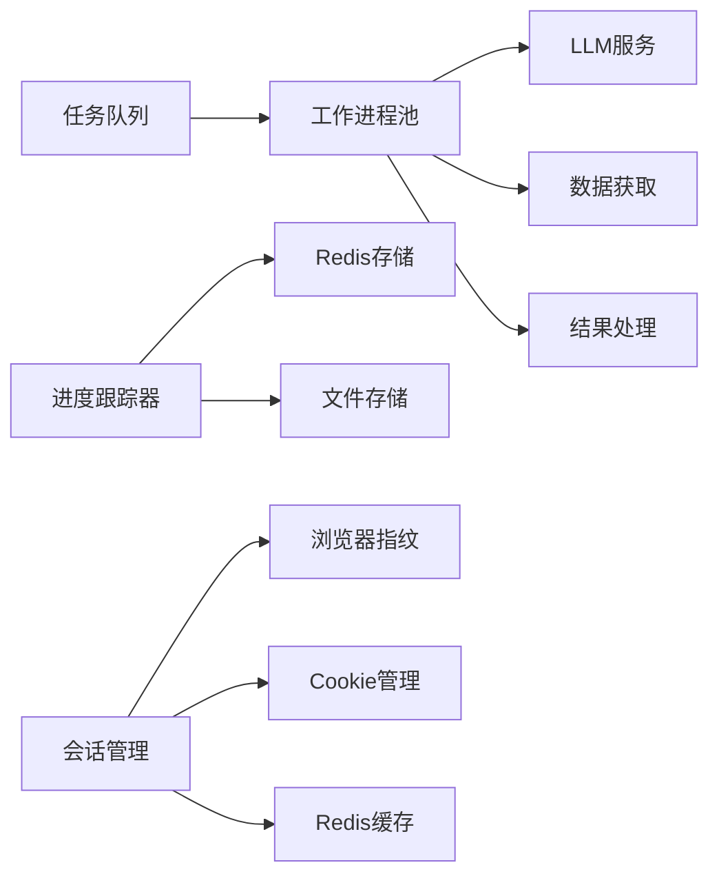
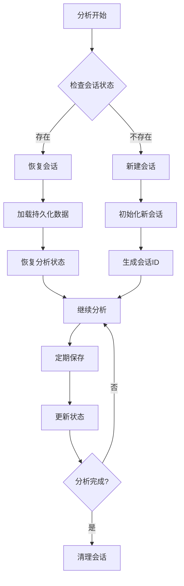
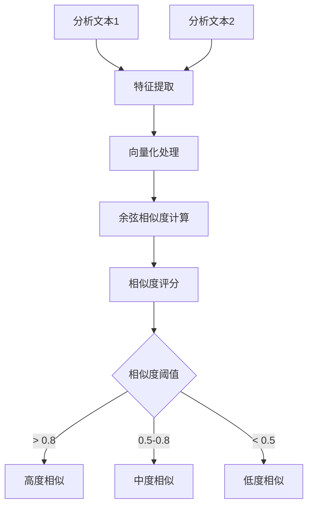
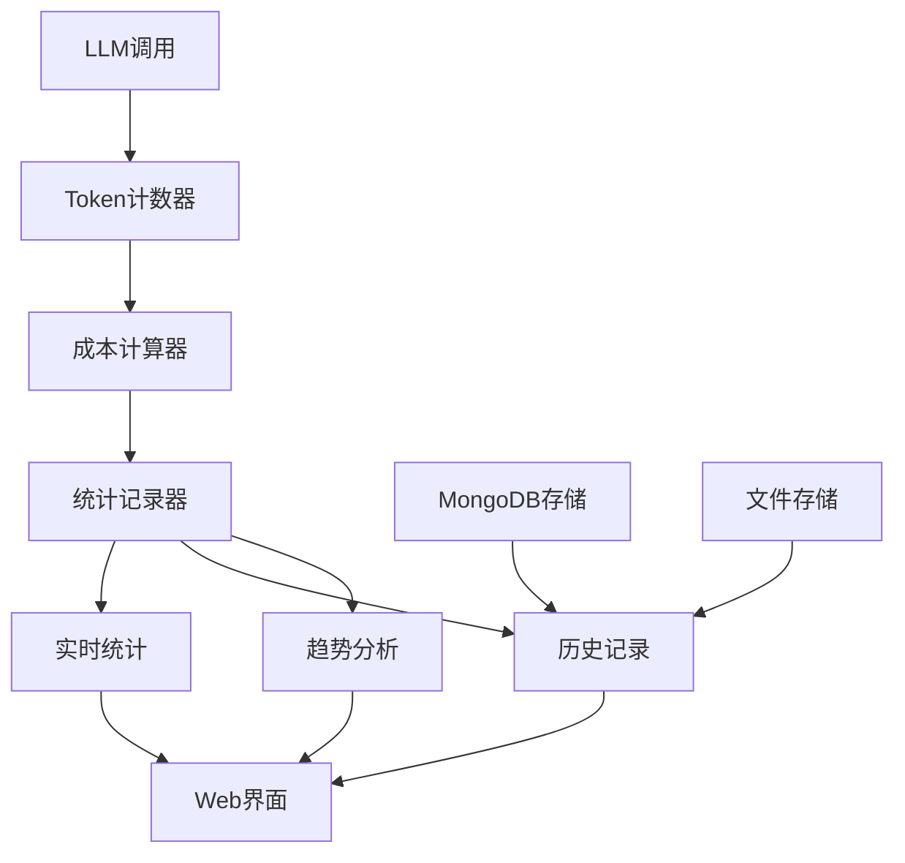
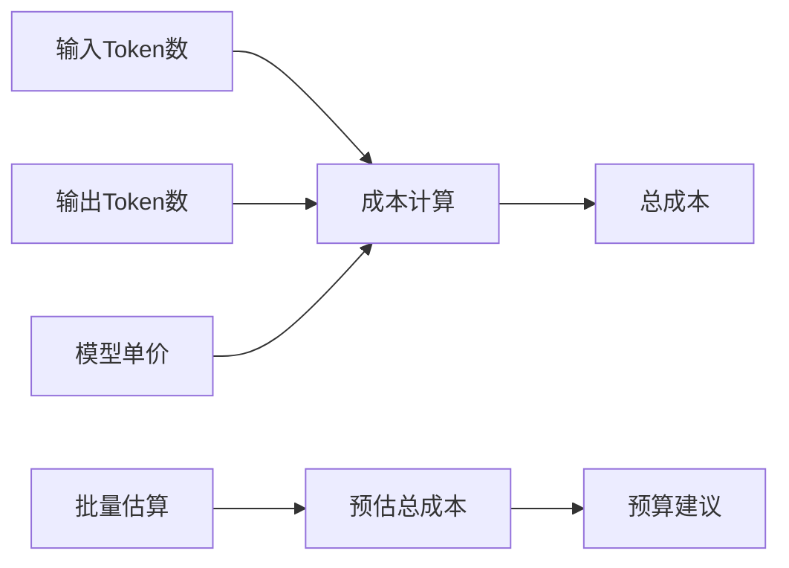
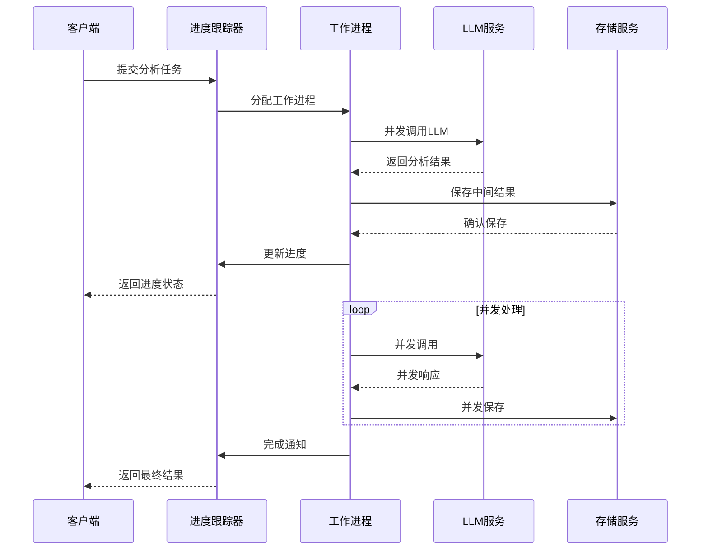
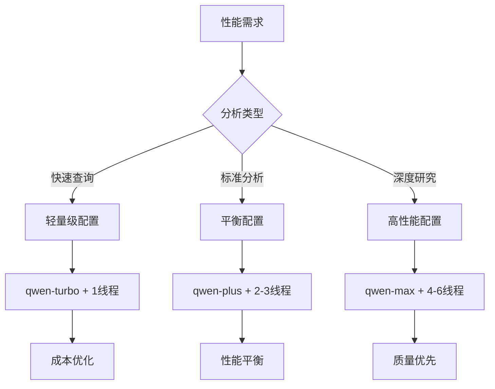

# 高级应用

<cite>
**本文档引用的文件**
- [custom_analysis_demo.py](file://examples/custom_analysis_demo.py)
- [batch_analysis.py](file://examples/batch_analysis.py)
- [enhanced_history_demo.py](file://examples/enhanced_history_demo.py)
- [token_tracking_demo.py](file://examples/token_tracking_demo.py)
- [stock_list_example.py](file://examples/stock_list_example.py)
- [config_management_demo.py](file://examples/config_management_demo.py)
- [my_stock_analysis.py](file://examples/my_stock_analysis.py)
- [simple_analysis_demo.py](file://examples/simple_analysis_demo.py)
- [analysis_runner.py](file://web/utils/analysis_runner.py)
- [async_progress_tracker.py](file://web/utils/async_progress_tracker.py)
- [session_persistence.py](file://web/utils/session_persistence.py)
- [token_statistics.py](file://web/modules/token_statistics.py)
</cite>

## 目录
1. [简介](#简介)
2. [自定义分析流程配置](#自定义分析流程配置)
3. [批量股票分析实现](#批量股票分析实现)
4. [增强历史记录功能](#增强历史记录功能)
5. [LLM调用Token消耗跟踪](#llm调用token消耗跟踪)
6. [性能优化与并发处理](#性能优化与并发处理)
7. [最佳实践与配置建议](#最佳实践与配置建议)
8. [总结](#总结)

## 简介

TradingAgents-CN提供了强大的高级功能，支持复杂的使用场景和企业级应用需求。本指南详细展示了如何配置和使用这些高级功能，包括多智能体协作、批量分析、历史记录追踪和成本控制等核心特性。

## 自定义分析流程配置

### 多智能体协作参数调整

系统支持灵活的多智能体协作配置，可以根据分析需求调整不同智能体的角色和参数。

**图表来源**
- [analysis_runner.py](file://web/utils/analysis_runner.py#L250-L300)

#### 研究深度级别配置

系统提供五个研究深度级别，每个级别对应不同的智能体配置：

| 深度级别 | 分析师数量 | 辩论轮次 | 内存启用 | 在线工具 | 推荐场景 |
|---------|-----------|----------|----------|----------|----------|
| 1级 - 快速分析 | 1-2个 | 0 | 否 | 否 | 日常监控 |
| 2级 - 基础分析 | 2-3个 | 1 | 是 | 否 | 常规投资 |
| 3级 - 标准分析 | 3-4个 | 1 | 是 | 是 | 重要决策 |
| 4级 - 深度分析 | 4-5个 | 2 | 是 | 是 | 重大投资 |
| 5级 - 全面分析 | 5-6个 | 3 | 是 | 是 | 最重要决策 |

#### LLM模型参数优化

不同提供商的模型配置策略：

**图表来源**
- [analysis_runner.py](file://web/utils/analysis_runner.py#L280-L350)

**章节来源**
- [analysis_runner.py](file://web/utils/analysis_runner.py#L250-L450)

### 分析深度控制

分析深度控制通过配置参数精确调节分析的详细程度和计算资源消耗：

#### 基础配置参数

- **max_debate_rounds**: 控制辩论轮次，影响分析深度
- **max_risk_discuss_rounds**: 风险讨论轮次设置
- **memory_enabled**: 是否启用记忆功能
- **online_tools**: 是否使用在线工具

#### 模型选择策略

不同深度级别的模型选择遵循以下原则：
- **快速分析**: 使用轻量级模型，优先考虑响应速度
- **标准分析**: 平衡质量和速度，使用中等复杂度模型
- **深度分析**: 使用高质量模型，牺牲部分速度换取准确性

**章节来源**
- [analysis_runner.py](file://web/utils/analysis_runner.py#L250-L350)

## 批量股票分析实现

### 股票列表管理

系统支持多种股票列表管理方式，包括预定义组合、自定义列表和动态筛选。

**图表来源**
- [batch_analysis.py](file://examples/batch_analysis.py#L20-L80)

#### 预定义股票组合

系统内置多种股票组合模板：

| 组合类型 | 股票代码示例 | 适用场景 | 分析重点 |
|---------|-------------|----------|----------|
| 科技股 | AAPL, MSFT, GOOGL, AMZN | 科技行业分析 | 技术创新、市场份额 |
| AI芯片 | NVDA, AMD, INTC | 半导体行业 | 技术壁垒、产能 |
| 电动车 | TSLA, BYD, NIO | 新能源汽车 | 市场渗透率、盈利能力 |
| ETF基金 | SPY, QQQ, VTI | 资产配置 | 跟踪误差、费用比率 |

### 并发处理机制

系统采用多种并发处理策略优化批量分析性能：

#### 异步处理架构

**图表来源**
- [async_progress_tracker.py](file://web/utils/async_progress_tracker.py#L50-L150)

#### 并发控制策略

- **线程池管理**: 动态调整并发线程数量
- **API限流**: 避免超出服务提供商的速率限制
- **资源监控**: 实时监控系统资源使用情况
- **错误恢复**: 自动重试和降级处理

### 结果汇总与分析

批量分析完成后，系统自动生成综合报告：

#### 汇总报告生成流程

1. **数据聚合**: 收集所有股票的分析结果
2. **相似度分析**: 识别相似的分析模式
3. **投资建议生成**: 基于整体市场观点提供组合建议
4. **风险评估**: 综合评估投资组合风险

**章节来源**
- [batch_analysis.py](file://examples/batch_analysis.py#L20-L170)

## 增强历史记录功能

### 会话持久化

系统提供多层次的会话持久化机制，确保分析过程的连续性和可追溯性。

**图表来源**
- [session_persistence.py](file://web/utils/session_persistence.py#L149-L182)

#### 多层持久化策略

1. **浏览器会话存储**: 基于Streamlit session_state
2. **文件系统存储**: 基于浏览器指纹的本地文件
3. **Redis分布式存储**: 高性能的内存存储
4. **MongoDB持久化**: 可选的数据库存储

#### 会话恢复机制

系统按照以下优先级恢复会话：

1. **Session State**: 最高优先级，内存中存储
2. **Cookie存储**: 中等优先级，浏览器本地存储
3. **文件存储**: 低优先级，本地文件系统
4. **Redis存储**: 高优先级，分布式缓存
5. **MongoDB存储**: 最低优先级，数据库存储

### 分析过程追溯

系统提供完整的分析过程追溯功能，支持：

#### 追溯功能特性

- **步骤记录**: 详细记录每个分析步骤
- **时间戳追踪**: 精确到毫秒的时间记录
- **状态快照**: 关键节点的状态保存
- **错误恢复**: 异常中断后的状态恢复

#### 文本相似度分析

系统内置文本相似度计算功能，用于：

**图表来源**
- [enhanced_history_demo.py](file://examples/enhanced_history_demo.py#L50-L100)

**章节来源**
- [session_persistence.py](file://web/utils/session_persistence.py#L47-L182)
- [enhanced_history_demo.py](file://examples/enhanced_history_demo.py#L20-L150)

## LLM调用Token消耗跟踪

### Token使用统计

系统提供全面的Token使用统计和成本跟踪功能。

**图表来源**
- [token_statistics.py](file://web/modules/token_statistics.py#L50-L150)

#### 成本跟踪功能

系统支持多种成本跟踪维度：

| 跟踪维度 | 统计指标 | 可视化方式 |
|---------|----------|------------|
| 时间范围 | 今日、本周、本月、自定义 | 折线图、柱状图 |
| 供应商 | 各LLM提供商成本 | 饼图、对比表 |
| 模型 | 不同模型使用成本 | 热力图 |
| 会话 | 单次分析成本 | 散点图 |

#### 成本估算算法

系统提供精确的成本估算功能：

**图表来源**
- [token_tracking_demo.py](file://examples/token_tracking_demo.py#L150-L200)

### 成本优化策略

#### 模型选择优化

不同场景下的模型成本对比：

| 场景类型 | 推荐模型 | 预估成本 | 性能评分 |
|---------|----------|----------|----------|
| 快速查询 | qwen-turbo | ¥0.01-0.03 | 95/100 |
| 标准分析 | qwen-plus | ¥0.05-0.10 | 98/100 |
| 深度研究 | qwen-max | ¥0.15-0.25 | 100/100 |

#### 成本控制配置

系统提供多层次的成本控制：

1. **全局阈值**: 设置每日/每月成本上限
2. **会话限制**: 单次分析的成本限制
3. **模型配额**: 不同模型的使用配额
4. **自动降级**: 超出预算时自动切换模型

**章节来源**
- [token_tracking_demo.py](file://examples/token_tracking_demo.py#L50-L284)
- [token_statistics.py](file://web/modules/token_statistics.py#L100-L300)

## 性能优化与并发处理

### 并发处理架构

系统采用异步并发处理架构，支持大规模批量分析。

**图表来源**
- [async_progress_tracker.py](file://web/utils/async_progress_tracker.py#L100-L200)

#### 性能优化策略

1. **连接池管理**: 复用HTTP连接，减少建立开销
2. **请求批处理**: 合并小请求，提高传输效率
3. **缓存策略**: 智能缓存频繁访问的数据
4. **负载均衡**: 分散请求到多个服务节点

### Redis性能优化

系统支持Redis作为高性能的缓存和存储解决方案：

#### Redis配置优化

- **连接池大小**: 根据并发需求调整
- **过期策略**: 自动清理过期数据
- **内存优化**: 使用压缩算法减少内存占用
- **持久化配置**: 平衡性能和数据安全

#### 性能监控指标

| 监控指标 | 正常范围 | 警告阈值 | 优化建议 |
|---------|----------|----------|----------|
| 连接数 | < 1000 | > 2000 | 增加连接池大小 |
| 响应时间 | < 10ms | > 50ms | 优化查询语句 |
| 内存使用率 | < 70% | > 85% | 清理过期数据 |
| 错误率 | < 0.1% | > 1% | 检查网络连接 |

**章节来源**
- [async_progress_tracker.py](file://web/utils/async_progress_tracker.py#L150-L250)

## 最佳实践与配置建议

### 配置管理最佳实践

#### 环境配置

1. **API密钥管理**: 使用环境变量存储敏感信息
2. **配置文件组织**: 按功能模块分离配置文件
3. **版本控制**: 配置变更纳入版本控制
4. **安全审计**: 定期检查配置安全性

#### 性能调优配置

### 成本控制策略

#### 预算管理

1. **月度预算**: 设置每月LLM调用预算
2. **项目限额**: 为不同项目设置独立限额
3. **实时监控**: 实时跟踪成本使用情况
4. **自动告警**: 超出阈值时发送告警

#### 优化建议

- **模型选择**: 根据分析质量要求选择合适模型
- **批量处理**: 将多个小请求合并为批量请求
- **缓存利用**: 充分利用缓存减少重复调用
- **时间安排**: 避开高峰时段使用服务

### 安全与合规

#### 数据保护

1. **敏感信息过滤**: 自动识别和过滤敏感数据
2. **访问控制**: 实施细粒度的访问权限控制
3. **审计日志**: 记录所有关键操作
4. **数据加密**: 传输和存储数据加密

#### 合规要求

- **隐私保护**: 符合GDPR等隐私法规要求
- **数据保留**: 按规定期限保留分析记录
- **用户同意**: 获取用户明确的使用同意
- **透明度**: 向用户披露数据使用方式

**章节来源**
- [config_management_demo.py](file://examples/config_management_demo.py#L50-L258)

## 总结

TradingAgents-CN的高级功能为用户提供了企业级的投资分析能力。通过合理配置多智能体协作参数、实施高效的批量分析策略、利用增强的历史记录功能和严格的Token消耗跟踪，用户可以构建高效、可靠、成本可控的投资分析系统。

关键成功要素包括：

1. **灵活的配置管理**: 支持多种配置策略和参数调整
2. **强大的并发处理**: 高效的批量分析和异步处理能力
3. **完善的成本控制**: 全面的Token统计和成本优化功能
4. **可靠的持久化**: 多层次的会话和数据持久化机制
5. **优秀的用户体验**: 直观的Web界面和详细的进度反馈

通过遵循本指南的最佳实践和配置建议，用户可以充分发挥系统的能力，实现高质量的投资分析目标。