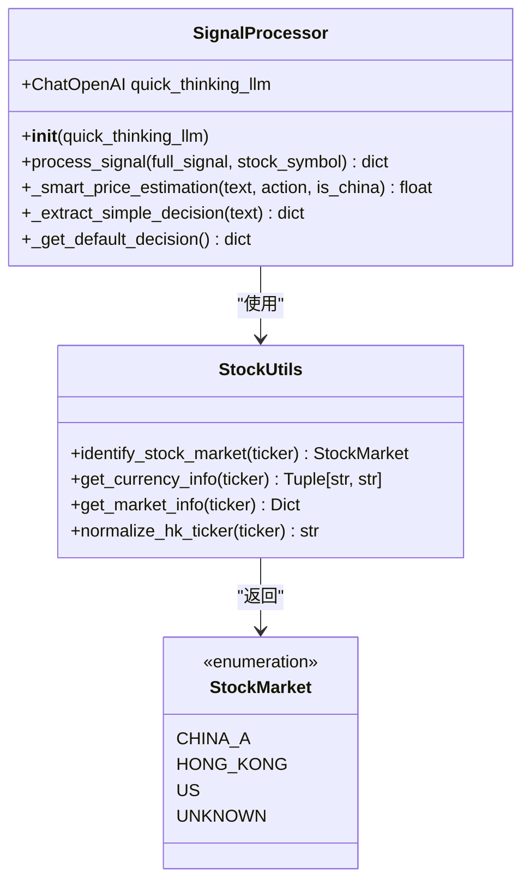
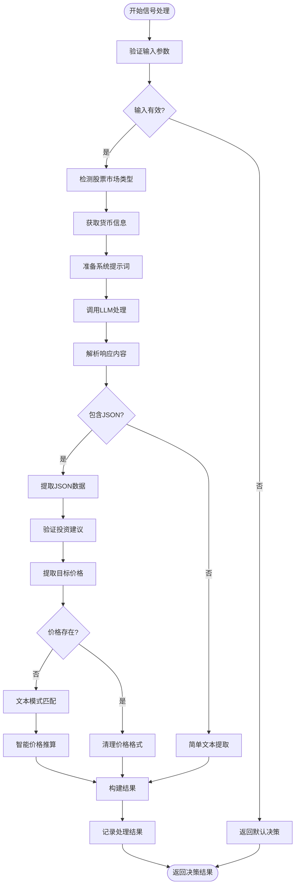
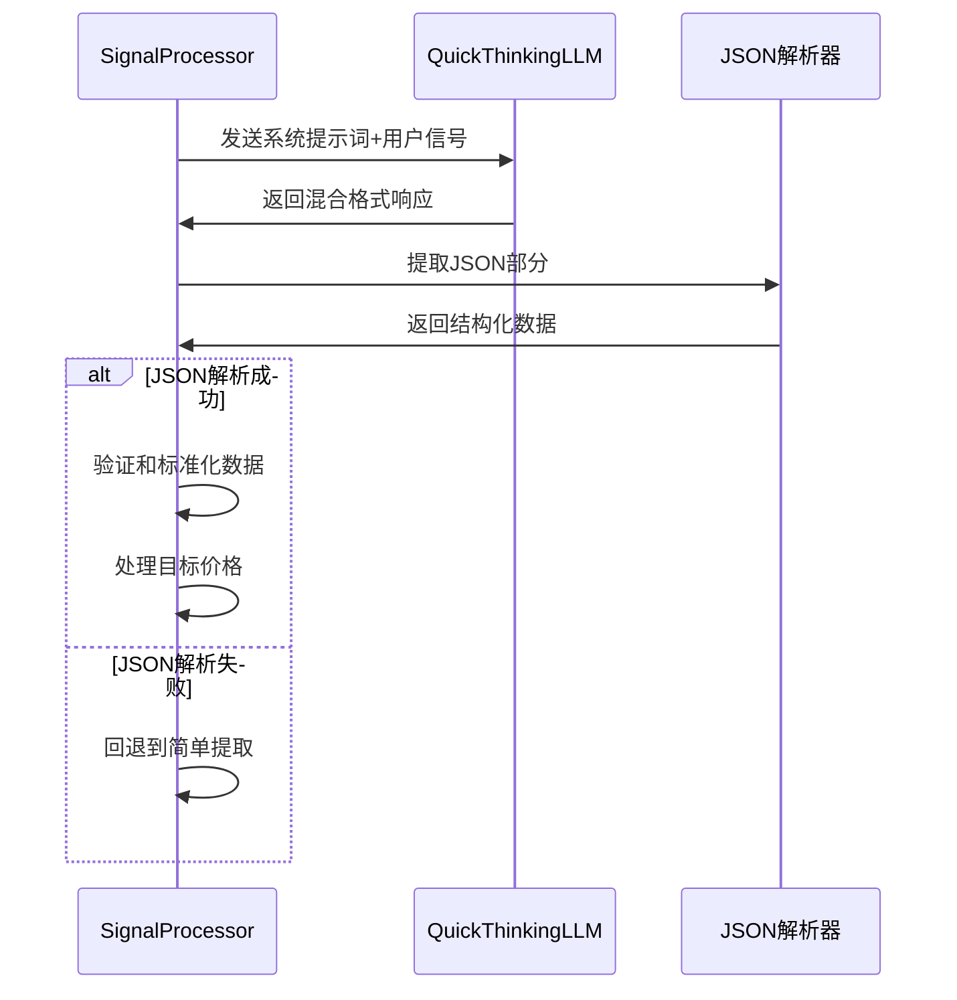
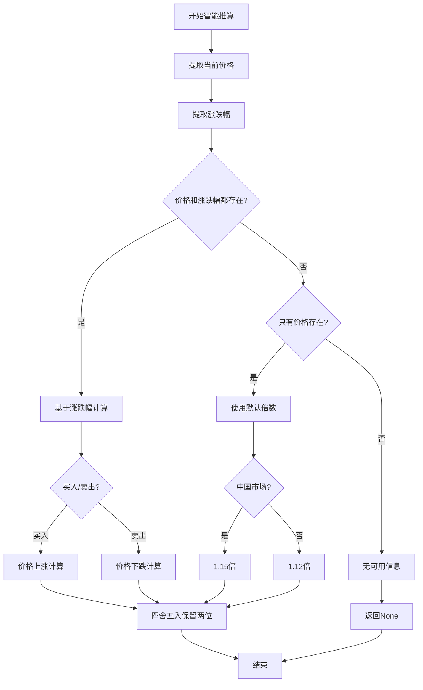
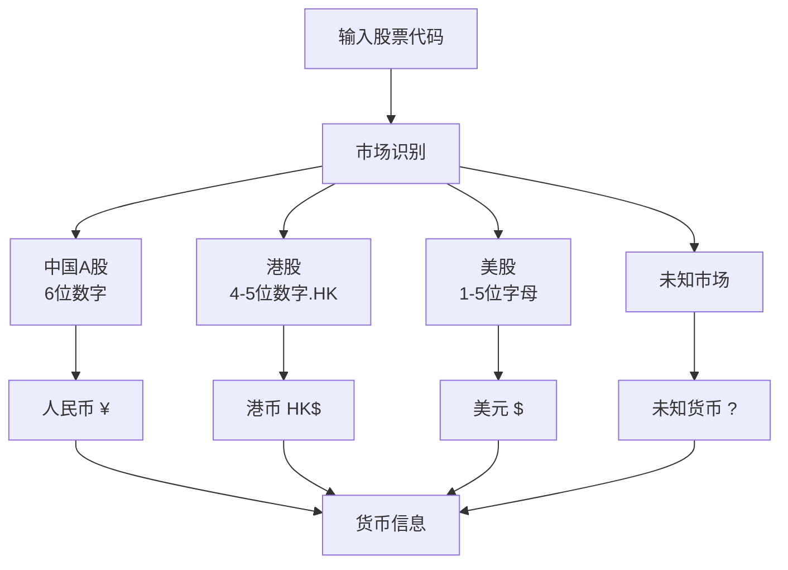
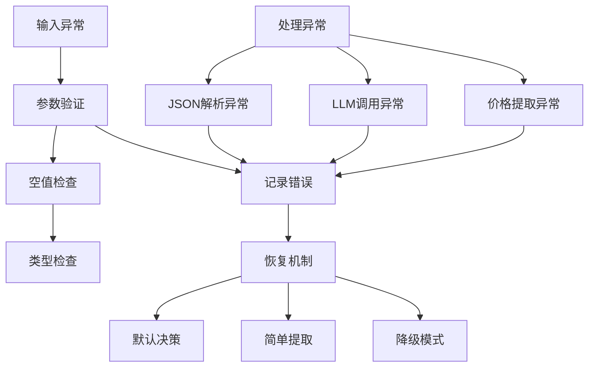
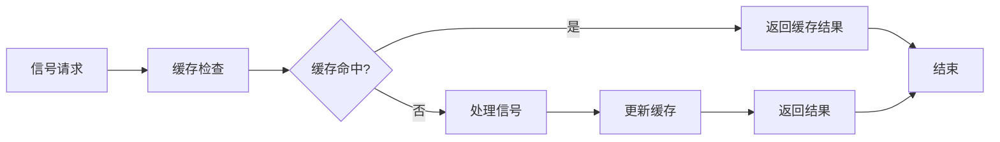

# 信号处理流程

<cite>
**本文档引用的文件**
- [signal_processing.py](file://tradingagents/graph/signal_processing.py)
- [trading_graph.py](file://tradingagents/graph/trading_graph.py)
- [stock_utils.py](file://tradingagents/utils/stock_utils.py)
- [test_signal_processor_fix.py](file://tests/test_signal_processor_fix.py)
- [test_signal_processor_debug.py](file://tests/test_signal_processor_debug.py)
- [test_chinese_output.py](file://tests/test_chinese_output.py)
</cite>

## 目录
1. [简介](#简介)
2. [SignalProcessor类架构](#signalprocessor类架构)
3. [核心工作流程](#核心工作流程)
4. [系统提示词设计](#系统提示词设计)
5. [LLM调用机制](#llm调用机制)
6. [JSON响应解析](#json响应解析)
7. [目标价格提取策略](#目标价格提取策略)
8. [多市场货币处理](#多市场货币处理)
9. [字段标准化处理](#字段标准化处理)
10. [异常处理机制](#异常处理机制)
11. [性能优化建议](#性能优化建议)
12. [实际应用案例](#实际应用案例)
13. [总结](#总结)

## 简介

SignalProcessor类是TradingAgents系统中的核心组件，负责将交易员的综合分析报告转化为可执行的交易信号。该类通过先进的自然语言处理技术和多层数据提取策略，实现了从非结构化文本到结构化投资决策的转换。

## SignalProcessor类架构



**图表来源**
- [signal_processing.py](file://tradingagents/graph/signal_processing.py#L10-L335)
- [stock_utils.py](file://tradingagents/utils/stock_utils.py#L15-L50)

**章节来源**
- [signal_processing.py](file://tradingagents/graph/signal_processing.py#L10-L335)
- [stock_utils.py](file://tradingagents/utils/stock_utils.py#L15-L219)

## 核心工作流程

SignalProcessor的process_signal方法采用多层次的数据提取策略，确保从各种格式的交易信号中准确提取关键信息。



**图表来源**
- [signal_processing.py](file://tradingagents/graph/signal_processing.py#L18-L213)

**章节来源**
- [signal_processing.py](file://tradingagents/graph/signal_processing.py#L18-L213)

## 系统提示词设计

SignalProcessor使用精心设计的系统提示词来指导LLM从交易信号中提取结构化信息。提示词包含以下关键要素：

### 提示词核心结构

| 组件 | 内容 | 目的 |
|------|------|------|
| 角色定义 | 专业金融分析助手 | 明确LLM的角色定位 |
| 输出要求 | JSON格式返回 | 确保结构化输出 |
| 字段规范 | action、target_price、confidence等 | 定义必需字段 |
| 数据验证 | 类型检查、范围限制 | 确保数据质量 |
| 语言要求 | 中文输出，禁止英文 | 符合用户需求 |

### 市场适配机制

系统根据不同的股票市场动态调整提示词内容：

- **A股市场**：强调人民币计价和国内法规
- **港股市场**：使用港币符号和港股特色术语  
- **美股市场**：采用美元计价和国际通用术语

**章节来源**
- [signal_processing.py](file://tradingagents/graph/signal_processing.py#L62-L89)

## LLM调用机制

SignalProcessor采用两阶段的LLM调用策略，确保最佳的处理效果：

### 第一阶段：JSON解析优先



**图表来源**
- [signal_processing.py](file://tradingagents/graph/signal_processing.py#L180-L213)

### 错误恢复机制

当JSON解析失败时，系统自动切换到简单文本提取模式，确保处理不中断。

**章节来源**
- [signal_processing.py](file://tradingagents/graph/signal_processing.py#L180-L213)

## JSON响应解析

### 解析策略层次

SignalProcessor采用三层解析策略：

1. **直接JSON解析**：优先尝试直接解析完整的JSON响应
2. **正则表达式提取**：当JSON不完整时，使用正则表达式提取
3. **简单文本提取**：作为最后的备选方案

### 数据验证与标准化


**图表来源**
- [signal_processing.py](file://tradingagents/graph/signal_processing.py#L138-L193)

**章节来源**
- [signal_processing.py](file://tradingagents/graph/signal_processing.py#L138-L193)

## 目标价格提取策略

SignalProcessor实现了多层次的目标价格提取机制，确保即使在缺乏明确价格信息的情况下也能做出合理的推断。

### 多重提取策略

| 策略层级 | 方法 | 适用场景 | 示例 |
|----------|------|----------|------|
| 1级直取 | JSON字段提取 | 明确的结构化数据 | `"target_price": 15.50` |
| 2级文本匹配 | 正则表达式 | 格式化的文本描述 | "目标价位: ¥15.50" |
| 3级智能推算 | 机器学习算法 | 缺乏明确价格信息 | 基于当前价格和涨跌幅推算 |

### 智能价格推算算法



**图表来源**
- [signal_processing.py](file://tradingagents/graph/signal_processing.py#L215-L278)

### 价格提取模式库

SignalProcessor维护了一个丰富的价格提取模式库，涵盖各种常见的价格表述方式：

| 模式类型 | 正则表达式 | 示例匹配 |
|----------|------------|----------|
| 目标价位 | `目标价[位格]?[：:]?\s*[¥\$]?(\d+(?:\.\d+)?)` | "目标价位: ¥15.50" |
| 价格区间 | `(\d+(?:\.\d+)?)\s*[到至]\s*(\d+(?:\.\d+)?)` | "价格区间: 15-16" |
| 建议价格 | `建议[：:]?\s*[¥\$]?(\d+(?:\.\d+)?)` | "建议价格: $190" |
| 预期价格 | `预期[：:]?\s*[¥\$]?(\d+(?:\.\d+)?)` | "预期价格: 15.50元" |

**章节来源**
- [signal_processing.py](file://tradingagents/graph/signal_processing.py#L145-L171)
- [signal_processing.py](file://tradingagents/graph/signal_processing.py#L215-L278)

## 多市场货币处理

SignalProcessor具备强大的跨市场货币处理能力，能够正确识别和处理不同市场的货币单位。

### 市场识别机制



**图表来源**
- [stock_utils.py](file://tradingagents/utils/stock_utils.py#L25-L45)

### 货币处理规则

| 市场类型 | 货币名称 | 货币符号 | 数据源 |
|----------|----------|----------|--------|
| 中国A股 | 人民币 | ¥ | china_unified |
| 港股 | 港币 | HK$ | yahoo_finance |
| 美股 | 美元 | $ | yahoo_finance |

### 价格格式标准化

系统自动处理不同市场的价格格式差异：

- **A股**：使用¥符号，保留两位小数
- **港股**：使用HK$符号，保留两位小数  
- **美股**：使用$符号，保留两位小数

**章节来源**
- [stock_utils.py](file://tradingagents/utils/stock_utils.py#L70-L95)
- [signal_processing.py](file://tradingagents/graph/signal_processing.py#L62-L68)

## 字段标准化处理

SignalProcessor实现了严格的字段标准化机制，确保输出的一致性和可靠性。

### 核心字段处理

| 字段名 | 数据类型 | 验证规则 | 默认值 |
|--------|----------|----------|--------|
| action | String | "买入"/"持有"/"卖出" | "持有" |
| target_price | Float | 数值类型，货币匹配 | None |
| confidence | Float | 0-1范围 | 0.7 |
| risk_score | Float | 0-1范围 | 0.5 |
| reasoning | String | 中文摘要 | "基于综合分析的投资建议" |

### 投资建议映射

系统提供了全面的英文和中文投资建议映射：

```python
action_map = {
    'buy': '买入', 'hold': '持有', 'sell': '卖出',
    'BUY': '买入', 'HOLD': '持有', 'SELL': '卖出',
    '购买': '买入', '保持': '持有', '出售': '卖出',
    'purchase': '买入', 'keep': '持有', 'dispose': '卖出'
}
```

### 数据清洗流程


**图表来源**
- [signal_processing.py](file://tradingagents/graph/signal_processing.py#L150-L160)

**章节来源**
- [signal_processing.py](file://tradingagents/graph/signal_processing.py#L150-L160)
- [signal_processing.py](file://tradingagents/graph/signal_processing.py#L195-L213)

## 异常处理机制

SignalProcessor实现了多层次的异常处理机制，确保系统的稳定性和鲁棒性。

### 异常处理层次



**图表来源**
- [signal_processing.py](file://tradingagents/graph/signal_processing.py#L26-L60)
- [signal_processing.py](file://tradingagents/graph/signal_processing.py#L210-L213)

### 日志记录策略

系统采用分级日志记录：

- **ERROR级别**：严重错误，影响功能完整性
- **WARNING级别**：警告信息，不影响功能
- **INFO级别**：重要操作和结果
- **DEBUG级别**：详细的技术信息

### 默认行为

当遇到不可恢复的错误时，系统返回默认的投资建议：

```python
{
    'action': '持有',
    'target_price': None,
    'confidence': 0.5,
    'risk_score': 0.5,
    'reasoning': '输入数据无效，默认持有建议'
}
```

**章节来源**
- [signal_processing.py](file://tradingagents/graph/signal_processing.py#L26-L60)
- [signal_processing.py](file://tradingagents/graph/signal_processing.py#L210-L213)

## 性能优化建议

为了最大化SignalProcessor的性能，建议采用以下优化策略：

### LLM调用优化

1. **模型选择**：使用专门的快速思考模型处理信号
2. **提示词优化**：精简提示词内容，减少Token消耗
3. **批量处理**：对多个信号进行批量处理

### 缓存策略



### 内存管理

- 及时释放大型对象
- 使用生成器处理大量数据
- 实施弱引用避免内存泄漏

### 并发处理

对于高并发场景，建议：

- 使用异步处理
- 实施队列机制
- 设置合理的超时时间

## 实际应用案例

### 案例1：中国A股信号处理

**输入信号**：
```
基于对平安银行(000001)的综合分析，我们建议持有该股票。

技术面分析显示当前价格为12.50元，目标价位为15.00元。
基本面分析表明公司财务状况良好，ROE为12.5%。

置信度：75%
风险评分：40%

最终交易建议: **持有**
```

**处理结果**：
```json
{
    "action": "持有",
    "target_price": 15.00,
    "confidence": 0.75,
    "risk_score": 0.40,
    "reasoning": "基于对平安银行的综合分析，建议持有该股票"
}
```

### 案例2：美股信号处理

**输入信号**：
```
Based on comprehensive analysis of Apple Inc. (AAPL), we recommend BUY.

Technical analysis shows current price at $150.00, target price $180.00.
Fundamental analysis indicates strong financial performance.

Confidence: 80%
Risk Score: 30%

Final Trading Recommendation: **BUY**
```

**处理结果**：
```json
{
    "action": "买入",
    "target_price": 180.00,
    "confidence": 0.80,
    "risk_score": 0.30,
    "reasoning": "基于对Apple Inc.的全面分析，建议买入"
}
```

### 案例3：复杂文本信号处理

**输入信号**：
```
经过深入分析，建议关注腾讯控股(0700.HK)的投资机会。

当前股价为450港元，技术指标显示突破迹象，
预计未来三个月内可能上涨至500港元左右。

投资建议：买入
置信度：85%
```

**处理结果**：
```json
{
    "action": "买入",
    "target_price": 500.00,
    "confidence": 0.85,
    "risk_score": 0.5,
    "reasoning": "技术指标显示突破迹象，预计未来三个月内可能上涨"
}
```

**章节来源**
- [test_signal_processor_fix.py](file://tests/test_signal_processor_fix.py#L30-L80)
- [test_signal_processor_debug.py](file://tests/test_signal_processor_debug.py#L20-L50)

## 总结

SignalProcessor类通过其精心设计的多层处理机制，成功地将复杂的交易信号转化为结构化的投资决策。其主要优势包括：

### 技术优势

1. **多模态处理能力**：支持JSON、文本等多种格式的信号输入
2. **智能价格推算**：即使缺乏明确价格信息也能做出合理推断
3. **跨市场兼容性**：无缝处理A股、港股、美股等不同市场的信号
4. **鲁棒性强**：完善的异常处理和恢复机制

### 应用价值

- **提高决策效率**：自动化处理大量交易信号
- **保证一致性**：标准化的输出格式确保决策的一致性
- **降低人工成本**：减少人工分析的工作量
- **提升准确性**：通过多层验证提高决策质量

### 发展方向

随着AI技术的发展，SignalProcessor可以进一步优化：

- 集成更多的机器学习模型
- 实施更精细的缓存策略
- 支持实时信号流处理
- 增强多语言处理能力

通过持续的优化和改进，SignalProcessor将继续在量化交易领域发挥重要作用，为投资者提供更加智能和可靠的投资决策支持。